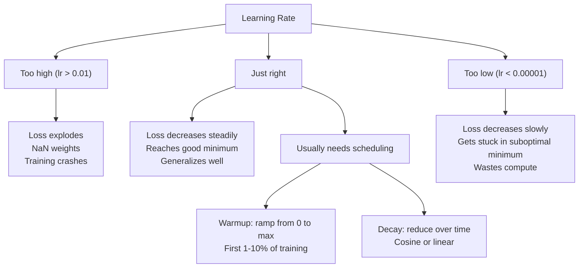
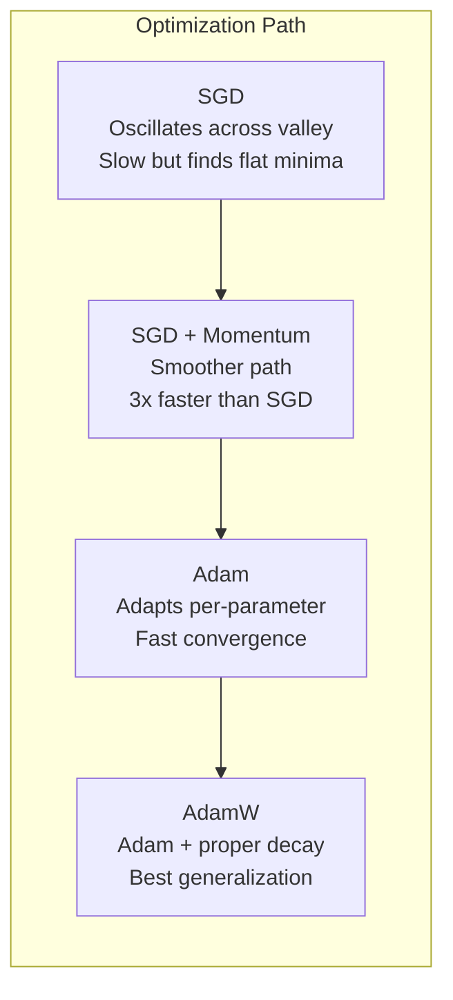
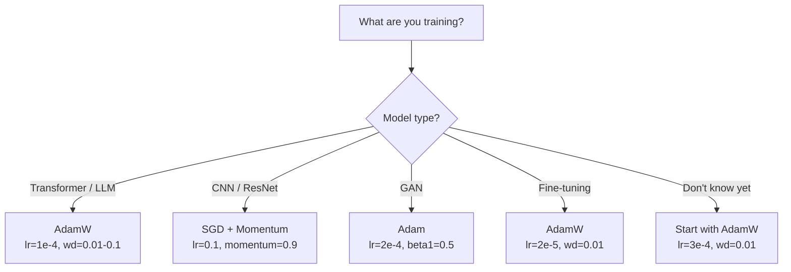

# Optimizer

> Gradient descent memberi tahu kamu arah mana yang harus bergerak. Ia tidak mengatakan apa pun tentang seberapa jauh atau seberapa cepat. SGD adalah kompas. Adam adalah GPS dengan data lalu lintas.

**Type:** Build
**Language:** Python
**Prerequisites:** Lesson 03.05 (Fungsi Rugi)
**Waktu:** ~75 menit

## Tujuan Pembelajaran

- Menerapkan SGD, SGD dengan optimizer momentum, Adam, dan AdamW dari awal dengan Python
- Jelaskan bagaimana koreksi bias Adam mengkompensasi estimasi momen yang diinisialisasi nol pada langkah training awal
- Tunjukkan mengapa AdamW menghasilkan generalisasi yang lebih baik daripada Adam dengan regularisasi L2 pada tugas yang sama
- Pilih optimizer dan hyperparameter default yang sesuai untuk Transformer, CNN, GAN, dan penyempurnaan

## Masalah

kamu menghitung gradient. kamu tahu bahwa berat #4,721 harus diturunkan sebesar 0,003 untuk mengurangi loss. Tapi 0,003 dalam satuan apa? Ditingkatkan oleh apa? Dan haruskah kamu memindahkan jumlah yang sama pada langkah 1 seperti pada langkah 1.000?

Gradient descent vanilla menerapkan learning rate yang sama untuk setiap parameter di setiap langkah: w = w - lr * gradient. Hal ini menciptakan tiga masalah yang membuat training neural network sulit dalam praktiknya.

Pertama, osilasi. Lanskap kehilangan jarang berbentuk seperti mangkuk halus. Ini lebih seperti lembah yang panjang dan sempit. Gradiennya mengarah melintasi lembah (arah curam), bukan sepanjang lembah (arah dangkal). Gradient descent memantul bolak-balik melintasi dimension sempit sambil membuat kemajuan kecil di sepanjang dimension yang berguna. kamu telah melihat ini: loss turun dengan cepat kemudian menjadi stabil, bukan karena modelnya konvergen tetapi karena modelnya berosilasi.

Kedua, satu learning rate untuk semua parameter salah. Beberapa weight memerlukan pembaruan besar-besaran (masih dalam phase awal dan underfitting). Yang lain memerlukan sedikit pembaruan (mendekati nilai optimalnya). Learning rate yang sesuai untuk yang pertama akan menghancurkan yang terakhir, dan sebaliknya.

Ketiga, titik pelana. Dalam high-dimensional, lanskap kehilangan memiliki wilayah datar yang luas dengan gradient mendekati nol. Vanilla SGD merayapinya dengan kecepatan gradient, yang secara efektif nol. Modelnya terlihat macet. Ia tidak terjebak -- ia berada di wilayah datar dengan turunan yang berguna di sisi lainnya. Namun SGD tidak memiliki mekanisme untuk mendorongnya.

Adam menyelesaikan ketiganya. Ia mempertahankan dua rata-rata berjalan per parameter -- gradient rata-rata (momentum, menangani osilasi) dan gradient kuadrat rata-rata (kecepatan adaptif, menangani skala yang berbeda). Dikombinasikan dengan koreksi bias untuk beberapa langkah pertama, ini memberi kamu optimizer tunggal yang bekerja pada 80% masalah dengan hyperparameter default. Lesson ini membangunnya dari awal sehingga kamu memahami dengan tepat kapan dan mengapa 20% lainnya gagal.

## Konsep

### Penurunan Gradient Stokastik (SGD)

Optimizer paling sederhana. Hitung gradient pada mini-batch dan melangkah ke arah yang berlawanan.

```
w = w - lr * gradient
```

"Stochastic" berarti kamu menggunakan subset data acak (mini-batch) untuk memperkirakan gradient, bukan dataset lengkap. Kebisingan ini sebenarnya berguna -- membantu menghindari tekanan minimum lokal yang tajam. Namun kebisingan juga menyebabkan osilasi.

Learning rate adalah satu-satunya tombol. Terlalu tinggi: kerugiannya berbeda-beda. Terlalu rendah: training memakan waktu lama. Nilai optimal bergantung pada arsitektur, data, ukuran batch, dan phase training saat ini. Untuk vanilla SGD di jaringan modern, nilai umumnya berkisar antara 0,01 hingga 0,1. Namun bahkan dalam satu kali training, learning rate ideal berubah.

### MomentumAnalogi bola-bergulir-menurun terlalu sering digunakan namun akurat. Daripada melangkah hanya berdasarkan gradient, kamu mempertahankan kecepatan yang terakumulasi melewati gradient.

```
m_t = beta * m_{t-1} + gradient
w = w - lr * m_t
```

Beta (biasanya 0,9) mengontrol berapa banyak riwayat yang disimpan. Dengan beta = 0,9, momentumnya kira-kira merupakan rata-rata dari 10 gradient terakhir (1 / (1 - 0,9) = 10).

Mengapa hal ini memperbaiki osilasi: gradient yang mengarah ke arah yang sama terakumulasi. Gradient yang membalikkan arah akan hilang. Di lembah sempit itu, komponen "melintasi" membalik setiap langkah dan menjadi basah. Komponen "sepanjang" tetap konsisten dan diperkuat. Hasilnya adalah akselerasi mulus ke arah yang bermanfaat.

Angka riil: SGD saja pada kondisi loss yang buruk mungkin memerlukan 10.000 langkah. SGD dengan momentum (beta=0,9) biasanya memerlukan 3.000-5.000 langkah pada soal yang sama. Percepatannya tidaklah kecil.

### RMSProp

Metode learning rate adaptif per parameter pertama yang benar-benar berhasil. Diusulkan oleh Hinton dalam kuliah Coursera (tidak pernah dipublikasikan secara resmi).

```
s_t = beta * s_{t-1} + (1 - beta) * gradient^2
w = w - lr * gradient / (sqrt(s_t) + epsilon)
```

s_t melacak rata-rata gradient kuadrat yang berjalan. Parameter dengan gradient besar yang konsisten akan dibagi dengan angka yang besar (learning rate efektif lebih kecil). Parameter dengan gradient kecil dibagi dengan angka kecil (learning rate efektif lebih besar).

Ini memecahkan masalah "satu learning rate untuk semua parameter". Weight yang telah mendapatkan pembaruan besar-besaran mungkin sudah mendekati targetnya -- memperlambatnya. Weight yang mendapat pembaruan kecil mungkin kurang dilatih -- percepat.

Epsilon (biasanya 1e-8) mencegah pembagian dengan nol ketika parameter belum diperbarui.

### Adam: Momentum + RMSProp

Adam menggabungkan kedua gagasan tersebut. Ia mempertahankan dua rata-rata pergerakan eksponensial per parameter:

```
m_t = beta1 * m_{t-1} + (1 - beta1) * gradient        (first moment: mean)
v_t = beta2 * v_{t-1} + (1 - beta2) * gradient^2       (second moment: variance)
```

**Koreksi bias** adalah detail utama yang dilewati sebagian besar penjelasan. Pada langkah 1, m_1 = (1 - beta1) * gradient. Dengan beta1 = 0,9, itu berarti 0,1 * gradient -- sepuluh kali lebih kecil. Rata-rata pergerakan belum memanas. Koreksi bias mengkompensasi:

```
m_hat = m_t / (1 - beta1^t)
v_hat = v_t / (1 - beta2^t)
```

Pada langkah 1 dengan beta1 = 0.9: m_hat = m_1 / (1 - 0.9) = m_1 / 0.1 = gradient sebenarnya. Pada langkah 100: (1 - 0,9^100) kira-kira 1,0, sehingga koreksinya hilang. Koreksi bias penting untuk ~10 langkah pertama dan tidak relevan setelah ~50.

Pembaruan:

```
w = w - lr * m_hat / (sqrt(v_hat) + epsilon)
```

Default Adam: lr = 0,001, beta1 = 0,9, beta2 = 0,999, epsilon = 1e-8. Default ini berfungsi untuk 80% masalah. Jika tidak, ubah dulu. Kemudian beta2. Hampir tidak pernah mengubah beta1 atau epsilon.

### AdamW: Penurunan Berat Badan Dilakukan dengan Benar

Regularisasi L2 menambah loss lambda * w^2. Dalam vanilla SGD, ini setara dengan peluruhan weight (mengurangi lambda * w dari weight di setiap langkah). Dalam diri Adam, kesetaraan ini terputus.

Wawasan Loshchilov & Hutter: saat kamu menambahkan L2 ke loss dan kemudian Adam memproses gradient, learning rate adaptif juga menskalakan istilah regularisasi. Parameter dengan varian gradient yang besar mendapatkan lebih sedikit regularisasi. Parameter dengan varians kecil mendapatkan lebih banyak. Ini bukan yang kamu inginkan -- kamu menginginkan regularisasi yang seragam terlepas dari statistik gradiennya.

AdamW memperbaikinya dengan menerapkan peluruhan weight langsung ke weight, setelah pembaruan Adam:

```
w = w - lr * m_hat / (sqrt(v_hat) + epsilon) - lr * lambda * w
```

Suku peluruhan berat (lr * lambda * w) tidak diskalakan oleh faktor adaptif Adam. Setiap parameter mendapat penyusutan proporsional yang sama.Tampaknya ini hanyalah detail kecil. Bukan itu. AdamW menyatu menjadi solusi yang lebih baik daripada regularisasi Adam + L2 di hampir setiap tugas. Ini adalah optimizer default di PyTorch untuk Transformer training, model difusi, dan sebagian besar arsitektur modern. BERT, GPT, LLaMA, Difusi Stabil -- semuanya dilatih dengan AdamW.

### Kecepatan Pembelajaran: Hyperparameter Paling Penting



Jika kamu menyetel satu hyperparameter, sesuaikan learning rate-nya. Perubahan 10x dalam learning rate lebih penting daripada keputusan arsitektur apa pun yang kamu buat. Default umum:

- SGD: lr = 0,01 hingga 0,1
- Adam/AdamW: lr = 1e-4 hingga 3e-4
- Menyempurnakan model terlatih: lr = 1e-5 hingga 5e-5
- Pemanasan learning rate: peningkatan linier pada 1-10% langkah pertama

### Perbandingan Optimizer



### Saat Setiap Optimizer Menang



## Build

### Langkah 1: Vanila SGD

```python
class SGD:
    def __init__(self, lr=0.01):
        self.lr = lr

    def step(self, params, grads):
        for i in range(len(params)):
            params[i] -= self.lr * grads[i]
```

### Langkah 2: SGD dengan Momentum

```python
class SGDMomentum:
    def __init__(self, lr=0.01, beta=0.9):
        self.lr = lr
        self.beta = beta
        self.velocities = None

    def step(self, params, grads):
        if self.velocities is None:
            self.velocities = [0.0] * len(params)
        for i in range(len(params)):
            self.velocities[i] = self.beta * self.velocities[i] + grads[i]
            params[i] -= self.lr * self.velocities[i]
```

### Langkah 3: Adam

```python
import math

class Adam:
    def __init__(self, lr=0.001, beta1=0.9, beta2=0.999, epsilon=1e-8):
        self.lr = lr
        self.beta1 = beta1
        self.beta2 = beta2
        self.epsilon = epsilon
        self.m = None
        self.v = None
        self.t = 0

    def step(self, params, grads):
        if self.m is None:
            self.m = [0.0] * len(params)
            self.v = [0.0] * len(params)

        self.t += 1

        for i in range(len(params)):
            self.m[i] = self.beta1 * self.m[i] + (1 - self.beta1) * grads[i]
            self.v[i] = self.beta2 * self.v[i] + (1 - self.beta2) * grads[i] ** 2

            m_hat = self.m[i] / (1 - self.beta1 ** self.t)
            v_hat = self.v[i] / (1 - self.beta2 ** self.t)

            params[i] -= self.lr * m_hat / (math.sqrt(v_hat) + self.epsilon)
```

### Langkah 4: AdamW

```python
class AdamW:
    def __init__(self, lr=0.001, beta1=0.9, beta2=0.999, epsilon=1e-8, weight_decay=0.01):
        self.lr = lr
        self.beta1 = beta1
        self.beta2 = beta2
        self.epsilon = epsilon
        self.weight_decay = weight_decay
        self.m = None
        self.v = None
        self.t = 0

    def step(self, params, grads):
        if self.m is None:
            self.m = [0.0] * len(params)
            self.v = [0.0] * len(params)

        self.t += 1

        for i in range(len(params)):
            self.m[i] = self.beta1 * self.m[i] + (1 - self.beta1) * grads[i]
            self.v[i] = self.beta2 * self.v[i] + (1 - self.beta2) * grads[i] ** 2

            m_hat = self.m[i] / (1 - self.beta1 ** self.t)
            v_hat = self.v[i] / (1 - self.beta2 ** self.t)

            params[i] -= self.lr * m_hat / (math.sqrt(v_hat) + self.epsilon)
            params[i] -= self.lr * self.weight_decay * params[i]
```

### Langkah 5: Perbandingan Training

Latih jaringan dua layer yang sama pada dataset lingkaran dari lesson 05 dengan keempat optimizer. Bandingkan konvergensi.

```python
import random

def sigmoid(x):
    x = max(-500, min(500, x))
    return 1.0 / (1.0 + math.exp(-x))

def make_circle_data(n=200, seed=42):
    random.seed(seed)
    data = []
    for _ in range(n):
        x = random.uniform(-2, 2)
        y = random.uniform(-2, 2)
        label = 1.0 if x * x + y * y < 1.5 else 0.0
        data.append(([x, y], label))
    return data


class OptimizerTestNetwork:
    def __init__(self, optimizer, hidden_size=8):
        random.seed(0)
        self.hidden_size = hidden_size
        self.optimizer = optimizer

        self.w1 = [[random.gauss(0, 0.5) for _ in range(2)] for _ in range(hidden_size)]
        self.b1 = [0.0] * hidden_size
        self.w2 = [random.gauss(0, 0.5) for _ in range(hidden_size)]
        self.b2 = 0.0

    def get_params(self):
        params = []
        for row in self.w1:
            params.extend(row)
        params.extend(self.b1)
        params.extend(self.w2)
        params.append(self.b2)
        return params

    def set_params(self, params):
        idx = 0
        for i in range(self.hidden_size):
            for j in range(2):
                self.w1[i][j] = params[idx]
                idx += 1
        for i in range(self.hidden_size):
            self.b1[i] = params[idx]
            idx += 1
        for i in range(self.hidden_size):
            self.w2[i] = params[idx]
            idx += 1
        self.b2 = params[idx]

    def forward(self, x):
        self.x = x
        self.z1 = []
        self.h = []
        for i in range(self.hidden_size):
            z = self.w1[i][0] * x[0] + self.w1[i][1] * x[1] + self.b1[i]
            self.z1.append(z)
            self.h.append(max(0.0, z))

        self.z2 = sum(self.w2[i] * self.h[i] for i in range(self.hidden_size)) + self.b2
        self.out = sigmoid(self.z2)
        return self.out

    def compute_grads(self, target):
        eps = 1e-15
        p = max(eps, min(1 - eps, self.out))
        d_loss = -(target / p) + (1 - target) / (1 - p)
        d_sigmoid = self.out * (1 - self.out)
        d_out = d_loss * d_sigmoid

        grads = [0.0] * (self.hidden_size * 2 + self.hidden_size + self.hidden_size + 1)
        idx = 0
        for i in range(self.hidden_size):
            d_relu = 1.0 if self.z1[i] > 0 else 0.0
            d_h = d_out * self.w2[i] * d_relu
            grads[idx] = d_h * self.x[0]
            grads[idx + 1] = d_h * self.x[1]
            idx += 2

        for i in range(self.hidden_size):
            d_relu = 1.0 if self.z1[i] > 0 else 0.0
            grads[idx] = d_out * self.w2[i] * d_relu
            idx += 1

        for i in range(self.hidden_size):
            grads[idx] = d_out * self.h[i]
            idx += 1

        grads[idx] = d_out
        return grads

    def train(self, data, epochs=300):
        losses = []
        for epoch in range(epochs):
            total_loss = 0.0
            correct = 0
            for x, y in data:
                pred = self.forward(x)
                grads = self.compute_grads(y)
                params = self.get_params()
                self.optimizer.step(params, grads)
                self.set_params(params)

                eps = 1e-15
                p = max(eps, min(1 - eps, pred))
                total_loss += -(y * math.log(p) + (1 - y) * math.log(1 - p))
                if (pred >= 0.5) == (y >= 0.5):
                    correct += 1
            avg_loss = total_loss / len(data)
            accuracy = correct / len(data) * 100
            losses.append((avg_loss, accuracy))
            if epoch % 75 == 0 or epoch == epochs - 1:
                print(f"    Epoch {epoch:3d}: loss={avg_loss:.4f}, accuracy={accuracy:.1f}%")
        return losses
```

## Pakai

Optimizer PyTorch menangani grup parameter, kliping gradient, dan penjadwalan learning rate:

```python
import torch
import torch.optim as optim

model = torch.nn.Sequential(
    torch.nn.Linear(784, 256),
    torch.nn.ReLU(),
    torch.nn.Linear(256, 10),
)

optimizer = optim.AdamW(model.parameters(), lr=3e-4, weight_decay=0.01)

scheduler = optim.lr_scheduler.CosineAnnealingLR(optimizer, T_max=100)

for epoch in range(100):
    optimizer.zero_grad()
    output = model(torch.randn(32, 784))
    loss = torch.nn.functional.cross_entropy(output, torch.randint(0, 10, (32,)))
    loss.backward()
    torch.nn.utils.clip_grad_norm_(model.parameters(), max_norm=1.0)
    optimizer.step()
    scheduler.step()
```

Polanya selalu: zero_grad, maju, rugi, mundur, (klip), langkah, (jadwal). Hafalkan pesanan ini. Melakukan kesalahan (misalnya, memanggil scheduler.step() sebelum optimizer.step()) adalah sumber umum bug halus.

Untuk CNN, banyak praktisi yang masih lebih memilih SGD + momentum (lr=0.1, momentum=0.9, Weight_decay=1e-4) dengan jadwal langkah atau kosinus. SGD menemukan nilai minimum yang lebih datar, yang sering kali dapat digeneralisasikan dengan lebih baik. Untuk Transformer dan LLM, AdamW dengan pemanasan + peluruhan kosinus adalah standar universal. Jangan melawan konsensus tanpa alasan yang terukur.

## Kirim

Lesson ini menghasilkan:
- `outputs/prompt-optimizer-selector.md` -- permintaan keputusan untuk memilih optimizer dan learning rate yang tepat untuk arsitektur apa pun

## Latihan

1. Implementasikan momentum Nesterov, dimana kamu menghitung gradient pada posisi "lookahead" (w - lr * beta * v) dan bukan pada posisi saat ini. Bandingkan konvergensi dengan momentum standar pada dataset lingkaran.

2. Terapkan jadwal pemanasan learning rate: jalur linier dari 0 ke max_lr selama 10% langkah training pertama, lalu peluruhan kosinus menjadi 0. Berlatih dengan pemanasan Adam + vs Adam tanpa pemanasan. Ukur berapa zaman yang diperlukan untuk mencapai akurasi 90% pada dataset lingkaran.

3. Lacak learning rate efektif untuk setiap parameter selama training Adam. Tarif efektifnya adalah lr * m_hat / (sqrt(v_hat) + eps). Plot distribusi tarif efektif setelah 10, 50, dan 200 langkah. Apakah semua parameter diperbarui dengan kecepatan yang sama?

4. Menerapkan kliping gradient (dipotong berdasarkan norm global). Tetapkan norm gradient maks ke 1.0. Berlatih dengan dan tanpa kliping menggunakan learning rate tinggi (lr=0,01 untuk Adam). Hitung berapa banyak proses yang menyimpang (loss terjadi pada NaN) dengan dan tanpa memotong lebih dari 10 benih acak.

5. Bandingkan Adam vs AdamW pada jaringan dengan weight besar. Inisialisasi semua weight ke nilai acak di [-5, 5] (jauh lebih besar dari biasanya). Berlatih selama 200 epoch dengan Weight_decay=0.1. Plot norm weight L2 di atas training untuk kedua optimizer. AdamW seharusnya menunjukkan penyusutan weight yang lebih cepat.

## Istilah Kunci| Istilah | Apa kata orang | Apa sebenarnya arti |
|------|----------------|----------------------|
| Learning rate | "Ukuran langkah" | Pengganda scalar pada pembaruan gradient; satu-satunya hyperparameter yang paling berpengaruh dalam training |
| SGD | "Gradient descent dasar" | Gradient descent stokastik: perbarui weight dengan mengurangi gradient lr *, dihitung pada mini-batch |
| Momentum | "Analogi bola bergulir" | Rata-rata pergerakan eksponensial dari gradient masa lalu; meredam osilasi dan mempercepat arah yang konsisten |
| RMSProp | "Learning rate adaptif" | Membagi gradient setiap parameter dengan RMS yang berjalan dari gradient terbarunya; menyamakan learning rate |
| adam | "Optimizer default" | Menggabungkan momentum (momen pertama) dan RMSProp (momen kedua) dengan koreksi bias untuk langkah awal |
| AdamW | "Adam melakukannya dengan benar" | Adam dengan penurunan berat badan yang dipisahkan; menerapkan regularisasi langsung ke weight, bukan melalui gradient |
| Koreksi bias | "Pemanasan untuk lari rata-rata" | Membagi dengan (1 - beta^t) untuk mengkompensasi inisialisasi nol perkiraan momen Adam |
| Penurunan berat badan | "Kecilkan weight" | Mengurangi sebagian kecil dari nilai weight pada setiap langkah; pengatur yang menghukum weight besar |
| Learning rate schedule | "Berubah seiring waktu" | Sebuah fungsi yang menyesuaikan learning rate selama training; pemanasan + peluruhan kosinus adalah default modern |
| Kliping gradient | "Membatasi norm gradient" | Memperkecil vector gradient ketika normanya melebihi ambang batas; mencegah meledaknya pembaruan gradient |

## Bacaan Lanjutan

- Kingma & Ba, "Adam: A Method for Stochastic Optimization" (2014) -- makalah Adam asli dengan analisis konvergensi dan derivasi koreksi bias
- Loshchilov & Hutter, "Regulerisasi Peluruhan Berat Terpisah" (2017) -- membuktikan bahwa regularisasi L2 dan penurunan berat tidak setara di Adam, dan mengusulkan AdamW
- Smith, "Cyclical Learning Rates for Training Neural Networks" (2017) -- memperkenalkan pengujian rentang LR dan jadwal siklus yang menghilangkan kebutuhan untuk menyesuaikan learning rate tetap
- Ruder, "Anview of Gradient Descent Optimization Algorithms" (2016) -- survei tunggal terbaik dari semua varian optimizer, dengan perbandingan dan intuisi yang jelas
