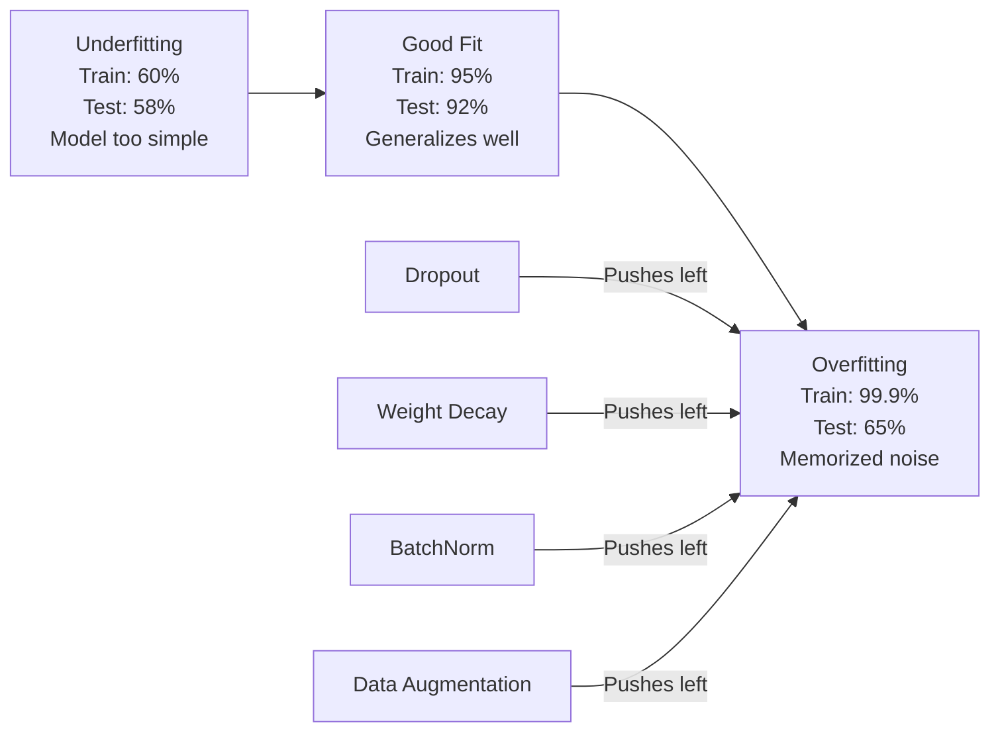
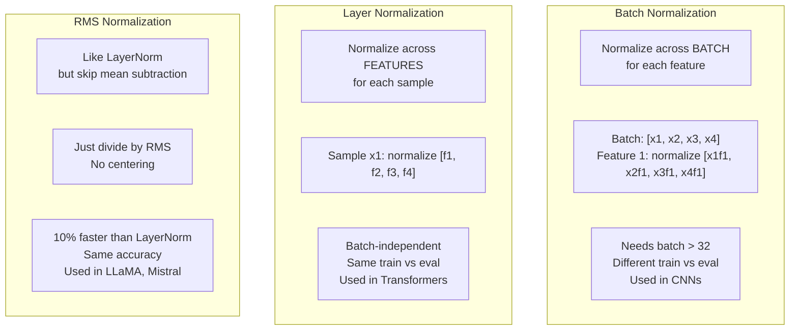
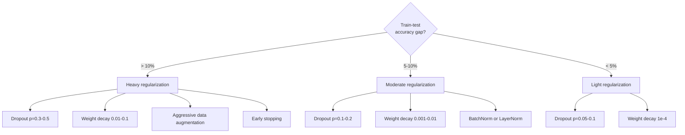

# Regularisasi

> Model kamu mendapatkan 99% pada training data dan 60% pada data pengujian. Itu menghafal bukannya belajar. Regularisasi adalah pajak yang kamu kenakan pada kompleksitas untuk memaksakan generalisasi.

**Type:** Build
**Language:** Python
**Prerequisites:** Lesson 03.06 (Optimizer)
**Waktu:** ~75 menit

## Tujuan Pembelajaran

- Menerapkan dropout dengan penskalaan terbalik, peluruhan weight L2, normalisasi batch, normalisasi layer, dan RMSNorm dari awal
- Ukur kesenjangan akurasi pengujian training dan diagnosis overfitting menggunakan eksperimen regularisasi
- Jelaskan mengapa Transformer menggunakan LayerNorm daripada BatchNorm dan mengapa LLM modern lebih memilih RMSNorm
- Terapkan kombinasi teknik regularisasi yang tepat berdasarkan tingkat keparahan overfitting

## Masalah

Jaringan saraf dengan parameter yang cukup dapat mengingat dataset apa pun. Ini bukan hipotesis -- Zhang dkk. (2017) membuktikannya dengan melatih jaringan standar di ImageNet dengan label acak. Jaringan mencapai loss training mendekati nol pada penetapan label yang sepenuhnya acak. Mereka menghafal jutaan pasangan input-output acak tanpa pola untuk dipelajari. Kehilangan training itu sempurna. Akurasi tes adalah nol.

Ini adalah masalah overfitting, dan menjadi lebih buruk seiring bertambahnya ukuran model. GPT-3 memiliki 175 miliar parameter. Set training memiliki sekitar 500 miliar token. Dengan parameter sebanyak itu, model memiliki kapasitas yang cukup untuk mengingat sebagian besar training data secara verbatim. Tanpa regularisasi, hal ini hanya akan memunculkan contoh-contoh training alih-alih mempelajari pola-pola yang dapat digeneralisasikan.

Kesenjangan antara kinerja training dan kinerja pengujian adalah kesenjangan yang berlebihan. Setiap teknik dalam lesson ini menyerang celah tersebut dari sudut yang berbeda. Dropout memaksa jaringan untuk tidak bergantung pada satu neuron pun. Penurunan berat badan mencegah berat badan bertambah terlalu besar. Normalisasi batch memperhalus loss landscape sehingga optimizer menemukan nilai minimum yang lebih datar dan dapat digeneralisasikan. Normalisasi layer melakukan hal yang sama tetapi berfungsi jika normalisasi batch gagal (batch kecil, urutan panjang variabel). RMSNorm melakukannya 10% lebih cepat dengan menghilangkan penghitungan rata-rata. Setiap tekniknya sederhana. Bersama-sama, itulah perbedaan antara model yang menghafal dan model yang menggeneralisasi.

## Konsep

### Spektrum Overfitting

Setiap model berada pada spektrum mulai dari underfitting (terlalu sederhana untuk menangkap polanya) hingga overfitting (sangat rumit sehingga menangkap noise). Titik terbaiknya ada di antara keduanya, dan regularisasi mendorong model ke arah tersebut dari sisi overfit.



### Putus sekolah

Teknik regularisasi paling sederhana dengan interpretasi paling elegan. Selama training, atur output setiap neuron secara acak ke nol dengan probabilitas p.

```
output = activation(z) * mask    where mask[i] ~ Bernoulli(1 - p)
```

Dengan p = 0,5, separuh neuron dipusatkan pada setiap lintasan maju. Jaringan harus mempelajari representasi redundan karena tidak dapat memprediksi neuron mana yang akan tersedia. Hal ini mencegah adaptasi bersama -- neuron belajar untuk bergantung pada neuron tertentu lainnya yang ada.

Interpretasi ansambel: jaringan dengan N neuron dan dropout menciptakan 2^N kemungkinan subjaringan (setiap kombinasi neuron aktif atau nonaktif). Training dengan dropout kira-kira melatih semua 2^N subjaringan secara bersamaan, masing-masing pada mini-batch yang berbeda. Pada waktu pengujian, kamu menggunakan semua neuron (tanpa putus sekolah) dan menskalakan output sebesar (1 - p) agar sesuai dengan nilai yang diharapkan selama training. Hal ini setara dengan merata-ratakan prediksi 2^N subjaringan -- kumpulan besar dari satu model.Dalam praktiknya, penskalaan diterapkan selama training alih-alih pengujian (dropout terbalik):

```
During training:  output = activation(z) * mask / (1 - p)
During testing:   output = activation(z)   (no change needed)
```

Ini lebih bersih karena code pengujian tidak perlu mengetahui tentang dropout sama sekali.

Tarif default: p = 0,1 untuk Transformer, p = 0,5 untuk MLP, p = 0,2-0,3 untuk CNN. Tingkat putus sekolah yang lebih tinggi = regularisasi yang lebih kuat = risiko yang lebih rendah.

### Penurunan Berat Badan (Regulerisasi L2)

Tambahkan besaran kuadrat semua weight ke loss:

```
total_loss = task_loss + (lambda / 2) * sum(w_i^2)
```

Gradient suku regularisasi adalah lambda * w. Ini berarti pada setiap langkah, setiap weight menyusut menuju nol sebesar sepersekian yang sebanding dengan besarnya. Weight yang besar mendapat hukuman lebih banyak. Model ini didorong ke arah solusi dimana tidak ada weight tunggal yang mendominasi.

Mengapa hal ini membantu generalisasi: model overfit cenderung memiliki weight besar yang memperkuat noise dalam training data. Peluruhan weight membuat weight tetap kecil, sehingga membatasi kapasitas efektif model dan memaksa model untuk mengandalkan feature yang kuat dan dapat digeneralisasikan, bukan pada kebiasaan yang diingat.

Hyperparameter lambda mengontrol kekuatan. Nilai-nilai khas:

- 0,01 untuk AdamW pada trafo
- 1e-4 untuk SGD di CNN
- 0,1 untuk model yang sangat overfit

Seperti yang dibahas dalam lesson 06: penurunan berat badan dan regularisasi L2 setara di SGD tetapi tidak di Adam. Selalu gunakan AdamW (peluruhan berat badan yang dipisahkan) saat berlatih dengan Adam.

### Normalisasi Batch

Normalisasikan output setiap layer di seluruh mini-batch sebelum meneruskannya ke layer berikutnya.

Untuk sejumlah kecil activation pada layer tertentu:

```
mu = (1/B) * sum(x_i)           (batch mean)
sigma^2 = (1/B) * sum((x_i - mu)^2)   (batch variance)
x_hat = (x_i - mu) / sqrt(sigma^2 + eps)   (normalize)
y = gamma * x_hat + beta        (scale and shift)
```

Gamma dan beta adalah parameter yang dapat dipelajari yang memungkinkan jaringan membatalkan normalisasi jika sudah optimal. Tanpa mereka, kamu akan memaksa output setiap layer menjadi variansi unit rata-rata nol, yang mungkin bukan yang diinginkan jaringan.

**Pembagian training vs inference:** Selama training, mu dan sigma berasal dari mini-batch saat ini. Selama inference, kamu menggunakan rata-rata lari yang terakumulasi selama latihan (rata-rata pergerakan eksponensial dengan momentum = 0,1, artinya 90% lama + 10% baru).

Mengapa BatchNorm berfungsi masih diperdebatkan. Makalah asli mengklaim hal ini mengurangi "pergeseran kovariat internal" (distribusi input layer berubah seiring pembaruan layer sebelumnya). Santurkar dkk. (2018) menunjukkan penjelasan ini salah. Alasan sebenarnya: BatchNorm membuat loss landscape menjadi lebih lancar. Gradiennya lebih prediktif, konstanta Lipschitz lebih kecil, dan optimizer dapat mengambil langkah lebih besar dengan aman. Inilah sebabnya BatchNorm memungkinkan kamu menggunakan learning rate yang lebih tinggi dan konvergensi lebih cepat.

BatchNorm memiliki batasan mendasar: bergantung pada statistik batch. Dengan ukuran batch 1, mean dan varians tidak ada artinya. Dengan batch kecil (<32), statistiknya menimbulkan gangguan dan menurunkan kinerja. Hal ini penting untuk tugas-tugas seperti deteksi objek (yang memorinya membatasi ukuran batch) dan pemodelan bahasa (yang panjang urutannya bervariasi).

### Normalisasi Layer

Normalisasikan seluruh feature, bukan seluruh batch. Untuk satu sample:

```
mu = (1/D) * sum(x_j)           (feature mean)
sigma^2 = (1/D) * sum((x_j - mu)^2)   (feature variance)
x_hat = (x_j - mu) / sqrt(sigma^2 + eps)
y = gamma * x_hat + beta
```

D adalah dimension feature. Setiap sample dinormalisasi secara independen -- tidak bergantung pada ukuran batch. Inilah sebabnya mengapa Transformer menggunakan LayerNorm, bukan BatchNorm. Urutan memiliki panjang yang bervariasi, ukuran batch seringkali kecil (atau 1 selama pembuatan), dan komputasinya identik antara training dan inference.

LayerNorm pada Transformer diterapkan setelah setiap blok attention mandiri dan setiap blok umpan maju (Pasca-LN), atau sebelum blok tersebut (Pra-LN, yang lebih stabil untuk training).

### RMSNormLayerNorm tanpa pengurangan rata-rata. Diusulkan oleh Zhang & Sennrich (2019).

```
rms = sqrt((1/D) * sum(x_j^2))
y = gamma * x / rms
```

Itu saja. Tidak ada perhitungan berarti, tidak ada parameter beta. Pengamatan: pemusatan ulang (pengurangan rata-rata) di LayerNorm memberikan kontribusi yang sangat kecil terhadap kinerja model, tetapi memerlukan komputasi. Menghapusnya memberikan akurasi yang sama dengan overhead sekitar 10% lebih sedikit.

LLaMA, LLaMA 2, LLaMA 3, Mistral, dan sebagian besar LLM modern menggunakan RMSNorm, bukan LayerNorm. Pada skala miliaran parameter dan triliunan token, penghematan 10% tersebut sangatlah signifikan.

### Perbandingan Normalisasi



### Augmentasi Data sebagai Regularisasi

Bukan modifikasi model melainkan modifikasi data. Ubah input training sambil mempertahankan label:

- Gambar: pemotongan acak, flip, rotasi, jitter warna, potongan
- Teks: penggantian sinonim, terjemahan kembali, penghapusan acak
- Audio: rentang waktu, pergeseran nada, penambahan kebisingan

Efeknya identik dengan regularisasi: efek ini meningkatkan ukuran efektif set training, sehingga mempersulit model untuk mengingat contoh spesifik. Model yang hanya melihat setiap gambar satu kali dalam bentuk aslinya dapat mengingatnya. Model yang melihat 50 versi augmented dari setiap gambar dipaksa untuk mempelajari struktur invarian.

### Berhenti Dini

Pengatur paling sederhana: hentikan training ketika kehilangan validasi mulai meningkat. Modelnya belum overfit pada saat itu. Dalam praktiknya, kamu melacak kehilangan validasi setiap periode, menyimpan model terbaik, dan melanjutkan training untuk jangka waktu "kesabaran" (biasanya 5-20 periode). Jika kehilangan validasi tidak membaik dalam jendela kesabaran, kamu berhenti dan memuat model tersimpan terbaik.

### Kapan Menerapkan Apa



## Build

### Langkah 1: Dropout (Mode Kereta dan Evaluasi)

```python
import random
import math


class Dropout:
    def __init__(self, p=0.5):
        self.p = p
        self.training = True
        self.mask = None

    def forward(self, x):
        if not self.training:
            return list(x)
        self.mask = []
        output = []
        for val in x:
            if random.random() < self.p:
                self.mask.append(0)
                output.append(0.0)
            else:
                self.mask.append(1)
                output.append(val / (1 - self.p))
        return output

    def backward(self, grad_output):
        grads = []
        for g, m in zip(grad_output, self.mask):
            if m == 0:
                grads.append(0.0)
            else:
                grads.append(g / (1 - self.p))
        return grads
```

### Langkah 2: Penurunan Berat Badan L2

```python
def l2_regularization(weights, lambda_reg):
    penalty = 0.0
    for w in weights:
        penalty += w * w
    return lambda_reg * 0.5 * penalty

def l2_gradient(weights, lambda_reg):
    return [lambda_reg * w for w in weights]
```

### Langkah 3: Normalisasi Batch

```python
class BatchNorm:
    def __init__(self, num_features, momentum=0.1, eps=1e-5):
        self.gamma = [1.0] * num_features
        self.beta = [0.0] * num_features
        self.eps = eps
        self.momentum = momentum
        self.running_mean = [0.0] * num_features
        self.running_var = [1.0] * num_features
        self.training = True
        self.num_features = num_features

    def forward(self, batch):
        batch_size = len(batch)
        if self.training:
            mean = [0.0] * self.num_features
            for sample in batch:
                for j in range(self.num_features):
                    mean[j] += sample[j]
            mean = [m / batch_size for m in mean]

            var = [0.0] * self.num_features
            for sample in batch:
                for j in range(self.num_features):
                    var[j] += (sample[j] - mean[j]) ** 2
            var = [v / batch_size for v in var]

            for j in range(self.num_features):
                self.running_mean[j] = (1 - self.momentum) * self.running_mean[j] + self.momentum * mean[j]
                self.running_var[j] = (1 - self.momentum) * self.running_var[j] + self.momentum * var[j]
        else:
            mean = list(self.running_mean)
            var = list(self.running_var)

        self.x_hat = []
        output = []
        for sample in batch:
            normalized = []
            out_sample = []
            for j in range(self.num_features):
                x_h = (sample[j] - mean[j]) / math.sqrt(var[j] + self.eps)
                normalized.append(x_h)
                out_sample.append(self.gamma[j] * x_h + self.beta[j])
            self.x_hat.append(normalized)
            output.append(out_sample)
        return output
```

### Langkah 4: Normalisasi Layer

```python
class LayerNorm:
    def __init__(self, num_features, eps=1e-5):
        self.gamma = [1.0] * num_features
        self.beta = [0.0] * num_features
        self.eps = eps
        self.num_features = num_features

    def forward(self, x):
        mean = sum(x) / len(x)
        var = sum((xi - mean) ** 2 for xi in x) / len(x)

        self.x_hat = []
        output = []
        for j in range(self.num_features):
            x_h = (x[j] - mean) / math.sqrt(var + self.eps)
            self.x_hat.append(x_h)
            output.append(self.gamma[j] * x_h + self.beta[j])
        return output
```

### Langkah 5: RMSNorm

```python
class RMSNorm:
    def __init__(self, num_features, eps=1e-6):
        self.gamma = [1.0] * num_features
        self.eps = eps
        self.num_features = num_features

    def forward(self, x):
        rms = math.sqrt(sum(xi * xi for xi in x) / len(x) + self.eps)
        output = []
        for j in range(self.num_features):
            output.append(self.gamma[j] * x[j] / rms)
        return output
```

### Langkah 6: Training Dengan dan Tanpa Regularisasi

```python
def sigmoid(x):
    x = max(-500, min(500, x))
    return 1.0 / (1.0 + math.exp(-x))


def make_circle_data(n=200, seed=42):
    random.seed(seed)
    data = []
    for _ in range(n):
        x = random.uniform(-2, 2)
        y = random.uniform(-2, 2)
        label = 1.0 if x * x + y * y < 1.5 else 0.0
        data.append(([x, y], label))
    return data


class RegularizedNetwork:
    def __init__(self, hidden_size=16, lr=0.05, dropout_p=0.0, weight_decay=0.0):
        random.seed(0)
        self.hidden_size = hidden_size
        self.lr = lr
        self.dropout_p = dropout_p
        self.weight_decay = weight_decay
        self.dropout = Dropout(p=dropout_p) if dropout_p > 0 else None

        self.w1 = [[random.gauss(0, 0.5) for _ in range(2)] for _ in range(hidden_size)]
        self.b1 = [0.0] * hidden_size
        self.w2 = [random.gauss(0, 0.5) for _ in range(hidden_size)]
        self.b2 = 0.0

    def forward(self, x, training=True):
        self.x = x
        self.z1 = []
        self.h = []
        for i in range(self.hidden_size):
            z = self.w1[i][0] * x[0] + self.w1[i][1] * x[1] + self.b1[i]
            self.z1.append(z)
            self.h.append(max(0.0, z))

        if self.dropout and training:
            self.dropout.training = True
            self.h = self.dropout.forward(self.h)
        elif self.dropout:
            self.dropout.training = False
            self.h = self.dropout.forward(self.h)

        self.z2 = sum(self.w2[i] * self.h[i] for i in range(self.hidden_size)) + self.b2
        self.out = sigmoid(self.z2)
        return self.out

    def backward(self, target):
        eps = 1e-15
        p = max(eps, min(1 - eps, self.out))
        d_loss = -(target / p) + (1 - target) / (1 - p)
        d_sigmoid = self.out * (1 - self.out)
        d_out = d_loss * d_sigmoid

        for i in range(self.hidden_size):
            d_relu = 1.0 if self.z1[i] > 0 else 0.0
            d_h = d_out * self.w2[i] * d_relu
            self.w2[i] -= self.lr * (d_out * self.h[i] + self.weight_decay * self.w2[i])
            for j in range(2):
                self.w1[i][j] -= self.lr * (d_h * self.x[j] + self.weight_decay * self.w1[i][j])
            self.b1[i] -= self.lr * d_h
        self.b2 -= self.lr * d_out

    def evaluate(self, data):
        correct = 0
        total_loss = 0.0
        for x, y in data:
            pred = self.forward(x, training=False)
            eps = 1e-15
            p = max(eps, min(1 - eps, pred))
            total_loss += -(y * math.log(p) + (1 - y) * math.log(1 - p))
            if (pred >= 0.5) == (y >= 0.5):
                correct += 1
        return total_loss / len(data), correct / len(data) * 100

    def train_model(self, train_data, test_data, epochs=300):
        history = []
        for epoch in range(epochs):
            total_loss = 0.0
            correct = 0
            for x, y in train_data:
                pred = self.forward(x, training=True)
                self.backward(y)
                eps = 1e-15
                p = max(eps, min(1 - eps, pred))
                total_loss += -(y * math.log(p) + (1 - y) * math.log(1 - p))
                if (pred >= 0.5) == (y >= 0.5):
                    correct += 1
            train_loss = total_loss / len(train_data)
            train_acc = correct / len(train_data) * 100
            test_loss, test_acc = self.evaluate(test_data)
            history.append((train_loss, train_acc, test_loss, test_acc))
            if epoch % 75 == 0 or epoch == epochs - 1:
                gap = train_acc - test_acc
                print(f"    Epoch {epoch:3d}: train_acc={train_acc:.1f}%, test_acc={test_acc:.1f}%, gap={gap:.1f}%")
        return history
```

## Pakai

PyTorch menyediakan semua normalisasi dan regularisasi sebagai modul:

```python
import torch
import torch.nn as nn

model = nn.Sequential(
    nn.Linear(784, 256),
    nn.BatchNorm1d(256),
    nn.ReLU(),
    nn.Dropout(0.3),
    nn.Linear(256, 128),
    nn.BatchNorm1d(128),
    nn.ReLU(),
    nn.Dropout(0.3),
    nn.Linear(128, 10),
)

model.train()
out_train = model(torch.randn(32, 784))

model.eval()
out_test = model(torch.randn(1, 784))
```

Tombol `model.train()` / `model.eval()` sangat penting. Ini mengaktifkan/menonaktifkan dropout dan memberitahu BatchNorm untuk menggunakan statistik batch vs statistik yang berjalan. Melupakan `model.eval()` sebelum inference adalah salah satu bug paling umum dalam pembelajaran mendalam. Akurasi pengujian kamu akan berfluktuasi secara acak karena dropout masih aktif dan BatchNorm menggunakan statistik mini-batch.

Untuk trafo, polanya berbeda:

```python
class TransformerBlock(nn.Module):
    def __init__(self, d_model=512, nhead=8, dropout=0.1):
        super().__init__()
        self.attention = nn.MultiheadAttention(d_model, nhead, dropout=dropout)
        self.norm1 = nn.LayerNorm(d_model)
        self.ff = nn.Sequential(
            nn.Linear(d_model, d_model * 4),
            nn.GELU(),
            nn.Linear(d_model * 4, d_model),
            nn.Dropout(dropout),
        )
        self.norm2 = nn.LayerNorm(d_model)
        self.dropout = nn.Dropout(dropout)

    def forward(self, x):
        attended, _ = self.attention(x, x, x)
        x = self.norm1(x + self.dropout(attended))
        x = self.norm2(x + self.ff(x))
        return x
```

LayerNorm, bukan BatchNorm. Putus sekolah p=0,1, bukan p=0,5. Ini adalah default Transformer.

## Kirim

Lesson ini menghasilkan:
- `outputs/prompt-regularization-advisor.md` -- prompt yang mendiagnosis overfitting dan merekomendasikan strategi regularisasi yang tepat

## Latihan

1. Menerapkan pelepasan spasial untuk data 2D: alih-alih menghilangkan satu neuron, hilangkan seluruh pipeline feature. Simulasikan hal ini dengan memperlakukan grup feature yang berurutan sebagai pipeline dan menghapus seluruh grup. Bandingkan kesenjangan uji kereta dengan dropout standar pada dataset lingkaran dengan ukuran_hidden=32.

2. Menerapkan penghalusan label dari lesson 05 dikombinasikan dengan dropout dari lesson ini. Berlatih dengan empat konfigurasi: tidak ada, hanya dropout, hanya penghalusan label, keduanya. Ukur kesenjangan akurasi uji latih akhir untuk masing-masingnya. Kombinasi manakah yang memberikan gap terkecil?3. Tambahkan layer BatchNorm antara layer tersembunyi dan activation di jaringan dataset lingkaran kamu. Berlatih dengan dan tanpa BatchNorm pada learning rate 0,01, 0,05, dan 0,1. BatchNorm harus memungkinkan training yang stabil dengan learning rate yang lebih tinggi di mana jaringan vanilla berbeda.

4. Terapkan penghentian awal: lacak kehilangan pengujian setiap epoch, simpan weight terbaik, dan hentikan jika loss pengujian belum membaik selama 20 epoch. Jalankan jaringan yang diatur selama 1000 epoch. Laporkan periode mana yang memiliki akurasi pengujian terbaik dan berapa banyak periode komputasi yang kamu simpan.

5. Bandingkan LayerNorm vs RMSNorm pada jaringan 4 layer (bukan hanya 2). Inisialisasi keduanya dengan weight yang sama. Latih selama 200 epoch dan bandingkan akurasi akhir, kecepatan training (waktu per epoch), dan besaran gradient pada layer pertama. Verifikasi bahwa RMSNorm lebih cepat dengan akurasi yang sama.

## Istilah Kunci

| Istilah | Apa kata orang | Apa sebenarnya arti |
|------|----------------|----------------------|
| Keterlaluan | "Model menghafal data" | Ketika performa training suatu model secara signifikan melebihi performa pengujiannya, hal ini menunjukkan bahwa model tersebut mempelajari noise, bukan sinyal |
| Regularisasi | "Mencegah overfitting" | Teknik apa pun yang membatasi kompleksitas model untuk meningkatkan generalisasi: dropout, penurunan weight, normalisasi, augmentasi |
| Putus sekolah | "Penghapusan neuron acak" | Meniadakan neuron acak selama training dengan probabilitas p, memaksa representasi yang berlebihan; setara dengan melatih ansambel |
| Penurunan berat badan | "Penalti L2" | Menyusutkan semua weight menuju nol dengan mengurangi lambda * w di setiap langkah; menghukum kompleksitas melalui besaran weight |
| Normalisasi batch | "Normalisasi per batch" | Menormalkan output layer di seluruh dimension batch menggunakan statistik batch selama training dan menjalankan rata-rata selama inference |
| Normalisasi layer | "Normalisasi per sample" | Normalisasi seluruh feature dalam setiap sample; tidak bergantung pada batch, digunakan pada Transformer yang ukuran batchnya bervariasi |
| RMSNorm | "LayerNorm tanpa maksud" | Normalisasi akar rata-rata kuadrat; menghilangkan pengurangan rata-rata dari LayerNorm untuk percepatan 10% dengan akurasi yang sama |
| Berhenti lebih awal | "Berhenti sebelum berpakaian berlebihan" | Menghentikan training ketika loss validasi berhenti membaik; pengatur paling sederhana, sering digunakan bersama yang lain |
| Augmentasi data | "Lebih banyak data dari lebih sedikit" | Mengubah input training (flip, crop, noise) untuk meningkatkan ukuran dataset yang efektif dan pembelajaran force invariance |
| Kesenjangan generalisasi | "Perpecahan tes kereta" | Perbedaan antara kinerja training dan tes; regularisasi bertujuan untuk meminimalkan kesenjangan ini |

## Bacaan Lanjutan

- Srivastava et al., "Dropout: A Simple Way to Prevent Neural Networks from Overfitting" (2014) -- makalah dropout asli dengan interpretasi ansambel dan eksperimen ekstensif
- Ioffe & Szegedy, "Normalisasi Batch: Mempercepat Training Jaringan Dalam dengan Mengurangi Pergeseran Kovariat Internal" (2015) -- memperkenalkan BatchNorm dan prosedur training-nya, salah satu makalah pembelajaran mendalam yang paling banyak dikutip
- Zhang & Sennrich, "Root Mean Square Layer Normalization" (2019) -- menunjukkan RMSNorm cocok dengan akurasi LayerNorm dengan komputasi yang dikurangi; diadopsi oleh LLaMA dan Mistral
- Zhang dkk., "Memahami Pembelajaran Mendalam Memerlukan Pemikiran Ulang Generalisasi" (2017) -- makalah penting yang menunjukkan neural network dapat menghafal label acak, menantang pandangan tradisional tentang generalisasi
