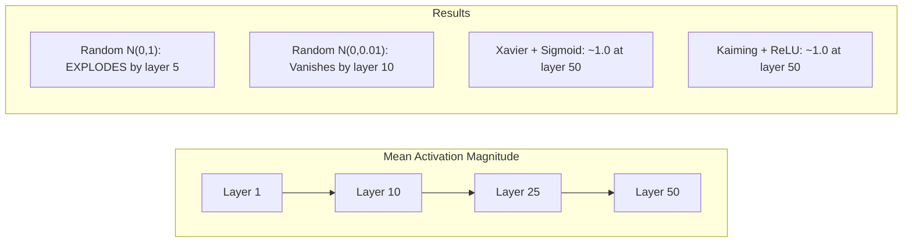
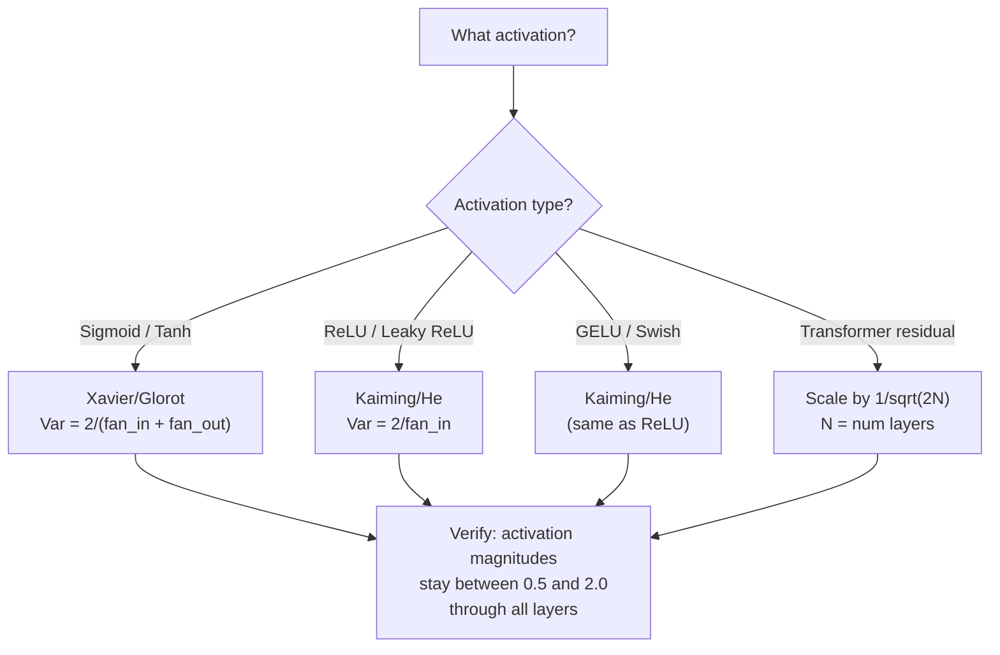

# Inisialisasi Berat dan Stabilitas Training

> Inisialisasi salah dan training tidak pernah dimulai. Inisialisasi kanan dan 50 layer berlatih semulus 3.

**Type:** Build
**Language:** Python
**Prerequisites:** Lesson 03.04 (Fungsi Activation), Lesson 03.07 (Regularisasi)
**Waktu:** ~90 menit

## Tujuan Pembelajaran

- Menerapkan strategi inisialisasi nol, acak, Xavier/Glorot, dan Kaiming/He dan mengukur pengaruhnya terhadap besaran activation melalui 50 layer
- Cari tahu mengapa Xavier init menggunakan Var(w) = 2/(fan_in + fan_out) dan Kaiming menggunakan Var(w) = 2/fan_in
- Tunjukkan masalah simetri dengan inisialisasi nol dan jelaskan mengapa skala acak saja tidak cukup
- Cocokkan strategi inisialisasi yang benar dengan fungsi activation: Xavier untuk sigmoid/tanh, Kaiming untuk ReLU/GELU

## Masalah

Inisialisasi semua weight ke nol. Tidak ada yang belajar. Setiap neuron menghitung fungsi yang sama, menerima gradient yang sama, dan memperbarui secara identik. Setelah 10.000 epoch, layer tersembunyi 512 neuron kamu masih merupakan 512 salinan dari neuron yang sama. kamu membayar untuk 512 parameter dan mendapatkan 1.

Inisialisasi mereka terlalu besar. Activation meledak melalui jaringan. Pada layer 10, nilainya mencapai 1e15. Pada layer 20, mereka meluap hingga tak terbatas. Gradient mengikuti lintasan yang sama secara terbalik.

Inisialisasi secara acak dari distribusi normal standar. Berfungsi untuk 3 layer. Pada 50 layer, sinyalnya menyusut hingga nol atau meledak hingga tak terbatas, bergantung pada apakah skala acaknya sedikit terlalu kecil atau terlalu besar. Batasan antara “berhasil” dan “rusak” sangat tipis.

Inisialisasi weight adalah keputusan yang paling diremehkan dalam pembelajaran mendalam. Arsitektur mendapat makalah. Optimizer mendapatkan postingan blog. Inisialisasi mendapat catatan kaki. Namun lakukan kesalahan dan tidak ada hal lain yang penting -- jaringan kamu sudah mati sebelum training dimulai.

## Konsep

### Masalah Simetri

Setiap neuron dalam sebuah layer memiliki struktur yang sama: kalikan input dengan weight, tambahkan bias, terapkan activation. Jika semua weight dimulai pada nilai yang sama (nol adalah kasus ekstrim), setiap neuron menghitung output yang sama. Selama backpropagation, setiap neuron menerima gradient yang sama. Selama langkah pembaruan, setiap neuron berubah dengan jumlah yang sama.

kamu terjebak. Jaringan memiliki ratusan parameter, namun semuanya bergerak beriringan. Ini disebut simetri, dan inisialisasi acak adalah cara brute force untuk memecahkannya. Setiap neuron dimulai pada titik berbeda dalam ruang weight, sehingga masing-masing mempelajari feature yang berbeda.

Tapi "acak" saja tidak cukup. *Skala* keacakan menentukan apakah jaringan dilatih.

### Propagasi Varians Melalui Layer

Pertimbangkan satu layer dengan input fan_in:

```
z = w1*x1 + w2*x2 + ... + w_n*x_n
```

Jika setiap weight wi diambil dari suatu distribusi yang mempunyai varian Var(w) dan setiap input xi mempunyai varian Var(x), maka varian keluarannya adalah:

```
Var(z) = fan_in * Var(w) * Var(x)
```

Jika Var(w) = 1 dan fan_in = 512, varians keluarannya adalah 512x varians input. Setelah 10 layer: 512^10 = 1.2e27. Sinyal kamu telah meledak.

Jika Var(w) = 0,001, varian output menyusut sebesar 0,001 * 512 = 0,512 per layer. Setelah 10 layer: 0,512^10 = 0,00013. Sinyal kamu telah hilang.

Tujuannya: pilih Var(w) sehingga Var(z) = Var(x). Besaran sinyal tetap konstan di seluruh layer.

### Inisialisasi Xavier/Glorot

Glorot dan Bengio (2010) memperoleh solusi untuk activation sigmoid dan tanh. Untuk menjaga varians tetap konstan baik dalam forward maupun backward pass:

```
Var(w) = 2 / (fan_in + fan_out)
```

Dalam praktiknya, weight diambil dari:

```
w ~ Uniform(-limit, limit)  where limit = sqrt(6 / (fan_in + fan_out))
```

atau:

```
w ~ Normal(0, sqrt(2 / (fan_in + fan_out)))
```Ini berfungsi karena sigmoid dan tanh kira-kira linier mendekati nol, tempat activation yang diinisialisasi dengan benar berada. Variansnya tetap stabil melalui lusinan layer.

### Inisialisasi Kaiming/Dia

ReLU mematikan separuh output (semua yang negatif menjadi nol). Fan_in yang efektif dibelah dua karena rata-rata separuh input bernilai nol. Xavier init tidak memperhitungkan hal ini -- ini meremehkan varians yang diperlukan.

Dia dkk. (2015) menyesuaikan rumusnya:

```
Var(w) = 2 / fan_in
```

Weight diambil dari:

```
w ~ Normal(0, sqrt(2 / fan_in))
```

Faktor 2 mengkompensasi ReLU yang memusatkan attention pada setengah activation. Tanpanya, sinyal akan menyusut ~0,5x per layer. Dengan 50 layer: 0,5^50 = 8.8e-16. Kaiming init mencegah hal ini.

### Inisialisasi Transformer

GPT-2 memperkenalkan pola yang berbeda. Koneksi sisa menambahkan output dari setiap sub-layer ke inputnya:

```
x = x + sublayer(x)
```

Setiap penambahan meningkatkan varians. Dengan N layer sisa, varians bertambah secara proporsional menjadi N. GPT-2 menskalakan weight layer sisa sebesar 1/sqrt(2N), dengan N adalah jumlah layer. Hal ini menjaga akumulasi besaran sinyal tetap stabil.

Llama 3 (parameter 405B, 126 layer) menggunakan skema serupa. Tanpa penskalaan ini, aliran sisa akan tumbuh tanpa batas melalui 126 layer blok attention dan umpan maju.

```mermaid
flowchart TD
    subgraph "Zero Init"
        Z1["Layer 1<br/>All weights = 0"] --> Z2["Layer 2<br/>All neurons identical"]
        Z2 --> Z3["Layer 3<br/>Still identical"]
        Z3 --> ZR["Result: 1 effective neuron<br/>regardless of width"]
    end

    subgraph "Xavier Init"
        X1["Layer 1<br/>Var = 2/(fan_in+fan_out)"] --> X2["Layer 2<br/>Signal stable"]
        X2 --> X3["Layer 50<br/>Signal stable"]
        X3 --> XR["Result: Trains with<br/>sigmoid/tanh"]
    end

    subgraph "Kaiming Init"
        K1["Layer 1<br/>Var = 2/fan_in"] --> K2["Layer 2<br/>Signal stable"]
        K2 --> K3["Layer 50<br/>Signal stable"]
        K3 --> KR["Result: Trains with<br/>ReLU/GELU"]
    end
```



### Besaran Activation Melalui 50 Layer



### Memilih Init yang Akurat



## Build

### Langkah 1: Strategi Inisialisasi

Empat cara untuk menginisialisasi matrix weight. Masing-masing mengembalikan daftar daftar (matrix 2D) dengan kolom fan_in dan baris fan_out.

```python
import math
import random


def zero_init(fan_in, fan_out):
    return [[0.0 for _ in range(fan_in)] for _ in range(fan_out)]


def random_init(fan_in, fan_out, scale=1.0):
    return [[random.gauss(0, scale) for _ in range(fan_in)] for _ in range(fan_out)]


def xavier_init(fan_in, fan_out):
    std = math.sqrt(2.0 / (fan_in + fan_out))
    return [[random.gauss(0, std) for _ in range(fan_in)] for _ in range(fan_out)]


def kaiming_init(fan_in, fan_out):
    std = math.sqrt(2.0 / fan_in)
    return [[random.gauss(0, std) for _ in range(fan_in)] for _ in range(fan_out)]
```

### Langkah 2: Fungsi Activation

Kita memerlukan sigmoid, tanh, dan ReLU untuk menguji setiap strategi init dengan activation yang dimaksudkan.

```python
def sigmoid(x):
    x = max(-500, min(500, x))
    return 1.0 / (1.0 + math.exp(-x))


def tanh_act(x):
    return math.tanh(x)


def relu(x):
    return max(0.0, x)
```

### Langkah 3: Maju Melewati 50 Layer

Lewatkan data acak melalui jaringan dalam dan ukur besaran activation rata-rata di setiap layer.

```python
def forward_deep(init_fn, activation_fn, n_layers=50, width=64, n_samples=100):
    random.seed(42)
    layer_magnitudes = []

    inputs = [[random.gauss(0, 1) for _ in range(width)] for _ in range(n_samples)]

    for layer_idx in range(n_layers):
        weights = init_fn(width, width)
        biases = [0.0] * width

        new_inputs = []
        for sample in inputs:
            output = []
            for neuron_idx in range(width):
                z = sum(weights[neuron_idx][j] * sample[j] for j in range(width)) + biases[neuron_idx]
                output.append(activation_fn(z))
            new_inputs.append(output)
        inputs = new_inputs

        magnitudes = []
        for sample in inputs:
            magnitudes.append(sum(abs(v) for v in sample) / width)
        mean_mag = sum(magnitudes) / len(magnitudes)
        layer_magnitudes.append(mean_mag)

    return layer_magnitudes
```

### Langkah 4: Eksperimen

Jalankan semua kombinasi: zero init, random N(0,1), random N(0,0.01), Xavier dengan sigmoid, Xavier dengan tanh, Kaiming dengan ReLU. Cetak besarnya pada layer kunci.

```python
def run_experiment():
    configs = [
        ("Zero init + Sigmoid", lambda fi, fo: zero_init(fi, fo), sigmoid),
        ("Random N(0,1) + ReLU", lambda fi, fo: random_init(fi, fo, 1.0), relu),
        ("Random N(0,0.01) + ReLU", lambda fi, fo: random_init(fi, fo, 0.01), relu),
        ("Xavier + Sigmoid", xavier_init, sigmoid),
        ("Xavier + Tanh", xavier_init, tanh_act),
        ("Kaiming + ReLU", kaiming_init, relu),
    ]

    print(f"{'Strategy':<30} {'L1':>10} {'L5':>10} {'L10':>10} {'L25':>10} {'L50':>10}")
    print("-" * 80)

    for name, init_fn, act_fn in configs:
        mags = forward_deep(init_fn, act_fn)
        row = f"{name:<30}"
        for idx in [0, 4, 9, 24, 49]:
            val = mags[idx]
            if val > 1e6:
                row += f" {'EXPLODED':>10}"
            elif val < 1e-6:
                row += f" {'VANISHED':>10}"
            else:
                row += f" {val:>10.4f}"
        print(row)
```

### Langkah 5: Demonstrasi Simetri

Tunjukkan bahwa init nol menghasilkan neuron yang identik.

```python
def symmetry_demo():
    random.seed(42)
    weights = zero_init(2, 4)
    biases = [0.0] * 4

    inputs = [0.5, -0.3]
    outputs = []
    for neuron_idx in range(4):
        z = sum(weights[neuron_idx][j] * inputs[j] for j in range(2)) + biases[neuron_idx]
        outputs.append(sigmoid(z))

    print("\nSymmetry Demo (4 neurons, zero init):")
    for i, out in enumerate(outputs):
        print(f"  Neuron {i}: output = {out:.6f}")
    all_same = all(abs(outputs[i] - outputs[0]) < 1e-10 for i in range(len(outputs)))
    print(f"  All identical: {all_same}")
    print(f"  Effective parameters: 1 (not {len(weights) * len(weights[0])})")
```

### Langkah 6: Laporan Besaran Lapis demi Lapis

Cetak diagram batang visual besaran activation melalui 50 layer.

```python
def magnitude_report(name, magnitudes):
    print(f"\n{name}:")
    for i, mag in enumerate(magnitudes):
        if i % 5 == 0 or i == len(magnitudes) - 1:
            if mag > 1e6:
                bar = "X" * 50 + " EXPLODED"
            elif mag < 1e-6:
                bar = "." + " VANISHED"
            else:
                bar_len = min(50, max(1, int(mag * 10)))
                bar = "#" * bar_len
            print(f"  Layer {i+1:3d}: {bar} ({mag:.6f})")
```

## Pakai

PyTorch menyediakan ini sebagai fungsi bawaan:

```python
import torch
import torch.nn as nn

layer = nn.Linear(512, 256)

nn.init.xavier_uniform_(layer.weight)
nn.init.xavier_normal_(layer.weight)

nn.init.kaiming_uniform_(layer.weight, nonlinearity='relu')
nn.init.kaiming_normal_(layer.weight, nonlinearity='relu')

nn.init.zeros_(layer.bias)
```

Saat kamu memanggil `nn.Linear(512, 256)`, PyTorch defaultnya adalah inisialisasi seragam Kaiming. Itu sebabnya sebagian besar jaringan sederhana "berfungsi" -- PyTorch telah membuat pilihan yang tepat. Namun saat kamu membangun arsitektur khusus atau mendalami lebih dari 20 layer, kamu perlu memahami apa yang terjadi dan berpotensi mengesampingkan default.

Untuk Transformer, model HuggingFace biasanya menangani inisialisasi dalam metode `_init_weights`. Implementasi GPT-2 menskalakan proyeksi sisa sebesar 1/sqrt(N). Jika kamu membuat trafo dari awal, kamu perlu menambahkannya sendiri.

## Kirim

Lesson ini menghasilkan:
- `outputs/prompt-init-strategy.md` -- prompt yang mendiagnosis masalah inisialisasi weight dan merekomendasikan strategi yang tepat

## Latihan

1. Tambahkan inisialisasi LeCun (Var = 1/fan_in, dirancang untuk activation SELU). Jalankan eksperimen 50 lapis dengan LeCun init + tanh dan bandingkan dengan Xavier + tanh.2. Menerapkan penskalaan sisa GPT-2: kalikan output setiap layer dengan 1/sqrt(2*N) sebelum menambahkan ke aliran sisa. Jalankan 50 layer dengan dan tanpa penskalaan, ukur seberapa cepat besaran sisa bertambah.

3. Buat fungsi "pemeriksaan kesehatan init" yang mengambil dimension layer jaringan dan jenis activation, kemudian merekomendasikan inisialisasi yang benar dan memperingatkan jika init saat ini akan menimbulkan masalah.

4. Jalankan percobaan dengan fan_in = 16 vs fan_in = 1024. Xavier dan Kaiming beradaptasi dengan fan_in, tetapi random init tidak. Tunjukkan bagaimana kesenjangan antara "berhasil" dan "rusak" melebar dengan layer yang lebih besar.

5. Menerapkan inisialisasi ortogonal (menghasilkan matrix acak, menghitung SVD-nya, menggunakan matrix ortogonal U). Bandingkan dengan Kaiming untuk jaringan ReLU pada 50 layer.

## Istilah Kunci

| Istilah | Apa kata orang | Apa sebenarnya arti |
|------|----------------|----------------------|
| Inisialisasi weight | "Tetapkan weight awal secara acak" | Strategi untuk memilih nilai weight awal yang menentukan apakah suatu jaringan dapat dilatih sama sekali |
| Pelanggaran simetri | "Buat neuron berbeda" | Menggunakan inisialisasi acak untuk memastikan neuron mempelajari feature yang berbeda alih-alih menghitung fungsi yang identik |
| Penggemar | "Jumlah input ke neuron" | Jumlah koneksi masuk, yang menentukan bagaimana varian input terakumulasi dalam jumlah tertimbang |
| Penyebaran | "Jumlah output dari sebuah neuron" | Jumlah koneksi keluar, relevan untuk mempertahankan varian gradient selama backpropagation |
| Xavier/Glorot inisiasi | "Inisialisasi sigmoid" | Var(w) = 2/(fan_in + fan_out), dirancang untuk mempertahankan varians melalui activation sigmoid dan tanh |
| Kaiming/Dia inisiasi | "Inisialisasi ReLU" | Var(w) = 2/fan_in, menyebabkan ReLU memusatkan attention pada separuh activation |
| Propagasi varians | "Bagaimana sinyal tumbuh atau menyusut melalui layer" | Analisis matematis tentang bagaimana varians activation mengubah layer by layer berdasarkan skala weight |
| Penskalaan sisa | "Trik init GPT-2" | Menskalakan weight sambungan sisa sebesar 1/sqrt(2N) untuk mencegah pertumbuhan varians melalui N layer Transformer |
| Jaringan mati | "Tidak ada kereta" | Jaringan dengan inisialisasi yang buruk menyebabkan semua gradient menjadi nol atau semua activation menjadi jenuh |
| Activation yang meledak | "Nilainya mencapai tak terbatas" | Ketika varians weight terlalu tinggi, menyebabkan besaran activation tumbuh secara eksponensial melalui layer |

## Bacaan Lanjutan

- Glorot & Bengio, "Memahami kesulitan melatih neural network feedforward dalam" (2010) -- makalah inisialisasi Xavier asli dengan analisis varians
- Dia dkk., "Delving Deep into Rectifiers" (2015) -- memperkenalkan inisialisasi Kaiming untuk jaringan ReLU
- Radford dkk., "Model Bahasa adalah Pembelajar Multitask Tanpa Pengawasan" (2019) -- Makalah GPT-2 dengan inisialisasi penskalaan sisa
- Mishkin & Matas, "Yang kamu Butuhkan hanyalah Init yang Baik" (2016) -- inisialisasi unit-varians sekuensial layer, sebuah alternatif empiris untuk rumus analitik
