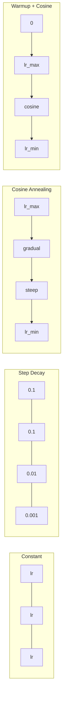
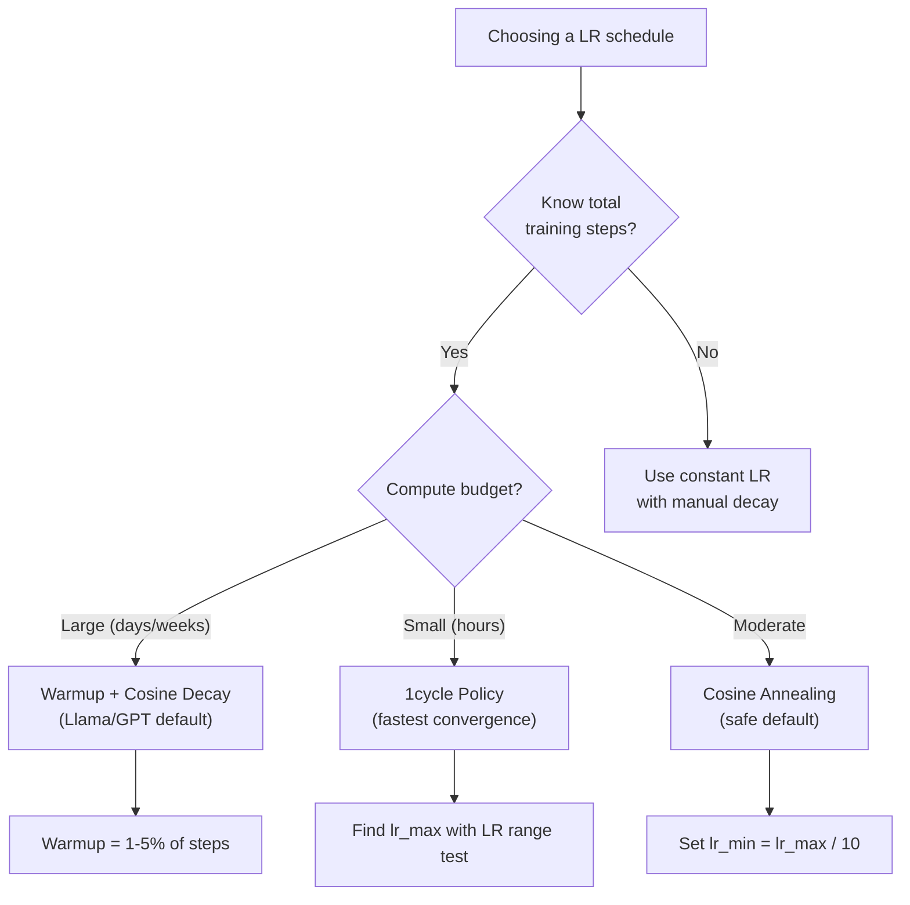
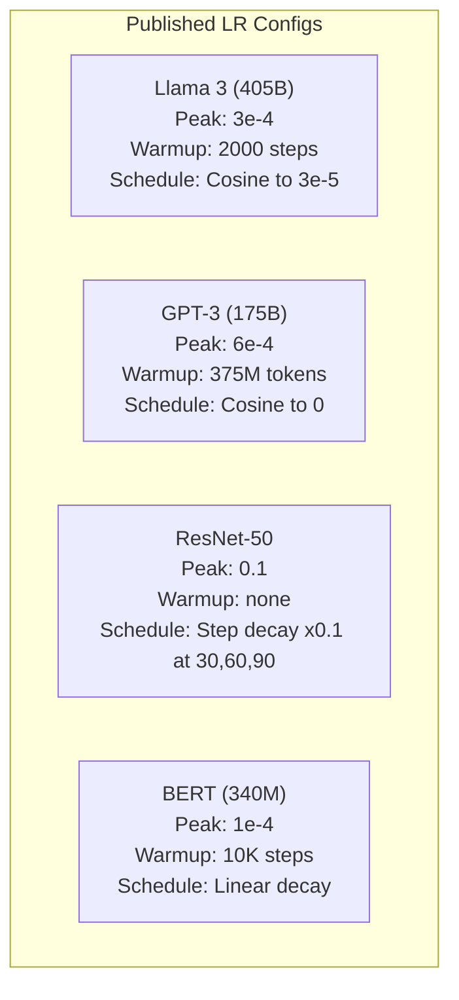

# Jadwal Kecepatan Pembelajaran dan Pemanasan

> Learning rate adalah satu-satunya hyperparameter yang paling penting. Bukan arsitekturnya. Bukan ukuran dataset. Bukan fungsi activation. Learning rate. Jika kamu tidak menyetel apa pun, setel ini.

**Type:** Build
**Language:** Python
**Prerequisites:** Lesson 03.06 (Optimizer), Lesson 03.08 (Inisialisasi Weight)
**Waktu:** ~90 menit

## Tujuan Pembelajaran

- Menerapkan jadwal konstan, peluruhan langkah, anil kosinus, pemanasan + kosinus, dan learning rate 1 siklus dari awal
- Tunjukkan tiga mode kegagalan pemilihan learning rate: divergensi (terlalu tinggi), terhenti (terlalu rendah), dan osilasi (tidak ada peluruhan)
- Jelaskan mengapa pemanasan diperlukan untuk optimizer berbasis Adam dan bagaimana pemanasan menstabilkan training awal
- Bandingkan kecepatan konvergensi di kelima jadwal pada tugas yang sama dan pilih yang sesuai untuk anggaran training tertentu

## Masalah

Tetapkan learning rate ke 0,1. Training menyimpang -- loss melonjak hingga tak terbatas dalam 3 langkah. Setel ke 0,0001. Perayapan training -- setelah 100 periode, model hampir tidak bergerak secara acak. Setel ke 0,01. Training bekerja selama 50 epoch, kemudian loss berosilasi pada nilai minimum yang tidak akan pernah dapat dicapai karena langkah-langkahnya terlalu besar.

Learning rate optimal tidaklah konstan. Itu berubah selama training. Sejak awal, kamu ingin langkah besar menutupi permukaan dengan cepat. Di akhir training, kamu ingin langkah-langkah kecil diminimalkan. Perbedaan antara model yang 90% akurat dan model yang 95% akurat sering kali hanya terletak pada jadwalnya.

Setiap model utama yang diterbitkan dalam tiga tahun terakhir menggunakan learning rate schedule. Llama 3 menggunakan puncak lr=3e-4 dengan 2000 langkah pemanasan dan peluruhan kosinus menjadi 3e-5. GPT-3 menggunakan lr=6e-4 dengan pemanasan lebih dari 375 juta token. Ini bukanlah pilihan yang sembarangan. Ini adalah hasil dari pembersihan hyperparameter ekstensif yang menghabiskan biaya jutaan dolar.

kamu perlu memahami jadwal karena jadwal default tidak akan berfungsi untuk masalah kamu. Saat kamu menyempurnakan model yang telah dilatih sebelumnya, jadwal yang tepat berbeda dengan training dari awal. Saat kamu menambah ukuran batch, periode pemanasan perlu diubah. Saat latihan terhenti pada langkah 10.000, kamu perlu mengetahui apakah itu masalah jadwal atau hal lainnya.

## Konsep

### Kecepatan Pembelajaran Konstan

Pendekatan paling sederhana. Pilih nomor, gunakan untuk setiap langkah.

```
lr(t) = lr_0
```

Jarang optimal. Nilainya mungkin terlalu tinggi untuk akhir training (osilasi di sekitar minimum) atau terlalu rendah untuk awal (pembuangan komputasi pada langkah-langkah kecil). Berfungsi dengan baik untuk model kecil dan debugging. Pilihan yang buruk untuk apa pun yang berlatih lebih dari satu jam.

### Langkah Peluruhan

Pendekatan kuno dari era ResNet. Potong learning rate sebanyak satu faktor (biasanya 10x) pada periode waktu yang tetap.

```
lr(t) = lr_0 * gamma^(floor(epoch / step_size))
```

Dimana gamma = 0,1 dan step_size = 30 berarti: lr turun 10x setiap 30 epoch. ResNet-50 menggunakan ini -- lr=0,1, turun 10x pada epoch 30, 60, dan 90.

Masalah: titik peluruhan optimal bergantung pada dataset dan arsitektur. Pindah ke masalah lain dan kamu perlu menyetel ulang kapan harus berhenti. Transisinya terjadi secara tiba-tiba -- loss bisa melonjak ketika nilai tukar tiba-tiba berubah.

### Anil Kosinus

Peluruhan halus dari learning rate maksimum ke minimum, mengikuti kurva kosinus:

```
lr(t) = lr_min + 0.5 * (lr_max - lr_min) * (1 + cos(pi * t / T))
```

Dimana t adalah langkah saat ini dan T adalah jumlah langkah.Pada t=0, suku kosinusnya adalah 1, jadi lr = lr_max. Pada t=T suku kosinusnya adalah -1, jadi lr = lr_min. Pembusukannya lembut pada awalnya, semakin cepat di tengah, dan menjadi lembut lagi menjelang akhir.

Ini adalah default untuk sebagian besar proses training modern. Tidak ada hyperparameter yang perlu disesuaikan selain lr_max dan lr_min. Bentuk kosinus sesuai dengan pengamatan empiris bahwa sebagian besar pembelajaran terjadi di tengah-tengah training -- kamu menginginkan ukuran langkah yang masuk akal selama periode kritis tersebut.

### Pemanasan: Mengapa kamu Memulai dari Yang Kecil

Adam dan optimizer adaptif lainnya mempertahankan perkiraan mean dan varians gradient yang berjalan. Pada langkah 0, perkiraan ini diinisialisasi ke nol. Beberapa pembaruan gradient pertama didasarkan pada statistik sampah. Jika learning rate kamu tinggi selama periode ini, model akan mengambil langkah-langkah besar yang tidak diarahkan dengan baik.

Pemanasan memperbaikinya. Mulailah dengan learning rate kecil (seringkali lr_max/warmup_steps atau bahkan nol) dan tingkatkan secara linear hingga lr_max dalam N langkah pertama. Saat kamu mencapai learning rate penuh, statistik Adam telah stabil.

```
lr(t) = lr_max * (t / warmup_steps)     for t < warmup_steps
```

Pemanasan umum: 1-5% dari total langkah latihan. Llama 3 dilatih untuk ~1,8 triliun token dan melakukan pemanasan untuk 2000 langkah. GPT-3 memanaskan lebih dari 375 juta token.

### Pemanasan Linier + Peluruhan Kosinus

Standar modern. Naikkan secara linier, lalu peluruh dengan kosinus:

```
if t < warmup_steps:
    lr(t) = lr_max * (t / warmup_steps)
else:
    progress = (t - warmup_steps) / (total_steps - warmup_steps)
    lr(t) = lr_min + 0.5 * (lr_max - lr_min) * (1 + cos(pi * progress))
```

Inilah yang digunakan Llama, GPT, PaLM, dan sebagian besar trafo modern. Pemanasan mencegah ketidakstabilan dini. Peluruhan kosinus membuat model berada pada nilai minimum yang baik.

### Kebijakan 1siklus

Penemuan Leslie Smith (2018): tingkatkan learning rate dari nilai rendah ke nilai tinggi pada paruh pertama training, lalu turunkan kembali pada paruh kedua. Berlawanan dengan intuisi -- mengapa kamu *meningkatkan* learning rate di tengah proses?

Teorinya: learning rate yang tinggi bertindak sebagai regularisasi dengan menambahkan gangguan pada lintasan optimization. Model ini mengeksplorasi lebih banyak loss landscape selama fase peningkatan, dan menemukan daerah aliran sungai yang lebih baik. Fase ramp-down kemudian melakukan pemurnian dalam cekungan terbaik yang ditemukan.

```
Phase 1 (0 to T/2):    lr ramps from lr_max/25 to lr_max
Phase 2 (T/2 to T):    lr ramps from lr_max to lr_max/10000
```

1 siklus sering kali dilatih lebih cepat daripada anil kosinus untuk anggaran komputasi tetap. Imbalannya: kamu harus mengetahui jumlah langkah sebelumnya.

### Bentuk Jadwal



### Bagan Alur Keputusan



### Bilangan Nyata dari Model yang Diterbitkan



## Build

### Langkah 1: Fungsi Jadwal

Setiap fungsi mengambil langkah saat ini dan mengembalikan learning rate pada langkah tersebut.

```python
import math


def constant_schedule(step, lr=0.01, **kwargs):
    return lr


def step_decay_schedule(step, lr=0.1, step_size=100, gamma=0.1, **kwargs):
    return lr * (gamma ** (step // step_size))


def cosine_schedule(step, lr=0.01, total_steps=1000, lr_min=1e-5, **kwargs):
    if step >= total_steps:
        return lr_min
    return lr_min + 0.5 * (lr - lr_min) * (1 + math.cos(math.pi * step / total_steps))


def warmup_cosine_schedule(step, lr=0.01, total_steps=1000, warmup_steps=100, lr_min=1e-5, **kwargs):
    if total_steps <= warmup_steps:
        return lr * (step / max(warmup_steps, 1))
    if step < warmup_steps:
        return lr * step / warmup_steps
    progress = (step - warmup_steps) / (total_steps - warmup_steps)
    return lr_min + 0.5 * (lr - lr_min) * (1 + math.cos(math.pi * progress))


def one_cycle_schedule(step, lr=0.01, total_steps=1000, **kwargs):
    mid = max(total_steps // 2, 1)
    if step < mid:
        return (lr / 25) + (lr - lr / 25) * step / mid
    else:
        progress = (step - mid) / max(total_steps - mid, 1)
        return lr * (1 - progress) + (lr / 10000) * progress
```

### Langkah 2: Visualisasikan Semua Jadwal

Cetak plot berbasis teks yang menunjukkan bagaimana setiap jadwal berkembang seiring training.

```python
def visualize_schedule(name, schedule_fn, total_steps=500, **kwargs):
    steps = list(range(0, total_steps, total_steps // 20))
    if total_steps - 1 not in steps:
        steps.append(total_steps - 1)

    lrs = [schedule_fn(s, total_steps=total_steps, **kwargs) for s in steps]
    max_lr = max(lrs) if max(lrs) > 0 else 1.0

    print(f"\n{name}:")
    for s, lr_val in zip(steps, lrs):
        bar_len = int(lr_val / max_lr * 40)
        bar = "#" * bar_len
        print(f"  Step {s:4d}: lr={lr_val:.6f} {bar}")
```

### Langkah 3: Jaringan Training

Jaringan dua lapis sederhana pada dataset lingkaran, sama seperti lesson sebelumnya, namun sekarang kami memvariasikan jadwalnya.

```python
import random


def sigmoid(x):
    x = max(-500, min(500, x))
    return 1.0 / (1.0 + math.exp(-x))


def relu(x):
    return max(0.0, x)


def relu_deriv(x):
    return 1.0 if x > 0 else 0.0


def make_circle_data(n=200, seed=42):
    random.seed(seed)
    data = []
    for _ in range(n):
        x = random.uniform(-2, 2)
        y = random.uniform(-2, 2)
        label = 1.0 if x * x + y * y < 1.5 else 0.0
        data.append(([x, y], label))
    return data


def train_with_schedule(schedule_fn, schedule_name, data, epochs=300, base_lr=0.05, **kwargs):
    random.seed(0)
    hidden_size = 8
    total_steps = epochs * len(data)

    std = math.sqrt(2.0 / 2)
    w1 = [[random.gauss(0, std) for _ in range(2)] for _ in range(hidden_size)]
    b1 = [0.0] * hidden_size
    w2 = [random.gauss(0, std) for _ in range(hidden_size)]
    b2 = 0.0

    step = 0
    epoch_losses = []

    for epoch in range(epochs):
        total_loss = 0
        correct = 0

        for x, target in data:
            lr = schedule_fn(step, lr=base_lr, total_steps=total_steps, **kwargs)

            z1 = []
            h = []
            for i in range(hidden_size):
                z = w1[i][0] * x[0] + w1[i][1] * x[1] + b1[i]
                z1.append(z)
                h.append(relu(z))

            z2 = sum(w2[i] * h[i] for i in range(hidden_size)) + b2
            out = sigmoid(z2)

            error = out - target
            d_out = error * out * (1 - out)

            for i in range(hidden_size):
                d_h = d_out * w2[i] * relu_deriv(z1[i])
                w2[i] -= lr * d_out * h[i]
                for j in range(2):
                    w1[i][j] -= lr * d_h * x[j]
                b1[i] -= lr * d_h
            b2 -= lr * d_out

            total_loss += (out - target) ** 2
            if (out >= 0.5) == (target >= 0.5):
                correct += 1
            step += 1

        avg_loss = total_loss / len(data)
        accuracy = correct / len(data) * 100
        epoch_losses.append(avg_loss)

    return epoch_losses
```

### Langkah 4: Bandingkan Semua Jadwal

Latih jaringan yang sama dengan setiap jadwal dan bandingkan loss akhir dan perilaku konvergensi.

```python
def compare_schedules(data):
    configs = [
        ("Constant", constant_schedule, {}),
        ("Step Decay", step_decay_schedule, {"step_size": 15000, "gamma": 0.1}),
        ("Cosine", cosine_schedule, {"lr_min": 1e-5}),
        ("Warmup+Cosine", warmup_cosine_schedule, {"warmup_steps": 3000, "lr_min": 1e-5}),
        ("1cycle", one_cycle_schedule, {}),
    ]

    print(f"\n{'Schedule':<20} {'Start Loss':>12} {'Mid Loss':>12} {'End Loss':>12} {'Best Loss':>12}")
    print("-" * 70)

    for name, schedule_fn, extra_kwargs in configs:
        losses = train_with_schedule(schedule_fn, name, data, epochs=300, base_lr=0.05, **extra_kwargs)
        mid_idx = len(losses) // 2
        best = min(losses)
        print(f"{name:<20} {losses[0]:>12.6f} {losses[mid_idx]:>12.6f} {losses[-1]:>12.6f} {best:>12.6f}")
```

### Langkah 5: LR Terlalu Tinggi vs Terlalu Rendah

Tunjukkan tiga mode kegagalan: terlalu tinggi (divergence), terlalu rendah (crawling), dan tepat.

```python
def lr_sensitivity(data):
    learning_rates = [1.0, 0.1, 0.01, 0.001, 0.0001]

    print("\nLR Sensitivity (constant schedule, 100 epochs):")
    print(f"  {'LR':>10} {'Start Loss':>12} {'End Loss':>12} {'Status':>15}")
    print("  " + "-" * 52)

    for lr in learning_rates:
        losses = train_with_schedule(constant_schedule, f"lr={lr}", data, epochs=100, base_lr=lr)
        start = losses[0]
        end = losses[-1]

        if end > start or math.isnan(end) or end > 1.0:
            status = "DIVERGED"
        elif end > start * 0.9:
            status = "BARELY MOVED"
        elif end < 0.15:
            status = "CONVERGED"
        else:
            status = "LEARNING"

        end_str = f"{end:.6f}" if not math.isnan(end) else "NaN"
        print(f"  {lr:>10.4f} {start:>12.6f} {end_str:>12} {status:>15}")
```

## Pakai

PyTorch menyediakan penjadwal di `torch.optim.lr_scheduler`:

```python
import torch
import torch.optim as optim
from torch.optim.lr_scheduler import CosineAnnealingLR, OneCycleLR, StepLR

model = nn.Sequential(nn.Linear(10, 64), nn.ReLU(), nn.Linear(64, 1))
optimizer = optim.Adam(model.parameters(), lr=3e-4)

scheduler = CosineAnnealingLR(optimizer, T_max=1000, eta_min=1e-5)

for step in range(1000):
    loss = train_step(model, optimizer)
    scheduler.step()
```

Untuk pemanasan + cosinus, gunakan penjadwal lambda atau `get_cosine_schedule_with_warmup` dari HuggingFace:

```python
from transformers import get_cosine_schedule_with_warmup

scheduler = get_cosine_schedule_with_warmup(
    optimizer,
    num_warmup_steps=2000,
    num_training_steps=100000,
)
```

Fungsi HuggingFace adalah fungsi yang digunakan sebagian besar skrip penyempurnaan Llama dan GPT. Jika ragu, gunakan pemanasan + cosinus dengan pemanasan = 3-5% dari total langkah. Ini berfungsi untuk hampir semua hal.

## Kirim

Lesson ini menghasilkan:
- `outputs/prompt-lr-schedule-advisor.md` -- prompt yang merekomendasikan learning rate schedule dan hyperparameter yang tepat untuk penyiapan training kamu

## Latihan

1. Menerapkan peluruhan eksponensial: lr(t) = lr_0 * gamma^t dengan gamma = 0,999. Bandingkan dengan cosine annealing pada dataset lingkaran.

2. Terapkan tes rentang learning rate (Leslie Smith): latih beberapa ratus langkah sambil meningkatkan LR secara eksponensial dari 1e-7 menjadi 1. Plot loss vs LR. LR maksimal optimal adalah sebelum loss mulai meningkat.

3. Berlatih dengan pemanasan + kosinus tetapi variasikan lama pemanasan: 0%, 1%, 5%, 10%, 20% dari total langkah. Temukan titik terbaik di mana training paling stabil.

4. Terapkan cosine annealing dengan restart hangat (SGDR): setel ulang learning rate ke lr_max setiap T langkah dan pembusukan lagi. Bandingkan dengan kosinus standar pada latihan yang lebih lama.

5. Buatlah "ahli bedah jadwal" yang memantau kehilangan latihan dan secara otomatis beralih dari pemanasan ke kosinus ketika kehilangan sudah stabil, dan mengurangi lr jika kehilangan tidak stabil terlalu lama.

## Istilah Kunci

| Istilah | Apa kata orang | Apa sebenarnya arti |
|------|----------------|----------------------|
| Learning rate | "Seberapa cepat model belajar" | Scalar yang mengalikan gradient untuk menentukan ukuran pembaruan parameter |
| Jadwal | "Ubah LR seiring waktu" | Sebuah fungsi yang memetakan langkah training ke learning rate, dirancang untuk mengoptimalkan konvergensi |
| Pemanasan | "Mulailah dengan LR kecil" | Meningkatkan LR secara linear dari mendekati nol ke nilai target selama N langkah pertama untuk menstabilkan statistik optimizer |
| Anil kosinus | "Peluruhan LR Halus" | Mengurangi LR mengikuti kurva kosinus dari lr_max ke lr_min selama training |
| Peluruhan langkah | "Jatuhkan LR pada pencapaian" | Mengalikan LR dengan faktor (biasanya 0,1) pada interval waktu tetap |
| kebijakan 1 siklus | "Naik lalu turun" | Metode Leslie Smith meningkatkan LR ke atas dan ke bawah dalam satu siklus untuk konvergensi yang lebih cepat |
| Tes jangkauan LR | "Temukan learning rate terbaik" | Latihan singkat sambil meningkatkan LR untuk mencari nilai dimana loss mulai divergen |
| Cosine dengan restart hangat | "Setel ulang dan ulangi" | Reset LR secara berkala ke lr_max dan pembusukan lagi (SGDR) |
| Itu menit | "Lantai untuk LR" | Learning rate minimum yang dipecah jadwal menjadi |
| Learning rate puncak | "LR maksimum" | LR tertinggi yang dicapai selama latihan, biasanya setelah pemanasan |

## Bacaan Lanjutan

- Loshchilov & Hutter, "SGDR: Stochastic Gradient Descent with Warm Restarts" (2017) -- memperkenalkan cosine annealing danwarm restart
- Smith, "Super-Konvergensi: Training Jaringan Syaraf Tiruan yang Sangat Cepat Menggunakan Kecepatan Pembelajaran yang Besar" (2018) -- makalah kebijakan 1 siklus
- Touvron et al., "Llama 2: Open Foundation dan Fine-Tuned Chat Models" (2023) -- mendokumentasikan jadwal pemanasan + kosinus yang digunakan dalam skala besar
- Goyal dkk., "SGD Minibatch Besar dan Akurat: ImageNet Training dalam 1 Jam" (2017) -- aturan penskalaan linier dan pemanasan untuk training batch besar
