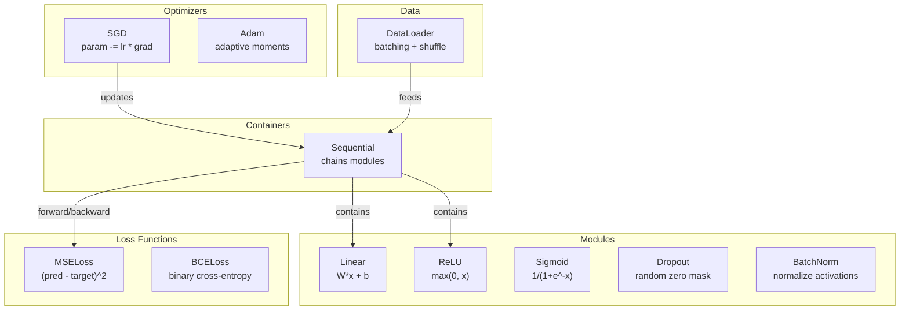
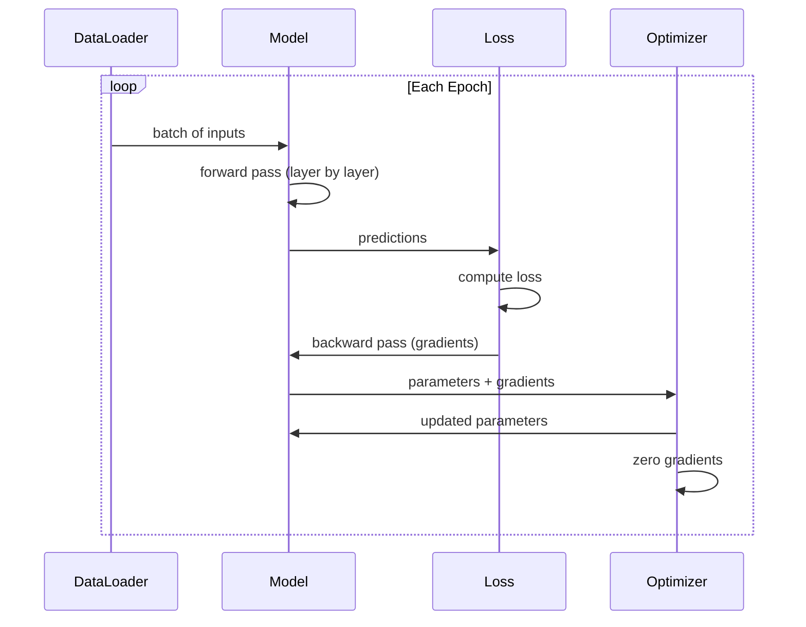
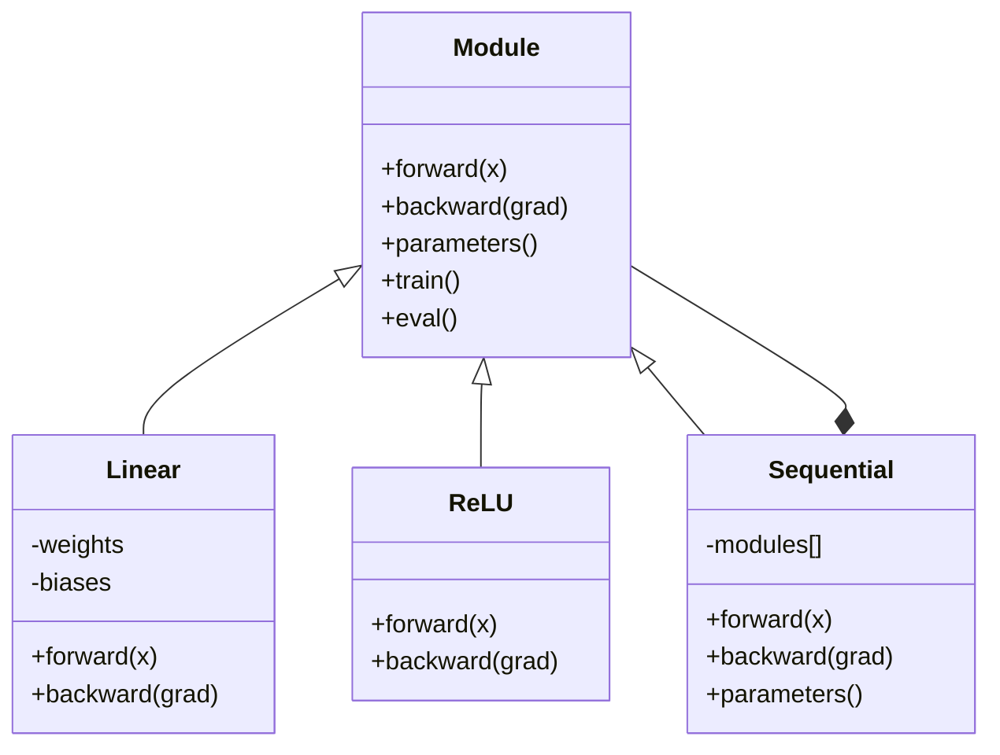

# Build Kerangka Mini kamu Sendiri

> kamu telah membangun neuron, layer, jaringan, backprop, activation, loss function, optimizer, regularisasi, inisialisasi, dan jadwal LR. Semua sebagai bagian yang terpisah. Sekarang satukan semuanya menjadi sebuah kerangka. Bukan PyTorch. Bukan TensorFlow. Milikmu.

**Type:** Build
**Language:** Python
**Prerequisites:** Semua Fase 03 (Lesson 01-09)
**Waktu:** ~120 menit

## Tujuan Pembelajaran

- Build kerangka pembelajaran mendalam yang lengkap (~500 baris) dengan Modul, Linear, ReLU, Sigmoid, Dropout, BatchNorm, Sequential, loss function, optimizer, dan DataLoader
- Jelaskan abstraksi Modul (maju, mundur, parameter) dan mengapa peralihan mode training/eval diperlukan
- Masukkan semua komponen ke dalam loop training kerja yang melatih jaringan 4 lapis pada klasifikasi lingkaran
- Petakan setiap komponen framework kamu ke setara PyTorch (nn.Module, nn.Sequential, optim.Adam, DataLoader)

## Masalah

kamu memiliki sepuluh lesson tentang blok penyusun yang tersebar di file terpisah. Kelas `Value` di sini, loop training di sana, inisialisasi weight di file lain, learning rate schedule di file lain. Untuk melatih jaringan, kamu menyalin-menempelkan dari lima lesson berbeda dan menyatukannya dengan tangan.

Itulah yang dipecahkan oleh framework. PyTorch memberi kamu `nn.Module`, `nn.Sequential`, `optim.Adam`, `DataLoader`, dan pola putaran training yang menyatukan keduanya. TensorFlow memberi kamu `keras.Layer`, `keras.Sequential`, `keras.optimizers.Adam`. Ini bukan sihir. Ini adalah pola organisasi yang memungkinkan untuk mendefinisikan, melatih, dan mengevaluasi jaringan tanpa selalu menciptakan kembali sistem pipa ledeng.

kamu akan membuat hal yang sama di ~500 baris Python. Tidak ada angka. Tidak ada ketergantungan eksternal. Kerangka kerja yang dapat menentukan jaringan feedforward apa pun, melatihnya dengan SGD atau Adam, mengelompokkan data, menerapkan normalisasi dropout dan batch, menggunakan activation apa pun, dan menjadwalkan learning rate.

Setelah selesai, kamu akan memahami dengan tepat apa yang terjadi saat kamu menulis `model = nn.Sequential(...)` di PyTorch. kamu akan memahami mengapa `model.train()` dan `model.eval()` ada. kamu akan memahami mengapa `optimizer.zero_grad()` merupakan panggilan terpisah. kamu akan memahami semuanya, karena kamu yang membangun semuanya.

## Konsep

### Abstraksi Modul

Setiap layer di PyTorch mewarisi dari `nn.Module`. Modul memiliki tiga tanggung jawab:

1. **maju()** -- menghitung output dengan input yang diberikan
2. **parameters()** -- mengembalikan semua weight yang dapat dilatih
3. **mundur()** -- menghitung gradient (ditangani oleh autograd di PyTorch, eksplisit di kami)

Layer Linear adalah Modul. Activation ReLU adalah sebuah Modul. Layer putus sekolah adalah Modul. Layer normalisasi batch adalah Modul. Semuanya memiliki antarmuka yang sama.

### Kontainer Berurutan

`nn.Sequential` rantai Modul. Jalur maju: memasukkan data melalui Modul 1, lalu Modul 2, lalu Modul 3. Jalur mundur: membalikkan rantai. Kontainer itu sendiri adalah sebuah Modul -- ia memiliki forward(), parameter(), dan backward(). Ini adalah pola gabungan: rangkaian Modul itu sendiri adalah sebuah Modul.

### Mode Training vs Evaluasi

Dropout secara acak menghilangkan neuron selama training tetapi meneruskan semuanya selama evaluasi. Normalisasi batch menggunakan statistik batch selama training tetapi menjalankan rata-rata selama evaluasi. Metode `train()` dan `eval()` mengubah perilaku ini. Setiap Modul memiliki tanda `training`.### Optimizer

Optimizer memperbarui parameter menggunakan gradiennya. SGD: `param -= lr * grad`. Adam: mempertahankan perkiraan momentum dan varians, lalu memperbaruinya. Optimizer tidak mengetahui arsitektur jaringan -- ia hanya melihat daftar parameter datar dan gradiennya.

### Pemuat Data

Pengelompokan penting karena dua alasan. Pertama, kamu tidak dapat memasukkan seluruh dataset ke dalam memori untuk masalah besar. Kedua, gradient descent batch mini memberikan noise yang membantu keluar dari minimum lokal. DataLoader membagi data menjadi beberapa batch dan secara opsional mengacak antar periode.

### Arsitektur Kerangka



### Lingkaran Latihan



### Hierarki Modul



## Build

### Langkah 1: Kelas Basis Modul

Antarmuka abstrak yang diimplementasikan setiap layer.

```python
class Module:
    def __init__(self):
        self.training = True

    def forward(self, x):
        raise NotImplementedError

    def backward(self, grad):
        raise NotImplementedError

    def parameters(self):
        return []

    def train(self):
        self.training = True

    def eval(self):
        self.training = False
```

### Langkah 2: Layer Linier

Blok bangunan mendasar. Menyimpan weight dan bias, menghitung Wx + b ke depan, dan gradient weight/input ke belakang.

```python
import math
import random


class Linear(Module):
    def __init__(self, fan_in, fan_out):
        super().__init__()
        std = math.sqrt(2.0 / fan_in)
        self.weights = [[random.gauss(0, std) for _ in range(fan_in)] for _ in range(fan_out)]
        self.biases = [0.0] * fan_out
        self.weight_grads = [[0.0] * fan_in for _ in range(fan_out)]
        self.bias_grads = [0.0] * fan_out
        self.fan_in = fan_in
        self.fan_out = fan_out
        self.input = None

    def forward(self, x):
        self.input = x
        output = []
        for i in range(self.fan_out):
            val = self.biases[i]
            for j in range(self.fan_in):
                val += self.weights[i][j] * x[j]
            output.append(val)
        return output

    def backward(self, grad):
        input_grad = [0.0] * self.fan_in
        for i in range(self.fan_out):
            self.bias_grads[i] += grad[i]
            for j in range(self.fan_in):
                self.weight_grads[i][j] += grad[i] * self.input[j]
                input_grad[j] += grad[i] * self.weights[i][j]
        return input_grad

    def parameters(self):
        params = []
        for i in range(self.fan_out):
            for j in range(self.fan_in):
                params.append((self.weights, i, j, self.weight_grads))
            params.append((self.biases, i, None, self.bias_grads))
        return params
```

### Langkah 3: Modul Activation

ReLU, Sigmoid, dan Tanh sebagai Modul. Masing-masing menyimpan cache apa yang diperlukan untuk backward pass.

```python
class ReLU(Module):
    def __init__(self):
        super().__init__()
        self.mask = None

    def forward(self, x):
        self.mask = [1.0 if v > 0 else 0.0 for v in x]
        return [max(0.0, v) for v in x]

    def backward(self, grad):
        return [g * m for g, m in zip(grad, self.mask)]


class Sigmoid(Module):
    def __init__(self):
        super().__init__()
        self.output = None

    def forward(self, x):
        self.output = []
        for v in x:
            v = max(-500, min(500, v))
            self.output.append(1.0 / (1.0 + math.exp(-v)))
        return self.output

    def backward(self, grad):
        return [g * o * (1 - o) for g, o in zip(grad, self.output)]


class Tanh(Module):
    def __init__(self):
        super().__init__()
        self.output = None

    def forward(self, x):
        self.output = [math.tanh(v) for v in x]
        return self.output

    def backward(self, grad):
        return [g * (1 - o * o) for g, o in zip(grad, self.output)]
```

### Langkah 4: Modul Dropout

Secara acak menghilangkan elemen selama training. Menskalakan elemen yang tersisa sebesar 1/(1-p) sehingga nilai yang diharapkan tetap sama. Tidak melakukan apa pun selama eval.

```python
class Dropout(Module):
    def __init__(self, p=0.5):
        super().__init__()
        self.p = p
        self.mask = None

    def forward(self, x):
        if not self.training:
            return x
        self.mask = [0.0 if random.random() < self.p else 1.0 / (1 - self.p) for _ in x]
        return [v * m for v, m in zip(x, self.mask)]

    def backward(self, grad):
        if self.mask is None:
            return grad
        return [g * m for g, m in zip(grad, self.mask)]
```

### Langkah 5: Modul BatchNorm

Menormalkan activation ke mean nol dan varians unit per feature di seluruh batch. Mempertahankan statistik yang berjalan untuk mode eval.

```python
class BatchNorm(Module):
    def __init__(self, size, momentum=0.1, eps=1e-5):
        super().__init__()
        self.size = size
        self.gamma = [1.0] * size
        self.beta = [0.0] * size
        self.gamma_grads = [0.0] * size
        self.beta_grads = [0.0] * size
        self.running_mean = [0.0] * size
        self.running_var = [1.0] * size
        self.momentum = momentum
        self.eps = eps
        self.x_norm = None
        self.std_inv = None
        self.batch_input = None

    def forward_batch(self, batch):
        batch_size = len(batch)
        output_batch = []

        if self.training:
            mean = [0.0] * self.size
            for sample in batch:
                for j in range(self.size):
                    mean[j] += sample[j]
            mean = [m / batch_size for m in mean]

            var = [0.0] * self.size
            for sample in batch:
                for j in range(self.size):
                    var[j] += (sample[j] - mean[j]) ** 2
            var = [v / batch_size for v in var]

            self.std_inv = [1.0 / math.sqrt(v + self.eps) for v in var]

            self.x_norm = []
            self.batch_input = batch
            for sample in batch:
                normed = [(sample[j] - mean[j]) * self.std_inv[j] for j in range(self.size)]
                self.x_norm.append(normed)
                output = [self.gamma[j] * normed[j] + self.beta[j] for j in range(self.size)]
                output_batch.append(output)

            for j in range(self.size):
                self.running_mean[j] = (1 - self.momentum) * self.running_mean[j] + self.momentum * mean[j]
                self.running_var[j] = (1 - self.momentum) * self.running_var[j] + self.momentum * var[j]
        else:
            std_inv = [1.0 / math.sqrt(v + self.eps) for v in self.running_var]
            for sample in batch:
                normed = [(sample[j] - self.running_mean[j]) * std_inv[j] for j in range(self.size)]
                output = [self.gamma[j] * normed[j] + self.beta[j] for j in range(self.size)]
                output_batch.append(output)

        return output_batch

    def forward(self, x):
        result = self.forward_batch([x])
        return result[0]

    def backward(self, grad):
        if self.x_norm is None:
            return grad
        for j in range(self.size):
            self.gamma_grads[j] += self.x_norm[0][j] * grad[j]
            self.beta_grads[j] += grad[j]
        return [grad[j] * self.gamma[j] * self.std_inv[j] for j in range(self.size)]

    def parameters(self):
        params = []
        for j in range(self.size):
            params.append((self.gamma, j, None, self.gamma_grads))
            params.append((self.beta, j, None, self.beta_grads))
        return params
```

### Langkah 6: Kontainer Berurutan

Modul rantai. Maju ke kiri ke kanan, ke belakang ke kanan ke kiri.

```python
class Sequential(Module):
    def __init__(self, *modules):
        super().__init__()
        self.modules = list(modules)

    def forward(self, x):
        for module in self.modules:
            x = module.forward(x)
        return x

    def backward(self, grad):
        for module in reversed(self.modules):
            grad = module.backward(grad)
        return grad

    def parameters(self):
        params = []
        for module in self.modules:
            params.extend(module.parameters())
        return params

    def train(self):
        self.training = True
        for module in self.modules:
            module.train()

    def eval(self):
        self.training = False
        for module in self.modules:
            module.eval()
```

### Langkah 7: Fungsi Loss

MSE dan Entropi Silang Biner. Masing-masing mengembalikan nilai loss dan menyediakan backward() yang mengembalikan gradient.

```python
class MSELoss:
    def __call__(self, predicted, target):
        self.predicted = predicted
        self.target = target
        n = len(predicted)
        self.loss = sum((p - t) ** 2 for p, t in zip(predicted, target)) / n
        return self.loss

    def backward(self):
        n = len(self.predicted)
        return [2 * (p - t) / n for p, t in zip(self.predicted, self.target)]


class BCELoss:
    def __call__(self, predicted, target):
        self.predicted = predicted
        self.target = target
        eps = 1e-7
        n = len(predicted)
        self.loss = 0
        for p, t in zip(predicted, target):
            p = max(eps, min(1 - eps, p))
            self.loss += -(t * math.log(p) + (1 - t) * math.log(1 - p))
        self.loss /= n
        return self.loss

    def backward(self):
        eps = 1e-7
        n = len(self.predicted)
        grads = []
        for p, t in zip(self.predicted, self.target):
            p = max(eps, min(1 - eps, p))
            grads.append((-t / p + (1 - t) / (1 - p)) / n)
        return grads
```

### Langkah 8: SGD dan Optimizer Adam

Keduanya mengambil daftar parameter dan memperbarui weight menggunakan gradient.

```python
class SGD:
    def __init__(self, parameters, lr=0.01):
        self.params = parameters
        self.lr = lr

    def step(self):
        for container, i, j, grad_container in self.params:
            if j is not None:
                container[i][j] -= self.lr * grad_container[i][j]
            else:
                container[i] -= self.lr * grad_container[i]

    def zero_grad(self):
        for container, i, j, grad_container in self.params:
            if j is not None:
                grad_container[i][j] = 0.0
            else:
                grad_container[i] = 0.0


class Adam:
    def __init__(self, parameters, lr=0.001, beta1=0.9, beta2=0.999, eps=1e-8):
        self.params = parameters
        self.lr = lr
        self.beta1 = beta1
        self.beta2 = beta2
        self.eps = eps
        self.t = 0
        self.m = [0.0] * len(parameters)
        self.v = [0.0] * len(parameters)

    def step(self):
        self.t += 1
        for idx, (container, i, j, grad_container) in enumerate(self.params):
            if j is not None:
                g = grad_container[i][j]
            else:
                g = grad_container[i]

            self.m[idx] = self.beta1 * self.m[idx] + (1 - self.beta1) * g
            self.v[idx] = self.beta2 * self.v[idx] + (1 - self.beta2) * g * g

            m_hat = self.m[idx] / (1 - self.beta1 ** self.t)
            v_hat = self.v[idx] / (1 - self.beta2 ** self.t)

            update = self.lr * m_hat / (math.sqrt(v_hat) + self.eps)

            if j is not None:
                container[i][j] -= update
            else:
                container[i] -= update

    def zero_grad(self):
        for container, i, j, grad_container in self.params:
            if j is not None:
                grad_container[i][j] = 0.0
            else:
                grad_container[i] = 0.0
```

### Langkah 9: Pemuat Data

Membagi data menjadi beberapa batch, secara opsional mengacak setiap periode.

```python
class DataLoader:
    def __init__(self, data, batch_size=32, shuffle=True):
        self.data = data
        self.batch_size = batch_size
        self.shuffle = shuffle

    def __iter__(self):
        indices = list(range(len(self.data)))
        if self.shuffle:
            random.shuffle(indices)
        for start in range(0, len(indices), self.batch_size):
            batch_indices = indices[start:start + self.batch_size]
            batch = [self.data[i] for i in batch_indices]
            inputs = [item[0] for item in batch]
            targets = [item[1] for item in batch]
            yield inputs, targets

    def __len__(self):
        return (len(self.data) + self.batch_size - 1) // self.batch_size
```

### Langkah 10: Latih Jaringan 4 Layer pada Klasifikasi Lingkaran

Hubungkan semuanya menjadi satu. Tentukan model, pilih loss, pilih optimizer, jalankan loop training.

```python
def make_circle_data(n=500, seed=42):
    random.seed(seed)
    data = []
    for _ in range(n):
        x = random.uniform(-2, 2)
        y = random.uniform(-2, 2)
        label = 1.0 if x * x + y * y < 1.5 else 0.0
        data.append(([x, y], [label]))
    return data


def train():
    random.seed(42)

    model = Sequential(
        Linear(2, 16),
        ReLU(),
        Linear(16, 16),
        ReLU(),
        Linear(16, 8),
        ReLU(),
        Linear(8, 1),
        Sigmoid(),
    )

    criterion = BCELoss()
    optimizer = Adam(model.parameters(), lr=0.01)

    data = make_circle_data(500)
    split = int(len(data) * 0.8)
    train_data = data[:split]
    test_data = data[split:]

    loader = DataLoader(train_data, batch_size=16, shuffle=True)

    model.train()

    for epoch in range(100):
        total_loss = 0
        total_correct = 0
        total_samples = 0

        for batch_inputs, batch_targets in loader:
            batch_loss = 0
            for x, t in zip(batch_inputs, batch_targets):
                pred = model.forward(x)
                loss = criterion(pred, t)
                batch_loss += loss

                optimizer.zero_grad()
                grad = criterion.backward()
                model.backward(grad)
                optimizer.step()

                predicted_class = 1.0 if pred[0] >= 0.5 else 0.0
                if predicted_class == t[0]:
                    total_correct += 1
                total_samples += 1

            total_loss += batch_loss

        avg_loss = total_loss / total_samples
        accuracy = total_correct / total_samples * 100

        if epoch % 10 == 0 or epoch == 99:
            print(f"Epoch {epoch:3d} | Loss: {avg_loss:.6f} | Train Accuracy: {accuracy:.1f}%")

    model.eval()
    correct = 0
    for x, t in test_data:
        pred = model.forward(x)
        predicted_class = 1.0 if pred[0] >= 0.5 else 0.0
        if predicted_class == t[0]:
            correct += 1
    test_accuracy = correct / len(test_data) * 100
    print(f"\nTest Accuracy: {test_accuracy:.1f}% ({correct}/{len(test_data)})")

    return model, test_accuracy
```

## Pakai

Berikut adalah PyTorch yang setara dengan apa yang baru saja kamu buat:

```python
import torch
import torch.nn as nn
from torch.utils.data import DataLoader, TensorDataset

model = nn.Sequential(
    nn.Linear(2, 16),
    nn.ReLU(),
    nn.Linear(16, 16),
    nn.ReLU(),
    nn.Linear(16, 8),
    nn.ReLU(),
    nn.Linear(8, 1),
    nn.Sigmoid(),
)

criterion = nn.BCELoss()
optimizer = torch.optim.Adam(model.parameters(), lr=0.01)

for epoch in range(100):
    model.train()
    for inputs, targets in dataloader:
        optimizer.zero_grad()
        predictions = model(inputs)
        loss = criterion(predictions, targets)
        loss.backward()
        optimizer.step()

    model.eval()
    with torch.no_grad():
        test_predictions = model(test_inputs)
```

Strukturnya identik. `Sequential`, `Linear`, `ReLU`, `Sigmoid`, `BCELoss`, `Adam`, `zero_grad`, `backward`, `step`, `train`, `eval`. Setiap konsep dipetakan satu-ke-satu. Bedanya, PyTorch menangani autograd secara otomatis (tidak perlu mengimplementasikan backward() di setiap modul), berjalan pada GPU, dan telah dioptimalkan selama bertahun-tahun. Tapi tulangnya sama.

Sekarang ketika kamu melihat code PyTorch, kamu tahu persis apa yang terjadi di setiap baris. Pemahaman itulah yang menjadi inti permasalahannya.

## Kirim

Lesson ini menghasilkan:
- `outputs/prompt-framework-architect.md` -- prompt untuk merancang arsitektur neural network menggunakan abstraksi framework

## Latihan

1. Tambahkan kelas `SoftmaxCrossEntropyLoss` untuk klasifikasi kelas jamak. Memaksimalkan prediksi, menghitung loss lintas entropi, dan menangani gabungan backward pass. Uji pada dataset spiral 3 kelas.2. Menerapkan penjadwalan learning rate di optimizer: tambahkan metode `set_lr()` dan masukkan jadwal kosinus dari Lesson 09. Latih pengklasifikasi lingkaran dengan pemanasan + kosinus dan bandingkan dengan LR konstan.

3. Tambahkan metode `save()` dan `load()` ke Sequential yang membuat serialisasi semua weight ke file JSON dan memuatnya kembali. Verifikasi bahwa model yang dimuat menghasilkan prediksi yang sama seperti model aslinya.

4. Menerapkan peluruhan weight (regularisasi L2) di optimizer Adam. Tambahkan parameter `weight_decay` yang memperkecil weight hingga nol pada setiap langkah. Bandingkan training dengan peluruhan=0 vs peluruhan=0,01.

5. Ganti loop training per sample dengan akumulasi gradient mini-batch yang tepat: kumpulkan gradient di semua sample dalam satu batch, lalu bagi berdasarkan ukuran batch dan ambil satu langkah optimizer. Ukur apakah ini mengubah kecepatan konvergensi.

## Istilah Kunci

| Istilah | Apa kata orang | Apa sebenarnya arti |
|------|----------------|----------------------|
| Modul | "Sebuah layer" | Abstraksi dasar dalam framework -- apa pun dengan forward(), backward(), dan parameter() |
| Berurutan | "Menumpuk layer secara berurutan" | Wadah yang merangkai modul, menerapkannya secara berurutan untuk maju dan mundur untuk mundur |
| Umpan ke depan | "Jalankan jaringan" | Menghitung output dengan meneruskan input melalui setiap modul secara berurutan |
| Backward pass | "Hitung gradient" | Menyebarkan gradient loss melalui setiap modul secara terbalik untuk menghitung gradient parameter |
| Parameter | "Weight yang bisa dilatih" | Semua nilai dalam jaringan yang dapat diperbarui oleh optimizer -- weight dan bias |
| Optimizer | "Hal yang memperbarui weight" | Algoritme yang menggunakan gradient untuk memperbarui parameter, menerapkan SGD, Adam, atau aturan lainnya |
| Pemuat Data | "Hal yang memberi makan data" | Sebuah iterator yang membagi dataset menjadi beberapa batch, secara opsional mengacak antar zaman |
| Modus training | "model.kereta()" | Sebuah tanda yang mengaktifkan perilaku stokastik seperti dropout dan normalisasi batch dengan statistik batch |
| Modus evaluasi | "model.eval()" | Bendera yang menonaktifkan putus sekolah dan menggunakan statistik yang berjalan untuk normalisasi batch |
| Lulusan nol | "Hapus gradient" | Menyetel ulang semua gradient parameter ke nol sebelum menghitung gradient batch berikutnya |

## Bacaan Lanjutan

- Paszke dkk., "PyTorch: An Imperative Style, High-Performance Deep Learning Library" (2019) -- makalah yang menjelaskan keputusan desain PyTorch
- Chollet, "Deep Learning with Python, Second Edition" (2021) -- Bab 3 mencakup internal Keras dengan abstraksi modul/layer yang sama
- Johnson, "Tiny-DNN" (https://github.com/tiny-dnn/tiny-dnn) -- kerangka pembelajaran mendalam C++ khusus header untuk memahami internal framework
