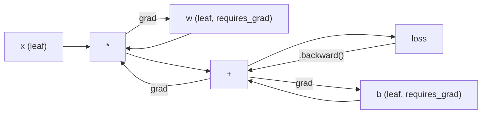
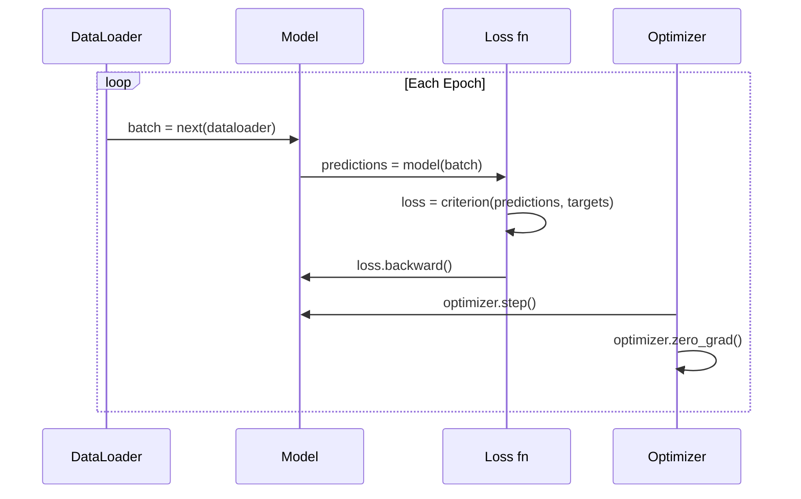

# Pengantar PyTorch

> kamu membuat mesin dari piston dan poros engkol. Sekarang pelajari mobil yang sebenarnya dikendarai semua orang.

**Type:** Build
**Language:** Python
**Prerequisites:** Lesson 03.10 (Membangun Kerangka Mini kamu Sendiri)
**Waktu:** ~75 menit

## Tujuan Pembelajaran

- Build dan latih neural network menggunakan nn.Module, nn.Sequential, dan autograd PyTorch
- Gunakan tensor PyTorch, akselerasi GPU, dan loop training standar (zero_grad, maju, hilang, mundur, langkah)
- Ubah komponen kerangka mini dari awal menjadi setara dengan PyTorch
- Profil dan bandingkan kecepatan training antara kerangka Python murni kamu dan PyTorch pada tugas yang sama

## Masalah

kamu memiliki kerangka mini yang berfungsi. Layer linier, ReLU, dropout, norm batch, Adam, DataLoader, loop training. Ini melatih jaringan 4 lapis pada masalah klasifikasi lingkaran dengan Python murni.

Ini juga 500x lebih lambat dari PyTorch pada masalah yang sama.

Kerangka kerja mini kamu memproses satu sample dalam satu waktu dengan loop Python bersarang. PyTorch mengirimkan operasi yang sama ke kernel C++/CUDA yang dioptimalkan yang berjalan pada GPU. Pada satu NVIDIA A100, PyTorch melatih ResNet-50 (25,6 juta parameter) di ImageNet (1,28 juta gambar) dalam waktu sekitar 6 jam. Kerangka kerja kamu akan memakan waktu sekitar 3.000 jam untuk mengerjakan tugas yang sama -- jika tidak kehabisan memori terlebih dahulu.

Kecepatan bukanlah satu-satunya kesenjangan. Kerangka kerja kamu tidak memiliki dukungan GPU. Tidak ada diferensiasi otomatis -- kamu menulis secara manual backward() untuk setiap modul. Tidak ada serialisasi. Tidak ada training terdistribusi. Tidak ada presisi campuran. Tidak ada cara untuk men-debug aliran gradient tanpa pernyataan cetak.

PyTorch mengisi setiap celah ini. Dan ia melakukannya sambil mempertahankan model mental yang sama persis dengan yang telah kamu buat: Modul, maju(), parameter(), mundur(), optimizer.langkah(). Konsep-konsep tersebut ditransfer satu-ke-satu. Sintaksnya hampir identik. Perbedaannya adalah PyTorch membungkus satu dekade rekayasa sistem di balik antarmuka yang sama yang kamu rancang dari awal.

## Konsep

### Mengapa PyTorch Menang

Pada tahun 2015, TensorFlow mengharuskan kamu menentukan grafik komputasi statis sebelum menjalankan apa pun. kamu membuat grafik, mengompilasinya, lalu memasukkan data ke dalamnya. Debugging berarti menatap visualisasi grafik. Mengubah arsitektur berarti membangun kembali grafik dari awal.

PyTorch diluncurkan pada tahun 2017 dengan filosofi berbeda: eksekusi yang bersemangat. kamu menulis Python. Ini segera berjalan. `y = model(x)` sebenarnya menghitung y saat ini, bukan "menambahkan simpul ke grafik yang akan menghitung y nanti". Ini berarti alat debugging Python standar berfungsi. cetak() berhasil. pdb berhasil. if/else di forward pass kamu berhasil.

Pada tahun 2020, pasar telah berbicara. Pangsa PyTorch dalam makalah penelitian ML meningkat dari 7% (2017) menjadi lebih dari 75% (2022). Meta, Google DeepMind, OpenAI, Anthropic, dan Hugging Face semuanya menggunakan PyTorch sebagai kerangka utama mereka. TensorFlow 2.x mengadopsi eksekusi yang bersemangat sebagai respons -- pengakuan diam-diam bahwa desain PyTorch sudah benar.

Pelajarannya: senyawa pengalaman pengembang. Kerangka kerja yang 10% lebih lambat namun 50% lebih cepat untuk melakukan debug selalu menang.

### Tensor

Tensor adalah array multidimensi dengan tiga properti penting: bentuk, tipe d, dan perangkat.

```python
import torch

x = torch.zeros(3, 4)           # shape: (3, 4), dtype: float32, device: cpu
x = torch.randn(2, 3, 224, 224) # batch of 2 RGB images, 224x224
x = torch.tensor([1, 2, 3])     # from a Python list
```

**Bentuk** adalah dimensinya. Scalar adalah bentuk (), vector adalah (n,), matrix adalah (m, n), kumpulan gambar adalah (batch, pipeline, tinggi, lebar).

**Dtype** mengontrol presisi dan memori.| ketik | Bit | Rentang | Kasus penggunaan |
|-------|------|-------|----------|
| float32 | 32 | ~7 angka desimal | Training bawaan |
| mengapung16 | 16 | ~3,3 angka desimal | Presisi campuran |
| bfloat16 | 16 | Kisaran yang sama dengan float32, kurang presisi | training LLM |
| int8 | 8 | -128 hingga 127 | Inference terkuantisasi |

**Perangkat** menentukan tempat penghitungan dilakukan.

```python
device = torch.device("cuda" if torch.cuda.is_available() else "cpu")
x = torch.randn(3, 4, device=device)
x = x.to("cuda")
x = x.cpu()
```

Setiap operasi memerlukan semua tensor pada perangkat yang sama. Ini adalah kesalahan pemula PyTorch #1 yang terjadi: `RuntimeError: Expected all tensors to be on the same device`. Perbaiki dengan memindahkan semuanya ke perangkat yang sama sebelum komputasi.

**Pembentukan ulang** bersifat konstan -- ini mengubah metadata, bukan data.

```python
x = torch.randn(2, 3, 4)
x.view(2, 12)      # reshape to (2, 12) -- must be contiguous
x.reshape(6, 4)    # reshape to (6, 4) -- works always
x.permute(2, 0, 1) # reorder dimensions
x.unsqueeze(0)     # add dimension: (1, 2, 3, 4)
x.squeeze()        # remove size-1 dimensions
```

### Otomatis

Kerangka kerja mini kamu mengharuskan kamu mengimplementasikan backward() untuk setiap modul. PyTorch tidak. Ini mencatat setiap operasi pada tensor ke dalam grafik asiklik terarah (grafik komputasi) dan kemudian melintasi grafik tersebut secara terbalik untuk menghitung gradient secara otomatis.



Perbedaan utama dari framework kamu: PyTorch menggunakan autodiff berbasis tape. Setiap operasi ditambahkan ke "rekaman" selama umpan maju. Memanggil `.backward()` akan memutar ulang rekaman secara terbalik.

```python
x = torch.randn(3, requires_grad=True)
y = x ** 2 + 3 * x
z = y.sum()
z.backward()
print(x.grad)  # dz/dx = 2x + 3
```

Tiga aturan autograd:

1. Hanya tensor daun dengan `requires_grad=True` yang mengumpulkan gradient
2. Gradient terakumulasi secara default -- panggil `optimizer.zero_grad()` sebelum setiap gerakan mundur
3. `torch.no_grad()` menonaktifkan pelacakan gradient (digunakan selama evaluasi)

### nn.Modul

`nn.Module` adalah kelas dasar untuk setiap komponen neural network di PyTorch. kamu sudah membuat abstraksi ini di Lesson 10. Versi PyTorch menambahkan registrasi parameter otomatis, penemuan modul rekursif, manajemen perangkat, dan serialisasi dict status.

```python
import torch.nn as nn

class MLP(nn.Module):
    def __init__(self, input_dim, hidden_dim, output_dim):
        super().__init__()
        self.layer1 = nn.Linear(input_dim, hidden_dim)
        self.relu = nn.ReLU()
        self.layer2 = nn.Linear(hidden_dim, output_dim)

    def forward(self, x):
        x = self.layer1(x)
        x = self.relu(x)
        x = self.layer2(x)
        return x
```

Saat kamu menetapkan `nn.Module` atau `nn.Parameter` sebagai atribut di `__init__`, PyTorch secara otomatis mendaftarkannya. `model.parameters()` mengumpulkan setiap parameter terdaftar secara rekursif. Inilah sebabnya mengapa kamu tidak perlu mengumpulkan weight secara manual seperti yang kamu lakukan pada kerangka mini.

Blok bangunan utama:

| Modul | Apa fungsinya | Parameter |
|--------|-------------|------------|
| nn.Linear(masuk, keluar) | Wx + b | masuk*keluar + keluar |
| nn.Konv2d(masuk_ch, keluar_ch, k) | Konvolusi 2D | masuk_ch*keluar_ch*k*k + keluar_ch |
| nn.BatchNorm1d(feature) | Normalisasi activation | 2 * feature |
| nn.Putus Sekolah(p) | Penekanan acak | 0 |
| nn.ReLU() | maks(0, x) | 0 |
| nn.GELU() | Kesalahan Gaussian linier | 0 |
| nn.Embedding(vocab, redup) | Tabel pencarian | kosakata * redup |
| nn.LayerNorm(redup) | Normalisasi per sample | 2 * redup |

### Fungsi dan Optimizer Loss

PyTorch mengirimkan versi siap produksi dari semua yang kamu buat.

**Loss function** (dari `torch.nn`):

| Loss | Tugas | Input |
|------|------|-------|
| nn.MSELoss() | Regresi | Bentuk apa pun |
| nn.CrossEntropyLoss() | Klasifikasi jamak | Logit (bukan softmax) |
| nn.BCEDenganLogitsLoss() | Klasifikasi biner | Logit (bukan sigmoid) |
| nn.L1Kerugian() | Regresi (kuat) | Bentuk apa pun |
| nn.CTCLoss() | Penyelarasan urutan | Catat probabilitas |

Catatan: `CrossEntropyLoss` menggabungkan `LogSoftmax` + `NLLLoss` secara internal. Lewati logit mentah, bukan output softmax. Ini adalah kesalahan umum yang menghasilkan gradient yang salah secara diam-diam.

**Optimizer** (dari `torch.optim`):| Optimizer | Kapan menggunakan | LR Khas |
|-----------|-------------|-----------|
| SGD(params, lr, momentum) | CNN, pipeline pipa yang disetel dengan baik | 0,01--0,1 |
| Adam(params, lr) | Titik awal bawaan | 1e-3 |
| AdamW(params, lr, peluruhan_berat) | Transformer, penyempurnaan | 1e-4--1e-3 |
| LBFGS(param) | Skala kecil, orde kedua | 1.0 |

### Lingkaran Training

Setiap loop training PyTorch mengikuti pola 5 langkah yang sama. kamu sudah mengetahui hal ini dari Lesson 10.



Pola kanonik:

```python
for epoch in range(num_epochs):
    model.train()
    for inputs, targets in train_loader:
        inputs, targets = inputs.to(device), targets.to(device)
        optimizer.zero_grad()
        outputs = model(inputs)
        loss = criterion(outputs, targets)
        loss.backward()
        optimizer.step()
```

Lima baris di dalam loop batch. Lima jalur yang melatih GPT-4, Difusi Stabil, dan LLaMA. Arsitekturnya berubah. Datanya berubah. Kelima baris ini tidak.

### Kumpulan Data dan Pemuat Data

`Dataset` PyTorch adalah kelas abstrak dengan dua metode: `__len__` dan `__getitem__`. `DataLoader` membungkusnya dengan batching, shuffle, dan pemuatan data multi-proses.

```python
from torch.utils.data import Dataset, DataLoader

class MNISTDataset(Dataset):
    def __init__(self, images, labels):
        self.images = images
        self.labels = labels

    def __len__(self):
        return len(self.labels)

    def __getitem__(self, idx):
        return self.images[idx], self.labels[idx]

loader = DataLoader(dataset, batch_size=64, shuffle=True, num_workers=4)
```

`num_workers=4` memunculkan 4 proses untuk memuat data secara paralel saat GPU berlatih pada batch saat ini. Pada weight kerja yang terikat pada disk (gambar besar, audio), hal ini saja dapat menggandakan kecepatan training.

### Training GPU

Memindahkan model ke GPU:

```python
device = torch.device("cuda" if torch.cuda.is_available() else "cpu")
model = model.to(device)
```

Ini secara rekursif memindahkan setiap parameter dan buffer ke GPU. Kemudian pindahkan setiap kelompok selama training:

```python
inputs, targets = inputs.to(device), targets.to(device)
```

**Presisi campuran** mengurangi separuh penggunaan memori dan menggandakan throughput pada GPU modern (A100, H100, RTX 4090) dengan menjalankan maju/mundur di float16 sambil mempertahankan weight master di float32:

```python
from torch.amp import autocast, GradScaler

scaler = GradScaler()
for inputs, targets in loader:
    with autocast(device_type="cuda"):
        outputs = model(inputs)
        loss = criterion(outputs, targets)
    scaler.scale(loss).backward()
    scaler.step(optimizer)
    scaler.update()
    optimizer.zero_grad()
```

### Perbandingan: Kerangka Mini vs PyTorch vs JAX

| Feature | Kerangka Mini (L10) | PyTorch | JAX |
|---------|---------------------|---------|-----|
| Perbedaan Otomatis | Manual mundur() | Autograd berbasis pita | Transformasi fungsional |
| Eksekusi | Bersemangat (loop Python) | Bersemangat (kernel C++) | Ditelusuri + JIT dikompilasi |
| Dukungan GPU | Tidak | Ya (CUDA, ROCm, MPS) | Ya (CUDA, TPU) |
| Kecepatan (MNIST MLP) | ~300 detik/zaman | ~0,5 dtk/zaman | ~0,3 dtk/zaman |
| Sistem modul | Kelas Modul Khusus | nn.Modul | Fungsi tanpa kewarganegaraan (Flax/Equinox) |
| Men-debug | cetak() | cetak(), pdb, breakpoint() | Lebih sulit (pelacakan JIT merusak cetakan) |
| Ekosistem | Tidak ada | Memeluk Wajah, Petir, timm | Rami, Optax, Orbax |
| Kurva belajar | kamu membangunnya | Sedang | Curam (paradigma fungsional) |
| Penggunaan produksi | Masalah mainan | Meta, OpenAI, Antropis, HF | Google DeepMind, Tengah Perjalanan |

## Build

MLP 3 lapis yang dilatih di MNIST hanya menggunakan primitif PyTorch. Tidak ada pembungkus tingkat tinggi. Tidak `torchvision.datasets`. Kami mengunduh dan menguraikan sendiri data mentahnya.

### Langkah 1: Muat MNIST Dari File Mentah

MNIST dikirimkan sebagai 4 file gzip: gambar training (60.000 x 28 x 28), label training, gambar pengujian (10.000 x 28 x 28), label pengujian. Kami mengunduhnya dan menguraikan format biner.

```python
import torch
import torch.nn as nn
import struct
import gzip
import urllib.request
import os

def download_mnist(path="./mnist_data"):
    base_url = "https://storage.googleapis.com/cvdf-datasets/mnist/"
    files = [
        "train-images-idx3-ubyte.gz",
        "train-labels-idx1-ubyte.gz",
        "t10k-images-idx3-ubyte.gz",
        "t10k-labels-idx1-ubyte.gz",
    ]
    os.makedirs(path, exist_ok=True)
    for f in files:
        filepath = os.path.join(path, f)
        if not os.path.exists(filepath):
            urllib.request.urlretrieve(base_url + f, filepath)

def load_images(filepath):
    with gzip.open(filepath, "rb") as f:
        magic, num, rows, cols = struct.unpack(">IIII", f.read(16))
        data = f.read()
        images = torch.frombuffer(bytearray(data), dtype=torch.uint8)
        images = images.reshape(num, rows * cols).float() / 255.0
    return images

def load_labels(filepath):
    with gzip.open(filepath, "rb") as f:
        magic, num = struct.unpack(">II", f.read(8))
        data = f.read()
        labels = torch.frombuffer(bytearray(data), dtype=torch.uint8).long()
    return labels
```

### Langkah 2: Tentukan Modelnya

MLP 3 lapis: 784 -> 256 -> 128 -> 10. Activation ReLU. Putus sekolah untuk regularisasi. Tidak ada norm batch untuk membuatnya tetap sederhana.

```python
class MNISTModel(nn.Module):
    def __init__(self):
        super().__init__()
        self.net = nn.Sequential(
            nn.Linear(784, 256),
            nn.ReLU(),
            nn.Dropout(0.2),
            nn.Linear(256, 128),
            nn.ReLU(),
            nn.Dropout(0.2),
            nn.Linear(128, 10),
        )

    def forward(self, x):
        return self.net(x)
```

Layer output menghasilkan 10 logit mentah (satu per digit). Tidak ada softmax -- `CrossEntropyLoss` menanganinya secara internal.

Jumlah parameter: 784*256 + 256 + 256*128 + 128 + 128*10 + 10 = 235.146. Kecil menurut standar modern. GPT-2 kecil memiliki 124M. Ini berlatih dalam hitungan detik.

### Langkah 3: Lingkaran Latihan

Pola langkah maju-rugi-mundur kanonik.

```python
def train_one_epoch(model, loader, criterion, optimizer, device):
    model.train()
    total_loss = 0
    correct = 0
    total = 0
    for images, labels in loader:
        images, labels = images.to(device), labels.to(device)
        optimizer.zero_grad()
        outputs = model(images)
        loss = criterion(outputs, labels)
        loss.backward()
        optimizer.step()
        total_loss += loss.item() * images.size(0)
        _, predicted = outputs.max(1)
        correct += predicted.eq(labels).sum().item()
        total += labels.size(0)
    return total_loss / total, correct / total


def evaluate(model, loader, criterion, device):
    model.eval()
    total_loss = 0
    correct = 0
    total = 0
    with torch.no_grad():
        for images, labels in loader:
            images, labels = images.to(device), labels.to(device)
            outputs = model(images)
            loss = criterion(outputs, labels)
            total_loss += loss.item() * images.size(0)
            _, predicted = outputs.max(1)
            correct += predicted.eq(labels).sum().item()
            total += labels.size(0)
    return total_loss / total, correct / total
```Catat `torch.no_grad()` selama evaluasi. Ini menonaktifkan autograd, mengurangi penggunaan memori dan mempercepat inference. Tanpanya, PyTorch membuat grafik komputasi yang tidak pernah kamu gunakan.

### Langkah 4: Satukan Semuanya

```python
def main():
    device = torch.device("cuda" if torch.cuda.is_available() else "cpu")

    download_mnist()
    train_images = load_images("./mnist_data/train-images-idx3-ubyte.gz")
    train_labels = load_labels("./mnist_data/train-labels-idx1-ubyte.gz")
    test_images = load_images("./mnist_data/t10k-images-idx3-ubyte.gz")
    test_labels = load_labels("./mnist_data/t10k-labels-idx1-ubyte.gz")

    train_dataset = torch.utils.data.TensorDataset(train_images, train_labels)
    test_dataset = torch.utils.data.TensorDataset(test_images, test_labels)
    train_loader = torch.utils.data.DataLoader(
        train_dataset, batch_size=64, shuffle=True
    )
    test_loader = torch.utils.data.DataLoader(
        test_dataset, batch_size=256, shuffle=False
    )

    model = MNISTModel().to(device)
    criterion = nn.CrossEntropyLoss()
    optimizer = torch.optim.Adam(model.parameters(), lr=1e-3)

    num_params = sum(p.numel() for p in model.parameters())
    print(f"Device: {device}")
    print(f"Parameters: {num_params:,}")
    print(f"Train samples: {len(train_dataset):,}")
    print(f"Test samples: {len(test_dataset):,}")
    print()

    for epoch in range(10):
        train_loss, train_acc = train_one_epoch(
            model, train_loader, criterion, optimizer, device
        )
        test_loss, test_acc = evaluate(
            model, test_loader, criterion, device
        )
        print(
            f"Epoch {epoch+1:2d} | "
            f"Train Loss: {train_loss:.4f} | Train Acc: {train_acc:.4f} | "
            f"Test Loss: {test_loss:.4f} | Test Acc: {test_acc:.4f}"
        )

    torch.save(model.state_dict(), "mnist_mlp.pt")
    print(f"\nModel saved to mnist_mlp.pt")
    print(f"Final test accuracy: {test_acc:.4f}")
```

Output yang diharapkan setelah 10 epoch: ~97,8% akurasi pengujian. Waktu training pada CPU: ~30 detik. Pada GPU: ~5 detik. Pada kerangka mini kamu dengan arsitektur yang sama: ~45 menit.

## Pakai

### Perbandingan Cepat: Kerangka Mini vs PyTorch

| Kerangka Mini (Lesson 10) | PyTorch |
|------------|---------|
| `model = Sequential(Linear(784, 256), ReLU(), ...)` | `model = nn.Sequential(nn.Linear(784, 256), nn.ReLU(), ...)` |
| `pred = model.forward(x)` | `pred = model(x)` |
| `optimizer.zero_grad()` | `optimizer.zero_grad()` |
| `grad = criterion.backward()` lalu `model.backward(grad)` | `loss.backward()` |
| `optimizer.step()` | `optimizer.step()` |
| Tidak ada GPU | `model.to("cuda")` |
| Manual mundur untuk setiap modul | Autograd menangani semuanya |

Antarmukanya hampir identik. Perbedaannya adalah segalanya yang ada di balik terpal.

### Menyimpan dan Memuat Model

```python
torch.save(model.state_dict(), "model.pt")

model = MNISTModel()
model.load_state_dict(torch.load("model.pt", weights_only=True))
model.eval()
```

Selalu simpan `state_dict()` (kamus parameter), bukan objek model. Menyimpan objek model menggunakan acar, yang rusak saat kamu memfaktorkan ulang code. Dikte negara bersifat portabel.

### Penjadwalan Kecepatan Pembelajaran

```python
scheduler = torch.optim.lr_scheduler.CosineAnnealingLR(
    optimizer, T_max=10
)
for epoch in range(10):
    train_one_epoch(model, train_loader, criterion, optimizer, device)
    scheduler.step()
```

PyTorch mengirimkan 15+ penjadwal: StepLR, ExponentialLR, CosineAnnealingLR, OneCycleLR, ReduceLROnPlateau. Semua dicolokkan ke antarmuka optimizer yang sama.

## Kirim

Lesson ini menghasilkan dua artefak:

- `outputs/prompt-pytorch-debugger.md` -- prompt untuk mendiagnosis kegagalan training PyTorch yang umum
- `outputs/skill-pytorch-patterns.md` -- referensi keterampilan untuk pola training PyTorch

## Latihan

1. **Tambahkan normalisasi batch.** Masukkan `nn.BatchNorm1d` setelah setiap layer linier (sebelum activation). Bandingkan akurasi tes dan kecepatan training vs versi dropout saja. Norm batch akan mencapai 98%+ dalam waktu yang lebih sedikit.

2. **Menerapkan pencari learning rate.** Berlatih selama satu periode dengan learning rate yang meningkat secara eksponensial (dari 1e-7 menjadi 1,0). Kehilangan plot vs LR. LR optimal adalah tepat sebelum loss mulai meningkat. Gunakan ini untuk memilih LR yang lebih baik untuk model MNIST.

3. **Port ke GPU dengan presisi campuran.** Tambahkan `torch.amp.autocast` dan `GradScaler` ke loop training. Ukur throughput (sample/detik) dengan dan tanpa presisi campuran pada GPU. Pada A100, harapkan kecepatan ~2x.

4. **Buat Kumpulan Data khusus.** Unduh Fashion-MNIST (format yang sama dengan MNIST tetapi dengan item pakaian). Terapkan kelas `FashionMNISTDataset(Dataset)` dengan `__getitem__` dan `__len__`. Latih MLP yang sama dan bandingkan akurasinya. Fashion-MNIST lebih sulit -- perkirakan ~88% vs ~98%.

5. **Ganti Adam dengan SGD + momentum.** Berlatih dengan `SGD(params, lr=0.01, momentum=0.9)`. Bandingkan kurva konvergensi. Kemudian tambahkan penjadwal `CosineAnnealingLR` dan lihat apakah SGD bisa menyusul Adam pada epoch 10.

## Istilah Kunci| Istilah | Apa kata orang | Apa sebenarnya arti |
|------|----------------|----------------------|
| Tensor | "Array multidimensi" | Array yang diketik dan peka terhadap perangkat dengan dukungan diferensiasi otomatis dimasukkan ke dalam setiap operasi |
| Kelas Otomatis | "Backprop otomatis" | Sistem berbasis tape yang mencatat operasi selama forward pass, kemudian memutar ulang secara terbalik untuk menghitung gradient yang tepat |
| nn.Modul | "Sebuah layer" | Kelas dasar untuk setiap blok komputasi yang dapat dibedakan -- mendaftarkan parameter, mendukung penyarangan, menangani mode training/eval |
| state_dict | "Modelnya berbobot" | Nama parameter pemetaan OrderedDict ke tensor -- representasi portabel dan dapat diserialkan dari model terlatih |
| .mundur() | "Hitung gradient" | Lintasi grafik komputasi secara terbalik, hitung dan kumpulkan gradient untuk setiap tensor daun dengan require_grad=True |
| .ke(perangkat) | "Pindah ke GPU" | Transfer semua parameter dan buffer secara rekursif ke perangkat yang ditentukan (CPU, CUDA, MPS) |
| Pemuat Data | "Pipa data" | Iterator yang mengelompokkan, mengacak, dan secara opsional memparalelkan pemuatan data dari Kumpulan Data |
| Presisi campuran | "Gunakan float16" | Berlatih dengan float16 maju/mundur untuk kecepatan sambil menjaga weight utama float32 untuk stabilitas numerik |
| Eksekusi yang penuh semangat | "Jalankan sekarang" | Operasi dijalankan segera saat dipanggil, tidak ditangguhkan ke langkah kompilasi berikutnya -- pilihan desain inti yang membedakan PyTorch dari TF 1.x |
| lulusan_nol | "Setel ulang gradient" | Setel semua gradient parameter ke nol sebelum gerakan mundur berikutnya, karena PyTorch mengakumulasikan gradient secara default |

## Bacaan Lanjutan

- Paszke et al., "PyTorch: An Imperative Style, High-Performance Deep Learning Library" (2019) -- makalah asli yang menjelaskan tradeoff desain PyTorch
- Tutorial PyTorch: "Mempelajari PyTorch dengan Contoh" (https://pytorch.org/tutorials/beginner/pytorch_with_examples.html) -- jalur resmi dari tensor ke nn.Module
- Panduan Penyetelan Kinerja PyTorch (https://pytorch.org/tutorials/recipes/recipes/tuning_guide.html) -- presisi campuran, pekerja DataLoader, memori yang di-embed, dan optimization produksi lainnya
- Horace He, "Membuat Pembelajaran Mendalam Menjadi Brrrr" (https://horace.io/brrr_intro.html) -- mengapa training GPU cepat, dengan strategi optimization khusus PyTorch
