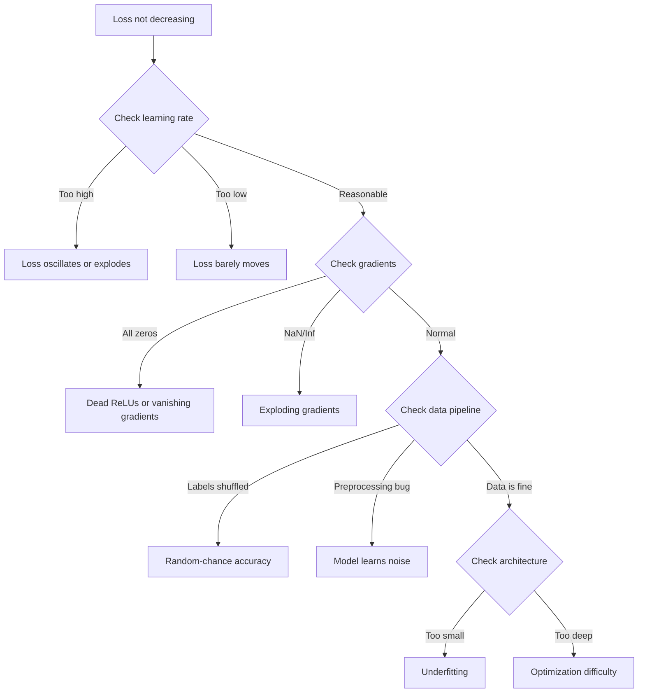
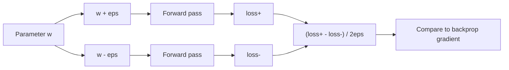
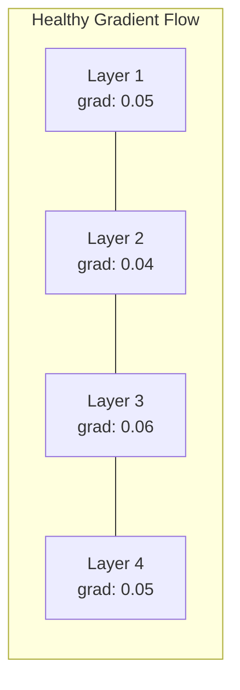
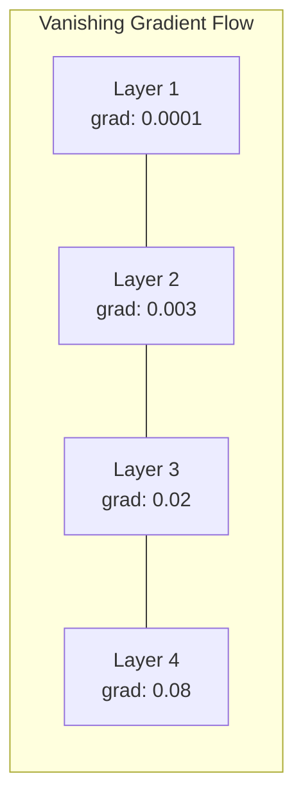
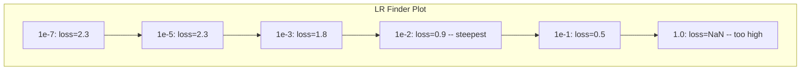

# Men-debug Jaringan Neural

> Jaringan kamu dikompilasi. Itu berlari. Itu menghasilkan sejumlah. Nomornya salah dan tidak ada yang crash. Selamat datang di jenis proses debug yang paling sulit -- jenis proses debug yang tidak menampilkan pesan kesalahan.

**Type:** Latihan
**Language:** Python, PyTorch
**Prerequisites:** Fase 03 Lesson 01-10 (khususnya backpropagation, loss function, optimizer)
**Waktu:** ~90 menit

## Tujuan Pembelajaran

- Mendiagnosis kegagalan neural network yang umum (kehilangan NaN, kurva loss datar, overfitting, osilasi) menggunakan strategi debugging sistematis
- Terapkan teknik "overfit one batch" untuk memverifikasi bahwa arsitektur model dan loop training kamu sudah benar
- Periksa besaran gradient, distribusi activation, dan norm weight untuk mengidentifikasi masalah gradient yang hilang/meledak
- Buat daftar periksa debugging yang mencakup masalah pipeline data, arsitektur model, loss function, optimizer, dan learning rate

## Masalah

Perangkat lunak tradisional crash ketika rusak. Sebuah penunjuk nol memunculkan pengecualian. Ketidakcocokan tipe gagal pada waktu kompilasi. Kesalahan satu per satu menghasilkan output yang jelas salah.

Jaringan saraf tidak memberi kamu kemewahan itu.

Jaringan saraf yang rusak berjalan hingga selesai, mencetak nilai loss, dan mengeluarkan prediksi. Kerugiannya mungkin berkurang. Prediksi tersebut mungkin terlihat masuk akal. Namun model tersebut secara diam-diam salah -- mempelajari jalan pintas, menghafal kebisingan, atau melakukan konvergensi ke nilai minimum lokal yang tidak berguna. Peneliti Google memperkirakan bahwa 60-70% waktu debugging ML dihabiskan untuk bug "diam" yang tidak menghasilkan kesalahan tetapi menurunkan kualitas model.

Perbedaan antara model yang berfungsi dan model yang rusak sering kali terletak pada satu baris yang salah letak: `zero_grad()` yang hilang, dimension yang dialihkan, learning rate turun 10x. "Resep untuk Training Jaringan Syaraf Tiruan" kanonik (2019) dibuka dengan ini: "Kesalahan neural network yang paling umum adalah bug yang tidak mogok."

Lesson ini mengajarkan kamu untuk menemukan bug tersebut.

## Konsep

### Pola Pikir Debugging

Lupakan proses debug cetak-dan-berdoa. Proses debug neural network memerlukan pendekatan sistematis karena putaran umpan balik lambat (menit hingga jam per training) dan gejalanya ambigu (loss buruk dapat berarti 20 hal berbeda).

Aturan emasnya: **mulai dari yang sederhana, tambahkan kerumitan satu per satu, dan verifikasi setiap bagian secara terpisah.**



### Gejala 1 : Loss Tak Menurun

Ini adalah keluhan yang paling umum. Lingkaran training berjalan, zaman terus berlalu, dan kerugiannya tetap datar atau berosilasi dengan liar.

**Learning rate salah.** Terlalu tinggi: loss berosilasi atau melonjak ke NaN. Terlalu rendah: loss berkurang begitu lambat hingga terlihat datar. Untuk Adam, mulai dari 1e-3. Untuk SGD, mulai dari 1e-1 atau 1e-2. Selalu coba 3 learning rate yang masing-masing mencakup 10x (misalnya, 1e-2, 1e-3, 1e-4) sebelum menyimpulkan ada hal lain yang salah.

**ReLU Mati.** Jika neuron ReLU menerima input negatif yang besar, outputnya adalah 0 dan gradiennya adalah 0. Neuron tersebut tidak akan pernah aktif lagi. Jika cukup banyak neuron yang mati, jaringan tidak dapat belajar. Periksa: cetak pecahan activation yang tepat 0 setelah setiap layer ReLU. Jika >50% mati, beralihlah ke LeakyReLU atau kurangi learning rate.

**Vanishing gradient.** Di jaringan dalam dengan activation sigmoid atau tanh, gradient menyusut secara eksponensial saat menyebar ke belakang. Pada saat mencapai layer pertama, jumlahnya ~0. Layer pertama berhenti belajar. Cara mengatasinya: gunakan ReLU/GELU, tambahkan koneksi sisa, atau gunakan normalisasi batch.**Meledaknya gradient.** Masalah sebaliknya -- gradient bertambah secara eksponensial. Umum di RNN dan jaringan yang sangat dalam. Loss melonjak ke NaN. Perbaiki: kliping gradient (`torch.nn.utils.clip_grad_norm_`), turunkan learning rate, atau tambahkan normalisasi.

### Gejala 2: Loss Menurun Namun Modelnya Buruk

Kerugiannya turun. Akurasi latihan mencapai 99%. Tapi akurasi tesnya 55%. Atau model tersebut menghasilkan output yang tidak masuk akal pada data nyata.

**Overfitting.** Model ini mengingat training data, bukan pola pembelajaran. Kesenjangan antara training dan loss validasi semakin besar seiring berjalannya waktu. Perbaiki: lebih banyak data, putus sekolah, penurunan berat badan, penghentian lebih awal, penambahan data.

**Kebocoran data.** Data pengujian bocor ke dalam training. Akurasinya sangat tinggi. Penyebab umum: pengacakan sebelum pemisahan, preprocessing dengan statistik dari dataset lengkap, duplikat sample di seluruh pemisahan. Perbaiki: pisahkan dulu, praproses kedua, periksa duplikat.

**Kesalahan label.** 5-10% label di sebagian besar dataset sebenarnya salah (Northcutt dkk., 2021 -- "Kesalahan Label yang Menyebar di Kumpulan Pengujian"). Model mempelajari kebisingan. Cara mengatasinya: gunakan pembelajaran yang percaya diri untuk menemukan dan memperbaiki contoh yang salah diberi label, atau gunakan pemotongan loss untuk mengabaikan sample dengan loss besar.

### Gejala 3: NaN atau Inf Rugi

Nilai loss menjadi `nan` atau `inf`. Training sudah mati.

**Learning rate terlalu tinggi.** Sejauh ini pembaruan gradient overshoot sehingga weight meledak. Cara mengatasinya: kurangi 10x.

**log(0) atau log(negatif).** Loss lintas entropi menghitung `log(p)`. Jika model kamu menghasilkan tepat 0 atau probabilitas negatif, log akan meledak. Perbaiki: tempelkan prediksi ke `[eps, 1-eps]` di mana `eps=1e-7`.

**Pembagian dengan nol.** Normalisasi batch dibagi dengan deviasi standar. Batch dengan nilai konstan memiliki std=0. Perbaiki: tambahkan epsilon ke penyebut (PyTorch melakukan ini secara default, tetapi implementasi khusus mungkin tidak).

**Luapan numerik.** Activation besar dimasukkan ke `exp()` menghasilkan Inf. Softmax sangat rentan. Cara mengatasinya: kurangi nilai maks sebelum melakukan eksponensial (trik log-sum-exp).

### Teknik 1: Pemeriksaan Gradient

Bandingkan gradient analitik kamu (dari backprop) dengan gradient numerik (dari perbedaan hingga). Jika mereka tidak setuju, backward pass kamu memiliki bug.

Gradient numerik untuk parameter `w`:

```
grad_numerical = (loss(w + eps) - loss(w - eps)) / (2 * eps)
```

Metrik perjanjian (perbedaan relatif):

```
rel_diff = |grad_analytical - grad_numerical| / max(|grad_analytical|, |grad_numerical|, 1e-8)
```

Jika `rel_diff < 1e-5`: benar. Jika `rel_diff > 1e-3`: hampir pasti ada bug.



### Teknik 2: Statistik Activation

Pantau rata-rata dan deviasi standar activation setelah setiap layer selama training. Jaringan yang sehat mempertahankan activation dengan mean mendekati 0 dan std mendekati 1 (setelah normalisasi) atau setidaknya dibatasi.

| Indikator kesehatan | Berarti | Std | Diagnosa |
|-----------------|------|-----|-----------|
| Sehat | ~0 | ~1 | Jaringan belajar secara normal |
| Jenuh | >>0 atau <<0 | ~0 | Activation terhenti pada nilai ekstrim |
| Mati | 0 | 0 | Neuron mati (semua nol) |
| Meledak | >>10 | >>10 | Activation berkembang tanpa batas |

### Teknik 3: Visualisasi Aliran Gradient

Plot besaran gradient rata-rata untuk setiap layer. Dalam jaringan yang sehat, besaran gradient harus kira-kira sama di seluruh layer. Jika layer awal memiliki gradient 1000x lebih kecil dibandingkan layer selanjutnya, kamu memiliki gradient hilang.





### Teknik 4: Tes Overfit-One-Batch

Satu-satunya teknik debugging paling penting dalam pembelajaran mendalam.Ambil satu batch kecil (8-32 sample). Latihlah untuk 100+ iterasi. Kerugiannya akan mendekati nol dan akurasi training harus mencapai 100%. Jika tidak, model atau loop training kamu memiliki bug mendasar -- jangan lanjutkan ke training penuh.

Tes ini menangkap:
- Loss function rusak
- Backward pass yang patah
- Arsitektur terlalu kecil untuk mewakili data
- Optimizer tidak terhubung ke parameter model
- Data dan label tidak selaras

Proses ini membutuhkan waktu 30 detik untuk dijalankan dan menghemat waktu berjam-jam untuk melakukan debug pada proses training penuh.

### Teknik 5: Pencari Kecepatan Pembelajaran

Leslie Smith (2017) mengusulkan peningkatan learning rate dari sangat kecil (1e-7) menjadi sangat besar (10) dalam satu periode sambil mencatat kerugiannya. Kehilangan plot vs learning rate. Learning rate optimal kira-kira 10x lebih kecil dibandingkan kecepatan penurunan loss paling cepat.



LR terbaik dalam contoh ini: ~1e-3 (satu urutan besarnya sebelum titik paling curam).

### Bug PyTorch Umum

Berikut adalah bug yang menghabiskan sebagian besar waktu kolektif di komunitas PyTorch:

| Serangga | Gejala | Perbaiki |
|-----|---------|-----|
| Lupa `optimizer.zero_grad()` | Gradient terakumulasi di seluruh batch, loss berosilasi | Tambahkan `optimizer.zero_grad()` sebelum `loss.backward()` |
| Lupa `model.eval()` pada waktu ujian | Norm dropout dan batch berperilaku berbeda, akurasi pengujian bervariasi antar proses | Tambahkan `model.eval()` dan `torch.no_grad()` |
| Bentuk tensor salah | Siaran senyap memberikan hasil yang salah, tidak ada kesalahan | Cetak bentuk setelah setiap operasi selama debugging |
| Ketidakcocokan CPU/GPU | `RuntimeError: expected CUDA tensor` | Gunakan `.to(device)` pada model DAN data |
| Tidak melepaskan tensor | Grafik komputasi tumbuh selamanya, OOM | Gunakan `.detach()` atau `with torch.no_grad()` |
| Operasi di tempat yang melanggar autograd | `RuntimeError: modified by in-place operation` | Ganti `x += 1` dengan `x = x + 1` |
| Data tidak dinormalisasi | Kalah tertahan pada tingkat peluang acak | Normalisasikan input ke mean=0, std=1 |
| Label sebagai dtype yang salah | Entropi silang diharapkan `Long`, dapatkan `Float` | Label pemeran: `labels.long()` |

### Tabel Debugging Utama

| Gejala | Kemungkinan penyebab | Hal pertama yang harus dicoba |
|---------|-------------|-------------------|
| Loss tertahan di -log(1/num_classes) | Model memprediksi distribusi seragam | Periksa pipeline data, verifikasi label yang cocok dengan input |
| Kehilangan NaN setelah beberapa langkah | Learning rate terlalu tinggi | Kurangi LR sebanyak 10x |
| Rugi NaN segera | log(0) atau pembagian dengan nol | Tambahkan epsilon ke operasi log/divisi |
| Loss berosilasi liar | LR terlalu tinggi atau ukuran batch terlalu kecil | Kurangi LR, tambah ukuran batch |
| Loss menurun lalu stagnan | LR terlalu tinggi untuk fase fine-tuning | Tambahkan jadwal LR (peluruhan kosinus atau langkah) |
| Training acc tinggi, tes acc rendah | Keterlaluan | Tambahkan putus sekolah, penurunan berat badan, lebih banyak data |
| Training acc = tes acc = peluang | Model tidak mempelajari apa pun | Jalankan tes overfit-satu-batch |
| Training acc = tes acc tetapi keduanya rendah | Kurangnya | Model lebih besar, lebih banyak layer, lebih banyak feature |
| Gradient semuanya nol | ReLU mati atau grafik komputasi terlepas | Beralih ke LeakyReLU, centang `.requires_grad` |
| Kehabisan memori selama training | Batch terlalu besar atau grafik tidak dibebaskan | Kurangi ukuran batch, gunakan `torch.no_grad()` untuk eval |

## Build

Perangkat diagnostik yang memantau activation, gradient, dan kurva loss. kamu akan dengan sengaja memutus jaringan dan menggunakan toolkit untuk mendiagnosis setiap masalah.### Langkah 1: Kelas NetworkDebugger

Mengaitkan ke model PyTorch untuk mencatat activation dan statistik gradient per layer.

```python
import torch
import torch.nn as nn
import math


class NetworkDebugger:
    def __init__(self, model):
        self.model = model
        self.activation_stats = {}
        self.gradient_stats = {}
        self.loss_history = []
        self.lr_losses = []
        self.hooks = []
        self._register_hooks()

    def _register_hooks(self):
        for name, module in self.model.named_modules():
            if isinstance(module, (nn.Linear, nn.Conv2d, nn.ReLU, nn.LeakyReLU)):
                hook = module.register_forward_hook(self._make_activation_hook(name))
                self.hooks.append(hook)
                hook = module.register_full_backward_hook(self._make_gradient_hook(name))
                self.hooks.append(hook)

    def _make_activation_hook(self, name):
        def hook(module, input, output):
            with torch.no_grad():
                out = output.detach().float()
                self.activation_stats[name] = {
                    "mean": out.mean().item(),
                    "std": out.std().item(),
                    "fraction_zero": (out == 0).float().mean().item(),
                    "min": out.min().item(),
                    "max": out.max().item(),
                }
        return hook

    def _make_gradient_hook(self, name):
        def hook(module, grad_input, grad_output):
            if grad_output[0] is not None:
                with torch.no_grad():
                    grad = grad_output[0].detach().float()
                    self.gradient_stats[name] = {
                        "mean": grad.mean().item(),
                        "std": grad.std().item(),
                        "abs_mean": grad.abs().mean().item(),
                        "max": grad.abs().max().item(),
                    }
        return hook

    def record_loss(self, loss_value):
        self.loss_history.append(loss_value)

    def check_loss_health(self):
        if len(self.loss_history) < 2:
            return "NOT_ENOUGH_DATA"
        recent = self.loss_history[-10:]
        if any(math.isnan(v) or math.isinf(v) for v in recent):
            return "NAN_OR_INF"
        if len(self.loss_history) >= 20:
            first_half = sum(self.loss_history[:10]) / 10
            second_half = sum(self.loss_history[-10:]) / 10
            if second_half >= first_half * 0.99:
                return "NOT_DECREASING"
        if len(recent) >= 5:
            diffs = [recent[i+1] - recent[i] for i in range(len(recent)-1)]
            if max(diffs) - min(diffs) > 2 * abs(sum(diffs) / len(diffs)):
                return "OSCILLATING"
        return "HEALTHY"

    def check_activations(self):
        issues = []
        for name, stats in self.activation_stats.items():
            if stats["fraction_zero"] > 0.5:
                issues.append(f"DEAD_NEURONS: {name} has {stats['fraction_zero']:.0%} zero activations")
            if abs(stats["mean"]) > 10:
                issues.append(f"EXPLODING_ACTIVATIONS: {name} mean={stats['mean']:.2f}")
            if stats["std"] < 1e-6:
                issues.append(f"COLLAPSED_ACTIVATIONS: {name} std={stats['std']:.2e}")
        return issues if issues else ["HEALTHY"]

    def check_gradients(self):
        issues = []
        grad_magnitudes = []
        for name, stats in self.gradient_stats.items():
            grad_magnitudes.append((name, stats["abs_mean"]))
            if stats["abs_mean"] < 1e-7:
                issues.append(f"VANISHING_GRADIENT: {name} abs_mean={stats['abs_mean']:.2e}")
            if stats["abs_mean"] > 100:
                issues.append(f"EXPLODING_GRADIENT: {name} abs_mean={stats['abs_mean']:.2e}")
        if len(grad_magnitudes) >= 2:
            first_mag = grad_magnitudes[0][1]
            last_mag = grad_magnitudes[-1][1]
            if last_mag > 0 and first_mag / last_mag > 100:
                issues.append(f"GRADIENT_RATIO: first/last = {first_mag/last_mag:.0f}x (vanishing)")
        return issues if issues else ["HEALTHY"]

    def print_report(self):
        print("\n=== NETWORK DEBUGGER REPORT ===")
        print(f"\nLoss health: {self.check_loss_health()}")
        if self.loss_history:
            print(f"  Last 5 losses: {[f'{v:.4f}' for v in self.loss_history[-5:]]}")
        print("\nActivation diagnostics:")
        for item in self.check_activations():
            print(f"  {item}")
        print("\nGradient diagnostics:")
        for item in self.check_gradients():
            print(f"  {item}")
        print("\nPer-layer activation stats:")
        for name, stats in self.activation_stats.items():
            print(f"  {name}: mean={stats['mean']:.4f} std={stats['std']:.4f} zero={stats['fraction_zero']:.1%}")
        print("\nPer-layer gradient stats:")
        for name, stats in self.gradient_stats.items():
            print(f"  {name}: abs_mean={stats['abs_mean']:.2e} max={stats['max']:.2e}")

    def remove_hooks(self):
        for hook in self.hooks:
            hook.remove()
        self.hooks.clear()
```

### Langkah 2: Tes Overfit-Satu-Batch

```python
def overfit_one_batch(model, x_batch, y_batch, criterion, lr=0.01, steps=200):
    optimizer = torch.optim.Adam(model.parameters(), lr=lr)
    model.train()
    print("\n=== OVERFIT ONE BATCH TEST ===")
    print(f"Batch size: {x_batch.shape[0]}, Steps: {steps}")

    for step in range(steps):
        optimizer.zero_grad()
        output = model(x_batch)
        loss = criterion(output, y_batch)
        loss.backward()
        optimizer.step()

        if step % 50 == 0 or step == steps - 1:
            with torch.no_grad():
                preds = (output > 0).float() if output.shape[-1] == 1 else output.argmax(dim=1)
                targets = y_batch if y_batch.dim() == 1 else y_batch.squeeze()
                acc = (preds.squeeze() == targets).float().mean().item()
            print(f"  Step {step:3d} | Loss: {loss.item():.6f} | Accuracy: {acc:.1%}")

    final_loss = loss.item()
    if final_loss > 0.1:
        print(f"\n  FAIL: Loss did not converge ({final_loss:.4f}). Model or training loop is broken.")
        return False
    print(f"\n  PASS: Loss converged to {final_loss:.6f}")
    return True
```

### Langkah 3: Pencari Kecepatan Pembelajaran

```python
def find_learning_rate(model, x_data, y_data, criterion, start_lr=1e-7, end_lr=10, steps=100):
    import copy
    original_state = copy.deepcopy(model.state_dict())
    optimizer = torch.optim.SGD(model.parameters(), lr=start_lr)
    lr_mult = (end_lr / start_lr) ** (1 / steps)

    model.train()
    results = []
    best_loss = float("inf")
    current_lr = start_lr

    print("\n=== LEARNING RATE FINDER ===")

    for step in range(steps):
        optimizer.zero_grad()
        output = model(x_data)
        loss = criterion(output, y_data)

        if math.isnan(loss.item()) or loss.item() > best_loss * 10:
            break

        best_loss = min(best_loss, loss.item())
        results.append((current_lr, loss.item()))

        loss.backward()
        optimizer.step()

        current_lr *= lr_mult
        for param_group in optimizer.param_groups:
            param_group["lr"] = current_lr

    model.load_state_dict(original_state)

    if len(results) < 10:
        print("  Could not complete LR sweep -- loss diverged too quickly")
        return results

    min_loss_idx = min(range(len(results)), key=lambda i: results[i][1])
    suggested_lr = results[max(0, min_loss_idx - 10)][0]

    print(f"  Swept {len(results)} steps from {start_lr:.0e} to {results[-1][0]:.0e}")
    print(f"  Minimum loss {results[min_loss_idx][1]:.4f} at lr={results[min_loss_idx][0]:.2e}")
    print(f"  Suggested learning rate: {suggested_lr:.2e}")

    return results
```

### Langkah 4: Pemeriksa Gradient

```python
def _flat_to_multi_index(flat_idx, shape):
    multi_idx = []
    remaining = flat_idx
    for dim in reversed(shape):
        multi_idx.insert(0, remaining % dim)
        remaining //= dim
    return tuple(multi_idx)


def gradient_check(model, x, y, criterion, eps=1e-4):
    model.train()
    x_double = x.double()
    y_double = y.double()
    model_double = model.double()

    print("\n=== GRADIENT CHECK ===")
    overall_max_diff = 0
    checked = 0

    for name, param in model_double.named_parameters():
        if not param.requires_grad:
            continue

        layer_max_diff = 0

        model_double.zero_grad()
        output = model_double(x_double)
        loss = criterion(output, y_double)
        loss.backward()
        analytical_grad = param.grad.clone()

        num_checks = min(5, param.numel())
        for i in range(num_checks):
            idx = _flat_to_multi_index(i, param.shape)
            original = param.data[idx].item()

            param.data[idx] = original + eps
            with torch.no_grad():
                loss_plus = criterion(model_double(x_double), y_double).item()

            param.data[idx] = original - eps
            with torch.no_grad():
                loss_minus = criterion(model_double(x_double), y_double).item()

            param.data[idx] = original

            numerical = (loss_plus - loss_minus) / (2 * eps)
            analytical = analytical_grad[idx].item()

            denom = max(abs(numerical), abs(analytical), 1e-8)
            rel_diff = abs(numerical - analytical) / denom

            layer_max_diff = max(layer_max_diff, rel_diff)
            checked += 1

        overall_max_diff = max(overall_max_diff, layer_max_diff)
        status = "OK" if layer_max_diff < 1e-5 else "MISMATCH"
        print(f"  {name}: max_rel_diff={layer_max_diff:.2e} [{status}]")

    model.float()

    print(f"\n  Checked {checked} parameters")
    if overall_max_diff < 1e-5:
        print("  PASS: Gradients match (rel_diff < 1e-5)")
    elif overall_max_diff < 1e-3:
        print("  WARN: Small differences (1e-5 < rel_diff < 1e-3)")
    else:
        print("  FAIL: Gradient mismatch detected (rel_diff > 1e-3)")
    return overall_max_diff
```

### Langkah 5: Jaringan yang Sengaja Rusak

Sekarang terapkan toolkit ini ke jaringan yang rusak dan diagnosis masing-masing jaringan.

```python
def demo_broken_networks():
    torch.manual_seed(42)
    x = torch.randn(64, 10)
    y = (x[:, 0] > 0).long()

    print("\n" + "=" * 60)
    print("BUG 1: Learning rate too high (lr=10)")
    print("=" * 60)
    model1 = nn.Sequential(nn.Linear(10, 32), nn.ReLU(), nn.Linear(32, 2))
    debugger1 = NetworkDebugger(model1)
    optimizer1 = torch.optim.SGD(model1.parameters(), lr=10.0)
    criterion = nn.CrossEntropyLoss()
    for step in range(20):
        optimizer1.zero_grad()
        out = model1(x)
        loss = criterion(out, y)
        debugger1.record_loss(loss.item())
        loss.backward()
        optimizer1.step()
    debugger1.print_report()
    debugger1.remove_hooks()

    print("\n" + "=" * 60)
    print("BUG 2: Dead ReLUs from bad initialization")
    print("=" * 60)
    model2 = nn.Sequential(nn.Linear(10, 32), nn.ReLU(), nn.Linear(32, 32), nn.ReLU(), nn.Linear(32, 2))
    with torch.no_grad():
        for m in model2.modules():
            if isinstance(m, nn.Linear):
                m.weight.fill_(-1.0)
                m.bias.fill_(-5.0)
    debugger2 = NetworkDebugger(model2)
    optimizer2 = torch.optim.Adam(model2.parameters(), lr=1e-3)
    for step in range(50):
        optimizer2.zero_grad()
        out = model2(x)
        loss = criterion(out, y)
        debugger2.record_loss(loss.item())
        loss.backward()
        optimizer2.step()
    debugger2.print_report()
    debugger2.remove_hooks()

    print("\n" + "=" * 60)
    print("BUG 3: Missing zero_grad (gradients accumulate)")
    print("=" * 60)
    model3 = nn.Sequential(nn.Linear(10, 32), nn.ReLU(), nn.Linear(32, 2))
    debugger3 = NetworkDebugger(model3)
    optimizer3 = torch.optim.SGD(model3.parameters(), lr=0.01)
    for step in range(50):
        out = model3(x)
        loss = criterion(out, y)
        debugger3.record_loss(loss.item())
        loss.backward()
        optimizer3.step()
    debugger3.print_report()
    debugger3.remove_hooks()

    print("\n" + "=" * 60)
    print("HEALTHY NETWORK: Correct setup for comparison")
    print("=" * 60)
    model_good = nn.Sequential(nn.Linear(10, 32), nn.ReLU(), nn.Linear(32, 2))
    debugger_good = NetworkDebugger(model_good)
    optimizer_good = torch.optim.Adam(model_good.parameters(), lr=1e-3)
    for step in range(50):
        optimizer_good.zero_grad()
        out = model_good(x)
        loss = criterion(out, y)
        debugger_good.record_loss(loss.item())
        loss.backward()
        optimizer_good.step()
    debugger_good.print_report()
    debugger_good.remove_hooks()

    print("\n" + "=" * 60)
    print("OVERFIT-ONE-BATCH TEST (healthy model)")
    print("=" * 60)
    model_test = nn.Sequential(nn.Linear(10, 32), nn.ReLU(), nn.Linear(32, 2))
    overfit_one_batch(model_test, x[:8], y[:8], criterion)

    print("\n" + "=" * 60)
    print("LEARNING RATE FINDER")
    print("=" * 60)
    model_lr = nn.Sequential(nn.Linear(10, 32), nn.ReLU(), nn.Linear(32, 2))
    find_learning_rate(model_lr, x, y, criterion)

    print("\n" + "=" * 60)
    print("GRADIENT CHECK")
    print("=" * 60)
    model_grad = nn.Sequential(nn.Linear(10, 8), nn.ReLU(), nn.Linear(8, 2))
    gradient_check(model_grad, x[:4], y[:4], criterion)
```

## Pakai

### Alat Bawaan PyTorch

```python
import torch
import torch.nn as nn

model = nn.Sequential(
    nn.Linear(768, 256),
    nn.ReLU(),
    nn.Linear(256, 10),
)

with torch.autograd.detect_anomaly():
    output = model(input_tensor)
    loss = criterion(output, target)
    loss.backward()

for name, param in model.named_parameters():
    if param.grad is not None:
        print(f"{name}: grad_mean={param.grad.abs().mean():.2e}")
```

### Integrasi Weight & Bias

```python
import wandb

wandb.init(project="debug-training")

for epoch in range(100):
    loss = train_one_epoch()
    wandb.log({
        "loss": loss,
        "lr": optimizer.param_groups[0]["lr"],
        "grad_norm": torch.nn.utils.clip_grad_norm_(model.parameters(), float("inf")),
    })

    for name, param in model.named_parameters():
        if param.grad is not None:
            wandb.log({f"grad/{name}": wandb.Histogram(param.grad.cpu().numpy())})
```

### Papan Tensor

```python
from torch.utils.tensorboard import SummaryWriter

writer = SummaryWriter("runs/debug_experiment")

for epoch in range(100):
    loss = train_one_epoch()
    writer.add_scalar("Loss/train", loss, epoch)

    for name, param in model.named_parameters():
        writer.add_histogram(f"weights/{name}", param, epoch)
        if param.grad is not None:
            writer.add_histogram(f"gradients/{name}", param.grad, epoch)
```

### Daftar Periksa Debug (Sebelum Training Penuh)

1. Jalankan pengujian overfit-satu-batch. Jika gagal, hentikan.
2. Cetak ringkasan model -- verifikasi jumlah parameter masuk akal.
3. Jalankan satu forward pass dengan data acak -- periksa bentuk output.
4. Berlatih selama 5 epoch -- verifikasi loss berkurang.
5. Periksa statistik activation -- tidak ada layer mati, tidak ada ledakan.
6. Periksa aliran gradient -- tidak hilang, tidak meledak.
7. Verifikasi pipeline data -- cetak 5 sample acak dengan label.

## Kirim

Lesson ini menghasilkan:
- `outputs/prompt-nn-debugger.md` -- prompt untuk mendiagnosis kegagalan training neural network
- `outputs/skill-debug-checklist.md` -- daftar periksa pohon keputusan untuk men-debug masalah training

Pola penerapan utama untuk proses debug:
- Tambahkan kait pemantauan ke skrip training produksi
- Catat activation dan statistik gradient ke W&B atau TensorBoard setiap N langkah
- Menerapkan peringatan otomatis untuk kehilangan NaN, neuron mati (>80% nol), atau ledakan gradient
- Selalu jalankan pengujian overfit-one-batch saat mengubah arsitektur atau pipeline data

## Latihan

1. **Tambahkan pendeteksi gradient yang meledak.** Ubah `NetworkDebugger` untuk mendeteksi ketika gradient melebihi ambang batas dan secara otomatis menyarankan nilai kliping gradient. Uji pada jaringan 20 layer tanpa normalisasi.

2. **Membangun kebangkitan neuron yang mati.** Tulis fungsi yang mengidentifikasi neuron ReLU yang mati (selalu menghasilkan 0) dan menginisialisasi ulang weight masuknya dengan inisialisasi Kaiming. Tunjukkan bahwa tindakan ini memulihkan jaringan yang >70% neuronnya mati.

3. **Menerapkan pencari learning rate dengan plotting.** Perluas `find_learning_rate` untuk menyimpan hasil sebagai CSV dan tulis skrip terpisah yang membaca CSV dan menampilkan kurva LR vs loss menggunakan matplotlib. Identifikasi LR optimal untuk ResNet-18 di CIFAR-10.

4. **Buat validator pipeline data.** Tulis fungsi yang memeriksa: sample duplikat di seluruh pemisahan training/pengujian, ketidakseimbangan distribusi label (rasio >10:1), normalisasi input (rata-rata mendekati 0, std mendekati 1), dan nilai NaN/Inf dalam data. Jalankan pada dataset yang sengaja dirusak.

5. **Debug yang benar-benar gagal.** Ambil mini-framework dari Lesson 10, perkenalkan bug halus (mis., ubah urutan matrix weight ke belakang), dan gunakan pemeriksaan gradient untuk menemukan dengan tepat parameter mana yang memiliki gradient yang salah. Dokumentasikan proses debugging.

## Istilah Kunci| Istilah | Apa kata orang | Apa sebenarnya arti |
|------|----------------|----------------------|
| Serangga senyap | "Ini berjalan tetapi memberikan hasil yang buruk" | Bug yang tidak menghasilkan kesalahan tetapi menurunkan kualitas model -- mode kegagalan dominan di ML |
| ReLU Mati | "Neuron mati" | Neuron ReLU yang masukannya selalu negatif, sehingga mengeluarkan output 0 dan menerima gradient 0 secara permanen |
| Gradient menghilang | "Layer awal berhenti belajar" | Gradient menyusut secara eksponensial melalui layer, membuat weight pada layer awal dibekukan secara efektif |
| Gradient yang meledak | "Loss terjadi pada NaN" | Gradient tumbuh secara eksponensial melalui layer, menyebabkan pembaruan weight begitu besar sehingga meluap |
| Pemeriksaan gradient | "Verifikasi backprop sudah benar" | Membandingkan gradient analitik dari backprop ke gradient numerik dari perbedaan hingga |
| Overfit-satu-batch | "Tes debug paling penting" | Training dalam satu kelompok kecil untuk memverifikasi model BISA dipelajari -- jika tidak bisa, ada sesuatu yang rusak secara mendasar |
| Penemu LR | "Sapu untuk menemukan learning rate yang tepat" | Meningkatkan learning rate secara eksponensial selama satu periode dan memilih kecepatan tepat sebelum loss menyimpang |
| Kebocoran data | "Data pengujian bocor ke dalam training" | Ketika informasi dari set pengujian mencemari training, menghasilkan akurasi yang sangat tinggi |
| Statistik activation | "Pantau kesehatan layer" | Melacak rata-rata, std, dan pecahan nol dari output setiap layer untuk mendeteksi neuron mati, jenuh, atau meledak |
| Kliping gradient | "Batasi besaran gradient" | Menurunkan skala gradient ketika normanya melebihi ambang batas, mencegah ledakan pembaruan gradient |

## Bacaan Lanjutan

- Smith, "Cyclical Learning Rates for Training Neural Networks" (2017) -- makalah yang memperkenalkan uji rentang learning rate (LR finder)
- Northcutt dkk., "Kesalahan Label yang Menyebar dalam Set Pengujian Mengganggu Kestabilan Tolok Ukur Machine Learning" (2021) -- menunjukkan bahwa 3-6% label di ImageNet, CIFAR-10, dan tolok ukur utama lainnya salah
- Zhang dkk., "Memahami Pembelajaran Mendalam Memerlukan Pemikiran Ulang Generalisasi" (2017) -- makalah yang menunjukkan neural network dapat menghafal label acak, itulah sebabnya pengujian satu batch overfit berhasil
- Dokumentasi PyTorch di `torch.autograd.detect_anomaly` dan `torch.autograd.set_detect_anomaly` untuk deteksi NaN/Inf bawaan
