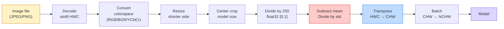
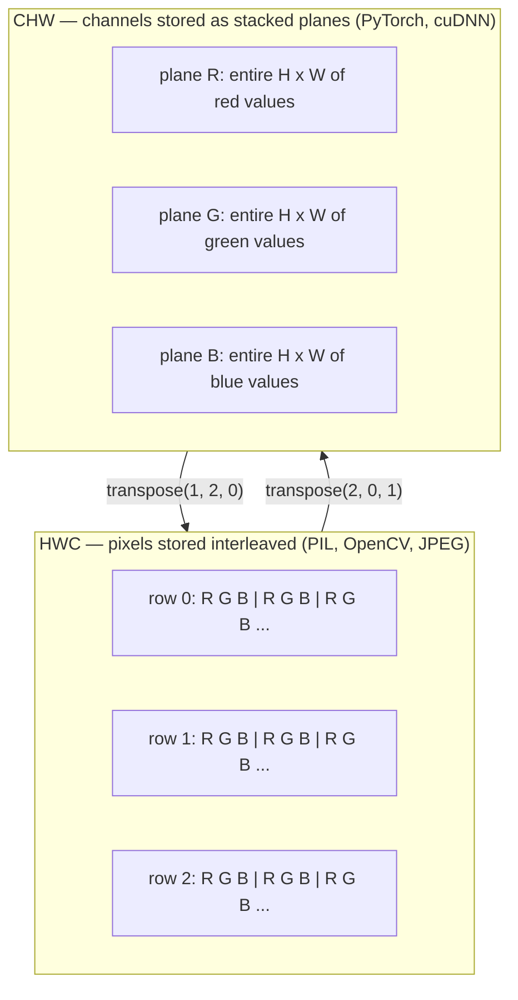

# Dasar-Dasar Gambar — Piksel, Pipeline, Ruang Warna

> Gambar adalah tensor sample cahaya. Setiap model visi yang pernah kamu gunakan dimulai dari satu fakta ini.

**Type:** Build
**Language:** Python
**Prerequisites:** Fase 1 Lesson 12 (Operasi Tensor), Fase 3 Lesson 11 (Pengantar PyTorch)
**Waktu:** ~45 menit

## Tujuan Pembelajaran

- Jelaskan bagaimana adegan kontinu didiskritisasi menjadi piksel dan mengapa keputusan pengambilan sample/kuantisasi menentukan batas tertinggi pada setiap model hilir
- Membaca, mengiris, dan memeriksa gambar sebagai array NumPy dan beralih dengan lancar antara tata letak HWC dan CHW
- Konversi antara RGB, skala abu-abu, HSV, dan YCbCr dan jelaskan mengapa setiap ruang warna ada
- Terapkan pra-pemrosesan tingkat piksel (normalisasi, standarisasi, ubah ukuran, pipeline pertama) persis seperti yang diharapkan oleh torchvision

## Masalah

Setiap makalah yang akan kamu baca, setiap weight terlatih yang akan kamu unduh, setiap API vision yang akan kamu panggil mengasumsikan pengkodean input tertentu. Berikan gambar `uint8` ke tempat yang diinginkan model `float32` dan gambar tersebut akan tetap berjalan — dan secara diam-diam menghasilkan sampah. Masukkan BGR ke jaringan yang dilatih tentang RGB dan akurasinya turun sepuluh poin. Berikan input pipeline-terakhir pada model ketika mengharapkan pipeline-pertama dan layer konv pertama memperlakukan ketinggian sebagai pipeline feature. Semua ini tidak menimbulkan kesalahan. Itu hanya merusak metrik kamu dan kamu menghabiskan waktu seminggu mencari bug yang ada dalam cara kamu memuat file.

Konvolusi tidaklah rumit setelah kamu mengetahui apa yang terjadi. Bagian tersulitnya adalah "sebuah gambar" memiliki arti yang berbeda bagi kamera, dekoder JPEG, PIL, OpenCV, torchvision, dan kernel CUDA. Setiap tumpukan memiliki urutan sumbu, rentang byte, dan konvensi salurannya sendiri. Seorang insinyur visi yang tidak dapat menjaga agar kapal-kapal lurus ini tetap rusak karena pipa-pipanya.

Lesson ini memperbaiki fondasi sehingga fase selanjutnya dapat membangun fondasi tersebut. Pada akhirnya kamu akan mengetahui apa itu piksel, mengapa ada tiga angka per piksel, bukan satu, apa sebenarnya fungsi "normalisasi dengan statistik ImageNet", dan cara berpindah di antara dua atau tiga tata letak yang akan diasumsikan dalam setiap lesson lain di fase ini.

## Konsep

### Sekilas tentang alur preprocessing lengkap

Setiap sistem visi produksi memiliki urutan transformasi reversibel yang sama. Jika terjadi kesalahan satu langkah, model akan melihat input yang berbeda dari yang dilatihnya.



Dua kotak merah dan biru adalah tempat terjadinya 80% kegagalan diam-diam: standarisasi yang hilang dan tata letak yang salah.

### Piksel adalah sample, bukan persegi

Sensor kamera menghitung foton yang mendarat di jaringan detektor kecil. Setiap detektor mengintegrasikan cahaya selama sepersekian detik dan memancarkan tegangan sebanding dengan jumlah foton yang mengenainya. Sensor kemudian mendiskritisasi tegangan tersebut menjadi bilangan bulat. Satu detektor menjadi satu piksel.

```
Continuous scene                 Sensor grid                     Digital image
(infinite detail)                (H x W detectors)               (H x W integers)

    ~~~~~                        +--+--+--+--+--+                 210 198 180 155 120
   ~   ~   ~                     |  |  |  |  |  |                 205 195 178 152 118
  ~ light ~      ---->           +--+--+--+--+--+     ---->       200 190 175 150 115
   ~~~~~                         |  |  |  |  |  |                 195 185 170 148 112
                                 +--+--+--+--+--+                 188 180 165 145 108
```

Ada dua pilihan yang terjadi pada langkah ini dan keduanya menetapkan batasan pada semua hal di hilir:

- **Pengambilan sample spasial** menentukan berapa banyak detektor per derajat pemandangan. Terlalu sedikit, dan ujung-ujungnya menjadi bergerigi (aliasing). Terlalu banyak, penyimpanan dan komputasi akan meledak.
- **Kuantisasi intensitas** menentukan seberapa halus tegangan yang dimasukkan. 8 bit memberikan 256 level dan merupakan standar untuk tampilan. 10, 12, 16 bit memberikan gradient dan materi yang lebih halus untuk pencitraan medis, HDR, dan pipeline sensor mentah.

Piksel bukanlah persegi berwarna yang memiliki luas. Ini adalah pengukuran tunggal. Saat kamu mengubah ukuran atau memutar, kamu mengambil sample ulang kisi pengukuran tersebut.

### Mengapa tiga saluranSatu detektor menghitung foton di seluruh spektrum yang terlihat — yaitu skala abu-abu. Untuk mendapatkan warna, sensor menutupi grid dengan mosaik filter merah, hijau, dan biru. Setelah demosaicing, setiap lokasi spasial memiliki tiga bilangan bulat: respons detektor yang difilter merah, yang difilter hijau, dan yang difilter biru di dekatnya. Ketiga bilangan bulat tersebut adalah triplet RGB piksel.

```
One pixel in memory:

    (R, G, B) = (210, 140, 30)   <- reddish-orange

An H x W RGB image:

    shape (H, W, 3)     stored as   H rows of W pixels of 3 values
                                    each in [0, 255] for uint8
```

Tiga bukanlah keajaiban. Kamera kedalaman menambahkan pipeline Z. Satelit menambahkan pita inframerah dan ultraviolet. Pemindaian medis seringkali memiliki satu pipeline (X-ray, CT) atau banyak (hiperspektral). Jumlah pipeline adalah sumbu terakhir; layer konv belajar untuk mencampurkannya.

### Dua konvensi tata letak: HWC dan CHW

Tensor yang sama, dua pesanan. Setiap perpustakaan memilih satu.

```
HWC (height, width, channels)           CHW (channels, height, width)

   W ->                                    H ->
  +-----+-----+-----+                     +-----+-----+
H |R G B|R G B|R G B|                   C |R R R R R R|
| +-----+-----+-----+                   | +-----+-----+
v |R G B|R G B|R G B|                   v |G G G G G G|
  +-----+-----+-----+                     +-----+-----+
                                          |B B B B B B|
                                          +-----+-----+

   PIL, OpenCV, matplotlib,              PyTorch, most deep learning
   almost every image file on disk       frameworks, cuDNN kernels
```

CHW ada karena kernel konvolusi meluncur melintasi H dan W. Mempertahankan sumbu pipeline terlebih dahulu berarti setiap kernel melihat bidang 2D yang berdekatan per pipeline, yang melakukan vektorisasi dengan rapi. Format disk tetap menggunakan HWC karena cocok dengan cara scanline yang keluar dari sensor.

Konversi satu baris yang akan kamu ketik ribuan kali:

```
img_chw = img_hwc.transpose(2, 0, 1)      # NumPy
img_chw = img_hwc.permute(2, 0, 1)        # PyTorch tensor
```

Tata letak memori, divisualisasikan:



### Rentang byte dan tipe

Tiga konvensi mendominasi:

| Konvensi | ketik | Rentang | Di mana kamu melihatnya |
|------------|-------|-------|------------------|
| Mentah | `uint8` | [0, 255] | File di disk, PIL, output OpenCV |
| Dinormalisasi | `float32` | [0,0, 1,0] | Setelah `img.astype('float32') / 255` |
| Standar | `float32` | kira-kira [-2, +2] | Setelah mengurangkan mean dan membaginya dengan std |

Jaringan konvolusional dilatih tentang input standar. Statistik ImageNet `mean=[0.485, 0.456, 0.406]`, `std=[0.229, 0.224, 0.225]` adalah rata-rata aritmatika dan deviasi standar dari tiga pipeline pada set training ImageNet lengkap, dihitung pada [0, 1] piksel yang dinormalisasi. Memasukkan `uint8` mentah ke dalam model yang mengharapkan float terstandarisasi adalah satu-satunya kegagalan diam-diam yang paling umum dalam visi terapan.

### Ruang warna dan alasan keberadaannya

RGB adalah format pengambilan tetapi tidak selalu merupakan representasi yang paling berguna untuk suatu model.

```
 RGB               HSV                       YCbCr / YUV

 R red             H hue (angle 0-360)       Y luminance (brightness)
 G green           S saturation (0-1)        Cb chroma blue-yellow
 B blue            V value/brightness (0-1)  Cr chroma red-green

 Linear to         Separates color from      Separates brightness from
 sensor output     brightness. Useful for    color. JPEG and most video
                   color thresholding, UI    codecs compress the chroma
                   sliders, simple filters   channels harder because the
                                             human eye is less sensitive
                                             to chroma detail than to Y.
```

Untuk sebagian besar CNN modern, kamu memberi makan RGB. kamu bertemu ruang lain ketika:

- **HSV** — code CV klasik, segmentasi berbasis warna, keseimbangan putih.
- **YCbCr** — membaca internal JPEG, pipeline video, model resolusi super yang hanya beroperasi pada Y.
- **Skala Abu-abu** — OCR, model dokumen, kasus apa pun yang warnanya merupakan variabel pengganggu, bukan sinyal.

Skala abu-abu dari RGB adalah jumlah tertimbang, bukan rata-rata, karena mata manusia lebih sensitif terhadap warna hijau dibandingkan merah atau biru:

```
Y = 0.299 R + 0.587 G + 0.114 B       (ITU-R BT.601, the classic weights)
```

### Rasio aspek, pengubahan ukuran, dan interpolasi

Setiap model memiliki ukuran input tetap (224x224 untuk sebagian besar pengklasifikasi ImageNet, 384x384 atau 512x512 untuk detektor modern). Gambar kamu jarang cocok. Tiga pilihan pengubahan ukuran yang penting:

- **Ubah ukuran sisi yang lebih pendek, lalu potong di tengah** — resep standar ImageNet. Mempertahankan rasio aspek, membuang potongan piksel tepi.
- **Ubah ukuran dan pad** — mempertahankan rasio aspek dan setiap piksel, menambahkan bilah hitam. Standar untuk deteksi dan OCR.
- **Ubah ukuran langsung ke target** — merenggangkan gambar. Murah, mendistorsi geometri, bagus untuk banyak tugas klasifikasi.

Metode interpolasi menentukan bagaimana piksel perantara dihitung ketika kisi baru tidak sejajar dengan kisi lama:

```
Nearest neighbour     fastest, blocky, only choice for masks/labels
Bilinear              fast, smooth, default for most image resizing
Bicubic               slower, sharper on upscaling
Lanczos               slowest, best quality, used for final display
```

Aturan praktisnya: bilinear untuk training, bicubic atau lanczos untuk aset yang akan kamu lihat, terdekat untuk apa pun yang berisi ID kelas bilangan bulat.## Build

### Langkah 1: Muat gambar dan periksa bentuknya

Gunakan Pillow untuk memuat JPEG atau PNG apa pun, konversikan ke NumPy, dan cetak apa yang kamu dapatkan. Untuk contoh deterministik yang berjalan offline, sintesiskan satu.

```python
import numpy as np
from PIL import Image

def synthetic_rgb(h=128, w=192, seed=0):
    rng = np.random.default_rng(seed)
    yy, xx = np.meshgrid(np.linspace(0, 1, h), np.linspace(0, 1, w), indexing="ij")
    r = (np.sin(xx * 6) * 0.5 + 0.5) * 255
    g = yy * 255
    b = (1 - yy) * xx * 255
    rgb = np.stack([r, g, b], axis=-1) + rng.normal(0, 6, (h, w, 3))
    return np.clip(rgb, 0, 255).astype(np.uint8)

arr = synthetic_rgb()
# Or load from disk:
# arr = np.asarray(Image.open("your_image.jpg").convert("RGB"))

print(f"type:   {type(arr).__name__}")
print(f"dtype:  {arr.dtype}")
print(f"shape:  {arr.shape}     # (H, W, C)")
print(f"min:    {arr.min()}")
print(f"max:    {arr.max()}")
print(f"pixel at (0, 0): {arr[0, 0]}")
```

Output yang diharapkan: `shape: (H, W, 3)`, `dtype: uint8`, rentang `[0, 255]`. Itu adalah representasi kanonik pada disk apakah byte tersebut berasal dari kamera, dekoder JPEG, atau generator sintetis.

### Langkah 2: Pisahkan pipeline dan susun ulang tata letak

Tarik keluar R, G, B secara terpisah, lalu konversikan dari HWC ke CHW untuk PyTorch.

```python
R = arr[:, :, 0]
G = arr[:, :, 1]
B = arr[:, :, 2]
print(f"R shape: {R.shape}, mean: {R.mean():.1f}")
print(f"G shape: {G.shape}, mean: {G.mean():.1f}")
print(f"B shape: {B.shape}, mean: {B.mean():.1f}")

arr_chw = arr.transpose(2, 0, 1)
print(f"\nHWC shape: {arr.shape}")
print(f"CHW shape: {arr_chw.shape}")
```

Tiga bidang skala abu-abu, satu bidang per pipeline. CHW baru saja menyusun ulang sumbunya; tidak diperlukan penyalinan data jika tata letak memori mengizinkannya.

### Langkah 3: Konversi skala abu-abu dan HSV

Skala abu-abu jumlah tertimbang, lalu RGB-ke-HSV manual.

```python
def rgb_to_grayscale(rgb):
    weights = np.array([0.299, 0.587, 0.114], dtype=np.float32)
    return (rgb.astype(np.float32) @ weights).astype(np.uint8)

def rgb_to_hsv(rgb):
    rgb_f = rgb.astype(np.float32) / 255.0
    r, g, b = rgb_f[..., 0], rgb_f[..., 1], rgb_f[..., 2]
    cmax = np.max(rgb_f, axis=-1)
    cmin = np.min(rgb_f, axis=-1)
    delta = cmax - cmin

    h = np.zeros_like(cmax)
    mask = delta > 0
    rmax = mask & (cmax == r)
    gmax = mask & (cmax == g)
    bmax = mask & (cmax == b)
    h[rmax] = ((g[rmax] - b[rmax]) / delta[rmax]) % 6
    h[gmax] = ((b[gmax] - r[gmax]) / delta[gmax]) + 2
    h[bmax] = ((r[bmax] - g[bmax]) / delta[bmax]) + 4
    h = h * 60.0

    s = np.where(cmax > 0, delta / cmax, 0)
    v = cmax
    return np.stack([h, s, v], axis=-1)

gray = rgb_to_grayscale(arr)
hsv = rgb_to_hsv(arr)
print(f"gray shape: {gray.shape}, range: [{gray.min()}, {gray.max()}]")
print(f"hsv   shape: {hsv.shape}")
print(f"hue range: [{hsv[..., 0].min():.1f}, {hsv[..., 0].max():.1f}] degrees")
print(f"sat range: [{hsv[..., 1].min():.2f}, {hsv[..., 1].max():.2f}]")
print(f"val range: [{hsv[..., 2].min():.2f}, {hsv[..., 2].max():.2f}]")
```

Hue muncul dalam derajat, saturasi dan nilai dalam [0, 1]. Itu cocok dengan konvensi OpenCV `hsv_full`.

### Langkah 4: Normalisasikan, standarisasikan, dan balikkan

Beralih dari byte mentah ke tensor persis seperti yang diharapkan oleh model ImageNet terlatih, lalu kembali lagi.

```python
mean = np.array([0.485, 0.456, 0.406], dtype=np.float32)
std = np.array([0.229, 0.224, 0.225], dtype=np.float32)

def preprocess_imagenet(rgb_uint8):
    x = rgb_uint8.astype(np.float32) / 255.0
    x = (x - mean) / std
    x = x.transpose(2, 0, 1)
    return x

def deprocess_imagenet(chw_float32):
    x = chw_float32.transpose(1, 2, 0)
    x = x * std + mean
    x = np.clip(x * 255.0, 0, 255).astype(np.uint8)
    return x

x = preprocess_imagenet(arr)
print(f"preprocessed shape: {x.shape}     # (C, H, W)")
print(f"preprocessed dtype: {x.dtype}")
print(f"preprocessed mean per channel:  {x.mean(axis=(1, 2)).round(3)}")
print(f"preprocessed std  per channel:  {x.std(axis=(1, 2)).round(3)}")

roundtrip = deprocess_imagenet(x)
max_diff = np.abs(roundtrip.astype(int) - arr.astype(int)).max()
print(f"roundtrip max pixel diff: {max_diff}    # should be 0 or 1")
```

Rata-rata per pipeline harus mendekati nol, dan mendekati satu. Pasangan praproses/deproses persis seperti yang dilakukan oleh setiap panggilan torchvision `transforms.Normalize`.

### Langkah 5: Ubah ukuran dengan tiga metode interpolasi

Bandingkan terdekat, bilinear, dan bikubik pada skala atas sehingga perbedaannya terlihat.

```python
target = (arr.shape[0] * 3, arr.shape[1] * 3)

nearest = np.asarray(Image.fromarray(arr).resize(target[::-1], Image.NEAREST))
bilinear = np.asarray(Image.fromarray(arr).resize(target[::-1], Image.BILINEAR))
bicubic = np.asarray(Image.fromarray(arr).resize(target[::-1], Image.BICUBIC))

def local_roughness(x):
    gy = np.diff(x.astype(float), axis=0)
    gx = np.diff(x.astype(float), axis=1)
    return float(np.abs(gy).mean() + np.abs(gx).mean())

for name, out in [("nearest", nearest), ("bilinear", bilinear), ("bicubic", bicubic)]:
    print(f"{name:>8}  shape={out.shape}  roughness={local_roughness(out):6.2f}")
```

Nilai terdekat paling tinggi dalam hal kekasaran karena tepiannya tetap keras. Bilinear adalah yang paling halus. Bicubic berada di antara keduanya, mempertahankan ketajaman yang dirasakan tanpa artefak tangga.

## Pakai

`torchvision.transforms` menggabungkan semua hal di atas ke dalam satu pipeline yang dapat dikomposisi. Code di bawah mereproduksi persis apa yang dilakukan `preprocess_imagenet`, ditambah mengubah ukuran dan memotong.

```python
import torch
from torchvision import transforms
from PIL import Image

img = Image.fromarray(synthetic_rgb(256, 256))

pipeline = transforms.Compose([
    transforms.Resize(256),
    transforms.CenterCrop(224),
    transforms.ToTensor(),
    transforms.Normalize(mean=[0.485, 0.456, 0.406], std=[0.229, 0.224, 0.225]),
])

x = pipeline(img)
print(f"tensor type:  {type(x).__name__}")
print(f"tensor dtype: {x.dtype}")
print(f"tensor shape: {tuple(x.shape)}      # (C, H, W)")
print(f"per-channel mean: {x.mean(dim=(1, 2)).tolist()}")
print(f"per-channel std:  {x.std(dim=(1, 2)).tolist()}")

batch = x.unsqueeze(0)
print(f"\nbatched shape: {tuple(batch.shape)}   # (N, C, H, W) — ready for a model")
```

Empat langkah, dengan urutan persis seperti ini: `Resize(256)` menskalakan sisi yang lebih pendek menjadi 256; `CenterCrop(224)` mengambil patch 224x224 dari tengah; `ToTensor()` membagi dengan 255 dan menukar HWC ke CHW; `Normalize` mengurangi mean ImageNet dan membaginya dengan std. Membalikkan urutan itu secara diam-diam akan mengubah apa yang sampai ke model.

## Kirim

Lesson ini menghasilkan:

- `outputs/prompt-vision-preprocessing-audit.md` — prompt yang mengubah kartu model atau kartu dataset apa pun menjadi daftar periksa invarian preprocessing yang tepat yang harus dipenuhi oleh tim.
- `outputs/skill-image-tensor-inspector.md` — keterampilan yang, dengan tensor atau larik berbentuk gambar apa pun, melaporkan tipe, tata letak, rentang, dan apakah terlihat mentah, dinormalisasi, atau distandarisasi.

## Latihan

1. **(Mudah)** Muat JPEG dengan OpenCV (`cv2.imread`) dan dengan Pillow. Cetak bentuk dan pikselnya di `(0, 0)`. Jelaskan perbedaan urutan pipeline, lalu tulis konversi satu baris yang membuat larik OpenCV identik dengan larik Pillow.
2. **(Medium)** Tulis `standardize(img, mean, std)` dan kebalikannya yang bersama-sama lulus pengujian `roundtrip_max_diff <= 1` pada gambar uint8 mana pun. Fungsi kamu harus bekerja pada satu gambar di HWC dan pada batch di NCHW dengan panggilan yang sama.
3. **(Hard)** Ambil tensor berstandar ImageNet 3 pipeline dan jalankan melalui konv 1x1 yang mempelajari campuran RGB berbobot ke dalam satu pipeline skala abu-abu. Inisialisasi weight ke `[0.299, 0.587, 0.114]`, bekukan, dan verifikasi output sesuai dengan manual kamu `rgb_to_grayscale` hingga dalam kesalahan floating-point. Transformasi ruang warna klasik apa lagi yang dapat ditulis sebagai konvolusi 1x1?

## Istilah Kunci| Istilah | Apa kata orang | Apa sebenarnya arti |
|------|----------------|----------------------|
| Piksel | "Kotak berwarna" | Satu contoh intensitas cahaya di satu lokasi grid — tiga angka untuk warna, satu untuk skala abu-abu |
| Pipeline | "Warna" | Salah satu kisi spasial paralel yang ditumpuk menjadi tensor gambar; sumbu terakhir di HWC, pertama di CHW |
| HWC / CHW | "Bentuknya" | Urutan sumbu untuk tensor gambar; disk dan PIL menggunakan HWC, PyTorch dan cuDNN menggunakan CHW |
| Normalisasikan | "Skala gambar" | Bagilah dengan 255 sehingga piksel berada di [0, 1] — perlu tetapi tidak cukup |
| Standarisasi | "Pusat Nol" | Kurangi mean dan bagi dengan std per pipeline sehingga distribusi input sesuai dengan model yang dilatih |
| Konversi skala abu-abu | "Rata-rata pipeline" | Jumlah tertimbang dengan koefisien 0,299/0,587/0,114 yang sesuai dengan persepsi pencahayaan manusia |
| Interpolasi | "Bagaimana mengubah ukuran pengambilan piksel" | Aturan yang menentukan nilai output ketika kisi baru tidak sejajar dengan kisi lama — terdekat untuk label, bilinear untuk training, bikubik untuk tampilan |
| Rasio aspek | "Lebar melebihi tinggi" | Rasio yang membedakan "resize and pad" dengan "resize and stretch" |

## Bacaan Lanjutan

- [Charles Poynton — Tur Ruang Warna Terpandu](https://poynton.ca/PDFs/Guided_tour.pdf) — penjelasan teknis paling jelas tentang mengapa ada begitu banyak ruang warna dan kapan masing-masing ruang warna itu penting
- [PyTorch Vision Transforms Docs](https://pytorch.org/vision/stable/transforms.html) — alur lengkap transformasi yang sebenarnya akan kamu buat dalam produksi
- [Cara Kerja JPEG (Colt McAnlis)](https://www.youtube.com/watch?v=F1kYBnY6mwg) — tur visual yang tajam tentang subsampling kroma, DCT, dan mengapa JPEG mengkodekan YCbCr, bukan RGB
- [Konvensi Pra-pemrosesan ImageNet (model torchvision)](https://pytorch.org/vision/stable/models.html) — sumber kebenaran untuk `mean=[0.485, 0.456, 0.406]` dan alasan setiap model di kebun binatang mengharapkannya
