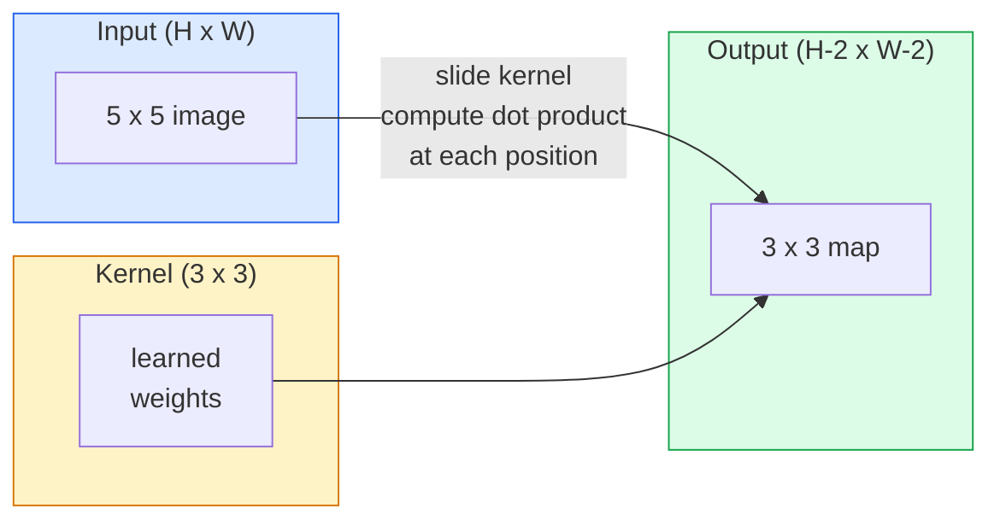
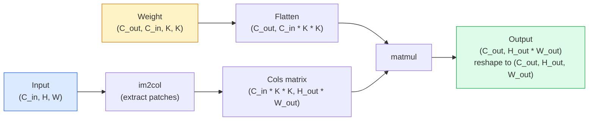

# Konvolusi dari Awal

> Konvolusi adalah layer padat kecil yang kamu geser melintasi gambar, dengan weight yang sama di setiap lokasi.

**Type:** Build
**Language:** Python
**Prerequisites:** Fase 3 (Inti Pembelajaran Mendalam), Fase 4 Lesson 01 (Dasar-Dasar Gambar)
**Waktu:** ~75 menit

## Tujuan Pembelajaran

- Menerapkan konvolusi 2D dari awal hanya menggunakan NumPy, termasuk versi loop bersarang dan versi `im2col` yang divektorkan
- Hitung ukuran spasial output untuk setiap kombinasi ukuran input, ukuran kernel, padding, dan langkah, dan justifikasikan rumus `(H - K + 2P) / S + 1`
- Kernel desain tangan (tepi, buram, pertajam, Sobel) dan jelaskan mengapa masing-masing menghasilkan pola activation yang dilakukannya
- Tumpuk konvolusi ke dalam ekstraktor feature dan hubungkan kedalaman tumpukan dengan ukuran bidang reseptif

## Masalah

Layer yang terhubung sepenuhnya pada gambar RGB 224x224 memerlukan 224 * 224 * 3 = 150.528 weight input per neuron. Satu layer tersembunyi dengan 1.000 unit sudah memiliki 150 juta parameter — sebelum kamu mempelajari sesuatu yang berguna. Lebih buruknya lagi, layer tersebut tidak memiliki anggapan bahwa anjing di kiri atas dan anjing di kanan bawah adalah pola yang sama. Ia memperlakukan setiap posisi piksel sebagai independen, yang sebenarnya salah untuk gambar: menerjemahkan kucing sebanyak tiga piksel tidak seharusnya memaksa jaringan untuk mempelajari kembali konsep tersebut.

Dua properti yang dibutuhkan model gambar adalah **kesetaraan terjemahan** (output bergeser saat input bergeser) dan **berbagi parameter** (detektor feature yang sama berjalan di mana saja). Layer padat tidak memberikan keduanya. Konvolusi memberi kamu berdua secara gratis.

Konvolusi tidak diciptakan untuk pembelajaran mendalam. Ini adalah operasi yang sama yang mendukung kompresi JPEG, Gaussian blur di Photoshop, deteksi tepi dalam visi industri, dan setiap filter audio yang pernah dikirimkan. Alasan CNN mendominasi ImageNet dari tahun 2012 hingga 2020 adalah karena konvolusi adalah prior yang tepat untuk data yang nilai-nilai terdekatnya saling terkait dan pola yang sama dapat muncul di mana saja.

## Konsep

### Satu kernel, geser

Konvolusi 2D mengambil matrix berbobot kecil yang disebut kernel (atau filter), menggesernya melintasi input, dan di setiap lokasi menghitung jumlah produk berdasarkan elemen. Jumlah tersebut menjadi satu piksel output.



Contoh konkret 3x3 pada input 5x5 (tanpa padding, langkah 1):

```
Input X (5 x 5):                Kernel W (3 x 3):

  1  2  0  1  2                   1  0 -1
  0  1  3  1  0                   2  0 -2
  2  1  0  2  1                   1  0 -1
  1  0  2  1  3
  2  1  1  0  1

The kernel slides across every valid 3 x 3 window. Output Y is 3 x 3:

 Y[0,0] = sum( W * X[0:3, 0:3] )
 Y[0,1] = sum( W * X[0:3, 1:4] )
 Y[0,2] = sum( W * X[0:3, 2:5] )
 Y[1,0] = sum( W * X[1:4, 0:3] )
 ... and so on
```

Rumus yang satu itu — **weight bersama, lokalitas, jendela geser** — adalah keseluruhan gagasannya. Segala sesuatu yang lain adalah pembukuan.

### Rumus ukuran output

Diberikan input ukuran spasial `H`, ukuran kernel `K`, padding `P`, langkah `S`:

```
H_out = floor( (H - K + 2P) / S ) + 1
```

Hafalkan ini. kamu akan menghitungnya puluhan kali per arsitektur.

| Skenario | H | K | P | S | H_out |
|----------|---|---|---|---|-------|
| Konv. valid, tanpa padding | 32 | 3 | 0 | 1 | 30 |
| Konv yang sama (mempertahankan ukuran) | 32 | 3 | 1 | 1 | 32 |
| Kurangi sample sebanyak 2 | 32 | 3 | 1 | 2 | 16 |
| Kolam 2x2 | 32 | 2 | 0 | 2 | 16 |
| Bidang reseptif besar | 32 | 7 | 3 | 2 | 16 |

"Padding yang sama" berarti memilih P sehingga H_out == H ketika S == 1. Untuk K ganjil, yaitu P = (K - 1) / 2. Itulah sebabnya kernel 3x3 mendominasi — kernel ganjil terkecil yang masih memiliki pusat.

### Bantalan

Tanpa padding, setiap konvolusi akan mengecilkan peta feature. Tumpuk 20 di antaranya dan gambar 224x224 kamu menjadi 184x184, yang menyia-nyiakan komputasi pada batas dan memperumit koneksi sisa yang memerlukan bentuk yang cocok.

```
Zero padding (P = 1) on a 5 x 5 input:

  0  0  0  0  0  0  0
  0  1  2  0  1  2  0
  0  0  1  3  1  0  0
  0  2  1  0  2  1  0       Now the kernel can centre on pixel
  0  1  0  2  1  3  0       (0, 0) and still have three rows and
  0  2  1  1  0  1  0       three columns of values to multiply.
  0  0  0  0  0  0  0
```Mode yang kamu temui dalam praktik: `zero` (paling umum), `reflect` (mencerminkan tepi, menghindari batas tegas dalam model generatif), `replicate` (menyalin tepi), `circular` (membungkus, digunakan dalam soal toroidal).

### Melangkah

Langkahnya adalah ukuran langkah slide. `stride=1` adalah defaultnya. `stride=2` membagi dua dimension spasial dan merupakan cara klasik untuk melakukan downsample di dalam CNN tanpa layer pengumpulan terpisah — setiap arsitektur modern (ResNet, ConvNeXt, MobileNet) menggunakan konvs melangkah sebagai pengganti max-pool di suatu tempat.

```
Stride 1 on a 5 x 5 input, 3 x 3 kernel:

  starts: (0,0) (0,1) (0,2)        -> output row 0
          (1,0) (1,1) (1,2)        -> output row 1
          (2,0) (2,1) (2,2)        -> output row 2

  Output: 3 x 3

Stride 2 on the same input:

  starts: (0,0) (0,2)              -> output row 0
          (2,0) (2,2)              -> output row 1

  Output: 2 x 2
```

### Beberapa pipeline input

Gambar nyata memiliki tiga pipeline. Konvolusi 3x3 pada input RGB sebenarnya adalah volume 3x3x3: satu irisan 3x3 per pipeline input. Pada setiap posisi spasial, kamu mengalikan dan menjumlahkan ketiga bagian dan menambahkan bias.

```
Input:   (C_in,  H,  W)        3 x 5 x 5
Kernel:  (C_in,  K,  K)        3 x 3 x 3 (one kernel)
Output:  (1,     H', W')       2D map

For a layer that produces C_out output channels, you stack C_out kernels:

Weight:  (C_out, C_in, K, K)   e.g. 64 x 3 x 3 x 3
Output:  (C_out, H', W')       64 x 3 x 3

Parameter count: C_out * C_in * K * K + C_out   (the + C_out is biases)
```

Baris terakhir itulah yang akan kamu hitung saat merencanakan suatu model. Konv 3x3 64 pipeline pada input 3 pipeline memiliki parameter `64 * 3 * 3 * 3 + 64 = 1,792`. Murah.

### Trik im2col

Loop bersarang mudah dibaca tetapi lambat. GPU menginginkan kelipatan matrix yang besar. Caranya: ratakan setiap jendela bidang reseptif input ke dalam satu kolom matrix besar, ratakan kernel menjadi satu baris, dan seluruh konvolusi menjadi satu matmul.



Setiap implementasi konv produksi merupakan beberapa variannya ditambah trik penataan cache (konv langsung, Winograd, konv FFT untuk kernel besar). Pahami im2col maka anda paham intinya.

### Bidang reseptif

Satu konv. 3x3 terlihat pada 9 piksel input. Tumpuk dua konv 3x3 dan satu neuron di layer kedua melihat piksel input 5x5. Tiga konv. 3x3 menghasilkan 7x7. Secara umum:

```
RF after L stacked K x K convs (stride 1) = 1 + L * (K - 1)

With strides:   RF grows multiplicatively with stride along each layer.
```

Alasan utama mengapa "3x3 sepenuhnya" berfungsi (VGG, ResNet, ConvNeXt) adalah karena dua konv 3x3 melihat area input yang sama dengan satu konv 5x5 tetapi dengan parameter lebih sedikit dan non-linearitas ekstra di antaranya.

## Build

### Langkah 1: Padukan array

Mulailah dengan primitif terkecil: fungsi yang diisi dengan nol di sekitar array H x W.

```python
import numpy as np

def pad2d(x, p):
    if p == 0:
        return x
    h, w = x.shape[-2:]
    out = np.zeros(x.shape[:-2] + (h + 2 * p, w + 2 * p), dtype=x.dtype)
    out[..., p:p + h, p:p + w] = x
    return out

x = np.arange(9).reshape(3, 3)
print(x)
print()
print(pad2d(x, 1))
```

Trik sumbu tambahan `x.shape[:-2]` berarti fungsi yang sama berfungsi pada `(H, W)`, `(C, H, W)`, atau `(N, C, H, W)` tanpa modifikasi.

### Langkah 2: Konvolusi 2D dengan loop bersarang

Implementasi referensi — lambat, namun tidak ambigu. Inilah yang pada prinsipnya dilakukan oleh `torch.nn.functional.conv2d`.

```python
def conv2d_naive(x, w, b=None, stride=1, padding=0):
    c_in, h, w_in = x.shape
    c_out, c_in_w, kh, kw = w.shape
    assert c_in == c_in_w

    x_pad = pad2d(x, padding)
    h_out = (h + 2 * padding - kh) // stride + 1
    w_out = (w_in + 2 * padding - kw) // stride + 1

    out = np.zeros((c_out, h_out, w_out), dtype=np.float32)
    for oc in range(c_out):
        for i in range(h_out):
            for j in range(w_out):
                hs = i * stride
                ws = j * stride
                patch = x_pad[:, hs:hs + kh, ws:ws + kw]
                out[oc, i, j] = np.sum(patch * w[oc])
        if b is not None:
            out[oc] += b[oc]
    return out
```

Empat loop bersarang (pipeline output, baris, kolom, ditambah jumlah implisit atas C_in, kh, kw). Ini adalah kebenaran dasar yang akan kamu periksa setiap implementasi yang lebih cepat.

### Langkah 3: Verifikasi dengan kernel yang dirancang sendiri

Buat kernel Sobel vertikal, terapkan pada gambar langkah sintetis, dan lihat tepi vertikal menyala.

```python
def synthetic_step_image():
    img = np.zeros((1, 16, 16), dtype=np.float32)
    img[:, :, 8:] = 1.0
    return img

sobel_x = np.array([
    [[-1, 0, 1],
     [-2, 0, 2],
     [-1, 0, 1]]
], dtype=np.float32)[None]

x = synthetic_step_image()
y = conv2d_naive(x, sobel_x, padding=1)
print(y[0].round(1))
```

Harapkan nilai positif yang besar pada kolom 7 (peningkatan kecerahan dari kiri ke kanan) dan nol di tempat lain. Cetakan tunggal itu adalah pemeriksaan kewarasan kamu apakah perhitungannya benar.

### Langkah 4: im2col

Ubah setiap jendela berukuran kernel di input menjadi kolom matrix. Untuk `C_in=3, K=3`, tiap kolom berisi 27 angka.

```python
def im2col(x, kh, kw, stride=1, padding=0):
    c_in, h, w = x.shape
    x_pad = pad2d(x, padding)
    h_out = (h + 2 * padding - kh) // stride + 1
    w_out = (w + 2 * padding - kw) // stride + 1

    cols = np.zeros((c_in * kh * kw, h_out * w_out), dtype=x.dtype)
    col = 0
    for i in range(h_out):
        for j in range(w_out):
            hs = i * stride
            ws = j * stride
            patch = x_pad[:, hs:hs + kh, ws:ws + kw]
            cols[:, col] = patch.reshape(-1)
            col += 1
    return cols, h_out, w_out
```

Ini masih merupakan loop Python, tetapi sekarang weight beratnya akan menjadi matmul vector tunggal.

### Langkah 5: Konv cepat melalui im2col + matmul

Ganti loop empat kali lipat dengan perkalian satu matrix.

```python
def conv2d_im2col(x, w, b=None, stride=1, padding=0):
    c_out, c_in, kh, kw = w.shape
    cols, h_out, w_out = im2col(x, kh, kw, stride, padding)
    w_flat = w.reshape(c_out, -1)
    out = w_flat @ cols
    if b is not None:
        out += b[:, None]
    return out.reshape(c_out, h_out, w_out)
```

Pemeriksaan kebenaran: jalankan kedua implementasi dan bandingkan.

```python
rng = np.random.default_rng(0)
x = rng.normal(0, 1, (3, 16, 16)).astype(np.float32)
w = rng.normal(0, 1, (8, 3, 3, 3)).astype(np.float32)
b = rng.normal(0, 1, (8,)).astype(np.float32)

y_naive = conv2d_naive(x, w, b, padding=1)
y_im2col = conv2d_im2col(x, w, b, padding=1)

print(f"max abs diff: {np.max(np.abs(y_naive - y_im2col)):.2e}")
````max abs diff` seharusnya ada `1e-5` — perbedaannya adalah urutan akumulasi floating-point, bukan bug.

### Langkah 6: Kumpulan kernel yang dirancang dengan tangan

Lima filter yang menunjukkan apa yang dapat diungkapkan oleh satu layer konv sebelum training apa pun.

```python
KERNELS = {
    "identity": np.array([[0, 0, 0], [0, 1, 0], [0, 0, 0]], dtype=np.float32),
    "blur_3x3": np.ones((3, 3), dtype=np.float32) / 9.0,
    "sharpen": np.array([[0, -1, 0], [-1, 5, -1], [0, -1, 0]], dtype=np.float32),
    "sobel_x": np.array([[-1, 0, 1], [-2, 0, 2], [-1, 0, 1]], dtype=np.float32),
    "sobel_y": np.array([[-1, -2, -1], [0, 0, 0], [1, 2, 1]], dtype=np.float32),
}

def apply_kernel(img2d, kernel):
    x = img2d[None].astype(np.float32)
    w = kernel[None, None]
    return conv2d_im2col(x, w, padding=1)[0]
```

Diterapkan pada gambar skala abu-abu apa pun, kekaburan melembutkan, mempertajam tepian yang tajam, Sobel-x menerangi tepi vertikal, Sobel-y menerangi tepi horizontal. Pola inilah yang akhirnya dipelajari oleh layer konv yang *pertama* dilatih di AlexNet dan VGG — karena model gambar yang baik memerlukan detektor tepi dan gumpalan, apa pun tugas yang akan dilakukan nanti.

## Pakai

`nn.Conv2d` PyTorch menggabungkan operasi yang sama dengan autograd, kernel CUDA, dan optimization cuDNN. Semantik bentuk identik.

```python
import torch
import torch.nn as nn

conv = nn.Conv2d(in_channels=3, out_channels=64, kernel_size=3, stride=1, padding=1)
print(conv)
print(f"weight shape: {tuple(conv.weight.shape)}   # (C_out, C_in, K, K)")
print(f"bias shape:   {tuple(conv.bias.shape)}")
print(f"param count:  {sum(p.numel() for p in conv.parameters())}")

x = torch.randn(8, 3, 224, 224)
y = conv(x)
print(f"\ninput  shape: {tuple(x.shape)}")
print(f"output shape: {tuple(y.shape)}")
```

Tukar `padding=1` dengan `padding=0` dan hasilnya turun menjadi 222x222. Tukar `stride=1` dengan `stride=2` dan ukurannya turun menjadi 112x112. Rumus yang sama yang kamu hafal di atas.

## Kirim

Lesson ini menghasilkan:

- `outputs/prompt-cnn-architect.md` — prompt yang, dengan mempertimbangkan ukuran input, anggaran parameter, dan bidang reseptif target, merancang tumpukan layer `Conv2d` dengan K/S/P yang tepat di setiap langkah.
- `outputs/skill-conv-shape-calculator.md` — keterampilan yang menelusuri spesifikasi jaringan layer by layer dan mengembalikan bentuk output, bidang reseptif, dan jumlah parameter untuk setiap blok.

## Latihan

1. **(Mudah)** Dengan input skala abu-abu 128x128 dan tumpukan `[Conv3x3(s=1,p=1), Conv3x3(s=2,p=1), Conv3x3(s=1,p=1), Conv3x3(s=2,p=1)]`, hitung ukuran spasial output dan bidang reseptif pada setiap layer dengan tangan. Verifikasi dengan PyTorch `nn.Sequential` konv.
2. **(Medium)** Perluas `conv2d_naive` dan `conv2d_im2col` untuk menerima argumen `groups`. Tunjukkan bahwa `groups=C_in=C_out` mereproduksi konvolusi mendalam dan jumlah parameternya adalah `C * K * K` bukan `C * C * K * K`.
3. **(Sulit)** Implementasikan backward pass `conv2d_im2col` dengan tangan: berdasarkan gradient output, hitung gradient `x` dan `w`. Verifikasi terhadap `torch.autograd.grad` pada input dan weight yang sama. Caranya: gradient im2col adalah `col2im`, dan harus mengakumulasi jendela yang tumpang tindih.

## Istilah Kunci| Istilah | Apa kata orang | Apa sebenarnya arti |
|------|----------------|----------------------|
| Konvolusi | "Menggeser filter" | Produk titik yang dapat dipelajari diterapkan di setiap lokasi spasial dengan weight bersama; secara matematis merupakan korelasi silang, tetapi semua orang menyebutnya konvolusi |
| Kernel/filter | "Detektor feature" | Bentuk tensor weight kecil (C_in, K, K) yang perkalian titiknya dengan jendela input menghasilkan satu piksel output |
| Langkah | "Seberapa jauh kamu melompat" | Ukuran langkah antara penempatan kernel berturut-turut; langkah 2 bagian setiap dimension spasial |
| Bantalan | "Nol di tepinya" | Nilai ekstra ditambahkan di sekitar input sehingga kernel dapat berpusat pada piksel perbatasan; `same` padding menjaga ukuran output tetap sama dengan ukuran input |
| Bidang reseptif | "Berapa banyak yang dilihat neuron" | Sepetak input asli yang bergantung pada activation output tertentu, berkembang seiring kedalaman dan langkah |
| im2kol | "Trik GEMM" | Menyusun ulang setiap jendela reseptif menjadi kolom sehingga konvolusi menjadi perkalian matrix besar — ​​​​inti dari setiap kernel konv cepat |
| Konv. mendalam | "Satu kernel per pipeline" | Konv dengan `groups == C_in`, menghitung setiap pipeline output hanya dari pipeline input yang cocok; tulang punggung MobileNet dan ConvNeXt |
| Kesetaraan terjemahan | "Masuk, keluar" | Properti yang menggeser input sebanyak k piksel akan menggeser output sebanyak k piksel; hadir gratis dengan weight bersama |

## Bacaan Lanjutan

- [Panduan aritmatika konvolusi untuk pembelajaran mendalam (Dumoulin & Visin, 2016)](https://arxiv.org/abs/1603.07285) — diagram definitif padding/stride/dilation yang disalin secara diam-diam oleh setiap kursus
- [CS231n: Convolutional Neural Networks for Visual Recognition](https://cs231n.github.io/convolutional-networks/) — catatan kuliah kanonik, termasuk penjelasan im2col asli
- [The Annotated ConvNet (fast.ai)](https://nbviewer.org/github/fastai/fastbook/blob/master/13_convolutions.ipynb) — buku catatan yang berjalan dari konvolusi manual ke pengklasifikasi digit terlatih
- [Aritmatika Bidang Reseptif untuk CNN (Dang Ha The Hien)](https://distill.pub/2019/computing-receptive-fields/) — penjelasan interaktif berkualitas kertas untuk penghitungan bidang reseptif
