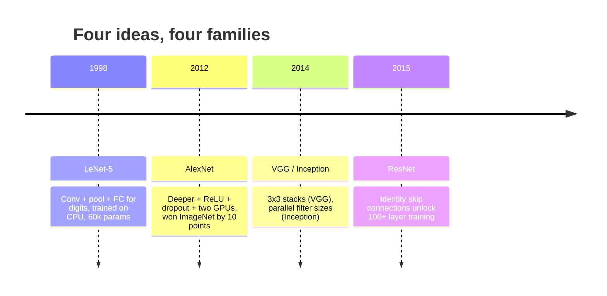
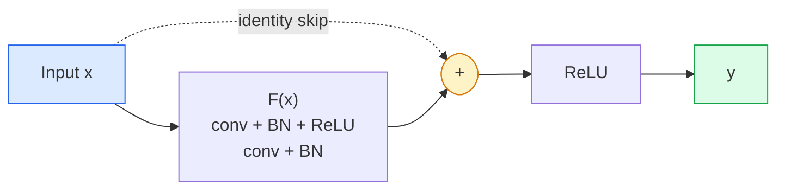

# CNN — LeNet ke ResNet

> Setiap CNN besar dalam tiga puluh tahun terakhir memiliki resep konv–nonlinier–downsample yang sama dengan satu ide baru yang muncul. Learn ide-idenya secara berurutan.

**Type:** Learn + Build
**Language:** Python
**Prerequisites:** Fase 3 Lesson 11 (PyTorch), Fase 4 Lesson 01 (Dasar-Dasar Gambar), Fase 4 Lesson 02 (Konvolusi dari Awal)
**Waktu:** ~75 menit

## Tujuan Pembelajaran

- Telusuri silsilah arsitektur LeNet-5 -> AlexNet -> VGG -> Inception -> ResNet dan nyatakan satu ide baru yang disumbangkan setiap keluarga
- Menerapkan LeNet-5, blok bergaya VGG, dan ResNet BasicBlock di PyTorch, masing-masing di bawah 40 baris
- Jelaskan mengapa koneksi sisa mengubah jaringan 1.000 layer dari tidak dapat dilatih menjadi canggih
- Baca tulang punggung modern (ResNet-18, ResNet-50) dan prediksi bentuk keluarannya, bidang reseptif, dan jumlah parameter sebelum melihat sumbernya

## Masalah

Pada tahun 2011, pengklasifikasi ImageNet terbaik mencetak sekitar 74% akurasi teratas. Pada tahun 2012 AlexNet mencetak 85%. Pada tahun 2015 ResNet mencetak 96%. Tidak ada data baru. Tidak ada generasi GPU baru. Keuntungannya berasal dari ide arsitektur. Seorang insinyur visi kerja harus mengetahui ide mana yang berasal dari makalah mana karena setiap tulang punggung produksi yang kamu kirimkan pada tahun 2026 adalah kombinasi ulang dari bagian-bagian yang sama — dan karena ide-ide tersebut terus berpindah: konv yang dikelompokkan berpindah dari CNN ke Transformer, koneksi sisa berpindah dari ResNet ke setiap LLM yang ada, normalisasi batch hidup dalam model difusi.

Mempelajari jaringan-jaringan ini secara berurutan juga membuat kamu kebal terhadap kesalahan umum: menggunakan model terbesar yang tersedia ketika jaringan berukuran LeNet dapat menyelesaikan masalah. MNIST tidak memerlukan ResNet. Mengetahui kurva skala setiap keluarga memberi tahu kamu di mana kamu harus duduk.

## Konsep

### Empat ide yang mengubah visi



Tidak ada hal lain dalam visi klasik yang lebih penting daripada empat lompatan ini.

### LeNet-5 (1998)

Pengenal digit Yann LeCun. 60.000 parameter. Dua blok kumpulan konv, dua layer yang terhubung sepenuhnya, activation tanh. Ini mendefinisikan templat yang diwarisi setiap CNN:

```
input (1, 32, 32)
  conv 5x5 -> (6, 28, 28)
  avg pool 2x2 -> (6, 14, 14)
  conv 5x5 -> (16, 10, 10)
  avg pool 2x2 -> (16, 5, 5)
  flatten -> 400
  dense -> 120
  dense -> 84
  dense -> 10
```

Segala sesuatu yang dunia modern sebut sebagai CNN — konvolusi bergantian dan downsampling yang memberi makan kepala pengklasifikasi kecil — adalah LeNet dengan lebih banyak layer, pipeline lebih besar, dan activation lebih baik.

### AlexNet (2012)

Tiga perubahan yang bersama-sama merusak ImageNet:

1. **ReLU** bukannya tanh. Gradient berhenti menghilang. Latihan dipercepat enam kali lipat.
2. **Dropout** pada head yang tersambung sepenuhnya. Regularisasi menjadi sebuah layer, bukan tipuan.
3. **Kedalaman dan lebar**. Lima layer konv, tiga layer padat, parameter 60 juta, dilatih pada dua GPU dengan model terbagi di dalamnya.

Gambar 2 pada makalah ini masih menunjukkan pembagian GPU sebagai dua aliran paralel. Paralelisme tersebut merupakan solusi perangkat keras, bukan wawasan arsitektural — namun ketiga gagasan di atas masih ada dalam setiap model yang kamu gunakan.

### VGG (2014)

VGG bertanya: apa yang terjadi jika kamu hanya menggunakan konvolusi 3x3 dan mendalaminya?

```
stack:   conv 3x3 -> conv 3x3 -> pool 2x2
repeat:  16 or 19 conv layers
```

Dua konv 3x3 melihat area input 5x5 yang sama dengan satu konv 5x5 tetapi dengan parameter lebih sedikit (2*9*C^2 = 18C^2 vs 25*C^2) dan ReLU tambahan di antaranya. VGG mengubah pengamatan ini menjadi keseluruhan arsitektur. Kesederhanaannya - satu jenis blok, berulang - menjadikannya titik referensi untuk segala sesuatu yang terjadi setelahnya.

Biaya: 138 juta parameter, lambat untuk dilatih, mahal dalam inference.

### Awal (2014, tahun yang sama)

Jawaban Google untuk "berapa ukuran kernel yang harus saya gunakan?" adalah: semuanya, secara paralel.

```mermaid
flowchart LR
    IN["Input feature map"] --> A["1x1 conv"]
    IN --> B["3x3 conv"]
    IN --> C["5x5 conv"]
    IN --> D["3x3 max pool"]
    A --> CAT["Concatenate<br/>along channel axis"]
    B --> CAT
    C --> CAT
    D --> CAT
    CAT --> OUT["Next block"]

    style IN fill:#dbeafe,stroke:#2563eb
    style CAT fill:#fef3c7,stroke:#d97706
    style OUT fill:#dcfce7,stroke:#16a34a
```Setiap cabang berspesialisasi - 1x1 untuk pencampuran pipeline, 3x3 untuk tekstur lokal, 5x5 untuk pola yang lebih besar, penggabungan untuk feature shift-invarian - dan concat memungkinkan layer berikutnya memilih cabang mana pun yang berguna. Inception v1 menggunakan konvolusi 1x1 di dalam setiap cabang sebagai hambatan untuk menjaga jumlah parameter tetap masuk akal.

### Masalah degradasi

Pada tahun 2015, VGG-19 berfungsi dan VGG-32 tidak. Kedalaman seharusnya membantu, tetapi ~20 layer setelah training dan pengujian menjadi lebih buruk. Itu tidak berlebihan. Itu adalah optimizer yang gagal menemukan weight yang berguna karena gradient menyusut secara berlipat ganda di setiap layer.

```
Plain deep network:
  y = f_L( f_{L-1}( ... f_1(x) ... ) )

Gradient wrt early layer:
  dL/dW_1 = dL/dy * df_L/df_{L-1} * ... * df_2/df_1 * df_1/dW_1

Each multiplicative term has magnitude roughly (weight magnitude) * (activation gain).
Stack 100 of them with gains < 1 and the gradient is effectively zero.
```

VGG bekerja pada 19 layer karena norm batch (diterbitkan secara bersamaan) menjaga skala activation tetap baik. Tetapi bahkan norm batch tidak dapat menyelamatkan kedalaman melebihi 30 layer.

### ResNet (2015)

Dia, Zhang, Ren, Sun mengusulkan satu perubahan yang memperbaiki segalanya:

```
standard block:   y = F(x)
residual block:   y = F(x) + x
```

`+ x` berarti layer selalu dapat memilih untuk tidak melakukan apa pun dengan mengarahkan `F(x)` ke nol. ResNet 1.000 lapis sekarang sama buruknya dengan jaringan 1 lapis, karena setiap blok tambahan memiliki jalan keluar yang sepele. Dengan jaminan tersebut, optimizer bersedia membuat setiap blok *sedikit* berguna — dan sedikit berguna, ditumpuk 100 kali, adalah yang tercanggih.



Dua varian blok muncul di mana-mana:

- **BasicBlock** (ResNet-18, ResNet-34): dua konv. 3x3, lewati keduanya.
- **Bottleneck** (ResNet-50, -101, -152): 1x1 ke bawah, 3x3 tengah, 1x1 ke atas, lewati ketiganya. Lebih murah ketika jumlah pipeline tinggi.

Ketika lompatan harus melewati sample bawah (langkah=2), jalur identitas diganti dengan konv 1x1 langkah=2 untuk mencocokkan bentuk.

### Mengapa residu penting di luar penglihatan

Idenya sebenarnya bukan tentang klasifikasi gambar. Ini adalah tentang mengubah jaringan yang dalam dari "bersila jari dan berharap gradient dapat bertahan" menjadi alat teknik yang andal dan dapat diskalakan. Setiap trafo yang akan kamu baca tentang fase berikutnya memiliki koneksi lewati yang sama persis di setiap blok. Tanpa ResNet, tidak ada GPT.

## Build

### Langkah 1: LeNet-5

LeNet yang minimal dan setia. Activation Tanh, pengumpulan rata-rata. Satu-satunya konsesi terhadap modernitas adalah kami menggunakan `nn.CrossEntropyLoss` hilir alih-alih koneksi Gaussian asli.

```python
import torch
import torch.nn as nn
import torch.nn.functional as F

class LeNet5(nn.Module):
    def __init__(self, num_classes=10):
        super().__init__()
        self.conv1 = nn.Conv2d(1, 6, kernel_size=5)
        self.conv2 = nn.Conv2d(6, 16, kernel_size=5)
        self.pool = nn.AvgPool2d(2)
        self.fc1 = nn.Linear(16 * 5 * 5, 120)
        self.fc2 = nn.Linear(120, 84)
        self.fc3 = nn.Linear(84, num_classes)

    def forward(self, x):
        x = self.pool(torch.tanh(self.conv1(x)))
        x = self.pool(torch.tanh(self.conv2(x)))
        x = torch.flatten(x, 1)
        x = torch.tanh(self.fc1(x))
        x = torch.tanh(self.fc2(x))
        return self.fc3(x)

net = LeNet5()
x = torch.randn(1, 1, 32, 32)
print(f"output: {net(x).shape}")
print(f"params: {sum(p.numel() for p in net.parameters()):,}")
```

Hasil yang diharapkan: `output: torch.Size([1, 10])`, `params: 61,706`. Itulah pengklasifikasi seluruh digit yang mengawali visi modern.

### Langkah 2: Blok VGG

Satu blok yang dapat digunakan kembali: dua konv 3x3, ReLU, norm batch, kumpulan maks.

```python
class VGGBlock(nn.Module):
    def __init__(self, in_c, out_c):
        super().__init__()
        self.conv1 = nn.Conv2d(in_c, out_c, kernel_size=3, padding=1)
        self.bn1 = nn.BatchNorm2d(out_c)
        self.conv2 = nn.Conv2d(out_c, out_c, kernel_size=3, padding=1)
        self.bn2 = nn.BatchNorm2d(out_c)
        self.pool = nn.MaxPool2d(2)

    def forward(self, x):
        x = F.relu(self.bn1(self.conv1(x)))
        x = F.relu(self.bn2(self.conv2(x)))
        return self.pool(x)

class MiniVGG(nn.Module):
    def __init__(self, num_classes=10):
        super().__init__()
        self.stack = nn.Sequential(
            VGGBlock(3, 32),
            VGGBlock(32, 64),
            VGGBlock(64, 128),
        )
        self.head = nn.Sequential(
            nn.AdaptiveAvgPool2d(1),
            nn.Flatten(),
            nn.Linear(128, num_classes),
        )

    def forward(self, x):
        return self.head(self.stack(x))

net = MiniVGG()
x = torch.randn(1, 3, 32, 32)
print(f"output: {net(x).shape}")
print(f"params: {sum(p.numel() for p in net.parameters()):,}")
```

Tiga blok VGG pada input berukuran CIFAR, kumpulan adaptif, satu layer linier. ~290 ribu parameter. Banyak untuk CIFAR-10.

### Langkah 3: Blok Dasar ResNet

Blok penyusun inti ResNet-18 dan ResNet-34.

```python
class BasicBlock(nn.Module):
    def __init__(self, in_c, out_c, stride=1):
        super().__init__()
        self.conv1 = nn.Conv2d(in_c, out_c, kernel_size=3, stride=stride, padding=1, bias=False)
        self.bn1 = nn.BatchNorm2d(out_c)
        self.conv2 = nn.Conv2d(out_c, out_c, kernel_size=3, stride=1, padding=1, bias=False)
        self.bn2 = nn.BatchNorm2d(out_c)
        if stride != 1 or in_c != out_c:
            self.shortcut = nn.Sequential(
                nn.Conv2d(in_c, out_c, kernel_size=1, stride=stride, bias=False),
                nn.BatchNorm2d(out_c),
            )
        else:
            self.shortcut = nn.Identity()

    def forward(self, x):
        out = F.relu(self.bn1(self.conv1(x)))
        out = self.bn2(self.conv2(out))
        out = out + self.shortcut(x)
        return F.relu(out)
```

`bias=False` pada layer konv adalah konvensi norm batch — parameter beta BN sudah menangani bias, jadi membawa bias konv juga merupakan hal yang sia-sia. `shortcut` hanya memerlukan konv nyata ketika jumlah langkah atau pipeline berubah; jika tidak, itu adalah identitas tanpa operasi.

### Langkah 4: ResNet kecil

Tumpuk empat grup BasicBlocks untuk mendapatkan ResNet yang berfungsi untuk input berukuran CIFAR.

```python
class TinyResNet(nn.Module):
    def __init__(self, num_classes=10):
        super().__init__()
        self.stem = nn.Sequential(
            nn.Conv2d(3, 32, kernel_size=3, stride=1, padding=1, bias=False),
            nn.BatchNorm2d(32),
            nn.ReLU(inplace=True),
        )
        self.layer1 = self._make_group(32, 32, num_blocks=2, stride=1)
        self.layer2 = self._make_group(32, 64, num_blocks=2, stride=2)
        self.layer3 = self._make_group(64, 128, num_blocks=2, stride=2)
        self.layer4 = self._make_group(128, 256, num_blocks=2, stride=2)
        self.head = nn.Sequential(
            nn.AdaptiveAvgPool2d(1),
            nn.Flatten(),
            nn.Linear(256, num_classes),
        )

    def _make_group(self, in_c, out_c, num_blocks, stride):
        blocks = [BasicBlock(in_c, out_c, stride=stride)]
        for _ in range(num_blocks - 1):
            blocks.append(BasicBlock(out_c, out_c, stride=1))
        return nn.Sequential(*blocks)

    def forward(self, x):
        x = self.stem(x)
        x = self.layer1(x)
        x = self.layer2(x)
        x = self.layer3(x)
        x = self.layer4(x)
        return self.head(x)

net = TinyResNet()
x = torch.randn(1, 3, 32, 32)
print(f"output: {net(x).shape}")
print(f"params: {sum(p.numel() for p in net.parameters()):,}")
```

Empat kelompok yang masing-masing terdiri dari dua blok. Langkah 2 di awal grup 2, 3, 4. Jumlah pipeline berlipat ganda pada setiap downsample. Sekitar 2,8 juta parameter. Itu adalah resep standar yang berskala hingga ResNet-152.

### Langkah 5: Bandingkan efisiensi parameter dengan fiturJalankan input yang sama melalui ketiga jaringan dan bandingkan jumlah parameter.

```python
def summary(name, net, x):
    y = net(x)
    params = sum(p.numel() for p in net.parameters())
    print(f"{name:12s}  input {tuple(x.shape)} -> output {tuple(y.shape)}  params {params:>10,}")

x = torch.randn(1, 3, 32, 32)
summary("LeNet5",     LeNet5(),       torch.randn(1, 1, 32, 32))
summary("MiniVGG",    MiniVGG(),      x)
summary("TinyResNet", TinyResNet(),   x)
```

Tiga model, tiga era, tiga kali lipat dalam jumlah parameter. Untuk akurasi CIFAR-10, kamu memerlukan kira-kira: LeNet 60%, MiniVGG 89%, TinyResNet 93% setelah beberapa periode training.

## Pakai

`torchvision.models` memberi kamu versi terlatih dari semua hal di atas. Tanda tangan panggilan identik di seluruh keluarga, yang merupakan inti dari abstraksi tulang punggung.

```python
from torchvision.models import resnet18, ResNet18_Weights, vgg16, VGG16_Weights

r18 = resnet18(weights=ResNet18_Weights.IMAGENET1K_V1)
r18.eval()

print(f"ResNet-18 params: {sum(p.numel() for p in r18.parameters()):,}")
print(r18.layer1[0])
print()

v16 = vgg16(weights=VGG16_Weights.IMAGENET1K_V1)
v16.eval()
print(f"VGG-16   params: {sum(p.numel() for p in v16.parameters()):,}")
```

ResNet-18 memiliki 11,7 juta parameter. VGG-16 memiliki 138M. Akurasi ImageNet teratas yang serupa (69,8% vs 71,6%). Koneksi sisa memberi kamu keuntungan efisiensi parameter 12x. Itulah sebabnya varian ResNet mendominasi dari tahun 2016 hingga ViT hadir pada tahun 2021 — dan masih mendominasi penerapan di dunia nyata dengan komputasi sebagai kendalanya.

Untuk pembelajaran transfer, resepnya selalu sama: memuat yang sudah dilatih sebelumnya, membekukan tulang punggung, mengganti kepala pengklasifikasi.

```python
for p in r18.parameters():
    p.requires_grad = False
r18.fc = nn.Linear(r18.fc.in_features, 10)
```

Tiga baris. kamu sekarang memiliki pengklasifikasi CIFAR 10 kelas yang mewarisi representasi yang dibayar ImageNet.

## Kirim

Lesson ini menghasilkan:

- `outputs/prompt-backbone-selector.md` — prompt yang memilih keluarga CNN yang tepat (LeNet/VGG/ResNet/MobileNet/ConvNeXt) berdasarkan tugas, ukuran dataset, dan anggaran komputasi.
- `outputs/skill-residual-block-reviewer.md` — keterampilan yang membaca modul PyTorch dan menandai kesalahan lewati koneksi (tidak ada pintasan pada perubahan langkah, urutan activation pintasan, penempatan BN relatif terhadap penambahan).

## Latihan

1. **(Mudah)** Hitung parameter dengan tangan untuk `TinyResNet` layer by layer. Bandingkan dengan `sum(p.numel() for p in net.parameters())`. Ke mana perginya sebagian besar anggaran parameter — konv, BN, atau kepala pengklasifikasi?
2. **(Medium)** Implementasikan blok Bottleneck (1x1 -> 3x3 -> 1x1 dengan lompatan) dan gunakan untuk membangun jaringan bergaya ResNet-50 untuk CIFAR. Bandingkan parameter dengan `TinyResNet`.
3. **(Sulit)** Hapus koneksi lewati dari `BasicBlock`, latih jaringan "biasa" 34 blok dan ResNet 34 blok di CIFAR-10 masing-masing selama 10 epoch. Plot loss training vs zaman untuk keduanya. Reproduksi He dkk. Gambar 1 menghasilkan jaringan dalam yang datar menyatu dengan loss yang lebih tinggi dibandingkan jaringan kembarnya yang lebih dangkal.

## Istilah Kunci

| Istilah | Apa kata orang | Apa sebenarnya arti |
|------|----------------|----------------------|
| Tulang punggung | "Modelnya" | Tumpukan blok konvolusional yang menghasilkan peta feature diumpankan ke kepala tugas |
| Koneksi sisa | "Lewati koneksi" | `y = F(x) + x`; memungkinkan optimizer mempelajari identitas dengan menyetel F ke nol, sehingga kedalaman sembarang dapat dilatih |
| Blok Dasar | "Dua konv 3x3 dengan lompatan" | Blok penyusun ResNet-18/34: conv-BN-ReLU-conv-BN-add-ReLU |
| Kemacetan | "1x1 ke bawah, 3x3, 1x1 ke atas" | Blok ResNet-50/101/152; murah dengan jumlah pipeline yang tinggi karena 3x3 berjalan dengan lebar yang dikurangi |
| Masalah degradasi | "Lebih dalam lebih buruk" | Melewati ~20 layer konv biasa, kesalahan training dan pengujian meningkat; diselesaikan dengan koneksi sisa, bukan dengan lebih banyak data |
| Batang | "Layer pertama" | Konversi awal yang mengubah input 3 pipeline menjadi lebar feature dasar; biasanya 7x7 langkah 2 untuk ImageNet, 3x3 langkah 1 untuk CIFAR |
| Kepala | "Pengklasifikasi" | Layer setelah blok tulang punggung terakhir: kumpulan adaptif, rata, linier |
| Pembelajaran transfer | "Weight yang telah dilatih sebelumnya" | Memuat tulang punggung yang dilatih di ImageNet dan hanya menyempurnakan bagian kepala pada tugas kamu |

## Bacaan Lanjutan- [Pembelajaran Residual Mendalam untuk Pengenalan Gambar (He et al., 2015)](https://arxiv.org/abs/1512.03385) — makalah ResNet; setiap angka layak untuk dipelajari
- [Jaringan Konvolusional Sangat Dalam (Simonyan & Zisserman, 2014)](https://arxiv.org/abs/1409.1556) — makalah VGG; masih menjadi referensi terbaik untuk "mengapa 3x3"
- [Klasifikasi ImageNet dengan CNN Dalam (Krizhevsky et al., 2012)](https://papers.nips.cc/paper_files/paper/2012/hash/c399862d3b9d6b76c8436e924a68c45b-Abstract.html) — AlexNet; kertas yang mengakhiri era feature kerajinan tangan
- [Mendalami Konvolusi (Szegedy et al., 2014)](https://arxiv.org/abs/1409.4842) — Inception v1; ide filter paralel yang masih muncul di vision transformer
