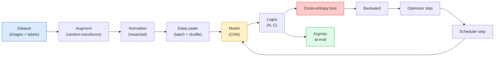

# Klasifikasi Gambar

> Pengklasifikasi adalah fungsi dari piksel ke distribusi probabilitas di seluruh kelas. Segala sesuatu yang lain adalah pipa ledeng.

**Type:** Build
**Language:** Python
**Prerequisites:** Phase 2 Lesson 09 (Evaluasi Model), Phase 3 Lesson 10 (Kerangka Mini), Phase 4 Lesson 03 (CNN)
**Waktu:** ~75 menit

## Tujuan Pembelajaran

- Membangun alur klasifikasi gambar menyeluruh pada CIFAR-10: dataset, augmentasi, model, loop training, evaluasi
- Jelaskan peran masing-masing komponen (pemuat data, loss, optimizer, penjadwal, augmentasi) dan prediksi bagaimana kerusakan salah satu komponen tersebut terwujud dalam kurva loss
- Menerapkan mixup, cutout, dan perataan label dari awal dan memberikan justifikasi kapan masing-masingnya layak ditambahkan
- Baca matrix konfusi dan tabel presisi/penarikan per kelas untuk mendiagnosis dataset dan kegagalan model di luar akurasi agregat

## Masalah

Setiap tugas penglihatan yang dikirimkan direduksi menjadi klasifikasi gambar pada tingkat tertentu. Deteksi mengklasifikasikan wilayah. Segmentasi mengklasifikasikan piksel. Pengambilan peringkat berdasarkan kesamaan dengan centroid kelas. Melakukan klasifikasi dengan benar - perulangan dataset, kebijakan augmentasi, loss, evaluasi - adalah keterampilan yang ditransfer ke setiap tugas lain dalam fase tersebut.

Kebanyakan bug klasifikasi tidak ada dalam model. Hal-hal tersebut masih dalam proses: normalisasi yang rusak, set training yang tidak diacak, augmentasi yang mendistorsi label, pemisahan validasi yang terkontaminasi oleh training data, learning rate yang secara diam-diam menyimpang setelah epoch 30. CNN yang akan mencapai 93% di CIFAR-10 dengan pengaturan yang benar biasanya mendapat skor 70-75% dengan yang rusak, dan kurva loss tampak masuk akal sepanjang waktu.

Lesson ini menyambungkan seluruh pipa dengan tangan sehingga setiap bagian dapat diperiksa. kamu tidak akan menggunakan apa pun dari `torchvision.datasets` yang dapat menyembunyikan bug.

## Konsep

### Pipa klasifikasi



Setiap baris dalam loop ini adalah tempat bug dapat hidup. Entropi silang mengambil logit mentah, bukan output softmax, sehingga setiap `model(x).softmax()` sebelum loss secara diam-diam menghitung gradient yang salah. Augmentasi hanya berlaku pada input, bukan label — kecuali untuk campur aduk, yang menggabungkan keduanya. `optimizer.zero_grad()` harus terjadi satu kali per langkah; melewatkannya akan mengakumulasi gradient dan tampak seperti learning rate yang sangat tidak stabil. Masing-masing bug tersebut meratakan kurva pembelajaran tanpa menimbulkan kesalahan.

### Lintas-entropi, logit, dan softmax

Pengklasifikasi menghasilkan nomor `C` per gambar yang disebut logits. Menerapkan softmax mengubahnya menjadi distribusi probabilitas:

```
softmax(z)_i = exp(z_i) / sum_j exp(z_j)
```

Cross-entropy mengukur probabilitas log negatif dari kelas yang benar:

```
CE(z, y) = -log( softmax(z)_y )
        = -z_y + log( sum_j exp(z_j) )
```

Bentuk sebelah kanan adalah bentuk yang stabil secara numerik (log-sum-exp). `nn.CrossEntropyLoss` PyTorch menggabungkan softmax + NLL dalam satu operasi dan mengambil logit mentah secara langsung. Menerapkan softmax sendiri terlebih dahulu hampir selalu merupakan bug - kamu menghitung log(softmax(softmax(z))), kuantitas yang tidak berarti.

### Mengapa augmentasi berhasil

CNN memiliki bias induktif untuk penerjemahan (dari pembagian weight) tetapi tidak ada invarian bawaan terhadap crop, flips, color jitter, atau oklusi. Satu-satunya cara untuk mengajarkan invarian tersebut adalah dengan menunjukkan piksel yang menerapkannya. Setiap transformasi acak selama training adalah cara untuk mengatakan: "kedua gambar ini memiliki label yang sama; pelajari feature yang mengabaikan perbedaannya."

```
Original crop:  "dog facing left"
Flip:           "dog facing right"       <- same label, different pixels
Rotate(+15):    "dog, slight tilt"
Colour jitter:  "dog in warmer light"
RandomErasing:  "dog with patch missing"
```Aturannya: augmentasi harus mempertahankan labelnya. Pemotongan dan rotasi pada suatu angka dapat mengubah "6" menjadi "9"; untuk dataset tersebut kamu menggunakan rentang rotasi yang lebih kecil dan memilih augmentasi yang menghormati invarian spesifik digit.

### Campuran dan potongan campuran

Augmentasi biasa mengubah piksel tetapi menjaga label tetap menarik. **Mixup** dan **cutmix** hancurkan dengan menginterpolasi keduanya.

```
Mixup:
  lambda ~ Beta(a, a)
  x = lambda * x_i + (1 - lambda) * x_j
  y = lambda * y_i + (1 - lambda) * y_j

Cutmix:
  paste a random rectangle of x_j into x_i
  y = area-weighted mix of y_i and y_j
```

Mengapa ini membantu: model berhenti mengingat target-target yang tajam dan belajar melakukan interpolasi antar kelas. Kehilangan training meningkat, akurasi pengujian meningkat. Ini adalah satu-satunya peningkatan ketahanan termurah untuk pengklasifikasi mana pun.

### Penghalusan label

Sepupu dari campur aduk. Daripada berlatih melawan `[0, 0, 1, 0, 0]`, berlatihlah melawan `[eps/C, eps/C, 1-eps, eps/C, eps/C]` untuk `eps` kecil seperti 0,1. Menghentikan model menghasilkan log yang tajam secara sewenang-wenang dan meningkatkan kalibrasi hampir tanpa biaya. Dibangun ke dalam `nn.CrossEntropyLoss(label_smoothing=0.1)` sejak PyTorch 1.10.

### Evaluasi di luar akurasi

Akurasi agregat menyembunyikan ketidakseimbangan. Pengklasifikasi biner 90-10 yang selalu memprediksi skor kelas mayoritas 90%. Alat yang benar-benar memberi tahu kamu apa yang terjadi:

- **Akurasi per kelas** — satu nomor per kelas; segera menampilkan kategori yang berkinerja buruk.
- **Matrix perplexity** — Kotak C x C dengan baris i kolom j = jumlah kelas sebenarnya yang diprediksi sebagai kelas j; diagonalnya benar, di luar diagonal adalah tempat model kamu berada.
- **Top-1 / Top-5** — apakah kelas yang benar berada dalam prediksi 1 teratas atau 5 teratas; 5 hal teratas untuk ImageNet karena kelas seperti "Norwich terrier" vs "Norfolk terrier" benar-benar ambigu.
- **Kalibrasi (ECE)** — apakah prediksi keyakinan 0,8 berhasil dalam 80% kasus? Jaringan modern secara sistematis terlalu percaya diri; perbaiki dengan penskalaan suhu atau penghalusan label.

## Build

### Langkah 1: Dataset sintetis deterministik

CIFAR-10 ada di disk. Agar lesson ini dapat direproduksi dan cepat, kami membuat dataset sintetis yang terlihat seperti CIFAR — gambar RGB 32x32 dengan struktur khusus kelas yang harus dipelajari model. Pipeline pipa yang sama persis berfungsi tanpa perubahan pada CIFAR-10 asli.

```python
import numpy as np
import torch
from torch.utils.data import Dataset


def synthetic_cifar(num_per_class=1000, num_classes=10, seed=0):
    rng = np.random.default_rng(seed)
    X = []
    Y = []
    for c in range(num_classes):
        centre = rng.uniform(0, 1, (3,))
        freq = 2 + c
        for _ in range(num_per_class):
            yy, xx = np.meshgrid(np.linspace(0, 1, 32), np.linspace(0, 1, 32), indexing="ij")
            r = np.sin(xx * freq) * 0.5 + centre[0]
            g = np.cos(yy * freq) * 0.5 + centre[1]
            b = (xx + yy) * 0.5 * centre[2]
            img = np.stack([r, g, b], axis=-1)
            img += rng.normal(0, 0.08, img.shape)
            img = np.clip(img, 0, 1)
            X.append(img.astype(np.float32))
            Y.append(c)
    X = np.stack(X)
    Y = np.array(Y)
    idx = rng.permutation(len(X))
    return X[idx], Y[idx]


class ArrayDataset(Dataset):
    def __init__(self, X, Y, transform=None):
        self.X = X
        self.Y = Y
        self.transform = transform

    def __len__(self):
        return len(self.X)

    def __getitem__(self, i):
        img = self.X[i]
        if self.transform is not None:
            img = self.transform(img)
        img = torch.from_numpy(img).permute(2, 0, 1)
        return img, int(self.Y[i])
```

Setiap kelas mendapatkan palet warna dan pola frekuensinya sendiri, ditambah noise Gaussian untuk memaksa model mempelajari sinyal daripada menghafal piksel. Sepuluh kelas, masing-masing seribu gambar, diurutkan.

### Langkah 2: Normalisasi dan augmentasi

Keduanya merupakan transformasi yang dimiliki oleh setiap pipeline visi.

```python
def standardize(mean, std):
    mean = np.array(mean, dtype=np.float32)
    std = np.array(std, dtype=np.float32)
    def _fn(img):
        return (img - mean) / std
    return _fn


def random_hflip(p=0.5):
    def _fn(img):
        if np.random.random() < p:
            return img[:, ::-1, :].copy()
        return img
    return _fn


def random_crop(pad=4):
    def _fn(img):
        h, w = img.shape[:2]
        padded = np.pad(img, ((pad, pad), (pad, pad), (0, 0)), mode="reflect")
        y = np.random.randint(0, 2 * pad)
        x = np.random.randint(0, 2 * pad)
        return padded[y:y + h, x:x + w, :]
    return _fn


def compose(*fns):
    def _fn(img):
        for fn in fns:
            img = fn(img)
        return img
    return _fn
```

Reflect-pad sebelum crop, bukan zero-pad, karena batas hitam adalah sinyal yang akan diabaikan oleh model dengan cara yang tidak berguna.

### Langkah 3: Campur aduk

Menggabungkan dua gambar dan dua label di dalam langkah training. Diimplementasikan sebagai transformasi batch sehingga berada di sebelah forward pass, bukan di dalam dataset.

```python
def mixup_batch(x, y, num_classes, alpha=0.2):
    if alpha <= 0:
        return x, torch.nn.functional.one_hot(y, num_classes).float()
    lam = float(np.random.beta(alpha, alpha))
    idx = torch.randperm(x.size(0), device=x.device)
    x_mixed = lam * x + (1 - lam) * x[idx]
    y_onehot = torch.nn.functional.one_hot(y, num_classes).float()
    y_mixed = lam * y_onehot + (1 - lam) * y_onehot[idx]
    return x_mixed, y_mixed


def soft_cross_entropy(logits, soft_targets):
    log_probs = torch.log_softmax(logits, dim=-1)
    return -(soft_targets * log_probs).sum(dim=-1).mean()
```

`soft_cross_entropy` adalah entropi silang terhadap distribusi label lunak. Ini berkurang menjadi kasus one-hot biasa ketika targetnya tepat one-hot.

### Langkah 4: Putaran training

Resep lengkapnya: satu kali melewatkan data, gradient satu kali per batch, penjadwal melangkah satu kali per periode.

```python
import torch
import torch.nn as nn
from torch.utils.data import DataLoader
from torch.optim import SGD
from torch.optim.lr_scheduler import CosineAnnealingLR

def train_one_epoch(model, loader, optimizer, device, num_classes, use_mixup=True):
    model.train()
    total, correct, loss_sum = 0, 0, 0.0
    for x, y in loader:
        x, y = x.to(device), y.to(device)
        if use_mixup:
            x_m, y_soft = mixup_batch(x, y, num_classes)
            logits = model(x_m)
            loss = soft_cross_entropy(logits, y_soft)
        else:
            logits = model(x)
            loss = nn.functional.cross_entropy(logits, y, label_smoothing=0.1)
        optimizer.zero_grad()
        loss.backward()
        optimizer.step()
        loss_sum += loss.item() * x.size(0)
        total += x.size(0)
        # Training accuracy vs the un-mixed labels `y` is only an approximation
        # when mixup is on (the model saw soft targets, not y). Treat it as a
        # rough progress signal; rely on val accuracy for real performance.
        with torch.no_grad():
            pred = logits.argmax(dim=-1)
            correct += (pred == y).sum().item()
    return loss_sum / total, correct / total


@torch.no_grad()
def evaluate(model, loader, device, num_classes):
    model.eval()
    total, correct = 0, 0
    loss_sum = 0.0
    cm = torch.zeros(num_classes, num_classes, dtype=torch.long)
    for x, y in loader:
        x, y = x.to(device), y.to(device)
        logits = model(x)
        loss = nn.functional.cross_entropy(logits, y)
        pred = logits.argmax(dim=-1)
        for t, p in zip(y.cpu(), pred.cpu()):
            cm[t, p] += 1
        loss_sum += loss.item() * x.size(0)
        total += x.size(0)
        correct += (pred == y).sum().item()
    return loss_sum / total, correct / total, cm
```

Lima invarian yang kamu periksa setiap kali kamu menulis loop training:1. `model.train()` sebelum training, `model.eval()` sebelum evaluasi — membalik perilaku dropout dan batchnorm.
2. `.zero_grad()` sebelum `.backward()`.
3. `.item()` saat mengumpulkan metrik sehingga tidak ada yang membuat grafik komputasi tetap hidup.
4. `@torch.no_grad()` selama evaluasi — menghemat memori dan waktu, mencegah kecelakaan halus.
5. Argmax melawan logit mentah, bukan softmax — hasil yang sama, satu operasi lebih sedikit.

### Langkah 5: Satukan

Gunakan `TinyResNet` dari lesson sebelumnya, latih selama beberapa periode, evaluasi.

```python
from main import synthetic_cifar, ArrayDataset
from main import standardize, random_hflip, random_crop, compose
from main import mixup_batch, soft_cross_entropy
from main import train_one_epoch, evaluate
# TinyResNet comes from the previous lesson (03-cnns-lenet-to-resnet).
# Adjust the import path to wherever you stored the previous lesson's code.
from cnns_lenet_to_resnet import TinyResNet  # example placeholder

X, Y = synthetic_cifar(num_per_class=500)
split = int(0.9 * len(X))
X_train, Y_train = X[:split], Y[:split]
X_val, Y_val = X[split:], Y[split:]

mean = [0.5, 0.5, 0.5]
std = [0.25, 0.25, 0.25]
train_tf = compose(random_hflip(), random_crop(pad=4), standardize(mean, std))
eval_tf = standardize(mean, std)

train_ds = ArrayDataset(X_train, Y_train, transform=train_tf)
val_ds = ArrayDataset(X_val, Y_val, transform=eval_tf)

train_loader = DataLoader(train_ds, batch_size=128, shuffle=True, num_workers=0)
val_loader = DataLoader(val_ds, batch_size=256, shuffle=False, num_workers=0)

device = "cuda" if torch.cuda.is_available() else "cpu"
model = TinyResNet(num_classes=10).to(device)
optimizer = SGD(model.parameters(), lr=0.1, momentum=0.9, weight_decay=5e-4, nesterov=True)
scheduler = CosineAnnealingLR(optimizer, T_max=10)

for epoch in range(10):
    tr_loss, tr_acc = train_one_epoch(model, train_loader, optimizer, device, 10, use_mixup=True)
    va_loss, va_acc, _ = evaluate(model, val_loader, device, 10)
    scheduler.step()
    print(f"epoch {epoch:2d}  lr {scheduler.get_last_lr()[0]:.4f}  "
          f"train {tr_loss:.3f}/{tr_acc:.3f}  val {va_loss:.3f}/{va_acc:.3f}")
```

Pada dataset sintetik, akurasi validasi ini mencapai hampir sempurna dalam lima periode, yang intinya: pipeline sudah benar, model dapat mempelajari apa yang dapat dipelajari. Tukar dataset dengan CIFAR-10 asli dan rangkaian loop yang sama hingga ~90% tanpa perubahan.

### Langkah 6: Baca matrix konfusi

Akurasi saja tidak pernah memberi tahu kamu di mana model tersebut gagal. Matrix perplexity melakukannya.

```python
def print_confusion(cm, labels=None):
    c = cm.shape[0]
    labels = labels or [str(i) for i in range(c)]
    print(f"{'':>6}" + "".join(f"{l:>5}" for l in labels))
    for i in range(c):
        row = cm[i].tolist()
        print(f"{labels[i]:>6}" + "".join(f"{v:>5}" for v in row))
    print()
    tp = cm.diag().float()
    fp = cm.sum(dim=0).float() - tp
    fn = cm.sum(dim=1).float() - tp
    prec = tp / (tp + fp).clamp_min(1)
    rec = tp / (tp + fn).clamp_min(1)
    f1 = 2 * prec * rec / (prec + rec).clamp_min(1e-9)
    for i in range(c):
        print(f"{labels[i]:>6}  prec {prec[i]:.3f}  rec {rec[i]:.3f}  f1 {f1[i]:.3f}")

_, _, cm = evaluate(model, val_loader, device, 10)
print_confusion(cm)
```

Baris adalah kelas sebenarnya, kolom adalah prediksi. Sekelompok penghitungan di luar diagonal antara kelas 3 dan 5 berarti model tersebut mengacaukan keduanya dan memberi kamu titik awal untuk pengumpulan data yang ditargetkan atau augmentasi khusus kelas.

## Pakai

`torchvision` menggabungkan semua hal di atas menjadi komponen idiomatis. Untuk CIFAR-10 yang sebenarnya, pipeline penuhnya terdiri dari empat jalur ditambah satu loop training.

```python
from torchvision.datasets import CIFAR10
from torchvision.transforms import Compose, RandomCrop, RandomHorizontalFlip, ToTensor, Normalize

mean = (0.4914, 0.4822, 0.4465)
std = (0.2470, 0.2435, 0.2616)
train_tf = Compose([
    RandomCrop(32, padding=4, padding_mode="reflect"),
    RandomHorizontalFlip(),
    ToTensor(),
    Normalize(mean, std),
])
eval_tf = Compose([ToTensor(), Normalize(mean, std)])

train_ds = CIFAR10(root="./data", train=True,  download=True, transform=train_tf)
val_ds   = CIFAR10(root="./data", train=False, download=True, transform=eval_tf)
```

Dua hal yang perlu diperhatikan: mean/std adalah **khusus dataset** — dihitung pada set training CIFAR-10, bukan ImageNet — dan pad refleksi adalah kebijakan pemangkasan default komunitas. Salin-tempel statistik ImageNet di sini adalah kebocoran akurasi ~1% yang tidak diketahui siapa pun sampai seseorang membuat profil modelnya.

## Kirim

Lesson ini menghasilkan:

- `outputs/prompt-classifier-pipeline-auditor.md` — prompt yang mengaudit skrip training untuk lima invarian di atas dan memunculkan pelanggaran pertama.
- `outputs/skill-classification-diagnostics.md` — keterampilan yang, dengan matrix konfusi dan daftar nama kelas, merangkum kegagalan per kelas dan mengusulkan perbaikan yang paling berdampak.

## Latihan

1. **(Mudah)** Latih model yang sama dengan dan tanpa campur aduk selama lima periode pada dataset sintetis. Plot kereta dan loss val untuk keduanya. Jelaskan mengapa loss kereta api dengan campur aduk lebih tinggi namun akurasi valnya sama atau lebih baik.
2. **(Medium)** Implementasikan Cutout — kosongkan kotak 8x8 acak di setiap gambar training — dan jalankan ablasi vs tanpa augmentasi, hflip+crop, hflip+crop+cutout, hflip+crop+mixup. Laporkan keakuratan nilai untuk masing-masing.
3. **(Sulit)** Buat pipeline CIFAR-100 (100 kelas, ukuran input yang sama) dan reproduksi training ResNet-34 yang dijalankan hingga 1% dari akurasi yang dipublikasikan. Ekstra: menyapu tiga tingkat pembelajaran dan dua peluruhan weight, masuk ke CSV lokal, menghasilkan tabel akhir matrix perplexity-perplexity teratas.

## Istilah Kunci| Istilah | Apa kata orang | Apa sebenarnya arti |
|------|----------------|----------------------|
| Logit | "Output mentah" | Vector pra-softmax angka C per gambar; cross-entropy mengharapkan ini, bukan nilai softmaxed |
| Entropi silang | "Loss" | Probabilitas log negatif dari kelas yang benar; menggabungkan log-softmax dan NLL dalam satu operasi stabil |
| Pemuat Data | "Pembuat batch" | Membungkus dataset dengan pengacakan, pengelompokan, dan pemuatan multi-pekerja (opsional); disalahkan atas separuh bug training |
| Augmentasi | "Transformasi acak" | Transformasi tingkat piksel apa pun pada waktu training yang mempertahankan label; mengajarkan invarian yang tidak dimiliki CNN secara asli |
| Campuran / Potongan Campuran | "Campurkan dua gambar" | Gabungkan input dan label sehingga pengklasifikasi mempelajari interpolasi yang halus, bukan batas yang tegas |
| Perataan label | "Target yang lebih lunak" | Ganti one-hot dengan (1-eps, eps/(C-1), ...); meningkatkan kalibrasi dan sedikit meningkatkan akurasi |
| Akurasi k teratas | "5 Teratas" | Kelas yang benar berada dalam k prediksi dengan probabilitas tertinggi; digunakan pada dataset dengan kelas yang benar-benar ambigu |
| Matrix perplexity | "Di mana kesalahan hidup" | Tabel C x C di mana entri (i, j) menghitung gambar kelas sebenarnya yang diprediksi sebagai j; diagonal benar, off-diagonal memberi tahu kamu apa yang harus diperbaiki |

## Bacaan Lanjutan

- [CS231n: Training Neural Networks](https://cs231n.github.io/neural-networks-3/) — masih merupakan tur paling jelas dari pipeline training dalam satu halaman
- [Bag of Tricks for Image Classification (He et al., 2019)](https://arxiv.org/abs/1812.01187) — setiap trik kecil yang digabungkan menambah 3-4% akurasi ResNet di ImageNet
- [mixup: Beyond Empirical Risk Minimization (Zhang et al., 2017)](https://arxiv.org/abs/1710.09412) — makalah mixup asli; tiga halaman teori ditambah eksperimen yang meyakinkan
- [Mengapa penskalaan suhu penting (Guo et al., 2017)](https://arxiv.org/abs/1706.04599) — makalah yang membuktikan jaringan modern salah dikalibrasi dan diperbaiki dengan satu parameter scalar
