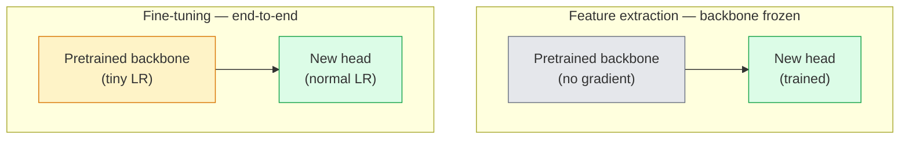

# Transfer Pembelajaran & Penyempurnaan

> Orang lain menghabiskan satu juta jam GPU untuk mengajarkan jaringan seperti apa bentuk tepi, tekstur, dan bagian objek. kamu harus meminjam feature-feature tersebut sebelum melatih feature kamu sendiri.

**Type:** Build
**Language:** Python
**Prerequisites:** Fase 4 Lesson 03 (CNN), Fase 4 Lesson 04 (Klasifikasi Gambar)
**Waktu:** ~75 menit

## Tujuan Pembelajaran

- Membedakan ekstraksi feature dari penyesuaian dan memilih yang tepat berdasarkan ukuran dataset, distance domain, dan anggaran komputasi
- Muat tulang punggung yang telah dilatih sebelumnya, ganti kepala pengklasifikasinya, dan latih hanya kepala tersebut ke garis dasar yang berfungsi di bawah 20 baris
- Mencairkan layer secara progresif dengan learning rate yang diskriminatif sehingga feature umum awal mendapatkan pembaruan yang lebih kecil dibandingkan feature khusus tugas yang terlambat
- Diagnosis tiga kegagalan umum: penyimpangan feature dari LR yang terlalu tinggi pada blok yang tidak dibekukan, statistik BN runtuh pada dataset kecil, dan bencana lupa

## Masalah

Melatih ResNet-50 di ImageNet memerlukan biaya sekitar 2.000 jam GPU. Sangat sedikit tim yang memiliki anggaran sebesar itu untuk setiap tugas yang mereka kirimkan. Apa yang sebenarnya dikirimkan oleh hampir setiap tim adalah tulang punggung yang telah dilatih sebelumnya dengan kepala baru yang dilatih pada beberapa ratus atau beberapa ribu gambar tugas tertentu.

Ini bukanlah jalan pintas. Blok konv pertama dari CNN yang dilatih ImageNet mempelajari tepian dan filter mirip Gabor. Beberapa blok berikutnya mempelajari tekstur dan motif sederhana. Blok tengah mempelajari bagian-bagian objek. Blok terakhir mempelajari kombinasi yang mulai terlihat seperti 1.000 kategori ImageNet. 90% pertama dari hierarki tersebut hampir tidak berubah dalam bidang pencitraan medis, inspeksi industri, data satelit, dan setiap tugas penglihatan lainnya — karena alam memiliki kosakata terbatas tentang tepian dan tekstur. 10% terakhir adalah apa yang sebenarnya kamu latih.

Melakukan transfer dengan benar memiliki tiga bug yang menunggu kamu: menghancurkan feature-feature yang telah dilatih sebelumnya dengan learning rate yang terlalu tinggi, membuat model informasi kelaparan karena membekukan terlalu banyak, dan membiarkan statistik berjalan BatchNorm melayang ke dataset kecil yang tidak pernah dipelajari oleh seluruh jaringan. Lesson ini menuntun mereka masing-masing dengan sengaja.

## Konsep

### Ekstraksi feature vs penyempurnaan

Dua rezim, dipilih berdasarkan seberapa besar kamu memercayai feature yang telah dilatih sebelumnya dan seberapa banyak data yang kamu miliki.



Aturan praktis:

| Ukuran dataset | Distance domain | Resep |
|--------------|-----------------|--------|
| < 1k gambar | dekat dengan ImageNet | Bekukan tulang punggung, latih kepala saja |
| 1k-10k | tutup | Bekukan 2-3 phase pertama, sempurnakan sisanya |
| 10rb-100rb | apapun | Sempurnakan end-to-end dengan LR | yang diskriminatif
| 100rb+ | jauh | Sempurnakan semuanya; pertimbangkan training dari awal jika domain cukup jauh |

"Dekat dengan ImageNet" secara kasar berarti foto RGB alami dengan konten seperti objek. Pemindaian CT medis, citra satelit di atas kepala, dan mikroskop merupakan hal yang sulit dilakukan — feature-fiturnya masih membantu, namun kamu perlu membiarkan lebih banyak layer beradaptasi.

### Mengapa pembekuan berhasil

Feature ImageNet yang dipelajari CNN tidak dikhususkan untuk 1.000 kategori. Mereka mengkhususkan diri pada statistik gambar alami: tepi pada orientasi tertentu, tekstur, pola kontras, bentuk primitif. Statistik tersebut stabil di hampir semua domain visual yang dapat disebutkan namanya oleh manusia. Itulah sebabnya model yang dilatih di ImageNet dan mengevaluasi zero-shot di CIFAR-10 hanya dengan head linier baru (tanpa penyesuaian backbone) mencapai akurasi 80%+. Kepala sedang mempelajari feature mana yang sudah dipelajari untuk dijadikan weight tugas ini.### Learning rate yang diskriminatif

Saat kamu melakukan pencairan, layer awal akan berlatih lebih lambat dibandingkan layer akhir. Layer awal mengkodekan feature umum yang ingin kamu pertahankan; layer akhir menyandikan struktur khusus tugas yang perlu sering kamu pindahkan.

```
Typical recipe:

  stage 0 (stem + first group): lr = base_lr / 100    (mostly fixed)
  stage 1:                       lr = base_lr / 10
  stage 2:                       lr = base_lr / 3
  stage 3 (last backbone group): lr = base_lr
  head:                          lr = base_lr  (or slightly higher)
```

Di PyTorch, ini hanyalah daftar grup parameter yang diteruskan ke optimizer. Satu model, lima learning rate, tanpa code tambahan.

### Masalah BatchNorm

Layer BN menampung buffer `running_mean` dan `running_var` yang dihitung di ImageNet. Jika tugas kamu memiliki distribusi piksel berbeda — pencahayaan berbeda, sensor berbeda, ruang warna berbeda — buffer tersebut salah. Tiga opsi dalam urutan preferensi:

1. **Sempurnakan dengan BN dalam mode kereta.** Biarkan BN memperbarui statistik berjalannya bersama dengan yang lainnya. Pilihan default ketika dataset tugas berukuran sedang (>= 5 ribu contoh).
2. **Bekukan BN dalam mode eval.** Simpan statistik ImageNet dan latih bobotnya saja. Benar jika dataset kamu cukup kecil sehingga rata-rata pergerakan BN akan menimbulkan gangguan.
3. **Ganti BN dengan GroupNorm.** Menghapus seluruh masalah rata-rata bergerak. Digunakan dalam tulang punggung deteksi dan segmentasi di mana ukuran batch per GPU kecil.

Melakukan kesalahan ini secara diam-diam akan mengurangi akurasi sebesar 5-15%.

### Desain kepala

Kepala pengklasifikasi terdiri dari 1-3 layer linier ditambah dropout opsional. Setiap tulang punggung torchvision mengirimkan head default yang kamu ganti:

```
backbone.fc = nn.Linear(backbone.fc.in_features, num_classes)          # ResNet
backbone.classifier[1] = nn.Linear(..., num_classes)                    # EfficientNet, MobileNet
backbone.heads.head = nn.Linear(..., num_classes)                       # torchvision ViT
```

Untuk dataset kecil, satu layer linier biasanya cukup. Menambahkan layer tersembunyi (Linear -> ReLU -> Dropout -> Linear) membantu ketika distribusi tugas lebih jauh dari distribusi training backbone.

### Peluruhan LR berdasarkan layer

Versi LR diskriminatif yang lebih halus yang digunakan dalam fine-tuning modern (BEiT, DINOv2, ViT-B fine-tunes). Daripada mengelompokkan layer ke dalam tahapan, berikan setiap layer LR yang sedikit lebih kecil dari yang di atasnya:

```
lr_layer_k = base_lr * decay^(L - k)
```

Dengan peluruhan = 0,75 dan L = 12 blok Transformer, blok pertama dilatih di `0.75^11 ≈ 0.04x` LR kepala. Lebih penting untuk penyetelan Transformer daripada CNN, di mana LR yang dikelompokkan secara bertahap biasanya sudah cukup.

### Apa yang harus dievaluasi

Proses pembelajaran transfer memerlukan dua angka yang tidak akan kamu lacak pada proses awal:

- **Akurasi khusus terlatih** — akurasi kepala dengan tulang punggung dibekukan. Ini lantaimu.
- **Akurasi yang disempurnakan** — model yang sama setelah training menyeluruh. Ini adalah langit-langit kamu.

Jika penyempurnaan kurang dari yang sudah dilatih sebelumnya, kamu memiliki learning rate atau bug BN. Selalu cetak keduanya.

## Build

### Langkah 1: Muat backbone yang telah dilatih sebelumnya dan periksa

```python
import torch
import torch.nn as nn
from torchvision.models import resnet18, ResNet18_Weights

backbone = resnet18(weights=ResNet18_Weights.IMAGENET1K_V1)
print(backbone)
print()
print("classifier head:", backbone.fc)
print("feature dim:", backbone.fc.in_features)
```

`ResNet18` memiliki empat phase (`layer1..layer4`) ditambah batang dan kepala `fc`. Setiap tulang punggung klasifikasi torchvision memiliki struktur analog.

### Langkah 2: Ekstraksi feature — bekukan semuanya, ganti kepala

```python
def make_feature_extractor(num_classes=10):
    model = resnet18(weights=ResNet18_Weights.IMAGENET1K_V1)
    for p in model.parameters():
        p.requires_grad = False
    model.fc = nn.Linear(model.fc.in_features, num_classes)
    return model

model = make_feature_extractor(num_classes=10)
trainable = sum(p.numel() for p in model.parameters() if p.requires_grad)
frozen = sum(p.numel() for p in model.parameters() if not p.requires_grad)
print(f"trainable: {trainable:>10,}")
print(f"frozen:    {frozen:>10,}")
```

Hanya `model.fc` yang dapat dilatih. Tulang punggungnya adalah ekstraktor feature yang dibekukan.

### Langkah 3: Penyesuaian yang diskriminatif

Sebuah utilitas yang membangun grup parameter dengan learning rate spesifik phase.

```python
def discriminative_param_groups(model, base_lr=1e-3, decay=0.3):
    stages = [
        ["conv1", "bn1"],
        ["layer1"],
        ["layer2"],
        ["layer3"],
        ["layer4"],
        ["fc"],
    ]
    groups = []
    for i, names in enumerate(stages):
        lr = base_lr * (decay ** (len(stages) - 1 - i))
        params = [p for n, p in model.named_parameters()
                  if any(n.startswith(k) for k in names)]
        if params:
            groups.append({"params": params, "lr": lr, "name": "_".join(names)})
    return groups

model = resnet18(weights=ResNet18_Weights.IMAGENET1K_V1)
model.fc = nn.Linear(model.fc.in_features, 10)
for p in model.parameters():
    p.requires_grad = True

groups = discriminative_param_groups(model)
for g in groups:
    print(f"{g['name']:>10s}  lr={g['lr']:.2e}  params={sum(p.numel() for p in g['params']):>8,}")
```

`decay=0.3` berarti setiap phase berlatih dengan kecepatan 30% dari kecepatan phase berikutnya. `fc` mendapat `base_lr`, `layer4` mendapat `0.3 * base_lr`, `conv1` mendapat `0.3^5 * base_lr ≈ 0.00243 * base_lr`. Kedengarannya ekstrim; secara empiris itu berhasil.

### Langkah 4: Penanganan BatchNorm

Pembantu untuk membekukan statistik menjalankan BN tanpa membekukan bobotnya.

```python
def freeze_bn_stats(model):
    for m in model.modules():
        if isinstance(m, (nn.BatchNorm1d, nn.BatchNorm2d, nn.BatchNorm3d)):
            m.eval()
            for p in m.parameters():
                p.requires_grad = False
    return model
```Sebut saja setelah kamu menyetel `model.train()` di awal setiap zaman. `model.train()` membalik semuanya ke mode training; ini membalikkannya hanya untuk layer BN.

### Langkah 5: Perulangan penyempurnaan ujung ke ujung yang minimal

```python
from torch.optim import SGD
from torch.utils.data import DataLoader
from torch.optim.lr_scheduler import CosineAnnealingLR
import torch.nn.functional as F

def fine_tune(model, train_loader, val_loader, device, epochs=5, base_lr=1e-3, freeze_bn=False):
    model = model.to(device)
    groups = discriminative_param_groups(model, base_lr=base_lr)
    optimizer = SGD(groups, momentum=0.9, weight_decay=1e-4, nesterov=True)
    scheduler = CosineAnnealingLR(optimizer, T_max=epochs)

    for epoch in range(epochs):
        model.train()
        if freeze_bn:
            freeze_bn_stats(model)
        tr_loss, tr_correct, tr_total = 0.0, 0, 0
        for x, y in train_loader:
            x, y = x.to(device), y.to(device)
            logits = model(x)
            loss = F.cross_entropy(logits, y, label_smoothing=0.1)
            optimizer.zero_grad()
            loss.backward()
            optimizer.step()
            tr_loss += loss.item() * x.size(0)
            tr_total += x.size(0)
            tr_correct += (logits.argmax(-1) == y).sum().item()
        scheduler.step()

        model.eval()
        va_total, va_correct = 0, 0
        with torch.no_grad():
            for x, y in val_loader:
                x, y = x.to(device), y.to(device)
                pred = model(x).argmax(-1)
                va_total += x.size(0)
                va_correct += (pred == y).sum().item()
        print(f"epoch {epoch}  train {tr_loss/tr_total:.3f}/{tr_correct/tr_total:.3f}  "
              f"val {va_correct/va_total:.3f}")
    return model
```

Lima epoch dengan resep di atas pada CIFAR-10 membutuhkan `ResNet18-IMAGENET1K_V1` dari ~70% akurasi probe linier zero-shot hingga ~93% akurasi yang disempurnakan. Kepalanya saja akan stabil sekitar 86% tanpa pernah menyentuh tulang punggung.

### Langkah 6: Pencairan progresif

Jadwal yang mencairkan satu phase per zaman dari akhir hingga awal. Mengurangi penyimpangan feature dengan mengorbankan beberapa periode tambahan.

```python
def progressive_unfreeze_schedule(model):
    stages = ["layer4", "layer3", "layer2", "layer1"]
    yielded = set()

    def start():
        for p in model.parameters():
            p.requires_grad = False
        for p in model.fc.parameters():
            p.requires_grad = True

    def unfreeze(epoch):
        if epoch < len(stages):
            name = stages[epoch]
            yielded.add(name)
            for n, p in model.named_parameters():
                if n.startswith(name):
                    p.requires_grad = True
            return name
        return None

    return start, unfreeze
```

Hubungi `start()` satu kali sebelum periode pertama. Hubungi `unfreeze(epoch)` di awal setiap epoch. Build kembali optimizer setiap kali kumpulan parameter yang dapat dilatih berubah, jika tidak, parameter yang dibekukan masih menyimpan momen cache yang membingungkannya.

## Pakai

Untuk sebagian besar tugas nyata, `torchvision.models` + tiga baris sudah cukup. Mesin yang lebih berat di atas penting ketika kamu mengalami masalah yang tidak dapat diperbaiki oleh default perpustakaan.

```python
from torchvision.models import resnet50, ResNet50_Weights

model = resnet50(weights=ResNet50_Weights.IMAGENET1K_V2)
model.fc = nn.Linear(model.fc.in_features, num_classes)
optimizer = torch.optim.AdamW(model.parameters(), lr=1e-4, weight_decay=1e-4)
```

Dua default tingkat produksi lainnya:

- `timm` mengirimkan ~800 tulang punggung penglihatan yang telah dilatih sebelumnya dengan API yang konsisten (`timm.create_model("resnet50", pretrained=True, num_classes=10)`). Untuk penyesuaian apa pun di luar kebun binatang torchvision, ini adalah standarnya.
- Untuk Transformer, `transformers.AutoModelForImageClassification.from_pretrained(name, num_labels=N)` memberi kamu ViT / BEiT / DeiT dengan semantik pemuatan yang sama dengan model teks.

## Kirim

Lesson ini menghasilkan:

- `outputs/prompt-fine-tune-planner.md` — prompt yang memilih ekstraksi feature vs penyempurnaan progresif vs menyeluruh berdasarkan ukuran dataset, distance domain, dan anggaran komputasi.
- `outputs/skill-freeze-inspector.md` — keterampilan yang, dengan model PyTorch, melaporkan parameter mana yang dapat dilatih, layer BatchNorm mana yang berada dalam mode eval, dan apakah optimizer benar-benar diberi parameter yang dapat dilatih.

## Latihan

1. **(Mudah)** Latih `ResNet18` sebagai probe linier (tulang punggung dibekukan) dan sebagai penyempurnaan penuh pada dataset CIFAR sintetik yang sama. Laporkan kedua keakuratan secara berdampingan. Jelaskan celah mana yang memberi tahu kamu bahwa feature-feature tersebut dapat ditransfer dengan baik dan mana yang tidak.
2. **(Medium)** Sengaja menimbulkan bug: setel `base_lr = 1e-1` di panggung tulang punggung, bukan di kepala. Tunjukkan loss training meledak, lalu pulihkan dengan menerapkan pembantu `discriminative_param_groups`. Catat LR di mana setiap phase mulai menyimpang.
3. **(Hard)** Ambil dataset pencitraan medis (misalnya CheXpert-small, PatchCamelyon, atau HAM10000) dan bandingkan tiga rezim: (a) tulang punggung beku + kepala linier yang telah dilatih sebelumnya oleh ImageNet; (b) penyempurnaan menyeluruh yang telah dilatih sebelumnya oleh ImageNet; (c) training awal. Laporkan keakuratan dan hitung biaya untuk masing-masingnya. Pada ukuran dataset berapa training awal menjadi kompetitif?

## Istilah Kunci| Istilah | Apa kata orang | Apa sebenarnya arti |
|------|----------------|----------------------|
| Ekstraksi feature | "Bekukan dan latih kepala" | Parameter tulang punggung dibekukan, hanya kepala pengklasifikasi baru yang menerima gradient |
| Penyempurnaan | "Latih kembali ujung ke ujung" | Semua parameter dapat dilatih, biasanya dengan LR yang jauh lebih kecil daripada training awal |
| LR Diskriminatif | "LR lebih kecil untuk layer awal" | Kelompok parameter optimizer dengan LR phase awal adalah sebagian kecil dari LR phase akhir |
| Peluruhan LR berdasarkan layer | "Gradient LR Halus" | LR per layer dikalikan dengan peluruhan^(L - k); umum dalam penyempurnaan Transformer |
| Lupa bencana | "Model kehilangan ImageNet" | LR yang terlalu tinggi akan menimpa feature yang telah dilatih sebelumnya sebelum sinyal tugas baru dipelajari |
| Statistik BN melayang | "Berlari berarti salah" | BatchNorm running_mean/var dihitung pada distribusi yang berbeda dari tugas saat ini, sehingga secara diam-diam merusak akurasi |
| Pemeriksaan linier | "Tulang punggung beku + kepala linier" | Evaluasi feature yang telah dilatih sebelumnya — keakuratan pengklasifikasi linier terbaik di atas representasi yang dibekukan |
| Keruntuhan dahsyat | "Semuanya memprediksi satu kelas" | Terjadi saat melakukan fine-tuning dengan LR yang cukup tinggi untuk menghancurkan feature sebelum gradient dari kepala dapat stabil |

## Bacaan Lanjutan

- [Seberapa mudahkah feature-feature di neural network dalam dapat ditransfer? (Yosinski et al., 2014)](https://arxiv.org/abs/1411.1792) — makalah yang mengukur kemampuan transfer feature lintas layer
- [Penyempurnaan Model Bahasa Universal (ULMFiT, Howard & Ruder, 2018)](https://arxiv.org/abs/1801.06146) — LR diskriminatif asli/resep pencairan progresif; ide-ide ditransfer langsung ke visi
- [dokumentasi timm](https://huggingface.co/docs/timm) — referensi untuk tulang punggung vision modern dan penyempurnaan default yang tepat saat mereka dilatih
- [Kerangka Sederhana untuk Evaluasi Probe Linier (Kornblith et al., 2019)](https://arxiv.org/abs/1805.08974) — mengapa akurasi probe linier penting dan cara melaporkannya dengan benar
