# Deteksi Objek — YOLO dari Awal

> Deteksi adalah klasifikasi ditambah regresi, dijalankan di setiap posisi dalam peta feature, kemudian dibersihkan dengan penekanan non-maksimum.

**Type:** Build
**Language:** Python
**Prerequisites:** Phase 4 Lesson 03 (CNN), Phase 4 Lesson 04 (Klasifikasi Gambar), Phase 4 Lesson 05 (Pembelajaran Transfer)
**Waktu:** ~75 menit

## Tujuan Pembelajaran

- Jelaskan desain grid-and-anchor yang mengubah deteksi menjadi masalah prediksi padat dan nyatakan arti setiap angka dalam tensor output
- Hitung Intersection-over-Union antar kotak dan terapkan penekanan non-maksimum dari awal
- Build kepala bergaya YOLO minimal di atas tulang punggung yang telah dilatih sebelumnya, termasuk klasifikasi, objektivitas, dan loss regresi kotak
- Baca baris metrik deteksi (precision@0.5, recall, mAP@0.5, mAP@0.5:0.95) dan pilih kenop mana yang akan diputar berikutnya

## Masalah

Klasifikasi mengatakan "gambar ini adalah seekor anjing." Deteksi mengatakan "ada seekor anjing di piksel (112, 40, 280, 210), ada kucing di (400, 180, 560, 310), dan tidak ada yang lain di dalam bingkai." Perubahan struktural tersebut — memprediksi jumlah kotak berlabel yang bervariasi, bukan satu label per gambar — merupakan hal yang bergantung pada setiap sistem otonom, setiap produk pengawasan, setiap pengurai tata letak dokumen, dan setiap lini visi pabrik.

Deteksi juga merupakan tempat di mana setiap trade-off rekayasa dalam visi muncul sekaligus. kamu ingin kotak yang akurat (kepala regresi), kamu ingin kelas yang tepat untuk setiap kotak (kepala klasifikasi), kamu ingin model mengetahui kapan tidak ada yang terdeteksi (skor objektivitas), dan kamu ingin tepat satu prediksi per objek nyata (penekanan non-maksimum). Jika salah satu dari ini terlewatkan, maka pipeline akan melewatkan objek, melaporkan kotak halusinasi, atau memprediksi objek yang sama sebanyak lima belas kali dalam posisi yang sedikit berbeda.

YOLO (You Only Look Once, Redmon dkk. 2016) adalah desain yang membuat semua ini berjalan secara real time dengan melakukannya dengan satu forward pass dari jaringan konv, dan keputusan struktural yang sama masih menjadi tulang punggung detektor modern (YOLOv8, YOLOv9, YOLO-NAS, RT-DETR). Learn intinya dan setiap varian menjadi penataan ulang dari bagian yang sama.

## Konsep

### Deteksi sebagai prediksi padat

Pengklasifikasi menghasilkan angka C per gambar. Detektor bergaya YOLO menghasilkan nomor `(S x S x (5 + C))` per gambar, dengan S adalah ukuran kisi spasial.

```mermaid
flowchart LR
    IMG["Input 416x416 RGB"] --> BB["Backbone<br/>(ResNet, DarkNet, ...)"]
    BB --> FM["Feature map<br/>(C_feat, 13, 13)"]
    FM --> HEAD["Detection head<br/>(1x1 convs)"]
    HEAD --> OUT["Output tensor<br/>(13, 13, B * (5 + C))"]
    OUT --> DEC["Decode<br/>(grid + sigmoid + exp)"]
    DEC --> NMS["Non-max suppression"]
    NMS --> RESULT["Final boxes"]

    style IMG fill:#dbeafe,stroke:#2563eb
    style HEAD fill:#fef3c7,stroke:#d97706
    style NMS fill:#fecaca,stroke:#dc2626
    style RESULT fill:#dcfce7,stroke:#16a34a
```



Masing-masing sel kisi `S * S` memprediksi kotak `B`. Untuk setiap kotak:

- 4 angka menggambarkan geometri: `tx, ty, tw, th`.
- Angka 1 merupakan skor objektivitas: “apakah ada objek yang terpusat pada sel ini?”
- Angka C adalah probabilitas kelas.

Total per sel: `B * (5 + C)`. Untuk VOC dengan `S=13, B=2, C=20`, yaitu 50 nomor per sel.

### Mengapa grid dan jangkar

Regresi biasa akan memprediksi `(x, y, w, h)` untuk setiap objek sebagai koordinat absolut. Hal ini sulit dilakukan pada jaringan konv karena menerjemahkan gambar tidak seharusnya menerjemahkan semua prediksi dengan jumlah yang sama - setiap objek ditambatkan secara spasial. Grid menjawab hal ini dengan menugaskan setiap kotak kebenaran dasar ke sel grid yang menjadi pusatnya; hanya sel itu yang bertanggung jawab atas objek itu.Jangkar mengatasi masalah kedua. Konv. 3x3 tidak dapat dengan mudah mengeluarkan kotak selebar 500 piksel dari sel feature bidang reseptif 16 piksel. Sebagai gantinya, kami telah menentukan terlebih dahulu `B` bentuk kotak (jangkar) sebelumnya per sel dan memperkirakan delta kecil dari setiap jangkar. Model tersebut belajar untuk memilih jangkar yang tepat dan mendorongnya daripada mundur dari ketiadaan.

```
Anchor box priors (example for 416x416 input):

  small:   (30,  60)
  medium:  (75,  170)
  large:   (200, 380)

At each grid cell, every anchor emits (tx, ty, tw, th, obj, c_1, ..., c_C).
```

Detektor modern sering kali menggunakan FPN dengan kumpulan jangkar berbeda per resolusi — jangkar kecil pada peta dangkal beresolusi tinggi, jangkar besar pada peta dalam beresolusi rendah. Ide yang sama, lebih banyak skala.

### Menguraikan code prediksi

`tx, ty, tw, th` mentah bukan koordinat kotak; mereka adalah target regresi yang harus diubah sebelum diplot:

```
centre x  = (sigmoid(tx) + cell_x) * stride
centre y  = (sigmoid(ty) + cell_y) * stride
width     = anchor_w * exp(tw)
height    = anchor_h * exp(th)
```

`sigmoid` menjaga offset tengah di dalam sel. `exp` memungkinkan skala lebar bebas dari jangkar tanpa tanda terbalik. `stride` menskalakan koordinat grid kembali ke piksel. Langkah dekode ini sama di setiap versi YOLO sejak v2.

### IOU

Metrik kesamaan universal deteksi antara dua kotak:

```
IoU(A, B) = area(A intersect B) / area(A union B)
```

IoU = 1 berarti identik; IoU = 0 berarti tidak ada tumpang tindih. IoU antara prediksi dan kotak kebenaran dasar inilah yang menentukan apakah suatu prediksi dianggap benar-benar positif (biasanya IoU >= 0,5). IoU antara dua prediksi inilah yang digunakan NMS untuk menghapus duplikat.

### Penekanan tidak maksimal

Jaringan konv yang dilatih pada jangkar yang berdekatan sering kali akan memprediksi kotak yang tumpang tindih untuk objek yang sama. NMS menyimpan prediksi dengan tingkat keyakinan tertinggi dan menghapus prediksi lainnya dengan IoU di atas ambang batas.

```
NMS(boxes, scores, iou_threshold):
    sort boxes by score descending
    keep = []
    while boxes not empty:
        pick the top-scoring box, add to keep
        remove every box with IoU > iou_threshold to the picked box
    return keep
```

Ambang batas tipikal: 0,45 untuk deteksi objek. Detektor terbaru menggantikan NMS standar dengan `soft-NMS`, `DIoU-NMS`, atau mempelajari penindasan secara langsung (RT-DETR) tetapi tujuan strukturalnya sama.

### Loss

Loss YOLO adalah tiga loss ditambah dengan weight:

```
L = lambda_coord * L_box(pred, target, where obj=1)
  + lambda_obj   * L_obj(pred, 1,     where obj=1)
  + lambda_noobj * L_obj(pred, 0,     where obj=0)
  + lambda_cls   * L_cls(pred, target, where obj=1)
```

Hanya sel yang berisi objek yang berkontribusi terhadap regresi kotak dan loss klasifikasi. Sel tanpa objek hanya berkontribusi pada hilangnya objek (mengajarkan model untuk tetap diam). `lambda_noobj` biasanya kecil (~0,5) karena sebagian besar sel kosong dan sebaliknya akan mendominasi total loss.

Varian modern menukar loss kotak MSE dengan CIoU / DIoU (yang mengoptimalkan IoU secara langsung), menggunakan loss fokus untuk ketidakseimbangan kelas, dan menyeimbangkan objektivitas dengan kehilangan fokus kualitas. Struktur tiga komponen tidak berubah.

### Metrik deteksi

Akurasi tidak ditransfer ke deteksi. Empat angka yang berfungsi:

- **Precision@IoU=0.5** — dari prediksi yang dihitung positif, berapa banyak yang benar.
- **Recall@IoU=0.5** — dari objek sebenarnya, berapa banyak yang kami temukan.
- **AP@0.5** — area kurva presisi-recall pada ambang batas IoU 0,5; satu nomor per kelas.
- **mAP@0.5:0.95** — rata-rata AP melebihi ambang batas IoU 0.5, 0.55, ..., 0.95. Metrik COCO; paling ketat dan paling informatif.

Laporkan keempatnya. Detektor yang kuat pada mAP@0.5 namun lemah pada mAP@0.5:0.95 melokalisasi secara kasar namun tidak rapat; perbaiki dengan loss regresi kotak yang lebih baik. Detektor dengan presisi tinggi dan recall rendah terlalu konservatif; menurunkan ambang kepercayaan atau menambah weight objektivitas.

## Build

### Langkah 1: IOU

Pekerja keras dari seluruh lesson. Bekerja pada dua susunan kotak dalam format `(x1, y1, x2, y2)`.

```python
import numpy as np

def box_iou(boxes_a, boxes_b):
    ax1, ay1, ax2, ay2 = boxes_a[:, 0], boxes_a[:, 1], boxes_a[:, 2], boxes_a[:, 3]
    bx1, by1, bx2, by2 = boxes_b[:, 0], boxes_b[:, 1], boxes_b[:, 2], boxes_b[:, 3]

    inter_x1 = np.maximum(ax1[:, None], bx1[None, :])
    inter_y1 = np.maximum(ay1[:, None], by1[None, :])
    inter_x2 = np.minimum(ax2[:, None], bx2[None, :])
    inter_y2 = np.minimum(ay2[:, None], by2[None, :])

    inter_w = np.clip(inter_x2 - inter_x1, 0, None)
    inter_h = np.clip(inter_y2 - inter_y1, 0, None)
    inter = inter_w * inter_h

    area_a = (ax2 - ax1) * (ay2 - ay1)
    area_b = (bx2 - bx1) * (by2 - by1)
    union = area_a[:, None] + area_b[None, :] - inter
    return inter / np.clip(union, 1e-8, None)
```Mengembalikan matrix `(N_a, N_b)` dari IoU berpasangan. Gunakan ini pada satu kotak kebenaran dasar dengan membuat salah satu bentuk array `(1, 4)`.

### Langkah 2: Penekanan non-maks

```python
def nms(boxes, scores, iou_threshold=0.45):
    order = np.argsort(-scores)
    keep = []
    while len(order) > 0:
        i = order[0]
        keep.append(i)
        if len(order) == 1:
            break
        rest = order[1:]
        ious = box_iou(boxes[[i]], boxes[rest])[0]
        order = rest[ious <= iou_threshold]
    return np.array(keep, dtype=np.int64)
```

deterministik, `O(N log N)` dari pengurutan, dan cocok dengan perilaku `torchvision.ops.nms` pada input yang identik.

### Langkah 3: Pengkodean dan penguraian kotak

Konversi antara koordinat piksel dan target `(tx, ty, tw, th)` yang sebenarnya mengalami kemunduran jaringan.

```python
def encode(box_xyxy, cell_x, cell_y, stride, anchor_wh):
    x1, y1, x2, y2 = box_xyxy
    cx = 0.5 * (x1 + x2)
    cy = 0.5 * (y1 + y2)
    w = x2 - x1
    h = y2 - y1
    tx = cx / stride - cell_x
    ty = cy / stride - cell_y
    tw = np.log(w / anchor_wh[0] + 1e-8)
    th = np.log(h / anchor_wh[1] + 1e-8)
    return np.array([tx, ty, tw, th])


def decode(tx_ty_tw_th, cell_x, cell_y, stride, anchor_wh):
    tx, ty, tw, th = tx_ty_tw_th
    cx = (sigmoid(tx) + cell_x) * stride
    cy = (sigmoid(ty) + cell_y) * stride
    w = anchor_wh[0] * np.exp(tw)
    h = anchor_wh[1] * np.exp(th)
    return np.array([cx - w / 2, cy - h / 2, cx + w / 2, cy + h / 2])


def sigmoid(x):
    return 1.0 / (1.0 + np.exp(-x))
```

Pengujian: menyandikan sebuah kotak lalu mendekodekan — kamu harus mendapatkan kembali sesuatu yang sangat mirip dengan aslinya (hingga inverse sigmoid tidak dapat dibalik sempurna ketika `tx` tidak berada dalam rentang pasca-sigmoid).

### Langkah 4: Kepala YOLO minimal

Satu konv 1x1 pada peta feature, dibentuk ulang menjadi `(B, S, S, num_anchors, 5 + C)`.

```python
import torch
import torch.nn as nn

class YOLOHead(nn.Module):
    def __init__(self, in_c, num_anchors, num_classes):
        super().__init__()
        self.num_anchors = num_anchors
        self.num_classes = num_classes
        self.conv = nn.Conv2d(in_c, num_anchors * (5 + num_classes), kernel_size=1)

    def forward(self, x):
        n, _, h, w = x.shape
        y = self.conv(x)
        y = y.view(n, self.num_anchors, 5 + self.num_classes, h, w)
        y = y.permute(0, 3, 4, 1, 2).contiguous()
        return y
```

Bentuk output: `(N, H, W, num_anchors, 5 + C)`. Dimension terakhir menampung `[tx, ty, tw, th, obj, cls_0, ..., cls_{C-1}]`.

### Langkah 5: Penetapan kebenaran dasar

Untuk setiap kotak kebenaran dasar, putuskan `(cell, anchor)` mana yang bertanggung jawab.

```python
def assign_targets(boxes_xyxy, classes, anchors, stride, grid_size, num_classes):
    num_anchors = len(anchors)
    target = np.zeros((grid_size, grid_size, num_anchors, 5 + num_classes), dtype=np.float32)
    has_obj = np.zeros((grid_size, grid_size, num_anchors), dtype=bool)

    for box, cls in zip(boxes_xyxy, classes):
        x1, y1, x2, y2 = box
        cx, cy = 0.5 * (x1 + x2), 0.5 * (y1 + y2)
        gx, gy = int(cx / stride), int(cy / stride)
        bw, bh = x2 - x1, y2 - y1

        ious = np.array([
            (min(bw, aw) * min(bh, ah)) / (bw * bh + aw * ah - min(bw, aw) * min(bh, ah))
            for aw, ah in anchors
        ])
        best = int(np.argmax(ious))
        aw, ah = anchors[best]

        target[gy, gx, best, 0] = cx / stride - gx
        target[gy, gx, best, 1] = cy / stride - gy
        target[gy, gx, best, 2] = np.log(bw / aw + 1e-8)
        target[gy, gx, best, 3] = np.log(bh / ah + 1e-8)
        target[gy, gx, best, 4] = 1.0
        target[gy, gx, best, 5 + cls] = 1.0
        has_obj[gy, gx, best] = True
    return target, has_obj
```

Pemilihan jangkar adalah "bentuk IoU terbaik dengan kebenaran dasar" — proxy murah yang cocok dengan penugasan YOLOv2/v3. v5 dan yang lebih baru menggunakan strategi yang lebih canggih (pencocokan selaras tugas, k dinamis) yang menyempurnakan gagasan yang sama.

### Langkah 6: Tiga loss

```python
def yolo_loss(pred, target, has_obj, lambda_coord=5.0, lambda_obj=1.0, lambda_noobj=0.5, lambda_cls=1.0):
    has_obj_t = torch.from_numpy(has_obj).bool()
    target_t = torch.from_numpy(target).float()

    # box-regression loss: only on cells with objects
    box_pred = pred[..., :4][has_obj_t]
    box_true = target_t[..., :4][has_obj_t]
    loss_box = torch.nn.functional.mse_loss(box_pred, box_true, reduction="sum")

    # objectness loss
    obj_pred = pred[..., 4]
    obj_true = target_t[..., 4]
    loss_obj_pos = torch.nn.functional.binary_cross_entropy_with_logits(
        obj_pred[has_obj_t], obj_true[has_obj_t], reduction="sum")
    loss_obj_neg = torch.nn.functional.binary_cross_entropy_with_logits(
        obj_pred[~has_obj_t], obj_true[~has_obj_t], reduction="sum")

    # classification loss on cells with objects
    cls_pred = pred[..., 5:][has_obj_t]
    cls_true = target_t[..., 5:][has_obj_t]
    loss_cls = torch.nn.functional.binary_cross_entropy_with_logits(
        cls_pred, cls_true, reduction="sum")

    total = (lambda_coord * loss_box
             + lambda_obj * loss_obj_pos
             + lambda_noobj * loss_obj_neg
             + lambda_cls * loss_cls)
    return total, {"box": loss_box.item(), "obj_pos": loss_obj_pos.item(),
                   "obj_neg": loss_obj_neg.item(), "cls": loss_cls.item()}
```

Lima hyper-parameter yang di-hardcode atau di-sweep oleh setiap tutorial YOLO. Rasionya penting: `lambda_coord=5, lambda_noobj=0.5` mencerminkan kertas YOLOv1 asli dan masih berfungsi sebagai standar yang wajar.

### Langkah 7: Pipeline inference

Dekode output head mentah, terapkan sigmoid/exp, ambang batas pada objektivitas, dan NMS.

```python
def postprocess(pred_tensor, anchors, stride, img_size, conf_threshold=0.25, iou_threshold=0.45):
    pred = pred_tensor.detach().cpu().numpy()
    grid_h, grid_w = pred.shape[1], pred.shape[2]
    num_anchors = len(anchors)

    boxes, scores, classes = [], [], []
    for gy in range(grid_h):
        for gx in range(grid_w):
            for a in range(num_anchors):
                tx, ty, tw, th, obj, *cls = pred[0, gy, gx, a]
                score = sigmoid(obj) * sigmoid(np.array(cls)).max()
                if score < conf_threshold:
                    continue
                cls_idx = int(np.argmax(cls))
                cx = (sigmoid(tx) + gx) * stride
                cy = (sigmoid(ty) + gy) * stride
                w = anchors[a][0] * np.exp(tw)
                h = anchors[a][1] * np.exp(th)
                boxes.append([cx - w / 2, cy - h / 2, cx + w / 2, cy + h / 2])
                scores.append(float(score))
                classes.append(cls_idx)

    if not boxes:
        return np.zeros((0, 4)), np.zeros((0,)), np.zeros((0,), dtype=int)
    boxes = np.array(boxes)
    scores = np.array(scores)
    classes = np.array(classes)
    keep = nms(boxes, scores, iou_threshold)
    return boxes[keep], scores[keep], classes[keep]
```

Itu adalah jalur eval lengkap: head -> decode -> ambang batas -> NMS.

## Pakai

`torchvision.models.detection` mengirimkan detektor produksi dengan struktur konseptual yang sama. Memuat model yang telah dilatih sebelumnya membutuhkan tiga baris.

```python
import torch
from torchvision.models.detection import fasterrcnn_resnet50_fpn_v2

model = fasterrcnn_resnet50_fpn_v2(weights="DEFAULT")
model.eval()
with torch.no_grad():
    predictions = model([torch.randn(3, 400, 600)])
print(predictions[0].keys())
print(f"boxes:  {predictions[0]['boxes'].shape}")
print(f"scores: {predictions[0]['scores'].shape}")
print(f"labels: {predictions[0]['labels'].shape}")
```

Untuk pipeline inference real-time, `ultralytics` (YOLOv8/v9) adalah standarnya: `from ultralytics import YOLO; model = YOLO('yolov8n.pt'); model(img)`. Model ini menangani decoding dan NMS secara internal dan mengembalikan triple `boxes / scores / labels` yang kamu buat di atas.

## Kirim

Lesson ini menghasilkan:

- `outputs/prompt-detection-metric-reader.md` — prompt yang mengubah baris `precision, recall, AP, mAP@0.5:0.95` menjadi diagnosis satu baris dan eksperimen berikutnya yang paling berguna.
- `outputs/skill-anchor-designer.md` — keterampilan yang, berdasarkan dataset kotak kebenaran dasar, menjalankan k-means di `(w, h)` dan mengembalikan set jangkar per level FPN ditambah statistik cakupan yang kamu perlukan untuk memilih jumlah jangkar yang tepat.

## Latihan

1. **(Mudah)** Terapkan `box_iou` dan jalankan terhadap `torchvision.ops.box_iou` pada 1.000 pasangan kotak acak. Verifikasikan perbedaan absolut maksimal di bawah `1e-6`.
2. **(Medium)** Port `yolo_loss` ke versi yang menggunakan `CIoU` box loss, bukan MSE. Tunjukkan pada dataset sintetis 100 gambar bahwa CIoU menyatu ke mAP@0.5:0.95 akhir yang lebih baik daripada MSE dalam jumlah epoch yang sama.
3. **(Sulit)** Menerapkan inference multiskala: masukkan gambar yang sama pada tiga resolusi melalui model, gabungkan prediksi kotak, dan jalankan satu NMS di akhir. Ukur peningkatan peta vs inference skala tunggal pada kumpulan yang ditahan.

## Istilah Kunci| Istilah | Apa kata orang | Apa sebenarnya arti |
|------|----------------|----------------------|
| Jangkar | "Kotak sebelumnya" | Bentuk kotak yang telah ditentukan sebelumnya di setiap sel kisi tempat jaringan memprediksi delta, bukan koordinat absolut |
| IOU | "Tumpang tindih" | Persimpangan-penyatuan dua kotak; ukuran kesamaan universal dalam deteksi |
| NMS | "Hapus duplikat" | Algoritme serakah yang mempertahankan prediksi skor tertinggi dan menghapus prediksi yang tumpang tindih di atas ambang batas |
| Objektivitas | "Apakah ada sesuatu di sini" | Per jangkar, scalar per sel yang memprediksi apakah suatu objek berada di tengah sel |
| Langkah jaringan | "Faktor sample bawah" | Piksel per sel kisi; input 416 piksel dengan kepala 13 kisi memiliki langkah 32 |
| peta | "Rata-rata presisi rata-rata" | Rata-rata area di bawah kurva perolehan presisi, dirata-ratakan berdasarkan kelas dan (untuk COCO) ambang batas IoU |
| AP@0.5 | "PASCAL VOC AP" | Presisi rata-rata dengan ambang batas IoU 0,5; versi lunak dari metrik |
| peta@0.5:0.95 | "COCO AP" | Rata-rata di atas ambang batas IoU 0,5..0.95 langkah 0,05; versi ketat dan standar komunitas saat ini |

## Bacaan Lanjutan

- [YOLOv1: You Only Look Once (Redmon et al., 2016)](https://arxiv.org/abs/1506.02640) — makalah pendiri; setiap YOLO sejak itu merupakan penyempurnaan dari struktur ini
- [YOLOv3 (Redmon & Farhadi, 2018)](https://arxiv.org/abs/1804.02767) — makalah yang memperkenalkan kepala bergaya FPN multiskala; masih merupakan diagram yang paling jelas
- [Dokumen Ultralytics YOLOv8](https://docs.ultralytics.com) — referensi produksi saat ini; mencakup format dataset, augmentasi, resep training
- [Panduan Bergambar untuk Deteksi Objek (Jonathan Hui)](https://jonathan-hui.medium.com/object-detection-series-24d03a12f904) — tur berbahasa Inggris terbaik di kebun binatang detektor lengkap; sangat berharga untuk memahami bagaimana DETR, RetinaNet, FCOS, dan YOLO berhubungan
