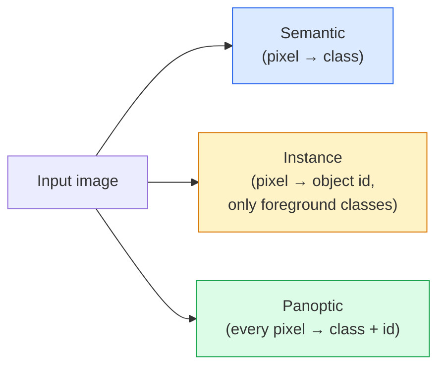
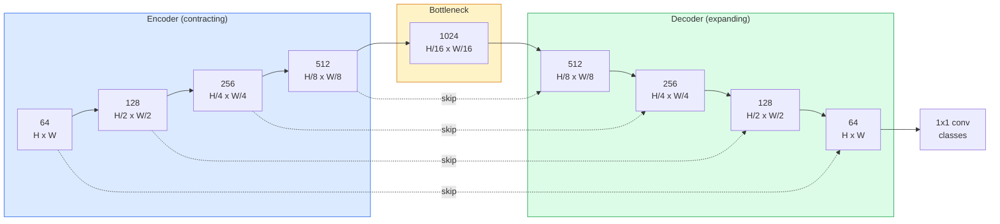

# Segmentasi Semantik — U-Net

> Segmentasi adalah klasifikasi pada setiap piksel. U-Net membuatnya bekerja dengan memasangkan encoder downsampling dengan decoder upsampling dan koneksi lewati kabel di antara keduanya.

**Type:** Build
**Language:** Python
**Prerequisites:** Fase 4 Lesson 03 (CNN), Fase 4 Lesson 04 (Klasifikasi Gambar)
**Waktu:** ~75 menit

## Tujuan Pembelajaran

- Membedakan segmentasi semantik, contoh, dan panoptik dan memilih tugas yang tepat untuk masalah tertentu
- Build U-Net dari awal di PyTorch dengan blok encoder, bottleneck, decoder dengan konvolusi yang dialihkan, dan lewati koneksi
- Menerapkan entropi silang berdasarkan piksel, loss Dadu, dan loss gabungan yang merupakan default saat ini untuk segmentasi medis dan industri
- Baca metrik IoU dan Dice per kelas dan diagnosis apakah skor buruk berasal dari penarikan objek kecil, akurasi batas, atau ketidakseimbangan kelas

## Masalah

Klasifikasi menghasilkan satu label per gambar. Deteksi menghasilkan beberapa kotak per gambar. Segmentasi menghasilkan satu label per piksel. Untuk input berukuran `H x W`, keluarannya berupa tensor berbentuk `H x W` (semantik) atau `H x W x N_instances` (contoh). Itu berarti jutaan prediksi per gambar, bukan satu.

Struktur segmentasi menjadi alasan mengapa hal ini mendukung hampir setiap produk visi prediksi padat: pencitraan medis (masker tumor), mengemudi otonom (jalan, jalur, rintangan), satelit (jejak bangunan, batas tanaman), penguraian dokumen (zona tata letak), robotika (wilayah yang dapat dipahami). Tak satu pun dari tugas-tugas tersebut dapat diselesaikan dengan meletakkan sebuah kotak di sekitar objek; mereka membutuhkan siluet yang tepat.

Masalah arsitekturnya sederhana untuk dinyatakan dan tidak mudah dipecahkan: kamu memerlukan jaringan untuk melihat konteks global suatu gambar (pemandangan seperti apa ini) dan detail piksel lokal (piksel mana yang merupakan jalan vs trotoar) secara bersamaan. CNN standar memampatkan secara spasial untuk mendapatkan konteks, sehingga menghilangkan detailnya. U-Net adalah desain yang mendapatkan keduanya.

## Konsep

### Semantik vs instance vs panoptik



- **Semantik** mengatakan "piksel ini adalah jalan, piksel itu adalah mobil". Dua mobil yang bersebelahan runtuh menjadi satu gumpalan.
- **Contoh** mengatakan "piksel ini adalah mobil #3, piksel itu adalah mobil #5." Mengabaikan hal-hal di latar belakang ("barang" = langit, jalan, rumput).
- **Panoptic** menyatukan keduanya: setiap piksel mendapat label kelas, setiap instance mendapat id unik, barang dan barang keduanya tersegmentasi.

Lesson ini mencakup semantik. Lesson berikutnya (Mask R-CNN) mencakup contoh.

### Bentuk U-Net



Encoder membagi dua resolusi spasial empat kali dan menggandakan pipeline. Decoder membalikkan: menggandakan resolusi spasial empat kali dan membagi dua pipeline. Koneksi lewati menggabungkan feature encoder yang cocok dengan feature decoder di setiap resolusi. Konv 1x1 terakhir memetakan `64 -> num_classes` dengan resolusi penuh.

Mengapa melewatkan koneksi diperlukan: decoder hanya melihat peta feature kecil pada saat ia mencoba mengeluarkan prediksi tingkat piksel. Tanpa lompatan, ia tidak dapat melokalisasi tepi secara akurat karena informasi tersebut telah dikompresi di dalam pembuat enkode. Lewati koneksi, serahkan saja feature resolusi tinggi memetakan encoder yang dihitung saat turun.

### Sample yang dialihkan vs bilinear

Decoder harus memperluas dimension spasial. Dua pilihan:- **Konvolusi yang dialihkan** (`nn.ConvTranspose2d`) — contoh tambahan yang dapat dipelajari. Default U-Net historis. Dapat menghasilkan artefak kotak-kotak jika ukuran langkah dan kernel tidak terbagi rata.
- **Upsample bilinear + konv. 3x3** — upsample halus diikuti dengan konv. Lebih sedikit artefak, lebih sedikit parameter, kini menjadi standar modern.

Keduanya muncul di alam liar. Untuk U-Net pertama, bilinear lebih aman.

### Entropi silang pada kisi piksel

Untuk segmentasi semantik dengan kelas C, output modelnya adalah `(N, C, H, W)`. Targetnya adalah `(N, H, W)` dengan ID kelas integer. Cross-entropy identik dengan kasus klasifikasi, hanya diterapkan pada setiap posisi spasial:

```
Loss = mean over (n, h, w) of -log( softmax(logits[n, :, h, w])[target[n, h, w]] )
```

`F.cross_entropy` di PyTorch menangani bentuk ini secara asli. Tidak perlu dibentuk ulang.

### Kehilangan dadu dan mengapa kamu membutuhkannya

Entropi silang memperlakukan setiap piksel secara setara. Hal ini salah jika satu kelas mendominasi frame (pencitraan medis: 99% latar belakang, 1% tumor). Jaringan dapat mencapai akurasi 99% dengan memprediksi latar belakang di mana saja dan tetap tidak berguna.

Hilangnya dadu mengatasi masalah ini dengan secara langsung mengoptimalkan tumpang tindih antara prediksi dan topeng sebenarnya:

```
Dice(p, y) = 2 * sum(p * y) / (sum(p) + sum(y) + epsilon)
Dice_loss = 1 - Dice
```

di mana `p` adalah peta probabilitas sigmoid/softmax untuk suatu kelas dan `y` adalah topeng kebenaran dasar biner. Kerugiannya nol hanya jika tumpang tindihnya sempurna. Karena berbasis rasio, maka ketimpangan kelas tidak relevan.

Dalam praktiknya, gunakan **loss gabungan**:

```
L = L_cross_entropy + lambda * L_dice       (lambda ~ 1)
```

Entropi silang memberikan gradient yang stabil di awal training; Dice memfokuskan bagian akhir training untuk benar-benar mencocokkan bentuk topeng. Kombinasi ini adalah standar pencitraan medis dan sulit dikalahkan pada dataset kelas mana pun yang tidak seimbang.

### Metrik evaluasi

- **Akurasi piksel** — persentase piksel yang diprediksi dengan benar. Murah. Dipecah pada data yang tidak seimbang karena alasan yang sama dengan keakuratan klasifikasi.
- **IoU per kelas** — perpotongan gabungan untuk masing-masing topeng kelas; rata-rata antar kelas = mIoU.
- **Dadu (F1 pada piksel)** — mirip dengan IoU; `Dice = 2 * IoU / (1 + IoU)`. Pencitraan medis lebih memilih Dice, komunitas pengemudi lebih memilih IoU; mereka berhubungan secara monoton.
- **Batas F1** — mengukur seberapa dekat batas yang diprediksi dengan batas yang sebenarnya, sehingga memberikan sanksi bahkan terhadap perubahan kecil. Penting untuk tugas presisi tinggi seperti inspeksi semikonduktor.

Laporkan IoU per kelas, bukan hanya mIoU. Berarti IoU menyembunyikan kelas sebesar 15% ketika sembilan lainnya berada di 85%.

### Pertukaran resolusi input

Encoder U-Net membagi resolusi menjadi dua kali lipat, sehingga inputnya harus habis dibagi 16. Gambar medis seringkali berukuran 512x512 atau 1024x1024. Tanaman yang bergerak secara otonom berukuran 2048x1024. Biaya memori U-Net berskala dengan `H * W * C_max`, dan pada 1024x1024 dengan 1024 pipeline bottleneck, forward pass sudah menggunakan VRAM gigabyte.

Dua solusi standar:
1. Ubin input — proses ubin 256x256 dengan tumpang tindih dan dijahit.
2. Ganti kemacetan dengan konvolusi melebar yang menjaga resolusi spasial lebih tinggi namun memperluas bidang reseptif (keluarga DeepLab).

Untuk model pertama, input 256x256 dengan U-Net berbasis 64 pipeline bekerja dengan nyaman pada VRAM 8 GB.

## Build

### Langkah 1: Blok pembuat enkode

Dua konv. 3x3 dengan norm batch dan ReLU. Konv. pertama mengubah jumlah pipeline; yang kedua menyimpannya.

```python
import torch
import torch.nn as nn
import torch.nn.functional as F

class DoubleConv(nn.Module):
    def __init__(self, in_c, out_c):
        super().__init__()
        self.net = nn.Sequential(
            nn.Conv2d(in_c, out_c, kernel_size=3, padding=1, bias=False),
            nn.BatchNorm2d(out_c),
            nn.ReLU(inplace=True),
            nn.Conv2d(out_c, out_c, kernel_size=3, padding=1, bias=False),
            nn.BatchNorm2d(out_c),
            nn.ReLU(inplace=True),
        )

    def forward(self, x):
        return self.net(x)
```

Blok ini digunakan kembali secara keseluruhan. `bias=False` karena beta BN menangani bias.

### Langkah 2: Blok bawah dan atas

```python
class Down(nn.Module):
    def __init__(self, in_c, out_c):
        super().__init__()
        self.net = nn.Sequential(
            nn.MaxPool2d(2),
            DoubleConv(in_c, out_c),
        )

    def forward(self, x):
        return self.net(x)


class Up(nn.Module):
    def __init__(self, in_c, out_c):
        super().__init__()
        self.up = nn.Upsample(scale_factor=2, mode="bilinear", align_corners=False)
        self.conv = DoubleConv(in_c, out_c)

    def forward(self, x, skip):
        x = self.up(x)
        if x.shape[-2:] != skip.shape[-2:]:
            x = F.interpolate(x, size=skip.shape[-2:], mode="bilinear", align_corners=False)
        x = torch.cat([skip, x], dim=1)
        return self.conv(x)
```Pemeriksaan bentuk khusus spasial (`shape[-2:]`) menangani input yang dimensinya tidak habis dibagi 16; brankas `F.interpolate` menyelaraskan tensor sebelum concat. Membandingkan bentuk penuh juga akan memicu perbedaan jumlah pipeline, yang seharusnya merupakan kesalahan besar, bukan interpolasi diam-diam.

### Langkah 3: U-Net

```python
class UNet(nn.Module):
    def __init__(self, in_channels=3, num_classes=2, base=64):
        super().__init__()
        self.inc = DoubleConv(in_channels, base)
        self.d1 = Down(base, base * 2)
        self.d2 = Down(base * 2, base * 4)
        self.d3 = Down(base * 4, base * 8)
        self.d4 = Down(base * 8, base * 16)
        self.u1 = Up(base * 16 + base * 8, base * 8)
        self.u2 = Up(base * 8 + base * 4, base * 4)
        self.u3 = Up(base * 4 + base * 2, base * 2)
        self.u4 = Up(base * 2 + base, base)
        self.outc = nn.Conv2d(base, num_classes, kernel_size=1)

    def forward(self, x):
        x1 = self.inc(x)
        x2 = self.d1(x1)
        x3 = self.d2(x2)
        x4 = self.d3(x3)
        x5 = self.d4(x4)
        x = self.u1(x5, x4)
        x = self.u2(x, x3)
        x = self.u3(x, x2)
        x = self.u4(x, x1)
        return self.outc(x)

net = UNet(in_channels=3, num_classes=2, base=32)
x = torch.randn(1, 3, 256, 256)
print(f"output: {net(x).shape}")
print(f"params: {sum(p.numel() for p in net.parameters()):,}")
```

Bentuk output `(1, 2, 256, 256)` — ukuran spasial yang sama dengan input, pipeline `num_classes`. Sekitar 7,7 juta parameter di `base=32`.

### Langkah 4: Loss

```python
def dice_loss(logits, targets, num_classes, eps=1e-6):
    probs = F.softmax(logits, dim=1)
    targets_one_hot = F.one_hot(targets, num_classes).permute(0, 3, 1, 2).float()
    dims = (0, 2, 3)
    intersection = (probs * targets_one_hot).sum(dim=dims)
    denom = probs.sum(dim=dims) + targets_one_hot.sum(dim=dims)
    dice = (2 * intersection + eps) / (denom + eps)
    return 1 - dice.mean()


def combined_loss(logits, targets, num_classes, lam=1.0):
    ce = F.cross_entropy(logits, targets)
    dc = dice_loss(logits, targets, num_classes)
    return ce + lam * dc, {"ce": ce.item(), "dice": dc.item()}
```

Dadu dihitung per kelas kemudian dirata-rata (Dadu makro). `eps` mencegah pembagian dengan nol pada kelas yang tidak ada dalam batch.

### Langkah 5: Metrik IoU

```python
@torch.no_grad()
def iou_per_class(logits, targets, num_classes):
    preds = logits.argmax(dim=1)
    ious = torch.zeros(num_classes)
    for c in range(num_classes):
        pred_c = (preds == c)
        true_c = (targets == c)
        inter = (pred_c & true_c).sum().float()
        union = (pred_c | true_c).sum().float()
        ious[c] = (inter / union) if union > 0 else torch.tensor(float("nan"))
    return ious
```

Mengembalikan vector dengan panjang C. `nan` menandai kelas yang tidak ada dalam batch — jangan rata-rata melebihi kelas tersebut saat menghitung mIoU.

### Langkah 6: Dataset sintetis untuk verifikasi menyeluruh

Hasilkan bentuk pada latar belakang berwarna sehingga jaringan harus mempelajari bentuk, bukan warna piksel.

```python
import numpy as np
from torch.utils.data import Dataset, DataLoader

def synthetic_segmentation(num_samples=200, size=64, seed=0):
    rng = np.random.default_rng(seed)
    images = np.zeros((num_samples, size, size, 3), dtype=np.float32)
    masks = np.zeros((num_samples, size, size), dtype=np.int64)
    for i in range(num_samples):
        bg = rng.uniform(0, 1, (3,))
        images[i] = bg
        masks[i] = 0
        num_shapes = rng.integers(1, 4)
        for _ in range(num_shapes):
            cls = int(rng.integers(1, 3))
            color = rng.uniform(0, 1, (3,))
            cx, cy = rng.integers(10, size - 10, size=2)
            r = int(rng.integers(4, 12))
            yy, xx = np.meshgrid(np.arange(size), np.arange(size), indexing="ij")
            if cls == 1:
                mask = (xx - cx) ** 2 + (yy - cy) ** 2 < r ** 2
            else:
                mask = (np.abs(xx - cx) < r) & (np.abs(yy - cy) < r)
            images[i][mask] = color
            masks[i][mask] = cls
        images[i] += rng.normal(0, 0.02, images[i].shape)
        images[i] = np.clip(images[i], 0, 1)
    return images, masks


class SegDataset(Dataset):
    def __init__(self, images, masks):
        self.images = images
        self.masks = masks

    def __len__(self):
        return len(self.images)

    def __getitem__(self, i):
        img = torch.from_numpy(self.images[i]).permute(2, 0, 1).float()
        mask = torch.from_numpy(self.masks[i]).long()
        return img, mask
```

Tiga kelas: latar belakang (0), lingkaran (1), kotak (2). Jaringan harus belajar membedakan bentuk.

### Langkah 7: Putaran training

```python
def train_one_epoch(model, loader, optimizer, device, num_classes):
    model.train()
    loss_sum, total = 0.0, 0
    iou_sum = torch.zeros(num_classes)
    for x, y in loader:
        x, y = x.to(device), y.to(device)
        logits = model(x)
        loss, _ = combined_loss(logits, y, num_classes)
        optimizer.zero_grad()
        loss.backward()
        optimizer.step()
        loss_sum += loss.item() * x.size(0)
        total += x.size(0)
        iou_sum += iou_per_class(logits, y, num_classes).nan_to_num(0)
    return loss_sum / total, iou_sum / len(loader)
```

Jalankan ini selama 10-30 epoch pada dataset sintetis dan lihat mIoU naik melewati 0,9 untuk kelas bentuk. Perhatikan bahwa `nan_to_num(0)` memperlakukan kelas yang tidak ada dalam suatu batch sebagai nol; untuk IoU per kelas yang akurat, sembunyikan berdasarkan kehadiran dan gunakan `torch.nanmean` di seluruh batch pada waktu evaluasi, bukan rata-rata di sini.

## Pakai

Untuk produksi, `segmentation_models_pytorch` ("smp") membungkus setiap arsitektur segmentasi standar dengan torchvision atau tulang punggung timm. Tiga baris:

```python
import segmentation_models_pytorch as smp

model = smp.Unet(
    encoder_name="resnet34",
    encoder_weights="imagenet",
    in_channels=3,
    classes=3,
)
```

Juga perlu diketahui untuk pekerjaan nyata:
- **DeepLabV3+** menggantikan downsampling berbasis max-pool dengan konvs yang melebar sehingga kemacetan mempertahankan resolusi; batas yang lebih cepat pada satelit dan data penggerak.
- **SegFormer** menukar encoder konv dengan Transformer hierarki; SOTA saat ini pada banyak tolok ukur.
- **Mask2Former** / **OneFormer** menyatukan segmentasi semantik, instance, dan panoptik dalam satu arsitektur.

Ketiganya merupakan pengganti drop-in di `smp` atau `transformers` dengan pemuat data yang sama.

## Kirim

Lesson ini menghasilkan:

- `outputs/prompt-segmentation-task-picker.md` — prompt yang memilih antara segmentasi semantik, instance, dan panoptik serta memberi nama arsitektur untuk tugas tertentu.
- `outputs/skill-segmentation-mask-inspector.md` — keterampilan yang melaporkan distribusi kelas, statistik topeng prediksi, dan kelas yang kurang diprediksi atau batasnya kabur.

## Latihan

1. **(Mudah)** Menerapkan `bce_dice_loss` untuk tugas segmentasi biner (latar depan vs latar belakang). Verifikasi pada dataset dua kelas sintetik bahwa gabungan loss menyatu lebih cepat daripada BCE saja ketika latar depan berukuran 5% piksel.
2. **(Medium)** Ganti blok atas `nn.Upsample + conv` dengan blok atas `nn.ConvTranspose2d`. Latih keduanya pada dataset sintetis dan bandingkan mIoU. Amati di mana artefak kotak-kotak muncul di versi konv-transposisi.
3. **(Sulit)** Ambil dataset segmentasi nyata (Oxford-IIIT Pets, mini split Cityscapes, atau subset medis) dan latih U-Net hingga 2 titik IoU dari referensi `smp.Unet`. Laporkan IoU per kelas dan identifikasi kelas mana yang paling diuntungkan dengan menambahkan Dadu ke dalam loss.

## Istilah Kunci| Istilah | Apa kata orang | Apa sebenarnya arti |
|------|----------------|----------------------|
| Segmentasi semantik | "Beri label pada setiap piksel" | Klasifikasi per piksel ke dalam kelas C; contoh penggabungan kelas yang sama |
| Segmentasi contoh | "Beri label pada setiap objek" | Memisahkan instance berbeda dari kelas yang sama; hanya latar depan |
| Segmentasi panoptik | "Semantik + contoh" | Setiap piksel mendapat kelas; setiap instance juga mendapat id unik |
| Lewati koneksi | "Jembatan U-Net" | Penggabungan feature encoder menjadi feature decoder resolusi yang cocok; mempertahankan detail frekuensi tinggi |
| Konversi yang dialihkan | "Dekonvolusi" | Pengambilan sample yang dapat dipelajari; dapat menghasilkan artefak kotak-kotak |
| Kehilangan dadu | "Loss yang tumpang tindih" | 1 - 2|A ∩ B| / (|SEBUAH| + |B|); mengoptimalkan mask yang tumpang tindih secara langsung dan tahan terhadap ketidakseimbangan kelas |
| mIoU | "Berarti persimpangan atas persatuan" | Rata-rata IoU antar kelas; metrik standar komunitas untuk segmentasi |
| Batas F1 | "Akurasi batas" | Skor F1 dihitung berdasarkan piksel batas saja; penting untuk tugas-tugas yang sangat penting |

## Bacaan Lanjutan

- [U-Net: Jaringan Konvolusional untuk Segmentasi Gambar Biomedis (Ronneberger et al., 2015)](https://arxiv.org/abs/1505.04597) — makalah asli; gambar yang disalin semua orang ada di halaman 2
- [Fully Convolutional Networks (Long et al., 2015)](https://arxiv.org/abs/1411.4038) — makalah yang pertama kali menjadikan segmentasi sebagai masalah konv. end-to-end
- [segmentation_models_pytorch](https://github.com/qubvel/segmentation_models.pytorch) — referensi untuk segmentasi produksi; setiap arsitektur standar ditambah setiap loss standar
- [Lesson dari training segmentasi SOTA (kompetisi kaggle.com)](https://www.kaggle.com/code/iafoss/carvana-unet-pytorch) — panduan tentang mengapa TTA, pelabelan semu, dan weight kelas penting pada data nyata
