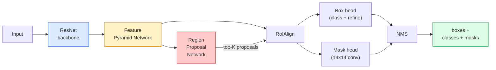

# Segmentasi Instance — Mask R-CNN

> Tambahkan cabang topeng kecil ke detektor R-CNN yang Lebih Cepat dan kamu akan mendapatkan segmentasi instans. Bagian tersulitnya adalah RoIALign, dan ini lebih sulit dari yang terlihat.

**Type:** Build + Learn
**Language:** Python
**Prerequisites:** Phase 4 Lesson 06 (YOLO), Phase 4 Lesson 07 (U-Net)
**Waktu:** ~75 menit

## Tujuan Pembelajaran

- Lacak arsitektur Mask R-CNN ujung ke ujung: tulang punggung, FPN, RPN, RoIALign, kepala kotak, kepala topeng
- Menerapkan RoIAlig dari awal dan menjelaskan mengapa RoIPool tidak lagi digunakan
- Gunakan model torchvision `maskrcnn_resnet50_fpn_v2` yang telah dilatih sebelumnya untuk masker instans berkualitas produksi dan baca format keluarannya dengan benar
- Sempurnakan Mask R-CNN pada dataset khusus kecil dengan mengganti kotak dan kepala topeng serta menjaga tulang punggung tetap beku

## Masalah

Segmentasi semantik memberi kamu satu topeng per kelas. Segmentasi instance memberi kamu satu mask per objek, meskipun dua objek berbagi kelas. Menghitung individu, melacak seluruh bingkai, dan mengukur berbagai hal (kotak pembatas setiap bata di dinding, setiap sel dalam gambar mikroskop) semuanya memerlukan segmentasi contoh.

Mask R-CNN (He et al., 2017) memecahkan masalah ini dengan mengubah segmentasi instance menjadi deteksi-plus-mask. Desainnya sangat rapi sehingga selama lima tahun ke depan hampir setiap makalah segmentasi contoh adalah varian Mask R-CNN, dan penerapan torchvision masih menjadi default produksi untuk dataset kecil hingga menengah.

Masalah teknis yang sulit adalah pengambilan sample: bagaimana kamu memotong wilayah feature berukuran tetap dari kotak proposal yang sudutnya tidak sejajar dengan batas piksel? Melakukan kesalahan membutuhkan sepersepuluh titik peta di mana pun. RoIAlig adalah jawabannya.

## Konsep

### Arsitektur



Lima bagian yang perlu dipahami:

1. **Backbone** — ResNet-50 atau ResNet-101 dilatih di ImageNet. Menghasilkan hierarki peta feature pada langkah 4, 8, 16, 32.
2. **FPN (Feature Pyramid Network)** — koneksi top-down + lateral yang memberikan setiap pipeline level C feature kaya semantik. Deteksi menanyakan level FPN yang cocok dengan ukuran objek.
3. **RPN (Jaringan Proposal Wilayah)** — kepala konv kecil yang, di setiap posisi jangkar, memprediksi "apakah ada objek di sini?" dan "bagaimana cara menyempurnakan kotaknya?". Menghasilkan ~1000 proposal per gambar.
4. **RoIALign** — mengambil sample patch feature berukuran tetap (misalnya 7x7) dari kotak mana pun di level FPN mana pun. Pengambilan sample bilinear, tanpa kuantisasi.
5. **Heads** — kepala kotak dua lapis yang menyempurnakan kotak dan memilih kelas, ditambah kepala konv kecil yang menghasilkan topeng biner `28x28` untuk setiap proposal.

### Mengapa RoIALign, bukan RoIPool

Fast R-CNN asli menggunakan RoIPool, yang membagi kotak proposal menjadi kotak, mengambil feature maksimum di setiap sel, dan membulatkan semua koordinat menjadi bilangan bulat. Pembulatan tersebut membuat peta feature tidak sejajar dari koordinat piksel input hingga piksel peta feature penuh — kecil pada gambar 224x224, menjadi bencana besar jika peta feature berada pada langkah 32.

```
RoIPool:
  box (34.7, 51.3, 98.2, 142.9)
  round -> (34, 51, 98, 142)
  split grid -> round each cell boundary
  misalignment accumulates at every step

RoIAlign:
  box (34.7, 51.3, 98.2, 142.9)
  sample at exact float coordinates using bilinear interpolation
  no rounding anywhere
```

RoIALign meningkatkan mask AP sebanyak 3-4 poin pada COCO secara gratis. Setiap detektor yang peduli dengan lokalisasi sekarang menggunakannya — YOLOv7 seg, RT-DETR, Mask2Former.

### RPN dalam satu paragrafDi setiap posisi peta feature, tempatkan K kotak jangkar dengan ukuran dan bentuk berbeda. Prediksikan skor objektivitas untuk setiap jangkar dan offset regresi untuk mengubah jangkar menjadi kotak yang lebih pas. Pertahankan ~1.000 kotak teratas berdasarkan skor, terapkan NMS pada IoU 0,7, dan serahkan yang selamat ke kepala. RPN dilatih dengan mini-lossnya sendiri - struktur yang sama dengan loss YOLO dari Lesson 6, hanya dengan dua kelas (objek / tanpa objek).

### Kepala topeng

Untuk setiap proposal (setelah RoIALign), kepala topeng adalah FCN kecil: empat konv 3x3, dekonv 2x, konv 1x1 akhir yang menghasilkan pipeline output `num_classes` pada resolusi `28x28`. Hanya pipeline yang sesuai dengan kelas prediksi yang dipertahankan; yang lain diabaikan. Ini memisahkan prediksi topeng dari klasifikasi.

Tingkatkan sample mask 28x28 ke ukuran piksel asli proposal untuk menghasilkan mask biner akhir.

### Loss

Mask R-CNN memiliki empat loss yang dijumlahkan:

```
L = L_rpn_cls + L_rpn_box + L_box_cls + L_box_reg + L_mask
```

- `L_rpn_cls`, `L_rpn_box` — objektivitas + regresi kotak untuk proposal RPN.
- `L_box_cls` — cross-entropy pada kelas (C+1) (termasuk latar belakang) pada pengklasifikasi kepala.
- `L_box_reg` — L1 halus pada penyempurnaan kotak kepala.
- `L_mask` — entropi silang biner per piksel pada output mask 28x28.

Setiap loss memiliki weight defaultnya sendiri; implementasi torchvision memaparkannya sebagai argumen konstruktor.

### Format output

`torchvision.models.detection.maskrcnn_resnet50_fpn_v2` mengembalikan daftar dicts, satu per gambar:

```
{
    "boxes":  (N, 4) in (x1, y1, x2, y2) pixel coordinates,
    "labels": (N,) class IDs, 0 = background so indices are 1-based,
    "scores": (N,) confidence scores,
    "masks":  (N, 1, H, W) float masks in [0, 1] — threshold at 0.5 for binary,
}
```

Topengnya sudah beresolusi gambar penuh. Output head 28x28 telah ditingkatkan sampelnya secara internal.

## Build

### Langkah 1: RoIALign dari awal

Ini adalah salah satu komponen Mask R-CNN yang lebih mudah dipahami sebagai code daripada prosa.

```python
import torch
import torch.nn.functional as F

def roi_align_single(feature, box, output_size=7, spatial_scale=1 / 16.0):
    """
    feature: (C, H, W) single-image feature map
    box: (x1, y1, x2, y2) in original image pixel coordinates
    output_size: side of the output grid (7 for box head, 14 for mask head)
    spatial_scale: reciprocal of the feature map stride
    """
    C, H, W = feature.shape
    x1, y1, x2, y2 = [c * spatial_scale - 0.5 for c in box]
    bin_w = (x2 - x1) / output_size
    bin_h = (y2 - y1) / output_size

    grid_y = torch.linspace(y1 + bin_h / 2, y2 - bin_h / 2, output_size)
    grid_x = torch.linspace(x1 + bin_w / 2, x2 - bin_w / 2, output_size)
    yy, xx = torch.meshgrid(grid_y, grid_x, indexing="ij")

    gx = 2 * (xx + 0.5) / W - 1
    gy = 2 * (yy + 0.5) / H - 1
    grid = torch.stack([gx, gy], dim=-1).unsqueeze(0)
    sampled = F.grid_sample(feature.unsqueeze(0), grid, mode="bilinear",
                            align_corners=False)
    return sampled.squeeze(0)
```

Setiap angka berada pada posisi sample bilinear. Tanpa pembulatan, tanpa kuantisasi, tanpa gradient descent.

### Langkah 2: Bandingkan dengan RoIALign torchvision

```python
from torchvision.ops import roi_align

feature = torch.randn(1, 16, 50, 50)
boxes = torch.tensor([[0, 10, 20, 100, 90]], dtype=torch.float32)  # (batch_idx, x1, y1, x2, y2)

ours = roi_align_single(feature[0], boxes[0, 1:].tolist(), output_size=7, spatial_scale=1/4)
theirs = roi_align(feature, boxes, output_size=(7, 7), spatial_scale=1/4, sampling_ratio=1, aligned=True)[0]

print(f"shape ours:   {tuple(ours.shape)}")
print(f"shape theirs: {tuple(theirs.shape)}")
print(f"max|diff|:    {(ours - theirs).abs().max().item():.3e}")
```

Dengan `sampling_ratio=1` dan `aligned=True`, keduanya cocok dengan `1e-5`.

### Langkah 3: Muat Mask R-CNN yang telah dilatih sebelumnya

```python
import torch
from torchvision.models.detection import maskrcnn_resnet50_fpn_v2, MaskRCNN_ResNet50_FPN_V2_Weights

model = maskrcnn_resnet50_fpn_v2(weights=MaskRCNN_ResNet50_FPN_V2_Weights.DEFAULT)
model.eval()
print(f"params: {sum(p.numel() for p in model.parameters()):,}")
print(f"classes (including background): {len(model.roi_heads.box_predictor.cls_score.out_features * [0])}")
```

Parameter 46 juta, 91 kelas (COCO). Kelas pertama (id 0) adalah latar belakang; semua yang sebenarnya dideteksi model dimulai dari id 1.

### Langkah 4: Jalankan inference

```python
with torch.no_grad():
    x = torch.randn(3, 400, 600)
    predictions = model([x])
p = predictions[0]
print(f"boxes:  {tuple(p['boxes'].shape)}")
print(f"labels: {tuple(p['labels'].shape)}")
print(f"scores: {tuple(p['scores'].shape)}")
print(f"masks:  {tuple(p['masks'].shape)}")
```

Tensor topeng berbentuk `(N, 1, H, W)`. Ambang batas pada 0,5 untuk mendapatkan topeng biner per objek:

```python
binary_masks = (p['masks'] > 0.5).squeeze(1)  # (N, H, W) boolean
```

### Langkah 5: Tukar kepala dengan jumlah kelas khusus

Resep penyesuaian yang umum: menggunakan kembali tulang punggung, FPN, dan RPN; ganti dua kepala pengklasifikasi.

```python
from torchvision.models.detection.faster_rcnn import FastRCNNPredictor
from torchvision.models.detection.mask_rcnn import MaskRCNNPredictor

def build_custom_maskrcnn(num_classes):
    model = maskrcnn_resnet50_fpn_v2(weights=MaskRCNN_ResNet50_FPN_V2_Weights.DEFAULT)
    in_features = model.roi_heads.box_predictor.cls_score.in_features
    model.roi_heads.box_predictor = FastRCNNPredictor(in_features, num_classes)
    in_features_mask = model.roi_heads.mask_predictor.conv5_mask.in_channels
    hidden_layer = 256
    model.roi_heads.mask_predictor = MaskRCNNPredictor(in_features_mask, hidden_layer, num_classes)
    return model

custom = build_custom_maskrcnn(num_classes=5)
print(f"custom cls_score.out_features: {custom.roi_heads.box_predictor.cls_score.out_features}")
```

`num_classes` harus menyertakan kelas latar belakang, sehingga dataset dengan 4 kelas objek menggunakan `num_classes=5`.

### Langkah 6: Bekukan apa yang tidak memerlukan training

Pada dataset kecil, bekukan backbone dan FPN. Hanya objektivitas RPN + regresi dan kedua kepala yang belajar.

```python
def freeze_backbone_and_fpn(model):
    # torchvision Mask R-CNN packs the FPN inside `model.backbone` (as
    # `model.backbone.fpn`), so iterating `model.backbone.parameters()` covers
    # both the ResNet feature layers and the FPN lateral/output convs.
    for p in model.backbone.parameters():
        p.requires_grad = False
    return model

custom = freeze_backbone_and_fpn(custom)
trainable = sum(p.numel() for p in custom.parameters() if p.requires_grad)
print(f"trainable after freeze: {trainable:,}")
```

Pada dataset 500 gambar, inilah perbedaan antara konvergensi dan overfitting.

## Pakai

Loop training penuh untuk Mask R-CNN di torchvision terdiri dari 40 baris dan tidak berubah secara berarti antar tugas — tukar dataset dan lanjutkan.

```python
def train_step(model, images, targets, optimizer):
    model.train()
    loss_dict = model(images, targets)
    losses = sum(loss for loss in loss_dict.values())
    optimizer.zero_grad()
    losses.backward()
    optimizer.step()
    return {k: v.item() for k, v in loss_dict.items()}
```Daftar `targets` harus memiliki dikt per gambar dengan `boxes`, `labels`, dan `masks` (sebagai `(num_instances, H, W)` tensor biner). Model mengembalikan dikte empat loss selama training dan daftar prediksi selama evaluasi, yang dimasukkan ke `model.training`.

Evaluator `pycocotools` menghasilkan mAP@IoU=0.5:0.95 baik untuk kotak maupun masker; kamu memerlukan kedua angka tersebut untuk mengetahui apakah kepala kotak atau kepala topeng adalah penghambatnya.

## Kirim

Lesson ini menghasilkan:

- `outputs/prompt-instance-vs-semantic-router.md` — prompt yang menanyakan tiga pertanyaan dan memilih contoh vs semantik vs panoptik ditambah model yang tepat untuk memulai.
- `outputs/skill-mask-rcnn-head-swapper.md` — keterampilan yang menghasilkan 10 baris code untuk menukar kepala pada model deteksi torchvision apa pun, mengingat `num_classes` yang baru.

## Latihan

1. **(Mudah)** Verifikasi RoIALign kamu terhadap `torchvision.ops.roi_align` pada 100 kotak acak. Laporkan perbedaan absolut maksimal. Jalankan juga RoIPool (perilaku pra-2017) dan tunjukkan perbedaannya sebesar ~1-2 piksel peta feature pada kotak di dekat perbatasan.
2. **(Medium)** Sempurnakan `maskrcnn_resnet50_fpn_v2` pada dataset khusus berisi 50 gambar (dua kelas apa saja: balon, ikan, lubang, logo). Bekukan tulang punggung, latih selama 20 epoch, laporkan mask AP@0.5.
3. **(Keras)** Ganti kepala topeng Mask R-CNN dengan yang memperkirakan ukuran 56x56, bukan 28x28. Ukur mAP@IoU=0,75 sebelum dan sesudah. Jelaskan mengapa keuntungan (atau kekurangannya) sesuai dengan trade-off batas-presisi/memori yang diharapkan.

## Istilah Kunci

| Istilah | Apa kata orang | Apa sebenarnya arti |
|------|----------------|----------------------|
| Topeng R-CNN | "Deteksi plus masker" | R-CNN lebih cepat + kepala FCN kecil yang memprediksi topeng 28x28 per proposal per kelas |
| FPN | "Feature piramida" | Koneksi top-down + lateral yang memberikan setiap langkah pipeline tingkat C feature kaya semantik |
| RPN | "Pengusul wilayah" | Kepala konv kecil yang menghasilkan ~1000 proposal objek/tanpa objek per gambar |
| RoIASejajarkan | "Tanaman tanpa pembulatan" | Mengambil sample kisi feature berukuran tetap secara bilinear dari kotak koordinat float |
| RoIPool | "Pangkalan pra-2017" | Tujuan yang sama seperti RoIALign tetapi membulatkan koordinat kotak; usang |
| Masker AP | "Peta Instance" | Presisi rata-rata dihitung dengan mask IoU, bukan IoU kotak; metrik segmentasi instans COCO |
| Kepala topeng biner | "Masker per kelas" | Memprediksi satu topeng biner per kelas untuk setiap proposal; hanya pipeline kelas prediksi yang disimpan |
| Kelas latar belakang | "Kelas 0" | Kelas umum "tanpa objek"; indeks untuk kelas nyata dimulai dari 1 |

## Bacaan Lanjutan

- [Mask R-CNN (He et al., 2017)](https://arxiv.org/abs/1703.06870) — makalah; bagian 3 di RoIAlig adalah bacaan kritis
- [FPN: Feature Pyramid Networks (Lin et al., 2017)](https://arxiv.org/abs/1612.03144) — makalah FPN; setiap detektor modern menggunakannya
- [tutorial Torchvision Mask R-CNN](https://pytorch.org/tutorials/intermediate/torchvision_tutorial.html) — referensi untuk loop penyesuaian
- [Kebun binatang model Detectron2](https://github.com/facebookresearch/detectron2/blob/main/MODEL_ZOO.md) — implementasi produksi dengan weight terlatih untuk hampir setiap varian deteksi dan segmentasi
