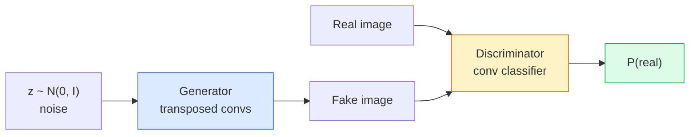
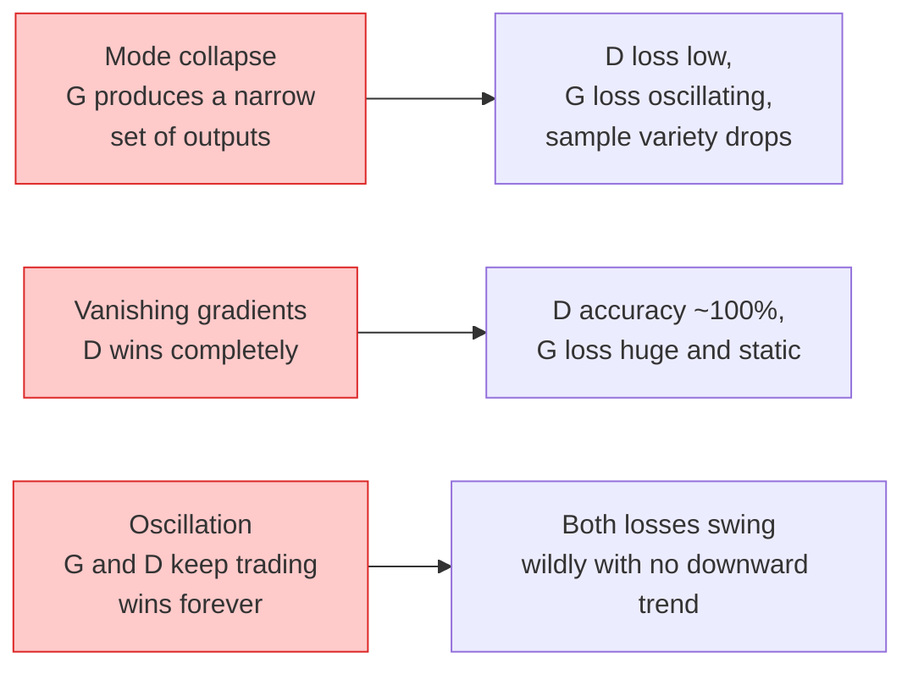

# Pembuatan Gambar — GAN

> GAN adalah dua neural network dalam permainan tetap. Yang satu menggambar, yang satu mengkritik. Mereka menjadi lebih baik bersama sampai gambarnya menipu para kritikus.

**Type:** Build
**Language:** Python
**Prerequisites:** Phase 4 Lesson 03 (CNN), Phase 3 Lesson 06 (Optimizer), Phase 3 Lesson 07 (Regularisasi)
**Waktu:** ~75 menit

## Tujuan Pembelajaran

- Jelaskan permainan minimax antara generator dan diskriminator dan mengapa keseimbangannya sesuai dengan p_model = p_data
- Menerapkan DCGAN di PyTorch dan membuatnya menghasilkan gambar sintetis 32x32 yang koheren dalam kurang dari 60 baris
- Stabilkan training GAN dengan tiga trik standar: loss tidak jenuh, norm spektral, TTUR (aturan pembaruan skala waktu dua kali)
- Baca kurva training yang membedakan konvergensi yang sehat dari mode runtuh, osilasi, dan diskriminator-menang-sepenuhnya

## Masalah

Klasifikasi mengajarkan jaringan untuk memetakan gambar ke label. Pembuatan membalikkan masalah: contoh gambar baru yang terlihat seperti berasal dari distribusi yang sama. Tidak ada output yang "benar" yang dapat kamu bedakan; hanya ada distribusi yang ingin kamu tiru.

Loss function standar (MSE, cross-entropy) tidak dapat mengukur "apakah sample ini berasal dari distribusi sebenarnya". Meminimalkan kesalahan per piksel menghasilkan rata-rata yang buram, bukan sample yang realistis. Terobosannya adalah mempelajari kerugiannya: melatih jaringan kedua yang tugasnya membedakan yang asli dan yang palsu, dan menggunakan penilaiannya untuk mendorong generator.

GAN (Goodfellow et al., 2014) mendefinisikan framework tersebut. Pada tahun 2018 StyleGAN memproduksi wajah berukuran 1024x1024 yang tidak dapat dibedakan dari foto. Model difusi kini menjadi yang terdepan dalam hal kualitas dan pengendalian, namun setiap trik yang menjadikan difusi praktis — pilihan normalisasi, ruang laten, hilangnya feature — pertama kali dipahami di GAN.

## Konsep

### Kedua jaringan



**generator** G mengambil vector noise `z` dan mengeluarkan gambar. **diskriminator** D mengambil gambar dan mengeluarkan satu scalar: probabilitas bahwa gambar tersebut nyata.

### Permainan

G ingin D salah. D ingin menjadi benar. Secara formal:

```
min_G max_D  E_x[log D(x)] + E_z[log(1 - D(G(z)))]
```

Baca dari kanan ke kiri: D memaksimalkan akurasi pada gambar asli (`log D(real)`) dan palsu (`log (1 - D(fake))`). G meminimalkan keakuratan D pada pemalsuan — ia ingin `D(G(z))` menjadi tinggi.

Goodfellow membuktikan bahwa minimax ini memiliki keseimbangan global di mana `p_G = p_data`, D menghasilkan 0,5 di mana-mana, dan divergensi Jensen-Shannon antara distribusi yang dihasilkan dan distribusi nyata adalah nol. Bagian yang sulit adalah mencapainya.

### Loss yang tidak jenuh

Bentuk di atas tidak stabil secara numerik. Di awal training, `D(G(z))` mendekati nol untuk setiap palsu, jadi `log(1 - D(G(z)))` memiliki gradient yang hilang sehubungan dengan G. Cara mengatasinya: hilangnya flip G.

```
L_D = -E_x[log D(x)] - E_z[log(1 - D(G(z)))]
L_G = -E_z[log D(G(z))]                          # non-saturating
```

Sekarang ketika `D(G(z))` mendekati nol, loss G besar dan gradiennya informatif. Setiap GAN modern berlatih dengan varian ini.

### Aturan arsitektur DCGAN

Radford, Metz, Chintala (2015) menyaring eksperimen yang gagal selama bertahun-tahun menjadi lima aturan yang membuat training GAN stabil:

1. Ganti pooling dengan konvs melangkah (kedua jaring).
2. Gunakan norm batch pada generator dan diskriminator, kecuali output G dan input D.
3. Hapus layer yang terhubung sepenuhnya pada arsitektur yang lebih dalam.
4. G menggunakan ReLU pada semua layer kecuali output (tanh untuk output di [-1, 1]).
5. D menggunakan LeakyReLU (negative_slope=0.2) pada semua layer.Setiap GAN berbasis konv modern (StyleGAN, BigGAN, GigaGAN) masih memulai dari aturan ini dan mengganti bagian satu per satu.

### Mode kegagalan dan tanda tangannya



- **Mode runtuh**: G menemukan satu gambar yang menipu D dan hanya menghasilkan gambar itu. Cara mengatasinya: tambahkan diskriminasi minibatch, norm spektral, atau pengkondisian label.
- **Diskriminator menang**: D menjadi terlalu kuat dan terlalu cepat, gradient G menghilang. Perbaiki: D lebih kecil, learning rate D lebih rendah, atau terapkan penghalusan label pada label sebenarnya.
- **Osilasi**: dua tradeoff bersih menang tanpa pernah mendekati keseimbangan. Perbaiki: TTUR (D belajar lebih cepat dari G dengan faktor 2-4), atau beralih ke loss Wasserstein.

### Evaluasi

GAN tidak memiliki kebenaran dasar, jadi bagaimana kamu tahu bahwa GAN berfungsi?

- **Pemeriksaan sample** — lihat saja 64 sample di akhir setiap periode. Tidak bisa dinegosiasikan.
- **FID (Fréchet Inception Distance)** — distance antara distribusi feature Inception-v3 dari set nyata dan yang dihasilkan. Lebih rendah lebih baik. Standar komunitas.
- **Skor Awal** — lebih tua, lebih rapuh; lebih memilih FID.
- **Precision/Recall untuk model generatif** — mengukur kualitas (presisi) dan cakupan (recall) secara terpisah. Lebih informatif daripada FID saja.

Untuk menjalankan data sintetis dalam jumlah kecil, pemeriksaan sample sudah cukup.

## Build

### Langkah 1: Generator

Generator DCGAN kecil yang menyerap noise 64 redup dan menghasilkan gambar berukuran 32x32.

```python
import torch
import torch.nn as nn

class Generator(nn.Module):
    def __init__(self, z_dim=64, img_channels=3, feat=64):
        super().__init__()
        self.net = nn.Sequential(
            nn.ConvTranspose2d(z_dim, feat * 4, kernel_size=4, stride=1, padding=0, bias=False),
            nn.BatchNorm2d(feat * 4),
            nn.ReLU(inplace=True),
            nn.ConvTranspose2d(feat * 4, feat * 2, kernel_size=4, stride=2, padding=1, bias=False),
            nn.BatchNorm2d(feat * 2),
            nn.ReLU(inplace=True),
            nn.ConvTranspose2d(feat * 2, feat, kernel_size=4, stride=2, padding=1, bias=False),
            nn.BatchNorm2d(feat),
            nn.ReLU(inplace=True),
            nn.ConvTranspose2d(feat, img_channels, kernel_size=4, stride=2, padding=1, bias=False),
            nn.Tanh(),
        )

    def forward(self, z):
        return self.net(z.view(z.size(0), -1, 1, 1))
```

Empat konv yang ditransposisikan, masing-masing dengan `kernel_size=4, stride=2, padding=1` sehingga menggandakan ukuran spasial dengan rapi. Activation output di [-1, 1] melalui tanh.

### Langkah 2: Diskriminator

Cermin generator. LeakyReLU, konvs melangkah, diakhiri dengan logit scalar.

```python
class Discriminator(nn.Module):
    def __init__(self, img_channels=3, feat=64):
        super().__init__()
        self.net = nn.Sequential(
            nn.Conv2d(img_channels, feat, kernel_size=4, stride=2, padding=1),
            nn.LeakyReLU(0.2, inplace=True),
            nn.Conv2d(feat, feat * 2, kernel_size=4, stride=2, padding=1, bias=False),
            nn.BatchNorm2d(feat * 2),
            nn.LeakyReLU(0.2, inplace=True),
            nn.Conv2d(feat * 2, feat * 4, kernel_size=4, stride=2, padding=1, bias=False),
            nn.BatchNorm2d(feat * 4),
            nn.LeakyReLU(0.2, inplace=True),
            nn.Conv2d(feat * 4, 1, kernel_size=4, stride=1, padding=0),
        )

    def forward(self, x):
        return self.net(x).view(-1)
```

Konv. terakhir mengurangi peta feature `4x4` menjadi `1x1`. Outputnya adalah satu scalar per gambar; terapkan sigmoid hanya selama perhitungan loss.

### Langkah 3: Langkah training

Alternatif: perbarui D satu kali, lalu G satu kali, setiap batch.

```python
import torch.nn.functional as F

def train_step(G, D, real, z, opt_g, opt_d, device):
    real = real.to(device)
    bs = real.size(0)

    # D step
    opt_d.zero_grad()
    d_real = D(real)
    d_fake = D(G(z).detach())
    loss_d = (F.binary_cross_entropy_with_logits(d_real, torch.ones_like(d_real))
              + F.binary_cross_entropy_with_logits(d_fake, torch.zeros_like(d_fake)))
    loss_d.backward()
    opt_d.step()

    # G step
    opt_g.zero_grad()
    d_fake = D(G(z))
    loss_g = F.binary_cross_entropy_with_logits(d_fake, torch.ones_like(d_fake))
    loss_g.backward()
    opt_g.step()

    return loss_d.item(), loss_g.item()
```

`G(z).detach()` pada langkah D sangat penting: kita tidak ingin gradient mengalir ke G selama pembaruannya. Lupa itu adalah bug klasik pemula.

### Langkah 4: Latihan penuh pada bentuk sintetik

```python
from torch.utils.data import DataLoader, TensorDataset
import numpy as np

def synthetic_images(num=2000, size=32, seed=0):
    rng = np.random.default_rng(seed)
    imgs = np.zeros((num, 3, size, size), dtype=np.float32) - 1.0
    for i in range(num):
        r = rng.uniform(6, 12)
        cx, cy = rng.uniform(r, size - r, size=2)
        yy, xx = np.meshgrid(np.arange(size), np.arange(size), indexing="ij")
        mask = (xx - cx) ** 2 + (yy - cy) ** 2 < r ** 2
        color = rng.uniform(-0.5, 1.0, size=3)
        for c in range(3):
            imgs[i, c][mask] = color[c]
    return torch.from_numpy(imgs)

device = "cuda" if torch.cuda.is_available() else "cpu"
data = synthetic_images()
loader = DataLoader(TensorDataset(data), batch_size=64, shuffle=True)

G = Generator(z_dim=64, img_channels=3, feat=32).to(device)
D = Discriminator(img_channels=3, feat=32).to(device)
opt_g = torch.optim.Adam(G.parameters(), lr=2e-4, betas=(0.5, 0.999))
opt_d = torch.optim.Adam(D.parameters(), lr=2e-4, betas=(0.5, 0.999))

for epoch in range(10):
    for (batch,) in loader:
        z = torch.randn(batch.size(0), 64, device=device)
        ld, lg = train_step(G, D, batch, z, opt_g, opt_d, device)
    print(f"epoch {epoch}  D {ld:.3f}  G {lg:.3f}")
```

`Adam(lr=2e-4, betas=(0.5, 0.999))` adalah default DCGAN — beta1 yang rendah menjaga istilah momentum agar tidak terlalu menstabilkan permainan permusuhan.

### Langkah 5: Pengambilan Sample

```python
@torch.no_grad()
def sample(G, n=16, z_dim=64, device="cpu"):
    G.eval()
    z = torch.randn(n, z_dim, device=device)
    imgs = G(z)
    imgs = (imgs + 1) / 2
    return imgs.clamp(0, 1)
```

Selalu beralih ke mode eval sebelum pengambilan sample. Bagi DCGAN, hal ini penting karena statistik berjalan norm batch digunakan, bukan statistik batch.

### Langkah 6: Normalisasi spektral

Pengganti drop-in untuk BN di diskriminator yang menjamin jaringan adalah 1-Lipschitz. Memperbaiki sebagian besar kegagalan "D menang terlalu keras".

```python
from torch.nn.utils import spectral_norm

def build_sn_discriminator(img_channels=3, feat=64):
    return nn.Sequential(
        spectral_norm(nn.Conv2d(img_channels, feat, 4, 2, 1)),
        nn.LeakyReLU(0.2, inplace=True),
        spectral_norm(nn.Conv2d(feat, feat * 2, 4, 2, 1)),
        nn.LeakyReLU(0.2, inplace=True),
        spectral_norm(nn.Conv2d(feat * 2, feat * 4, 4, 2, 1)),
        nn.LeakyReLU(0.2, inplace=True),
        spectral_norm(nn.Conv2d(feat * 4, 1, 4, 1, 0)),
    )
```

Tukar `Discriminator` dengan `build_sn_discriminator()` dan kamu sering kali tidak memerlukan trik TTUR. Norm spektral adalah peningkatan ketahanan tunggal termudah yang dapat kamu terapkan.

## Pakai

Untuk pembangkitan yang serius, gunakan weight yang telah dilatih sebelumnya atau beralih ke difusi. Dua perpustakaan standar:

- `torch_fidelity` menghitung FID / IS pada generator kamu tanpa menulis code eval khusus.
- `pytorch-gan-zoo` (warisan) dan `StudioGAN` mengirimkan implementasi DCGAN, WGAN-GP, SN-GAN, StyleGAN, dan BigGAN.

Pada tahun 2026, GAN masih menjadi pilihan terbaik untuk: pembuatan gambar real-time (latensi <10 ms), transfer gaya, terjemahan gambar-ke-gambar dengan kontrol presisi (Pix2Pix, CycleGAN). Difusi menang dalam fotorealisme dan pengondisian teks.

## Kirim

Lesson ini menghasilkan:- `outputs/prompt-gan-training-triage.md` — prompt yang membaca deskripsi kurva training dan memilih mode kegagalan (mode runtuh, D-menang, osilasi) ditambah satu perbaikan yang direkomendasikan.
- `outputs/skill-dcgan-scaffold.md` — keterampilan menulis perancah DCGAN dari `z_dim`, target `image_size`, dan `num_channels`, termasuk loop training dan penghemat sample.

## Latihan

1. **(Mudah)** Latih DCGAN di atas pada dataset lingkaran sintetis dan simpan grid berisi 16 sample di akhir setiap zaman. Pada zaman manakah lingkaran yang dihasilkan menjadi lingkaran jelas?
2. **(Medium)** Ganti norm batch diskriminator dengan norm spektral. Latih kedua versi secara berdampingan. Manakah yang konvergennya lebih cepat? Manakah yang memiliki varian lebih rendah pada tiga benih?
3. **(Hard)** Terapkan DCGAN bersyarat: masukkan label kelas ke G dan D (gabungkan satu-hot ke noise di G, gabungkan pipeline embedding kelas di D). Latih dataset sintetis "lingkaran vs kotak" dari lesson 7 dan tunjukkan bahwa pengkondisian kelas bekerja dengan mengambil sample dengan label tertentu.

## Istilah Kunci

| Istilah | Apa kata orang | Apa sebenarnya arti |
|------|----------------|----------------------|
| Pembangkit (G) | "Jaring undian" | Memetakan noise ke gambar; dilatih untuk mengelabui diskriminator |
| Diskriminator (D) | "Kritikus" | Pengklasifikasi biner; dilatih untuk membedakan gambar nyata dari gambar yang dihasilkan |
| Minimaks | "Permainan" | min di atas G, maks di atas D dari loss yang merugikan; kesetimbangannya adalah p_G = p_data |
| Loss tidak jenuh | "Versi yang masuk akal secara numerik" | Loss G adalah -log(D(G(z))) bukan log(1 - D(G(z))) untuk menghindari vanishing gradient di awal training |
| Mode runtuh | "Generator membuat satu hal" | G hanya menghasilkan sebagian kecil dari distribusi data; perbaiki dengan SN, diskriminasi minibatch, atau batch yang lebih besar |
| TTUR | "Dua learning rate" | D belajar lebih cepat daripada G, biasanya dengan faktor 2-4; menstabilkan training |
| Norm spektral | "Layer 1-Lipschitz" | Normalisasi weight yang membatasi konstanta Lipschitz setiap layer; menghentikan D agar tidak curam secara sewenang-wenang |
| FID | "Distance Awal Fréchet" | Distance antara distribusi feature Inception-v3 dari set nyata dan yang dihasilkan; metrik evaluasi standar |

## Bacaan Lanjutan

- [Generative Adversarial Networks (Goodfellow et al., 2014)](https://arxiv.org/abs/1406.2661) — makalah yang memulai semuanya
- [DCGAN (Radford, Metz, Chintala, 2015)](https://arxiv.org/abs/1511.06434) — aturan arsitektur yang membuat GAN dapat dilatih
- [Normalisasi Spektral untuk GAN (Miyato et al., 2018)](https://arxiv.org/abs/1802.05957) — satu-satunya trik stabilisasi yang paling berguna
- [StyleGAN3 (Karras dkk., 2021)](https://arxiv.org/abs/2106.12423) — SOTA GAN; terbaca seperti album paling hits dari setiap trik dalam satu dekade terakhir
