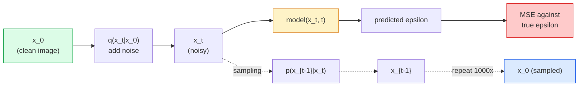

# Pembuatan Gambar — Model Difusi

> Model difusi belajar mencela. Latihlah untuk menghilangkan sedikit noise dari gambar yang berisik, ulangi secara terbalik ribuan kali, dan kamu memiliki generator gambar.

**Type:** Build
**Language:** Python
**Prerequisites:** Phase 4 Lesson 07 (U-Net), Phase 1 Lesson 06 (Probabilitas), Phase 3 Lesson 06 (Optimizer)
**Waktu:** ~75 menit

## Tujuan Pembelajaran

- Turunkan proses gangguan ke depan `x_0 -> x_1 -> ... -> x_T` dan jelaskan mengapa bentuk tertutup `q(x_t | x_0)` berlaku untuk t apa pun
- Menerapkan tujuan training gaya DDPM yang meregresi noise yang ditambahkan di setiap langkah, dan sampler yang menelusuri kembali noise murni ke gambar
- Membangun U-Net yang terkondisikan waktu (cukup kecil untuk dilatih pada CPU) yang memprediksi kebisingan untuk setiap langkah waktu
- Jelaskan perbedaan antara pengambilan sample DDPM dan DDIM, dan kapan masing-masing pengambilan sample tersebut sesuai (Lesson 23 mencakup pencocokan aliran dan perbaikan aliran secara mendalam)

## Masalah

GAN menghasilkan satu pengambilan gambar: noise masuk, gambar keluar, satu forward pass. Mereka cepat dan sulit untuk dilatih. Model difusi dihasilkan secara iteratif: mulai dari noise murni, denoise dalam langkah-langkah kecil, gambar muncul. Mereka lambat dan mudah dilatih. Selama lima tahun terakhir, sifat terakhir yang mendominasi: tim kecil mana pun dapat melatih model difusi dan mendapatkan sample yang masuk akal; Training GAN adalah keahlian yang kamu pelajari selama bertahun-tahun setelah gagal.

Selain stabilitas training, struktur berulang difusi adalah hal yang membuka segala hal yang dilakukan oleh generasi gambar modern: pengondisian teks, pengecatan, pengeditan gambar, resolusi super, gaya yang dapat dikontrol. Setiap langkah dari loop pengambilan sample adalah tempat untuk memasukkan batasan baru. Hal itulah yang menyebabkan Difusi Stabil, Imagen, DALL-E 3, Midjourney, dan setiap model gambar terkontrol yang akan kamu gunakan semuanya berbasis difusi.

Lesson ini membangun DDPM minimal: derau ke depan, derau ke belakang, putaran training. Lesson berikutnya (Difusi Stabil) menghubungkannya ke dalam sistem produksi dengan VAE, pembuat enkode teks, dan panduan bebas pengklasifikasi.

## Konsep

### Proses penerusan

Ambil gambar `x_0`. Tambahkan sedikit Gaussian noise untuk mendapatkan `x_1`. Tambahkan sedikit lagi untuk mendapatkan `x_2`. Lanjutkan sebanyak T langkah hingga `x_T` hampir tidak dapat dibedakan dari derau Gaussian murni.

```
q(x_t | x_{t-1}) = N(x_t; sqrt(1 - beta_t) * x_{t-1},  beta_t * I)
```

`beta_t` adalah jadwal varians kecil, biasanya linier dari 0,0001 hingga 0,02 pada T=1000 langkah. Setiap langkah sedikit mengecilkan sinyal dan menimbulkan kebisingan baru.

### Lompatan bentuk tertutup

Menambahkan kebisingan selangkah demi selangkah adalah rantai Markov, tetapi perhitungannya rumit: kamu dapat mengambil sample `x_t` langsung dari `x_0` dalam satu langkah.

```
Define alpha_t = 1 - beta_t
Define alpha_bar_t = prod_{s=1..t} alpha_s

Then:
  q(x_t | x_0) = N(x_t; sqrt(alpha_bar_t) * x_0,  (1 - alpha_bar_t) * I)

Equivalently:
  x_t = sqrt(alpha_bar_t) * x_0 + sqrt(1 - alpha_bar_t) * epsilon
  where epsilon ~ N(0, I)
```

Persamaan tunggal inilah yang menjadi alasan mengapa difusi dapat dilakukan secara praktis. Selama training, kamu memilih `t` secara acak, sample `x_t` langsung dari `x_0`, dan berlatih dalam satu langkah — tidak diperlukan simulasi rantai Markov lengkap.

### Proses sebaliknya

Proses ke depan sudah diperbaiki. Proses sebaliknya `p(x_{t-1} | x_t)` adalah apa yang dipelajari neural network. Model difusi tidak memprediksi `x_{t-1}` secara langsung; mereka memprediksi kebisingan `epsilon` yang ditambahkan pada langkah t, dan perhitungannya menghasilkan `x_{t-1}` darinya.



### Kehilangan training

Untuk setiap langkah training:1. Contoh gambar asli `x_0`.
2. Contoh langkah waktu `t` secara seragam dari [1, T].
3. Contoh kebisingan `epsilon ~ N(0, I)`.
4. Hitung `x_t = sqrt(alpha_bar_t) * x_0 + sqrt(1 - alpha_bar_t) * epsilon`.
5. Prediksi `epsilon_theta(x_t, t)` dengan jaringan.
6. Minimalkan `|| epsilon - epsilon_theta(x_t, t) ||^2`.

Hanya itu saja. Jaringan saraf belajar memprediksi kebisingan pada waktu tertentu. Yang rugi adalah UMK. Tidak ada permainan yang saling bermusuhan, tidak ada keruntuhan, tidak ada osilasi.

### Pengambil sample (DDPM)

Untuk menghasilkan: mulai dari `x_T ~ N(0, I)` dan berjalan mundur selangkah demi selangkah.

```
for t = T, T-1, ..., 1:
    eps = model(x_t, t)
    x_{t-1} = (1 / sqrt(alpha_t)) * (x_t - (beta_t / sqrt(1 - alpha_bar_t)) * eps) + sqrt(beta_t) * z
    where z ~ N(0, I) if t > 1, else 0
return x_0
```

Kuncinya adalah meskipun kondisi kebalikannya tidak diketahui secara umum dalam bentuk tertutup, namun untuk proses maju Gaussian yang spesifik ini, kondisi tersebut diketahui. Koefisien yang tampak jelek adalah apa yang diberikan oleh aturan Bayes kepada kamu.

### Mengapa 1000 langkah

Jadwal kebisingan maju dipilih sehingga setiap langkah menambahkan kebisingan secukupnya sehingga langkah sebaliknya mendekati Gaussian. Langkah terlalu sedikit dan langkah sebaliknya jauh dari Gaussian, jaringan tidak dapat memodelkannya dengan baik. Terlalu banyak langkah dan pengambilan sample menjadi mahal karena perolehan yang semakin berkurang. T=1000 dengan jadwal linier adalah default DDPM.

### DDIM: pengambilan sample 20x lebih cepat

Training-nya sama. Perubahan pengambilan sample. DDIM (Song et al., 2020) mendefinisikan proses kebalikan deterministik yang melewatkan tahapan waktu tanpa training ulang. Pengambilan sample dalam 50 langkah dengan DDIM menghasilkan kualitas DDPM yang mendekati 1000 langkah. Setiap sistem produksi menggunakan DDIM atau varian yang lebih cepat (DPM-Solver, Euler leluhur).

### Pengondisian waktu

Jaringan `epsilon_theta(x_t, t)` perlu mengetahui langkah waktu mana yang dituding. Model difusi modern menyuntikkan `t` melalui embedding waktu sinusoidal (ide yang sama dengan pengkodean posisi pada Transformer) yang ditambahkan ke peta feature di setiap level U-Net.

```
t_embedding = sinusoidal(t)
feature_map += MLP(t_embedding)
```

Tanpa pengkondisian waktu, jaringan harus menebak tingkat kebisingan dari gambar itu sendiri, yang berfungsi tetapi kurang efisien dalam pengambilan sample.

## Build

### Langkah 1: Jadwal kebisingan

```python
import torch

def linear_beta_schedule(T=1000, beta_start=1e-4, beta_end=2e-2):
    return torch.linspace(beta_start, beta_end, T)


def precompute_schedule(betas):
    alphas = 1.0 - betas
    alphas_cumprod = torch.cumprod(alphas, dim=0)
    return {
        "betas": betas,
        "alphas": alphas,
        "alphas_cumprod": alphas_cumprod,
        "sqrt_alphas_cumprod": torch.sqrt(alphas_cumprod),
        "sqrt_one_minus_alphas_cumprod": torch.sqrt(1.0 - alphas_cumprod),
        "sqrt_recip_alphas": torch.sqrt(1.0 / alphas),
    }

schedule = precompute_schedule(linear_beta_schedule(T=1000))
```

Lakukan pra-hitung satu kali, kumpulkan berdasarkan indeks selama training dan pengambilan sample.

### Langkah 2: Difusi maju (q_sample)

```python
def q_sample(x0, t, noise, schedule):
    sqrt_a = schedule["sqrt_alphas_cumprod"][t].view(-1, 1, 1, 1)
    sqrt_one_minus_a = schedule["sqrt_one_minus_alphas_cumprod"][t].view(-1, 1, 1, 1)
    return sqrt_a * x0 + sqrt_one_minus_a * noise
```

Bentuk tertutup satu baris. `t` adalah kumpulan langkah waktu, satu langkah waktu per gambar dalam kumpulan tersebut.

### Langkah 3: U-Net kecil yang dikondisikan oleh waktu

```python
import torch.nn as nn
import torch.nn.functional as F
import math

def timestep_embedding(t, dim=64):
    half = dim // 2
    freqs = torch.exp(-math.log(10000) * torch.arange(half, device=t.device) / half)
    args = t[:, None].float() * freqs[None]
    emb = torch.cat([args.sin(), args.cos()], dim=-1)
    return emb


class TinyUNet(nn.Module):
    def __init__(self, img_channels=3, base=32, t_dim=64):
        super().__init__()
        self.t_mlp = nn.Sequential(
            nn.Linear(t_dim, base * 4),
            nn.SiLU(),
            nn.Linear(base * 4, base * 4),
        )
        self.t_dim = t_dim
        self.enc1 = nn.Conv2d(img_channels, base, 3, padding=1)
        self.enc2 = nn.Conv2d(base, base * 2, 4, stride=2, padding=1)
        self.mid = nn.Conv2d(base * 2, base * 2, 3, padding=1)
        self.dec1 = nn.ConvTranspose2d(base * 2, base, 4, stride=2, padding=1)
        self.dec2 = nn.Conv2d(base * 2, img_channels, 3, padding=1)
        self.time_proj = nn.Linear(base * 4, base * 2)

    def forward(self, x, t):
        t_emb = timestep_embedding(t, self.t_dim)
        t_emb = self.t_mlp(t_emb)
        t_proj = self.time_proj(t_emb)[:, :, None, None]

        h1 = F.silu(self.enc1(x))
        h2 = F.silu(self.enc2(h1)) + t_proj
        h3 = F.silu(self.mid(h2))
        d1 = F.silu(self.dec1(h3))
        d2 = torch.cat([d1, h1], dim=1)
        return self.dec2(d2)
```

U-Net dua tingkat dengan pengkondisian waktu disuntikkan pada kemacetan. Tingkatkan kedalaman dan lebar untuk gambar nyata.

### Langkah 4: Putaran training

```python
def train_step(model, x0, schedule, optimizer, device, T=1000):
    model.train()
    x0 = x0.to(device)
    bs = x0.size(0)
    t = torch.randint(0, T, (bs,), device=device)
    noise = torch.randn_like(x0)
    x_t = q_sample(x0, t, noise, schedule)
    pred = model(x_t, t)
    loss = F.mse_loss(pred, noise)
    optimizer.zero_grad()
    loss.backward()
    optimizer.step()
    return loss.item()
```

Itulah keseluruhan putaran training. Tidak ada permainan GAN, tidak ada loss khusus, satu panggilan MSE.

### Langkah 5: Pengambil Sample (DDPM)

```python
@torch.no_grad()
def sample(model, schedule, shape, T=1000, device="cpu"):
    model.eval()
    x = torch.randn(shape, device=device)
    betas = schedule["betas"].to(device)
    sqrt_one_minus_a = schedule["sqrt_one_minus_alphas_cumprod"].to(device)
    sqrt_recip_alphas = schedule["sqrt_recip_alphas"].to(device)

    for t in reversed(range(T)):
        t_batch = torch.full((shape[0],), t, dtype=torch.long, device=device)
        eps = model(x, t_batch)
        coef = betas[t] / sqrt_one_minus_a[t]
        mean = sqrt_recip_alphas[t] * (x - coef * eps)
        if t > 0:
            x = mean + torch.sqrt(betas[t]) * torch.randn_like(x)
        else:
            x = mean
    return x
```

1000 forward pass untuk menghasilkan satu batch sample. Dalam code sebenarnya kamu akan menukar ini dengan sampler DDIM 50 langkah.

### Langkah 6: Sampler DDIM (deterministik, ~20x lebih cepat)

```python
@torch.no_grad()
def sample_ddim(model, schedule, shape, steps=50, T=1000, device="cpu", eta=0.0):
    model.eval()
    x = torch.randn(shape, device=device)
    alphas_cumprod = schedule["alphas_cumprod"].to(device)

    ts = torch.linspace(T - 1, 0, steps + 1).long()
    for i in range(steps):
        t = ts[i]
        t_prev = ts[i + 1]
        t_batch = torch.full((shape[0],), t, dtype=torch.long, device=device)
        eps = model(x, t_batch)
        a_t = alphas_cumprod[t]
        a_prev = alphas_cumprod[t_prev] if t_prev >= 0 else torch.tensor(1.0, device=device)
        x0_pred = (x - torch.sqrt(1 - a_t) * eps) / torch.sqrt(a_t)
        sigma = eta * torch.sqrt((1 - a_prev) / (1 - a_t) * (1 - a_t / a_prev))
        dir_xt = torch.sqrt(1 - a_prev - sigma ** 2) * eps
        noise = sigma * torch.randn_like(x) if eta > 0 else 0
        x = torch.sqrt(a_prev) * x0_pred + dir_xt + noise
    return x
```

`eta=0` sepenuhnya deterministik (input noise yang sama selalu menghasilkan output yang sama). `eta=1` memulihkan DDPM.

## Pakai

Untuk pekerjaan produksi, gunakan `diffusers`:

```python
from diffusers import DDPMScheduler, UNet2DModel

unet = UNet2DModel(sample_size=32, in_channels=3, out_channels=3, layers_per_block=2)
scheduler = DDPMScheduler(num_train_timesteps=1000)
```

Perpustakaan mengirimkan penjadwal siap pakai (DDPM, DDIM, DPM-Solver, Euler, Heun), U-Nets yang dapat dikonfigurasi, pipeline pipa untuk teks-ke-gambar dan gambar-ke-gambar, dan bantuan penyempurnaan LoRA.

Untuk penelitian, `k-diffusion` (Katherine Crowson) memiliki implementasi referensi paling setia dan varian pengambilan sample terbaik.

## Kirim

Lesson ini menghasilkan:- `outputs/prompt-diffusion-sampler-picker.md` — prompt yang memilih DDPM / DDIM / DPM-Solver / Euler berdasarkan target kualitas, anggaran latensi, dan jenis pengkondisian.
- `outputs/skill-noise-schedule-designer.md` — keterampilan yang menghasilkan jadwal beta linier, kosinus, atau sigmoid berdasarkan T dan tingkat kerusakan target, ditambah plot diagnostik rasio signal-to-noise dari waktu ke waktu.

## Latihan

1. **(Mudah)** Visualisasikan proses penerusan: ambil satu gambar dan plot `x_t` di `t in [0, 100, 250, 500, 750, 1000]`. Verifikasi bahwa `x_1000` tampak seperti derau Gaussian murni.
2. **(Medium)** Latih TinyUNet pada dataset lingkaran sintetis selama 20 periode dan ambil sample 16 lingkaran. Bandingkan pengambilan sample DDPM (1000 langkah) dan DDIM (50 langkah) — apakah keduanya menghasilkan gambar serupa dari benih kebisingan yang sama?
3. **(Sulit)** Menerapkan jadwal kebisingan kosinus (Nichol & Dhariwal, 2021): `alpha_bar_t = cos^2((t/T + s) / (1 + s) * pi / 2)`. Latih model yang sama dengan jadwal linier dan kosinus dan tunjukkan bahwa kosinus memberikan sample yang lebih baik pada jumlah langkah yang rendah.

## Istilah Kunci

| Istilah | Apa kata orang | Apa sebenarnya arti |
|------|----------------|----------------------|
| Proses maju | "Tambahkan kebisingan seiring waktu" | Memperbaiki rantai Markov yang mengubah gambar menjadi noise Gaussian pada langkah T |
| Proses terbalik | "Tolak langkah demi langkah" | Distribusi yang dipelajari yang berjalan kembali dari noise ke gambar |
| Prediksi Epsilon | "Prediksi kebisingan" | Target training: `epsilon_theta(x_t, t)` memprediksi kebisingan yang ditambahkan pada langkah t |
| Jadwal beta | "Jumlah kebisingan" | Urutan T varian kecil yang menentukan berapa banyak kebisingan yang masuk per langkah |
| alfa_bar_t | "Faktor retensi kumulatif" | Produk dari (1 - beta_s) hingga waktu t; lebih besar t berarti lebih sedikit sinyal yang tersisa |
| Sample DDPM | "Leluhur, stokastik" | Mengambil sample setiap x_{t-1} dari Gaussian bersyaratnya; 1000 langkah |
| Sample DDIM | "Deterministik, cepat" | Menulis ulang pengambilan sample sebagai ODE deterministik; 20-100 langkah dengan kualitas serupa |
| Pengkondisian waktu | "Beri tahu modelnya yang mana" | Penanaman sinusoidal t disuntikkan ke U-Net sehingga mengetahui tingkat kebisingan |

## Bacaan Lanjutan

- [Denoising Diffusion Probabilistic Models (Ho et al., 2020)](https://arxiv.org/abs/2006.11239) — makalah yang menjadikan difusi praktis dan mengalahkan GAN dalam FID
- [Peningkatan DDPM (Nichol & Dhariwal, 2021)](https://arxiv.org/abs/2102.09672) — jadwal kosinus dan parameterisasi v
- [DDIM (Song, Meng, Ermon, 2020)](https://arxiv.org/abs/2010.02502) — sampler deterministik yang memungkinkan inference real-time
- [Menjelaskan Ruang Desain Difusi (Karras et al., 2022)](https://arxiv.org/abs/2206.00364) — pandangan terpadu dari setiap pilihan desain difusi; referensi terbaik saat ini
