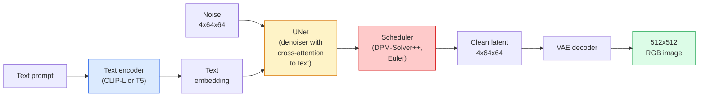

# Difusi Stabil — Arsitektur & Penyempurnaan

> Difusi Stabil adalah DDPM yang berjalan di ruang laten VAE yang telah dilatih sebelumnya, dikondisikan pada teks melalui attention silang, diambil sampelnya dengan pemecah ODE deterministik cepat, dan dikendalikan oleh panduan bebas pengklasifikasi.

**Type:** Learn + Gunakan
**Language:** Python
**Prerequisites:** Fase 4 Lesson 10 (Difusi), Fase 7 Lesson 02 (Attention Diri)
**Waktu:** ~75 menit

## Tujuan Pembelajaran

- Telusuri lima bagian pipa Difusi Stabil: VAE, pembuat enkode teks, U-Net, penjadwal, pemeriksa keamanan — dan fungsi sebenarnya dari masing-masing bagian tersebut
- Jelaskan difusi laten dan mengapa training dalam ruang laten 4x64x64 (bukan gambar 3x512x512) mengurangi komputasi sebesar 48x tanpa kehilangan kualitas
- Gunakan `diffusers` untuk menghasilkan gambar, menjalankan gambar-ke-gambar, inpainting, dan pembuatan yang dipandu ControlNet
- Sempurnakan Difusi Stabil dengan LoRA pada dataset khusus kecil dan muat adaptor LoRA pada inference

## Masalah

Melatih DDPM secara langsung pada gambar RGB 512x512 itu mahal. Setiap langkah training di-backprop melalui U-Net yang melihat nilai input 3x512x512 = 786.432, dan pengambilan sample memerlukan waktu 50+ maju melewati U-Net yang sama. Pada tingkat kualitas Stable Diffusion 1.5 (dirilis pada tahun 2022), difusi ruang piksel memerlukan sekitar 256 bulan training GPU dan 10-30 detik per gambar pada GPU konsumen.

Trik yang menjadikan teks-ke-gambar weight terbuka menjadi praktis adalah **difusi laten** (Rombach dkk., CVPR 2022). Latih VAE yang memetakan gambar berukuran 3x512x512 ke tensor laten 4x64x64 dan sebaliknya, lalu lakukan difusi dalam ruang laten tersebut. Hitung penurunan sebesar `(3*512*512)/(4*64*64) = 48x`. Pengambilan sample turun dari sepuluh detik menjadi kurang dari dua detik pada GPU yang sama.

Hampir setiap model pembuatan gambar modern — SDXL, SD3, FLUX, HunyuanDiT, Wan-Video — adalah model difusi laten dengan variasi pada autoencoder, denoiser (U-Net atau DiT), dan pengkondisian teks. Learn Difusi Stabil dan kamu telah mempelajari templatenya.

## Konsep

### Pipeline pipa



- **VAE** — pembuat enkode otomatis yang dibekukan. Encoder mengubah gambar menjadi laten (digunakan untuk img2img dan training). Decoder mengubah laten kembali menjadi gambar.
- **Encoder teks** — Encoder teks CLIP (SD 1.x/2.x), CLIP-L + CLIP-G (SDXL), atau T5-XXL (SD3/FLUX). Menghasilkan serangkaian embedding token.
- **U-Net** — sang penyangkal. Memiliki layer attention silang yang hadir mulai dari laten hingga embedding teks di setiap tingkat resolusi.
- **Scheduler** — algoritma pengambilan sample (DDIM, Euler, DPM-Solver++). Mengambil sigma, memadukan kembali kebisingan yang diprediksi ke dalam kebisingan laten.
- **Pemeriksa keamanan** — filter NSFW / konten ilegal opsional pada gambar output.

### Panduan bebas pengklasifikasi (CFG)

Pengondisian teks biasa mempelajari `epsilon_theta(x_t, t, c)` untuk setiap prompt `c`. CFG melatih jaringan yang sama dengan `c` turun 10% (diganti dengan embedding kosong), memberikan model tunggal yang memprediksi kebisingan bersyarat dan tidak berkondisi. Pada inference:

```
eps = eps_uncond + w * (eps_cond - eps_uncond)
```

`w` adalah skala panduan. `w=0` tidak bersyarat, `w=1` bersifat bersyarat, `w>1` mendorong output menjadi "lebih terkondisikan secara cepat" dengan mengorbankan keberagaman. Standar SD adalah `w=7.5`.

CFG adalah alasan teks-ke-gambar berfungsi pada kualitas produksi. Tanpanya, prompt akan membiaskan output dengan lemah; dengan itu, petunjuknya mendominasi.

### Geometri ruang latenLaten 4 pipeline VAE bukan sekadar gambar terkompresi. Ini adalah manifold di mana aritmatika secara kasar berhubungan dengan pengeditan semantik (rekayasa cepat + interpolasi keduanya ada di sini), dan di mana U-Net difusi telah dilatih untuk menghabiskan seluruh anggaran pemodelannya. Mendekode laten acak berukuran 4x64x64 tidak menghasilkan gambar yang tampak acak - ini menghasilkan sampah, karena hanya submanifold laten tertentu yang didekode menjadi gambar valid.

Dua konsekuensi:

1. **Img2img** = mengkodekan gambar ke laten, menambahkan noise parsial, menjalankan denoiser, mendekode. Struktur gambar bertahan karena pengkodean hampir dapat dibalik; perubahan konten berdasarkan prompt.
2. **Inpainting** = sama seperti img2img tetapi denoiser hanya memperbarui wilayah yang di-mask; wilayah yang terbuka kedoknya disimpan dalam keadaan laten yang dikodekan.

### Arsitektur U-Net

SD U-Net adalah versi besar TinyUNet dari Lesson 10 dengan tiga tambahan:

- **Blok Transformer** pada setiap resolusi spasial, berisi attention diri + attention silang pada embedding teks.
- **Embedding waktu** melalui MLP pada pengkodean sinusoidal.
- **Lewati koneksi** antara encoder dan decoder pada resolusi yang cocok.

Total parameter di SD 1.5: ~860M. SDXL: ~2,6M. FLUKS: ~12B. Lompatan params sebagian besar terjadi pada layer attention.

### Penyempurnaan LoRA

Penyempurnaan penuh Difusi Stabil memerlukan VRAM 20+ GB dan memperbarui parameter 860 juta. LoRA (Adaptasi Tingkat Rendah) menjaga model dasar tetap beku dan memasukkan matrix decomposition peringkat kecil ke dalam layer attention. Adaptor LoRA untuk SD biasanya berukuran 10-50 MB, dilatih dalam 10-60 menit pada satu GPU konsumen, dan dimuat pada waktu inference sebagai modifikasi drop-in.

```
Original: W_q : (d_in, d_out)   frozen
LoRA:     W_q + alpha * (A @ B)   where A : (d_in, r), B : (r, d_out)

r is typically 4-32.
```

LoRA adalah cara distribusi hampir setiap penyesuaian komunitas. CivitAI dan Hugging Face menampung jutaan dari mereka.

### Penjadwal yang akan kamu lihat

- **DDIM** — deterministik, ~50 langkah, sederhana.
- **Leluhur Euler** — stokastik, 30-50 langkah, sample yang sedikit lebih kreatif.
- **DPM-Solver++ 2M Karras** — deterministik, 20-30 langkah, default produksi.
- **LCM / TCD / Turbo** — model konsistensi dan varian sulingan; 1-4 langkah dengan mengorbankan kualitas tertentu.

Bertukar penjadwal adalah perubahan satu baris di `diffusers` dan terkadang memperbaiki contoh masalah tanpa training ulang apa pun.

## Build

Lesson ini menggunakan `diffusers` end-to-end daripada membangun kembali Difusi Stabil dari awal. Bagian-bagian yang perlu kamu bangun kembali (VAE, encoder teks, U-Net, penjadwal) adalah topik lesson mereka sendiri; di sini tujuannya adalah kelancaran dengan API produksi.

### Langkah 1: Teks-ke-gambar

```python
import torch
from diffusers import StableDiffusionPipeline

pipe = StableDiffusionPipeline.from_pretrained(
    "runwayml/stable-diffusion-v1-5",
    torch_dtype=torch.float16,
).to("cuda")

image = pipe(
    prompt="a dog riding a skateboard in tokyo, studio ghibli style",
    guidance_scale=7.5,
    num_inference_steps=25,
    generator=torch.Generator("cuda").manual_seed(42),
).images[0]
image.save("dog.png")
```

`float16` membagi dua VRAM tanpa kehilangan kualitas yang terlihat. `num_inference_steps=25` dengan DPM-Solver++ default cocok dengan `num_inference_steps=50` dengan DDIM.

### Langkah 2: Tukar penjadwal

```python
from diffusers import DPMSolverMultistepScheduler, EulerAncestralDiscreteScheduler

pipe.scheduler = DPMSolverMultistepScheduler.from_config(pipe.scheduler.config)
pipe.scheduler = EulerAncestralDiscreteScheduler.from_config(pipe.scheduler.config)
```

Status penjadwal dipisahkan dari weight U-Net. kamu dapat berlatih di DDPM dan mengambil sample dengan penjadwal apa pun.

### Langkah 3: Gambar-ke-gambar

```python
from diffusers import StableDiffusionImg2ImgPipeline
from PIL import Image

img2img = StableDiffusionImg2ImgPipeline.from_pretrained(
    "runwayml/stable-diffusion-v1-5",
    torch_dtype=torch.float16,
).to("cuda")

init_image = Image.open("dog.png").convert("RGB").resize((512, 512))
out = img2img(
    prompt="a dog riding a skateboard, oil painting",
    image=init_image,
    strength=0.6,
    guidance_scale=7.5,
).images[0]
```

`strength` adalah berapa banyak noise yang harus ditambahkan sebelum melakukan denoising (0,0 = tidak berubah, 1,0 = regenerasi penuh). 0,5-0,7 adalah kisaran standar untuk transfer gaya.

### Langkah 4: Melukis

```python
from diffusers import StableDiffusionInpaintPipeline

inpaint = StableDiffusionInpaintPipeline.from_pretrained(
    "runwayml/stable-diffusion-inpainting",
    torch_dtype=torch.float16,
).to("cuda")

image = Image.open("dog.png").convert("RGB").resize((512, 512))
mask = Image.open("dog_mask.png").convert("L").resize((512, 512))

out = inpaint(
    prompt="a cat",
    image=image,
    mask_image=mask,
    guidance_scale=7.5,
).images[0]
```

Piksel putih pada topeng adalah area yang akan dibuat ulang. Piksel hitam dipertahankan.

### Langkah 5: Memuat LoRA

```python
pipe.load_lora_weights("sayakpaul/sd-lora-ghibli")
pipe.fuse_lora(lora_scale=0.8)

image = pipe(prompt="a village square in ghibli style").images[0]
````lora_scale` mengontrol kekuatan; 0,0 = tidak ada efek, 1,0 = efek penuh. `fuse_lora` memasukkan adaptor ke dalam weight yang sesuai untuk kecepatan, namun mencegah pertukaran. Hubungi `pipe.unfuse_lora()` sebelum memuat adaptor lain.

### Langkah 6: Training LoRA (sketsa)

Training LoRA yang sebenarnya ada di `peft` atau `diffusers.training`. Garis besarnya:

```python
# Pseudocode
for step, batch in enumerate(dataloader):
    images, prompts = batch
    latents = vae.encode(images).latent_dist.sample() * 0.18215

    t = torch.randint(0, num_train_timesteps, (batch_size,))
    noise = torch.randn_like(latents)
    noisy_latents = scheduler.add_noise(latents, noise, t)

    text_emb = text_encoder(tokenizer(prompts))

    pred_noise = unet(noisy_latents, t, text_emb)  # LoRA weights injected here

    loss = F.mse_loss(pred_noise, noise)
    loss.backward()
    optimizer.step()
```

Hanya matrix LoRA yang menerima gradient; dasar U-Net, VAE, dan pembuat enkode teks dibekukan. Dengan ukuran batch 1 dan pos pemeriksaan gradient, ini cocok dengan VRAM 8 GB.

## Pakai

Dalam produksi, keputusan yang sebenarnya kamu buat:

- **Kelompok model**: SD 1.5 untuk penyempurnaan komunitas sumber terbuka, SDXL untuk fidelitas yang lebih tinggi, SD3 / FLUX untuk persyaratan lisensi yang canggih dan ketat.
- **Penjadwal**: DPM-Solver++ 2M Karras untuk 20-30 langkah, LCM-LoRA saat latensi di bawah 1 detik.
- **Presisi**: `float16` pada 4080/4090, `bfloat16` pada A100 dan yang lebih baru, `int8` (melalui `bitsandbytes` atau `compel`) saat VRAM kencang.
- **Pengkondisian**: teks biasa berfungsi; untuk kontrol yang lebih kuat, tambahkan ControlNet (canny, depth, pose) di atas pipeline dasar.

Untuk pembuatan batch, `AUTO1111` / `ComfyUI` adalah alat komunitas; untuk API produksi, `diffusers` + `accelerate` atau `optimum-nvidia` dengan kompilasi TensorRT.

## Kirim

Lesson ini menghasilkan:

- `outputs/prompt-sd-pipeline-planner.md` — prompt yang memilih penjadwal SD 1.5 / SDXL / SD3 / FLUX plus presisi berdasarkan anggaran latensi, target fidelitas, dan batasan lisensi.
- `outputs/skill-lora-training-setup.md` — keterampilan yang menulis konfigurasi training LoRA lengkap untuk dataset khusus termasuk keterangan, peringkat, ukuran batch, dan learning rate.

## Latihan

1. **(Mudah)** Buat prompt yang sama dengan `guidance_scale` di `[1, 3, 5, 7.5, 10, 15]`. Jelaskan bagaimana gambar berubah. Pada nilai panduan manakah artefak muncul?
2. **(Medium)** Ambil foto asli apa pun, jalankan melalui `StableDiffusionImg2ImgPipeline` di `strength` di `[0.2, 0.4, 0.6, 0.8, 1.0]`. Kekuatan manakah yang mempertahankan komposisi sambil mengubah gaya? Mengapa 1.0 mengabaikan input sepenuhnya?
3. **(Keras)** Latih LoRA pada 10-20 gambar subjek tunggal (hewan peliharaan, logo, karakter) dan buat adegan baru dengan subjek tersebut di dalamnya. Laporkan peringkat LoRA dan langkah-langkah training yang menghasilkan pelestarian identitas terbaik tanpa melakukan overfitting pada gambar input.

## Istilah Kunci| Istilah | Apa kata orang | Apa sebenarnya arti |
|------|----------------|----------------------|
| Difusi laten | "Menyebar secara laten" | Jalankan seluruh DDPM di ruang laten VAE (4x64x64) alih-alih ruang piksel (3x512x512); Penghematan komputasi 48x |
| Faktor skala VAE | "0,18215" | Konstanta yang mengubah skala laten mentah VAE menjadi varian satuan kasar; di-hardcode di setiap pipeline SD |
| Panduan bebas pengklasifikasi | "CFG" | Campurkan prediksi kebisingan bersyarat dan tidak bersyarat; satu-satunya tombol inference yang paling berdampak |
| Penjadwal | "Pengambil Sample" | Algoritme yang mengubah prediksi noise + model menjadi lintasan laten yang ditolak |
| LoRA | "Adaptor tingkat rendah" | Matrix decomposition peringkat kecil yang menyempurnakan layer attention tanpa menyentuh weight dasar |
| Attention silang | "Attention teks-gambar" | Attention dari token laten ke token teks; menyuntikkan informasi cepat di setiap level U-Net |
| KontrolNet | "Pengkondisian struktur" | Adaptor yang dilatih secara terpisah yang mengarahkan SD dengan input tambahan (cerdik, kedalaman, pose, segmentasi) |
| Pemecah DPM++ | "Penjadwal default" | Pemecah ODE deterministik tingkat kedua; kualitas terbaik dengan jumlah langkah rendah (20-30) pada tahun 2026 |

## Bacaan Lanjutan

- [Sintesis Gambar Resolusi Tinggi dengan Difusi Laten (Rombach et al., 2022)](https://arxiv.org/abs/2112.10752) — makalah Difusi Stabil; mencakup setiap ablasi yang membenarkan desain
- [Panduan Difusi Bebas Pengklasifikasi (Ho & Salimans, 2022)](https://arxiv.org/abs/2207.12598) — makalah CFG
- [LoRA: Adaptasi Tingkat Rendah Large Language Model (Hu et al., 2021)](https://arxiv.org/abs/2106.09685) — LoRA adalah yang pertama di NLP; itu ditransfer ke SD dengan hampir tidak ada perubahan
- [dokumentasi diffuser](https://huggingface.co/docs/diffusers) — referensi untuk setiap pipeline SD / SDXL / SD3 / FLUX
