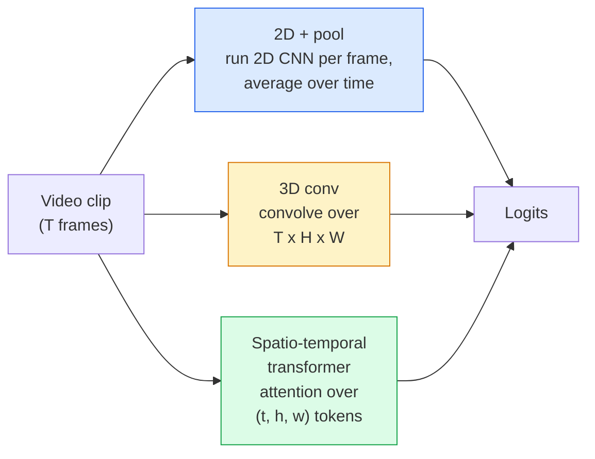

# Pemahaman Video — Pemodelan Temporal

> Video adalah rangkaian gambar ditambah fisika yang menghubungkannya. Setiap model video memperlakukan waktu sebagai sumbu tambahan (konv. 3D), urutan yang harus diperhatikan (Transformer), atau feature yang akan diekstraksi satu kali dan dikumpulkan (kumpulan 2D+).

**Type:** Learn + Build
**Language:** Python
**Prerequisites:** Fase 4 Lesson 03 (CNN), Fase 4 Lesson 04 (Klasifikasi Gambar)
**Waktu:** ~45 menit

## Tujuan Pembelajaran

- Membedakan tiga pendekatan pemodelan video utama (kumpulan 2D+, konv 3D, Transformer spatio-temporal) dan memprediksi trade-off biaya dan akurasinya
- Menerapkan pengambilan sample bingkai, pengumpulan temporal, dan pengklasifikasi dasar kumpulan 2D+ di PyTorch
- Jelaskan mengapa kernel 3D "yang digelembungkan" I3D dapat ditransfer dengan baik dari weight ImageNet dan apa yang dilakukan konv (2+1)D yang difaktorkan secara berbeda
- Baca dataset dan metrik pengenalan tindakan standar: Kinetics-400/600, UCF101, Something-Something V2; akurasi top-1 di tingkat klip dan video

## Masalah

Video berdurasi 30 detik pada 30 fps adalah 900 gambar. Secara naif, klasifikasi video adalah klasifikasi gambar yang dijalankan sebanyak 900 kali diikuti dengan semacam agregasi. Ini berfungsi ketika aksi terlihat di hampir setiap frame (olahraga, memasak, video latihan) dan gagal total ketika aksi ditentukan oleh gerakan itu sendiri: "mendorong sesuatu dari kiri ke kanan" tampak seperti dua benda diam di setiap frame.

Pertanyaan inti untuk setiap arsitektur video adalah: kapan struktur temporal dimodelkan, dan bagaimana caranya? Jawabannya menentukan segalanya — biaya komputasi, strategi pra-training, apakah kamu dapat menggunakan kembali weight ImageNet, dataset apa yang digunakan untuk melatih model.

Lesson ini sengaja dibuat lebih pendek dibandingkan lesson gambar statis. Mesin gambar inti sudah ada, dan pemahaman video sebagian besar berkaitan dengan cerita temporal: pengambilan sample, pemodelan, dan agregasi.

## Konsep

### Tiga keluarga arsitektur



### 2D + kolam

Ambil CNN 2D (ResNet, EfficientNet, ViT). Jalankan secara independen pada setiap frame sample. Rata-rata (atau kumpulan maksimal, atau kumpulan attention) embedding per bingkai. Masukkan vector yang dikumpulkan ke pengklasifikasi.

Kelebihan:
- Transfer pra-training ImageNet secara langsung.
- Paling sederhana untuk diterapkan.
- Murah: T frame * biaya inference gambar tunggal.

Kontra:
- Tidak dapat memodelkan gerakan. Tindakan = kumpulan penampilan.
- Pengumpulan temporal bersifat invarian pesanan; "buka pintu" dan "tutup pintu" terlihat sama.

Kapan menggunakan: tugas yang memerlukan banyak tampilan, mentransfer pembelajaran pada dataset video kecil, garis dasar awal.

### Konvolusi 3D

Ganti kernel 2D (H, W) dengan kernel 3D (T, H, W). Jaringan ini berbelit-belit dalam ruang dan waktu. Keluarga awal: C3D, I3D, SlowFast.

Trik I3D: ambil model ImageNet 2D yang telah dilatih sebelumnya, "mengembang" setiap kernel 2D dengan menyalinnya di sepanjang sumbu waktu baru. Konv. 2D 3x3 menjadi konv. 3D 3x3x3. Hal ini memberikan model 3D weight terlatih yang kuat dibandingkan berlatih dari awal.

Kelebihan:
- Memodelkan gerakan secara langsung.
- Inflasi I3D memberikan pembelajaran transfer gratis.

Kontra:
- T/8 FLOP lebih banyak daripada rekan 2D (untuk kernel temporal 3 ditumpuk 3 kali).
- Inti temporal berukuran kecil; gerak distance jauh memerlukan pendekatan piramida atau aliran ganda.

Kapan menggunakan: pengenalan tindakan di mana gerakan adalah sinyalnya (Sesuatu-Sesuatu V2, Kinetika dengan kelas-kelas yang banyak bergerak).

### Transformer spatio-temporal

Tokenisasikan video ke dalam petak petak ruang-waktu dan perhatikan semuanya. TimeSformer, ViViT, Video Berputar, VideoMAE.Pola attention yang penting:
- **Joint** — satu attention besar pada (t, h, w). Kuadrat di `T*H*W`; mahal.
- **Dibagi** — dua attention per blok: satu seiring waktu, satu lagi dalam ruang. Penskalaan linier.
- **Difaktorkan** — attention waktu bergantian dengan attention ruang di seluruh blok.

Kelebihan:
- Akurasi SOTA pada setiap benchmark utama.
- Transfer dari Transformer gambar (ViT) melalui inflasi patch.
- Mendukung video konteks panjang melalui attention yang jarang.

Kontra:
- Lapar berhitung.
- Membutuhkan pilihan pola attention yang cermat atau balon runtime.

Kapan digunakan: dataset besar, pemahaman video dengan fidelitas tinggi, tugas video+teks multi-modal.

### Pengambilan sample bingkai

Klip berdurasi 10 detik pada 30 fps adalah 300 frame; memberi makan semua 300 model ke model apa pun adalah pemborosan. Strategi standar:

- **Pengambilan sample seragam** — pilih bingkai T secara merata di seluruh klip. Default untuk kumpulan 2D+.
- **Pengambilan sample padat** — jendela bingkai-T acak yang berdekatan. Umum untuk konv. 3D karena gerakan memerlukan bingkai yang bersebelahan.
- **Multi-klip** — mengambil sample beberapa jendela T-frame dari video yang sama, mengklasifikasikan setiap jendela, prediksi rata-rata pada waktu pengujian.

T biasanya 8, 16, 32, atau 64. T lebih tinggi = lebih banyak sinyal temporal pada lebih banyak komputasi.

### Evaluasi

Dua tingkat:
- **Akurasi tingkat klip** — model melihat satu klip bingkai-T, lapor top-k.
- **Akurasi tingkat video** — rata-rata prediksi tingkat klip di beberapa klip per video; lebih tinggi dan lebih stabil.

Selalu laporkan keduanya. Model yang mendapat skor 78% klip / 82% video sangat bergantung pada rata-rata waktu pengujian; yang mendapat skor 80% / 81% lebih kuat per klipnya.

### Dataset yang akan kamu temui

- **Kinetics-400/600/700** — dataset tindakan tujuan umum. 400 ribu klip; URL YouTube (banyak yang sekarang mati).
- **Sesuatu-Sesuatu V2** — tindakan yang ditentukan gerakan ("memindahkan X dari kiri ke kanan"). Tidak dapat diselesaikan dengan kumpulan 2D+.
- **UCF-101**, **HMDB-51** — lebih tua, lebih kecil, masih dilaporkan.
- **AVA** — tindakan *lokalisasi* dalam ruang dan waktu; lebih sulit daripada klasifikasi.

## Build

### Langkah 1: Pengambil sample bingkai

Sampler seragam dan padat yang berfungsi pada daftar bingkai (atau tensor video).

```python
import numpy as np

def sample_uniform(num_frames_total, T):
    if num_frames_total <= T:
        return list(range(num_frames_total)) + [num_frames_total - 1] * (T - num_frames_total)
    step = num_frames_total / T
    return [int(i * step) for i in range(T)]


def sample_dense(num_frames_total, T, rng=None):
    rng = rng or np.random.default_rng()
    if num_frames_total <= T:
        return list(range(num_frames_total)) + [num_frames_total - 1] * (T - num_frames_total)
    start = int(rng.integers(0, num_frames_total - T + 1))
    return list(range(start, start + T))
```

Keduanya mengembalikan indeks `T` yang kamu gunakan untuk memotong tensor video.

### Langkah 2: Garis dasar kumpulan 2D+

Jalankan ResNet-18 2D pada setiap frame, feature kumpulan rata-rata, klasifikasi.

```python
import torch
import torch.nn as nn
from torchvision.models import resnet18, ResNet18_Weights

class FramePool(nn.Module):
    def __init__(self, num_classes=400, pretrained=True):
        super().__init__()
        weights = ResNet18_Weights.IMAGENET1K_V1 if pretrained else None
        backbone = resnet18(weights=weights)
        self.features = nn.Sequential(*(list(backbone.children())[:-1]))  # global avg pool kept
        self.head = nn.Linear(512, num_classes)

    def forward(self, x):
        # x: (N, T, 3, H, W)
        N, T = x.shape[:2]
        x = x.view(N * T, *x.shape[2:])
        feats = self.features(x).view(N, T, -1)
        pooled = feats.mean(dim=1)
        return self.head(pooled)

model = FramePool(num_classes=10)
x = torch.randn(2, 8, 3, 224, 224)
print(f"output: {model(x).shape}")
print(f"params: {sum(p.numel() for p in model.parameters()):,}")
```

Sebelas juta parameter, ImageNet telah dilatih sebelumnya, berjalan per frame, rata-rata, mengklasifikasikan. Garis dasar ini sering kali berada dalam distance 5-10 poin dari model 3D yang tepat pada tugas-tugas berpenampilan berat — terkadang lebih baik, karena menggunakan kembali tulang punggung ImageNet yang lebih kuat.

### Langkah 3: Konv. 3D yang ditingkatkan gaya I3D

Ubah satu konv. 2D menjadi konv. 3D dengan mengulangi weight di sepanjang sumbu waktu yang baru.

```python
def inflate_2d_to_3d(conv2d, time_kernel=3):
    out_c, in_c, kh, kw = conv2d.weight.shape
    weight_3d = conv2d.weight.data.unsqueeze(2)  # (out, in, 1, kh, kw)
    weight_3d = weight_3d.repeat(1, 1, time_kernel, 1, 1) / time_kernel
    conv3d = nn.Conv3d(in_c, out_c, kernel_size=(time_kernel, kh, kw),
                        padding=(time_kernel // 2, conv2d.padding[0], conv2d.padding[1]),
                        stride=(1, conv2d.stride[0], conv2d.stride[1]),
                        bias=False)
    conv3d.weight.data = weight_3d
    return conv3d

conv2d = nn.Conv2d(3, 64, kernel_size=3, padding=1, bias=False)
conv3d = inflate_2d_to_3d(conv2d, time_kernel=3)
print(f"2D weight shape:  {tuple(conv2d.weight.shape)}")
print(f"3D weight shape:  {tuple(conv3d.weight.shape)}")
x = torch.randn(1, 3, 8, 56, 56)
print(f"3D output shape:  {tuple(conv3d(x).shape)}")
```

Pembagian oleh `time_kernel` menjaga besaran activation tetap konstan — penting agar tidak melanggar statistik norm batch pada lintasan pertama.

### Langkah 4: Konv. Difaktorkan (2+1)D

Pisahkan konv. 3D menjadi konv. 2D (spasial) dan 1D (temporal). Bidang reseptif yang sama, parameter lebih sedikit, akurasi lebih baik pada beberapa tolok ukur.

```python
class Conv2Plus1D(nn.Module):
    def __init__(self, in_c, out_c, kernel_size=3):
        super().__init__()
        mid_c = (in_c * out_c * kernel_size * kernel_size * kernel_size) \
                // (in_c * kernel_size * kernel_size + out_c * kernel_size)
        self.spatial = nn.Conv3d(in_c, mid_c, kernel_size=(1, kernel_size, kernel_size),
                                 padding=(0, kernel_size // 2, kernel_size // 2), bias=False)
        self.bn = nn.BatchNorm3d(mid_c)
        self.act = nn.ReLU(inplace=True)
        self.temporal = nn.Conv3d(mid_c, out_c, kernel_size=(kernel_size, 1, 1),
                                  padding=(kernel_size // 2, 0, 0), bias=False)

    def forward(self, x):
        return self.temporal(self.act(self.bn(self.spatial(x))))

c = Conv2Plus1D(3, 64)
x = torch.randn(1, 3, 8, 56, 56)
print(f"(2+1)D output: {tuple(c(x).shape)}")
```

Jaringan R(2+1)D lengkap sama dengan ResNet-18 dengan setiap konv 3x3 diganti dengan `Conv2Plus1D`.

## Pakai

Dua perpustakaan meliput pekerjaan video produksi:

- `torchvision.models.video` — R(2+1)D, MViT, Swin3D dengan weight Kinetika yang telah dilatih sebelumnya. API yang sama dengan model gambar.
- `pytorchvideo` (Meta) — kebun binatang model, pemuat data untuk Kinetika / SSv2 / AVA, transformasi standar.Untuk model video Vision-Language (teks video, QA video), gunakan `transformers` (`VideoMAE`, `VideoLLaMA`, `InternVideo`).

## Kirim

Lesson ini menghasilkan:

- `outputs/prompt-video-architecture-picker.md` — prompt yang memilih kumpulan 2D+/I3D/(2+1)D/Transformer berdasarkan tampilan vs gerak, ukuran dataset, dan anggaran komputasi.
- `outputs/skill-frame-sampler-auditor.md` — keterampilan yang memeriksa sampler pipeline video dan menandai bug umum: indeks satu per satu, pengambilan sample tidak merata ketika `num_frames < T`, kurangnya pemotongan yang mempertahankan aspek, dll.

## Latihan

1. **(Mudah)** Hitung FLOP (perkiraan) untuk FramePool dengan T=8 vs ResNet 3D gaya I3D dengan T=8. Jelaskan mengapa kumpulan 2D+ 3-5x lebih murah.
2. **(Sedang)** Buat dataset video sintetis: bola acak bergerak ke arah acak, diberi label berdasarkan arah gerakan ("kiri-ke-kanan", "kanan-ke-kiri", "diagonal-atas"). Latih FramePool di atasnya. Tunjukkan bahwa ia mencapai akurasi yang hampir mendekati peluang, membuktikan bahwa penampilan saja tidak cukup untuk tugas gerak.
3. **(Sulit)** Build R(2+1)D-18 dengan mengganti setiap Konv2d di ResNet-18 dengan `Conv2Plus1D`. Meningkatkan weight konv pertama dari ResNet-18 yang telah dilatih sebelumnya oleh ImageNet. Latih dataset gerakan dari latihan 2 dan kalahkan FramePool.

## Istilah Kunci

| Istilah | Apa kata orang | Apa sebenarnya arti |
|------|----------------|----------------------|
| 2D + kolam | "Pengklasifikasi per bingkai" | Jalankan CNN 2D pada setiap frame sample, feature kumpulan rata-rata sepanjang waktu, klasifikasikan |
| Konvolusi 3D | "Kernel spatio-temporal" | Kernel yang berbelit-belit (T, H, W); dapat memodelkan gerak secara asli |
| Inflasi | "Angkat weight 2D ke 3D" | Inisialisasi weight konv 3D dengan mengulangi weight konv 2D di sepanjang sumbu waktu yang baru, lalu bagi dengan kernel_T untuk mempertahankan skala activation |
| (2+1)H | "Konv. yang difaktorkan" | Membagi 3D menjadi 2D spasial + 1D temporal; lebih sedikit parameter, ekstra non-linearitas antara |
| Attention terbagi | "Waktu lalu ruang" | Blok Transformer dengan dua attention per layer: satu di atas token pada bingkai yang sama, satu di atas token pada posisi yang sama |
| Klip | "Jendela bingkai-T" | Contoh berikutnya dari frame T; unit yang dikonsumsi model video |
| Akurasi klip vs video | "Dua pengaturan evaluasi" | Klip = satu sample per video, video = rata-rata di beberapa klip sample |
| Kinetika | "ImageNet video" | 400-700 kelas aksi, 300k+ klip YouTube, korpus video pra-training standar |

## Bacaan Lanjutan

- [I3D: Quo Vadis, Action Recognition (Carreira & Zisserman, 2017)](https://arxiv.org/abs/1705.07750) — memperkenalkan dataset inflasi dan Kinetika
- [R(2+1)D: Melihat Lebih Dekat Konvolusi Spatiotemporal (Tran et al., 2018)](https://arxiv.org/abs/1711.11248) — konvulasi terfaktor, masih merupakan dasar yang kuat
- [TimeSformer: Apakah Attention Ruang-Waktu Yang kamu Butuhkan? (Bertasius et al., 2021)](https://arxiv.org/abs/2102.05095) — Transformer video kuat pertama
- [VideoMAE (Tong et al., 2022)](https://arxiv.org/abs/2203.12602) — training awal autoencoder bertopeng untuk video; resep pra-training yang dominan saat ini
