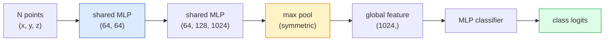

# Visi 3D — Awan Titik & NeRF

> Penglihatan 3D hadir dalam dua rasa. Point cloud adalah output mentah sensor. NeRF adalah bidang volumetrik yang dipelajari. Keduanya menjawab "di mana di luar angkasa".

**Type:** Learn + Build
**Language:** Python
**Prerequisites:** Fase 4 Lesson 03 (CNN), Fase 1 Lesson 12 (Operasi Tensor)
**Waktu:** ~45 menit

## Tujuan Pembelajaran

- Membedakan representasi 3D eksplisit (point cloud, mesh, voxel) dan implisit (signed distance field, NeRF) dan kapan masing-masing digunakan
- Memahami trik fungsi simetris PointNet yang membuat permutasi neural network menjadi invarian pada kumpulan titik yang tidak berurutan
- Melacak penerusan NeRF: pengecoran sinar, rendering volumetrik, pengkodean posisi, kepadatan MLP+kepala warna
- Gunakan `nerfstudio` atau `instant-ngp` untuk rekonstruksi 3D terlatih dari sekumpulan kecil gambar berpose

## Masalah

Kamera menghasilkan gambar 2D. LIDAR menghasilkan sekumpulan titik 3D tanpa urutan. Pipeline struktur-dari-gerak menghasilkan awan titik kunci 3D yang jarang. NeRF merekonstruksi seluruh adegan 3D dari beberapa gambar yang dipotret. Semua ini adalah "visi" tetapi tidak satupun yang terlihat seperti tensor padat yang diinginkan CNN.

Visi 3D penting karena hampir setiap tugas robot bernilai tinggi berjalan dalam 3D: menggenggam, menghindari rintangan, navigasi, oklusi AR, pengambilan konten 3D. Seorang insinyur visi yang hanya memahami gambar 2D tidak dapat terlibat dalam bidang yang tumbuh paling cepat (konten AR/VR, robotika, tumpukan penggerak otonom, rekonstruksi 3D berbasis NeRF untuk real estat atau konstruksi).

Kedua representasi tersebut mendominasi karena alasan yang berbeda. Point cloud adalah apa yang diberikan sensor kepada kamu secara gratis. NeRF dan penerusnya (3D Gaussian splatting, neural SDF) adalah apa yang kamu dapatkan saat meminta neural network untuk mempelajari suatu adegan.

## Konsep

### Titik awan

Point cloud adalah kumpulan N titik yang tidak berurutan di R^3, masing-masing opsional dengan feature (warna, intensitas, normal).

```
cloud = [
  (x1, y1, z1, r1, g1, b1),
  (x2, y2, z2, r2, g2, b2),
  ...
  (xN, yN, zN, rN, gN, bN),
]
```

Tidak ada jaringan, tidak ada konektivitas. Ada dua properti yang menyulitkan jaringan neural:

- **Invariansi permutasi** — output tidak boleh bergantung pada urutan titik.
- **Variabel N** — satu model harus menangani awan dengan ukuran berbeda.

PointNet (Qi et al., 2017) menyelesaikan keduanya dengan satu ide: menerapkan MLP bersama ke setiap titik, lalu menggabungkannya dengan fungsi simetris (kumpulan maks). Hasilnya adalah vector berukuran tetap yang tidak bergantung pada keteraturan.

```
f(P) = max_{p in P} MLP(p)
```

Ini adalah inti keseluruhan dari PointNet. Varian yang lebih dalam (PointNet++, Point Transformer) menambahkan pengambilan sample hierarki dan agregasi lokal tetapi trik fungsi simetrisnya tidak berubah.

### Arsitektur PointNet



"MLP Bersama" berarti MLP yang sama berjalan di setiap titik secara independen. Diimplementasikan sebagai konv 1x1 pada dimension titik untuk efisiensi.

### Bidang Cahaya Neural (NeRF)

NeRFs (Mildenhall dkk., 2020) menjawab pertanyaan "dapatkah kita merekonstruksi pemandangan 3D dari N foto?" dan dijawab dengan neural network itulah kejadiannya. Jaringan memetakan `(x, y, z, viewing_direction)` ke `(density, colour)`. Merender tampilan baru adalah perulangan transmisi sinar melalui jaringan ini.

```
NeRF MLP:  (x, y, z, theta, phi) -> (sigma, r, g, b)

To render a pixel (u, v) of a new view:
  1. Cast a ray from the camera through pixel (u, v)
  2. Sample points along the ray at distances t_1, t_2, ..., t_N
  3. Query the MLP at each point
  4. Composite the colours weighted by (1 - exp(-sigma * dt))
  5. The sum is the rendered pixel colour
```

Loss membandingkan piksel yang dirender dengan piksel kebenaran dasar dalam foto training. Backprop melalui langkah rendering memperbarui MLP. Tidak ada kebenaran dasar 3D, tidak ada geometri eksplisit — adegan disimpan dalam weight MLP.

### Pengkodean posisi di NeRFMLP vanilla di `(x, y, z)` tidak dapat merepresentasikan detail frekuensi tinggi karena MLP memiliki bias spektral terhadap frekuensi rendah. NeRF memperbaikinya dengan mengkodekan setiap koordinat ke dalam vector feature Fourier sebelum MLP:

```
gamma(p) = (sin(2^0 pi p), cos(2^0 pi p), sin(2^1 pi p), cos(2^1 pi p), ...)
```

Hingga L=10 tingkat frekuensi. Ini adalah trik yang sama yang digunakan Transformer untuk posisi, dan ini muncul lagi dalam pengondisian waktu difusi (Lesson 10). Tanpanya, NeRF terlihat buram.

### Render volumetrik

```
C(r) = sum_i T_i * (1 - exp(-sigma_i * delta_i)) * c_i

T_i  = exp(- sum_{j<i} sigma_j * delta_j)
delta_i = t_{i+1} - t_i
```

`T_i` adalah transmitansi — berapa banyak cahaya yang bertahan hingga titik i. `(1 - exp(-sigma_i * delta_i))` adalah opasitas pada titik i. `c_i` adalah warnanya. Piksel terakhir adalah jumlah tertimbang sepanjang sinar.

### Apa yang menggantikan NeRF

NeRF murni lambat untuk dilatih (jam) dan lambat untuk dirender (detik per gambar). Garis keturunan sejak:

- **Instant-NGP** (2022) — pengkodean hash-grid menggantikan input posisi MLP; kereta dalam hitungan detik.
- **Mip-NeRF 360** — menangani adegan tanpa batas dan anti-aliasing.
- **3D Gaussian Splatting** (2023) — menggantikan bidang volumetrik dengan jutaan Gaussian 3D; kereta dalam hitungan menit, ditampilkan secara real time. Default produksi saat ini.

Hampir setiap produk NeRF asli pada tahun 2026 sebenarnya adalah percikan Gaussian 3D. Model mentalnya masih NeRF.

### Dataset dan tolok ukur

- **ShapeNet** — klasifikasi dan segmentasi model CAD 3D sebagai point cloud.
- **ScanNet** — pemindaian dalam ruangan nyata untuk segmentasi.
- **KITTI** — awan titik LIDAR luar ruangan untuk mengemudi secara otonom.
- **NeRF Sintetis** / **MVS Campuran** — dataset gambar berpose untuk sintesis tampilan.
- **Dataset Mip-NeRF 360** — pemandangan nyata tanpa batas.

## Build

### Langkah 1: Pengklasifikasi PointNet

```python
import torch
import torch.nn as nn

class PointNet(nn.Module):
    def __init__(self, num_classes=10):
        super().__init__()
        self.mlp1 = nn.Sequential(
            nn.Conv1d(3, 64, 1),    nn.BatchNorm1d(64),   nn.ReLU(inplace=True),
            nn.Conv1d(64, 64, 1),   nn.BatchNorm1d(64),   nn.ReLU(inplace=True),
        )
        self.mlp2 = nn.Sequential(
            nn.Conv1d(64, 128, 1),  nn.BatchNorm1d(128),  nn.ReLU(inplace=True),
            nn.Conv1d(128, 1024, 1), nn.BatchNorm1d(1024), nn.ReLU(inplace=True),
        )
        self.head = nn.Sequential(
            nn.Linear(1024, 512),   nn.BatchNorm1d(512),  nn.ReLU(inplace=True),
            nn.Dropout(0.3),
            nn.Linear(512, 256),    nn.BatchNorm1d(256),  nn.ReLU(inplace=True),
            nn.Dropout(0.3),
            nn.Linear(256, num_classes),
        )

    def forward(self, x):
        # x: (N, 3, num_points) — transposed for Conv1d
        x = self.mlp1(x)
        x = self.mlp2(x)
        x = torch.max(x, dim=-1)[0]       # (N, 1024)
        return self.head(x)

pts = torch.randn(4, 3, 1024)
net = PointNet(num_classes=10)
print(f"output: {net(pts).shape}")
print(f"params: {sum(p.numel() for p in net.parameters()):,}")
```

Sekitar 1,6 juta parameter. Berjalan pada 1.024 poin per cloud.

### Langkah 2: Pengkodean posisi

```python
def positional_encoding(x, L=10):
    """
    x: (..., D) -> (..., D * 2 * L)
    """
    freqs = 2.0 ** torch.arange(L, dtype=x.dtype, device=x.device)
    args = x.unsqueeze(-1) * freqs * 3.141592653589793
    sinc = torch.cat([args.sin(), args.cos()], dim=-1)
    return sinc.reshape(*x.shape[:-1], -1)

x = torch.randn(5, 3)
y = positional_encoding(x, L=10)
print(f"input:  {x.shape}")
print(f"encoded: {y.shape}     # (5, 60)")
```

Mengalikannya dengan `2^l * pi` menghasilkan frekuensi yang semakin tinggi.

### Langkah 3: MLP NeRF Kecil

```python
class TinyNeRF(nn.Module):
    def __init__(self, L_pos=10, L_dir=4, hidden=128):
        super().__init__()
        self.L_pos = L_pos
        self.L_dir = L_dir
        pos_dim = 3 * 2 * L_pos
        dir_dim = 3 * 2 * L_dir
        self.trunk = nn.Sequential(
            nn.Linear(pos_dim, hidden), nn.ReLU(inplace=True),
            nn.Linear(hidden, hidden),  nn.ReLU(inplace=True),
            nn.Linear(hidden, hidden),  nn.ReLU(inplace=True),
            nn.Linear(hidden, hidden),  nn.ReLU(inplace=True),
        )
        self.sigma = nn.Linear(hidden, 1)
        self.color = nn.Sequential(
            nn.Linear(hidden + dir_dim, hidden // 2), nn.ReLU(inplace=True),
            nn.Linear(hidden // 2, 3), nn.Sigmoid(),
        )

    def forward(self, x, d):
        x_enc = positional_encoding(x, self.L_pos)
        d_enc = positional_encoding(d, self.L_dir)
        h = self.trunk(x_enc)
        sigma = torch.relu(self.sigma(h)).squeeze(-1)
        rgb = self.color(torch.cat([h, d_enc], dim=-1))
        return sigma, rgb

nerf = TinyNeRF()
x = torch.randn(128, 3)
d = torch.randn(128, 3)
s, c = nerf(x, d)
print(f"sigma: {s.shape}   rgb: {c.shape}")
```

Kecil dibandingkan NeRF asli (yang memiliki 2 batang MLP dengan kedalaman 8). Cukup untuk menunjukkan arsitekturnya.

### Langkah 4: Render volumetrik sepanjang sinar

```python
def volumetric_render(sigma, rgb, t_vals):
    """
    sigma: (..., N_samples)
    rgb:   (..., N_samples, 3)
    t_vals: (N_samples,) distances along the ray
    """
    delta = torch.cat([t_vals[1:] - t_vals[:-1], torch.full_like(t_vals[:1], 1e10)])
    alpha = 1.0 - torch.exp(-sigma * delta)
    trans = torch.cumprod(torch.cat([torch.ones_like(alpha[..., :1]), 1.0 - alpha + 1e-10], dim=-1), dim=-1)[..., :-1]
    weights = alpha * trans
    rendered = (weights.unsqueeze(-1) * rgb).sum(dim=-2)
    depth = (weights * t_vals).sum(dim=-1)
    return rendered, depth, weights


N = 64
t_vals = torch.linspace(2.0, 6.0, N)
sigma = torch.rand(N) * 0.5
rgb = torch.rand(N, 3)
rendered, depth, weights = volumetric_render(sigma, rgb, t_vals)
print(f"rendered colour: {rendered.tolist()}")
print(f"depth:           {depth.item():.2f}")
```

Satu sinar, 64 sample, digabungkan menjadi satu piksel RGB dan kedalaman.

## Pakai

Untuk pekerjaan nyata:

- `nerfstudio` (Tancik dkk.) — perpustakaan referensi terkini untuk NeRF / Instant-NGP / Gaussian Splatting. Baris prompt plus penampil web.
- `pytorch3d` (Meta) — rendering yang dapat dibedakan, utilitas point-cloud, operasi mesh.
- `open3d` — pemrosesan titik cloud, registrasi, visualisasi.

Untuk penerapannya, splatting Gaussian 3D sebagian besar telah menggantikan NeRF murni karena menghasilkan 100x lebih cepat. Kualitas rekonstruksi sebanding.

## Kirim

Lesson ini menghasilkan:

- `outputs/prompt-3d-task-router.md` — prompt yang merutekan ke representasi 3D yang tepat (point cloud, mesh, voxel, NeRF, Gaussian splat) berdasarkan tugas dan data input.
- `outputs/skill-point-cloud-loader.md` — keterampilan yang menulis PyTorch `Dataset` untuk file .ply / .pcd / .xyz dengan normalisasi, pemusatan, dan pengambilan sample titik yang benar.

## Latihan1. **(Mudah)** Tunjukkan bahwa PointNet bersifat invarian permutasi: jalankan cloud yang sama sebanyak dua kali, sekali dengan titik diacak. Pastikan keluarannya identik hingga derau floating-point.
2. **(Medium)** Menerapkan fungsi pembangkitan sinar minimal yang, dengan mempertimbangkan intrinsik dan pose kamera, menghasilkan asal dan arah sinar untuk setiap piksel gambar berukuran H x W.
3. **(Hard)** Latih TinyNeRF pada dataset sintetik dari tampilan kubus berwarna yang dirender (dihasilkan melalui rendering terdiferensiasi atau pelacak sinar sederhana). Laporkan kehilangan rendering pada periode 1, 10, dan 100. Pada periode berapa model menghasilkan tampilan yang dapat dikenali?

## Istilah Kunci

| Istilah | Apa kata orang | Apa sebenarnya arti |
|------|----------------|----------------------|
| Titik awan | "Poin 3D dari LIDAR" | Kumpulan tak berurutan (x, y, z) + feature opsional per titik |
| TitikNet | "Jaringan saraf pertama di titik awan" | MLP bersama per poin + kumpulan simetris (maks); permutasi-invarian berdasarkan konstruksi |
| NeRF | "MLP itulah adegannya" | Pemetaan jaringan (x, y, z, dir) ke (densitas, warna); diberikan oleh pengecoran sinar |
| Pengkodean posisi | "Feature Fourier" | Enkode setiap koordinat menjadi sin/cos pada beberapa frekuensi untuk mengatasi bias frekuensi rendah MLP |
| Render volumetrik | "Integrasi sinar" | Sample komposit sepanjang sinar menjadi satu piksel menggunakan transmitansi dan alpha |
| NGP Instan | "NeRF jaringan hash" | Menggantikan MLP koordinat NeRF dengan jaringan hash multi-resolusi; 100-1000x lebih cepat |
| Percikan Gaussian 3D | "Jutaan Gaussian" | Adegan = kumpulan Gaussians 3D; render secara real time, berlatih dalam hitungan menit |
| SDF | "Bidang distance bertanda tangan" | Fungsi mengembalikan distance bertanda ke permukaan terdekat; representasi implisit lainnya |

## Bacaan Lanjutan

- [PointNet (Qi et al., 2017)](https://arxiv.org/abs/1612.00593) — pengklasifikasi invarian permutasi
- [NeRF (Mildenhall et al., 2020)](https://arxiv.org/abs/2003.08934) — makalah yang menjadikan rekonstruksi 3D dari foto sebagai masalah neural network
- [Instant-NGP (Müller et al., 2022)](https://arxiv.org/abs/2201.05989) — jaringan hash, percepatan 1000x
- [3D Gaussian Splatting (Kerbl et al., 2023)](https://arxiv.org/abs/2308.04079) — arsitektur yang menggantikan NeRF dalam produksi
