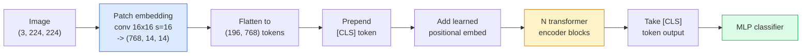

# Transformer Visi (ViT)

> Potong gambar menjadi beberapa tambalan, perlakukan setiap tambalan sebagai sebuah kata, jalankan trafo standar. Jangan melihat ke belakang.

**Type:** Build
**Language:** Python
**Prerequisites:** Phase 7 Lesson 02 (Attention Diri), Phase 4 Lesson 04 (Klasifikasi Gambar)
**Waktu:** ~45 menit

## Tujuan Pembelajaran

- Mengimplementasikan embedding patch, mempelajari embedding posisi, token kelas, dan blok encoder Transformer dari awal untuk membangun ViT minimal
- Jelaskan mengapa ViT dianggap memerlukan data pra-training dalam jumlah besar hingga DeiT dan MAE membuktikan sebaliknya
- Bandingkan ViT, Swin, dan ConvNeXt pada arsitektur sebelumnya (tidak ada, attention jendela lokal, tulang punggung konv)
- Sempurnakan ViT yang telah dilatih sebelumnya pada dataset kecil menggunakan `timm` dan resep linear-probe / fine-tune standar

## Masalah

Selama satu dekade, konvolusi identik dengan visi komputer. CNN memiliki bias induktif yang kuat - lokalitas, kesetaraan terjemahan - yang tidak terpikirkan oleh siapa pun dapat digantikan. Kemudian Dosovitskiy dkk. (2020) menunjukkan bahwa trafo biasa yang diterapkan pada patch gambar yang diratakan, tanpa mesin konvolusional sama sekali, dapat menyamai atau mengalahkan CNN terbaik dalam skala besar.

Hasil tangkapannya "dalam skala besar". ViT di ImageNet-1k kalah dari ResNet. ViT dilatih sebelumnya pada ImageNet-21k atau JFT-300M kemudian disempurnakan pada ImageNet-1k untuk mengalahkannya. Kesimpulannya adalah bahwa Transformer tidak mempunyai prior yang berguna namun dapat mempelajarinya dari data yang cukup. Pekerjaan selanjutnya (DeiT, MAE, DINO) menunjukkan bahwa dengan resep training yang tepat — augmentasi yang kuat, pra-training yang diawasi sendiri, distilasi — ViT juga berlatih dengan baik pada data kecil.

Pada tahun 2026, CNN murni masih kompetitif di perangkat edge (ConvNeXt adalah yang terkuat), tetapi Transformer mendominasi segalanya: segmentasi (Mask2Former, SegFormer), deteksi (DETR, RT-DETR), multimodal (CLIP, SigLIP), video (VideoMAE, VJEPA). Struktur blok ViT adalah yang perlu diketahui.

## Konsep

### Pipeline pipa



Tujuh langkah. Tambalan -> token -> attention -> pengklasifikasi. Setiap varian (pra-training DeiT, Swin, ConvNeXt, MAE) mengubah satu atau dua dari tujuh varian dan membiarkan sisanya.

### Embedding tambalan

Konv. pertama adalah rahasianya. Ukuran kernel 16, langkah 16, sehingga gambar 224x224 menjadi kisi 14x14 berisi patch 16x16, masing-masing diproyeksikan ke embedding 768 redup. Konversi tunggal tersebut melakukan patchifikasi dan memproyeksikan secara linier.

```
Input:  (3, 224, 224)
Conv (3 -> 768, k=16, s=16, no padding):
Output: (768, 14, 14)
Flatten spatial: (196, 768)
```

196 patch = 196 token. Dimension feature setiap token adalah 768 (ViT-B), 1024 (ViT-L), atau 1280 (ViT-H).

### Token kelas

Satu vector yang dipelajari ditambahkan ke urutan:

```
tokens = [CLS; patch_1; patch_2; ...; patch_196]   shape (197, 768)
```

Setelah N blok Transformer, output `[CLS]` adalah representasi gambar global. Kepala klasifikasi hanya membaca satu vector ini.

### Embedding posisi

Transformer tidak memiliki gagasan bawaan tentang posisi spasial. Tambahkan vector yang dipelajari ke setiap token:

```
tokens = tokens + learned_pos_embedding   (also shape (197, 768))
```

Embedding adalah parameter model; training berbasis gradient menyesuaikannya dengan struktur gambar 2D. Alternatif 2D sinusoidal ada tetapi jarang digunakan dalam praktik.

### Blok encoder Transformer

Standar. Attention mandiri multi-kepala, MLP, koneksi sisa, pra-LayerNorm.

```
x = x + MSA(LN(x))
x = x + MLP(LN(x))

MLP is two-layer with GELU: Linear(d -> 4d) -> GELU -> Linear(4d -> d)
```

ViT-B/16 menumpuk 12 blok ini, masing-masing dengan 12 attention head, dengan total 86 juta parameter.

### Mengapa pra-LN

Transformer awal menggunakan pasca-LN (`x = LN(x + sublayer(x))`) dan kesulitan untuk berlatih melewati 6-8 layer tanpa pemanasan. Pra-LN (`x = x + sublayer(LN(x))`) melatih jaringan yang lebih dalam secara stabil tanpa pemanasan. Setiap ViT dan setiap LLM modern menggunakan pra-LN.### Pengorbanan ukuran patch

- Patch 16x16 -> 196 token, standar.
- Patch 32x32 -> 49 token, lebih cepat tetapi resolusi lebih rendah.
- Patch 8x8 -> 784 token, lebih halus tetapi biaya attention O(n^2) berskala buruk.

Tambalan yang lebih besar = lebih sedikit token = lebih cepat tetapi detail spasialnya lebih sedikit. SwinV2 menggunakan patch 4x4 di jendela hierarki.

### Resep DeiT untuk melatih ViT di ImageNet-1k

ViT asli membutuhkan JFT-300M untuk mengalahkan CNN. DeiT (Touvron et al., 2020) melatih ViT-B hingga 81,8% top-1 di ImageNet-1k saja dengan empat perubahan:

1. Augmentasi berat: RandAugment, Mixup, CutMix, Random Erasing.
2. Kedalaman stokastik (jatuhkan seluruh blok secara acak selama training).
3. Augmentasi berulang (gambar yang sama diambil sampelnya 3 kali per batch).
4. Penyulingan dari guru CNN (opsional, meningkatkan akurasi lebih jauh).

Setiap resep training ViT modern berasal dari DeiT.

### Mengayun vs KonvNeXt

- **Swin** (Liu et al., 2021) — attention berbasis jendela. Setiap blok hadir dalam jendela lokal; blok bergantian menggeser jendela untuk mencampur informasi di seluruh jendela. Menghadirkan kembali lokalitas mirip CNN sambil tetap menjaga attention operator.
- **ConvNeXt** (Liu dkk., 2022) — CNN didesain ulang agar sesuai dengan pilihan arsitektur Swin (konvs mendalam, LayerNorm, GELU, hambatan terbalik). Menunjukkan bahwa kesenjangannya bukanlah "attention vs konvolusi" tetapi "resep training modern + arsitektur".

Pada tahun 2026, ConvNeXt-V2 dan Swin-V2 keduanya merupakan kelas produksi; pilihan yang tepat bergantung pada tumpukan inference kamu (ConvNeXt mengkompilasi lebih baik untuk edge) dan korpus pra-training.

### Pra-training MAE

Autoencoder Bertopeng (He dkk., 2022): menutupi 75% patch secara acak, melatih encoder untuk memproses hanya 25% yang terlihat, melatih decoder kecil untuk merekonstruksi patch bertopeng dari output encoder. Setelah pra-training, buang decoder dan sempurnakan encoder.

MAE membuat ViT dapat dilatih di ImageNet-1k saja, mencapai SOTA, dan merupakan resep default yang diawasi sendiri saat ini.

## Build

### Langkah 1: Embedding patch

```python
import torch
import torch.nn as nn

class PatchEmbedding(nn.Module):
    def __init__(self, in_channels=3, patch_size=16, dim=192, image_size=64):
        super().__init__()
        assert image_size % patch_size == 0
        self.proj = nn.Conv2d(in_channels, dim, kernel_size=patch_size, stride=patch_size)
        num_patches = (image_size // patch_size) ** 2
        self.num_patches = num_patches

    def forward(self, x):
        x = self.proj(x)
        return x.flatten(2).transpose(1, 2)
```

Satu konv, satu rata, satu transpos. Itu adalah keseluruhan langkah gambar-ke-token.

### Langkah 2: Blok Transformer

Pra-LN, attention mandiri multi-kepala, MLP dengan GELU, koneksi sisa.

```python
class Block(nn.Module):
    def __init__(self, dim, num_heads, mlp_ratio=4, dropout=0.0):
        super().__init__()
        self.ln1 = nn.LayerNorm(dim)
        self.attn = nn.MultiheadAttention(dim, num_heads, dropout=dropout, batch_first=True)
        self.ln2 = nn.LayerNorm(dim)
        self.mlp = nn.Sequential(
            nn.Linear(dim, dim * mlp_ratio),
            nn.GELU(),
            nn.Dropout(dropout),
            nn.Linear(dim * mlp_ratio, dim),
            nn.Dropout(dropout),
        )

    def forward(self, x):
        a, _ = self.attn(self.ln1(x), self.ln1(x), self.ln1(x), need_weights=False)
        x = x + a
        x = x + self.mlp(self.ln2(x))
        return x
```

`nn.MultiheadAttention` menangani pemisahan menjadi kepala, produk titik berskala, dan proyeksi output. `batch_first=True` jadi bentuknya `(N, seq, dim)`.

### Langkah 3: ViT

```python
class ViT(nn.Module):
    def __init__(self, image_size=64, patch_size=16, in_channels=3,
                 num_classes=10, dim=192, depth=6, num_heads=3, mlp_ratio=4):
        super().__init__()
        self.patch = PatchEmbedding(in_channels, patch_size, dim, image_size)
        num_patches = self.patch.num_patches
        self.cls_token = nn.Parameter(torch.zeros(1, 1, dim))
        self.pos_embed = nn.Parameter(torch.zeros(1, num_patches + 1, dim))
        self.blocks = nn.ModuleList([
            Block(dim, num_heads, mlp_ratio) for _ in range(depth)
        ])
        self.ln = nn.LayerNorm(dim)
        self.head = nn.Linear(dim, num_classes)
        nn.init.trunc_normal_(self.pos_embed, std=0.02)
        nn.init.trunc_normal_(self.cls_token, std=0.02)

    def forward(self, x):
        x = self.patch(x)
        cls = self.cls_token.expand(x.size(0), -1, -1)
        x = torch.cat([cls, x], dim=1)
        x = x + self.pos_embed
        for blk in self.blocks:
            x = blk(x)
        x = self.ln(x[:, 0])
        return self.head(x)

vit = ViT(image_size=64, patch_size=16, num_classes=10, dim=192, depth=6, num_heads=3)
x = torch.randn(2, 3, 64, 64)
print(f"output: {vit(x).shape}")
print(f"params: {sum(p.numel() for p in vit.parameters()):,}")
```

Sekitar 2,8 juta parameter — ViT kecil yang dapat diatur pada CPU. ViT-B nyata adalah 86 juta; definisi kelas yang sama dengan `dim=768, depth=12, num_heads=12`.

### Langkah 4: Pemeriksaan kewarasan — inference gambar tunggal

```python
logits = vit(torch.randn(1, 3, 64, 64))
print(f"logits: {logits}")
print(f"probs:  {logits.softmax(-1)}")
```

Harus berjalan tanpa kesalahan. Probabilitas berjumlah 1.

## Pakai

`timm` mengirimkan setiap varian ViT dengan weight yang telah dilatih sebelumnya oleh ImageNet. Satu baris:

```python
import timm

model = timm.create_model("vit_base_patch16_224", pretrained=True, num_classes=10)
```

`timm` adalah default produksi untuk vision Transformer pada tahun 2026. Mendukung ViT, DeiT, Swin, Swin-V2, ConvNeXt, ConvNeXt-V2, MaxViT, MViT, EfficientFormer, dan lusinan lainnya dalam API yang sama.

Untuk pekerjaan multi-modal (gambar + teks), `transformers` mengirimkan CLIP, SigLIP, BLIP-2, LLaVA. Encoder gambar pada semua itu adalah varian ViT.

## Kirim

Lesson ini menghasilkan:- `outputs/prompt-vit-vs-cnn-picker.md` — prompt yang memilih antara ViT, ConvNeXt, atau Swin berdasarkan ukuran dataset, komputasi, dan tumpukan inference.
- `outputs/skill-vit-patch-and-pos-embed-inspector.md` — keterampilan yang memverifikasi embedding patch ViT dan bentuk embedding posisi sesuai dengan panjang urutan yang diharapkan dari model, menangkap bug porting yang paling umum.

## Latihan

1. **(Mudah)** Cetak bentuk setiap tensor perantara untuk meneruskan ViT kecil di atas. Konfirmasi: input `(N, 3, 64, 64)` -> patch `(N, 16, 192)` -> dengan CLS `(N, 17, 192)` -> input pengklasifikasi `(N, 192)` -> output `(N, num_classes)`.
2. **(Medium)** Menyempurnakan `timm` ViT-S/16 yang telah dilatih sebelumnya pada dataset CIFAR sintetik dari Lesson 4. Bandingkan dengan penyempurnaan ResNet-18 pada data yang sama. Laporkan waktu training dan akurasi akhir.
3. **(Sulit)** Terapkan pra-training MAE untuk ViT kecil: tutupi 75% patch, latih encoder + decoder kecil untuk merekonstruksi patch yang di-mask. Evaluasi akurasi pemeriksaan linier pada data sintetik sebelum dan sesudah prapelatihan.

## Istilah Kunci

| Istilah | Apa kata orang | Apa sebenarnya arti |
|------|----------------|----------------------|
| Embedding tambalan | "Konversi pertama" | Sebuah konv dengan ukuran kernel = langkah = ukuran patch; mengubah gambar menjadi kisi-kisi embedding token |
| Token kelas | "[CLS]" | Vector yang dipelajari ditambahkan ke urutan token; output akhirnya adalah representasi gambar global |
| Embedding posisi | "Pos yang dipelajari" | Vector yang dipelajari ditambahkan ke setiap token sehingga Transformer mengetahui dari mana setiap patch berasal |
| Pra-LN | "LayerNorm sebelum sublayer" | Varian trafo stabil: `x + sublayer(LN(x))` bukannya `LN(x + sublayer(x))` |
| Attention multi-kepala | "Attention paralel" | Attention trafo standar dibagi menjadi subruang independen num_heads, digabungkan setelahnya |
| ViT-B/16 | "Dasar, tambalan 16" | Ukuran kanonik: redup=768, kedalaman=12, kepala=12, ukuran_patch=16, gambar=224; ~86 juta parameter |
| Dewa | "ViT hemat data" | ViT dilatih di ImageNet-1k saja dengan augmentasi yang kuat; terbukti dataset prapelatihan yang besar tidak sepenuhnya diperlukan |
| MAE | "Autoencoder bertopeng" | Pra-training yang diawasi sendiri: menutupi 75% tambalan, merekonstruksi; resep pra-training ViT yang dominan |

## Bacaan Lanjutan

- [Sebuah Gambar Bernilai 16x16 Kata (Dosovitskiy et al., 2020)](https://arxiv.org/abs/2010.11929) — makalah ViT
- [DeiT: Transformer Gambar Hemat Data (Touvron et al., 2020)](https://arxiv.org/abs/2012.12877) — cara melatih ViT di ImageNet-1k saja
- [Autoencoder Bertopeng adalah Pembelajar Visi yang Dapat Diskalakan (He dkk., 2022)](https://arxiv.org/abs/2111.06377) — Pra-training MAE
- [dokumentasi timm](https://huggingface.co/docs/timm) — referensi untuk setiap Transformer visi yang akan kamu gunakan dalam produksi
