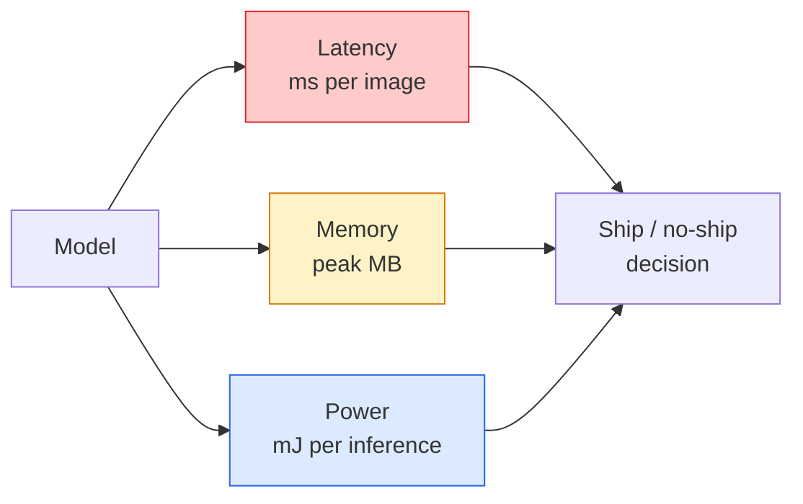

# Visi Real-Time — Penerapan Edge

> Inference tepi adalah disiplin untuk menjalankan model dengan akurasi 90 pada 30 fps pada perangkat dengan RAM 2 GB. Setiap poin persentase akurasi diperdagangkan dengan latensi milidetik.

**Type:** Learn + Build
**Language:** Python
**Prerequisites:** Phase 4 Lesson 04 (Klasifikasi Gambar), Phase 10 Lesson 11 (Kuantisasi)
**Waktu:** ~75 menit

## Tujuan Pembelajaran

- Ukur latensi inference, memori puncak, dan throughput untuk model PyTorch apa pun, dan baca trade-off FLOP / params / latensi
- Mengkuantisasi model visi ke INT8 menggunakan kuantisasi pasca-training PyTorch dan memverifikasi kehilangan akurasi <1%
- Ekspor ke ONNX dan kompilasi dengan ONNX Runtime atau TensorRT; sebutkan tiga kegagalan ekspor yang paling umum dan perbaikannya
- Jelaskan kapan harus memilih MobileNetV3, EfficientNet-Lite, ConvNeXt-Tiny, atau MobileViT untuk batasan edge

## Masalah

Model visi waktu training adalah monster floating-point. Parameter 100M, 10 GFLOP per forward pass, VRAM 2 GB. Tidak ada satupun yang cocok untuk ponsel, unit infotainment mobil, kamera industri, atau drone. Mewujudkan sistem visi berarti memasukkan prediksi yang sama ke dalam anggaran yang 100x lebih kecil.

Tiga kenop melakukan sebagian besar pekerjaan: pilihan model (arsitektur yang lebih kecil dengan resep yang sama), kuantisasi (INT8, bukan FP32), dan runtime inference (ONNX Runtime, TensorRT, Core ML, TFLite). Melakukannya dengan benar adalah perbedaan antara demo yang dijalankan di stasiun kerja dan produk yang dikirimkan dengan modul kamera seharga $30.

Lesson ini mengatur disiplin pengukuran terlebih dahulu (kamu tidak dapat mengoptimalkan apa yang tidak dapat kamu ukur), kemudian menjalankan ketiga tombol tersebut. Tujuannya bukan untuk mempelajari setiap edge runtime tetapi untuk mengetahui tuas apa saja yang ada dan bagaimana memverifikasi bahwa masing-masing tuas tersebut sesuai dengan apa yang kamu pikirkan.

## Konsep

### Tiga anggaran



- **Latensi**: p50, p95, p99. Rata-rata hanya p50 yang menyembunyikan perilaku ekor yang penting untuk sistem waktu nyata.
- **Memori puncak**: memori maksimum yang pernah dilihat perangkat, bukan rata-rata kondisi stabil. Penting karena OOM berakibat fatal pada target yang tertanam.
- **Daya / energi**: milijoule per inference pada perangkat bertenaga baterai. Sering diproksikan dengan waktu penggunaan CPU/GPU.

Tabel (model, latensi, memori, akurasi) merupakan bahan dasar pengambilan keputusan edge. Setiap sel diukur pada perangkat target, bukan pada stasiun kerja.

### Disiplin pengukuran

Tiga aturan yang harus diikuti oleh setiap profil tepi:

1. **Pemanasan** model dengan 5-10 gerakan boneka ke depan sebelum melakukan pengukuran. Cold cache dan kompilasi JIT menghasilkan angka pertama yang tidak representatif.
2. **Sinkronisasi** weight kerja GPU dengan `torch.cuda.synchronize()` sebelum dan sesudah blok waktunya. Tanpa ini kamu mengukur pengiriman kernel, bukan eksekusi kernel.
3. **Perbaiki ukuran input** ke resolusi produksi. Latensi pada 224x224 bukanlah latensi pada 512x512.

### FLOP sebagai proxy

FLOPs (operasi floating-point per inference) adalah proksi yang murah dan tidak bergantung pada perangkat untuk latensi. Berguna untuk perbandingan arsitektur, menyesatkan seperti jam dinding mutlak. Model dengan FLOP 10% lebih banyak dapat menjadi 2x lebih cepat dalam praktiknya karena menggunakan operasi yang ramah perangkat keras (konvs mendalam dikompilasi dengan baik, konvs 7x7 besar tidak).

Aturan: gunakan FLOP untuk pencarian arsitektur, gunakan latensi pada perangkat untuk keputusan penerapan.

### Kuantisasi dalam satu paragrafGanti weight dan activation FP32 dengan INT8. Ukuran model turun 4x, bandwidth memori turun 4x, komputasi turun 2-4x pada perangkat keras yang memiliki kernel INT8 (setiap SoC seluler modern, setiap GPU NVIDIA dengan Tensor Cores). Hilangnya akurasi pada tugas penglihatan biasanya 0,1-1 poin persentase dengan kuantisasi statis pasca-training.

Jenis:

- **Dinamis** — mengkuantisasi weight ke INT8, activation dihitung dalam FP. Mudah, percepatan kecil.
- **Statis (pasca training)** — mengkuantisasi weight + rentang activation kalibrasi pada set kalibrasi kecil. Jauh lebih cepat daripada dinamis.
- **Training sadar kuantisasi (QAT)** — menyimulasikan kuantisasi selama training sehingga model dapat mempelajarinya. Akurasi terbaik, memerlukan data berlabel.

Untuk penglihatan, kuantisasi statis pasca training memberikan 95% manfaat dengan 5% upaya. Gunakan QAT hanya jika kehilangan akurasi akibat PTQ tidak dapat diterima.

### Pemangkasan dan penyulingan

- **Pemangkasan** — menghilangkan weight yang tidak penting (berdasarkan besaran) atau pipeline (terstruktur). Berfungsi dengan baik pada model yang memiliki parameter berlebihan; kurang berguna pada arsitektur yang sudah kompak.
- **Distilasi** — melatih siswa kecil untuk meniru logit guru besar. Seringkali memulihkan sebagian besar akurasi yang hilang karena menyusutkan model. Standar untuk model edge produksi.

### Waktu proses inference

- **PyTorch bersemangat** — lambat, tidak untuk penerapan. Gunakan untuk pengembangan saja.
- **TorchScript** — warisan. Digantikan oleh `torch.compile` dan ekspor ONNX.
- **Waktu Proses ONNX** — waktu proses netral. CPU, CUDA, CoreML, TensorRT, OpenVINO semuanya memiliki penyedia ONNX. Mulai di sini.
- **TensorRT** — kompiler NVIDIA. Latensi terbaik pada GPU NVIDIA (workstation dan Jetson). Terintegrasi dengan ONNX Runtime atau mandiri.
- **Core ML** — Waktu proses Apple untuk iOS/macOS. Membutuhkan `.mlmodel` atau `.mlpackage`.
- **TFLite** — Waktu proses Google untuk Android/ARM. Kebutuhan `.tflite`.
- **OpenVINO** — Waktu proses Intel untuk CPU/VPU. Kebutuhan `.xml` + `.bin`.

Dalam praktiknya: ekspor PyTorch -> ONNX -> pilih runtime untuk target. ONNX adalah bahasa pergaulan.

### Pemilih arsitektur tepi

| Anggaran | Model | Mengapa |
|--------|-------|-----|
| < 3M parameter | MobileNetV3-Kecil | Kompilasi di mana saja, dasar yang bagus |
| 3-10M | EfisienNet-Lite-B0 | Akurasi terbaik per parameter di TFLite |
| 10-20M | KonvNeXt-Tiny | Akurasi per param terbaik, ramah CPU |
| 20-30M | MobileViT-S atau EfficientViT | Transformer dengan akurasi ImageNet |
| 30-80M | Swin-V2-Kecil | Jika tumpukan mendukung attention jendela |

Kuantifikasi semua ini ke INT8 kecuali kamu memiliki alasan khusus untuk tidak melakukannya.

## Build

### Langkah 1: Ukur latensi dengan benar

```python
import time
import torch

def measure_latency(model, input_shape, device="cpu", warmup=10, iters=50):
    model = model.to(device).eval()
    x = torch.randn(input_shape, device=device)
    with torch.no_grad():
        for _ in range(warmup):
            model(x)
        if device == "cuda":
            torch.cuda.synchronize()
        times = []
        for _ in range(iters):
            if device == "cuda":
                torch.cuda.synchronize()
            t0 = time.perf_counter()
            model(x)
            if device == "cuda":
                torch.cuda.synchronize()
            times.append((time.perf_counter() - t0) * 1000)
    times.sort()
    return {
        "p50_ms": times[len(times) // 2],
        "p95_ms": times[int(len(times) * 0.95)],
        "p99_ms": times[int(len(times) * 0.99)],
        "mean_ms": sum(times) / len(times),
    }
```

Lakukan pemanasan, sinkronisasi, gunakan `time.perf_counter()`. Laporkan persentil, bukan sekadar mean.

### Langkah 2: Jumlah parameter dan FLOP

```python
def parameter_count(model):
    return sum(p.numel() for p in model.parameters())

def flops_estimate(model, input_shape):
    """
    Rough FLOP count for a conv/linear-only model. For production use `fvcore` or `ptflops`.
    """
    total = 0
    def conv_hook(m, inp, out):
        nonlocal total
        c_out, c_in, kh, kw = m.weight.shape
        h, w = out.shape[-2:]
        total += 2 * c_in * c_out * kh * kw * h * w
    def linear_hook(m, inp, out):
        nonlocal total
        total += 2 * m.in_features * m.out_features
    hooks = []
    for m in model.modules():
        if isinstance(m, torch.nn.Conv2d):
            hooks.append(m.register_forward_hook(conv_hook))
        elif isinstance(m, torch.nn.Linear):
            hooks.append(m.register_forward_hook(linear_hook))
    model.eval()
    with torch.no_grad():
        model(torch.randn(input_shape))
    for h in hooks:
        h.remove()
    return total
```

Untuk proyek nyata gunakan `fvcore.nn.FlopCountAnalysis` atau `ptflops`; mereka menangani setiap jenis modul dengan benar.

### Langkah 3: Kuantisasi statis pasca training

```python
def quantise_ptq(model, calibration_loader, backend="x86"):
    import torch.ao.quantization as tq
    model = model.eval().cpu()
    model.qconfig = tq.get_default_qconfig(backend)
    tq.prepare(model, inplace=True)
    with torch.no_grad():
        for x, _ in calibration_loader:
            model(x)
    tq.convert(model, inplace=True)
    return model
```

Tiga langkah: konfigurasikan, persiapkan (masukkan pengamat), kalibrasi dengan data nyata, konversi (sekering + kuantisasi). Membutuhkan model untuk digabungkan (`Conv -> BN -> ReLU` -> `ConvBnReLU`), yang ditangani oleh `torch.ao.quantization.fuse_modules`.

### Langkah 4: Ekspor ke ONNX

```python
def export_onnx(model, sample_input, path="model.onnx"):
    model = model.eval()
    torch.onnx.export(
        model,
        sample_input,
        path,
        input_names=["input"],
        output_names=["output"],
        dynamic_axes={"input": {0: "batch"}, "output": {0: "batch"}},
        opset_version=17,
    )
    return path
```

`opset_version=17` adalah default aman pada tahun 2026. `dynamic_axes` memungkinkan kamu menjalankan model ONNX dengan ukuran batch yang berubah-ubah.

### Langkah 5: Tolok ukur dan bandingkan rezim

```python
import torch.nn as nn
from torchvision.models import mobilenet_v3_small

def compare_regimes():
    model = mobilenet_v3_small(weights=None, num_classes=10)
    params = parameter_count(model)
    flops = flops_estimate(model, (1, 3, 224, 224))
    lat_fp32 = measure_latency(model, (1, 3, 224, 224), device="cpu")
    print(f"FP32 MobileNetV3-Small: {params:,} params  {flops/1e9:.2f} GFLOPs  "
          f"p50={lat_fp32['p50_ms']:.2f}ms  p95={lat_fp32['p95_ms']:.2f}ms")
```Jalankan fungsi yang sama untuk `resnet50`, `efficientnet_v2_s`, dan `convnext_tiny` dan kamu memiliki tabel perbandingan yang kamu perlukan untuk keputusan penerapan.

## Pakai

Tumpukan produksi berkumpul di salah satu dari tiga jalur:

- **Web / tanpa server**: PyTorch -> ONNX -> ONNX Runtime (penyedia CPU atau CUDA). Paling mudah, cukup baik untuk sebagian besar orang.
- **NVIDIA edge (Jetson, server GPU)**: PyTorch -> ONNX -> TensorRT. Latensi terbaik, upaya rekayasa terbesar.
- **Seluler**: PyTorch -> ONNX -> Core ML (iOS) atau TFLite (Android). Kuantisasi sebelum ekspor.

Untuk pengukuran, `torch-tb-profiler`, `nvprof` / `nsys`, dan Instrumen di macOS memberikan perincian layer by layer. `benchmark_app` (OpenVINO) dan `trtexec` (TensorRT) memberikan nomor CLI mandiri.

## Kirim

Lesson ini menghasilkan:

- `outputs/prompt-edge-deployment-planner.md` — prompt yang memilih tulang punggung, strategi kuantisasi, dan waktu proses berdasarkan perangkat target dan SLA latensi.
- `outputs/skill-latency-profiler.md` — keterampilan yang menulis skrip pembandingan latensi lengkap dengan pemanasan, sinkronisasi, persentil, dan pelacakan memori.

## Latihan

1. **(Mudah)** Ukur latensi p50 untuk `resnet18`, `mobilenet_v3_small`, `efficientnet_v2_s`, dan `convnext_tiny` pada 224x224 pada CPU. Laporkan tabel dan identifikasi arsitektur mana yang memiliki akurasi per md terbaik.
2. **(Medium)** Terapkan kuantisasi statis pasca training ke `mobilenet_v3_small`. Laporkan kehilangan latensi dan akurasi FP32 vs INT8 pada subset CIFAR-10 atau serupa.
3. **(Keras)** Ekspor `convnext_tiny` ke ONNX, jalankan melalui `onnxruntime` dengan `CPUExecutionProvider`, dan bandingkan latensi dengan baseline PyTorch yang bersemangat. Identifikasi layer pertama di mana ONNX Runtime lebih cepat dan jelaskan alasannya.

## Istilah Kunci

| Istilah | Apa kata orang | Apa sebenarnya arti |
|------|----------------|----------------------|
| Latensi | "Seberapa cepat" | Waktu dari input ke output; persentil p50/p95/p99, bukan berarti |
| FLOP | "Ukuran model" | Operasi titik mengambang per lintasan maju; proksi kasar untuk biaya komputasi |
| kuantisasi INT8 | "8-bit" | Ganti weight/activation FP32 dengan bilangan bulat 8-bit; ~4x lebih kecil, 2-4x lebih cepat |
| PTQ | "Kuantisasi pasca training" | Mengukur model yang terlatih tanpa training ulang; mudah, biasanya cukup |
| QAT | "Training sadar kuantisasi" | Simulasikan kuantisasi selama training; akurasi terbaik, memerlukan data berlabel |
| ONNX | "Format netral" | Format pertukaran model didukung oleh setiap runtime inference arus utama |
| TensorRT | "Kompilator NVIDIA" | Mengompilasi ONNX ke dalam mesin yang dioptimalkan untuk GPU NVIDIA |
| Distilasi | "Guru -> murid" | Latih model kecil untuk meniru logit model besar; memulihkan sebagian besar akurasi yang hilang |

## Bacaan Lanjutan

- [EfficientNet (Tan & Le, 2019)](https://arxiv.org/abs/1905.11946) — penskalaan gabungan untuk arsitektur yang efisien
- [MobileNetV3 (Howard dkk., 2019)](https://arxiv.org/abs/1905.02244) — arsitektur mobile-first dengan h-swish dan squash-excite
- [Panduan Praktis untuk Optimization TensorRT (NVIDIA)](https://developer.nvidia.com/blog/accelerating-model-inference-with-tensorrt-tips-and-best-practices-for-pytorch-users/) — cara mendapatkan angka throughput di kertas
- [ONNX Runtime docs](https://onnxruntime.ai/docs/) — kuantisasi, optimalisasi grafik, pemilihan penyedia
