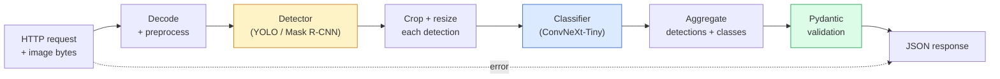

# Build Pipeline Visi yang Lengkap — Batu Penjuru

> Sistem visi produksi adalah rangkaian model dan aturan yang digabungkan dengan kontrak data. Potongan-potongannya sudah berada dalam fase ini; batu penjuru menyambungkannya dari ujung ke ujung.

**Type:** Build
**Language:** Python
**Prerequisites:** Phase 4 Lesson 01-15
**Waktu:** ~120 menit

## Tujuan Pembelajaran

- Rancang pipeline visi produksi yang mendeteksi objek, mengklasifikasikannya, dan memancarkan JSON terstruktur — dengan setiap jalur kegagalan ditangani
- Pasang detektor (Mask R-CNN atau YOLO), pengklasifikasi (ConvNeXt-Tiny), dan kontrak data (Pydantic) ke dalam satu layanan
- Tolok ukur pipeline end-to-end dan identifikasi hambatan pertama (biasanya pra-pemrosesan, lalu detektor)
- Mengirimkan layanan FastAPI minimal yang menerima unggahan gambar, menjalankan pipeline, dan mengembalikan deteksi dengan klasifikasi

## Masalah

Model visi individu berguna; produk visi adalah rantainya. Audit rak ritel adalah detektor ditambah pengklasifikasi produk ditambah pipeline harga-OCR. Mengemudi otonom adalah detektor 2D plus detektor 3D plus segmenter plus pelacak plus perencana. Pra-penyaringan medis adalah segmenter ditambah pengklasifikasi wilayah ditambah UI dokter.

Pengkabelan rantai tersebut adalah bagian yang memisahkan prototipe ML dari suatu produk. Setiap antarmuka antar model adalah tempat baru bagi bug. Setiap transformasi koordinat, setiap normalisasi, setiap perubahan ukuran mask merupakan kandidat kegagalan diam-diam. Sebuah pipeline pipa sama kuatnya dengan antarmuka terlemahnya.

Batu penjuru ini menyiapkan pipeline minimum yang layak: deteksi + klasifikasi + output terstruktur + layer penyajian. Segala sesuatu yang lain di Fase 4 dimasukkan ke dalam kerangka ini: tukar Mask R-CNN dengan YOLOv8, tambahkan kepala OCR, tambahkan cabang segmentasi, tambahkan pelacak. Arsitekturnya stabil; potongannya bisa dicolokkan.

## Konsep

### Pipeline pipa



Tujuh phase. Kedua phase model itu mahal; lima phase lainnya adalah tempat tinggal serangga.

### Kontrak data dengan Pydantic

Setiap batas model menjadi objek yang diketik. Hal ini mengubah kegagalan yang diam-diam menjadi kegagalan yang besar.

```
Detection(
    box: tuple[float, float, float, float],   # (x1, y1, x2, y2), absolute pixels
    score: float,                              # [0, 1]
    class_id: int,                             # from detector's label map
    mask: Optional[list[list[int]]],           # RLE-encoded if present
)

PipelineResult(
    image_id: str,
    detections: list[Detection],
    classifications: list[Classification],
    inference_ms: float,
)
```

Ketika detektor mengembalikan kotak di `(cx, cy, w, h)` alih-alih `(x1, y1, x2, y2)`, validasi Pydantic gagal di batas dan kamu langsung mengetahuinya alih-alih men-debug tanaman hilir yang secara diam-diam mengembalikan wilayah kosong.

### Kemana perginya latensi

Tiga kebenaran ada di hampir setiap pipeline visi:

1. **Preprocessing sering kali merupakan satu blok terbesar.** Mendekode JPEG, mengonversi ruang warna, mengubah ukuran — semua ini terikat pada CPU dan mudah dilupakan.
2. **Detektor mendominasi waktu GPU.** 70-90% waktu GPU berada dalam forward pass deteksi.
3. **Pemrosesan pasca (NMS, encode/decode RLE) murah pada GPU, mahal pada CPU.** Selalu membuat profil dengan target sebenarnya.

Mengetahui distribusi inilah yang mengubah optimization menjadi daftar prioritas.

### Mode kegagalan

- **Deteksi kosong** — mengembalikan daftar kosong, jangan mogok. Catatan.
- **Kotak di luar batas** — dijepit sesuai ukuran gambar sebelum dipotong.
- **Tanaman kecil** — lewati klasifikasi untuk kotak yang lebih kecil dari input minimum pengklasifikasi.
- **Unggahan rusak** — 400 respons dengan code kesalahan tertentu, bukan 500.
- **Kegagalan pemuatan model** — gagal saat layanan dimulai, bukan pada permintaan pertama.

Pipeline produksi menangani masing-masing hal ini tanpa menulis `try/except` generik yang menyembunyikan kegagalan. Setiap kegagalan mendapat code bernama dan respons.

### PengelompokanLayanan produksi melayani banyak klien. Deteksi dan klasifikasi batch di seluruh permintaan melipatgandakan throughput. Keuntungannya: latensi ekstra karena menunggu batch terisi. Penyiapan umum: kumpulkan permintaan hingga 20 md, kumpulkan bersama-sama, proses, distribusikan tanggapan. `torchserve` dan `triton` melakukan ini secara asli; layanan kecil dengan weight yang dapat diprediksi menggulung mikro-batcher mereka sendiri.

## Build

### Langkah 1: Kontrak data

```python
from pydantic import BaseModel, Field
from typing import List, Optional, Tuple

class Detection(BaseModel):
    box: Tuple[float, float, float, float]
    score: float = Field(ge=0, le=1)
    class_id: int = Field(ge=0)
    mask_rle: Optional[str] = None


class Classification(BaseModel):
    detection_index: int
    class_id: int
    class_name: str
    score: float = Field(ge=0, le=1)


class PipelineResult(BaseModel):
    image_id: str
    detections: List[Detection]
    classifications: List[Classification]
    inference_ms: float
```

Code lima detik menghemat satu jam proses debug pada pipeline serius apa pun.

### Langkah 2: Kelas Pipeline minimal

```python
import time
import numpy as np
import torch
from PIL import Image

class VisionPipeline:
    def __init__(self, detector, classifier, class_names,
                 device="cpu", min_crop=32):
        self.detector = detector.to(device).eval()
        self.classifier = classifier.to(device).eval()
        self.class_names = class_names
        self.device = device
        self.min_crop = min_crop

    def preprocess(self, image):
        """
        image: PIL.Image or np.ndarray (H, W, 3) uint8
        returns: CHW float tensor on device
        """
        if isinstance(image, Image.Image):
            image = np.asarray(image.convert("RGB"))
        tensor = torch.from_numpy(image).permute(2, 0, 1).float() / 255.0
        return tensor.to(self.device)

    @torch.no_grad()
    def detect(self, image_tensor):
        return self.detector([image_tensor])[0]

    @torch.no_grad()
    def classify(self, crops):
        if len(crops) == 0:
            return []
        batch = torch.stack(crops).to(self.device)
        logits = self.classifier(batch)
        probs = logits.softmax(-1)
        scores, cls = probs.max(-1)
        return list(zip(cls.tolist(), scores.tolist()))

    def run(self, image, image_id="anonymous"):
        t0 = time.perf_counter()
        tensor = self.preprocess(image)
        det = self.detect(tensor)

        crops = []
        detections = []
        valid_indices = []
        for i, (box, score, cls) in enumerate(zip(det["boxes"], det["scores"], det["labels"])):
            x1, y1, x2, y2 = [max(0, int(b)) for b in box.tolist()]
            x2 = min(x2, tensor.shape[-1])
            y2 = min(y2, tensor.shape[-2])
            detections.append(Detection(
                box=(x1, y1, x2, y2),
                score=float(score),
                class_id=int(cls),
            ))
            if (x2 - x1) < self.min_crop or (y2 - y1) < self.min_crop:
                continue
            crop = tensor[:, y1:y2, x1:x2]
            crop = torch.nn.functional.interpolate(
                crop.unsqueeze(0),
                size=(224, 224),
                mode="bilinear",
                align_corners=False,
            )[0]
            crops.append(crop)
            valid_indices.append(i)

        class_preds = self.classify(crops)

        classifications = []
        for valid_idx, (cls_id, cls_score) in zip(valid_indices, class_preds):
            classifications.append(Classification(
                detection_index=valid_idx,
                class_id=int(cls_id),
                class_name=self.class_names[cls_id],
                score=float(cls_score),
            ))

        return PipelineResult(
            image_id=image_id,
            detections=detections,
            classifications=classifications,
            inference_ms=(time.perf_counter() - t0) * 1000,
        )
```

Setiap antarmuka diketik. Setiap jalur kegagalan mempunyai keputusan penanganan yang spesifik.

### Langkah 3: Hubungkan detektor dan pengklasifikasi

```python
from torchvision.models.detection import maskrcnn_resnet50_fpn_v2
from torchvision.models import convnext_tiny

# Use ImageNet-pretrained weights for a realistic pipeline without training
detector = maskrcnn_resnet50_fpn_v2(weights="DEFAULT")
classifier = convnext_tiny(weights="DEFAULT")
class_names = [f"imagenet_class_{i}" for i in range(1000)]

pipe = VisionPipeline(detector, classifier, class_names)

# Smoke test with a synthetic image
test_image = (np.random.rand(400, 600, 3) * 255).astype(np.uint8)
result = pipe.run(test_image, image_id="demo")
print(result.model_dump_json(indent=2)[:500])
```

### Langkah 4: Layanan FastAPI

```python
from fastapi import FastAPI, UploadFile, HTTPException
from io import BytesIO

app = FastAPI()
pipe = None  # initialised on startup

@app.on_event("startup")
def load():
    global pipe
    detector = maskrcnn_resnet50_fpn_v2(weights="DEFAULT").eval()
    classifier = convnext_tiny(weights="DEFAULT").eval()
    pipe = VisionPipeline(detector, classifier, class_names=[f"c{i}" for i in range(1000)])

@app.post("/detect")
async def detect_endpoint(file: UploadFile):
    if file.content_type not in {"image/jpeg", "image/png", "image/webp"}:
        raise HTTPException(status_code=400, detail="unsupported image type")
    data = await file.read()
    try:
        img = Image.open(BytesIO(data)).convert("RGB")
    except Exception:
        raise HTTPException(status_code=400, detail="cannot decode image")
    result = pipe.run(img, image_id=file.filename or "upload")
    return result.model_dump()
```

Jalankan dengan `uvicorn main:app --host 0.0.0.0 --port 8000`. Uji dengan `curl -F 'file=@dog.jpg' http://localhost:8000/detect`.

### Langkah 5: Tolok ukur alurnya

```python
import time

def benchmark(pipe, num_runs=20, image_size=(400, 600)):
    img = (np.random.rand(*image_size, 3) * 255).astype(np.uint8)
    pipe.run(img)  # warm up

    stages = {"preprocess": [], "detect": [], "classify": [], "total": []}
    for _ in range(num_runs):
        t0 = time.perf_counter()
        tensor = pipe.preprocess(img)
        t1 = time.perf_counter()
        det = pipe.detect(tensor)
        t2 = time.perf_counter()
        crops = []
        for box in det["boxes"]:
            x1, y1, x2, y2 = [max(0, int(b)) for b in box.tolist()]
            x2 = min(x2, tensor.shape[-1])
            y2 = min(y2, tensor.shape[-2])
            if (x2 - x1) >= pipe.min_crop and (y2 - y1) >= pipe.min_crop:
                crop = tensor[:, y1:y2, x1:x2]
                crop = torch.nn.functional.interpolate(
                    crop.unsqueeze(0), size=(224, 224), mode="bilinear", align_corners=False
                )[0]
                crops.append(crop)
        pipe.classify(crops)
        t3 = time.perf_counter()
        stages["preprocess"].append((t1 - t0) * 1000)
        stages["detect"].append((t2 - t1) * 1000)
        stages["classify"].append((t3 - t2) * 1000)
        stages["total"].append((t3 - t0) * 1000)

    for stage, times in stages.items():
        times.sort()
        print(f"{stage:12s}  p50={times[len(times)//2]:7.1f} ms  p95={times[int(len(times)*0.95)]:7.1f} ms")
```

Output umum pada CPU: praproses ~3 mdtk, mendeteksi 300-500 mdtk, mengklasifikasikan 20-40 mdtk, total 350-550 mdtk. Pada GPU, deteksi adalah 20-40 ms dan praproses + klasifikasi mulai lebih penting secara relatif.

## Pakai

Templat produksi menyatu dengan struktur yang sama, ditambah:

- **Pembuatan versi model** — selalu mencatat hash nama model dan weight dalam respons.
- **ID pelacakan per permintaan** — mencatat setiap waktu tahapan untuk setiap permintaan sehingga kamu dapat menghubungkan respons lambat dengan tahapan.
- **Jalur cadangan** — jika waktu pengklasifikasi habis, kembalikan deteksi tanpa klasifikasi daripada menggagalkan seluruh permintaan.
- **Filter keamanan** — Filter NSFW / PII dijalankan setelah klasifikasi, sebelum respons meninggalkan layanan.
- **Titik akhir kumpulan** — `/detect_batch` menerima daftar URL gambar untuk pemrosesan massal.

Untuk penyajian produksi, `torchserve`, `Triton Inference Server`, dan `BentoML` menangani batching, pembuatan versi, metrik, dan health check secara langsung. Menjalankan `FastAPI` secara langsung baik untuk prototipe dan produk skala kecil.

## Kirim

Lesson ini menghasilkan:

- `outputs/prompt-vision-service-shape-reviewer.md` — prompt yang meninjau code layanan vision untuk pelanggaran bentuk kontrak/respons dan memberi nama bug yang pertama kali mengganggu.
- `outputs/skill-pipeline-budget-planner.md` — keterampilan yang, dengan mempertimbangkan latensi target dan throughput, menetapkan anggaran waktu untuk setiap phase pipeline pipa dan menandai phase mana yang akan kehilangan anggarannya terlebih dahulu.

## Latihan

1. **(Mudah)** Jalankan pipeline pada 10 gambar dari dataset terbuka mana pun. Laporkan waktu rata-rata per phase dan distribusi jumlah deteksi per gambar.
2. **(Medium)** Tambahkan bidang output topeng ke `Detection` dan enkodekan sebagai RLE. Pastikan JSON tetap di bawah 1MB bahkan untuk gambar 10 objek.
3. **(Hard)** Tambahkan micro-batcher di depan pengklasifikasi: kumpulkan hasil panen hingga 10 ms, klasifikasikan semuanya dalam satu panggilan GPU, kembalikan hasil per permintaan. Ukur perolehan throughput pada 5 permintaan bersamaan per detik dan latensi ditambahkan.

## Istilah Kunci| Istilah | Apa kata orang | Apa sebenarnya arti |
|------|----------------|----------------------|
| Pipeline pipa | "Sistem" | Rantai langkah preprocessing, inference, dan pascapemrosesan yang terurut dengan antarmuka yang diketik antara setiap pasangan |
| Kontrak data | "Skema" | Definisi Pydantic / dataclass yang sesuai dengan setiap input dan output phase; menangkap bug integrasi di batas |
| Preprocessing | "Sebelum model" | Decoding, konversi warna, pengubahan ukuran, normalisasi; biasanya penyerap waktu CPU terbesar |
| Pascapemrosesan | "Setelah model" | NMS, pengubahan ukuran topeng, ambang batas, pengkodean RLE; murah di GPU, mahal di CPU |
| Mikrobater | "Kumpulkan lalu teruskan" | Agregator yang menunggu jendela tetap untuk beberapa permintaan, menjalankan satu batch forward pass |
| ID Jejak | "Permintaan ID" | Pengidentifikasi per permintaan dicatat pada setiap phase sehingga permintaan yang lambat dapat dilacak dari ujung ke ujung |
| Code kegagalan | "Kesalahan bernama" | Code kesalahan spesifik per kelas kegagalan, bukan 500 umum; mengaktifkan logika coba ulang klien |
| Pemeriksaan kesehatan | "Pemeriksaan kesiapan" | Titik akhir murah yang melaporkan apakah layanan dapat menjawab; penyeimbang weight mengandalkan ini |

## Bacaan Lanjutan

- [Full Stack Deep Learning — Model Penerapan](https://fullstackdeeplearning.com/course/2022/lecture-5-deployment/) — ikhtisar kanonis penerapan ML produksi
- [Dokumen BentoML](https://docs.bentoml.com) — menyajikan framework dengan batching, pembuatan versi, dan metrik
- [dokumen torchserve](https://pytorch.org/serve/) — perpustakaan layanan resmi PyTorch
- [NVIDIA Triton Inference Server](https://developer.nvidia.com/triton-inference-server) — penyajian throughput tinggi dengan dukungan batching dan multi-model
