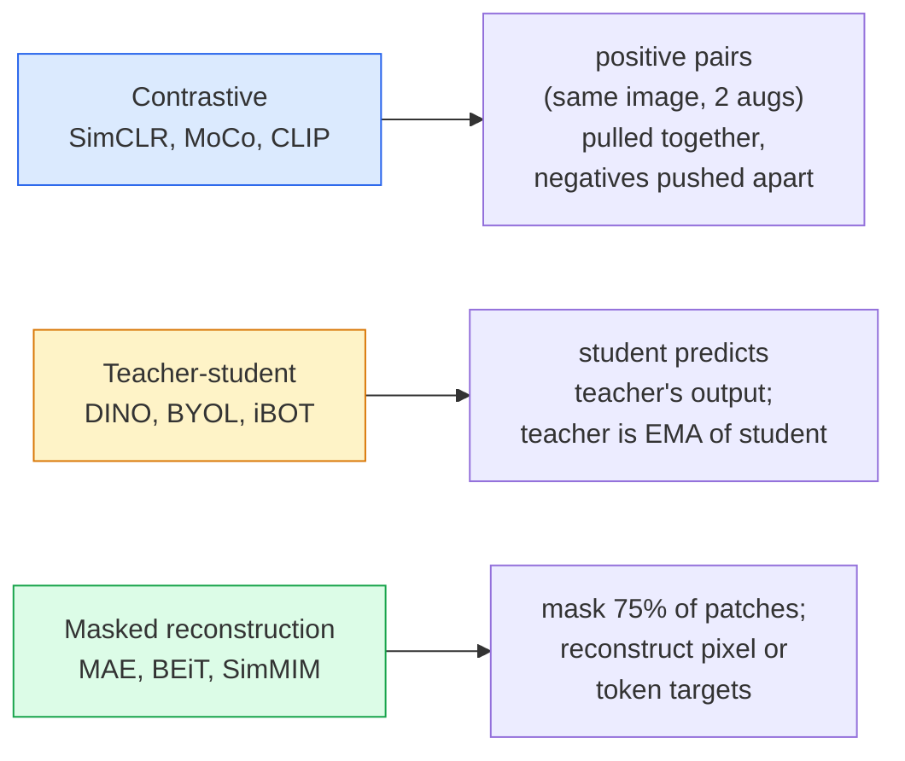

# Visi yang Diawasi Sendiri - SimCLR, DINO, MAE

> Label adalah penghambat penglihatan yang diawasi. Pra-training yang diawasi sendiri menghilangkannya: pelajari feature visual dari 100 juta gambar tanpa label, sempurnakan pada 10 ribu gambar berlabel.

**Type:** Learn + Build
**Language:** Python
**Prerequisites:** Phase 4 Lesson 04 (Klasifikasi Gambar), Phase 4 Lesson 14 (ViT)
**Waktu:** ~75 menit

## Tujuan Pembelajaran

- Telusuri tiga keluarga besar yang melakukan pengawasan mandiri — kontrastif (SimCLR), guru-siswa (DINO), rekonstruksi bertopeng (MAE) — dan nyatakan apa yang dioptimalkan masing-masing keluarga
- Menerapkan kehilangan InfoNCE dari awal dan menjelaskan mengapa kumpulan 512 berfungsi tetapi kumpulan 32 gagal
- Jelaskan mengapa rasio masking 75% MAE tidak sembarangan dan apa perbedaannya dengan 15% BERT untuk teks
- Gunakan pos pemeriksaan DINOv2 atau MAE ImageNet untuk pemeriksaan linier dan pengambilan gambar nol

## Masalah

ImageNet yang Diawasi memiliki 1,3 juta gambar berlabel, dengan biaya anotasi sekitar $10 juta. Dataset medis dan industri berukuran lebih kecil dan bahkan lebih mahal untuk diberi label. Setiap tim visi bertanya: bisakah kita melakukan pra-latihan pada data murah yang tidak diberi label — frame YouTube, perayapan web, rekaman webcam, sapuan satelit — dan kemudian menyempurnakan kumpulan kecil yang diberi label?

Pembelajaran dengan pengawasan mandiri adalah jawabannya. ViT modern yang diawasi sendiri dan dilatih pada LAION atau JFT mencapai atau mengalahkan akurasi ImageNet yang diawasi saat disetel dengan baik. Ini juga mentransfer lebih baik ke tugas-tugas hilir (deteksi, segmentasi, kedalaman) daripada pra-training yang diawasi. DINOv2 (Meta, 2023) dan MAE (Meta, 2022) adalah default produksi saat ini untuk feature visi yang dapat ditransfer.

Pergeseran konseptualnya adalah bahwa tugas awal — hal yang harus dilakukan oleh model — tidak harus berupa tugas hilir. Yang penting adalah hal ini memaksa model untuk mempelajari feature-feature yang berguna. Memprediksi warna gambar skala abu-abu, memutar gambar, dan meminta model mengklasifikasikan rotasi, menutupi tambalan, dan merekonstruksinya — semuanya berhasil. Tiga pendekatan yang berskala adalah pembelajaran kontrastif, penyulingan guru-siswa, dan rekonstruksi terselubung.

## Konsep

### Tiga keluarga



### Pembelajaran kontrastif (SimCLR)

Ambil satu gambar, terapkan dua augmentasi acak, dapatkan dua tampilan. Masukkan keduanya melalui encoder yang sama ditambah kepala proyeksi. Meminimalkan loss yang menyatakan "kedua embedding ini harus berdekatan" dan "embedding ini harus jauh dari embedding gambar lain dalam kumpulan".

```
Loss for positive pair (z_i, z_j) among 2N views per batch:

   L_ij = -log( exp(sim(z_i, z_j) / tau) / sum_k in batch \ {i} exp(sim(z_i, z_k) / tau) )

sim = cosine similarity
tau = temperature (0.1 standard)
```

Ini adalah loss InfoNCE. Ini memerlukan banyak negatif per positif, jadi ukuran batch penting — SimCLR memerlukan 512-8192. MoCo memperkenalkan antrian momentum batch sebelumnya untuk memisahkan jumlah negatif dari ukuran batch.

### Guru-siswa (DINO)

Dua jaringan dengan arsitektur yang sama: siswa dan guru. Guru adalah rata-rata pergerakan eksponensial (EMA) dari weight siswa. Keduanya melihat tampilan gambar yang diperbesar. Output siswa dilatih agar sesuai dengan output guru — tidak ada hal negatif yang eksplisit.

```
loss = CE( student_output(view_1),  teacher_output(view_2) )
     + CE( student_output(view_2),  teacher_output(view_1) )

teacher_weights = m * teacher_weights + (1 - m) * student_weights   (m ≈ 0.996)
```

Mengapa tidak gagal untuk "memprediksi konstanta": output guru dipusatkan (kurangi rata-rata per dimension) dan dipertajam (dibagi dengan suhu kecil). Pemusatan mencegah satu dimension mendominasi; penajaman mencegah keruntuhan output menjadi seragam.

DINO adalah apa yang DINOv2 tingkatkan, pada 142 juta gambar yang dikurasi. Feature yang dihasilkan adalah SOTA terkini untuk pengambilan visual zero-shot dan prediksi padat.

### Rekonstruksi bertopeng (MAE)Menyamarkan 75% patch input ViT. Lewatkan hanya 25% yang terlihat melalui encoder. Decoder kecil menerima output encoder ditambah token mask pada posisi yang di-mask, dan dilatih untuk merekonstruksi piksel dari patch yang di-mask.

```
Encoder:  visible 25% of patches -> features
Decoder:  features + mask tokens at masked positions -> reconstructed pixels
Loss:     MSE between reconstructed and original pixels on masked patches only
```

Pilihan desain utama yang membuat MAE berfungsi:

- **Rasio masker 75%** — tinggi. Memaksa pembuat enkode untuk mempelajari feature semantik; merekonstruksi 25% akan menjadi hal yang hampir sepele (piksel tetangga sangat berkorelasi sehingga CNN dapat melakukannya).
- **Encoder/decoder asimetris** — encoder ViT besar hanya melihat patch yang terlihat; dekoder kecil (8 layer, 512 redup) menangani rekonstruksi. Pra-training 3x lebih cepat daripada BEiT yang naif.
- **Target rekonstruksi ruang piksel** — lebih sederhana dibandingkan target token BEiT dan bekerja lebih baik pada ViT.

Setelah pra-training, buang dekoder. Encoder adalah ekstraktor feature.

### Mengapa 75% dan bukan 15%

BERT menutupi 15% token. Masker MAE 75%. Perbedaannya adalah kepadatan informasi.

- Bahasa alami memiliki entropi per token yang tinggi. Memprediksi 15% token masih sulit karena setiap posisi bertopeng memiliki banyak penyelesaian yang masuk akal.
- Tambalan gambar memiliki entropi yang rendah — lingkungan yang terbuka kedoknya sering kali menentukan piksel tambalan yang disamarkan hampir sama persis. Untuk membuat prediksi memerlukan pemahaman semantik, kamu harus melakukan masking secara agresif.

75% cukup tinggi sehingga ekstrapolasi spasial sederhana tidak dapat menyelesaikan tugas; encoder harus mewakili konten gambar.

### Evaluasi penyelidikan linier

Setelah training awal yang diawasi sendiri, evaluasi standarnya adalah **pemeriksaan linier**: membekukan encoder, melatih satu pengklasifikasi linier di atas label ImageNet. Melaporkan akurasi top-1.

- SimCLR ResNet-50: ~71% (2020)
- DINO ViT-S/16: ~77% (2021)
- MAE ViT-L/16: ~76% (2022)
- DINOv2 ViT-g/14: ~86% (2023)

Pemeriksaan linier adalah ukuran murni kualitas feature; penyempurnaan biasanya menambah 2-5 poin tetapi juga menggabungkan efek training ulang kepala.

## Build

### Langkah 1: Alur augmentasi dua tampilan

```python
import torch
import torchvision.transforms as T

two_view_train = lambda: T.Compose([
    T.RandomResizedCrop(96, scale=(0.2, 1.0)),
    T.RandomHorizontalFlip(),
    T.ColorJitter(0.4, 0.4, 0.4, 0.1),
    T.RandomGrayscale(p=0.2),
    T.ToTensor(),
])


class TwoViewDataset(torch.utils.data.Dataset):
    def __init__(self, base):
        self.base = base
        self.aug = two_view_train()

    def __len__(self):
        return len(self.base)

    def __getitem__(self, i):
        img, _ = self.base[i]
        v1 = self.aug(img)
        v2 = self.aug(img)
        return v1, v2
```

Setiap __getitem__ mengembalikan dua tampilan tambahan dari gambar yang sama; label tidak diperlukan.

### Langkah 2: Kehilangan InfoNCE

```python
import torch.nn.functional as F

def info_nce(z1, z2, tau=0.1):
    """
    z1, z2: (N, D) L2-normalised embeddings of paired views
    """
    N, D = z1.shape
    z = torch.cat([z1, z2], dim=0)  # (2N, D)
    sim = z @ z.T / tau              # (2N, 2N)

    mask = torch.eye(2 * N, dtype=torch.bool, device=z.device)
    sim = sim.masked_fill(mask, float("-inf"))

    targets = torch.cat([torch.arange(N, 2 * N), torch.arange(0, N)]).to(z.device)
    return F.cross_entropy(sim, targets)
```

L2-normalkan embedding sebelum menelepon. `tau=0.1` adalah default SimCLR; lebih rendah membuat loss lebih tajam dan membutuhkan lebih banyak hal negatif.

### Langkah 3: Periksa kewarasan InfoNCE

```python
z1 = F.normalize(torch.randn(16, 32), dim=-1)
z2 = z1.clone()
loss_same = info_nce(z1, z2, tau=0.1).item()
z2_random = F.normalize(torch.randn(16, 32), dim=-1)
loss_random = info_nce(z1, z2_random, tau=0.1).item()
print(f"InfoNCE with identical pairs:  {loss_same:.3f}")
print(f"InfoNCE with random pairs:     {loss_random:.3f}")
```

Pasangan yang identik harus memberikan loss yang rendah (mendekati 0 untuk batch besar dan suhu dingin). Pasangan acak harus menghasilkan log(2N-1) = ~log(31) = ~3.4 dengan kumpulan 16 pasang.

### Langkah 4: Masking gaya MAE

```python
def random_mask_indices(num_patches, mask_ratio=0.75, seed=0):
    g = torch.Generator().manual_seed(seed)
    n_keep = int(num_patches * (1 - mask_ratio))
    perm = torch.randperm(num_patches, generator=g)
    visible = perm[:n_keep]
    masked = perm[n_keep:]
    return visible.sort().values, masked.sort().values


num_patches = 196
visible, masked = random_mask_indices(num_patches, mask_ratio=0.75)
print(f"visible: {len(visible)} / {num_patches}")
print(f"masked:  {len(masked)} / {num_patches}")
```

Sederhana, cepat, dan deterministik untuk benih tertentu. Implementasi MAE nyata mengelompokkan ini dan menyimpan masker per sample.

## Pakai

DINOv2 adalah standar produksi pada tahun 2026:

```python
import torch
from transformers import AutoImageProcessor, AutoModel

processor = AutoImageProcessor.from_pretrained("facebook/dinov2-base")
model = AutoModel.from_pretrained("facebook/dinov2-base")
model.eval()

# Per-image embeddings for zero-shot retrieval
with torch.no_grad():
    inputs = processor(images=[pil_image], return_tensors="pt")
    outputs = model(**inputs)
    embedding = outputs.last_hidden_state[:, 0]  # CLS token
```

Embedding 768-dim yang dihasilkan merupakan tulang punggung pengambilan gambar modern, korespondensi padat, dan pipeline transfer zero-shot. Penyempurnaan pada tugas hilir jarang membutuhkan lebih dari sekadar head linier.

Untuk embedding gambar-teks, SigLIP atau OpenCLIP setara; untuk penyempurnaan gaya MAE, repo `timm` dikirimkan ke setiap pos pemeriksaan MAE.

## Kirim

Lesson ini menghasilkan:

- `outputs/prompt-ssl-pretraining-picker.md` — prompt yang memilih SimCLR / MAE / DINOv2 berdasarkan ukuran dataset, komputasi, dan tugas hilir.
- `outputs/skill-linear-probe-runner.md` — keterampilan yang menulis evaluasi probe linier untuk encoder beku apa pun + dataset berlabel.

## Latihan1. **(Mudah)** Pastikan kehilangan InfoNCE turun saat kamu menurunkan suhu untuk embedding yang selaras dan meningkat saat kamu menurunkan suhu untuk embedding acak. Menghasilkan plot `tau in [0.05, 0.1, 0.2, 0.5]` vs loss.
2. **(Medium)** Menerapkan buffer tengah bergaya DINO. Tunjukkan bahwa tanpa pemusatan, siswa akan runtuh ke vector konstan dalam beberapa periode.
3. **(Keras)** Latih MAE di CIFAR-100 menggunakan TinyUNet dari Lesson 10 sebagai tulang punggung. Laporkan akurasi penyelidikan linier pada epoch 10, 50, dan 200. Tunjukkan bahwa probe linier yang telah dilatih sebelumnya oleh MAE mengalahkan probe linier yang diawasi dari awal pada subset 1.000 gambar yang sama.

## Istilah Kunci

| Istilah | Apa kata orang | Apa sebenarnya arti |
|------|----------------|----------------------|
| Diawasi sendiri | "Bebas label" | Tugas dalih yang menghasilkan representasi berguna dari data yang tidak berlabel |
| Tugas dalih | "Tugas palsu" | Tujuan yang digunakan selama SSL (rekonstruksi patch, mencocokkan tampilan); dibuang setelah pra-training |
| Pemeriksaan linier | "Encoder beku + kepala linier" | Evaluasi SSL standar: latih hanya pengklasifikasi linier di atas feature yang dibekukan |
| InfoNCE | "Loss kontrastif" | softmax atas kesamaan kosinus; pasangan positif adalah kelas target, yang lainnya negatif |
| Guru EMA | "Guru rata-rata bergerak" | Guru yang bobotnya merupakan rata-rata pergerakan eksponensial siswa; digunakan oleh BYOL, MoCo, DINO |
| Rasio topeng | "% tambalan disembunyikan" | Sebagian kecil tambalan yang ditutupi selama MAE; 75% untuk penglihatan, 15% untuk teks |
| Runtuhnya representasi | "Output konstan" | Kegagalan SSL saat pembuat enkode mengeluarkan vector konstan untuk semua input; dicegah dengan pemusatan, penajaman, atau negatif |
| DINOv2 | "Tulang punggung SSL Produksi" | ViT yang diawasi sendiri oleh Meta pada tahun 2023; feature gambar serba guna terkuat di tahun 2026 |

## Bacaan Lanjutan

- [SimCLR (Chen et al., 2020)](https://arxiv.org/abs/2002.05709) — referensi pembelajaran kontrastif
- [DINO (Caron dkk., 2021)](https://arxiv.org/abs/2104.14294) — guru-siswa dengan momentum, pemusatan, penajaman
- [MAE (He et al., 2022)](https://arxiv.org/abs/2111.06377) — training awal autoencoder bertopeng untuk ViT
- [DINOv2 (Oquab et al., 2023)](https://arxiv.org/abs/2304.07193) — menskalakan ViT yang diawasi sendiri ke feature produksi
