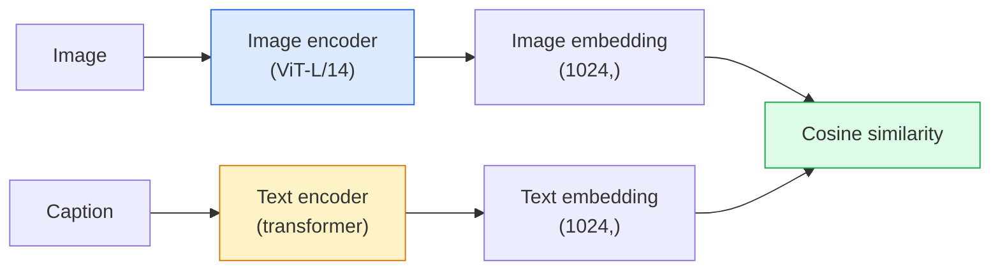

# Visi Kosakata Terbuka - KLIP

> Latih pembuat enkode gambar dan pembuat enkode teks secara bersamaan sehingga pasangan (gambar, keterangan) yang cocok berada di titik yang sama di ruang bersama. Itulah keseluruhan triknya.

**Type:** Pembuatan + Penggunaan
**Language:** Python
**Prerequisites:** Phase 4 Lesson 14 (ViT), Phase 4 Lesson 17 (Pengawasan Mandiri)
**Waktu:** ~45 menit

## Tujuan Pembelajaran

- Jelaskan arsitektur dua menara CLIP dan tujuan training kontras
- Gunakan CLIP (atau SigLIP) yang telah dilatih sebelumnya untuk klasifikasi zero-shot tanpa training khusus tugas apa pun
- Menerapkan klasifikasi zero-shot dari awal: menyandikan prompt kelas, menghitung kesamaan kosinus, mengambil argmax
- Membedakan model CLIP, SigLIP, OpenCLIP, dan LLaVA/LLaMA-vision — kegunaan masing-masing model pada tahun 2026

## Masalah

Pengklasifikasi tradisional bersifat kosakata tertutup: model ImageNet kelas 1000 hanya dapat memprediksi 1000 label. Setiap kategori baru memerlukan data berlabel dan kepala yang dilatih ulang.

CLIP (Radford et al., OpenAI 2021) menunjukkan bahwa training pada 400 juta pasangan (gambar, keterangan) yang diambil dari web menghasilkan model yang dapat diklasifikasikan ke dalam serangkaian kategori apa pun pada inference, yang dijelaskan murni dalam bahasa alami. kamu memberinya kelas baru dengan menulis kalimat.

Kemampuan tersebut — transfer zero-shot — adalah alasan mengapa setiap sistem penglihatan modern dimulai dengan pos pemeriksaan keluarga CLIP. Deteksi (Grounding DINO, OWL-ViT), segmentasi (CLIPSeg, SAM), pengambilan, moderasi konten, VLM, dan pembuatan teks-ke-gambar semuanya dibangun pada embedding gabungan bergaya CLIP.

## Konsep

### Dua menara



Kedua pembuat enkode diakhiri dengan proyeksi linier ke dimension embedding yang sama (512 untuk CLIP-B/32, 1024 untuk CLIP-L/14). L2-normalisasi dan hitung kesamaan kosinus.

### Tujuannya

Diberikan kumpulan N pasangan (gambar, keterangan), buat matrix kesamaan NxN. Latih kedua pembuat enkode sehingga diagonal (pasangan yang cocok) memiliki kemiripan yang tinggi dan di luar diagonal (tidak cocok) memiliki kemiripan yang rendah.

```
sim_matrix = image_embeddings @ text_embeddings.T / tau

loss_i2t = cross_entropy(sim_matrix,       targets=arange(N))
loss_t2i = cross_entropy(sim_matrix.T,     targets=arange(N))
loss = (loss_i2t + loss_t2i) / 2
```

Simetris karena pengambilan gambar-ke-teks dan teks-ke-gambar seharusnya berfungsi. `tau` (suhu) biasanya dipelajari sebagai parameter scalar, diinisialisasi ke 0,07.

### SigLIP: loss yang lebih baik

SigLIP (Zhai et al., 2023) mengganti softmax dengan sigmoid per pasangan:

```
loss = mean over pairs of log(1 + exp(-y_ij * sim_ij))
y_ij = +1 if matching, -1 otherwise
```

Kehilangan per pasangan menghilangkan normalisasi tingkat batch yang diperlukan CLIP. SigLIP berlatih lebih baik pada ukuran batch kecil dan cocok atau melebihi CLIP pada data yang sama.

### Klasifikasi zero-shot

Diberikan CLIP terlatih:

1. Untuk setiap kelas, buatlah prompt: "foto {kelas}".
2. Enkode semua prompt kelas dengan encoder teks -> `T` bentuk (C, d).
3. Enkode gambar uji -> `I` bentuk (1, d).
4. Kemiripan = `I @ T.T` bentuk (1, C).
5. Argmax -> kelas prediksi.

Masalah rekayasa yang cepat. OpenAI menerbitkan 80 templat prompt untuk ImageNet ("foto {}", "foto {} yang buram", "sketsa {}", ...). Rata-rata embedding semua templat per kelas untuk tambahan akurasi 1-3% teratas.

### Di mana model bergaya CLIP digunakan pada tahun 2026- **Klasifikasi zero-shot** — penggunaan langsung.
- **Pengambilan gambar** — menyandikan semua gambar satu kali, embed kueri pada inference.
- **Deteksi berkondisi teks** — Grounding DINO, OWL-ViT membungkus menara teks CLIP di sekitar detektor.
- **Segmentasi berkondisi teks** — CLIPSeg; SAM menggunakan input teks-prompt melalui CLIP.
- **VLM** — LLaVA, Qwen-VL, InternVL menyambungkan encoder visi keluarga CLIP ke dalam LLM.
- **Gen teks-ke-gambar** — Difusi Stabil, kondisi DALL-E 3 pada embedding teks CLIP.

Setelah kamu memiliki ruang embedding bersama, setiap tugas visi+bahasa menjadi komputasi distance jauh.

## Build

### Langkah 1: Model dua menara kecil

CLIP sebenarnya adalah Transformer ViT+. Untuk lesson ini, menaranya adalah MLP kecil melalui feature yang telah diekstraksi sebelumnya sehingga sinyal training terlihat di CPU.

```python
import torch
import torch.nn as nn
import torch.nn.functional as F


class TwoTower(nn.Module):
    def __init__(self, img_in=128, txt_in=64, emb=64):
        super().__init__()
        self.image_proj = nn.Sequential(nn.Linear(img_in, 128), nn.ReLU(), nn.Linear(128, emb))
        self.text_proj = nn.Sequential(nn.Linear(txt_in, 128), nn.ReLU(), nn.Linear(128, emb))
        self.logit_scale = nn.Parameter(torch.ones([]) * 2.6592)  # ln(1/0.07)

    def forward(self, img_feats, txt_feats):
        i = F.normalize(self.image_proj(img_feats), dim=-1)
        t = F.normalize(self.text_proj(txt_feats), dim=-1)
        return i, t, self.logit_scale.exp()
```

Dua proyeksi, output redup bersama, suhu yang dipelajari. Bentuknya sama dengan CLIP API asli.

### Langkah 2: Loss kontrastif

```python
def clip_loss(image_emb, text_emb, logit_scale):
    N = image_emb.size(0)
    sim = logit_scale * image_emb @ text_emb.T
    targets = torch.arange(N, device=sim.device)
    l_i = F.cross_entropy(sim, targets)
    l_t = F.cross_entropy(sim.T, targets)
    return (l_i + l_t) / 2
```

Simetris. Logit_scale lebih tinggi = softmax lebih tajam = lebih percaya diri tetapi berisiko ketidakstabilan.

### Langkah 3: Pengklasifikasi zero-shot

```python
@torch.no_grad()
def zero_shot_classify(model, image_feats, class_text_feats, class_names):
    """
    image_feats:      (N, img_in)
    class_text_feats: (C, txt_in)   one averaged embedding per class
    """
    i = F.normalize(model.image_proj(image_feats), dim=-1)
    t = F.normalize(model.text_proj(class_text_feats), dim=-1)
    sim = i @ t.T
    pred = sim.argmax(dim=-1)
    return [class_names[p] for p in pred.tolist()]
```

Satu baris per langkah. Ini adalah prosedur zero-shot yang digunakan dengan pos pemeriksaan CLIP produksi.

### Langkah 4: Pemeriksaan kewarasan

```python
torch.manual_seed(0)
model = TwoTower()

img = torch.randn(8, 128)
txt = torch.randn(8, 64)
i, t, scale = model(img, txt)
loss = clip_loss(i, t, scale)
print(f"batch size: {i.size(0)}   loss: {loss.item():.3f}")
```

Loss harus mendekati `log(N) = log(8) = 2.08` untuk model yang diinisialisasi secara acak — target entropi silang simetris ketika belum ada struktur yang dipelajari.

## Pakai

OpenCLIP adalah default komunitas pada tahun 2026:

```python
import open_clip
import torch
from PIL import Image

model, _, preprocess = open_clip.create_model_and_transforms("ViT-B-32", pretrained="laion2b_s34b_b79k")
tokenizer = open_clip.get_tokenizer("ViT-B-32")

image = preprocess(Image.open("dog.jpg")).unsqueeze(0)
text = tokenizer(["a photo of a dog", "a photo of a cat", "a photo of a car"])

with torch.no_grad():
    image_features = model.encode_image(image)
    text_features = model.encode_text(text)
    image_features = image_features / image_features.norm(dim=-1, keepdim=True)
    text_features = text_features / text_features.norm(dim=-1, keepdim=True)
    probs = (100.0 * image_features @ text_features.T).softmax(dim=-1)

print(probs)
```

SigLIP lebih baru, berlatih lebih baik dalam skala kecil, dan lebih disukai untuk pekerjaan baru: `google/siglip-base-patch16-224`. Hugging Face mengirimkan keduanya.

## Kirim

Lesson ini menghasilkan:

- `outputs/prompt-zero-shot-class-picker.md` — prompt yang mendesain templat kelas untuk CLIP zero-shot berdasarkan daftar kelas dan domain.
- `outputs/skill-image-text-retriever.md` — keterampilan yang membangun indeks embedding gambar dengan pos pemeriksaan CLIP apa pun, mendukung kueri demi teks dan kueri demi gambar.

## Latihan

1. **(Mudah)** Gunakan OpenCLIP ViT-B/32 yang telah dilatih sebelumnya dan lakukan klasifikasi zero-shot pada CIFAR-10 dengan set prompt 80 templat. Laporkan akurasi peringkat 1 teratas; seharusnya sekitar 85-90%.
2. **(Medium)** Bandingkan rata-rata embeddings template tunggal ("foto {}") vs 80 template pada tugas CIFAR-10 yang sama. Hitung kesenjangannya dan jelaskan mengapa templat membantu.
3. **(Sulit)** Buat indeks pengambilan gambar zero-shot: sematkan 1.000 gambar dengan CLIP, buat indeks FAISS, kueri dengan deskripsi bahasa alami. Pengambilan laporan recall@5 untuk 20 pertanyaan yang kamu tulis dengan tangan.

## Istilah Kunci

| Istilah | Apa kata orang | Apa sebenarnya arti |
|------|----------------|----------------------|
| Dua menara | "Encoder ganda" | Pisahkan pembuat enkode gambar dan teks yang diakhiri dengan kepala proyeksi redup bersama |
| Tembakan nol | "Tidak ada training khusus tugas" | Klasifikasikan ke dalam kelas-kelas yang dijelaskan hanya dengan teks pada inference; tidak ada label yang disentuh |
| Suhu / logit_scale | "tau" | Scalar yang dipelajari yang menskalakan matrix kesamaan sebelum softmax |
| Templat cepat | "Foto {}" | Pembungkus bahasa alami di sekitar nama kelas; rata-rata banyak templat meningkatkan akurasi zero-shot |
| KLIP | "Model gambar+teks" | Model OpenAI 2021; kosakata bidang pada tahun 2026 |
| SigLIP | "KLIP Sigmoid" | Menukar softmax dengan sigmoid per pasang; berlatih lebih baik dalam jumlah kecil |
| OpenCLIP | "Reproduksi terbuka" | Varian CLIP yang dilatih komunitas di LAION; default produksi untuk pipeline pipa sumber terbuka |
| VLM | "Model bahasa visi" | Encoder keluarga CLIP ditambah LLM, dilatih untuk menjawab pertanyaan tentang gambar |

## Bacaan Lanjutan- [KLIP: Pembelajaran Model Visual yang Dapat Dipindahtangankan dari Pengawasan Bahasa Alami (Radford et al., 2021)](https://arxiv.org/abs/2103.00020)
- [SigLIP: Kehilangan Sigmoid untuk Pra-Training Gambar-Bahasa (Zhai et al., 2023)](https://arxiv.org/abs/2303.15343)
- [OpenCLIP](https://github.com/mlfoundations/open_clip) — basis code komunitas
- [DINOv2 vs CLIP vs MAE: perbandingan feature](https://huggingface.co/blog/dinov2) — Panduan HF dengan kasus penggunaan berdampingan
