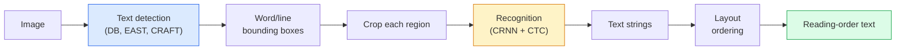

# OCR & Pemahaman Dokumen

> OCR adalah alur tiga phase — mendeteksi kotak teks, mengenali karakter, lalu menatanya. Setiap sistem OCR modern menyusun ulang tahapan ini atau menggabungkannya.

**Type:** Learn + Gunakan
**Language:** Python
**Prerequisites:** Phase 4 Lesson 06 (Deteksi), Phase 7 Lesson 02 (Attention Diri)
**Waktu:** ~45 menit

## Tujuan Pembelajaran

- Lacak jalur pipa OCR klasik (deteksi -> kenali -> tata letak) dan alternatif ujung ke ujung modern (Donut, Qwen-VL-OCR)
- Menerapkan loss CTC (Connectionist Temporal Classification) untuk training OCR urutan ke urutan
- Gunakan PaddleOCR atau EasyOCR untuk penguraian dokumen produksi tanpa training
- Bedakan OCR, penguraian tata letak, dan pemahaman dokumen — dan pilih alat yang tepat untuk setiap tugas

## Masalah

Gambar penuh teks ada di mana-mana: kuitansi, faktur, ID, pindaian buku, formulir, papan tulis, tanda, tangkapan layar. Mengekstraksi data terstruktur darinya — bukan hanya karakternya, tetapi "ini adalah jumlah totalnya" — adalah salah satu masalah penglihatan terapan yang bernilai tertinggi.

Bidang ini dibagi menjadi tiga layer keterampilan:

1. **OCR tepat**: mengubah piksel menjadi teks.
2. **Penguraian tata letak**: mengelompokkan output OCR ke dalam wilayah (judul, isi, tabel, header).
3. **Pemahaman dokumen**: ekstrak kolom terstruktur ("invoice_total = $42,50") dari tata letak.

Setiap layer memiliki pendekatan klasik dan modern, dan kesenjangan antara "Saya ingin teks dari gambar" dan "Saya memerlukan jumlah total dari tanda terima ini" lebih besar daripada yang disadari sebagian besar tim.

## Konsep

### Pipeline pipa klasik



- **Deteksi teks** menghasilkan segi empat per baris atau per kata.
- **Recognition** memotong setiap wilayah ke ketinggian tetap, menjalankan CNN + BiLSTM + CTC untuk menghasilkan urutan karakter.
- **Tata Letak** menyusun kembali urutan pembacaan (atas ke bawah, kiri ke kanan untuk bahasa Latin; berbeda untuk bahasa Arab, Jepang).

### CTC dalam satu paragraf

Pengenalan OCR menghasilkan urutan panjang variabel dari peta feature dengan panjang tetap. CTC (Graves et al., 2006) memungkinkan kamu melatih ini tanpa penyelarasan tingkat karakter. Model mengeluarkan distribusi (vocab + blank) pada setiap langkah waktu; Kehilangan CTC meminggirkan semua perataan yang mengecil ke teks target setelah menggabungkan pengulangan dan menghilangkan bagian yang kosong.

```
raw output: "h h h _ _ e e l l _ l l o _ _"
after merge repeats and remove blanks: "hello"
```

CTC adalah alasan CRNN bekerja pada tahun 2015 dan masih melatih sebagian besar model OCR produksi pada tahun 2026.

### Model ujung ke ujung yang modern

- **Donut** (Kim et al., 2022) — encoder ViT + decoder teks; membaca gambar dan memancarkan JSON secara langsung. Tidak ada detektor teks, tidak ada modul tata letak.
- **TrOCR** ​​— Dekoder Transformer ViT + untuk OCR tingkat pipeline.
- **Qwen-VL-OCR / InternVL** — model bahasa vision lengkap yang disesuaikan untuk tugas OCR; akurasi terbaik pada tahun 2026 pada dokumen kompleks.
- **PaddleOCR** ​​— pipeline DB + CRNN klasik dalam paket produksi yang matang; masih merupakan pekerja keras sumber terbuka.

Model end-to-end memerlukan lebih banyak data dan komputasi, tetapi melewatkan akumulasi kesalahan pada pipeline multi-phase.

### Penguraian tata letak

Untuk dokumen terstruktur, jalankan pendeteksi tata letak (LayoutLMv3, DocLayNet) yang memberi label pada setiap wilayah: Judul, Paragraf, Gambar, Tabel, Catatan Kaki. Urutan membaca kemudian menjadi "berulang melalui wilayah dalam urutan tata letak, digabungkan."

Untuk formulir, gunakan model **Ekstraksi Nilai-Kunci** (Donut untuk dokumen yang kaya visual, LayoutLMv3 untuk pemindaian biasa). Mereka mengambil gambar + teks yang terdeteksi + posisi dan memprediksi pasangan nilai kunci terstruktur.

### Metrik evaluasi- **Tingkat Kesalahan Karakter (CER)** — Distance Levenshtein / panjang referensi. Lebih rendah lebih baik. Target produksi: <2% pada pemindaian bersih.
- **Tingkat Kesalahan Kata (WER)** — sama pada tingkat kata.
- **F1 pada bidang terstruktur** — untuk tugas nilai kunci; mengukur apakah `{invoice_total: 42.50}` muncul dengan benar.
- **Edit distance di JSON** — untuk penguraian dokumen ujung ke ujung; makalah Donat memperkenalkan distance edit pohon yang dinormalisasi.

## Build

### Langkah 1: Kehilangan CTC + dekoder serakah

```python
import torch
import torch.nn as nn
import torch.nn.functional as F


def ctc_loss(log_probs, targets, input_lengths, target_lengths, blank=0):
    """
    log_probs:      (T, N, C) log-softmax over vocab including blank at index 0
    targets:        (N, S) int targets (no blanks)
    input_lengths:  (N,) per-sample time steps used
    target_lengths: (N,) per-sample target length
    """
    return F.ctc_loss(log_probs, targets, input_lengths, target_lengths,
                      blank=blank, reduction="mean", zero_infinity=True)


def greedy_ctc_decode(log_probs, blank=0):
    """
    log_probs: (T, N, C) log-softmax
    returns: list of index sequences (blanks removed, repeats merged)
    """
    preds = log_probs.argmax(dim=-1).transpose(0, 1).cpu().tolist()
    out = []
    for seq in preds:
        decoded = []
        prev = None
        for idx in seq:
            if idx != prev and idx != blank:
                decoded.append(idx)
            prev = idx
        out.append(decoded)
    return out
```

`F.ctc_loss` menggunakan implementasi CuDNN yang efisien bila tersedia. Dekoder serakah lebih sederhana daripada pencarian berkas dan biasanya dalam 1% CER-nya.

### Langkah 2: Pengenal CRNN kecil

Minimal CNN + BiLSTM untuk jalur OCR.

```python
class TinyCRNN(nn.Module):
    def __init__(self, vocab_size=40, hidden=128, feat=32):
        super().__init__()
        self.cnn = nn.Sequential(
            nn.Conv2d(1, feat, 3, 1, 1), nn.BatchNorm2d(feat), nn.ReLU(inplace=True),
            nn.MaxPool2d(2),
            nn.Conv2d(feat, feat * 2, 3, 1, 1), nn.BatchNorm2d(feat * 2), nn.ReLU(inplace=True),
            nn.MaxPool2d(2),
            nn.Conv2d(feat * 2, feat * 4, 3, 1, 1), nn.BatchNorm2d(feat * 4), nn.ReLU(inplace=True),
            nn.MaxPool2d((2, 1)),
            nn.Conv2d(feat * 4, feat * 4, 3, 1, 1), nn.BatchNorm2d(feat * 4), nn.ReLU(inplace=True),
            nn.MaxPool2d((2, 1)),
        )
        self.rnn = nn.LSTM(feat * 4, hidden, bidirectional=True, batch_first=True)
        self.head = nn.Linear(hidden * 2, vocab_size)

    def forward(self, x):
        # x: (N, 1, H, W)
        f = self.cnn(x)                # (N, C, H', W')
        f = f.mean(dim=2).transpose(1, 2)  # (N, W', C)
        h, _ = self.rnn(f)
        return F.log_softmax(self.head(h).transpose(0, 1), dim=-1)  # (W', N, vocab)
```

Input dengan tinggi tetap (tinggi kumpulan maksimal CNN menjadi 1). Lebar adalah dimension waktu untuk CTC.

### Langkah 3: OCR Sintetis

Hasilkan string digit hitam-putih untuk pengujian asap menyeluruh.

```python
import numpy as np

def synthetic_line(text, height=32, char_width=16):
    W = char_width * len(text)
    img = np.ones((height, W), dtype=np.float32)
    for i, c in enumerate(text):
        x = i * char_width
        shade = 0.0 if c.isalnum() else 0.5
        img[6:height - 6, x + 2:x + char_width - 2] = shade
    return img


def build_batch(strings, vocab):
    H = 32
    W = 16 * max(len(s) for s in strings)
    imgs = np.ones((len(strings), 1, H, W), dtype=np.float32)
    target_lengths = []
    targets = []
    for i, s in enumerate(strings):
        imgs[i, 0, :, :16 * len(s)] = synthetic_line(s)
        ids = [vocab.index(c) for c in s]
        targets.extend(ids)
        target_lengths.append(len(ids))
    return torch.from_numpy(imgs), torch.tensor(targets), torch.tensor(target_lengths)


vocab = ["_"] + list("0123456789abcdefghijklmnopqrstuvwxyz")
imgs, targets, lengths = build_batch(["hello", "world"], vocab)
print(f"images: {imgs.shape}   targets: {targets.shape}   lengths: {lengths.tolist()}")
```

Dataset OCR nyata menambahkan font, noise, rotasi, blur, dan warna. Pipa di atas identik.

### Langkah 4: Sketsa training

```python
model = TinyCRNN(vocab_size=len(vocab))
opt = torch.optim.Adam(model.parameters(), lr=1e-3)

for step in range(200):
    strings = ["abc" + str(step % 10)] * 4 + ["xyz" + str((step + 1) % 10)] * 4
    imgs, targets, target_lens = build_batch(strings, vocab)
    log_probs = model(imgs)  # (W', 8, vocab)
    input_lens = torch.full((8,), log_probs.size(0), dtype=torch.long)
    loss = ctc_loss(log_probs, targets, input_lens, target_lens, blank=0)
    opt.zero_grad(); loss.backward(); opt.step()
```

Loss akan turun dari ~3 menjadi ~0,2 dalam 200 langkah pada data sintetis sepele ini.

## Pakai

Tiga jalur produksi:

- **PaddleOCR** — matang, cepat, multibahasa. Penggunaan satu baris: `paddleocr.PaddleOCR(lang="en").ocr(image_path)`.
- **EasyOCR** ​​— Tulang punggung PyTorch asli Python, multibahasa.
- **Tesseract** — klasik; masih berguna untuk dokumen pindaian lama ketika modelnya bermasalah.

Untuk penguraian dokumen ujung ke ujung, gunakan Donut atau VLM:

```python
from transformers import DonutProcessor, VisionEncoderDecoderModel

processor = DonutProcessor.from_pretrained("naver-clova-ix/donut-base-finetuned-cord-v2")
model = VisionEncoderDecoderModel.from_pretrained("naver-clova-ix/donut-base-finetuned-cord-v2")
```

Untuk kuitansi, faktur, dan formulir dengan struktur berulang, sempurnakan Donut. Untuk dokumen arbitrer atau OCR dengan alasan, VLM seperti Qwen-VL-OCR adalah default saat ini.

## Kirim

Lesson ini menghasilkan:

- `outputs/prompt-ocr-stack-picker.md` — prompt yang memilih Tesseract / PaddleOCR / Donut / VLM-OCR berdasarkan jenis dokumen, bahasa, dan struktur.
- `outputs/skill-ctc-decoder.md` — keterampilan yang menulis dekoder CTC serakah dan penelusuran berkas dari awal, termasuk normalisasi panjang.

## Latihan

1. **(Mudah)** Latih TinyCRNN pada string numerik acak 5 digit untuk 500 langkah. Laporkan CER pada set yang ditahan.
2. **(Medium)** Ganti decoding serakah dengan penelusuran berkas (beam_width=5). Laporkan delta CER. Pada input manakah beam search menang?
3. **(Sulit)** Gunakan PaddleOCR pada kumpulan 20 tanda terima, ekstrak item baris, dan hitung F1 berdasarkan kebenaran dasar yang diberi label tangan untuk pasangan {item_name, price}.

## Istilah Kunci

| Istilah | Apa kata orang | Apa sebenarnya arti |
|------|----------------|----------------------|
| OCR | "Teks dari piksel" | Mengubah wilayah gambar menjadi rangkaian karakter |
| CTC | "Loss bebas keselarasan" | Loss yang melatih model urutan tanpa label per langkah waktu; meminggirkan atas keberpihakan |
| CRNN | "Model OCR klasik" | Ekstraktor feature konv + BiLSTM + CTC; baseline tahun 2015 masih digunakan dalam produksi |
| Donat | "OCR ujung ke ujung" | Enkoder ViT + dekoder teks; memancarkan JSON langsung dari gambar |
| Penguraian tata letak | "Temukan wilayah" | Mendeteksi dan memberi label pada wilayah Judul/Tabel/Gambar/Paragraf dalam dokumen |
| Urutan membaca | "Urutan teks" | Pengurutan daerah-daerah yang diakui menjadi suatu kalimat; sepele untuk bahasa Latin, tidak sepele untuk tata letak campuran |
| CER/WER | "Tingkat kesalahan" | Distance Levenshtein / panjang referensi pada granularitas karakter atau kata |
| VLM-OCR | "LLM yang berbunyi" | Model bahasa visi yang dilatih atau diminta untuk tugas OCR; SOTA saat ini pada dokumen kompleks |

## Bacaan Lanjutan- [CRNN (Shi et al., 2015)](https://arxiv.org/abs/1507.05717) — arsitektur CNN+RNN+CTC asli
- [CTC (Graves et al., 2006)](https://www.cs.toronto.edu/~graves/icml_2006.pdf) — makalah CTC asli; padat dengan ide-ide algoritmik
- [Donut (Kim et al., 2022)](https://arxiv.org/abs/2111.15664) — Transformer pemahaman dokumen bebas OCR
- [PaddleOCR](https://github.com/PaddlePaddle/PaddleOCR) — tumpukan OCR produksi sumber terbuka
