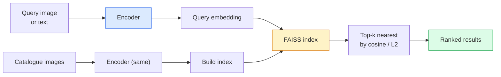

# Pengambilan Gambar & Pembelajaran Metrik

> Sistem pengambilan memberi peringkat kandidat berdasarkan distance dalam ruang embedding. Pembelajaran metrik adalah disiplin membentuk ruang sehingga distance sesuai dengan yang kamu inginkan.

**Type:** Build
**Language:** Python
**Prerequisites:** Phase 4 Lesson 14 (ViT), Phase 4 Lesson 18 (CLIP)
**Waktu:** ~45 menit

## Tujuan Pembelajaran

- Jelaskan loss pembelajaran metrik triplet, kontrastif, dan berbasis proksi dan pilih yang tepat untuk dataset tertentu
- Menerapkan normalisasi L2 dan kesamaan kosinus dengan benar dan mengaudit perbedaan antara pengambilan "item yang sama" dan "kelas yang sama"
- Buat indeks FAISS, kueri berdasarkan teks dan gambar, dan laporkan recall@K untuk kumpulan kueri yang disimpan
- Gunakan DINOv2, CLIP, dan SigLIP sebagai tulang punggung embedding siap pakai dan ketahui kapan masing-masing menang

## Masalah

Pengambilan ada dimana-mana dalam visi produksi: deteksi duplikat, pencarian gambar terbalik, pencarian visual ("temukan produk serupa"), identifikasi ulang wajah, ID ulang orang untuk pengawasan, pencocokan tingkat instance untuk e-commerce. Pertanyaan produk selalu sama: "mengingat gambar kueri ini, beri peringkat pada katalog saya."

Dua keputusan desain membentuk keseluruhan sistem. Embedding — model apa yang menghasilkan vector. Indeks — cara menemukan nearest neighbor dalam skala besar. Keduanya merupakan komoditas pada tahun 2026 (DINOv2 untuk embedding, FAISS untuk indeks), yang meningkatkan standar: bagian tersulitnya adalah menentukan *apa yang dianggap serupa* untuk aplikasi kamu, lalu membentuk ruang embedding sehingga jaraknya cocok.

Pembentukan itu adalah pembelajaran metrik. Ini adalah disiplin yang kecil namun mempunyai pengaruh yang tinggi.

## Konsep

### Sekilas tentang pengambilan



### Empat keluarga yang kehilangan

| Loss | Membutuhkan | Kelebihan | Kontra |
|------|----------|------|------|
| **Kontrastif** | (jangkar, positif) + negatif | Sederhana, dapat digunakan dengan label pasangan apa pun | Lambat untuk menyatu tanpa banyak hal negatif |
| **Ketiganya** | (jangkar, positif, negatif) | Intuitif; kontrol margin langsung | Penambangan hard-triplet itu mahal |
| **NT-Xent / InfoNCE** | Pasangan + negatif yang ditambang secara batch | Menskalakan ke batch besar | Membutuhkan batch besar atau antrian momentum |
| **Berbasis proxy (ProxyNCA)** | Hanya label kelas | Cepat, stabil, tanpa penambangan | Dapat melakukan overfit ke proxy pada dataset kecil |

Untuk sebagian besar kasus penggunaan produksi, mulailah dengan tulang punggung yang telah dilatih sebelumnya dan hanya tambahkan penyesuaian pembelajaran metrik jika embedding siap pakai berperforma buruk pada set pengujian kamu.

### Kekalahan rangkap tiga secara formal

```
L = max(0, ||f(a) - f(p)||^2 - ||f(a) - f(n)||^2 + margin)
```

Tarik jangkar `a` mendekati positif `p`, dorong menjauh dari negatif `n`, dengan `margin` yang memastikan adanya kesenjangan. Struktur tiga gambar digeneralisasikan ke urutan kesamaan apa pun.

Masalah penambangan: kembar tiga yang mudah (`n` sudah jauh dari `a`) tidak memberikan kontribusi loss; hanya si kembar tiga yang keras yang mengajarkan jaringan. Penambangan semi-keras (`n` lebih jauh dari `p` tetapi masih dalam margin) adalah resep FaceNet tahun 2016 dan masih mendominasi.

### Kesamaan kosinus vs L2

Dua metrik, dua konvensi:

- **Cosinus**: sudut antar vector. Memerlukan embedding yang dinormalisasi L2.
- **L2**: Distance Euclidean. Berfungsi pada embedding mentah atau yang dinormalisasi, tetapi biasanya dipasangkan dengan L2 yang dinormalisasi + L2 kuadrat.

Untuk sebagian besar jaringan modern, keduanya setara: `||a - b||^2 = 2 - 2 cos(a, b)` bila `||a|| = ||b|| = 1`. Pilih konvensi yang cocok dengan training embedding kamu; mencampurkannya secara diam-diam mengubah arti "terdekat".

### Ingat @K

Metrik pengambilan standar:```
recall@K = fraction of queries where at least one correct match is in the top K results
```

Laporkan penarikan@1, @5, @10 secara berdampingan. Recall@10 di atas 0,95 dengan recall@1 di bawah 0,5 berarti ruang embedding memiliki struktur yang tepat tetapi peringkatnya buruk — coba penyesuaian yang lebih lama atau langkah pemeringkatan ulang.

Untuk deteksi duplikat, presisi@K lebih penting karena setiap kesalahan positif adalah kesalahan yang terlihat oleh pengguna. Untuk penelusuran visual, recall@K adalah sinyal produk.

### FAISS dalam satu paragraf

Pencarian Kesamaan AI Facebook. Perpustakaan de-facto untuk pencarian nearest neighbor. Tiga pilihan indeks:

- `IndexFlatIP` / `IndexFlatL2` — kekerasan, tepat, tanpa training. Gunakan hingga ~1 juta vector.
- `IndexIVFFlat` — partisi menjadi K sel, cari hanya beberapa sel terdekat. Perkiraan, cepat, membutuhkan training data.
- `IndexHNSW` — berbasis grafik, tercepat untuk banyak kueri, ukuran indeks besar.

Untuk 100 ribu vector kamu mungkin menginginkan `IndexFlatIP` pada kesamaan kosinus. Untuk 10 juta kamu ingin `IndexIVFFlat`. Untuk 100 juta+ dikombinasikan dengan kuantisasi produk (`IndexIVFPQ`).

### Pengambilan tingkat instance vs tingkat kategori

Dua masalah yang sangat berbeda dengan nama yang sama:

- **Tingkat kategori** — "temukan kucing di katalog saya." Kesamaan kelas-kondisional; Embedding CLIP / DINOv2 siap pakai berfungsi dengan baik.
- **Tingkat Instance** — "temukan *produk persis ini* di katalog saya." Membutuhkan diskriminasi yang halus antara objek-objek yang serupa secara visual di kelas yang sama; embeddings siap pakai berkinerja buruk; menyempurnakan masalah pembelajaran metrik.

Selalu tanyakan mana yang sedang kamu pecahkan sebelum memilih model.

## Build

### Langkah 1: Loss tiga kali lipat

```python
import torch
import torch.nn.functional as F

def triplet_loss(anchor, positive, negative, margin=0.2):
    d_ap = F.pairwise_distance(anchor, positive, p=2)
    d_an = F.pairwise_distance(anchor, negative, p=2)
    return F.relu(d_ap - d_an + margin).mean()
```

Satu baris. Bekerja pada embeddings yang dinormalisasi L2 atau mentah.

### Langkah 2: Penambangan semi-keras

Dengan adanya sekumpulan embedding dan label, temukan negatif semi-keras yang paling sulit untuk setiap jangkar.

```python
def semi_hard_negatives(emb, labels, margin=0.2):
    dist = torch.cdist(emb, emb)
    same_class = labels[:, None] == labels[None, :]
    diff_class = ~same_class
    N = emb.size(0)

    positives = dist.clone()
    positives[~same_class] = float("-inf")
    positives.fill_diagonal_(float("-inf"))
    pos_idx = positives.argmax(dim=1)

    semi_hard = dist.clone()
    semi_hard[same_class] = float("inf")
    d_ap = dist[torch.arange(N), pos_idx].unsqueeze(1)
    semi_hard[dist <= d_ap] = float("inf")
    neg_idx = semi_hard.argmin(dim=1)

    fallback_mask = semi_hard[torch.arange(N), neg_idx] == float("inf")
    if fallback_mask.any():
        hardest = dist.clone()
        hardest[same_class] = float("inf")
        neg_idx = torch.where(fallback_mask, hardest.argmin(dim=1), neg_idx)
    return pos_idx, neg_idx
```

Masing-masing jangkar mendapat nilai positif tersulit di kelasnya dan nilai negatif semi-keras yang lebih jauh dari nilai positif namun masih dalam margin.

### Langkah 3: Ingat@K

```python
def recall_at_k(query_emb, gallery_emb, query_labels, gallery_labels, k=1):
    sim = query_emb @ gallery_emb.T
    _, top_k = sim.topk(k, dim=-1)
    matches = (gallery_labels[top_k] == query_labels[:, None]).any(dim=-1)
    return matches.float().mean().item()
```

Top-k berdasarkan hasil kali dalam pada embeddings yang dinormalisasi L2 sama dengan top-k berdasarkan kosinus. Laporkan proporsi rata-rata kueri dengan setidaknya satu tetangga yang benar.

### Langkah 4: Menyatukannya

```python
import torch
import torch.nn as nn
from torch.optim import Adam

class Encoder(nn.Module):
    def __init__(self, in_dim=128, emb_dim=64):
        super().__init__()
        self.net = nn.Sequential(
            nn.Linear(in_dim, 128), nn.ReLU(),
            nn.Linear(128, emb_dim),
        )

    def forward(self, x):
        return F.normalize(self.net(x), dim=-1)

torch.manual_seed(0)
num_classes = 6
protos = F.normalize(torch.randn(num_classes, 128), dim=-1)

def sample_batch(bs=32):
    labels = torch.randint(0, num_classes, (bs,))
    x = protos[labels] + 0.15 * torch.randn(bs, 128)
    return x, labels

enc = Encoder()
opt = Adam(enc.parameters(), lr=3e-3)

for step in range(200):
    x, y = sample_batch(32)
    emb = enc(x)
    pos_idx, neg_idx = semi_hard_negatives(emb, y)
    loss = triplet_loss(emb, emb[pos_idx], emb[neg_idx])
    opt.zero_grad(); loss.backward(); opt.step()
```

Setelah beberapa ratus langkah, cluster yang tertanam akan membentuk satu cluster per kelas.

## Pakai

Tumpukan produksi pada tahun 2026:

- **DINOv2 + FAISS** — pengambilan visual untuk keperluan umum. Bekerja di luar rak.
- **CLIP + FAISS** — saat kueri berupa teks.
- **DINOv2 + FAISS yang disempurnakan** — pengambilan tingkat instance, ID ulang wajah, mode, e-niaga.
- **Milvus / Weaviate / Qdrant** — membungkus vector DB yang dikelola di sekitar FAISS atau HNSW.

Untuk pengambilan instans SOTA, resepnya adalah: tulang punggung DINOv2, tambahkan kepala embedding, sempurnakan dengan triplet atau kehilangan InfoNCE pada pasangan berlabel instans, indeks dalam FAISS.

## Kirim

Lesson ini menghasilkan:

- `outputs/prompt-retrieval-loss-picker.md` — prompt yang memilih triplet / InfoNCE / ProxyNCA untuk masalah pengambilan tertentu.
- `outputs/skill-recall-at-k-runner.md` — keterampilan yang menulis memanfaatkan evaluasi yang bersih untuk recall@K dengan pemisahan kereta/val/galeri dan kontrak data yang tepat.

## Latihan1. **(Mudah)** Jalankan contoh mainan di atas. Plot embeddings dengan PCA sebelum dan sesudah training untuk melihat bentuk enam cluster.
2. **(Medium)** Tambahkan implementasi loss ProxyNCA: satu "proxy" yang dipelajari per kelas, entropi silang standar pada kesamaan kosinus. Bandingkan kecepatan konvergensi vs loss triplet pada data mainan.
3. **(Keras)** Ambil 1.000 gambar validasi ImageNet, sematkan dengan DINOv2 melalui HuggingFace, buat indeks datar FAISS, dan laporkan recall@{1, 5, 10} terhadap gambar yang sama dengan kueri (harus 1.0) dan terhadap pemisahan yang dilakukan dengan label ImageNet sebagai kebenaran dasar.

## Istilah Kunci

| Istilah | Apa kata orang | Apa sebenarnya arti |
|------|----------------|----------------------|
| Pembelajaran metrik | "Bentuk ruang" | Melatih pembuat enkode sehingga distance dalam ruang keluarannya mencerminkan kesamaan target |
| Loss kembar tiga | "Tarik dan dorong" | L = maks(0, d(a, p) - d(a, n) + margin); loss pembelajaran metrik kanonik |
| Penambangan semi-keras | "Negatif yang berguna" | Negatif lebih jauh dari jangkar dibandingkan positif tetapi masih dalam margin; secara empiris paling informatif |
| Loss berbasis proxy | "Prototipe kelas" | Satu proksi yang dipelajari per kelas; entropi silang atas kesamaan dengan proxy; tidak ada penambangan berpasangan |
| Ingat@K | "Tingkat hit-K teratas" | Sebagian kueri dengan setidaknya satu hasil benar di K | teratas
| Pengambilan contoh | "Temukan hal yang tepat ini" | Pencocokan berbutir halus; feature siap pakai biasanya berkinerja buruk |
| FAISS | "Perpustakaan NN" | perpustakaan nearest neighbor Facebook; mendukung indeks yang tepat dan perkiraan |
| HNSW | "Indeks grafik" | Dunia kecil yang dapat dinavigasi secara hierarkis; perkiraan cepat NN dengan overhead memori kecil |

## Bacaan Lanjutan

- [FaceNet: Embedding Terpadu untuk Pengenalan Wajah (Schroff dkk., 2015)](https://arxiv.org/abs/1503.03832) — kertas penambangan triplet loss / semi-hard
- [Dalam Pembelaan atas Hilangnya Triplet untuk Identifikasi Ulang Orang (Hermans et al., 2017)](https://arxiv.org/abs/1703.07737) — panduan praktis untuk menyempurnakan triplet
- [Dokumentasi FAISS](https://github.com/facebookresearch/faiss/wiki) — setiap indeks, setiap trade-off
- [SMoT: Metric Learning Taxonomy (Kim et al., 2021)](https://arxiv.org/abs/2010.06927) — survei loss modern dan hubungannya
