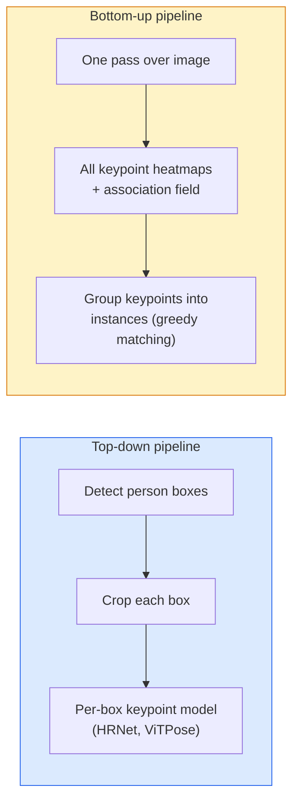

# Deteksi Titik Kunci & Estimasi Pose

> Pose adalah sekumpulan titik kunci yang diurutkan. Detektor titik kunci adalah regressor peta panas. Segala sesuatu yang lain adalah pembukuan.

**Type:** Build
**Language:** Python
**Prerequisites:** Phase 4 Lesson 06 (Deteksi), Phase 4 Lesson 07 (U-Net)
**Waktu:** ~45 menit

## Tujuan Pembelajaran

- Membedakan estimasi pose top-down dan bottom-up serta menyatakan kapan masing-masing digunakan
- Regresi peta panas untuk K titik kunci dengan target Gaussian per titik kunci dan ekstrak koordinat titik kunci pada inference
- Menjelaskan Bidang Afinitas Bagian (PAF) dan bagaimana pipeline pipa bottom-up mengaitkan titik-titik kunci ke dalam contoh
- Gunakan Pose MediaPipe atau MMPose untuk estimasi titik kunci produksi dan pahami format keluarannya

## Masalah

Tugas-tugas utama tersembunyi di bawah banyak nama: pose manusia (17 sendi tubuh), penanda wajah (68 atau 478 poin), tangan (21 poin), pose hewan, pose objek robot, penanda anatomi medis. Masing-masing dari mereka memiliki struktur yang sama: mendeteksi K titik-titik diskrit pada suatu objek dan menampilkan koordinat (x, y).

Estimasi pose adalah dasar dari penangkapan gerakan, aplikasi kebugaran, analisis olahraga, kontrol gerakan, animasi, uji coba AR, dan genggaman robot. Kasus 2D sudah matang; Pose 3D (memperkirakan posisi gabungan dalam koordinat dunia dari satu kamera) adalah batas penelitian saat ini.

Pertanyaan tekniknya adalah skala. Pose satu gambar dan satu orang merupakan masalah 20 md. Pose beberapa orang di tengah keramaian dengan kecepatan 30 fps adalah masalah yang berbeda dengan arsitektur yang berbeda.

## Konsep

### Atas-bawah vs bawah-atas



- **Top-down** — mendeteksi orang terlebih dahulu, lalu menjalankan model titik kunci per orang pada setiap pemotongan. Akurasi tertinggi; berskala linear dengan jumlah orang.
- **Bottom-up** — satu forward pass memprediksi semua titik kunci ditambah bidang asosiasi; kelompokkan mereka. Waktu yang konstan berapa pun jumlah penontonnya.

Top-down (HRNet, ViTPose) adalah pemimpin akurasi; bottom-up (OpenPose, HigherHRNet) adalah pemimpin throughput untuk adegan ramai.

### Regresi peta panas

Daripada melakukan regresi `(x, y)` secara langsung, prediksikan peta panas `H x W` per titik kunci dengan gumpalan Gaussian yang berpusat di lokasi sebenarnya.

```
target[k, y, x] = exp(-((x - cx_k)^2 + (y - cy_k)^2) / (2 sigma^2))
```

Sebagai kesimpulan, argmax setiap peta panas adalah prediksi lokasi titik kunci.

Mengapa peta panas bekerja lebih baik daripada regresi langsung: struktur spasial jaringan (peta feature konv) selaras secara alami dengan output spasial. Target Gaussian juga diatur - kesalahan lokalisasi kecil menghasilkan loss kecil, bukan nol.

### Lokalisasi subpiksel

Argmax memberikan koordinat bilangan bulat. Untuk presisi subpiksel, perbaiki dengan memasangkan parabola ke argmax dan tetangganya, atau gunakan arah offset `(dx, dy) = 0.25 * (heatmap[y, x+1] - heatmap[y, x-1], ...)` yang terkenal.

### Bidang Afinitas Bagian (PAF)

Trik OpenPose untuk asosiasi bottom-up. Untuk setiap pasangan titik kunci yang terhubung (misalnya bahu kiri ke siku kiri), prediksi bidang 2 pipeline yang mengkodekan vector satuan yang menunjuk dari satu titik ke titik lainnya. Untuk mengaitkan bahu dengan sikunya, integrasikan PAF sepanjang garis penghubung pasangan calon; pasangan dengan integral tertinggi dicocokkan.

```
For each connection (limb):
  PAF channels: 2 (unit vector x, y)
  Line integral: sum over sample points of (PAF . line_direction)
  Higher integral = stronger match
```

Elegan dan berskala hingga ukuran kerumunan yang berubah-ubah tanpa hasil panen per orang.

### Titik kunci COCO

Dataset pose tubuh standar: 17 titik kunci per orang, PCK (Persentase Titik Kunci yang Benar) dan OKS (Kesamaan Titik Kunci Objek) sebagai metrik. OKS adalah analog titik kunci dari IoU dan merupakan laporan COCO mAP@OKS.

### 2D vs 3D- **Pose 2D** — koordinat gambar; diselesaikan pada kualitas produksi (MediaPipe, HRNet, ViTPose).
- **Pose 3D** — koordinat dunia / kamera; masih aktif melakukan penelitian. Pendekatan umum:
  - Tingkatkan prediksi 2D menjadi 3D dengan MLP kecil (VideoPose3D).
  - Regresi 3D langsung dari gambar (PyMAF, MHFormer).
  - Pengaturan multi-tampilan (CMU Panoptic) untuk kebenaran dasar.

## Build

### Langkah 1: Target peta panas Gaussian

```python
import numpy as np
import torch

def gaussian_heatmap(size, cx, cy, sigma=2.0):
    yy, xx = np.meshgrid(np.arange(size), np.arange(size), indexing="ij")
    return np.exp(-((xx - cx) ** 2 + (yy - cy) ** 2) / (2 * sigma ** 2)).astype(np.float32)

hm = gaussian_heatmap(64, 32, 32, sigma=2.0)
print(f"peak: {hm.max():.3f} at ({hm.argmax() % 64}, {hm.argmax() // 64})")
```

Peta panas per titik kunci yang ditumpuk di sepanjang sumbu pipeline memberikan tensor target penuh.

### Langkah 2: Kepala titik kunci kecil

Model gaya U-Net yang menghasilkan K pipeline peta panas.

```python
import torch.nn as nn
import torch.nn.functional as F

class TinyKeypointNet(nn.Module):
    def __init__(self, num_keypoints=4, base=16):
        super().__init__()
        self.down1 = nn.Sequential(nn.Conv2d(3, base, 3, 2, 1), nn.ReLU(inplace=True))
        self.down2 = nn.Sequential(nn.Conv2d(base, base * 2, 3, 2, 1), nn.ReLU(inplace=True))
        self.mid = nn.Sequential(nn.Conv2d(base * 2, base * 2, 3, 1, 1), nn.ReLU(inplace=True))
        self.up1 = nn.ConvTranspose2d(base * 2, base, 2, 2)
        self.up2 = nn.ConvTranspose2d(base, num_keypoints, 2, 2)

    def forward(self, x):
        h1 = self.down1(x)
        h2 = self.down2(h1)
        h3 = self.mid(h2)
        u1 = self.up1(h3)
        return self.up2(u1)
```

Input `(N, 3, H, W)`, output `(N, K, H, W)`. Loss adalah MSE per piksel terhadap target Gaussian.

### Langkah 3: Inference — ekstrak koordinat titik kunci

```python
def heatmap_to_coords(heatmaps):
    """
    heatmaps: (N, K, H, W)
    returns:  (N, K, 2) float coordinates in image pixels
    """
    N, K, H, W = heatmaps.shape
    hm = heatmaps.reshape(N, K, -1)
    idx = hm.argmax(dim=-1)
    ys = (idx // W).float()
    xs = (idx % W).float()
    return torch.stack([xs, ys], dim=-1)

coords = heatmap_to_coords(torch.randn(2, 4, 32, 32))
print(f"coords: {coords.shape}")  # (2, 4, 2)
```

Satu baris dalam inference. Untuk penyempurnaan subpiksel, lakukan interpolasi di sekitar argmax.

### Langkah 4: Dataset titik kunci sintetis

Sederhana: gambar empat titik di kanvas putih dan pelajari cara memprediksinya.

```python
def make_synthetic_sample(size=64):
    img = np.ones((3, size, size), dtype=np.float32)
    rng = np.random.default_rng()
    kps = rng.integers(8, size - 8, size=(4, 2))
    for cx, cy in kps:
        img[:, cy - 2:cy + 2, cx - 2:cx + 2] = 0.0
    hms = np.stack([gaussian_heatmap(size, cx, cy) for cx, cy in kps])
    return img, hms, kps
```

Cukup mudah untuk dipelajari oleh model mungil dalam satu menit.

### Langkah 5: Training

```python
model = TinyKeypointNet(num_keypoints=4)
opt = torch.optim.Adam(model.parameters(), lr=3e-3)

for step in range(200):
    batch = [make_synthetic_sample() for _ in range(16)]
    imgs = torch.from_numpy(np.stack([b[0] for b in batch]))
    hms = torch.from_numpy(np.stack([b[1] for b in batch]))
    pred = model(imgs)
    # Upsample pred to full resolution
    pred = F.interpolate(pred, size=hms.shape[-2:], mode="bilinear", align_corners=False)
    loss = F.mse_loss(pred, hms)
    opt.zero_grad(); loss.backward(); opt.step()
```

## Pakai

- **Pose MediaPipe** — penaksir pose produksi Google; mengirimkan runtime seluler WebGL + dengan latensi di bawah 10 md.
- **MMPose** (OpenMMLab) — basis code penelitian komprehensif; setiap arsitektur SOTA dengan weight yang telah dilatih sebelumnya.
- **YOLOv8-pose** — pose multi-orang tercepat secara real-time dengan satu forward pass.
- **transformers HumanDPT / PoseAnything** — pendekatan bahasa visi yang lebih baru untuk pose kosakata terbuka (objek apa pun, kumpulan titik kunci apa pun).

## Kirim

Lesson ini menghasilkan:

- `outputs/prompt-pose-stack-picker.md` — prompt yang memilih pose MediaPipe / YOLOv8 / HRNet / ViTPose berdasarkan latensi, ukuran kerumunan, dan kebutuhan 2D vs 3D.
- `outputs/skill-heatmap-to-coords.md` — keterampilan yang menulis rutinitas peta panas subpiksel ke koordinat yang digunakan oleh setiap model pose produksi.

## Latihan

1. **(Mudah)** Latih model titik kunci kecil pada dataset 4 titik sintetis. Laporkan kesalahan rata-rata L2 antara titik kunci yang diprediksi dan titik kunci yang sebenarnya setelah 200 langkah.
2. **(Medium)** Tambahkan penghalusan subpiksel: dengan posisi argmax, paskan parabola 1D di sepanjang x dan y dari piksel tetangga. Laporkan perolehan akurasi vs integer argmax.
3. **(Keras)** Buat dataset sintetis 2 orang yang setiap gambarnya menampilkan dua contoh pola 4 titik kunci. Latih alur bottom-up dengan PAF yang memprediksi titik kunci mana yang termasuk dalam instans mana, dan evaluasi OKS.

## Istilah Kunci

| Istilah | Apa kata orang | Apa sebenarnya arti |
|------|----------------|----------------------|
| Titik Kunci | "Sebuah landmark" | Titik terurut tertentu pada suatu objek (sambungan, sudut, feature) |
| Berpose | "Kerangka" | Satu set titik kunci yang terurut milik satu contoh |
| Atas-bawah | "Deteksi lalu berpose" | Pipeline pipa dua phase: detektor orang + model titik kunci per tanaman; akurasi tertinggi |
| Dari bawah ke atas | "Pose dulu, kelompok nanti" | Prediksi + pengelompokan semua titik kunci sekali jalan; waktu konstan dalam ukuran kerumunan |
| Peta Panas | "Target Gaussian" | Tensor H x W per titik kunci dengan puncak di lokasi sebenarnya; target regresi pilihan |
| PAF | "Bagian Bidang Afinitas" | Bidang vector unit 2 pipeline yang mengkode arah ekstremitas; digunakan untuk mengelompokkan titik kunci ke dalam instance |
| oke | "IoU Titik Kunci" | Kesamaan Titik Kunci Objek; metrik COCO untuk pose |
| HRNet | "Jaringan Resolusi Tinggi" | Arsitektur keypoint top-down yang dominan; mempertahankan feature resolusi tinggi di seluruh |

## Bacaan Lanjutan- [OpenPose (Cao et al., 2017)](https://arxiv.org/abs/1812.08008) — bottom-up dengan PAF; masih merupakan tulisan terbaik dari pendekatan ini
- [HRNet (Sun et al., 2019)](https://arxiv.org/abs/1902.09212) — arsitektur referensi top-down
- [ViTPose (Xu et al., 2022)](https://arxiv.org/abs/2204.12484) — ViT biasa sebagai tulang punggung pose; SOTA saat ini pada banyak tolok ukur
- [Pose MediaPipe](https://developers.google.com/mediapipe/solutions/vision/pose_landmarker) — pose produksi real-time; tumpukan yang paling cepat diterapkan pada tahun 2026
