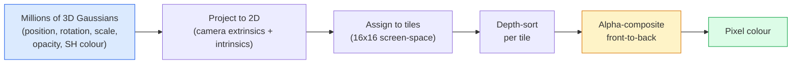

# Percikan Gaussian 3D dari Awal

> Sebuah pemandangan adalah awan jutaan Gaussian 3D. Masing-masing memiliki posisi, orientasi, skala, opasitas, dan warna yang bergantung pada arah pandang. Rasterisasi mereka, backprop melalui rasterisasi, selesai.

**Type:** Build
**Language:** Python
**Prerequisites:** Fase 4 Lesson 13 (Visi 3D & NeRF), Fase 1 Lesson 12 (Operasi Tensor), Fase 4 Lesson 10 (Dasar-dasar difusi opsional)
**Waktu:** ~90 menit

## Tujuan Pembelajaran

- Jelaskan mengapa 3D Gaussian Splatting menggantikan NeRF sebagai default produksi untuk rekonstruksi 3D fotorealistik pada tahun 2026
- Nyatakan enam parameter per-Gaussian (posisi, angka empat rotasi, skala, opasitas, warna harmonik bola, feature opsional) dan berapa banyak kontribusi masing-masing pelampung
- Implementasikan rasterizer splatting Gaussian 2D dari awal menggunakan pengomposisian `alpha`, lalu tunjukkan bagaimana kasus 3D diproyeksikan ke loop yang sama
- Gunakan `nerfstudio`, `gsplat`, atau `SuperSplat` untuk merekonstruksi adegan dari 20-50 foto dan mengekspor ke ekstensi `KHR_gaussian_splatting` glTF atau skema OpenUSD 26.03 `UsdVolParticleField3DGaussianSplat`

## Masalah

NeRF menyimpan adegan sebagai weight MLP. Setiap piksel yang dirender adalah ratusan kueri MLP di sepanjang satu sinar. Training membutuhkan waktu berjam-jam, rendering membutuhkan waktu beberapa detik, dan weight tidak dapat diedit — jika kamu ingin memindahkan kursi di dalam sebuah adegan, kamu harus berlatih ulang.

3D Gaussian Splatting (Kerbl, Kopanas, Leimkühler, Drettakis, SIGGRAPH 2023) menggantikan semua itu. Adegan adalah kumpulan Gaussian 3D yang eksplisit. Rendering adalah rasterisasi GPU pada 100+ fps. Training memakan waktu beberapa menit. Pengeditannya langsung: terjemahkan sebagian dari Gaussian dan kamu telah memindahkan kursinya. Pada tahun 2026, Grup Khronos telah meratifikasi ekstensi glTF untuk Gaussian splats, OpenUSD 26.03 mengirimkan skema Gaussian splat, Zillow dan Apartments.com memberikan real estate dengan mereka, dan sebagian besar makalah penelitian baru tentang rekonstruksi 3D merupakan varian dari ide inti 3DGS.

Model mentalnya sederhana, matematika memiliki cukup banyak bagian yang bergerak sehingga sebagian besar perkenalan dimulai dari rasterisasi dan melewati proyeksi dan harmonik bola. Lesson ini membangun semuanya — versi 2D terlebih dahulu, kemudian ekstensi 3D.

## Konsep

### Apa yang dibawa Gaussian

Satu Gaussian 3D adalah gumpalan parametrik di ruang angkasa dengan atribut berikut:

```
position         mu         (3,)    centre in world coordinates
rotation         q          (4,)    unit quaternion encoding orientation
scale            s          (3,)    log-scales per axis (exponentiated at render time)
opacity          alpha      (1,)    post-sigmoid opacity [0, 1]
SH coefficients  c_lm       (3 * (L+1)^2,)   view-dependent colour
```

Rotasi + skala membangun kovarians 3x3: `Sigma = R S S^T R^T`. Itulah bentuk Gaussian dalam 3D. Harmonik sferis memungkinkan warna berubah sesuai arah tampilan — sorotan specular, kemilau halus, cahaya yang bergantung pada tampilan — tanpa menyimpan tekstur per tampilan. Dengan SH derajat 3 kamu mendapatkan 16 koefisien per pipeline warna, 48 float per Gaussian untuk warna saja.

Sebuah adegan biasanya memiliki 1-5 juta Gaussian. Masing-masing menyimpan sekitar 60 pelampung (3 + 4 + 3 + 1 + 48 + lain-lain). Itu berarti 240 MB untuk lima juta adegan Gaussian — jauh lebih kecil dari titik cloud yang setara dengan tekstur per titik, dan urutan besarnya lebih kecil dari weight MLP NeRF yang dirender ulang pada resolusi tinggi.

### Rasterisasi, bukan ray marching



Lima langkah, semuanya ramah GPU. Tidak ada kueri MLP per piksel. Satu RTX 3080 Ti menghasilkan 6 juta percikan pada 147 fps.

### Langkah proyeksi

Gaussian 3D di posisi dunia `mu` dengan kovarians 3D `Sigma` memproyeksikan ke Gaussian 2D di posisi layar `mu'` dengan kovarians 2D `Sigma'`:

```
mu' = project(mu)
Sigma' = J W Sigma W^T J^T          (2 x 2)

W = viewing transform (rotation + translation of camera)
J = Jacobian of the perspective projection at mu'
```Jejak kaki Gaussian 2D adalah elips yang sumbunya merupakan eigenvector dari `Sigma'`. Setiap piksel di dalam elips tersebut menerima kontribusi Gaussian, yang diberi weight `exp(-0.5 * (p - mu')^T Sigma'^-1 (p - mu'))`.

### Aturan pengomposisian alpha

Untuk satu piksel, Gaussian yang menutupinya diurutkan dari belakang ke depan (atau setara dengan depan ke belakang dengan rumus terbalik). Warna dikomposisikan dengan persamaan yang sama seperti setiap rasteriser semi-transparan sejak tahun 1980an:

```
C_pixel = sum_i alpha_i * T_i * c_i

T_i = prod_{j < i} (1 - alpha_j)       transmittance up to i
alpha_i = opacity_i * exp(-0.5 * d^T Sigma'^-1 d)   local contribution
c_i = eval_SH(SH_i, view_direction)    view-dependent colour
```

Ini **persamaan yang sama dengan render volumetrik NeRF**, hanya pada kumpulan Gauss yang jarang dan eksplisit, bukan sample padat di sepanjang sinar. Identitas itulah yang menyebabkan kualitas yang diberikan cocok dengan NeRF — keduanya mengintegrasikan persamaan medan pancaran yang sama.

### Mengapa hal ini dapat dibedakan

Setiap langkah — proyeksi, penetapan ubin, pengomposisian alpha, evaluasi SH — dapat dibedakan sehubungan dengan parameter Gaussian. Mengingat gambar kebenaran dasar, hitung kehilangan piksel yang dirender, backprop melalui rasteriser, perbarui semua `(mu, q, s, alpha, c_lm)` dengan gradient descent. Lebih dari ~30.000 iterasi, Gaussian menemukan posisi, skala, dan warna yang tepat.

### Densifikasi dan pemangkasan

Sekumpulan Gaussian yang tetap tidak dapat mencakup pemandangan yang kompleks. Training mencakup dua mekanisme adaptif:

- **Klon** Gaussian pada posisinya saat ini ketika magnitudo gradiennya tinggi namun skalanya kecil — rekonstruksi memerlukan detail lebih lanjut di sini.
- **Pisahkan** Gaussian skala besar menjadi dua Gaussian skala kecil jika gradiennya tinggi — satu Gaussian besar terlalu mulus untuk disesuaikan dengan wilayah tersebut.
- **Prune** Gaussian yang opasitasnya turun di bawah ambang batas — mereka tidak berkontribusi.

Densifikasi berjalan setiap N iterasi. Adegan biasanya berkembang dari ~100 ribu Gauss awal (diunggulkan dari poin SfM) menjadi 1-5 juta di akhir training.

### Harmonisa bola dalam satu paragraf

Warna yang bergantung pada tampilan adalah fungsi `c(direction)` pada unit bola. Harmonisa bola adalah basis Fourier bola. Pangkas pada derajat `L` dan kamu mendapatkan `(L+1)^2` fungsi dasar per pipeline. Mengevaluasi warna untuk tampilan baru merupakan perkalian titik antara koefisien SH yang dipelajari dan dasar yang dievaluasi pada arah tampilan. Derajat 0 = satu koefisien = warna konstan. Derajat 3 = 16 koefisien = cukup untuk menangkap bayangan Lambertian, refleksi specular, dan halus. Kertas SD Gaussian Splatting menggunakan derajat 3 secara default.

### Tumpukan produksi tahun 2026

```
1. Capture         smartphone / DJI drone / handheld scanner
2. SfM / MVS       COLMAP or GLOMAP derives camera poses + sparse points
3. Train 3DGS      nerfstudio / gsplat / inria official / PostShot (~10-30 min on RTX 4090)
4. Edit            SuperSplat / SplatForge (clean floaters, segment)
5. Export          .ply -> glTF KHR_gaussian_splatting or .usd (OpenUSD 26.03)
6. View            Cesium / Unreal / Babylon.js / Three.js / Vision Pro
```

### Varian 4D dan generatif

- **4D Gaussian Splatting** — Gaussian adalah fungsi waktu; digunakan untuk video volumetrik (Superman 2026, "Helikopter" A$AP Rocky).
- **Percikan generatif** — model text-to-splat (Marble oleh World Labs) yang berhalusinasi seluruh adegan.
- **3D Gaussian Unscented Transform** — varian NVIDIA NuRec untuk simulasi mengemudi otonom.

## Build

### Langkah 1: Gaussian 2D

Kami pertama-tama membuat rasteriser 2D. Casing 3D mengecil setelah proyeksi.

```python
import torch
import torch.nn as nn
import torch.nn.functional as F


def eval_2d_gaussian(means, covs, points):
    """
    means:  (G, 2)      centres
    covs:   (G, 2, 2)   covariance matrices
    points: (H, W, 2)   pixel coordinates
    returns: (G, H, W)  density at every pixel for every Gaussian
    """
    G = means.size(0)
    H, W, _ = points.shape
    flat = points.view(-1, 2)
    inv = torch.linalg.inv(covs)
    diff = flat[None, :, :] - means[:, None, :]
    d = torch.einsum("gpi,gij,gpj->gp", diff, inv, diff)
    density = torch.exp(-0.5 * d)
    return density.view(G, H, W)
```

`einsum` melakukan bentuk kuadrat `diff^T Sigma^-1 diff` untuk setiap pasangan (Gaussian, piksel).

### Langkah 2: rasteriser percikan 2D

Pengomposisian alpha dari depan ke belakang. Kedalaman dalam 2D ​​tidak ada artinya, jadi kami menggunakan scalar per-Gaussian yang dipelajari untuk menyusunnya.

```python
def rasterise_2d(means, covs, colours, opacities, depths, image_size):
    """
    means:     (G, 2)
    covs:      (G, 2, 2)
    colours:   (G, 3)
    opacities: (G,)     in [0, 1]
    depths:    (G,)     per-Gaussian scalar used for ordering
    image_size: (H, W)
    returns:   (H, W, 3) rendered image
    """
    H, W = image_size
    yy, xx = torch.meshgrid(
        torch.arange(H, dtype=torch.float32, device=means.device),
        torch.arange(W, dtype=torch.float32, device=means.device),
        indexing="ij",
    )
    points = torch.stack([xx, yy], dim=-1)

    densities = eval_2d_gaussian(means, covs, points)
    alphas = opacities[:, None, None] * densities
    alphas = alphas.clamp(0.0, 0.99)

    order = torch.argsort(depths)
    alphas = alphas[order]
    colours_sorted = colours[order]

    T = torch.ones(H, W, device=means.device)
    out = torch.zeros(H, W, 3, device=means.device)
    for i in range(means.size(0)):
        a = alphas[i]
        out += (T * a)[..., None] * colours_sorted[i][None, None, :]
        T = T * (1.0 - a)
    return out
```

Tidak cepat — implementasi nyata menggunakan kernel CUDA berbasis ubin — tetapi matematika yang tepat dan dapat dibedakan sepenuhnya.

### Langkah 3: Adegan percikan 2D yang bisa dilatih

```python
class Splats2D(nn.Module):
    def __init__(self, num_splats=128, image_size=64, seed=0):
        super().__init__()
        g = torch.Generator().manual_seed(seed)
        H, W = image_size, image_size
        self.means = nn.Parameter(torch.rand(num_splats, 2, generator=g) * torch.tensor([W, H]))
        self.log_scale = nn.Parameter(torch.ones(num_splats, 2) * math.log(2.0))
        self.rot = nn.Parameter(torch.zeros(num_splats))  # single angle in 2D
        self.colour_logits = nn.Parameter(torch.randn(num_splats, 3, generator=g) * 0.5)
        self.opacity_logit = nn.Parameter(torch.zeros(num_splats))
        self.depth = nn.Parameter(torch.rand(num_splats, generator=g))

    def covs(self):
        s = torch.exp(self.log_scale)
        c, si = torch.cos(self.rot), torch.sin(self.rot)
        R = torch.stack([
            torch.stack([c, -si], dim=-1),
            torch.stack([si, c], dim=-1),
        ], dim=-2)
        S = torch.diag_embed(s ** 2)
        return R @ S @ R.transpose(-1, -2)

    def forward(self, image_size):
        covs = self.covs()
        colours = torch.sigmoid(self.colour_logits)
        opacities = torch.sigmoid(self.opacity_logit)
        return rasterise_2d(self.means, covs, colours, opacities, self.depth, image_size)
````log_scale`, `opacity_logit`, dan `colour_logits` semuanya merupakan parameter tidak dibatasi yang dipetakan melalui activation yang tepat pada waktu render. Ini adalah pola standar untuk setiap implementasi 3DGS.

### Langkah 4: Sesuaikan Gaussian 2D dengan gambar target

```python
import math
import numpy as np

def make_target(size=64):
    yy, xx = np.meshgrid(np.arange(size), np.arange(size), indexing="ij")
    img = np.zeros((size, size, 3), dtype=np.float32)
    # Red circle
    mask = (xx - 20) ** 2 + (yy - 20) ** 2 < 10 ** 2
    img[mask] = [1.0, 0.2, 0.2]
    # Blue square
    mask = (np.abs(xx - 45) < 8) & (np.abs(yy - 40) < 8)
    img[mask] = [0.2, 0.3, 1.0]
    return torch.from_numpy(img)


target = make_target(64)
model = Splats2D(num_splats=64, image_size=64)
opt = torch.optim.Adam(model.parameters(), lr=0.05)

for step in range(200):
    pred = model((64, 64))
    loss = F.mse_loss(pred, target)
    opt.zero_grad(); loss.backward(); opt.step()
    if step % 40 == 0:
        print(f"step {step:3d}  mse {loss.item():.4f}")
```

Lebih dari 200 langkah, 64 Gaussian menetap dalam dua bentuk. Itulah keseluruhan gagasannya - gradient descent pada primitif geometris eksplisit.

### Langkah 5: Dari 2D ke 3D

Ekstensi 3D mempertahankan putaran yang sama. Tambahannya:

1. Rotasi Per-Gaussian adalah angka empat, bukan sudut tunggal.
2. Kovarian adalah `R S S^T R^T` dengan `R` yang dibangun dari angka empat dan `S = diag(exp(log_scale))`.
3. Proyeksi `(mu, Sigma) -> (mu', Sigma')` menggunakan ekstrinsik kamera dan proyeksi perspektif Jacobian di `mu`.
4. Warna menjadi pemuaian harmonik bola; mengevaluasinya pada arah pandang.
5. Pengurutan kedalaman berasal dari ruang kamera z yang sebenarnya, bukan scalar yang dipelajari.

Setiap implementasi produksi (`gsplat`, `inria/gaussian-splatting`, `nerfstudio`) melakukan hal ini pada GPU dengan kernel CUDA berbasis ubin.

### Langkah 6: Evaluasi harmonik bola

Basis SH sampai derajat 3 memiliki 16 term per pipeline. Evaluasi:

```python
def eval_sh_degree_3(sh_coeffs, dirs):
    """
    sh_coeffs: (..., 16, 3)   last dim is RGB channels
    dirs:      (..., 3)       unit vectors
    returns:   (..., 3)
    """
    C0 = 0.282094791773878
    C1 = 0.488602511902920
    C2 = [1.092548430592079, 1.092548430592079,
          0.315391565252520, 1.092548430592079,
          0.546274215296039]
    x, y, z = dirs[..., 0], dirs[..., 1], dirs[..., 2]
    x2, y2, z2 = x * x, y * y, z * z
    xy, yz, xz = x * y, y * z, x * z

    result = C0 * sh_coeffs[..., 0, :]
    result = result - C1 * y[..., None] * sh_coeffs[..., 1, :]
    result = result + C1 * z[..., None] * sh_coeffs[..., 2, :]
    result = result - C1 * x[..., None] * sh_coeffs[..., 3, :]

    result = result + C2[0] * xy[..., None] * sh_coeffs[..., 4, :]
    result = result + C2[1] * yz[..., None] * sh_coeffs[..., 5, :]
    result = result + C2[2] * (2.0 * z2 - x2 - y2)[..., None] * sh_coeffs[..., 6, :]
    result = result + C2[3] * xz[..., None] * sh_coeffs[..., 7, :]
    result = result + C2[4] * (x2 - y2)[..., None] * sh_coeffs[..., 8, :]

    # degree 3 terms omitted here for brevity; full 16-coefficient version in the code file
    return result
```

Mempelajari `sh_coeffs` menyimpan "warna di segala arah" untuk Gaussian itu. Pada waktu render, kamu mengevaluasi terhadap arah tampilan saat ini dan mendapatkan RGB 3-vector.

## Pakai

Untuk pekerjaan 3DGS yang sebenarnya, gunakan `gsplat` (Meta) atau `nerfstudio`:

```bash
pip install nerfstudio gsplat
ns-download-data example
ns-train splatfacto --data path/to/data
```

`splatfacto` adalah pelatih 3DGS nerfstudio. Prosesnya memakan waktu 10-30 menit pada RTX 4090 untuk pemandangan biasa.

Opsi ekspor yang penting pada tahun 2026:

- `.ply` — cloud Gaussian mentah (file portabel dan terbesar).
- `.splat` — Format terkuantisasi PlayCanvas / SuperSplat.
- glTF `KHR_gaussian_splatting` — Standar Khronos, portabel di seluruh pemirsa (Februari 2026 RC).
- OpenUSD `UsdVolParticleField3DGaussianSplat` — asli USD, untuk pipeline NVIDIA Omniverse dan Vision Pro.

Untuk adegan 4D / dinamis, `4DGS` dan `Deformable-3DGS` memperluas mesin yang sama dengan cara dan kekeruhan yang bervariasi terhadap waktu.

## Kirim

Lesson ini menghasilkan:

- `outputs/prompt-3dgs-capture-planner.md` — prompt yang merencanakan sesi pengambilan (jumlah foto, jalur kamera, pencahayaan) untuk jenis pemandangan tertentu.
- `outputs/skill-3dgs-export-router.md` — keterampilan memilih format ekspor yang tepat (`.ply` / `.splat` / glTF / USD) berdasarkan penampil atau mesin hilir.

## Latihan

1. **(Mudah)** Jalankan pelatih percikan 2D di atas pada gambar sintetis yang berbeda. Variasikan `num_splats` di `[16, 64, 256]` dan plot MSE vs langkah untuk masing-masingnya. Identifikasi titik pengembalian yang semakin berkurang.
2. **(Medium)** Perluas rasteriser 2D untuk mendukung warna RGB per-Gaussian yang bergantung pada "sudut pandang" scalar melalui harmonik derajat-2. Latih sepasang gambar target dan verifikasi model yang merekonstruksi keduanya.
3. **(Keras)** Kloning `nerfstudio` dan latih `splatfacto` pada pengambilan 20 foto pemandangan apa pun yang kamu miliki (meja, tanaman, wajah, ruangan). Ekspor ke glTF `KHR_gaussian_splatting` dan buka di penampil (Three.js `GaussianSplats3D`, SuperSplat, Babylon.js V9). Laporkan waktu training, jumlah Gauss, dan fps yang diberikan.

## Istilah Kunci| Istilah | Apa kata orang | Apa sebenarnya arti |
|------|----------------|----------------------|
| 3DGS | "Percikan Gaussian" | Representasi adegan eksplisit sebagai jutaan Gaussian 3D dengan posisi, rotasi, skala, opasitas, warna SH per-Gaussian |
| Kovarian | "Bentuk Gaussian" | `Sigma = R S S^T R^T`; orientasi dan skala anisotropik satu Gaussian |
| Pengomposisian alpha | "Perpaduan dari belakang ke depan" | Persamaan yang sama dengan render volumetrik NeRF, sekarang dalam himpunan renggang eksplisit |
| Densifikasi | "Klon dan pisahkan" | Penambahan adaptif Gaussian baru yang rekonstruksinya kurang sesuai |
| Pemangkasan | "Hapus opacity rendah" | Hapus Gaussian yang opacitynya mendekati nol selama training |
| Harmonisa bola | "Warna yang bergantung pada tampilan" | Basis Fourier pada bidang tersebut; menyimpan warna sebagai fungsi arah pandang |
| percikan fakta | "3DGS nerfstudio" | Jalur termudah untuk melatih 3DGS pada tahun 2026 |
| `KHR_gaussian_splatting` | "standar glTF" | Ekstensi Khronos 2026 yang menjadikan 3DGS portabel di seluruh pemirsa dan mesin |

## Bacaan Lanjutan

- [3D Gaussian Splatting untuk Real-Time Radiance Field Rendering (Kerbl et al., SIGGRAPH 2023)](https://repo-sam.inria.fr/fungraph/3d-gaussian-splatting/) — kertas asli
- [gsplat (Meta/nerfstudio)](https://github.com/nerfstudio-project/gsplat) — rasteriser CUDA berkualitas produksi
- [nerfstudio Splatfacto](https://docs.nerf.studio/nerfology/methods/splat.html) — referensi resep training
- [Ekstensi Khronos KHR_gaussian_splatting](https://github.com/KhronosGroup/glTF/blob/main/extensions/2.0/Khronos/KHR_gaussian_splatting/README.md) — format portabel 2026
- [Catatan rilis OpenUSD 26.03](https://openusd.org/release/) — skema `UsdVolParticleField3DGaussianSplat`
- [THE 3D State of Gaussian Splatting 2026](https://www.thefuture3d.com/blog-0/2026/4/4/state-of-gaussian-splatting-2026) — ikhtisar industri
