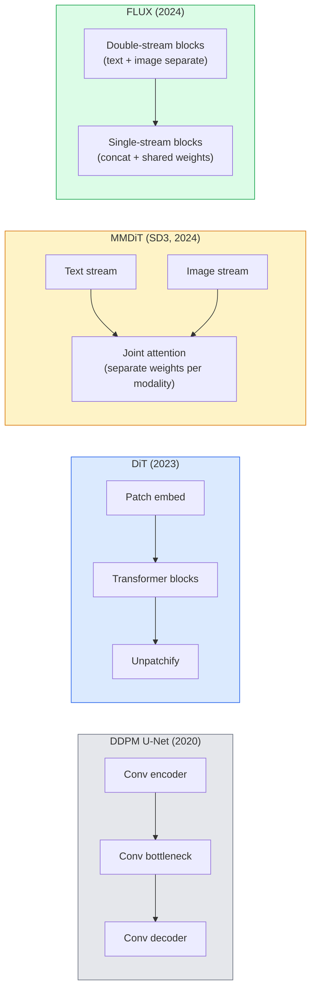

# Transformer Difusi & Aliran Diperbaiki

> U-Net bukanlah rahasia difusi. Gantilah dengan Transformer, tukar jadwal kebisingan dengan aliran garis lurus, dan tiba-tiba kamu memiliki SD3, FLUX, dan setiap model teks-ke-gambar tahun 2026.

**Type:** Learn + Build
**Language:** Python
**Prerequisites:** Phase 4 Lesson 10 (Difusi DDPM), Phase 4 Lesson 14 (ViT), Phase 7 Lesson 02 (Attention Diri)
**Waktu:** ~75 menit

## Tujuan Pembelajaran

- Telusuri evolusi dari U-Net DDPM (Lesson 10) ke Diffusion Transformer (DiT), MMDiT (SD3), dan DiT aliran tunggal+ganda (FLUX)
- Jelaskan aliran yang diperbaiki: mengapa lintasan garis lurus antara noise dan data memungkinkan model mengambil sample dalam 20 langkah, bukan 1000 langkah
- Menerapkan blok DiT kecil dan loop training aliran yang diperbaiki, keduanya di bawah 100 baris
- Membedakan varian model (SD3, FLUX.1-dev, FLUX.1-schnell, Z-Image, Qwen-Image) berdasarkan arsitektur, jumlah parameter, dan lisensi

## Masalah

Lesson 10 membuat DDPM dengan denoiser U-Net. Resep itu mendominasi tahun 2020-2023: U-Net + jadwal beta + hilangnya prediksi kebisingan. Ini menghasilkan Difusi Stabil 1.5 dan 2.1 dan DALL-E 2.

Setiap model text-to-image yang canggih pada tahun 2026 telah melampauinya. Difusi Stabil 3, FLUX, SD4, Z-Image, Qwen-Image, Hunyuan-Image — tidak ada yang menggunakan U-Net. Mereka menggunakan Diffusion Transformers (DiT). SD3 dan FLUX juga menukar jadwal kebisingan DDPM untuk aliran yang diperbaiki, yang meluruskan jalur dari kebisingan ke data dan memungkinkan inference 1-4 langkah dengan varian konsistensi atau sulingan.

Pergeseran ini penting karena itulah alasan pembuatan gambar berbasis difusi menjadi dapat dikontrol, akurat (render teks diselesaikan SD3/SD4), dan produksi cepat. Memahami aliran DiT + yang diperbaiki adalah memahami tumpukan gambar generatif 2026.

## Konsep

### Dari U-Net ke trafo



- **DiT** (Peebles & Xie, 2023) — mengganti U-Net dengan trafo mirip ViT pada patch laten. Pengkondisian melalui norm layer adaptif (AdaLN).
- **MMDiT** (SD3, Esser et al., 2024) — dua aliran dengan weight terpisah untuk token teks dan gambar yang berbagi attention bersama.
- **FLUX** (Black Forest Labs, 2024) — N pertama memblokir aliran ganda seperti SD3, kemudian blok digabungkan dan berbagi weight (aliran tunggal) untuk efisiensi pada kedalaman yang lebih tinggi.
- **Z-Image** (2025) — DiT aliran tunggal yang efisien dengan parameter 6 miliar yang menantang "skala dengan segala cara".

### Aliran yang diperbaiki dalam satu paragraf

DDPM mendefinisikan proses penerusan sebagai SDE yang berisik dimana `x_t` semakin rusak. Kebalikan yang dipelajari adalah SDE kedua, diselesaikan dengan 1000 langkah kecil.

Aliran yang diperbaiki mendefinisikan interpolasi **garis lurus** antara data bersih dan noise murni:

```
x_t = (1 - t) * x_0 + t * epsilon,     t in [0, 1]
```

Latih jaringan untuk memprediksi kecepatan `v_theta(x_t, t) = epsilon - x_0` — arah maju sepanjang jalur garis lurus dari data bersih ke noise (`dx_t/dt`). Selama pengambilan sample, kamu mengintegrasikan kecepatan ini ke belakang untuk berpindah dari kebisingan menuju data. ODE yang dihasilkan lebih mendekati garis lurus, sehingga langkah integrasi yang diperlukan untuk pengambilan sample jauh lebih sedikit.

SD3 menyebutnya **Pencocokan Aliran yang Diperbaiki**. FLUX, Z-Image, dan sebagian besar model 2026 menggunakan tujuan yang sama. Inference umum: 20-30 langkah Euler (deterministik) vs 50+ langkah DDIM di rezim DDPM lama. Varian sulingan / turbo / schnell / LCM menurunkannya menjadi 1-4 langkah.

### Pengondisian AdaLNKondisi DiT pada timestep dan kelas/teks melalui **norm layer adaptif**: prediksi `scale` dan `shift` dari vector pengkondisian dan terapkan setelah LayerNorm. Jauh lebih bersih daripada modulasi gaya FiLM di U-Nets dan standar di setiap DiT modern.

```
cond -> MLP -> (scale, shift, gate)
norm(x) * (1 + scale) + shift, then residual add * gate
```

### Pembuat enkode teks dalam SD3 dan FLUX

- **SD3** menggunakan tiga encoder teks: dua model CLIP + T5-XXL. Embedding digabungkan dan dimasukkan ke aliran gambar sebagai pengondisian teks.
- **FLUX** menggunakan satu CLIP-L + T5-XXL.
- Varian **Qwen-Image / Z-Image** menggunakan encoder teks internalnya sendiri yang selaras dengan LLM dasarnya.

Encoder teks adalah bagian besar mengapa alasan SD3/FLUX tentang prompt jauh lebih baik daripada SD1.5. T5-XXL sendiri adalah 4,7B parameter.

### Panduan bebas pengklasifikasi masih berlaku

Aliran yang diperbaiki mengubah sampler, bukan pengkondisian. Panduan bebas pengklasifikasi (lepaskan teks dengan probabilitas 10% selama training, gabungkan prediksi bersyarat dan tidak bersyarat pada inference) bekerja secara identik dengan aliran yang diperbaiki. Sebagian besar model tahun 2026 menggunakan skala panduan 3,5-5 — lebih rendah dari 7,5 pada SD1.5 karena model aliran yang diperbaiki mengikuti petunjuk dengan lebih ketat secara default.

### Konsistensi, Turbo, Schnell, LCM

Empat nama untuk ide yang sama: menyaring model banyak langkah yang lambat menjadi model beberapa langkah yang cepat.

- **LCM (Model Konsistensi Laten)** — melatih siswa yang memprediksi `x_0` final dari `x_t` perantara mana pun dalam satu langkah.
- **SDXL Turbo / FLUX schnell** — model 1-4 langkah yang dilatih dengan distilasi difusi adversarial.
- **SD ​​Turbo** — Model Konsistensi bergaya OpenAI yang disesuaikan dengan difusi laten.

Penyajian produksi setiap model baru mengirimkan pos pemeriksaan "kualitas penuh" dan varian "turbo / schnell". Schnell ("cepat" dalam bahasa Jerman, konvensi Black Forest Labs) berjalan dalam 1-4 langkah dan menyesuaikan pipeline pipa secara real-time.

### Model lanskap pada tahun 2026

| Model | Ukuran | Arsitektur | Lisensi |
|-------|------|--------------|---------|
| Difusi Stabil 3 Sedang | 2B | MMDiT | Komunitas SAI |
| Difusi Stabil 3,5 Besar | 8B | MMDiT | Komunitas SAI |
| FLUX.1-pengembangan | 12B | DiT Aliran Ganda + Tunggal | non-komersial |
| FLUX.1-schnell | 12B | sama, sulingan | Apache 2.0 |
| FLUKS.2 | — | FLUX.1 berulang | campuran |
| Z-Gambar | 6B | S3-DiT (Aliran Tunggal yang Dapat Diskalakan) | permisif |
| Qwen-Gambar | ~20 miliar | Menara teks DiT + Qwen | Apache 2.0 |
| Hunyuan-Gambar-3.0 | ~80B | DiT | penelitian |
| SD4 Turbo | 3B | DiT + distilasi | Komersial SAI |

FLUX.1-schnell adalah sumber terbuka default tahun 2026. Z-Image adalah pemimpin efisiensi. FLUX.2 dan SD4 adalah tip kualitas terkini.

### Mengapa pergeseran fase ini penting

DDPM + U-Net berfungsi. Aliran DiT + yang diperbaiki berfungsi **lebih baik, lebih cepat, dan berskala lebih bersih**. Transisi ini serupa dengan transisi dari RNN ke trafo di NLP: kedua arsitektur memecahkan masalah yang sama, namun trafo berkembang dan kini mendominasi. Setiap makalah tahun 2026 tentang gambar, video, atau generasi 3D menggunakan denoiser berbentuk DiT dan biasanya tujuan aliran yang diperbaiki. DDPM U-Net sekarang terutama bersifat pedagogis (Lesson 10).

## Build

### Langkah 1: Blok DiT dengan AdaLN

```python
import torch
import torch.nn as nn


class AdaLNZero(nn.Module):
    """
    Adaptive LayerNorm with a gate. Predicts (scale, shift, gate) from the conditioning.
    Init such that the whole block starts as identity ("zero init").
    """

    def __init__(self, dim, cond_dim):
        super().__init__()
        self.norm = nn.LayerNorm(dim, elementwise_affine=False)
        self.mlp = nn.Linear(cond_dim, dim * 3)
        nn.init.zeros_(self.mlp.weight)
        nn.init.zeros_(self.mlp.bias)

    def forward(self, x, cond):
        scale, shift, gate = self.mlp(cond).chunk(3, dim=-1)
        h = self.norm(x) * (1 + scale.unsqueeze(1)) + shift.unsqueeze(1)
        return h, gate.unsqueeze(1)


class DiTBlock(nn.Module):
    def __init__(self, dim=192, heads=3, mlp_ratio=4, cond_dim=192):
        super().__init__()
        self.adaln1 = AdaLNZero(dim, cond_dim)
        self.attn = nn.MultiheadAttention(dim, heads, batch_first=True)
        self.adaln2 = AdaLNZero(dim, cond_dim)
        self.mlp = nn.Sequential(
            nn.Linear(dim, dim * mlp_ratio),
            nn.GELU(),
            nn.Linear(dim * mlp_ratio, dim),
        )

    def forward(self, x, cond):
        h, gate1 = self.adaln1(x, cond)
        a, _ = self.attn(h, h, h, need_weights=False)
        x = x + gate1 * a
        h, gate2 = self.adaln2(x, cond)
        x = x + gate2 * self.mlp(h)
        return x
```

`AdaLNZero` dimulai sebagai pemetaan identitas karena weight MLP-nya diinisialisasi ke nol. Training menjauhkan diri dari identitas; ini menstabilkan model difusi Transformer dalam secara dramatis.

### Langkah 2: DiT kecil

```python
def timestep_embedding(t, dim):
    import math
    half = dim // 2
    freqs = torch.exp(-math.log(10000) * torch.arange(half, device=t.device) / half)
    args = t[:, None].float() * freqs[None]
    return torch.cat([args.sin(), args.cos()], dim=-1)


class TinyDiT(nn.Module):
    def __init__(self, image_size=16, patch_size=2, in_channels=3, dim=96, depth=4, heads=3):
        super().__init__()
        self.patch_size = patch_size
        self.num_patches = (image_size // patch_size) ** 2
        self.patch = nn.Conv2d(in_channels, dim, kernel_size=patch_size, stride=patch_size)
        self.pos = nn.Parameter(torch.zeros(1, self.num_patches, dim))
        self.time_mlp = nn.Sequential(
            nn.Linear(dim, dim * 2),
            nn.SiLU(),
            nn.Linear(dim * 2, dim),
        )
        self.blocks = nn.ModuleList([DiTBlock(dim, heads, cond_dim=dim) for _ in range(depth)])
        self.norm_out = nn.LayerNorm(dim, elementwise_affine=False)
        self.head = nn.Linear(dim, patch_size * patch_size * in_channels)

    def forward(self, x, t):
        n = x.size(0)
        x = self.patch(x)
        x = x.flatten(2).transpose(1, 2) + self.pos
        t_emb = self.time_mlp(timestep_embedding(t, self.pos.size(-1)))
        for blk in self.blocks:
            x = blk(x, t_emb)
        x = self.norm_out(x)
        x = self.head(x)
        return self._unpatchify(x, n)

    def _unpatchify(self, x, n):
        p = self.patch_size
        h = w = int(self.num_patches ** 0.5)
        x = x.view(n, h, w, p, p, -1).permute(0, 5, 1, 3, 2, 4).reshape(n, -1, h * p, w * p)
        return x
```

### Langkah 3: Training aliran yang diperbaiki

```python
import torch.nn.functional as F

def rectified_flow_train_step(model, x0, optimizer, device):
    model.train()
    x0 = x0.to(device)
    n = x0.size(0)
    t = torch.rand(n, device=device)
    epsilon = torch.randn_like(x0)
    x_t = (1 - t[:, None, None, None]) * x0 + t[:, None, None, None] * epsilon

    target_velocity = epsilon - x0
    pred_velocity = model(x_t, t)

    loss = F.mse_loss(pred_velocity, target_velocity)
    optimizer.zero_grad()
    loss.backward()
    optimizer.step()
    return loss.item()
```Bandingkan dengan loss prediksi kebisingan DDPM (Lesson 10): struktur sama, target berbeda. Daripada memprediksi derau `epsilon`, kami memprediksi **kecepatan** `epsilon - x_0`, yang menunjuk dari data ke derau sepanjang interpolasi garis lurus.

### Langkah 4: Pengambil sample Euler

Aliran yang diperbaiki adalah ODE. Metode Euler adalah yang paling sederhana dan, untuk model aliran rektifikasi yang terlatih, hampir sama akuratnya dengan pemecah tingkat tinggi pada 20+ langkah.

```python
@torch.no_grad()
def rectified_flow_sample(model, shape, steps=20, device="cpu"):
    model.eval()
    x = torch.randn(shape, device=device)
    dt = 1.0 / steps
    t = torch.ones(shape[0], device=device)
    for _ in range(steps):
        v = model(x, t)
        x = x - dt * v
        t = t - dt
    return x
```

20 langkah. Pada model terlatih, hal ini menghasilkan sample yang sebanding dengan DDPM 1000 langkah.

### Langkah 5: Uji asap menyeluruh

```python
import numpy as np

def synthetic_blobs(num=200, size=16, seed=0):
    rng = np.random.default_rng(seed)
    out = np.zeros((num, 3, size, size), dtype=np.float32)
    yy, xx = np.meshgrid(np.arange(size), np.arange(size), indexing="ij")
    for i in range(num):
        cx, cy = rng.uniform(4, size - 4, size=2)
        r = rng.uniform(2, 4)
        mask = (xx - cx) ** 2 + (yy - cy) ** 2 < r ** 2
        colour = rng.uniform(-1, 1, size=3)
        for c in range(3):
            out[i, c][mask] = colour[c]
    return torch.from_numpy(out)
```

Latih `TinyDiT` dalam hal ini dengan aliran yang diperbaiki. Setelah 500 langkah, output sample akan terlihat seperti gumpalan warna yang samar.

## Pakai

Untuk pembuatan gambar nyata dengan FLUX / SD3 / Z-Image, `diffusers` mengirimkan semuanya dengan API terpadu:

```python
from diffusers import FluxPipeline, StableDiffusion3Pipeline
import torch

pipe = FluxPipeline.from_pretrained(
    "black-forest-labs/FLUX.1-schnell",
    torch_dtype=torch.bfloat16,
).to("cuda")

out = pipe(
    prompt="a golden retriever surfing a tsunami, hyperrealistic, studio lighting",
    guidance_scale=0.0,           # schnell was trained without CFG
    num_inference_steps=4,
    max_sequence_length=256,
).images[0]
out.save("surf.png")
```

Tiga baris. `FLUX.1-schnell` dalam empat langkah. Tukar id model dengan `black-forest-labs/FLUX.1-dev` untuk kualitas lebih tinggi dalam 20-30 langkah dengan CFG.

Untuk SD3:

```python
pipe = StableDiffusion3Pipeline.from_pretrained(
    "stabilityai/stable-diffusion-3.5-large",
    torch_dtype=torch.bfloat16,
).to("cuda")
out = pipe(prompt, guidance_scale=3.5, num_inference_steps=28).images[0]
```

## Kirim

Lesson ini menghasilkan:

- `outputs/prompt-dit-model-picker.md` — memilih antara SD3, FLUX.1-dev, FLUX.1-schnell, Z-Image, SD4 Turbo dengan mempertimbangkan batasan kualitas, latensi, dan lisensi.
- `outputs/skill-rectified-flow-trainer.md` — menulis loop training lengkap untuk aliran yang diperbaiki dengan pengambilan sample AdaLN DiT dan Euler.

## Latihan

1. **(Mudah)** Latih TinyDiT di atas pada dataset blob sintetis sebanyak 500 langkah. Bandingkan sample yang dihasilkan dengan langkah Euler 10, 20, dan 50.
2. **(Medium)** Tambahkan pengondisian teks dengan menggabungkan embedding kelas yang dipelajari ke embedding waktu (10 "kelas" gumpalan berdasarkan warna). Sample dengan kelas 0, 5, dan 9 dan verifikasi kecocokan warna.
3. **(Hard)** Hitung distance Fréchet (proksi FID) antara sample yang dihasilkan dari aliran yang diperbaiki dan versi DDPM dari jaringan berukuran sama yang dilatih pada data yang sama untuk jumlah langkah yang sama. Laporkan mana yang menyatu lebih cepat.

## Istilah Kunci

| Istilah | Apa kata orang | Apa sebenarnya arti |
|------|----------------|----------------------|
| DiT | "Transformer difusi" | Transformer yang menggantikan U-Net sebagai denoiser difusi; beroperasi pada laten yang ditambal |
| AdaLN | "Norm layer adaptif" | Pengkondisian langkah waktu/teks melalui skala yang dipelajari, pergeseran, gerbang yang diterapkan setelah LayerNorm; standar di setiap DiT modern |
| MMDiT | "DiT Multimodal (SD3)" | Pisahkan aliran weight untuk token teks dan gambar yang berbagi attention diri bersama |
| Aliran tunggal / aliran ganda | "Trik FLUX" | N pertama memblokir aliran ganda (memisahkan weight per modalitas), kemudian memblokir aliran tunggal (concat + weight bersama) untuk efisiensi |
| Aliran diperbaiki | "Kebisingan-ke-data garis lurus" | Interpolasi linier antara data dan noise; jaringan memprediksi kecepatan; lebih sedikit langkah ODE yang diperlukan pada inference |
| Target kecepatan | "epsilon - x_0" | Target regresi pada aliran yang diperbaiki; poin dari data bersih hingga kebisingan |
| Panduan CFG | "panduan bebas pengklasifikasi" | Campurkan prediksi bersyarat dan tidak bersyarat; masih digunakan dalam model aliran yang diperbaiki |
| Schnell / turbo / LCM | "distilasi 1-4 langkah" | Varian langkah kecil disaring dari model berkualitas penuh; produksi waktu nyata |

## Bacaan Lanjutan- [Model Difusi yang Dapat Diskalakan dengan Transformer (Peebles & Xie, 2023)](https://arxiv.org/abs/2212.09748) — makalah DiT
- [Scaling Rectified Flow Transformers (Esser et al., makalah SD3)](https://arxiv.org/abs/2403.03206) — MMDiT dan aliran yang diperbaiki dalam skala besar
- [Kartu model dan laporan teknis FLUX.1 (Black Forest Labs)](https://huggingface.co/black-forest-labs/FLUX.1-dev) — detail aliran ganda + tunggal
- [Z-Image: Efficient Image Generation Foundation Model (2025)](https://arxiv.org/html/2511.22699v1) — DiT aliran tunggal pada 6B
- [Elucidating the Design Space of Diffusion (Karras et al., 2022)](https://arxiv.org/abs/2206.00364) — referensi untuk setiap trade-off desain difusi
- [Model Konsistensi Laten (Luo et al., 2023)](https://arxiv.org/abs/2310.04378) — bagaimana LCM-LoRA memberi kamu inference 4 langkah
