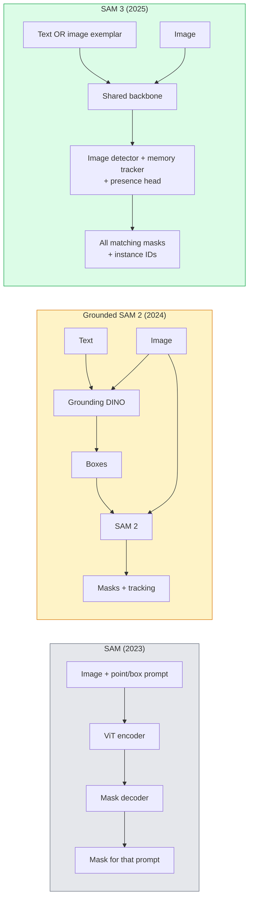

# SAM 3 & Segmentasi Kosakata Terbuka

> Berikan model prompt teks dan gambar dan dapatkan masker untuk setiap objek yang cocok. SAM 3 menjadikannya satu umpan ke depan.

**Type:** Gunakan + Build
**Language:** Python
**Prerequisites:** Phase 4 Lesson 07 (U-Net), Phase 4 Lesson 08 (Mask R-CNN), Phase 4 Lesson 18 (CLIP)
**Waktu:** ~60 menit

## Tujuan Pembelajaran

- Bedakan SAM (hanya prompt visual), SAM Beralas / SAM 2 (detektor + SAM), dan SAM 3 (prompt teks asli melalui Segmentasi Konsep yang Dapat Diminta)
- Jelaskan arsitektur SAM 3: tulang punggung bersama + detektor gambar + pelacak video berbasis memori + kepala kehadiran + desain detektor-pelacak yang dipisahkan
- Gunakan integrasi Hugging Face `transformers` SAM 3 untuk deteksi, segmentasi, dan pelacakan video yang diminta teks
- Pilih antara SAM 3, Grounded SAM 2, YOLO-World, dan SAM-MI berdasarkan latensi, kompleksitas konsep, dan target penerapan

## Masalah

SAM 2023 adalah model visual-prompt saja: kamu mengklik sebuah titik atau menggambar kotak dan ia mengembalikan topeng. Untuk "berikan saya semua jeruk di foto ini" kamu memerlukan detektor (Grounding DINO) untuk menghasilkan kotak, lalu SAM untuk mensegmentasi masing-masing kotak. SAM yang dibumikan mengubahnya menjadi sebuah pipeline pipa, tetapi ini adalah rangkaian dua model yang dibekukan dengan akumulasi kesalahan yang tak terhindarkan.

SAM 3 (Meta, Nov 2025, ICLR 2026) meruntuhkan kaskade. Ia menerima frase kata benda pendek atau contoh gambar sebagai prompt dan mengembalikan semua topeng dan ID instance yang cocok dalam satu forward pass. Yaitu **Segmentasi Konsep yang Dapat Diminta (PCS)**. Dikombinasikan dengan pembaruan Object Multiplex Maret 2026 (SAM 3.1), ini melacak beberapa contoh konsep yang sama melalui video secara efisien.

Lesson ini adalah tentang perubahan struktural yang diwakilinya. Segmen 2D, deteksi, dan landasan gambar teks telah digabungkan menjadi satu model. Pertanyaan produksi bukan lagi "pipa mana yang saya rangkai bersama" tetapi "model yang dapat diminta mana yang menangani kasus penggunaan saya secara end-to-end."

## Konsep

### Tiga generasi



### Segmentasi Konsep yang Dapat Diminta

"Permintaan konsep" adalah frasa kata benda pendek (`"yellow school bus"`, `"striped red umbrella"`, `"hand holding a mug"`) atau contoh gambar. Model mengembalikan masker segmentasi untuk setiap contoh dalam gambar yang cocok dengan konsep, ditambah ID contoh unik per kecocokan.

Ini berbeda dari SAM visual-prompt klasik dalam tiga hal:

1. Tidak diperlukan prompt per instance — satu prompt teks mengembalikan semua kecocokan.
2. Kosakata terbuka - konsepnya dapat berupa apa saja yang dapat dijelaskan dalam bahasa alami.
3. Mengembalikan beberapa instance sekaligus, bukan satu mask per prompt.

### Karya arsitektur utama

- **Tulang punggung bersama** — satu ViT memproses gambar. Baik kepala detektor maupun pelacak berbasis memori membacanya.
- **Presence head** — memprediksi apakah konsep tersebut ada dalam gambar atau tidak. Memisahkan "apakah ini di sini?" dari "di mana itu?". Mengurangi kesalahan positif pada konsep yang tidak ada.
- **Pelacak-detektor terpisah** — deteksi tingkat gambar dan pelacakan tingkat video memiliki head terpisah sehingga tidak mengganggu.
- **Bank memori** — menyimpan feature per instans di seluruh frame untuk pelacakan video (mekanisme yang sama yang digunakan SAM 2).

### Training dalam skala besarSAM 3 dilatih tentang **4 juta konsep unik** yang dihasilkan oleh mesin data yang memberikan anotasi dan koreksi berulang menggunakan AI + tinjauan manusia. **Tolok ukur SA-CO** yang baru berisi 270 ribu konsep unik, 50x lebih besar dari tolok ukur sebelumnya. SAM 3 mencapai 75-80% kinerja manusia pada SA-CO dan menggandakan sistem yang ada pada PCS gambar + video.

### SAM 3.1 Objek Multipleks

Pembaruan Maret 2026: **Object Multiplex** memperkenalkan mekanisme memori bersama untuk pelacakan bersama banyak instance dari konsep yang sama sekaligus. Sebelumnya, pelacakan N instance berarti N bank memori terpisah. Multipleks menciutkannya menjadi satu memori bersama dengan kueri per instans. Hasilnya: pelacakan multi-objek jauh lebih cepat tanpa mengorbankan akurasi.

### Dimana SAM Beralas masih penting pada tahun 2026

- Saat kamu membutuhkan detektor kosakata terbuka tertentu untuk ditukar (DINO-X, Florence-2).
- Ketika lisensi SAM 3 (berpagar pada HF) adalah pemblokir.
- Saat kamu memerlukan kontrol lebih besar atas ambang detektor daripada yang dipaparkan SAM 3.
- Untuk pekerjaan penelitian/ablasi pada komponen detektor.

Pipeline pipa modular masih memiliki tempatnya. Untuk sebagian besar pekerjaan produksi, SAM 3 adalah jawaban yang lebih sederhana.

### YOLO-Dunia vs SAM 3

- **YOLO-World** — hanya pendeteksi kosakata terbuka (tanpa masker). Waktu nyata. Paling baik saat kamu membutuhkan kotak dengan fps tinggi.
- **SAM 3** — segmentasi penuh + pelacakan. Output lebih lambat namun lebih kaya.

Pembagian produksi: YOLO-World untuk pipeline pipa yang hanya dapat mendeteksi cepat (navigasi robotik, dasbor cepat), SAM 3 untuk apa pun yang memerlukan masker atau pelacakan.

### Efisiensi SAM-MI

SAM-MI (2025-2026) mengatasi hambatan dekoder SAM. Ide-ide kunci:

- **Permintaan titik jarang** — menggunakan beberapa titik yang dipilih dengan baik, bukan prompt padat; mengurangi panggilan decoder sebesar 96%.
- **Agregasi topeng dangkal** — menggabungkan prediksi topeng kasar menjadi satu topeng yang lebih tajam.
- **Injeksi masker terpisah** — dekoder menerima feature masker yang telah dihitung sebelumnya, bukan menjalankannya kembali.

Hasil: ~1,6× percepatan dibandingkan Grounded-SAM pada tolok ukur kosakata terbuka.

### Format output untuk ketiga model

Semua mengembalikan struktur umum yang sama (kotak + label + skor + masker + ID), yang berguna — alur hilir kamu tidak harus bercabang pada model mana yang dijalankan.

## Build

### Langkah 1: Konstruksi cepat

Buat pembantu yang mengubah kalimat pengguna menjadi daftar petunjuk konsep SAM 3. Ini adalah batas di mana "apa yang diketik pengguna" bertemu dengan "apa yang dikonsumsi model".

```python
def split_concepts(sentence):
    """
    Heuristic splitter for multi-concept prompts.
    Returns list of short noun phrases.
    """
    for sep in [",", ";", "and", "or", "&"]:
        if sep in sentence:
            parts = [p.strip() for p in sentence.replace("and ", ",").split(",")]
            return [p for p in parts if p]
    return [sentence.strip()]

print(split_concepts("cats, dogs and balloons"))
```

SAM 3 menerima satu konsep per forward pass; untuk kueri multi-konsep, ulangi atau batchkan kueri tersebut.

### Langkah 2: Pembantu pasca-pemrosesan

Ubah output mentah SAM 3 menjadi daftar deteksi bersih yang cocok dengan kontrak pipeline Fase 4 Lesson 16 kami.

```python
from dataclasses import dataclass
from typing import List

@dataclass
class ConceptDetection:
    concept: str
    instance_id: int
    box: tuple          # (x1, y1, x2, y2)
    score: float
    mask_rle: str       # run-length encoded


def rle_encode(binary_mask):
    flat = binary_mask.flatten().astype("uint8")
    runs = []
    prev, count = flat[0], 0
    for v in flat:
        if v == prev:
            count += 1
        else:
            runs.append((int(prev), count))
            prev, count = v, 1
    runs.append((int(prev), count))
    return ";".join(f"{v}x{c}" for v, c in runs)
```

RLE menjaga muatan respons tetap kecil bahkan untuk banyak masker resolusi tinggi. Format yang sama berfungsi di SAM 2, SAM 3, Grounded SAM 2.

### Langkah 3: Antarmuka segmentasi kosakata terbuka terpadu

Bungkus backend apa pun yang kamu miliki (SAM 3, Grounded SAM 2, YOLO-World + SAM 2) di belakang satu metode. Code hilir kamu tidak berubah ketika backend berubah.

```python
from abc import ABC, abstractmethod
import numpy as np

class OpenVocabSeg(ABC):
    @abstractmethod
    def detect(self, image: np.ndarray, concept: str) -> List[ConceptDetection]:
        ...


class StubOpenVocabSeg(OpenVocabSeg):
    """
    Deterministic stub used for pipeline testing when real models are not loaded.
    """
    def detect(self, image, concept):
        h, w = image.shape[:2]
        return [
            ConceptDetection(
                concept=concept,
                instance_id=0,
                box=(w * 0.2, h * 0.3, w * 0.5, h * 0.8),
                score=0.89,
                mask_rle="0x100;1x50;0x200",
            ),
            ConceptDetection(
                concept=concept,
                instance_id=1,
                box=(w * 0.55, h * 0.25, w * 0.85, h * 0.75),
                score=0.74,
                mask_rle="0x80;1x40;0x220",
            ),
        ]
```

Subkelas `SAM3OpenVocabSeg` yang sebenarnya akan membungkus `transformers.Sam3Model` dan `Sam3Processor`.

### Langkah 4: Penggunaan SAM 3 Memeluk Wajah (referensi)

Untuk model sebenarnya, integrasi `transformers`:

```python
from transformers import Sam3Processor, Sam3Model
import torch

processor = Sam3Processor.from_pretrained("facebook/sam3")
model = Sam3Model.from_pretrained("facebook/sam3").eval()

inputs = processor(images=pil_image, return_tensors="pt")
inputs = processor.set_text_prompt(inputs, "yellow school bus")

with torch.no_grad():
    outputs = model(**inputs)

masks = processor.post_process_masks(
    outputs.masks, inputs.original_sizes, inputs.reshaped_input_sizes
)
boxes = outputs.boxes
scores = outputs.scores
```

Satu prompt, semua kecocokan dikembalikan dalam satu panggilan.

### Langkah 5: Ukur apa yang diberikan Grounded SAM 2 kepada kamu secara gratis

Tolok ukur yang jujur: apa yang terjadi jika kamu mengganti Grounded SAM 2 dengan SAM 3 di pipeline sebenarnya?- Latensi: SAM 3 menghemat satu forward pass (tidak ada detektor terpisah) tetapi modelnya sendiri lebih berat; biasanya net-netral atau sedikit percepatan.
- Akurasi: SAM 3 jauh lebih baik pada konsep langka atau komposisi ("payung merah bergaris"). Mirip dengan konsep satu kata yang umum.
- Fleksibilitas: Grounded SAM 2 memungkinkan kamu menukar detektor (DINO-X, Florence-2, Grounding DINO 1.5); SAM 3 bersifat monolitik.

Kesimpulan: SAM 3 adalah default untuk segmen kosakata terbuka tahun 2026. SAM 2 yang dibumikan masih merupakan jawaban yang tepat ketika kamu memerlukan fleksibilitas detektor atau persyaratan lisensi yang berbeda.

## Pakai

Pola penyebaran produksi:

- **Anotasi real-time** — SAM 3 + feature label-as-text-prompt CVAT. Anotator memilih nama label; SAM 3 memberi label awal pada setiap instance yang cocok. Tinjau dan perbaiki.
- **Analisis video** — SAM 3.1 Object Multiplex untuk pelacakan multi-objek; memasukkan frame ke pelacak berbasis memori.
- **Robotika** — SAM 3 untuk manipulasi kosakata terbuka ("ambil cangkir merah"); berjalan sebagai perencanaan primitif.
- **Pencitraan medis** — SAM 3 menyempurnakan konsep medis; memerlukan permintaan akses pada HF.

Ultralytics membungkus SAM 3 dalam paket Python-nya:

```python
from ultralytics import SAM

model = SAM("sam3.pt")
results = model(image_path, prompts="yellow school bus")
```

Antarmuka yang sama seperti YOLO dan SAM 2.

## Kirim

Lesson ini menghasilkan:

- `outputs/prompt-open-vocab-stack-picker.md` — prompt yang memilih SAM 3 / Grounded SAM 2 / YOLO-World / SAM-MI berdasarkan latensi, kompleksitas konsep, dan lisensi.
- `outputs/skill-concept-prompt-designer.md` — keterampilan yang mengubah ucapan pengguna menjadi prompt konsep SAM 3 yang tersusun dengan baik (pemisahan, disambiguasi, fallback).

## Latihan

1. **(Mudah)** Jalankan SAM 3 pada 10 gambar dengan petunjuk konsep yang kamu pilih. Bandingkan dengan SAM 2 + Grounding DINO 1.5 pada gambar yang sama. Laporkan konsep mana yang terlewatkan oleh setiap model.
2. **(Medium)** Buat UI "klik untuk menyertakan / klik untuk mengecualikan" di atas SAM 3: prompt teks menampilkan contoh kandidat; klik pengguna mempertahankan mana yang dianggap positif. Keluarkan kumpulan konsep akhir sebagai JSON.
3. **(Keras)** Sempurnakan SAM 3 pada rangkaian konsep khusus (misalnya 5 jenis komponen elektronik) dengan masing-masing 20 gambar berlabel. Bandingkan dengan zero-shot SAM 3 pada set pengujian yang sama; mengukur peningkatan IoU masker.

## Istilah Kunci

| Istilah | Apa kata orang | Apa sebenarnya arti |
|------|----------------|----------------------|
| Segmentasi kosakata terbuka | "Segmen berdasarkan teks" | Menghasilkan topeng untuk objek yang dideskripsikan dalam bahasa alami, bukan kumpulan label tetap |
| buah | "Segmentasi Konsep yang Dapat Diminta" | Tugas inti SAM 3 — diberi contoh kata benda atau gambar, mengelompokkan semua contoh yang cocok |
| Konsep cepat | "Input teks" | Contoh frasa atau gambar kata benda pendek; bukan kalimat lengkap |
| Kehadiran kepala | "Apakah di sini?" | Modul SAM 3 yang memutuskan apakah konsep tersebut ada pada gambar sebelum pelokalan |
| SA-CO | "Patokan SAM 3" | Tolok ukur segmentasi kosakata terbuka konsep 270K; 50x lebih besar dari tolok ukur kosakata terbuka sebelumnya |
| Multipleks Objek | "Pembaruan SAM 3.1" | Pelacakan multi-objek memori bersama; pelacakan gabungan cepat dari banyak contoh |
| SAM Beralas 2 | "Pipa modular" | Detektor + kaskade SAM 2; masih relevan ketika pertukaran detektor penting |
| SAM-MI | "Varian SAM yang efisien" | Injeksi Masker untuk percepatan 1,6x melalui Grounded-SAM |

## Bacaan Lanjutan- [SAM 3: Segmentasikan Apa Pun dengan Konsep (arXiv 2511.16719)](https://arxiv.org/abs/2511.16719)
- [SAM 3.1 Object Multiplex (Meta AI, Maret 2026)](https://ai.meta.com/blog/segment-anything-model-3/)
- [Halaman model SAM 3 di Hugging Face](https://huggingface.co/facebook/sam3)
- [Tutorial SAM Beralas 2 (PyImageSearch)](https://pyimagesearch.com/2026/01/19/grounded-sam-2-from-open-set-detection-to-segmentation-and-tracking/)
- [Dokumen Ultralytics SAM 3](https://docs.ultralytics.com/models/sam-3/)
- [SAM3-I: SAM yang sadar akan instruksi (arXiv 2512.04585)](https://arxiv.org/abs/2512.04585)
