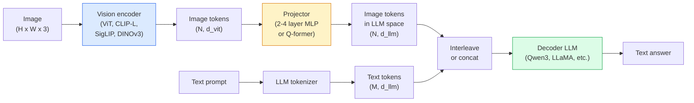

# Model Bahasa Visi — Pola ViT-MLP-LLM

> Encoder visi mengubah gambar menjadi token. Proyektor MLP memetakan token tersebut ke dalam ruang embedding LLM. Model bahasa akan melakukan sisanya. Pola tersebut — ViT-MLP-LLM — adalah setiap VLM produksi pada tahun 2026.

**Type:** Learn + Gunakan
**Language:** Python
**Prerequisites:** Phase 4 Lesson 14 (ViT), Phase 4 Lesson 18 (CLIP), Phase 7 Lesson 02 (Attention Diri)
**Waktu:** ~75 menit

## Tujuan Pembelajaran

- Nyatakan arsitektur ViT-MLP-LLM dan jelaskan kontribusi masing-masing dari ketiga komponen tersebut
- Bandingkan Qwen3-VL, InternVL3.5, LLaVA-Next, dan GLM-4.6V pada jumlah parameter, panjang konteks, dan kinerja benchmark
- Jelaskan DeepStack: mengapa feature ViT multi-level memperketat keselarasan bahasa penglihatan lebih baik daripada feature layer terakhir tunggal
- Ukur halusinasi VLM dalam produksi dengan Cross-Modal Error Rate (CMER) dan bertindak berdasarkan sinyal

## Masalah

CLIP (Fase 4 Lesson 18) memberi kamu ruang embedding bersama untuk gambar dan teks, yang cukup untuk klasifikasi dan pengambilan zero-shot. Ia tidak bisa menjawab "berapa banyak mobil merah di gambar ini?" karena CLIP tidak menghasilkan teks — CLIP hanya mencetak kesamaan.

Model Bahasa Visi (VLM) — Qwen3-VL, InternVL3.5, LLaVA-Next, GLM-4.6V — memasang encoder gambar keluarga CLIP ke model bahasa lengkap. Model melihat gambar ditambah pertanyaan dan menghasilkan jawaban. Pada tahun 2026, VLM sumber terbuka menyaingi atau mengalahkan GPT-5 dan Gemini-2.5-Pro ​​pada tolok ukur multimodal (MMMU, MMBench, DocVQA, ChartQA, MathVista, OSWorld).

Trio bagian (ViT, proyektor, LLM) adalah standarnya. Perbedaan antar model terletak pada ViT yang mana, proyektor yang mana, LLM yang mana, training data, dan resep penyelarasan. Setelah kamu memahami polanya, menukar komponen apa pun bersifat mekanis.

## Konsep

### Arsitektur ViT-MLP-LLM



1. **Vision encoder** — ViT yang telah dilatih sebelumnya (CLIP-L/14, SigLIP, DINOv3, atau varian yang telah disesuaikan). Menghasilkan token tambalan.
2. **Proyektor** — modul kecil (MLP 2-4 layer, atau Q-former) yang memetakan token visi ke dalam dimension embedding LLM. Di sinilah sebagian besar penyesuaian terjadi.
3. **LLM** — model bahasa khusus decoder (Qwen3, Llama, Mistral, GLM, InternLM). Membaca token visi + teks secara berurutan, menghasilkan teks.

Ketiga bagian tersebut pada prinsipnya dapat dilatih. Dalam praktiknya, vision encoder dan LLM sebagian besar tetap membeku saat proyektor berlatih — beberapa miliar parameter sinyal dengan harga murah.

### DeepStack

Proyeksi vanilla hanya menggunakan layer ViT terakhir. DeepStack (Qwen3-VL) mengambil sample feature dari berbagai kedalaman ViT dan menumpuknya. Layer yang lebih dalam membawa semantik tingkat tinggi; layer yang lebih dangkal membawa informasi spasial dan tekstur yang sangat rinci. Memasukkan keduanya ke dalam LLM menutup kesenjangan antara "apa isi gambar" (semantik) dan "di mana tepatnya" (landasan spasial).

### Tiga phase training

VLM modern berlatih secara bertahap:

1. **Penyelarasan** — membekukan ViT dan LLM. Latih hanya proyektor pada pasangan keterangan gambar. Mengajarkan proyektor untuk memetakan ruang penglihatan ke dalam ruang bahasa.
2. **Pra-training** — mencairkan semuanya. Latih data gambar-teks sisipan skala besar (500 juta+ pasang). Membangun pengetahuan visual model.
3. **Penyetelan instruksi** — menyempurnakan tiga kali lipat (gambar, pertanyaan, jawaban). Mengajarkan perilaku percakapan dan format tugas. Inilah yang mengubah "LM yang sadar akan penglihatan" menjadi asisten yang dapat digunakan.

Kebanyakan penyempurnaan LoRA menargetkan phase 3 dengan dataset berlabel kecil.### Perbandingan keluarga model (awal 2026)

| Model | Param | Encoder visi | LLM | Konteks | Kekuatan |
|-------|--------|----------------|-----|---------|-----------|
| Qwen3-VL-235B-A22B (MoE) | 235B (22B aktif) | ViT + DeepStack khusus | Qwen3 | 256K | SOTA Umum, agen GUI |
| Qwen3-VL-30B-A3B (MoE) | 30B (3B aktif) | ViT + DeepStack khusus | Qwen3 | 256K | Alternatif MoE yang lebih kecil |
| Qwen3-VL-8B (padat) | 8B | ViT khusus | Qwen3 | 128K | Default padat produksi |
| MagangVL3.5-38B | 38B | MagangViT-6B | Qwen3 + GPT-OSS | 128K | MMBench / MMVet yang kuat |
| MagangVL3.5-241B-A28B | 241B (28B aktif) | MagangViT-6B | Qwen3 | 128K | Kompetitif dengan GPT-4o |
| LLaVA-Berikutnya 72B | 72B | SigLIP | Llama-3 | 32K | Terbuka, mudah untuk disempurnakan |
| GLM-4.6V | ~70B | adat | GLM | 64K | Sumber terbuka, OCR kuat |
| BPS Mini-V-2.6 | 8B | SigLIP | BPS Mini | 32K | Ramah tepi |

### Agen visual

Qwen3-VL-235B mencapai kinerja global teratas di OSWorld — tolok ukur untuk **agen visual** yang mengoperasikan GUI (desktop, seluler, web). Model melihat tangkapan layar, memahami UI, dan melakukan tindakan (klik, ketik, gulir). Dikombinasikan dengan alat, ini menutup loop pada tugas-tugas desktop umum. Inilah yang dijalankan oleh sebagian besar demo "AI PC" tahun 2026.

### Kemampuan agen + varian RoPE

VLM perlu mengetahui **kapan** sebuah frame ada dalam video. Qwen3-VL berevolusi dari T-RoPE (embedding posisi putar sementara) menjadi **penyelarasan waktu berbasis teks** — token teks stempel waktu eksplisit yang disisipkan dengan bingkai video. Model melihat "`<timestamp 00:32>` frame, prompt" dan dapat mempertimbangkan hubungan temporal.

### Masalah penyelarasan

12% pasangan gambar-teks dalam dataset yang dirayapi berisi deskripsi yang tidak sepenuhnya didasarkan pada gambar. VLM yang dilatih dalam hal ini secara diam-diam belajar berhalusinasi - mengarang objek, salah membaca angka, menciptakan hubungan. Dalam produksi, ini adalah mode kegagalan yang dominan.

Skywork.ai memperkenalkan **Tingkat Kesalahan Lintas Modal (CMER)** untuk melacaknya:

```
CMER = fraction of outputs where the text confidence is high but the image-text similarity (via a CLIP-family checker) is low
```

CMER yang tinggi berarti model tersebut dengan percaya diri mengatakan hal-hal yang tidak didasarkan pada gambar. Memantau CMER dan memperlakukannya sebagai KPI produksi mengurangi tingkat halusinasi sebesar ~35% dalam penerapannya. Triknya bukanlah "memperbaiki model" tetapi "mengarahkan output CMER tinggi ke tinjauan manusia".

### Menyempurnakan dengan LoRA / QLoRA

Penyempurnaan penuh VLM 70B berada di luar jangkauan sebagian besar tim. LoRA (peringkat 16-64) pada layer attention + proyektor, atau QLoRA dengan weight dasar 4-bit, cocok pada satu A100 / H100. Biaya: 5.000-50.000 contoh, komputasi $100-$5.000, training 2-10 jam.

### Penalaran spasial masih lemah

VLM saat ini mendapat skor 50-60% pada tolok ukur penalaran spasial (atas-bawah, kiri-kanan, penghitungan, distance). Jika kasus penggunaan kamu bergantung pada "objek mana yang berada di atasnya", validasi secara intensif — kinerja VLM generik berada di bawah kinerja manusia. Alternatif yang lebih baik dari VLM untuk tugas spasial murni: penaksir titik kunci/pose khusus, model kedalaman, atau model deteksi dengan geometri kotak pasca-pemrosesan.

## Build

### Langkah 1: Proyektor

Bagian yang paling sering kamu latih. MLP 2-4 lapis dengan GELU.

```python
import torch
import torch.nn as nn


class Projector(nn.Module):
    def __init__(self, vit_dim=768, llm_dim=4096, hidden=4096):
        super().__init__()
        self.net = nn.Sequential(
            nn.Linear(vit_dim, hidden),
            nn.GELU(),
            nn.Linear(hidden, llm_dim),
        )

    def forward(self, x):
        return self.net(x)
```

Masukannya adalah tensor token `(N_patches, d_vit)`. Keluarannya adalah `(N_patches, d_llm)`. LLM memperlakukan setiap baris output hanya sebagai token lain.

### Langkah 2: Rakit ViT-MLP-LLM secara end-to-end

Kerangka umpan ke depan untuk VLM minimal. Code asli menggunakan `transformers`; ini adalah tata letak konseptual.

```python
class MinimalVLM(nn.Module):
    def __init__(self, vit, projector, llm, image_token_id):
        super().__init__()
        self.vit = vit
        self.projector = projector
        self.llm = llm
        self.image_token_id = image_token_id  # placeholder token in text prompt

    def forward(self, image, input_ids, attention_mask):
        # 1. vision features
        vision_tokens = self.vit(image)                     # (B, N_patches, d_vit)
        vision_embeds = self.projector(vision_tokens)       # (B, N_patches, d_llm)

        # 2. text embeddings
        text_embeds = self.llm.get_input_embeddings()(input_ids)  # (B, M, d_llm)

        # 3. replace image placeholder tokens with vision embeds
        merged = self._merge(text_embeds, vision_embeds, input_ids)

        # 4. run LLM
        return self.llm(inputs_embeds=merged, attention_mask=attention_mask)

    def _merge(self, text_embeds, vision_embeds, input_ids):
        out = text_embeds.clone()
        expected = vision_embeds.size(1)
        for b in range(input_ids.size(0)):
            positions = (input_ids[b] == self.image_token_id).nonzero(as_tuple=True)[0]
            if len(positions) != expected:
                raise ValueError(
                    f"batch item {b} has {len(positions)} image tokens but vision_embeds has {expected} patches."
                    " Every sample in the batch must be pre-padded to the same number of image placeholder tokens.")
            out[b, positions] = vision_embeds[b]
        return out
```Token placeholder `<image>` dalam teks diganti dengan embedding gambar asli — pola penggunaan LLaVA, Qwen-VL, dan InternVL yang sama.

### Langkah 3: Perhitungan CMER

Pemeriksaan runtime yang ringan.

```python
import torch.nn.functional as F


def cross_modal_error_rate(image_emb, text_emb, text_confidence, sim_threshold=0.25, conf_threshold=0.8):
    """
    image_emb, text_emb: embeddings of image and generated text (normalised internally)
    text_confidence:     mean per-token probability in [0, 1]
    Returns:             fraction of high-confidence outputs with low image-text alignment
    """
    image_emb = F.normalize(image_emb, dim=-1)
    text_emb = F.normalize(text_emb, dim=-1)
    sim = (image_emb * text_emb).sum(dim=-1)        # cosine similarity
    high_conf_low_sim = (text_confidence > conf_threshold) & (sim < sim_threshold)
    return high_conf_low_sim.float().mean().item()
```

Perlakukan CMER sebagai KPI produksi. Pantau per titik akhir, per jenis prompt, per pelanggan. Meningkatnya CMER menunjukkan model mulai berhalusinasi pada beberapa distribusi input.

### Langkah 4: Pengklasifikasi Mainan VLM (dapat dijalankan)

Peragakan kereta proyektor. "Feature ViT" palsu masuk; token kecil bergaya LLM memprediksi sebuah kelas.

```python
class ToyVLM(nn.Module):
    def __init__(self, vit_dim=32, llm_dim=64, num_classes=5):
        super().__init__()
        self.projector = Projector(vit_dim, llm_dim, hidden=64)
        self.head = nn.Linear(llm_dim, num_classes)

    def forward(self, vision_tokens):
        projected = self.projector(vision_tokens)
        pooled = projected.mean(dim=1)
        return self.head(pooled)
```

Seseorang dapat memasangkannya pada pasangan sintetis (feature, kelas) dalam waktu kurang dari 200 langkah — cukup untuk menunjukkan pola proyektor berfungsi.

## Pakai

Tiga cara tim produksi menggunakan VLM pada tahun 2026:

- **API yang Dihosting** — OpenAI Vision, Anthropic Claude Vision, Google Gemini Vision. Nol infra, risiko vendor.
- **Host mandiri sumber terbuka** — Qwen3-VL atau InternVL3.5 melalui `transformers` dan `vllm`. Kontrol penuh, upaya di muka yang lebih tinggi.
- **Sempurnakan domain** — muat Qwen2.5-VL-7B atau LLaVA-1.6-7B, LoRA pada contoh khusus 5k-50k, sajikan dengan `vllm` atau `TGI`.

```python
from transformers import AutoProcessor, AutoModelForVision2Seq
import torch
from PIL import Image

model_id = "Qwen/Qwen3-VL-8B-Instruct"
processor = AutoProcessor.from_pretrained(model_id)
model = AutoModelForVision2Seq.from_pretrained(model_id, torch_dtype=torch.bfloat16, device_map="auto")

messages = [{
    "role": "user",
    "content": [
        {"type": "image", "image": Image.open("plot.png")},
        {"type": "text", "text": "What does this chart show?"},
    ],
}]
inputs = processor.apply_chat_template(messages, add_generation_prompt=True, tokenize=True, return_dict=True, return_tensors="pt").to("cuda")
generated = model.generate(**inputs, max_new_tokens=256)
answer = processor.decode(generated[0][inputs["input_ids"].shape[1]:], skip_special_tokens=True)
```

`apply_chat_template` menyembunyikan tokenization placeholder `<image>`; model menangani penggabungan secara internal.

## Kirim

Lesson ini menghasilkan:

- `outputs/prompt-vlm-selector.md` — memilih Qwen3-VL / InternVL3.5 / LLaVA-Next / API berdasarkan akurasi, latensi, panjang konteks, dan anggaran.
- `outputs/skill-cmer-monitor.md` — mengeluarkan code untuk menginstrumentasikan titik akhir VLM produksi dengan tingkat kesalahan lintas modal, dasbor per titik akhir, dan ambang batas peringatan.

## Latihan

1. **(Mudah)** Jalankan tiga prompt ("apa ini?", "hitung objek", "deskripsikan pemandangan") melalui VLM terbuka mana pun pada lima gambar. Skor setiap jawaban sebagai benar/benar sebagian/halusinasi dengan tangan. Hitunglah tarif first-pass seperti CMER.
2. **(Medium)** Sempurnakan Qwen2.5-VL-3B atau LLaVA-1.6-7B dengan LoRA (peringkat 16) pada 500 gambar domain target dengan teks. Bandingkan akurasi gaya MMBench zero-shot vs yang disempurnakan.
3. **(Hard)** Ganti encoder gambar VLM dengan DINOv3, bukan SigLIP/CLIP defaultnya. Latih ulang hanya proyektor (LLM beku + DINOv3 beku). Ukur apakah tugas prediksi padat (penghitungan, penalaran spasial) meningkat.

## Istilah Kunci

| Istilah | Apa kata orang | Apa sebenarnya arti |
|------|----------------|----------------------|
| ViT-MLP-LLM | "Pola VLM" | Encoder visi + proyektor + model bahasa; setiap VLM 2026 |
| Proyektor | "Jembatan" | MLP 2-4 layer (atau Q-former) yang memetakan token visi ke dalam ruang embedding LLM |
| DeepStack | "Trik feature Qwen3-VL" | Feature ViT multi-level ditumpuk, bukan hanya di layer terakhir |
| Token gambar | "<gambar> pengganti" | Token khusus dalam aliran teks digantikan oleh embedding visi yang diproyeksikan |
| CMER | "KPI Halusinasi" | Tingkat Kesalahan Lintas Modal; tinggi ketika kepercayaan teks tinggi tetapi kesamaan gambar-teks rendah |
| Agen visual | "VLM yang diklik" | GUI pengoperasian VLM (OSWorld, seluler, web) dengan panggilan alat |
| Q-mantan | "Jembatan token jumlah tetap" | Proyektor gaya BLIP-2 menghasilkan token kueri visual dalam jumlah tetap |
| Penyelarasan / pra-training / penyetelan instruksi | "Tiga phase" | Pipeline training VLM standar |

## Bacaan Lanjutan- [Laporan Teknis Qwen3-VL (arXiv 2511.21631)](https://arxiv.org/abs/2511.21631)
- [InternVL3.5 Memajukan Model Multimodal Sumber Terbuka (arXiv 2508.18265)](https://arxiv.org/html/2508.18265v1)
- [LLaVA-Seri Berikutnya](https://llava-vl.github.io/blog/2024-05-10-llava-next-stronger-llms/)
- [BentoML: VLM Sumber Terbuka Terbaik 2026](https://www.bentoml.com/blog/multimodal-ai-a-guide-to-open-source-vision-lingual-models)
- [MMMU: Tolok ukur Pemahaman Multimodal Multidisiplin](https://mmmu-benchmark.github.io/)
- [VLM di bidang manufaktur (Robotics Tomorrow, Maret 2026)](https://www.roboticstomorrow.com/story/2026/03/when-machines-learn-to-see-like-experts-the-rise-of-vision-lingual-models-in-manufacturing/26335/)
