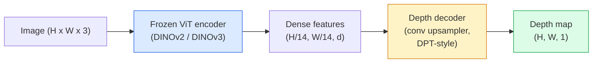

# Estimasi Kedalaman & Geometri Monokuler

> Peta kedalaman adalah gambar pipeline tunggal yang setiap pikselnya berjarak dari kamera. Memprediksinya dari satu bingkai RGB dulunya tidak mungkin dilakukan tanpa stereo atau LiDAR. Pada tahun 2026, encoder ViT yang dibekukan ditambah head yang ringan hanya beberapa persen dari kebenaran dasar.

**Type:** Pembuatan + Penggunaan
**Language:** Python
**Prerequisites:** Fase 4 Lesson 14 (ViT), Fase 4 Lesson 17 (Penglihatan yang Diawasi Sendiri), Fase 4 Lesson 07 (U-Net)
**Waktu:** ~60 menit

## Tujuan Pembelajaran

- Membedakan kedalaman relatif dan metrik serta menyatakan mana yang dipecahkan oleh masing-masing model produksi (MiDaS, Marigold, Depth Anything V3, ZoeDepth)
- Gunakan Depth Anything V3 (tulang punggung DINOv2) untuk memprediksi kedalaman gambar tunggal sembarang tanpa kalibrasi
- Jelaskan mengapa kedalaman monokuler berfungsi dari satu gambar (isyarat perspektif, gradient tekstur, prior yang dipelajari) dan apa yang tidak dapat dipulihkan (skala absolut, geometri tertutup)
- Tingkatkan deteksi 2D ke titik 3D menggunakan peta kedalaman dan intrinsik kamera lubang jarum

## Masalah

Kedalaman adalah sumbu yang hilang dalam visi komputer 2D. Dengan adanya RGB, kamu mengetahui di mana sesuatu muncul pada bidang gambar; kamu tidak tahu seberapa jauh jaraknya. Sensor kedalaman (rig stereo, LiDAR, waktu penerbangan) menyelesaikan masalah ini secara langsung tetapi mahal, rapuh, dan jangkauannya terbatas.

Estimasi kedalaman monokuler — memprediksi kedalaman dari satu bingkai RGB — digunakan untuk menghasilkan output yang buram dan tidak dapat diandalkan. Pada tahun 2026, pembuat enkode besar yang telah dilatih sebelumnya mengubah hal tersebut: Depth Anything V3 menggunakan tulang punggung DINOv2 yang dibekukan dan menghasilkan peta kedalaman yang menggeneralisasi seluruh domain dalam ruangan, luar ruangan, medis, dan satelit. Marigold mengubah kedalaman sebagai masalah difusi bersyarat. ZoeDepth meregresi distance metrik sebenarnya.

Kedalaman juga merupakan jembatan antara deteksi 2D dan pemahaman 3D: kalikan piksel kotak yang terdeteksi dengan kedalaman dan kamu mengangkat objek 2D ke dalam titik awan 3D. Itu adalah inti dari setiap sistem oklusi AR, setiap pipeline penghindar rintangan, dan setiap robot "pengambil cangkir".

## Konsep

### Kedalaman relatif vs metrik

- **Kedalaman relatif** — mengurutkan nilai `z` tanpa unit dunia nyata. “Piksel A lebih dekat dibandingkan piksel B, namun rasio jaraknya tidak ditentukan dalam meter.”
- **Kedalaman metrik** — distance absolut dalam meter dari kamera. Mengharuskan model mempelajari hubungan statistik antara isyarat gambar dan distance nyata.

MiDaS dan Depth Anything V3 menghasilkan kedalaman relatif. Marigold menghasilkan kedalaman relatif. ZoeDepth, UniDepth, dan Metric3D menghasilkan kedalaman metrik. Model metrik peka terhadap intrinsik kamera; model relatif tidak.

### Pola encoder-decoder



Depth Anything V3 membekukan encoder dan hanya melatih decoder gaya DPT. Encoder menyediakan feature yang kaya; dekoder menginterpolasinya kembali ke resolusi gambar dan mengembalikan kedalamannya.

### Mengapa satu gambar menghasilkan kedalaman

Gambar 2D berisi banyak isyarat monokuler yang berhubungan dengan kedalaman:

- **Perspektif** — garis sejajar dalam 3D menyatu dalam 2D.
- **Gradient tekstur** — permukaan yang jauh memiliki tekstur yang lebih kecil dan padat.
- **Urutan oklusi** — objek yang lebih dekat menutup objek yang lebih jauh.
- **Keteguhan ukuran** — objek yang diketahui (mobil, manusia) memberikan perkiraan skala.
- **Perspektif atmosfer** — objek yang jauh tampak lebih kabur dan biru dalam pemandangan luar ruangan.

ViT yang dilatih pada miliaran gambar menginternalisasi isyarat ini. Dengan data yang cukup dan tulang punggung yang kuat, kedalaman monokuler mencapai akurasi yang wajar tanpa pengawasan 3D yang eksplisit.### Apa yang tidak bisa dilakukan oleh kedalaman monokuler

- **Skala metrik absolut** tanpa intrinsik atau objek yang diketahui dalam adegan. Jaringan dapat memprediksi "cangkirnya dua kali lebih jauh dari sendok" tanpa mengetahui apakah distance cangkirnya 1 m atau 10 m.
- **Geometri tertutup** — bagian belakang kursi tidak terlihat dan tidak dapat disimpulkan dengan pasti.
- **Permukaan yang benar-benar tidak bertekstur / reflektif** — cermin, kaca, dinding seragam. Jaringan melaporkan kedalaman yang masuk akal tetapi salah.

### Kedalaman Apapun V3 pada tahun 2026

- Vanilla DINOv2 ViT-L/14 sebagai encoder (beku).
- Dekoder DPT.
- Dilatih tentang pasangan gambar yang dipose dari berbagai sumber (tidak diperlukan pengawasan kedalaman eksplisit selain konsistensi fotometrik).
- Memprediksi geometri yang konsisten secara spasial dari **sejumlah input visual yang berubah-ubah, dengan atau tanpa pose kamera yang diketahui**.
- SOTA di seluruh kedalaman monokuler, geometri tampilan apa pun, rendering visual, estimasi pose kamera.

Ini adalah model drop-in yang dapat dihubungi ketika kamu membutuhkan kedalaman pada tahun 2026.

### Marigold — difusi untuk kedalaman

Marigold (Ke et al., CVPR 2024) mengubah estimasi kedalaman menjadi difusi gambar-ke-gambar bersyarat. Pengkondisian: RGB. Target: peta kedalaman. Menggunakan U-Net Difusi Stabil 2 yang telah dilatih sebelumnya sebagai tulang punggung. Peta kedalaman output sangat tajam pada batas objek. Trade-off: inference lebih lambat dibandingkan model feed-forward (10-50 langkah denoising).

### Intrinsik dan kamera lubang jarum

Untuk mengangkat piksel `(u, v)` dengan kedalaman `d` ke titik 3D `(X, Y, Z)` dalam koordinat kamera:

```
fx, fy, cx, cy = camera intrinsics
X = (u - cx) * d / fx
Y = (v - cy) * d / fy
Z = d
```

Intrinsik berasal dari metadata EXIF, pola kalibrasi, atau estimator intrinsik bermata (Perspective Fields, UniDepth). Tanpa intrinsik, kamu masih dapat merender titik cloud dengan mengasumsikan FOV 60-70° dan prinsip resolusi sedang — dapat digunakan untuk visualisasi, bukan untuk pengukuran.

### Evaluasi

Dua metrik standar:

- **AbsRel** (kesalahan relatif absolut): `mean(|d_pred - d_gt| / d_gt)`. Lebih rendah lebih baik. 0,05-0,1 untuk model produksi.
- **delta < 1,25** (akurasi ambang batas): pecahan piksel dengan `max(d_pred/d_gt, d_gt/d_pred) < 1.25`. Lebih tinggi lebih baik. 0,9+ untuk SOTA.

Untuk kedalaman relatif (Depth Anything V3, MiDaS), evaluasi menggunakan versi invarian skala dan pergeseran dari kedua metrik.

## Build

### Langkah 1: Metrik kedalaman

```python
import torch

def abs_rel_error(pred, target, mask=None):
    if mask is not None:
        pred = pred[mask]
        target = target[mask]
    return (torch.abs(pred - target) / target.clamp(min=1e-6)).mean().item()


def delta_accuracy(pred, target, threshold=1.25, mask=None):
    if mask is not None:
        pred = pred[mask]
        target = target[mask]
    ratio = torch.maximum(pred / target.clamp(min=1e-6), target / pred.clamp(min=1e-6))
    return (ratio < threshold).float().mean().item()
```

Selalu tutupi piksel kedalaman yang tidak valid (nol, NaN, jenuh) sebelum evaluasi.

### Langkah 2: Penyelarasan skala dan pergeseran

Untuk model kedalaman relatif, selaraskan prediksi dengan kebenaran dasar sebelum menghitung metrik. Kesesuaian kuadrat terkecil dari `a * pred + b = target`:

```python
def align_scale_shift(pred, target, mask=None):
    if mask is not None:
        p = pred[mask]
        t = target[mask]
    else:
        p = pred.flatten()
        t = target.flatten()
    A = torch.stack([p, torch.ones_like(p)], dim=1)
    coeffs, *_ = torch.linalg.lstsq(A, t.unsqueeze(-1))
    a, b = coeffs[:2, 0]
    return a * pred + b
```

Jalankan `align_scale_shift` sebelum `abs_rel_error` saat mengevaluasi MiDaS / Depth Anything.

### Langkah 3: Naikkan kedalaman ke titik cloud

```python
import numpy as np

def depth_to_point_cloud(depth, intrinsics):
    H, W = depth.shape
    fx, fy, cx, cy = intrinsics
    v, u = np.meshgrid(np.arange(H), np.arange(W), indexing="ij")
    z = depth
    x = (u - cx) * z / fx
    y = (v - cy) * z / fy
    return np.stack([x, y, z], axis=-1)


depth = np.random.uniform(0.5, 4.0, (240, 320))
intr = (320.0, 320.0, 160.0, 120.0)
pc = depth_to_point_cloud(depth, intr)
print(f"point cloud shape: {pc.shape}  (H, W, 3)")
```

Satu fungsi, setiap aplikasi yang diangkat 3D. Ekspor point cloud ke `.ply` dan buka di MeshLab atau CloudCompare.

### Langkah 4: Uji asap dengan pemandangan kedalaman sintetis

```python
def synthetic_depth(size=96):
    yy, xx = np.meshgrid(np.arange(size), np.arange(size), indexing="ij")
    # Floor: linear gradient from near (top) to far (bottom)
    depth = 1.0 + (yy / size) * 4.0
    # Box in the middle: closer
    mask = (np.abs(xx - size / 2) < size / 6) & (np.abs(yy - size * 0.6) < size / 6)
    depth[mask] = 2.0
    return depth.astype(np.float32)


gt = torch.from_numpy(synthetic_depth(96))
pred = gt + 0.3 * torch.randn_like(gt)  # simulated prediction
aligned = align_scale_shift(pred, gt)
print(f"before align  absRel = {abs_rel_error(pred, gt):.3f}")
print(f"after align   absRel = {abs_rel_error(aligned, gt):.3f}")
```

### Langkah 5: Kedalaman Penggunaan V3 (referensi)

```python
import torch
from transformers import pipeline
from PIL import Image

pipe = pipeline(task="depth-estimation", model="LiheYoung/depth-anything-v2-large")

image = Image.open("street.jpg").convert("RGB")
out = pipe(image)
depth_np = np.array(out["depth"])
```

Tiga baris. `out["depth"]` adalah skala abu-abu PIL; konversikan ke numpy untuk matematika. Khusus untuk Depth Anything V3, tukar id model setelah dirilis; API tidak berubah.

## Pakai- **Depth Anything V3** (Meta AI / ByteDance, 2024-2026) — default untuk kedalaman relatif. Model tulang punggung besar ViT tercepat dalam produksi.
- **Marigold** (ETH, 2024) — kualitas visual tertinggi, inference lambat.
- **UniDepth** (ETH, 2024) — kedalaman metrik dengan estimasi intrinsik kamera.
- **ZoeDepth** (Intel, 2023) — kedalaman metrik; lebih tua, masih dapat diandalkan.
- **MiDaS v3.1** — lawas namun stabil; dasar yang baik untuk perbandingan.

Pola integrasi yang umum:

1. Bingkai RGB tiba.
2. Model kedalaman menghasilkan peta kedalaman.
3. Detektor menghasilkan kotak.
4. Angkat pusat massa kotak melalui kedalaman ke 3D; bergabung dengan point cloud jika tersedia.
5. Hilir: oklusi AR, perencanaan jalur, estimasi ukuran objek, penggantian stereo.

Untuk penggunaan real-time, Depth Anything V2 Small (kuantisasi INT8) mencapai ~30 fps pada GPU konsumen pada 518x518.

## Kirim

Lesson ini menghasilkan:

- `outputs/prompt-depth-model-picker.md` — memilih antara Depth Anything V3, Marigold, UniDepth, MiDaS berdasarkan latensi, kebutuhan metrik vs relatif, dan jenis adegan.
- `outputs/skill-depth-to-pointcloud.md` — keterampilan yang membangun titik awan dari peta kedalaman dengan penanganan intrinsik yang benar dan mengekspor ke `.ply`.

## Latihan

1. **(Mudah)** Jalankan Depth Anything V2 pada 10 gambar mana pun di meja kamu. Simpan kedalaman sebagai PNG skala abu-abu dan periksa. Identifikasi satu objek yang perkiraan kedalamannya salah dan jelaskan mengapa isyarat monokuler gagal.
2. **(Medium)** Mengingat RGB + kedalaman dari Depth Anything V2, angkat ke titik cloud dan render dengan `open3d`. Bandingkan dua adegan (dalam / luar ruangan) dan perhatikan mana yang terlihat lebih dapat dipercaya.
3. **(Keras)** Ambil lima pasang gambar yang berbeda hanya berdasarkan posisi objek yang diketahui (misalnya botol didekatkan 30 cm). Gunakan UniDepth untuk memprediksi kedalaman metrik pada keduanya. Laporkan perkiraan distance delta vs distance sebenarnya 30 cm.

## Istilah Kunci

| Istilah | Apa kata orang | Apa sebenarnya arti |
|------|----------------|----------------------|
| Kedalaman bermata | "Kedalaman gambar tunggal" | Estimasi kedalaman dari satu frame RGB, tanpa stereo atau LiDAR |
| Kedalaman relatif | "Kedalaman yang dipesan" | Nilai-z yang diurutkan tanpa satuan dunia nyata |
| Kedalaman metrik | "Distance mutlak" | Kedalaman dalam meter; memerlukan kalibrasi atau model yang dilatih dengan pengawasan metrik |
| AbsRel | "Kesalahan relatif mutlak" | Arti dari |d_pred - d_gt| / d_gt; metrik kedalaman standar |
| Akurasi Delta | "delta <1,25" | Fraksi piksel dengan prediksi dalam 25% kebenaran dasar |
| Kamera lubang jarum | "fx, fy, cx, cy" | Model kamera yang digunakan untuk mengangkat (u, v, d) ke (X, Y, Z) |
| DPT | "Trafo Prediksi Padat" | Decoder berbasis konv yang digunakan di atas encoder ViT yang dibekukan untuk kedalaman |
| Tulang punggung DINOv2 | "Alasannya berhasil" | Feature pengawasan mandiri yang menggeneralisasi seluruh domain tanpa label kedalaman |

## Bacaan Lanjutan

- [Halaman kertas Depth Anything V3](https:// depth-anything.github.io/) — Kedalaman monokuler SOTA dengan encoder DINOv2
- [Marigold (Ke et al., CVPR 2024)](https://marigoldmono depth.github.io/) — estimasi kedalaman berbasis difusi
- [UniDepth (Piccinelli et al., 2024)](https://arxiv.org/abs/2403.18913) — kedalaman metrik dengan intrinsik
- [MiDaS v3.1 (Intel ISL)](https://github.com/isl-org/MiDaS) — garis dasar kedalaman relatif kanonik
- [postingan blog DINOv3 (Meta)](https://ai.meta.com/blog/dinov3-self-supervised-vision-model/) — rangkaian encoder yang meningkatkan akurasi kedalaman
