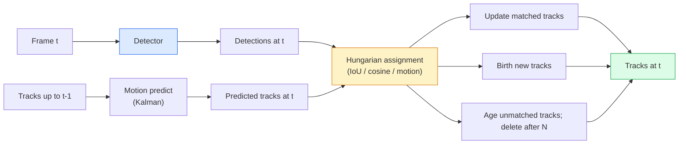

# Pelacakan Multi-Objek & Memori Video

> Pelacakan adalah deteksi plus asosiasi. Deteksi setiap frame. Cocokkan deteksi bingkai ini dengan trek bingkai terakhir berdasarkan ID.

**Type:** Build
**Language:** Python
**Prerequisites:** Fase 4 Lesson 06 (Deteksi YOLO), Fase 4 Lesson 08 (Mask R-CNN), Fase 4 Lesson 24 (SAM 3)
**Waktu:** ~60 menit

## Tujuan Pembelajaran

- Bedakan pelacakan demi deteksi dari pelacakan berbasis kueri dan beri nama keluarga algoritme (SORT, DeepSORT, ByteTrack, BoT-SORT, pelacak memori SAM 2, SAM 3.1 Object Multiplex)
- Menerapkan penugasan IoU + Hongaria dari awal untuk pelacakan demi deteksi klasik
- Jelaskan bank memori SAM 2 dan mengapa bank tersebut menangani oklusi lebih baik daripada asosiasi berbasis IoU
- Baca tiga metrik pelacakan (MOTA, IDF1, HOTA) dan pilih mana yang penting untuk kasus penggunaan tertentu

## Masalah

Detektor memberi tahu kamu di mana objek berada dalam satu bingkai. Pelacak memberi tahu kamu deteksi mana dalam bingkai `t` yang merupakan objek yang sama dengan deteksi dalam bingkai `t-1`. Tanpa itu, kamu tidak dapat menghitung benda yang melintasi garis, mengikuti bola melewati suatu oklusi, atau mengetahui "mobil #4 telah berada di jalur selama 8 detik".

Pelacakan sangat penting untuk setiap produk yang berhubungan dengan video: analisis olahraga, pengawasan, mengemudi otonom, analisis video medis, pemantauan satwa liar, penghitungan tanda kata. Blok penyusun inti digunakan bersama: detektor per bingkai, model gerak (filter Kalman atau yang lebih kaya), langkah asosiasi (algoritma Hongaria pada feature IoU/kosinus/yang dipelajari), dan siklus hidup trek (kelahiran, pembaruan, kematian).

Tahun 2026 menghadirkan dua pola baru: **Pelacakan berbasis memori SAM 2** (memori feature, bukan asosiasi model gerak) dan **SAM 3.1 Object Multiplex** (memori bersama untuk banyak contoh konsep yang sama). Lesson ini membahas tumpukan klasik terlebih dahulu, kemudian pendekatan berbasis memori.

## Konsep

### Pelacakan demi deteksi



Setiap pelacak yang akan kamu temui pada tahun 2026 adalah variasi dari putaran ini. Perbedaannya:

- **SORT** (2016): Filter Kalman + IoU Hongaria. Sederhana, cepat, tanpa model penampilan.
- **DeepSORT** (2017): SORT + feature tampilan berbasis CNN per trek (embedding ReID). Menangani penyeberangan dengan lebih baik.
- **ByteTrack** (2021): mengaitkan deteksi berkeyakinan rendah sebagai phase kedua; tidak diperlukan feature penampilan tetapi berkinerja terbaik di MOT17.
- **BoT-SORT** (2022): Byte + kompensasi gerakan kamera + ReID.
- **StrongSORT / OC-SORT** — Turunan ByteTrack dengan gerakan dan tampilan yang lebih baik.

### Filter Kalman dalam satu paragraf

Filter Kalman mempertahankan status per trek `(x, y, w, h, dx, dy, dw, dh)` dengan kovarians. Pada setiap frame, **prediksi** keadaan menggunakan model kecepatan konstan, lalu **perbarui** dengan deteksi yang cocok. Pembaruan ini lebih memercayai pendeteksian ketika ketidakpastian prediksi tinggi. Hal ini memberikan lintasan yang mulus dan kemampuan untuk melanjutkan lintasan melalui oklusi pendek (1-5 frame).

Setiap pelacak klasik menggunakan filter Kalman dalam langkah prediksi gerakan.

### Algoritma Hongaria

Dengan matrix biaya `M x N` (melacak x deteksi), temukan penugasan satu-ke-satu yang meminimalkan total biaya. Biaya biasanya `1 - IoU(track_bbox, detection_bbox)` atau kemiripan kosinus negatif dari feature tampilan. Waktu proses adalah O((M+N)^3); untuk M, N hingga ~1000 cukup cepat dengan Python melalui `scipy.optimize.linear_sum_assignment`.

### Ide utama ByteTrackPelacak standar menghilangkan deteksi dengan tingkat keyakinan rendah (<0,5). ByteTrack menjadikan mereka sebagai **kandidat phase kedua**: setelah mencocokkan trek dengan deteksi berkeyakinan tinggi, trek yang tidak cocok mencoba mencocokkan deteksi berkeyakinan rendah dengan ambang batas IoU yang sedikit lebih longgar. Memulihkan oklusi pendek, ID beralih di dekat kerumunan.

### Pelacakan berbasis memori SAM 2

SAM 2 menangani video dengan menyimpan **bank memori** feature spatio-temporal per instance. Diberikan prompt (klik, kotak, teks) pada satu frame, itu mengkodekan instance ke dalam memori. Pada frame berikutnya, memori dilawan secara silang terhadap feature frame baru, dan decoder menghasilkan mask untuk instance yang sama di frame baru.

Tidak ada filter Kalman, tidak ada tugas bahasa Hongaria. Asosiasi ini tersirat dalam operasi attention-memori.

Kelebihan:
- Kuat hingga oklusi besar (memori membawa identitas instance di banyak frame).
- Kosakata terbuka bila digabungkan dengan prompt teks SAM 3.
- Bekerja tanpa model gerak terpisah.

Kontra:
- Lebih lambat dari ByteTrack untuk pelacakan banyak objek.
- Bank memori tumbuh; membatasi jendela konteks.

### SAM 3.1 Objek Multipleks

Pelacakan SAM 2 / SAM 3 sebelumnya menyimpan bank memori terpisah per instans. Untuk 50 objek, 50 bank memori. Object Multiplex (Maret 2026) menggabungkannya menjadi satu memori bersama dengan **token kueri per instance**. Biaya berskala sub-linear dalam jumlah kasus.

Multipleks adalah default baru untuk pelacakan kerumunan pada tahun 2026: kerumunan konser, pekerja gudang, persimpangan lalu lintas.

### Tiga metrik yang perlu diketahui

- **MOTA (Akurasi Pelacakan Multi-Objek)** — 1 - (sakelar FN + FP + ID) / GT. Ditimbang berdasarkan jenis kesalahan; satu metrik yang menggabungkan kegagalan deteksi dan asosiasi.
- **IDF1 (ID F1)** — rata-rata harmonik dari presisi dan perolehan ID. Berfokus secara khusus pada seberapa baik setiap jalur kebenaran dasar mempertahankan ID-nya dari waktu ke waktu. Lebih baik daripada MOTA untuk tugas-tugas yang sensitif terhadap peralihan ID.
- **HOTA (Akurasi Pelacakan Pesanan Tinggi)** — diuraikan menjadi akurasi deteksi (DetA) dan akurasi asosiasi (AssA). Standar komunitas sejak tahun 2020; paling komprehensif.

Untuk pengawasan (siapa adalah siapa): IDF1 adalah apa yang kamu laporkan. Untuk analisis olahraga (menghitung lintasan): HOTA. Untuk perbandingan akademis umum: HOTA.

## Build

### Langkah 1: Matrix biaya berbasis IoU

```python
import numpy as np


def bbox_iou(a, b):
    """
    a, b: (N, 4) arrays of [x1, y1, x2, y2].
    Returns (N_a, N_b) IoU matrix.
    """
    ax1, ay1, ax2, ay2 = a[:, 0], a[:, 1], a[:, 2], a[:, 3]
    bx1, by1, bx2, by2 = b[:, 0], b[:, 1], b[:, 2], b[:, 3]
    inter_x1 = np.maximum(ax1[:, None], bx1[None, :])
    inter_y1 = np.maximum(ay1[:, None], by1[None, :])
    inter_x2 = np.minimum(ax2[:, None], bx2[None, :])
    inter_y2 = np.minimum(ay2[:, None], by2[None, :])
    inter = np.clip(inter_x2 - inter_x1, 0, None) * np.clip(inter_y2 - inter_y1, 0, None)
    area_a = (ax2 - ax1) * (ay2 - ay1)
    area_b = (bx2 - bx1) * (by2 - by1)
    union = area_a[:, None] + area_b[None, :] - inter
    return inter / np.clip(union, 1e-8, None)
```

### Langkah 2: Pelacak bergaya SORT minimal

Kalman kecepatan konstan tetap dihilangkan agar singkatnya — kami menggunakan asosiasi IoU sederhana di sini; dalam produksi, prediksi Kalman sangatlah penting. Paket `sort` Python menyediakan versi lengkap.

```python
from scipy.optimize import linear_sum_assignment


class Track:
    def __init__(self, tid, bbox, frame):
        self.id = tid
        self.bbox = bbox
        self.last_frame = frame
        self.hits = 1

    def update(self, bbox, frame):
        self.bbox = bbox
        self.last_frame = frame
        self.hits += 1


class SimpleTracker:
    def __init__(self, iou_threshold=0.3, max_age=5):
        self.tracks = []
        self.next_id = 1
        self.iou_threshold = iou_threshold
        self.max_age = max_age

    def step(self, detections, frame):
        if not self.tracks:
            for d in detections:
                self.tracks.append(Track(self.next_id, d, frame))
                self.next_id += 1
            return [(t.id, t.bbox) for t in self.tracks]

        track_boxes = np.array([t.bbox for t in self.tracks])
        det_boxes = np.array(detections) if len(detections) else np.empty((0, 4))

        iou = bbox_iou(track_boxes, det_boxes) if len(det_boxes) else np.zeros((len(track_boxes), 0))
        cost = 1 - iou
        cost[iou < self.iou_threshold] = 1e6

        matched_track = set()
        matched_det = set()
        if cost.size > 0:
            row, col = linear_sum_assignment(cost)
            for r, c in zip(row, col):
                if cost[r, c] < 1.0:
                    self.tracks[r].update(det_boxes[c], frame)
                    matched_track.add(r); matched_det.add(c)

        for i, d in enumerate(det_boxes):
            if i not in matched_det:
                self.tracks.append(Track(self.next_id, d, frame))
                self.next_id += 1

        self.tracks = [t for t in self.tracks if frame - t.last_frame <= self.max_age]
        return [(t.id, t.bbox) for t in self.tracks]
```

60 baris. Mengambil deteksi per frame, mengembalikan ID track per frame. Sistem nyata menambahkan prediksi Kalman, pertandingan ulang phase kedua ByteTrack, dan feature penampilan.

### Langkah 3: Uji lintasan sintetik

```python
def synthetic_frames(num_frames=20, num_objects=3, H=240, W=320, seed=0):
    rng = np.random.default_rng(seed)
    starts = rng.uniform(20, 200, size=(num_objects, 2))
    velocities = rng.uniform(-5, 5, size=(num_objects, 2))
    frames = []
    for f in range(num_frames):
        dets = []
        for i in range(num_objects):
            cx, cy = starts[i] + f * velocities[i]
            dets.append([cx - 10, cy - 10, cx + 10, cy + 10])
        frames.append(dets)
    return frames


tracker = SimpleTracker()
for f, dets in enumerate(synthetic_frames()):
    tracks = tracker.step(dets, f)
```

Tiga objek yang bergerak dalam garis lurus harus menjaga ID-nya di seluruh 20 frame.

### Langkah 4: Metrik peralihan ID

```python
def count_id_switches(tracks_per_frame, gt_per_frame):
    """
    tracks_per_frame:  list of list of (track_id, bbox)
    gt_per_frame:      list of list of (gt_id, bbox)
    Returns number of ID switches.
    """
    prev_assignment = {}
    switches = 0
    for tracks, gts in zip(tracks_per_frame, gt_per_frame):
        if not tracks or not gts:
            continue
        t_boxes = np.array([b for _, b in tracks])
        g_boxes = np.array([b for _, b in gts])
        iou = bbox_iou(g_boxes, t_boxes)
        for g_idx, (gt_id, _) in enumerate(gts):
            j = iou[g_idx].argmax()
            if iou[g_idx, j] > 0.5:
                t_id = tracks[j][0]
                if gt_id in prev_assignment and prev_assignment[gt_id] != t_id:
                    switches += 1
                prev_assignment[gt_id] = t_id
    return switches
```

Ini adalah metrik berdekatan IDF1 yang disederhanakan: hitung berapa kali objek kebenaran dasar mengubah ID trek prediksi yang ditetapkan. Perkakas MOTA / IDF1 / HOTA asli ada di `py-motmetrics` dan `TrackEval`.

## Pakai

Pelacak produksi pada tahun 2026:- `ultralytics` — YOLOv8 + ByteTrack / BoT-SORT bawaan. `results = model.track(source, tracker="bytetrack.yaml")`. Standarnya.
- `supervision` (Roboflow) — Pembungkus ByteTrack ditambah utilitas anotasi.
- SAM 2 / SAM 3.1 — pelacakan berbasis memori melalui `processor.track()`.
- Tumpukan khusus: detektor (YOLOv8 / RT-DETR) + `sort-tracker` / `OC-SORT` / `StrongSORT`.

Memilih:

- Pejalan kaki / mobil / kotak dengan kecepatan 30+ fps: **ByteTrack dengan ultralytics**.
- Banyak contoh satu kelas dalam satu kelompok: **SAM 3.1 Object Multiplex**.
- Oklusi berat dengan tampilan yang dapat dikenali: **DeepSORT / StrongSORT** (feature ReID).
- Olahraga / interaksi kompleks: **BoT-SORT** atau pelacak terpelajar (MOTRv3).

## Kirim

Lesson ini menghasilkan:

- `outputs/prompt-tracker-picker.md` — memilih SORT / ByteTrack / BoT-SORT / SAM 2 / SAM 3.1 berdasarkan jenis adegan, pola oklusi, dan anggaran latensi.
- `outputs/skill-mot-evaluator.md` — menulis pemanfaatan evaluasi lengkap untuk MOTA / IDF1 / HOTA terhadap jalur kebenaran dasar.

## Latihan

1. **(Mudah)** Jalankan pelacak sintetis di atas dengan 3, 10, dan 30 objek. Laporkan jumlah peralihan ID dalam setiap kasus. Identifikasi di mana asosiasi sederhana IoU saja mulai gagal.
2. **(Sedang)** Tambahkan langkah prediksi Kalman kecepatan konstan sebelum pengaitan. Tunjukkan bahwa oklusi pendek (2-3 frame) tidak lagi menyebabkan peralihan ID.
3. **(Hard)** Integrasikan pelacak berbasis memori SAM 2 (melalui `transformers`) sebagai backend pelacak alternatif. Jalankan SimpleTracker dan SAM 2 pada klip kerumunan berdurasi 30 detik dan bandingkan jumlah peralihan ID, secara manual memberi label pada ID kebenaran dasar untuk 5 orang yang menonjol.

## Istilah Kunci

| Istilah | Apa kata orang | Apa sebenarnya arti |
|------|----------------|----------------------|
| Pelacakan demi deteksi | "Deteksi lalu kaitkan" | Detektor per bingkai + Penugasan Hongaria pada IoU / tampilan |
| Filter Kalman | "Prediksi gerak" | Dinamika linier + kovarians untuk prediksi lintasan yang mulus dan penanganan oklusi |
| Algoritma Hongaria | "Penugasan optimal" | Menyelesaikan masalah pencocokan bipartit berbiaya minimum; `scipy.optimize.linear_sum_assignment` |
| ByteTrack | "Lulusan kedua dengan kepercayaan diri rendah" | Cocokkan ulang trek yang tidak cocok dengan deteksi berkeyakinan rendah untuk memulihkan oklusi pendek |
| SORT Dalam | "SORT + penampilan" | Menambahkan feature ReID untuk pencocokan lintas bingkai; lebih baik untuk pelestarian ID |
| Bank memori | "Trik SAM 2" | Feature spatio-temporal per instance disimpan di seluruh frame; attention silang menggantikan asosiasi eksplisit |
| Multipleks Objek | "Memori bersama SAM 3.1" | Memori bersama tunggal dengan kueri per instans untuk pelacakan banyak objek dengan cepat |
| PANAS | "Metrik pelacakan modern" | Terurai menjadi akurasi deteksi dan asosiasi; standar komunitas |

## Bacaan Lanjutan

- [SORT (Bewley et al., 2016)](https://arxiv.org/abs/1602.00763) — makalah pelacakan demi deteksi minimal
- [DeepSORT (Wojke et al., 2017)](https://arxiv.org/abs/1703.07402) — menambahkan feature tampilan
- [ByteTrack (Zhang et al., 2022)](https://arxiv.org/abs/2110.06864) — operan kedua dengan tingkat kepercayaan rendah
- [BoT-SORT (Aharon et al., 2022)](https://arxiv.org/abs/2206.14651) — kompensasi gerakan kamera
- [HOTA (Luiten et al., 2020)](https://arxiv.org/abs/2009.07736) — metrik pelacakan terdekomposisi
- [Segmentasi video SAM 2 (Meta, 2024)](https://ai.meta.com/sam2/) — pelacak berbasis memori
- [SAM 3.1 Object Multiplex (Meta, Maret 2026)](https://ai.meta.com/blog/segment-anything-model-3/)
