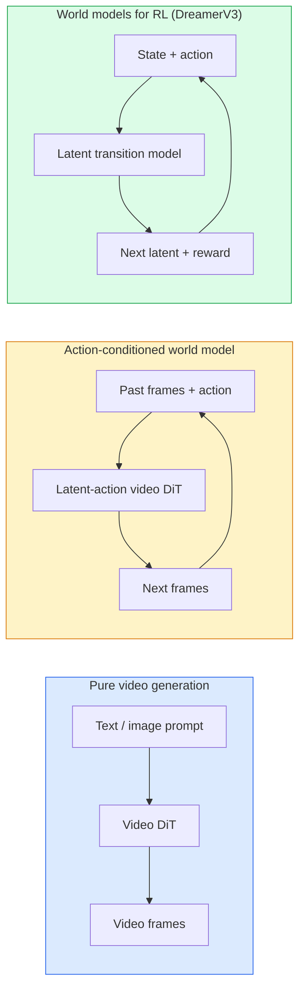

# Model Dunia & Difusi Video

> Model video yang memprediksi detik berikutnya suatu adegan adalah simulator dunia. Kondisikan prediksi itu berdasarkan tindakan dan kamu memiliki mesin permainan yang terpelajar.

**Type:** Learn + Build
**Language:** Python
**Prerequisites:** Phase 4 Lesson 10 (Difusi), Phase 4 Lesson 12 (Pemahaman Video), Phase 4 Lesson 23 (DiT + Aliran yang Diperbaiki)
**Waktu:** ~75 menit

## Tujuan Pembelajaran

- Jelaskan perbedaan antara model generasi video murni (Sora 2) dan model dunia yang dikondisikan aksi (Genie 3, DreamerV3)
- Jelaskan video DiT: tambalan spatio-temporal, pengkodean posisi 3D, attention gabungan di seluruh token (T, H, W)
- Lacak bagaimana model dunia dihubungkan ke robotika: rencana VLM → simulasi model video → dinamika terbalik memancarkan tindakan
- Pilih antara Sora 2, Genie 3, Runway GWM-1 Worlds, Wan-Video, dan HunyuanVideo untuk kasus penggunaan tertentu (video kreatif, sim interaktif, sintesis mengemudi otonom)

## Masalah

Pembuatan video dan pemodelan dunia menyatu pada tahun 2026. Sebuah model yang dapat menghasilkan satu menit video yang koheren, dalam beberapa hal, telah mempelajari bagaimana dunia bergerak: kepermanenan objek, gravitasi, kausalitas, gaya. Jika kamu mengkondisikan prediksi tersebut berdasarkan tindakan (berjalan ke kiri, membuka pintu), model video menjadi simulator yang dapat dipelajari yang dapat menggantikan mesin permainan, simulator mengemudi, atau lingkungan robotika.

Taruhannya sangat nyata. Genie 3 menghasilkan lingkungan yang dapat dimainkan dari satu gambar. Runway GWM-1 Worlds memadukan pemandangan tak terbatas yang dapat dijelajahi. Sora 2 menghasilkan video berdurasi satu menit dengan audio tersinkronisasi dan model fisika. NVIDIA Cosmos-Drive, Wayve Gaia-2, dan Tesla DrivingWorld menghasilkan video mengemudi yang realistis untuk training data kendaraan otonom. Paradigma model dunia secara diam-diam mengambil alih sim-to-real untuk robotika.

Lesson ini adalah lesson "gambaran besar" untuk Fase 4. Lesson ini menghubungkan pembuatan gambar, pemahaman video, dan penalaran agen ke dalam pola arsitektur yang dominan dalam penelitian.

## Konsep

### Tiga keluarga pemodelan dunia



- **Sora 2** adalah pembuatan video murni yang dikondisikan berdasarkan prompt. Tidak ada antarmuka tindakan. kamu tidak dapat "mengarahkannya" di tengah peluncuran.
- **Genie 3**, **GWM-1 Worlds**, **Mirage / Magica** adalah model dunia yang dikondisikan aksi. Menyimpulkan tindakan laten dari video yang diamati, lalu mengkondisikan prediksi frame masa depan berdasarkan tindakan. Interaktif — kamu menekan tombol atau menggerakkan kamera dan pemandangan merespons.
- **DreamerV3** dan rangkaian model dunia RL klasik memprediksi dalam ruang laten dengan pengondisian tindakan eksplisit, dilatih berdasarkan sinyal hadiah. Kurang visual; lebih berguna untuk RL yang efisien sample.

### Arsitektur Video DiT

```
Video latent:          (C, T, H, W)
Patchify (spatial):    grid of P_h x P_w patches per frame
Patchify (temporal):   group P_t frames into a temporal patch
Resulting tokens:      (T / P_t) * (H / P_h) * (W / P_w) tokens
```

Pengkodean posisi adalah 3D: embedding putar atau yang dipelajari per koordinat (t, h, w). Attention dapat berupa:

- **Full joint** — semua token melayani semua token. O(N^2) dengan N token. Melarang untuk video berdurasi panjang.
- **Terbagi** — attention temporal bergantian (posisi spasial yang sama, melintasi waktu: `(H*W) * T^2`) dan attention spasial (langkah waktu yang sama, melintasi ruang: `T * (H*W)^2`). Digunakan oleh TimeSformer dan sebagian besar DiT video.
- **Jendela** — jendela lokal di (t, h, w). Digunakan oleh Video Swin.

Setiap model difusi video tahun 2026 menggunakan salah satu dari tiga pola ini ditambah pengondisian AdaLN (Lesson 23) dan aliran yang diperbaiki.

### Pengondisian tindakan: model tindakan latenGenie mempelajari **tindakan laten** per frame dengan memprediksi tindakan secara diskriminatif di antara sepasang frame yang berurutan. Dekoder model kemudian mengkondisikan tindakan laten yang disimpulkan — bukan pada tombol keyboard eksplisit. Pada inference, pengguna dapat menentukan tindakan laten (atau mengambil sample dari tindakan sebelumnya) dan model menghasilkan frame berikutnya yang konsisten dengan tindakan tersebut.

Sora melewatkan antarmuka tindakan sepenuhnya. Dekodernya memprediksi token ruangwaktu berikutnya dari token ruangwaktu sebelumnya. Kondisi cepat permulaan; tidak ada yang mengarahkannya ke generasi pertengahan.

### Masuk akal secara fisik

Rilis Sora 2 tahun 2026 secara eksplisit mengiklankan **masuk akal secara fisik**: berat, keseimbangan, keabadian objek, sebab-akibat. Diukur oleh tim melalui skor masuk akal yang dinilai secara manual; model ini secara nyata meningkat pada objek yang terjatuh, karakter yang bertabrakan, dan kegagalan yang disengaja (lompatan yang terlewat) dibandingkan Sora 1.

Masuk akal tetap menjadi mode kegagalan yang dominan. Video tahun 2024-2025 yang menampilkan orang-orang makan spageti atau minum dari gelas mengungkapkan kurangnya representasi objek yang persisten dari model tersebut. Model tahun 2026 (Sora 2, Runway Gen-5, HunyuanVideo) mengurangi namun tidak menghilangkannya.

### Model dunia mengemudi otonom

Model dunia mengemudi menghasilkan pemandangan jalan realistis yang dikondisikan pada lintasan, kotak pembatas, atau peta navigasi. Penggunaan:

- **Cosmos-Drive-Dreams** (NVIDIA) — menghasilkan video menit mengemudi untuk training RL.
- **Gaia-2** (Wayve) — sintesis pemandangan yang dikondisikan lintasan untuk evaluasi kebijakan.
- **DrivingWorld** (Tesla) — menyimulasikan berbagai cuaca, waktu, dan kondisi lalu lintas.
- **Vista** (ByteDance) — sintesis adegan mengemudi reaktif.

Mereka menggantikan pengumpulan data dunia nyata yang mahal untuk kasus-kasus sudut – penyeberangan pejalan kaki di malam hari, persimpangan yang tertutup es, jenis kendaraan yang tidak biasa – yang seharusnya membutuhkan jutaan mil perjalanan.

### Tumpukan robotika: VLM + model video + dinamika terbalik

Lingkaran robotika tiga komponen yang muncul:

1. **VLM** menguraikan tujuan ("mengambil cangkir merah"), merencanakan rangkaian tindakan tingkat tinggi.
2. **Model pembuatan video** menyimulasikan tampilan eksekusi setiap tindakan — memprediksi observasi N frame ke depan.
3. **Model dinamika terbalik** mengekstrak prompt motorik konkret yang akan menghasilkan observasi tersebut.

Ini menggantikan pembentukan hadiah dan RL yang banyak sample. Model dunia melakukan imajinasi; dinamika terbalik menutup loop pada aktuasi. Genie Envisioner adalah salah satu contoh; banyak kelompok penelitian berkumpul pada struktur ini.

### Evaluasi

- **Kualitas visual** — FVD (Fréchet Video Distance), studi pengguna.
- **Penyelarasan cepat** — CLIPScore per frame, evaluasi gaya VQA.
- **Kemungkinan fisik** — dinilai secara manual pada rangkaian benchmark (benchmark internal Sora 2, VBench).
- **Kontrolabilitas** (untuk model dunia interaktif) — tindakan → konsistensi observasi; bisakah kamu kembali ke keadaan sebelumnya?

### Model lanskap pada tahun 2026| Model | Gunakan | Parameter | Output | Lisensi |
|-------|-----|------------|--------|---------|
| Sora 2 | teks-ke-video, audio | — | 1 menit 1080p + audio | Hanya API |
| Landasan Pacu Gen-5 | teks/gambar-ke-video | — | klip 10an | API |
| Landasan Pacu Dunia GWM-1 | dunia interaktif | — | peluncuran 3D tanpa batas | API |
| Jin 3 | dunia interaktif dari gambar | 11B+ | bingkai yang dapat diputar | pratinjau penelitian |
| Wan-Video 2.1 | buka teks-ke-video | 14B | klip berkualitas tinggi | non-komersial |
| Video Hunyuan | buka teks-ke-video | 13B | klip 10an | permisif |
| Kosmos / Penggerak Kosmos | sim mengemudi otonom | 7-14B | adegan mengemudi | NVIDIA terbuka |
| Sihir / Mirage 2 | Mesin game asli AI | — | dunia yang dapat dimodifikasi | produk |

## Build

### Langkah 1: Patchify 3D untuk video

```python
import torch
import torch.nn as nn


class VideoPatch3D(nn.Module):
    def __init__(self, in_channels=4, dim=64, patch_t=2, patch_h=2, patch_w=2):
        super().__init__()
        self.proj = nn.Conv3d(
            in_channels, dim,
            kernel_size=(patch_t, patch_h, patch_w),
            stride=(patch_t, patch_h, patch_w),
        )
        self.patch_t = patch_t
        self.patch_h = patch_h
        self.patch_w = patch_w

    def forward(self, x):
        # x: (N, C, T, H, W)
        x = self.proj(x)
        n, c, t, h, w = x.shape
        tokens = x.reshape(n, c, t * h * w).transpose(1, 2)
        return tokens, (t, h, w)
```

Konv 3D dengan langkah yang sama dengan kernel bertindak sebagai patchifier spatio-temporal. `(T, H, W) -> (T/2, H/2, W/2)` jaringan token.

### Langkah 2: Pengkodean posisi putar 3D

Rotary Position Embeddings (RoPE) diterapkan secara terpisah di sepanjang sumbu `t`, `h`, `w`:

```python
def rope_3d(tokens, t_dim, h_dim, w_dim, grid):
    """
    tokens: (N, T*H*W, D)
    grid: (T, H, W) sizes
    t_dim + h_dim + w_dim == D
    """
    T, H, W = grid
    n, seq, d = tokens.shape
    if t_dim + h_dim + w_dim != d:
        raise ValueError(f"t_dim+h_dim+w_dim ({t_dim}+{h_dim}+{w_dim}) must equal D={d}")
    assert seq == T * H * W
    t_idx = torch.arange(T, device=tokens.device).repeat_interleave(H * W)
    h_idx = torch.arange(H, device=tokens.device).repeat_interleave(W).repeat(T)
    w_idx = torch.arange(W, device=tokens.device).repeat(T * H)
    # Simplified: just scale channels by frequencies. Real RoPE rotates pairs.
    freqs_t = torch.exp(-torch.log(torch.tensor(10000.0)) * torch.arange(t_dim // 2, device=tokens.device) / (t_dim // 2))
    freqs_h = torch.exp(-torch.log(torch.tensor(10000.0)) * torch.arange(h_dim // 2, device=tokens.device) / (h_dim // 2))
    freqs_w = torch.exp(-torch.log(torch.tensor(10000.0)) * torch.arange(w_dim // 2, device=tokens.device) / (w_dim // 2))
    emb_t = torch.cat([torch.sin(t_idx[:, None] * freqs_t), torch.cos(t_idx[:, None] * freqs_t)], dim=-1)
    emb_h = torch.cat([torch.sin(h_idx[:, None] * freqs_h), torch.cos(h_idx[:, None] * freqs_h)], dim=-1)
    emb_w = torch.cat([torch.sin(w_idx[:, None] * freqs_w), torch.cos(w_idx[:, None] * freqs_w)], dim=-1)
    return tokens + torch.cat([emb_t, emb_h, emb_w], dim=-1)
```

Bentuk aditif yang disederhanakan. Tali Nyata memutar pipeline berpasangan pada frekuensi; informasi posisinya sama.

### Langkah 3: Blok attention terbagi

```python
class DividedAttentionBlock(nn.Module):
    def __init__(self, dim=64, heads=2):
        super().__init__()
        self.time_attn = nn.MultiheadAttention(dim, heads, batch_first=True)
        self.space_attn = nn.MultiheadAttention(dim, heads, batch_first=True)
        self.ln1 = nn.LayerNorm(dim)
        self.ln2 = nn.LayerNorm(dim)
        self.ln3 = nn.LayerNorm(dim)
        self.mlp = nn.Sequential(nn.Linear(dim, 4 * dim), nn.GELU(), nn.Linear(4 * dim, dim))

    def forward(self, x, grid):
        T, H, W = grid
        n, seq, d = x.shape
        # time attention: same (h, w), across t
        xt = x.view(n, T, H * W, d).permute(0, 2, 1, 3).reshape(n * H * W, T, d)
        a, _ = self.time_attn(self.ln1(xt), self.ln1(xt), self.ln1(xt), need_weights=False)
        xt = (xt + a).reshape(n, H * W, T, d).permute(0, 2, 1, 3).reshape(n, seq, d)
        # space attention: same t, across (h, w)
        xs = xt.view(n, T, H * W, d).reshape(n * T, H * W, d)
        a, _ = self.space_attn(self.ln2(xs), self.ln2(xs), self.ln2(xs), need_weights=False)
        xs = (xs + a).reshape(n, T, H * W, d).reshape(n, seq, d)
        xs = xs + self.mlp(self.ln3(xs))
        return xs
```

Waktu attention hadir dalam setiap posisi spasial sepanjang waktu; attention ruang hadir dalam setiap frame di seluruh posisi. Dua operasi O(T^2 + (HW)^2) bukan satu operasi O((THW)^2). Ini adalah inti dari TimeSformer dan setiap video DiT modern.

### Langkah 4: Buat video kecil DiT

```python
class TinyVideoDiT(nn.Module):
    def __init__(self, in_channels=4, dim=64, depth=2, heads=2):
        super().__init__()
        self.patch = VideoPatch3D(in_channels=in_channels, dim=dim, patch_t=2, patch_h=2, patch_w=2)
        self.blocks = nn.ModuleList([DividedAttentionBlock(dim, heads) for _ in range(depth)])
        self.out = nn.Linear(dim, in_channels * 2 * 2 * 2)

    def forward(self, x):
        tokens, grid = self.patch(x)
        for blk in self.blocks:
            tokens = blk(tokens, grid)
        return self.out(tokens), grid
```

Bukan generator video yang berfungsi; demo struktural yang setiap bagiannya dibentuk dengan benar.

### Langkah 5: Periksa bentuk

```python
vid = torch.randn(1, 4, 8, 16, 16)  # (N, C, T, H, W)
model = TinyVideoDiT()
out, grid = model(vid)
print(f"input  {tuple(vid.shape)}")
print(f"tokens grid {grid}")
print(f"output {tuple(out.shape)}")
```

Harapkan `grid = (4, 8, 8)` dan `out = (1, 256, 32)` setelah patching; kepala kemudian memproyeksikan ke tambalan spatio-temporal per-token, siap untuk dibatalkan tambalannya kembali ke dalam video.

## Pakai

Pola akses produksi pada tahun 2026:

- **Sora 2 API** (OpenAI) — teks-ke-video, audio tersinkronisasi. Harga premium.
- **Runway Gen-5 / GWM-1** (Runway) — dunia interaktif gambar-ke-video.
- **Wan-Video 2.1 / HunyuanVideo** — host mandiri sumber terbuka.
- **Cosmos / Cosmos-Drive** (NVIDIA) — simulasi mengemudi weight terbuka.
- **Genie 3** — pratinjau penelitian, minta akses.

Untuk membuat demo model dunia yang interaktif: mulailah dengan Wan-Video untuk kualitas, gunakan adaptor tindakan laten untuk interaktivitas. Untuk simulasi mengemudi otonom: Cosmos-Drive adalah referensi terbuka tahun 2026.

Untuk robotika, tumpukan di alam liar:

1. Sasaran bahasa -> VLM (Qwen3-VL) -> rencana tingkat tinggi.
2. Rencana -> model video tindakan laten -> peluncuran yang dibayangkan.
3. Peluncuran -> model dinamika terbalik -> tindakan tingkat rendah.
4. Tindakan yang dilaksanakan -> observasi dimasukkan kembali ke langkah 1.

## Kirim

Lesson ini menghasilkan:

- `outputs/prompt-video-model-picker.md` — memilih antara Sora 2 / Runway / Wan / HunyuanVideo / Cosmos berdasarkan tugas, lisensi, dan latensi.
- `outputs/skill-physical-plausibility-checks.md` — keterampilan yang mendefinisikan pemeriksaan otomatis (kepermanenan objek, gravitasi, kontinuitas) untuk dijalankan pada video apa pun yang dihasilkan sebelum dikirimkan.

## Latihan1. **(Mudah)** Hitung jumlah token untuk video 360p berdurasi 5 detik di patch-t=2, patch-h=8, patch-w=8. Alasan tentang memori untuk attention pada ukuran ini.
2. **(Sedang)** Tukar blok attention terbagi di atas dengan blok attention gabungan penuh dan ukur bentuk dan jumlah parameter. Jelaskan mengapa attention yang terbagi diperlukan untuk model video nyata.
3. **(Sulit)** Buat model video tindakan laten minimal: ambil dataset (frame_t, action_t, frame_{t+1}) tiga kali lipat (game 2D sederhana apa pun), latih DiT video kecil yang dikondisikan pada embedding tindakan, dan tunjukkan bahwa tindakan yang berbeda menghasilkan frame berikutnya yang berbeda.

## Istilah Kunci

| Istilah | Apa kata orang | Apa sebenarnya arti |
|------|----------------|----------------------|
| Model dunia | "Simulator yang dipelajari" | Sebuah model yang memprediksi observasi di masa depan dengan keadaan dan tindakan |
| Video DiT | "Transformer ruangwaktu" | Trafo difusi dengan patchifikasi 3D dan attention terbagi |
| Tindakan laten | "Kontrol yang disimpulkan" | Tindakan laten diskrit atau berkelanjutan yang disimpulkan dari pasangan bingkai; digunakan untuk mengkondisikan generasi frame berikutnya |
| Attention terbagi | "Waktu lalu ruang" | Dua operasi attention per blok — melintasi waktu lalu melintasi ruang — agar O(N^2) dapat dikelola |
| Keabadian objek | "Segalanya tetap nyata" | Properti pemandangan yang harus dipelajari model video; mode kegagalan klasik pada makanan, barang pecah belah |
| FVD | "Distance Video Frechet" | Video yang setara dengan FID; metrik kualitas visual utama |
| Model dinamika terbalik | "Pengamatan terhadap tindakan" | Diberikan (negara bagian, negara bagian berikutnya), keluarkan tindakan yang menghubungkannya; menutup lingkaran robotika |
| Penggerak Kosmos | "Sim mengemudi NVIDIA" | Model dunia mengemudi otonom berbobot terbuka untuk RL dan evaluasi |

## Bacaan Lanjutan

- [Laporan teknis Sora (OpenAI)](https://openai.com/index/video-generasi-models-as-world-simulators/)
- [Genie: Generative Interactive Environments (Bruce et al., 2024)](https://arxiv.org/abs/2402.15391) — model dunia aksi laten
- [TimeSformer (Bertasius et al., 2021)](https://arxiv.org/abs/2102.05095) — membagi attention untuk video Transformer
- [DreamerV3 (Hafner et al., 2023)](https://arxiv.org/abs/2301.04104) — model dunia untuk RL
- [Cosmos-Drive-Dreams (NVIDIA, 2025)](https://research.nvidia.com/labs/toronto-ai/cosmos-drive-dreams/) — model dunia mengemudi
- [10 Model Pembuatan Video Teratas 2026 (DataCamp)](https://www.datacamp.com/blog/top-video-generasi-models)
- [Dari Pembuatan Video hingga Model Dunia — repo survei](https://github.com/ziqihuangg/Awesome-From-Video-Generation-to-World-Model/)
