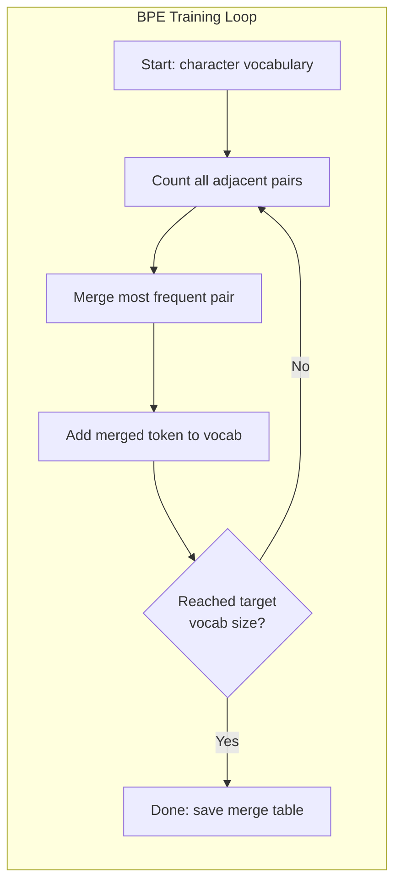
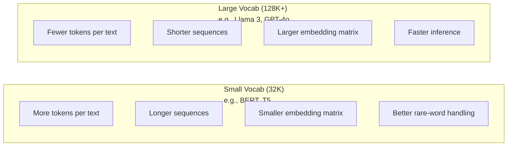

# Tokenizer: BPE, WordPiece, SentencePiece

> LLM kamu tidak membaca bahasa Inggris. Bunyinya bilangan bulat. Tokenizer memutuskan apakah bilangan bulat tersebut mempunyai arti atau menyia-nyiakannya.

**Type:** Build
**Language:** Python
**Prerequisites:** Fase 05 (Yayasan NLP)
**Waktu:** ~90 menit

## Tujuan Pembelajaran

- Menerapkan algoritma tokenization BPE, WordPiece, dan Unigram dari awal dan membandingkan strategi penggabungannya
- Jelaskan bagaimana ukuran kosakata mempengaruhi efisiensi model: terlalu kecil menghasilkan urutan yang panjang, terlalu besar menyia-nyiakan parameter embedding
- Menganalisis artefak tokenization di seluruh bahasa dan code, mengidentifikasi di mana tokenizer tertentu rusak
- Gunakan perpustakaan tiktoken dan kalimat untuk memberi token pada teks dan memeriksa ID token yang dihasilkan

## Masalah

LLM kamu tidak membaca bahasa Inggris. Itu tidak membaca bahasa apa pun. Bunyinya angka.

Kesenjangan antara "Halo, dunia!" dan [15496, 11, 995, 0] adalah tokenizernya. Setiap kata, setiap spasi, setiap tanda baca harus diubah menjadi bilangan bulat sebelum model dapat memprosesnya. Konversi ini tidak netral. Ini memasukkan asumsi ke dalam model yang tidak dapat dibatalkan di kemudian hari.

Jika ini salah, model kamu akan membuang-buang kapasitas pengkodean kata-kata umum dengan banyak token. "sayangnya" menjadi empat token, bukan satu. Jendela konteks 128K kamu menyusut sebesar 75% untuk teks yang berisi kata-kata multi-suku kata. Lakukan dengan benar dan jendela konteks yang sama memiliki makna dua kali lebih banyak. Perbedaan antara "model ini menangani code dengan baik" dan "model ini tersedak pada Python" sering kali terletak pada cara tokenizer dilatih.

Setiap panggilan API yang kamu lakukan ke GPT-4 atau Claude diberi harga per token. Setiap token yang dihasilkan model kamu memerlukan penghitungan biaya. Semakin sedikit token yang diperlukan untuk mewakili suatu output, semakin cepat inference end-to-end. Tokenization bukanlah proses awal. Itu adalah arsitektur.

## Konsep

### Tiga Pendekatan yang Gagal (dan Satu Pendekatan yang Menang)

Ada tiga cara yang jelas untuk mengubah teks menjadi angka. Dua di antaranya tidak berfungsi dalam skala besar.

**Tokenization tingkat kata** dibagi berdasarkan spasi dan tanda baca. "Kucing itu duduk" menjadi ["Si", "kucing", "sat"]. Sederhana. Tapi bagaimana dengan "tokenization"? Atau "GPT-4o"? Atau kata majemuk dalam bahasa Jerman seperti "Geschwindigkeitsbegrenzung"? Tingkat kata membutuhkan kosakata yang banyak untuk mencakup setiap kata dalam setiap bahasa. Jika kamu melewatkan satu kata pun, kamu akan mendapatkan token `[UNK]` yang menakutkan -- cara sang model mengatakan, "Saya tidak tahu ini apa." Bahasa Inggris sendiri memiliki lebih dari satu juta bentuk kata. Tambahkan code, URL, notasi ilmiah, dan 100 bahasa lainnya dan kamu memerlukan kosakata yang tak terbatas.

**Tokenization tingkat karakter** mengarah ke arah lain. "halo" menjadi ["h", "e", "l", "l", "o"]. Kosakata sangat kecil (beberapa ratus karakter). Tidak ada token yang tidak diketahui. Tapi urutannya menjadi sangat panjang. Sebuah kalimat yang terdiri dari 10 token tingkat kata menjadi 50 token tingkat karakter. Model harus belajar bahwa "t", "h", "e" bersama-sama berarti "the" -- membakar kapasitas attention pada sesuatu yang dipelajari manusia pada usia tiga tahun.

**Tokenization subkata** menemukan titik terbaiknya. Kata-kata umum tetap utuh: "the" adalah satu tanda. Kata-kata langka terurai menjadi bagian-bagian yang bermakna: "ketidakbahagiaan" menjadi ["un", "happi", "ness"]. Kosakata tetap dapat dikelola (token 30K hingga 128K). Urutannya tetap pendek. Token yang tidak diketahui pada dasarnya hilang karena kata apa pun dapat dibuat dari potongan subkata.

Setiap LLM modern menggunakan tokenization subkata. GPT-2, GPT-4, BERT, Llama 3, Claude -- semuanya. Pertanyaannya adalah algoritma yang mana.

```mermaid
graph TD
    A["Text: 'unhappiness'"] --> B{"Tokenization Strategy"}
    B -->|Word-level| C["['unhappiness']\n1 token if in vocab\n[UNK] if not"]
    B -->|Character-level| D["['u','n','h','a','p','p','i','n','e','s','s']\n11 tokens"]
    B -->|Subword BPE| E["['un','happi','ness']\n3 tokens"]

    style C fill:#ff6b6b,color:#fff
    style D fill:#ffa500,color:#fff
    style E fill:#51cf66,color:#fff
```### BPE: Pengkodean Pasangan Byte

BPE adalah algoritma kompresi serakah yang digunakan untuk tokenization. Idenya cukup sederhana untuk dimasukkan ke dalam kartu indeks.

Mulailah dengan karakter individu. Hitung setiap pasangan yang berdekatan dalam korpus training. Gabungkan pasangan yang paling sering menjadi token baru. Ulangi sampai kamu mencapai ukuran kosakata target kamu.

Berikut adalah BPE yang dijalankan pada korpus kecil dengan tulisan "lebih rendah", "terendah", dan "terbaru":

```
Corpus (with word frequencies):
  "lower"  x5
  "lowest" x2
  "newest" x6

Step 0 -- Start with characters:
  l o w e r       (x5)
  l o w e s t     (x2)
  n e w e s t     (x6)

Step 1 -- Count adjacent pairs:
  (e,s): 8    (s,t): 8    (l,o): 7    (o,w): 7
  (w,e): 13   (e,r): 5    (n,e): 6    ...

Step 2 -- Merge most frequent pair (w,e) -> "we":
  l o we r        (x5)
  l o we s t      (x2)
  n e we s t      (x6)

Step 3 -- Recount and merge (e,s) -> "es":
  l o we r        (x5)
  l o we s t      (x2)    <- 'es' only forms from 'e'+'s', not 'we'+'s'
  n e we s t      (x6)    <- wait, the 'e' before 'we' and 's' after 'we'

Actually tracking this precisely:
  After "we" merge, remaining pairs:
  (l,o): 7   (o,we): 7   (we,r): 5   (we,s): 8
  (s,t): 8   (n,e): 6    (e,we): 6

Step 3 -- Merge (we,s) -> "wes" or (s,t) -> "st" (tied at 8, pick first):
  Merge (we,s) -> "wes":
  l o we r        (x5)
  l o wes t       (x2)
  n e wes t       (x6)

Step 4 -- Merge (wes,t) -> "west":
  l o we r        (x5)
  l o west        (x2)
  n e west        (x6)

...continue until target vocab size reached.
```

Tabel gabungan adalah tokenizer. Untuk menyandikan teks baru, terapkan penggabungan sesuai urutan yang dipelajari. Korpus training menentukan penggabungan mana yang ada, dan pilihan tersebut secara permanen membentuk apa yang dilihat model.



### BPE Tingkat Byte (GPT-2, GPT-3, GPT-4)

BPE standar beroperasi pada karakter Unicode. BPE tingkat byte beroperasi pada byte mentah (0-255). Ini memberi kamu kosakata dasar persis 256, menangani bahasa atau pengkodean apa pun, dan tidak pernah menghasilkan token yang tidak diketahui.

GPT-2 memperkenalkan pendekatan ini. Kosakata dasar mencakup setiap byte yang mungkin. Penggabungan BPE dibangun di atas semua itu. Pustaka tiktoken OpenAI mengimplementasikan BPE tingkat byte dengan ukuran kosakata berikut:

- GPT-2: 50.257 token
- GPT-3.5/GPT-4: ~100.256 token (pengkodean cl100k_base)
- GPT-4o: 200.019 token (pengkodean o200k_base)

### Bagian Kata (BERT)

WordPiece terlihat mirip dengan BPE tetapi penggabungan pilihannya berbeda. Alih-alih frekuensi mentah, ini memaksimalkan kemungkinan training data:

```
BPE merge criterion:      count(A, B)
WordPiece merge criterion: count(AB) / (count(A) * count(B))
```

BPE bertanya: “Pasangan manakah yang paling sering muncul?” WordPiece bertanya: "Pasangan mana yang lebih sering muncul bersama daripada yang kamu perkirakan secara kebetulan?" Perbedaan halus ini menghasilkan kosa kata yang berbeda. WordPiece lebih menyukai penggabungan ketika kejadian bersama terjadi secara mengejutkan, bukan hanya sering terjadi.

WordPiece juga menggunakan awalan "##" untuk subkata lanjutan:

```
"unhappiness" -> ["un", "##happi", "##ness"]
"embedding"   -> ["em", "##bed", "##ding"]
```

Awalan "##" memberi tahu kamu bahwa bagian ini melanjutkan token sebelumnya. BERT menggunakan WordPiece dengan kosakata 30.522 token. Setiap varian BERT -- DistilBERT, tokenizer RoBERTa sebenarnya adalah BPE, namun BERT sendiri adalah WordPiece.

### Bagian Kalimat (Llama, T5)

SentencePiece memperlakukan input sebagai aliran karakter Unicode mentah, termasuk spasi. Tidak ada langkah pra-tokenization. Tidak ada aturan khusus bahasa tentang batasan kata. Hal ini menjadikannya benar-benar agnostik bahasa -- ini berfungsi pada bahasa China, Jepang, Thailand, dan bahasa lain yang tidak memisahkan kata dengan spasi.

SentencePiece mendukung dua algoritma:
- **Mode BPE**: logika penggabungan yang sama dengan BPE standar, diterapkan pada rangkaian karakter mentah
- **Mode Unigram**: dimulai dengan kosakata yang banyak dan secara berulang menghapus token yang paling sedikit memengaruhi kemungkinan keseluruhan. Kebalikan dari BPE -- pangkas, bukan gabung.

Llama 2 menggunakan SentencePiece BPE dengan kosakata 32.000 token. T5 menggunakan SentencePiece Unigram dengan 32.000 token. Catatan: Llama 3 beralih ke tokenizer BPE tingkat byte berbasis tiktoken dengan 128.256 token.

### Pengorbanan Ukuran Kosakata

Ini adalah keputusan rekayasa nyata dengan konsekuensi yang terukur.



Angka konkrit. Untuk kosakata 128K dengan embedding 4.096 dimension, matrix embedding-nya saja adalah 128.000 x 4.096 = 524 juta parameter. Untuk kosakata 32K, itu adalah 131 juta parameter. Itu adalah perbedaan parameter 400 juta dari pilihan tokenizer saja.Namun kosakata yang lebih besar memampatkan teks dengan lebih agresif. Paragraf bahasa Inggris yang sama yang memerlukan 100 token dengan kosakata 32 ribu mungkin memerlukan 70 token dengan kosakata 128 ribu. Itu berarti 30% lebih sedikit forward pass selama pembangkitan. Untuk model yang melayani jutaan permintaan, hal ini merupakan pengurangan langsung dalam biaya komputasi.

Trennya jelas: jumlah kosa kata semakin bertambah. GPT-2 menggunakan 50.257. GPT-4 menggunakan ~100K. Llama 3 menggunakan 128K. GPT-4o menggunakan 200K.

| Model | Ukuran Kosakata | Jenis Tokenizer | Token Rata-rata per Kata Bahasa Inggris |
|-------|-----------|----------------|---------------------------|
| BERT | 30.522 | Potongan Kata | ~1.4 |
| GPT-2 | 50.257 | BPE tingkat byte | ~1.3 |
| Lama 2 | 32.000 | Potongan Kalimat BPE | ~1.4 |
| GPT-4 | ~100.256 | BPE tingkat byte | ~1.2 |
| Lama 3 | 128.256 | BPE tingkat byte (tiktoken) | ~1.1 |
| GPT-4o | 200.019 | BPE tingkat byte | ~1.0 |

### Pajak Multibahasa

Tokenizer yang dilatih terutama dalam bahasa Inggris akan bersikap brutal terhadap bahasa lain. Teks bahasa Korea di tokenizer GPT-2 rata-rata berisi 2-3 token per kata. Cina bisa lebih buruk lagi. Ini berarti pengguna Korea secara efektif memiliki jendela konteks yang berukuran setengah dari pengguna Inggris -- membayar harga yang sama untuk kepadatan informasi yang lebih sedikit.

Inilah sebabnya Llama 3 meningkatkan kosakatanya empat kali lipat dari 32K menjadi 128K. Semakin banyak token yang didedikasikan untuk skrip non-Inggris berarti kompresi yang lebih adil di seluruh bahasa.

## Build

### Langkah 1: Tokenizer Tingkat Karakter

Mulailah dari fondasi. Tokenizer tingkat karakter memetakan setiap karakter ke titik code Unicode-nya. Tidak diperlukan training. Tidak ada token yang tidak diketahui. Hanya pemetaan langsung.

```python
class CharTokenizer:
    def encode(self, text):
        return [ord(c) for c in text]

    def decode(self, tokens):
        return "".join(chr(t) for t in tokens)
```

"halo" menjadi [104, 101, 108, 108, 111]. Setiap karakter adalah tokennya sendiri. Ini adalah dasar yang kami tingkatkan.

### Langkah 2: Tokenizer BPE dari Awal

Implementasi sebenarnya. Kami melatih byte mentah (seperti GPT-2), menghitung pasangan, menggabungkan yang paling sering, dan mencatat setiap penggabungan secara berurutan. Tabel gabungan adalah tokenizer.

```python
from collections import Counter

class BPETokenizer:
    def __init__(self):
        self.merges = {}
        self.vocab = {}

    def _get_pairs(self, tokens):
        pairs = Counter()
        for i in range(len(tokens) - 1):
            pairs[(tokens[i], tokens[i + 1])] += 1
        return pairs

    def _merge_pair(self, tokens, pair, new_token):
        merged = []
        i = 0
        while i < len(tokens):
            if i < len(tokens) - 1 and tokens[i] == pair[0] and tokens[i + 1] == pair[1]:
                merged.append(new_token)
                i += 2
            else:
                merged.append(tokens[i])
                i += 1
        return merged

    def train(self, text, num_merges):
        tokens = list(text.encode("utf-8"))
        self.vocab = {i: bytes([i]) for i in range(256)}

        for i in range(num_merges):
            pairs = self._get_pairs(tokens)
            if not pairs:
                break
            best_pair = max(pairs, key=pairs.get)
            new_token = 256 + i
            tokens = self._merge_pair(tokens, best_pair, new_token)
            self.merges[best_pair] = new_token
            self.vocab[new_token] = self.vocab[best_pair[0]] + self.vocab[best_pair[1]]

        return self

    def encode(self, text):
        tokens = list(text.encode("utf-8"))
        for pair, new_token in self.merges.items():
            tokens = self._merge_pair(tokens, pair, new_token)
        return tokens

    def decode(self, tokens):
        byte_sequence = b"".join(self.vocab[t] for t in tokens)
        return byte_sequence.decode("utf-8", errors="replace")
```

Lingkaran training adalah inti dari BPE: hitung pasangan, gabungkan pemenang, ulangi. Setiap penggabungan mengurangi jumlah total token. Setelah putaran `num_merges`, kosakata bertambah dari 256 (byte dasar) menjadi 256 + num_merges.

Pengkodean menerapkan penggabungan sesuai urutan yang dipelajari. Ini penting. Jika penggabungan 1 menghasilkan "th" dan penggabungan 5 menghasilkan "the", pengkodean harus menerapkan penggabungan 1 terlebih dahulu agar "the" dapat terbentuk dari "th" + "e" pada penggabungan 5.

Penguraian code adalah kebalikannya: cari setiap ID token dalam kosakata, gabungkan byte, dekode ke UTF-8.

### Langkah 3: Encode dan Decode Pulang Pergi

```python
corpus = (
    "The cat sat on the mat. The cat ate the rat. "
    "The dog sat on the log. The dog ate the frog. "
    "Natural language processing is the study of how computers "
    "understand and generate human language. "
    "Tokenization is the first step in any NLP pipeline."
)

tokenizer = BPETokenizer()
tokenizer.train(corpus, num_merges=40)

test_sentences = [
    "The cat sat on the mat.",
    "Natural language processing",
    "tokenization pipeline",
    "unhappiness",
]

for sentence in test_sentences:
    encoded = tokenizer.encode(sentence)
    decoded = tokenizer.decode(encoded)
    raw_bytes = len(sentence.encode("utf-8"))
    ratio = len(encoded) / raw_bytes
    print(f"'{sentence}'")
    print(f"  Tokens: {len(encoded)} (from {raw_bytes} bytes) -- ratio: {ratio:.2f}")
    print(f"  Roundtrip: {'PASS' if decoded == sentence else 'FAIL'}")
```

Rasio kompresi memberi tahu kamu seberapa efektif tokenizer tersebut. Rasio 0,50 berarti tokenizer mengompresi teks menjadi setengah jumlah token dari byte mentah. Lebih rendah lebih baik. Pada korpus training, rasionya akan bagus. Pada teks di luar distribusi seperti "ketidakbahagiaan" (yang tidak muncul di korpus), rasionya akan lebih buruk -- tokenizer kembali ke pengkodean tingkat karakter untuk pola yang tidak terlihat.

### Langkah 4: Bandingkan dengan tiktoken

```python
import tiktoken

enc = tiktoken.get_encoding("cl100k_base")

texts = [
    "The cat sat on the mat.",
    "unhappiness",
    "Hello, world!",
    "def fibonacci(n): return n if n < 2 else fibonacci(n-1) + fibonacci(n-2)",
    "Geschwindigkeitsbegrenzung",
]

for text in texts:
    our_tokens = tokenizer.encode(text)
    tiktoken_tokens = enc.encode(text)
    tiktoken_pieces = [enc.decode([t]) for t in tiktoken_tokens]
    print(f"'{text}'")
    print(f"  Our BPE:   {len(our_tokens)} tokens")
    print(f"  tiktoken:  {len(tiktoken_tokens)} tokens -> {tiktoken_pieces}")
```

tiktoken menggunakan algoritma yang sama persis tetapi dilatih pada ratusan gigabyte teks dengan 100.000 gabungan. Algoritmenya identik. Perbedaannya terletak pada training data dan jumlah penggabungan. Tokenizer kamu yang dilatih pada paragraf dengan 40 gabungan tidak dapat bersaing dengan 100 ribu gabungan Tiktoken pada korpus besar. Tapi mekanismenya sama.

### Langkah 5: Analisis Kosakata

```python
def analyze_vocabulary(tokenizer, test_texts):
    total_tokens = 0
    total_chars = 0
    token_usage = Counter()

    for text in test_texts:
        encoded = tokenizer.encode(text)
        total_tokens += len(encoded)
        total_chars += len(text)
        for t in encoded:
            token_usage[t] += 1

    print(f"Vocabulary size: {len(tokenizer.vocab)}")
    print(f"Total tokens across all texts: {total_tokens}")
    print(f"Total characters: {total_chars}")
    print(f"Avg tokens per character: {total_tokens / total_chars:.2f}")

    print(f"\nMost used tokens:")
    for token_id, count in token_usage.most_common(10):
        token_bytes = tokenizer.vocab[token_id]
        display = token_bytes.decode("utf-8", errors="replace")
        print(f"  Token {token_id:4d}: '{display}' (used {count} times)")

    unused = [t for t in tokenizer.vocab if t not in token_usage]
    print(f"\nUnused tokens: {len(unused)} out of {len(tokenizer.vocab)}")
```Ini mengungkapkan distribusi Zipf dalam kosakata kamu. Beberapa token mendominasi (spasi, "the", "e"). Kebanyakan token jarang digunakan. Tokenizer produksi mengoptimalkan distribusi ini -- pola umum mendapatkan ID token pendek, pola langka mendapatkan representasi lebih panjang.

## Pakai

BPE awal kamu berfungsi. Sekarang lihat seperti apa alat produksinya.

### tiktoken (OpenAI)

```python
import tiktoken

enc = tiktoken.get_encoding("cl100k_base")

text = "Tokenizers convert text to integers"
tokens = enc.encode(text)
print(f"Tokens: {tokens}")
print(f"Pieces: {[enc.decode([t]) for t in tokens]}")
print(f"Roundtrip: {enc.decode(tokens)}")
```

tiktoken ditulis dalam Rust dengan binding Python. Ini mengkodekan jutaan token per detik. Algoritme BPE yang sama, implementasi berkekuatan industri.

### Memeluk Tokenizer Wajah

```python
from tokenizers import Tokenizer
from tokenizers.models import BPE
from tokenizers.trainers import BpeTrainer
from tokenizers.pre_tokenizers import ByteLevel

tokenizer = Tokenizer(BPE())
tokenizer.pre_tokenizer = ByteLevel()

trainer = BpeTrainer(vocab_size=1000, special_tokens=["<pad>", "<eos>", "<unk>"])
tokenizer.train(["corpus.txt"], trainer)

output = tokenizer.encode("The cat sat on the mat.")
print(f"Tokens: {output.tokens}")
print(f"IDs: {output.ids}")
```

Pustaka tokenizer Hugging Face juga dilengkapi dengan Rust. Ini melatih BPE pada corpora skala gigabyte dalam hitungan detik. Inilah yang kamu gunakan saat melatih model kamu sendiri.

### Memuat Tokenizer Llama

```python
from transformers import AutoTokenizer

tokenizer = AutoTokenizer.from_pretrained("meta-llama/Llama-3.1-8B")

text = "Tokenizers are the unsung heroes of LLMs"
tokens = tokenizer.encode(text)
print(f"Token IDs: {tokens}")
print(f"Tokens: {tokenizer.convert_ids_to_tokens(tokens)}")
print(f"Vocab size: {tokenizer.vocab_size}")

multilingual = ["Hello world", "Hola mundo", "Bonjour le monde"]
for text in multilingual:
    ids = tokenizer.encode(text)
    print(f"'{text}' -> {len(ids)} tokens")
```

Kosakata 128K Llama 3 mengompresi teks non-Inggris secara signifikan lebih baik daripada kosakata 50K GPT-2. kamu dapat memverifikasinya sendiri -- enkodekan kalimat yang sama dalam berbagai bahasa dan hitung tokennya.

## Kirim

Lesson ini menghasilkan `outputs/prompt-tokenizer-analyzer.md` -- prompt yang dapat digunakan kembali yang menganalisis efisiensi tokenization untuk kombinasi teks dan model apa pun. Berikan contoh teks dan ini akan memberi tahu kamu tokenizer model mana yang paling baik menanganinya.

## Latihan

1. Ubah tokenizer BPE untuk mencetak kosakata pada setiap langkah penggabungan. Perhatikan bagaimana "t" + "h" menjadi "th", lalu "th" + "e" menjadi "the". Lacak bagaimana kata-kata umum dalam bahasa Inggris dikumpulkan sepotong demi sepotong.

2. Tambahkan token khusus (`<pad>`, `<eos>`, `<unk>`) ke tokenizer BPE. Tetapkan mereka ID 0, 1, 2 dan geser semua token lainnya sesuai dengan itu. Menerapkan langkah pra-tokenization yang membagi spasi sebelum menjalankan BPE.

3. Menerapkan kriteria penggabungan WordPiece (rasio kemungkinan, bukan frekuensi). Latih BPE dan WordPiece pada korpus yang sama dengan jumlah penggabungan yang sama. Bandingkan kosakata yang dihasilkan -- manakah yang menghasilkan subkata yang lebih bermakna secara linguistik?

4. Membangun tolok ukur efisiensi tokenizer multibahasa. Ambil 10 kalimat dalam bahasa Inggris, Spanyol, Cina, Korea, dan Arab. Tokenisasikan masing-masing dengan tiktoken (cl100k_base) dan ukur rata-rata token per karakter. Hitung "pajak multibahasa" untuk setiap bahasa.

5. Latih tokenizer BPE kamu pada korpus yang lebih besar (unduh artikel Wikipedia). Sesuaikan jumlah penggabungan untuk mencapai rasio kompresi dalam 10% tiktoken pada teks yang sama. Hal ini memaksa kamu untuk memahami hubungan antara ukuran korpus, jumlah penggabungan, dan kualitas kompresi.

## Istilah Kunci| Istilah | Apa kata orang | Apa sebenarnya arti |
|------|----------------|----------------------|
| Tanda | "Sebuah kata" | Unit dalam kosakata model -- dapat berupa karakter, subkata, kata, atau potongan multikata |
| BPE | "Beberapa hal kompresi" | Pengkodean Pasangan Byte -- menggabungkan pasangan token berdekatan yang paling sering digunakan secara berulang hingga ukuran kosakata target tercapai |
| Potongan Kata | "Tokenizer BERT" | Seperti BPE tetapi penggabungan memaksimalkan rasio kemungkinan count(AB)/(count(A)*count(B)) alih-alih frekuensi mentah |
| Potongan Kalimat | "Perpustakaan tokenizer" | Tokenizer tanpa bahasa yang beroperasi pada Unicode mentah tanpa pra-tokenization, mendukung algoritma BPE dan Unigram |
| Ukuran kosakata | "Berapa banyak kata yang diketahuinya" | Jumlah total token unik: GPT-2 punya 50.257, BERT punya 30.522, Llama 3 punya 128.256 |
| Kesuburan | "Bukan istilah tokenizer" | Jumlah rata-rata token per kata -- mengukur efisiensi tokenizer di seluruh bahasa (1,0 sempurna, 3,0 berarti model bekerja tiga kali lebih keras) |
| BPE tingkat byte | "Tokenizer GPT" | BPE beroperasi pada byte mentah (0-255) dan bukan karakter Unicode, menjamin tidak ada token yang tidak diketahui untuk input apa pun |
| Gabungkan tabel | "File tokenizer" | Daftar gabungan pasangan yang dipelajari selama training -- ini adalah tokenizernya, dan urutannya penting |
| Pra-tokenization | "Membelah spasi" | Aturan yang diterapkan sebelum tokenization subkata: pemisahan spasi, pemisahan digit, penanganan tanda baca |
| Rasio kompresi | "Seberapa efisien tokenizer" | Token yang dihasilkan dibagi dengan byte input -- lebih rendah berarti kompresi lebih baik dan inference lebih cepat |

## Bacaan Lanjutan

- [Sennrich et al., 2016 -- "Neural Machine Translation of Rare Words with Subword Units"](https://arxiv.org/abs/1508.07909) -- makalah yang memperkenalkan BPE untuk NLP, mengubah algoritme kompresi tahun 1994 menjadi fondasi tokenization modern
- [Kudo & Richardson, 2018 -- "SentencePiece: Tokenizer subkata yang sederhana dan tidak bergantung pada bahasa"](https://arxiv.org/abs/1808.06226) -- tokenization tanpa bahasa yang membuat model multibahasa menjadi praktis
- [Repositori tiktoken OpenAI](https://github.com/openai/tiktoken) -- implementasi BPE produksi di Rust dengan binding Python, digunakan oleh GPT-3.5/4/4o
- [Dokumentasi Hugging Face Tokenizers](https://huggingface.co/docs/tokenizers) -- training tokenizer tingkat produksi dengan performa Rust
