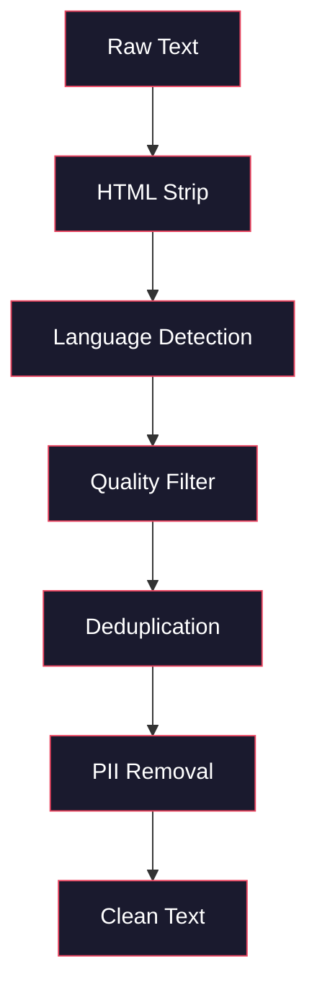
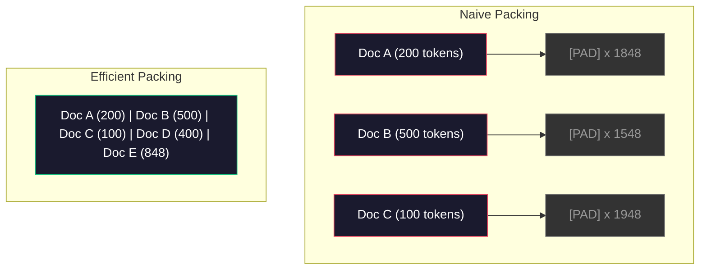

# Pipeline Data untuk Pra-Training

> Modelnya adalah cermin. Ini mencerminkan data apa pun yang kamu masukkan. Beri makan sampah, itu mencerminkan sampah dengan kelancaran sempurna.

**Type:** Build
**Language:** Python
**Prerequisites:** Fase 10, Lesson 01-02 (Tokenizer, Membangun Tokenizer)
**Waktu:** ~90 menit

## Tujuan Pembelajaran

- Membangun pipeline data streaming yang memberi token, memotong, mengacak, dan mengelompokkan teks berukuran terabyte tanpa memuat semuanya ke dalam memori
- Menerapkan filter kualitas data (deduplikasi, deteksi bahasa, pemfilteran konten) yang digunakan dalam pipeline pra-training nyata
- Buat urutan training dengan panjang tetap dengan attention mask yang tepat dan penanganan batas dokumen
- Throughput pipeline profil untuk memastikan pemuat data mengikuti kecepatan training GPU

## Masalah

kamu memiliki tokenizer. Sekarang kamu membutuhkan data.

Bukan dataset. Bukan file CSV. Teks berukuran terabyte -- dibersihkan, dihapus duplikatnya, difilter untuk kualitas, diberi token ke dalam urutan dengan panjang tetap, dan disajikan dalam batch acak dengan cukup cepat sehingga cluster 8-GPU kamu tidak perlu menunggu batch berikutnya.

Kebanyakan orang mengira training LLM adalah tentang arsitektur model. Tidak. Llama 3 menggunakan 15,6 triliun token. GPT-3 menggunakan 300 miliar. DeepSeek-V2 menggunakan 8,1 triliun. Arsitektur ketiganya kira-kira sama: blok Transformer bertumpuk dengan layer attention dan umpan maju. Perbedaan kualitas output sebagian besar berasal dari data.

Makalah Chinchilla dari DeepMind membuat hal ini menjadi tepat. Untuk anggaran komputasi tertentu, terdapat rasio optimal parameter model terhadap token training. Chinchilla menunjukkan bahwa sebagian besar model pada tahun 2022 kurang terlatih -- mereka memiliki terlalu banyak parameter untuk jumlah data yang mereka lihat. Model parameter 70 miliar yang dilatih pada 1,4 triliun token (optimal Chinchilla) mengungguli model 280 miliar yang dilatih pada 300 miliar token (Gopher).

Pipeline data kamu menentukan apakah model kamu mempelajari bahasa atau mempelajari noise.

## Konsep

### Dari Mana Data Berasal

Setiap large language model dilatih pada berbagai sumber. Komposisi pastinya merupakan rahasia yang dijaga ketat di sebagian besar laboratorium, namun kami cukup mengetahui untuk memahami kategorinya.

| Sumber | Ukuran | Kualitas | Digunakan Oleh |
|--------|------|---------|---------|
| Perayapan Umum | ~250 TB mentah | Rendah (memerlukan penyaringan yang berat) | GPT-3, Llama, model paling terbuka |
| Wikipedia | ~20 GB | Tinggi | Setiap LLM utama |
| Code GitHub | ~1 TB+ | Sedang (banyak duplikat, code mati) | StarCoder, CodeLlama, DeepSeek-Coder |
| Buku (BookCorpus, Pile) | ~100 GB | Tinggi | GPT-2, GPT-3, model awal |
| Makalah akademis (arXiv, S2ORC) | ~100 GB | Tinggi untuk STEM | Lama, Galactica |
| StackOverflow, Reddit | ~100 GB | Sedang | Lama, Elang |
| Web yang dikurasi (C4, RefinedWeb) | ~5 TB | Sedang-Tinggi (pra-filter) | T5, Elang |

Llama 3 mengungkapkan campuran datanya: sekitar 50% data web, 25% code, 13% buku dan makalah akademis, 8% data matematika, dan 4% data web multibahasa. Totalnya adalah 15,6 triliun token dari sumber yang melebihi 5 TB teks mentah.

Rasio sama pentingnya dengan ukuran total. Terlalu banyak data web dan modelnya menjadi burung beo Reddit. Code terlalu sedikit dan tidak dapat diprogram. Terlalu sedikit matematika dan gagal dalam penalaran. Melakukan perpaduan ini dengan benar adalah salah satu bagian tersulit dalam melatih LLM, dan tidak ada rumusnya -- hal ini memerlukan eksperimen dan evaluasi.

### Pembersihan Data

Data web mentah itu kotor. Dump Perayapan Umum yang khas berisi:- Tag HTML dan JavaScript
- Header, footer, menu navigasi Boilerplate
- Halaman duplikat (tepat dan hampir duplikat)
- Spam yang dihasilkan mesin
- Informasi pengenal pribadi (PII)
- Teks berkualitas rendah (daftar kata kunci, spam SEO)
- Konten non-teks dikodekan sebagai teks

Membersihkan ini bukanlah suatu pilihan. Ini adalah perbedaan antara model yang menghasilkan paragraf koheren dan model yang menghasilkan tag HTML yang dicampur dengan daftar produk.



Setiap langkah menghilangkan kategori kebisingan:

**Pengupasan HTML:** Hapus semua markup. Simpan hanya konten teks yang terlihat. Perpustakaan seperti `trafilatura` atau `readability` mengekstrak konten artikel sambil membuang navigasi, iklan, dan boilerplate.

**Deteksi bahasa:** Gunakan model identifikasi bahasa fastText (lid.176.bin) untuk mengklasifikasikan setiap dokumen. Filter ke bahasa target kamu. Sebuah dokumen yang diklasifikasikan sebagai bahasa Inggris dengan tingkat kepercayaan kurang dari 0,8 mungkin bukan bahasa Inggris yang bersih.

**Pemfilteran kualitas:** Di sinilah hal yang menarik. RefinedWeb (dataset di belakang Falcon) menggunakan filter berbasis perplexity: latih model bahasa kecil di Wikipedia, lalu beri skor pada setiap dokumen. Perplexity yang tinggi berarti dokumen tersebut tidak seperti Wikipedia -- kemungkinan besar merupakan spam, daftar kata kunci, atau konten buatan mesin. Dokumen dengan tingkat perplexity di atas ambang batas akan dihapus.

**Deduplikasi:** Satu-satunya langkah pembersihan yang paling berdampak. Perayapan Umum berisi sejumlah besar halaman duplikat -- penafian hukum, pemberitahuan cookie, persyaratan layanan. Training tentang duplikat menyia-nyiakan komputasi dan dapat menyebabkan model menghafal dan memuntahkan bagian tertentu kata demi kata.

**Penghapusan PII:** Nama, alamat email, nomor telepon, nomor jaminan sosial. Deteksi berbasis regex untuk PII terstruktur, model NER untuk nama dalam konteks.

### Deduplikasi dengan MinHash

Deduplikasi yang tepat itu mudah: hash setiap dokumen, hapus duplikat. Namun masalah sebenarnya adalah duplikat yang hampir sama. Dua salinan artikel berita yang sama dengan iklan yang sedikit berbeda hampir merupakan duplikat. Kontennya 95% identik, tetapi tiap byte berbeda.

MinHash + Locality-Sensitive Hashing (LSH) menyelesaikan masalah ini secara efisien.


Idenya:

1. **Shingling:** Konversi setiap dokumen menjadi kumpulan n-gram (misalnya, 5 gram kata atau karakter). "rubah coklat cepat" dengan sirap 3 kata menjadi {"si coklat cepat", "rubah coklat cepat"}.

2. **MinHash:** Untuk setiap kumpulan sirap dokumen, hitung k nilai hash. Setiap nilai hash adalah hash minimum di semua sirap di bawah fungsi hash yang berbeda. Ini menciptakan "tanda tangan" berukuran tetap yang mendekati kesamaan Jaccard antara dua dokumen mana pun.

3. **LSH:** Kelompokkan dokumen ke dalam keranjang berdasarkan pita tanda tangan MinHashnya. Dokumen dalam wadah yang sama merupakan kandidat yang hampir duplikat. Hal ini untuk menghindari membandingkan setiap pasangan -- kamu hanya membandingkan kandidat.

4. **Verifikasi:** Untuk setiap pasangan kandidat, hitung kesamaan Jaccard yang tepat. Hapus satu salinan jika kesamaan melebihi ambang batas (biasanya 0,8).

Tim Llama melaporkan menghapus sekitar 38% data web mereka melalui deduplikasi. Itu bukanlah angka yang kecil. Lebih dari sepertiga Perayapan Umum adalah konten duplikat atau hampir duplikat.

### Urutan Pengepakan

Model kamu mengharapkan urutan input dengan panjang tetap. Panjang dokumen kamu bervariasi. Ada yang 50 token. Ada yang 50.000 token.

Pendekatan naif: padukan setiap dokumen ke panjang urutan maksimum. Hal ini membuang-buang komputasi besar-besaran pada padding token yang tidak memberikan kontribusi apa pun pada pembelajaran.Pendekatan yang lebih baik: kemas beberapa dokumen ke dalam satu urutan, dipisahkan dengan token akhir urutan. Urutan token 2048 mungkin berisi tiga dokumen pendek yang digabungkan dengan token [EOS] di antara keduanya.



Attention mask harus dipasang dengan benar. Token dari Dokumen A tidak boleh menggantikan token dari Dokumen B dalam urutan pengemasan yang sama. Ini memerlukan attention mask blok-diagonal.

Dokumen panjang terpotong atau dipecah menjadi beberapa bagian pada batas urutan. Titik pisah itu penting: pemisahan di tengah kalimat memaksa model melihat pemikiran yang tidak lengkap. Beberapa alur menyelaraskan pemisahan ke batas paragraf atau kalimat jika memungkinkan.

### Hukum Penskalaan Chinchilla

Untuk anggaran komputasi tetap C (diukur dalam FLOP), ukuran model optimal N dan ukuran dataset D adalah sebagai berikut:

```
N_opt ~ C^0.5
D_opt ~ C^0.5
```

Dalam praktiknya, ini berarti kamu harus menskalakan ukuran model dan ukuran dataset secara kira-kira sama. Model dengan parameter 10x lebih banyak memerlukan token training sekitar 10x lebih banyak untuk mencapai loss yang sama.

| Model | Parameter | Token Training | Chinchilla-Optimal? |
|-------|-----------|----------------|-------------------|
| GPT-3 | 175B | 300B | Tidak (undertrained 3-4x) |
| chinchilla | 70B | 1.4T | Ya (sesuai desain) |
| Lama 2 | 70B | 2T | Berlatih berlebihan (sengaja) |
| Lama 3 | 70B | 15T | Sangat terlatih |

Llama 3 sengaja melanggar hukum Chinchilla. Meta menemukan bahwa training berlebihan pada lebih banyak data -- jauh melampaui rasio komputasi optimal -- menghasilkan model inference yang lebih baik. Biaya training tambahan dibayarkan satu kali, namun model yang lebih kecil lebih murah untuk digunakan selamanya. Hal ini terkadang disebut pendekatan penskalaan "inference-optimal", dan telah menjadi standar industri sejak tahun 2024.

## Build

### Langkah 1: Pembersihan Teks

Hapus HTML, normalkan spasi, hapus konten non-teks. Kami akan menggunakan teks domain publik (Proyek Gutenberg) sebagai korpus kecil kami.

```python
import re

def clean_text(text):
    text = re.sub(r"<[^>]+>", "", text)
    text = re.sub(r"http\S+", "", text)
    text = re.sub(r"[^\x20-\x7E\n]", "", text)
    text = re.sub(r"\n{3,}", "\n\n", text)
    text = re.sub(r" {2,}", " ", text)
    return text.strip()

def quality_filter(text, min_words=50, max_ratio_caps=0.3, max_ratio_special=0.1):
    words = text.split()
    if len(words) < min_words:
        return False
    caps_ratio = sum(1 for w in words if w.isupper()) / len(words)
    if caps_ratio > max_ratio_caps:
        return False
    special_chars = sum(1 for c in text if not c.isalnum() and not c.isspace())
    if special_chars / max(len(text), 1) > max_ratio_special:
        return False
    return True
```

Filter kualitas menangkap spam SEO (HURUF BESAR SEMUA), kebisingan yang dihasilkan mesin (rasio karakter khusus yang tinggi), dan halaman rintisan (terlalu pendek). Ketiga pemeriksaan ini saja sudah menghilangkan sejumlah besar sampah dari perayapan web.

### Langkah 2: Deduplikasi MinHash

Terapkan MinHash dari awal. Tidak diperlukan perpustakaan eksternal -- cukup `hashlib`.

```python
import hashlib
from collections import defaultdict

def get_shingles(text, k=5):
    words = text.lower().split()
    if len(words) < k:
        return set()
    return {" ".join(words[i:i+k]) for i in range(len(words) - k + 1)}

def minhash_signature(shingles, num_hashes=128):
    signature = []
    for i in range(num_hashes):
        min_hash = float("inf")
        for shingle in shingles:
            h = int(hashlib.sha256(f"{i}:{shingle}".encode()).hexdigest(), 16)
            min_hash = min(min_hash, h)
        signature.append(min_hash)
    return signature

def lsh_buckets(signature, bands=16):
    rows_per_band = len(signature) // bands
    buckets = []
    for b in range(bands):
        start = b * rows_per_band
        band_data = tuple(signature[start:start + rows_per_band])
        bucket_hash = hashlib.md5(str(band_data).encode()).hexdigest()
        buckets.append((b, bucket_hash))
    return buckets

def deduplicate(documents, threshold=0.8, num_hashes=128, bands=16):
    signatures = []
    shingle_sets = []
    for doc in documents:
        shingles = get_shingles(doc)
        shingle_sets.append(shingles)
        signatures.append(minhash_signature(shingles, num_hashes))

    bucket_map = defaultdict(list)
    for doc_idx, sig in enumerate(signatures):
        for band_id, bucket_hash in lsh_buckets(sig, bands):
            bucket_map[(band_id, bucket_hash)].append(doc_idx)

    duplicate_pairs = set()
    for bucket_docs in bucket_map.values():
        if len(bucket_docs) < 2:
            continue
        for i in range(len(bucket_docs)):
            for j in range(i + 1, len(bucket_docs)):
                duplicate_pairs.add((bucket_docs[i], bucket_docs[j]))

    removed = set()
    for i, j in duplicate_pairs:
        if i in removed or j in removed:
            continue
        s1, s2 = shingle_sets[i], shingle_sets[j]
        if not s1 or not s2:
            continue
        jaccard = len(s1 & s2) / len(s1 | s2)
        if jaccard >= threshold:
            removed.add(j)

    return [doc for idx, doc in enumerate(documents) if idx not in removed], len(removed)
```

Parameter `num_hashes=128` dan `bands=16` mengontrol tradeoff penarikan presisi. Lebih banyak hash memberikan perkiraan kesamaan yang lebih akurat. Lebih banyak pita meningkatkan perolehan (menangkap lebih banyak duplikat) dengan mengorbankan lebih banyak kesalahan positif. Nilai-nilai ini berfungsi dengan baik untuk teks web biasa.

### Langkah 3: Tokenization dan Urutan Kemas

Ambil teks yang bersih dan tidak terduplikasi, buat tokenization, dan kemas ke dalam urutan dengan panjang tetap untuk training.

```python
def tokenize_corpus(documents, tokenizer):
    all_tokens = []
    for doc in documents:
        tokens = tokenizer.encode(doc)
        all_tokens.extend(tokens)
        all_tokens.append(tokenizer.eos_id)
    return all_tokens

def pack_sequences(token_ids, seq_length, pad_id=0):
    sequences = []
    attention_masks = []
    for i in range(0, len(token_ids), seq_length):
        seq = token_ids[i:i + seq_length]
        mask = [1] * len(seq)
        if len(seq) < seq_length:
            pad_count = seq_length - len(seq)
            seq = seq + [pad_id] * pad_count
            mask = mask + [0] * pad_count
        sequences.append(seq)
        attention_masks.append(mask)
    return sequences, attention_masks
```

### Langkah 4: DataLoader untuk Training

Menghasilkan kumpulan urutan yang dikemas secara acak. Inilah yang digunakan oleh loop training.

```python
import random

class PreTrainingDataLoader:
    def __init__(self, sequences, attention_masks, batch_size, shuffle=True):
        self.sequences = sequences
        self.attention_masks = attention_masks
        self.batch_size = batch_size
        self.shuffle = shuffle

    def __len__(self):
        return (len(self.sequences) + self.batch_size - 1) // self.batch_size

    def __iter__(self):
        indices = list(range(len(self.sequences)))
        if self.shuffle:
            random.shuffle(indices)
        for start in range(0, len(indices), self.batch_size):
            batch_idx = indices[start:start + self.batch_size]
            batch_seqs = [self.sequences[i] for i in batch_idx]
            batch_masks = [self.attention_masks[i] for i in batch_idx]
            yield batch_seqs, batch_masks
```

### Langkah 5: Statistik Kumpulan Data

Hitung angka-angka yang penting: total token, token unik, rasio kompresi, distribusi panjang dokumen.

```python
from collections import Counter

def compute_statistics(documents, token_ids, sequences, tokenizer_vocab_size):
    total_chars = sum(len(d) for d in documents)
    total_tokens = len(token_ids)
    unique_tokens = len(set(token_ids))
    compression_ratio = total_chars / total_tokens

    doc_lengths = [len(d.split()) for d in documents]
    avg_doc_length = sum(doc_lengths) / max(len(doc_lengths), 1)
    max_doc_length = max(doc_lengths) if doc_lengths else 0
    min_doc_length = min(doc_lengths) if doc_lengths else 0

    token_counts = Counter(token_ids)
    top_tokens = token_counts.most_common(10)

    non_pad_tokens = sum(sum(1 for t in seq if t != 0) for seq in sequences)
    total_positions = sum(len(seq) for seq in sequences)
    utilization = non_pad_tokens / max(total_positions, 1)

    stats = {
        "total_documents": len(documents),
        "total_characters": total_chars,
        "total_tokens": total_tokens,
        "unique_tokens": unique_tokens,
        "vocab_utilization": unique_tokens / tokenizer_vocab_size,
        "compression_ratio": compression_ratio,
        "avg_doc_length_words": avg_doc_length,
        "max_doc_length_words": max_doc_length,
        "min_doc_length_words": min_doc_length,
        "num_sequences": len(sequences),
        "sequence_utilization": utilization,
        "top_10_tokens": top_tokens,
    }
    return stats
```

Rasio kompresi memberi tahu kamu seberapa efisien tokenizer pada korpus ini. Teks bahasa Inggris biasanya dikompres menjadi sekitar 3-4 karakter per token. Jika kamu melihat 1,5 karakter per token, tokenizer kamu terpecah terlalu agresif. Jika kamu melihat 8+, berarti ia telah mempelajari penggabungan yang sangat spesifik untuk domain.Pemanfaatan urutan memberi tahu kamu seberapa banyak urutan yang dikemas merupakan data nyata versus padding. Di bawah 90% berarti pengepakan kamu tidak efisien -- kamu membuang-buang komputasi pada token padding.

## Pakai

### Bandingkan Dengan Kumpulan Data HuggingFace

Muat korpus yang sama melalui pustaka dataset HuggingFace dan bandingkan kecepatan pipeline.

```python
from datasets import load_dataset
from transformers import AutoTokenizer

ds = load_dataset("wikitext", "wikitext-2-raw-v1", split="train")
tokenizer = AutoTokenizer.from_pretrained("meta-llama/Meta-Llama-3-8B")

import time

start = time.time()
tokenized = ds.map(
    lambda x: tokenizer(x["text"], truncation=True, max_length=2048),
    batched=True,
    num_proc=4,
)
hf_time = time.time() - start
total_tokens = sum(len(t) for t in tokenized["input_ids"])
print(f"HuggingFace: {total_tokens:,} tokens in {hf_time:.2f}s ({total_tokens/hf_time:,.0f} tokens/sec)")
```

Pipeline HuggingFace menggunakan tokenizer Rust dan pemrosesan paralel di 4 inti. Pipeline Python murni kamu akan menjadi 10-50x lebih lambat. Kesenjangan itulah yang menjadi alasan tim produksi menggunakan tokenizer yang dikompilasi. Algoritmanya sama. Bahasa implementasinya adalah perbedaannya.

## Kirim

Lesson ini menghasilkan prompt untuk memvalidasi dan men-debug kualitas data di alur training LLM. Lihat `outputs/prompt-data-quality-checker.md`.

## Latihan

1. **Mudah:** Tambahkan deteksi bahasa ke pipeline pembersihan menggunakan heuristik sederhana (analisis rangkaian karakter). Filter ke hanya dokumen berbahasa Inggris dan ukur berapa banyak dokumen yang dihapus.
2. **Medium:** Terapkan deduplikasi yang tepat menggunakan hash SHA-256 bersama dengan hampir deduplikasi MinHash. Bandingkan jumlah duplikat yang ditangkap oleh masing-masing metode pada korpus yang tergores web.
3. **Sulit:** Buat filter kualitas berbasis perplexity. Latih model bahasa bigram kecil pada teks Wikipedia, beri skor pada setiap dokumen berdasarkan tingkat kerumitannya, dan hapus 20% terbawah. Bandingkan kualitas output model saat melatih data yang difilter dan tidak difilter.

## Istilah Kunci

| Istilah | Apa kata orang | Apa sebenarnya arti |
|------|----------------|----------------------|
| Perayapan Umum | "Internet" | Organisasi nirlaba yang merayapi web setiap bulan -- ~250TB mentah, titik awal untuk sebagian besar training data LLM |
| MinHash | "Beberapa trik hashing" | Sebuah teknik untuk memperkirakan kesamaan Jaccard antar set menggunakan tanda tangan berukuran tetap -- memungkinkan deteksi hampir duplikat dalam skala besar |
| LSH | "Hashing Sensitif Lokalitas" | Sebuah metode untuk mengelompokkan item serupa ke dalam wadah yang sama -- mengurangi perbandingan berpasangan dari O(n^2) menjadi hampir linier |
| Urutan pengepakan | "Menggabungkan dokumen" | Menyesuaikan beberapa dokumen ke dalam urutan dengan panjang tetap dengan attention mask yang tepat -- menghilangkan pemborosan padding |
| penskalaan chinchilla | "Latih lebih banyak data" | Untuk anggaran komputasi tetap, performa optimal memerlukan penskalaan ukuran model dan token training yang kira-kira sama |
| Kesuburan | "Token per kata" | Jumlah rata-rata token per kata -- 1,3 untuk bahasa Inggris di GPT-4, lebih tinggi untuk skrip non-Latin |
| Pencampuran data | "Memilih training data" | Rasio code vs teks vs matematika vs data multibahasa -- tanpa rumus, memerlukan eksperimen |
| Filter perplexity | "Penilaian kualitas" | Gunakan model bahasa kecil untuk menilai dokumen -- tingkat perplexity yang tinggi berarti teks tersebut tidak seperti data referensi yang bersih |
| Deduplikasi | "Menghapus salinan" | Menghilangkan dokumen yang sama persis dan hampir duplikat -- biasanya menghapus 30-40% data web mentah |
| Attention mask | "Token mana yang harus dilihat" | Masker biner yang mencegah attention melintasi batas dokumen dalam urutan yang dikemas |

## Bacaan Lanjutan- [Hoffmann et al., 2022 -- Training Compute-Optimal Large Language Models (Chinchilla)](https://arxiv.org/abs/2203.15556) -- makalah yang mengubah cara kita berpikir tentang skala data
- [Penedo dkk., 2023 -- Kumpulan Data RefinedWeb untuk Falcon LLM](https://arxiv.org/abs/2306.01116) -- cara memfilter Perayapan Umum ke kualitas tinggi
- [Touvron et al., 2023 -- Llama 2: Open Foundation dan Model Obrolan yang Disempurnakan](https://arxiv.org/abs/2307.09288) -- detail pipeline data untuk Llama 2
- [Lee et al., 2022 -- Penghapusan duplikasi Data Training Membuat Model Bahasa Lebih Baik](https://arxiv.org/abs/2107.06499) -- mengapa deduplikasi lebih penting dari yang kamu pikirkan
- [Broder, 1997 -- Tentang Kemiripan dan Penahanan Dokumen](https://ieeexplore.ieee.org/document/666900) -- makalah MinHash asli
- [Meta, 2024 -- Laporan Teknis Llama 3](https://arxiv.org/abs/2407.21783) -- 15,6T token, rasio pencampuran data, jalur penyaringan
