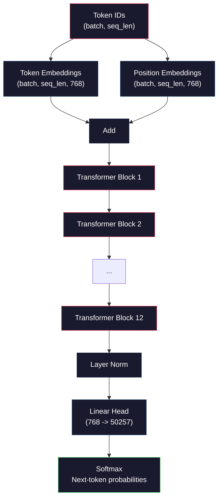
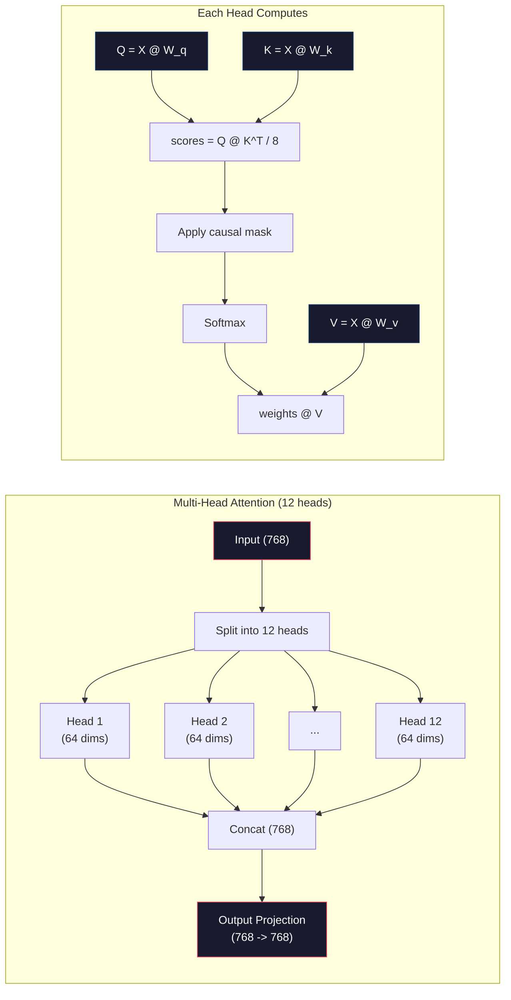
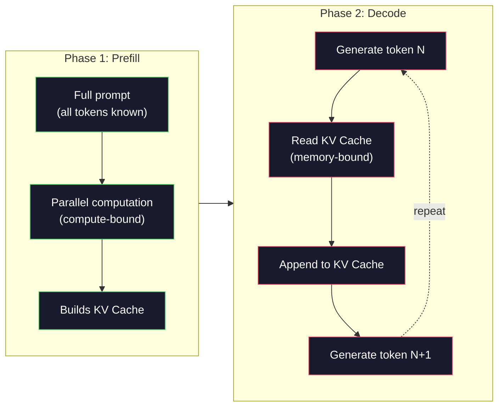

# Pra-Training Mini GPT (Parameter 124M)

> GPT-2 Kecil memiliki 124 juta parameter. Itu berarti 12 layer Transformer, 12 attention head, dan embedding 768 dimension. kamu dapat melatihnya dari awal pada satu GPU dalam beberapa jam. Kebanyakan orang tidak pernah melakukan ini. Mereka menggunakan pos pemeriksaan terlatih. Namun jika kamu tidak melatihnya sendiri, kamu tidak benar-benar memahami apa yang terjadi di dalam model yang kamu gunakan untuk membuat produk.

**Type:** Build
**Language:** Python (dengan numpy)
**Prerequisites:** Fase 10, Lesson 01-03 (Tokenizer, Membangun Tokenizer, Pipeline Data)
**Waktu:** ~120 menit

## Tujuan Pembelajaran

- Menerapkan arsitektur GPT-2 lengkap (124 juta parameter) dari awal: embedding token, embedding posisi, blok Transformer, dan kepala model bahasa
- Melatih model GPT pada korpus teks menggunakan prediksi token berikutnya dengan kehilangan entropi silang
- Menerapkan pembuatan teks autoregresif dengan pengambilan sample suhu dan pemfilteran top-k/top-p
- Pantau kurva loss training dan validasi bahwa model mempelajari pola bahasa yang koheren

## Masalah

kamu tahu apa itu Transformer. kamu telah membaca diagramnya. kamu dapat melafalkan "attention adalah semua yang kamu butuhkan" dan menggambar kotak berlabel "Attention Multi-Kepala" di papan tulis.

Semua itu tidak berarti kamu memahami apa yang terjadi saat model menghasilkan teks.

Ada 124.438.272 parameter di GPT-2 Kecil (dengan pengikatan weight). Masing-masing ditetapkan dengan menjalankan loop training: penerusan maju, loss komputasi, penerusan mundur, pembaruan weight. Dua belas blok Transformer. Dua belas attention head per blok. Ruang embedding 768 dimension. Kosakata 50.257 token. Setiap kali model menghasilkan token, seluruh 124 juta parameter berpartisipasi dalam rantai perkalian matrix tunggal yang mengambil urutan ID token dan menghasilkan distribusi probabilitas pada token berikutnya.

Jika kamu belum pernah membuatnya sendiri, kamu sedang mengerjakan kotak hitam. kamu dapat menggunakan API. kamu dapat menyempurnakannya. Namun saat terjadi kesalahan -- saat model berhalusinasi, saat model berulang, saat model menolak mengikuti instruksi -- kamu tidak memiliki model mental untuk *mengapa*.

Lesson ini membuat GPT-2 Small dari awal. Tidak di PyTorch. Secara numpy. Setiap perkalian matrix terlihat. Setiap gradient dihitung oleh code kamu. kamu akan melihat dengan tepat bagaimana 124 juta angka berkonspirasi untuk memprediksi kata berikutnya.

## Konsep

### Arsitektur GPT

GPT adalah model bahasa autoregresif. "Autoregresif" berarti menghasilkan satu token pada satu waktu, masing-masing dikondisikan pada semua token sebelumnya. Arsitekturnya adalah tumpukan blok dekoder Transformer.

Berikut adalah grafik komputasi lengkap dari ID token hingga probabilitas token berikutnya:

1. ID Token masuk. Bentuk: (batch_size, seq_len).
2. Pencarian embedding token. Setiap ID dipetakan ke vector 768 dimension. Bentuk: (batch_size, seq_len, 768).
3. Pencarian embedding posisi. Setiap posisi (0, 1, 2, ...) dipetakan ke vector 768 dimension. Bentuk yang sama.
4. Tambahkan embedding token + embedding posisi.
5. Lewati 12 blok trafo.
6. Normalisasi layer akhir.
7. Proyeksi linier terhadap ukuran kosakata. Bentuk: (batch_size, seq_len, vocab_size).
8. Softmax untuk mendapatkan probabilitas.

Itulah keseluruhan modelnya. Tidak ada konvolusi. Tidak ada pengulangan. Hanya embedding, attention, jaringan feedforward, dan norm layer yang ditumpuk 12 kali.



### Blok TransformatorMasing-masing dari 12 blok mengikuti pola yang sama. Arsitektur pra-norm (GPT-2 menggunakan pra-norm, bukan pasca-norm seperti trafo asli):

1. Norm Layer
2. Attention Diri Multi-Kepala
3. Koneksi sisa (tambahkan input kembali)
4. LapisanNorm
5. Jaringan Umpan-Maju (MLP)
6. Koneksi sisa (tambahkan input kembali)

Sambungan sisa sangat penting. Tanpanya, gradient akan hilang saat mencapai blok 1 selama backpropagation. Dengan mereka, gradient dapat mengalir langsung dari loss ke layer mana pun melalui jalur "lewati". Inilah sebabnya mengapa kamu dapat menumpuk 12, 32, atau bahkan 96 blok (GPT-4 dikabarkan menggunakan 120).

### Attention: Mekanisme Inti

Attention diri memungkinkan setiap token melihat setiap token sebelumnya dan memutuskan seberapa banyak yang harus diperhatikan pada masing-masing token. Ini perhitungannya.

Untuk setiap posisi token, hitung tiga vector dari input:
- **Pertanyaan (Q)**: "Apa yang saya cari?"
- **Kunci (K)**: "Apa isi saya?"
- **Nilai (V)**: "Informasi apa yang saya bawa?"

```
Q = input @ W_q    (768 -> 768)
K = input @ W_k    (768 -> 768)
V = input @ W_v    (768 -> 768)

attention_scores = Q @ K^T / sqrt(d_k)
attention_scores = mask(attention_scores)   # causal mask: -inf for future positions
attention_weights = softmax(attention_scores)
output = attention_weights @ V
```

Masker sebab akibat inilah yang membuat GPT bersifat autoregresif. Posisi 5 dapat menempati posisi 0-5 tetapi tidak dapat menempati posisi 6, 7, 8, dan seterusnya. Hal ini mencegah model "mencurangi" dengan melihat token masa depan selama training.

**Attention multi-kepala** membagi ruang 768 dimension menjadi 12 kepala dengan masing-masing 64 dimension. Setiap kepala mempelajari pola attention yang berbeda. Satu kepala mungkin melacak hubungan sintaksis (kesepakatan subjek-kata kerja). Yang lain mungkin melacak kesamaan semantik (sinonim). Yang lain mungkin melacak kedekatan posisi (kata-kata terdekat). Output dari ke-12 kepala digabungkan dan diproyeksikan kembali ke 768 dimension.



Pembagian dengan sqrt(d_k) -- sqrt(64) = 8 -- bersifat penskalaan. Tanpanya, perkalian titik menjadi besar untuk vector berdimensi tinggi, mendorong softmax ke wilayah yang gradiennya hampir nol. Ini adalah salah satu wawasan penting dalam makalah asli “Yang kamu Butuhkan Attention”.

### KV Cache: Mengapa Inference Cepat

Selama training, kamu memproses seluruh rangkaian sekaligus. Selama inference, kamu menghasilkan satu token dalam satu waktu. Tanpa optimization, menghasilkan token N memerlukan penghitungan ulang attention untuk semua N-1 token sebelumnya. Yaitu O(N^2) per token yang dihasilkan, atau total O(N^3) untuk rangkaian dengan panjang N.

KV Cache memecahkan masalah ini. Setelah menghitung K dan V untuk setiap token, simpanlah. Saat membuat token N+1, kamu hanya perlu menghitung Q untuk token baru dan mencari K dan V yang di-cache dari semua token sebelumnya. Hal ini mengurangi biaya per token dari O(N) menjadi O(1) untuk komputasi K dan V. Perhitungan skor attention masih O(N) karena kamu memperhatikan semua posisi sebelumnya, namun kamu menghindari perkalian matrix yang berlebihan pada input.

Untuk GPT-2 dengan 12 layer dan 12 kepala, cache KV menyimpan 2 (K + V) x 12 layer x 12 kepala x 64 dim = 18.432 nilai per token. Untuk urutan token 1024, yaitu sekitar 75MB di FP32. Untuk Llama 3 405B dengan 128 layer, cache KV untuk satu urutan dapat melebihi 10 GB. Inilah sebabnya mengapa inference konteks panjang terikat pada memori.

### Prefill vs Decode: Dua Fase Inference

Saat kamu mengirimkan prompt ke LLM, inference terjadi dalam dua fase berbeda.

**Isi awal** memproses seluruh permintaan kamu secara paralel. Semua token diketahui, sehingga model dapat menghitung attention untuk semua posisi secara bersamaan. Fase ini terikat pada komputasi -- GPU melakukan perkalian matrix pada throughput penuh. Untuk permintaan 1000 token pada A100, pengisian awal memerlukan waktu sekitar 20-50 md.**Decode** menghasilkan token satu per satu. Setiap token baru bergantung pada semua token sebelumnya. Fase ini terikat pada memori -- hambatannya adalah membaca weight model dan cache KV dari memori GPU, bukan matematika matrix itu sendiri. Inti komputasi GPU sebagian besar diam menunggu pembacaan memori. Untuk GPT-2, setiap langkah dekode memerlukan waktu yang hampir sama, berapa pun jumlah FLOP yang dibutuhkan matmul, karena bandwidth memori adalah batasannya.

Perbedaan ini penting untuk sistem produksi. Skala throughput pengisian awal dengan komputasi GPU (lebih banyak FLOPS = pengisian awal lebih cepat). Dekode skala throughput dengan bandwidth memori (memori lebih cepat = dekode lebih cepat). Itulah sebabnya NVIDIA H100 berfokus pada peningkatan bandwidth memori dibandingkan A100 -- secara langsung mempercepat pembuatan token.



### Lingkaran Training

Melatih LLM adalah prediksi token berikutnya. Diberikan token [0, 1, 2, ..., N-1], prediksi token [1, 2, 3, ..., N]. Loss function adalah entropi silang antara distribusi probabilitas prediksi model dan token aktual berikutnya.

Satu langkah training:

1. **Forward pass**: Jalankan batch melalui 12 blok. Dapatkan logit (skor pra-softmax) untuk setiap posisi.
2. **Hitung loss**: Entropi silang antara logit dan token target (input bergeser satu posisi).
3. **Backward pass**: Hitung gradient untuk semua parameter 124M menggunakan backpropagation.
4. **Langkah optimizer**: Perbarui weight. GPT-2 menggunakan Adam dengan pemanasan learning rate dan peluruhan kosinus.

Learning rate schedule lebih penting dari yang kamu harapkan. GPT-2 memanas dari 0 hingga learning rate puncak selama 2.000 langkah pertama, lalu meluruh mengikuti kurva kosinus. Memulai dengan learning rate yang tinggi menyebabkan model menyimpang. Mempertahankan tingkat tinggi yang konstan menyebabkan osilasi dalam training selanjutnya. Pola pemanasan-lalu-peluruhan digunakan oleh setiap LLM besar.

### GPT-2 Kecil: Angka

| Komponen | Bentuk | Parameter |
|-----------|-------|------------|
| Embedding token | (50257, 768) | 38.597.376 |
| Embedding posisi | (1024, 768) | 786.432 |
| Attention per blok (W_q, W_k, W_v, W_out) | 4x (768, 768) | 2.359.296 |
| FFN per blok (atas + bawah) | (768, 3072) + (3072, 768) | 4.718.592 |
| LayerNorms per blok (2x) | 2x768x2 | 3.072 |
| Norm Layer Akhir | 768x2 | 1.536 |
| **Total per blok** | | **7.080.960** |
| **Total (12 blok)** | | **85.054.464 + 39.383.808 = 124.438.272** |

Proyeksi output (logits head) berbagi weight dengan matrix embedding token. Hal ini disebut pengikatan weight -- tindakan ini mengurangi jumlah parameter sebesar 38 juta dan meningkatkan performa karena memaksa model menggunakan ruang representasi yang sama untuk input dan output.

## Build

### Langkah 1: Embed Layer

Embedding token memetakan masing-masing dari 50.257 kemungkinan token ke vector 768 dimension. Embedding posisi menambahkan informasi tentang lokasi setiap token dalam urutan. Keduanya dijumlahkan.

```python
import numpy as np

class Embedding:
    def __init__(self, vocab_size, embed_dim, max_seq_len):
        self.token_embed = np.random.randn(vocab_size, embed_dim) * 0.02
        self.pos_embed = np.random.randn(max_seq_len, embed_dim) * 0.02

    def forward(self, token_ids):
        seq_len = token_ids.shape[-1]
        tok_emb = self.token_embed[token_ids]
        pos_emb = self.pos_embed[:seq_len]
        return tok_emb + pos_emb
```

Deviasi standar 0,02 untuk inisialisasi berasal dari kertas GPT-2. Terlalu besar dan umpan awal ke depan menghasilkan nilai ekstrem yang mengganggu kestabilan latihan. Terlalu kecil dan output awal hampir sama untuk semua input, sehingga sinyal gradient awal tidak berguna.

### Langkah 2: Attention Diri dengan Topeng Kausal

Attention satu kepala terlebih dahulu. Masker kausal menetapkan posisi masa depan ke tak terhingga negatif sebelum softmax, memastikan setiap posisi hanya dapat menangani dirinya sendiri dan posisi sebelumnya.

```python
def attention(Q, K, V, mask=None):
    d_k = Q.shape[-1]
    scores = Q @ K.transpose(0, -1, -2 if Q.ndim == 4 else 1) / np.sqrt(d_k)
    if mask is not None:
        scores = scores + mask
    weights = np.exp(scores - scores.max(axis=-1, keepdims=True))
    weights = weights / weights.sum(axis=-1, keepdims=True)
    return weights @ V
```Implementasi softmax mengurangi maksimum sebelum melakukan eksponensial. Tanpa ini, exp(large_number) meluap hingga tak terbatas. Ini adalah trik stabilitas numerik yang tidak mengubah output karena softmax(x - c) = softmax(x) untuk konstanta c apa pun.

### Langkah 3: Attention Multi-Kepala

Bagi input 768 dimension menjadi 12 kepala yang masing-masing terdiri dari 64 dimension. Setiap kepala menghitung attention secara independen. Gabungkan hasilnya dan proyeksikan kembali ke 768 dimension.

```python
class MultiHeadAttention:
    def __init__(self, embed_dim, num_heads):
        self.num_heads = num_heads
        self.head_dim = embed_dim // num_heads
        self.W_q = np.random.randn(embed_dim, embed_dim) * 0.02
        self.W_k = np.random.randn(embed_dim, embed_dim) * 0.02
        self.W_v = np.random.randn(embed_dim, embed_dim) * 0.02
        self.W_out = np.random.randn(embed_dim, embed_dim) * 0.02

    def forward(self, x, mask=None):
        batch, seq_len, d = x.shape
        Q = (x @ self.W_q).reshape(batch, seq_len, self.num_heads, self.head_dim).transpose(0, 2, 1, 3)
        K = (x @ self.W_k).reshape(batch, seq_len, self.num_heads, self.head_dim).transpose(0, 2, 1, 3)
        V = (x @ self.W_v).reshape(batch, seq_len, self.num_heads, self.head_dim).transpose(0, 2, 1, 3)

        scores = Q @ K.transpose(0, 1, 3, 2) / np.sqrt(self.head_dim)
        if mask is not None:
            scores = scores + mask
        weights = np.exp(scores - scores.max(axis=-1, keepdims=True))
        weights = weights / weights.sum(axis=-1, keepdims=True)
        attn_out = weights @ V

        attn_out = attn_out.transpose(0, 2, 1, 3).reshape(batch, seq_len, d)
        return attn_out @ self.W_out
```

Tarian reshape-transpose-reshape adalah bagian yang paling membingungkan dari attention multi-kepala. Inilah yang terjadi: tensor (batch, seq_len, 768) menjadi (batch, seq_len, 12, 64), lalu (batch, 12, seq_len, 64). Sekarang masing-masing dari 12 kepala memiliki matriksnya sendiri (seq_len, 64) untuk diperhatikan. Setelah diperhatikan, kita membalik prosesnya: (batch, 12, seq_len, 64) menjadi (batch, seq_len, 12, 64) menjadi (batch, seq_len, 768).

### Langkah 4: Blok Transformer

Satu blok trafo lengkap: LayerNorm, attention multi-head dengan sisa, LayerNorm, umpan maju dengan sisa.

```python
class LayerNorm:
    def __init__(self, dim, eps=1e-5):
        self.gamma = np.ones(dim)
        self.beta = np.zeros(dim)
        self.eps = eps

    def forward(self, x):
        mean = x.mean(axis=-1, keepdims=True)
        var = x.var(axis=-1, keepdims=True)
        return self.gamma * (x - mean) / np.sqrt(var + self.eps) + self.beta


class FeedForward:
    def __init__(self, embed_dim, ff_dim):
        self.W1 = np.random.randn(embed_dim, ff_dim) * 0.02
        self.b1 = np.zeros(ff_dim)
        self.W2 = np.random.randn(ff_dim, embed_dim) * 0.02
        self.b2 = np.zeros(embed_dim)

    def forward(self, x):
        h = x @ self.W1 + self.b1
        h = np.maximum(0, h)  # GELU approximation: ReLU for simplicity
        return h @ self.W2 + self.b2


class TransformerBlock:
    def __init__(self, embed_dim, num_heads, ff_dim):
        self.ln1 = LayerNorm(embed_dim)
        self.attn = MultiHeadAttention(embed_dim, num_heads)
        self.ln2 = LayerNorm(embed_dim)
        self.ffn = FeedForward(embed_dim, ff_dim)

    def forward(self, x, mask=None):
        x = x + self.attn.forward(self.ln1.forward(x), mask)
        x = x + self.ffn.forward(self.ln2.forward(x))
        return x
```

Jaringan umpan maju memperluas input 768 dimension menjadi 3.072 dimension (4x), menerapkan nonlinier, lalu memproyeksikan kembali ke 768. Pola ekspansi-kontraksi ini memberi model representasi internal yang "lebih luas" untuk digunakan di setiap posisi. GPT-2 menggunakan activation GELU, namun kami menggunakan ReLU di sini untuk kesederhanaan -- perbedaannya kecil untuk memahami arsitekturnya.

### Langkah 5: Model GPT Lengkap

Tumpuk 12 blok trafo. Tambahkan layer embedding di depan dan proyeksi output di belakang.

```python
class MiniGPT:
    def __init__(self, vocab_size=50257, embed_dim=768, num_heads=12,
                 num_layers=12, max_seq_len=1024, ff_dim=3072):
        self.embedding = Embedding(vocab_size, embed_dim, max_seq_len)
        self.blocks = [
            TransformerBlock(embed_dim, num_heads, ff_dim)
            for _ in range(num_layers)
        ]
        self.ln_f = LayerNorm(embed_dim)
        self.vocab_size = vocab_size
        self.embed_dim = embed_dim

    def forward(self, token_ids):
        seq_len = token_ids.shape[-1]
        mask = np.triu(np.full((seq_len, seq_len), -1e9), k=1)

        x = self.embedding.forward(token_ids)
        for block in self.blocks:
            x = block.forward(x, mask)
        x = self.ln_f.forward(x)

        logits = x @ self.embedding.token_embed.T
        return logits

    def count_parameters(self):
        total = 0
        total += self.embedding.token_embed.size
        total += self.embedding.pos_embed.size
        for block in self.blocks:
            total += block.attn.W_q.size + block.attn.W_k.size
            total += block.attn.W_v.size + block.attn.W_out.size
            total += block.ffn.W1.size + block.ffn.b1.size
            total += block.ffn.W2.size + block.ffn.b2.size
            total += block.ln1.gamma.size + block.ln1.beta.size
            total += block.ln2.gamma.size + block.ln2.beta.size
        total += self.ln_f.gamma.size + self.ln_f.beta.size
        return total
```

Perhatikan ikatan bobotnya: `logits = x @ self.embedding.token_embed.T`. Proyeksi output menggunakan kembali matrix embedding token (ditransposisikan). Ini bukan sekadar trik menghemat parameter. Artinya model menggunakan ruang vector yang sama untuk memahami token (embedding) dan memprediksinya (output).

### Langkah 6: Lingkaran Latihan

Untuk training nyata yang dijalankan pada parameter 124 juta, kamu memerlukan GPU dan PyTorch. Loop training ini mendemonstrasikan mekanisme pada model kecil yang berjalan dalam numpy murni. Kami menggunakan model mungil (4 lapis, 4 kepala, 128 dim) agar mudah diatur.

```python
def cross_entropy_loss(logits, targets):
    batch, seq_len, vocab_size = logits.shape
    logits_flat = logits.reshape(-1, vocab_size)
    targets_flat = targets.reshape(-1)

    max_logits = logits_flat.max(axis=-1, keepdims=True)
    log_softmax = logits_flat - max_logits - np.log(
        np.exp(logits_flat - max_logits).sum(axis=-1, keepdims=True)
    )

    loss = -log_softmax[np.arange(len(targets_flat)), targets_flat].mean()
    return loss


def train_mini_gpt(text, vocab_size=256, embed_dim=128, num_heads=4,
                   num_layers=4, seq_len=64, num_steps=200, lr=3e-4):
    tokens = np.array(list(text.encode("utf-8")[:2048]))
    model = MiniGPT(
        vocab_size=vocab_size, embed_dim=embed_dim, num_heads=num_heads,
        num_layers=num_layers, max_seq_len=seq_len, ff_dim=embed_dim * 4
    )

    print(f"Model parameters: {model.count_parameters():,}")
    print(f"Training tokens: {len(tokens):,}")
    print(f"Config: {num_layers} layers, {num_heads} heads, {embed_dim} dims")
    print()

    for step in range(num_steps):
        start_idx = np.random.randint(0, max(1, len(tokens) - seq_len - 1))
        batch_tokens = tokens[start_idx:start_idx + seq_len + 1]

        input_ids = batch_tokens[:-1].reshape(1, -1)
        target_ids = batch_tokens[1:].reshape(1, -1)

        logits = model.forward(input_ids)
        loss = cross_entropy_loss(logits, target_ids)

        if step % 20 == 0:
            print(f"Step {step:4d} | Loss: {loss:.4f}")

    return model
```

Loss dimulai di dekat ln(vocab_size) -- untuk kosakata tingkat byte 256 token, yaitu ln(256) = 5,55. Model acak memberikan probabilitas yang sama untuk setiap token. Seiring berjalannya training, loss menurun karena model belajar memprediksi pola umum: "th" setelah "t", spasi setelah titik, dan seterusnya.

Dalam produksi, kamu akan menggunakan optimizer Adam dengan akumulasi gradient, pemanasan learning rate, dan pemotongan gradient. Perulangan forward-pass-loss-backward-update identik. Optimizer-nya lebih canggih.

### Langkah 7: Pembuatan Teks

Pembuatan menggunakan model terlatih untuk memprediksi satu token dalam satu waktu. Setiap prediksi diambil sampelnya dari distribusi output (atau diambil dengan rakus sebagai argmax).

```python
def generate(model, prompt_tokens, max_new_tokens=100, temperature=0.8):
    tokens = list(prompt_tokens)
    seq_len = model.embedding.pos_embed.shape[0]

    for _ in range(max_new_tokens):
        context = np.array(tokens[-seq_len:]).reshape(1, -1)
        logits = model.forward(context)
        next_logits = logits[0, -1, :]

        next_logits = next_logits / temperature
        probs = np.exp(next_logits - next_logits.max())
        probs = probs / probs.sum()

        next_token = np.random.choice(len(probs), p=probs)
        tokens.append(next_token)

    return tokens
```

Suhu mengontrol keacakan. Suhu 1.0 menggunakan distribusi mentah. Suhu 0,5 mempertajamnya (lebih deterministik -- model lebih sering memilih pilihan utamanya). Suhu 1,5 meratakannya (lebih acak -- token dengan probabilitas rendah mendapat peluang lebih besar). Suhu 0,0 adalah decoding serakah (selalu pilih token dengan probabilitas tertinggi).

Jendela `tokens[-seq_len:]` diperlukan karena model memiliki panjang konteks maksimum (1024 untuk GPT-2). Setelah kamu melampauinya, kamu harus membuang token terlama. Ini adalah "jendela konteks" yang dibicarakan semua orang.

## Pakai### Training Penuh dan Demo Generasi

```python
corpus = """The transformer architecture has revolutionized natural language processing.
Attention mechanisms allow the model to focus on relevant parts of the input.
Self-attention computes relationships between all pairs of positions in a sequence.
Multi-head attention splits the representation into multiple subspaces.
Each attention head can learn different types of relationships.
The feedforward network provides nonlinear transformations at each position.
Residual connections enable gradient flow through deep networks.
Layer normalization stabilizes training by normalizing activations.
Position embeddings give the model information about token ordering.
The causal mask ensures autoregressive generation during training.
Pre-training on large text corpora teaches the model general language understanding.
Fine-tuning adapts the pre-trained model to specific downstream tasks."""

model = train_mini_gpt(corpus, num_steps=200)

prompt = list("The transformer".encode("utf-8"))
output_tokens = generate(model, prompt, max_new_tokens=100, temperature=0.8)
generated_text = bytes(output_tokens).decode("utf-8", errors="replace")
print(f"\nGenerated: {generated_text}")
```

Pada korpus kecil dengan model kecil, teks yang dihasilkan akan menjadi semi-koheren. Ia akan mempelajari beberapa pola tingkat byte dari teks training tetapi tidak dapat menggeneralisasi seperti yang dilakukan GPT-2 dengan training data sebesar 40 GB dan arsitektur parameter 124M penuh. Intinya bukanlah kualitas output. Intinya adalah kamu dapat melacak setiap langkah: embed pencarian, komputasi attention, transformasi feedforward, proyeksi logit, softmax, dan pengambilan sample. Setiap operasi terlihat.

## Kirim

Lesson ini menghasilkan `outputs/prompt-gpt-architecture-analyzer.md` -- prompt yang menganalisis pilihan arsitektur dalam model bergaya GPT apa pun. Berikan kartu model atau laporan teknis dan uraikan alokasi parameter, desain attention, dan keputusan penskalaan.

## Latihan

1. Ubah model untuk menggunakan 24 layer dan 16 kepala, bukan 12/12. Hitung parameternya. Bagaimana cara menggandakan kedalaman dibandingkan dengan menggandakan lebar (dimension embedding)?

2. Menerapkan fungsi activation GELU (GELU(x) = x * 0.5 * (1 + erf(x / sqrt(2)))) dan mengganti ReLU di jaringan feedforward. Jalankan training selama 500 langkah dengan setiap activation dan bandingkan loss terakhir.

3. Tambahkan cache KV ke fungsi pembangkitan. Simpan tensor K dan V untuk setiap layer setelah forward pass pertama, dan gunakan kembali untuk token berikutnya. Ukur kecepatannya: hasilkan 200 token dengan dan tanpa cache dan bandingkan waktu jam dinding.

4. Terapkan pengambilan sample top-k (hanya pertimbangkan k token dengan probabilitas tertinggi) dan pengambilan sample top-p (pengambilan sample inti: pertimbangkan kumpulan token terkecil yang probabilitas kumulatifnya melebihi p). Bandingkan kualitas output pada suhu 0,8 dengan top-k=50 vs top-p=0,95.

5. Membangun plotter kurva loss training. Latih model untuk 1000 langkah dan plot loss vs langkah. Identifikasi tiga fase: penurunan awal yang cepat (mempelajari byte umum), fase tengah yang lebih lambat (mempelajari pola byte), dan dataran tinggi (overfitting pada korpus kecil). Bentuk kurva ini sama baik kamu melatih model 128-dim atau GPT-4.

## Istilah Kunci| Istilah | Apa kata orang | Apa sebenarnya arti |
|------|----------------|----------------------|
| Autoregresif | "Ini menghasilkan satu kata pada satu waktu" | Setiap token output dikondisikan pada semua token sebelumnya -- model memprediksi P(token_n \| token_0, ..., token_{n-1}) |
| Topeng kausal | "Ia tidak bisa melihat masa depan" | Matrix segitiga atas dengan nilai -infinity yang mencegah attention pada posisi masa depan selama training |
| Attention multi-kepala | "Pola attention ganda" | Memisahkan Q, K, V menjadi kepala paralel (misalnya, 12 kepala dengan masing-masing 64 dim untuk GPT-2) sehingga setiap kepala dapat mempelajari jenis hubungan yang berbeda |
| Tembolok KV | "Caching untuk kecepatan" | Menyimpan tensor Kunci dan Nilai yang dihitung dari token sebelumnya untuk menghindari komputasi berlebihan selama pembuatan autoregresif |
| Isi awal | "Memproses prompt" | Fase inference pertama di mana semua token cepat diproses secara paralel -- terikat komputasi pada GPU FLOPS |
| Dekode | "Menghasilkan token" | Fase inference kedua di mana token dihasilkan satu per satu -- terikat memori pada bandwidth GPU |
| Pengikatan weight | "Berbagi embeddings" | Menggunakan matrix yang sama untuk embedding token input dan kepala proyeksi output -- menghemat 38 juta parameter di GPT-2 |
| Koneksi sisa | "Lewati koneksi" | Menambahkan input langsung ke output sublayer (x + sublayer(x)) -- mengaktifkan aliran gradient di jaringan dalam |
| Normalisasi layer | "Menormalkan activation" | Normalisasi seluruh dimension feature menjadi rata-rata 0 dan varians 1, dengan parameter skala dan bias yang dapat dipelajari |
| Loss lintas entropi | "Betapa salahnya prediksi" | -log (probabilitas ditetapkan ke token berikutnya yang benar), dirata-ratakan untuk semua posisi -- tujuan training LLM standar |

## Bacaan Lanjutan

- [Radford dkk., 2019 -- "Model Bahasa adalah Pembelajar Multitask Tanpa Pengawasan" (GPT-2)](https://cdn.openai.com/better-bahasa-models/bahasa_models_are_unsupervised_multitask_learners.pdf) -- makalah GPT-2 yang memperkenalkan kelompok parameter 124M hingga 1,5B
- [Vaswani dkk., 2017 -- "Hanya Attention yang kamu Butuhkan"](https://arxiv.org/abs/1706.03762) -- kertas trafo asli dengan attention produk titik berskala dan attention multi-kepala
- [Laporan Teknis Llama 3](https://arxiv.org/abs/2407.21783) -- cara Meta menskalakan arsitektur GPT ke parameter 405B dengan GPU 16K
- [Pope et al., 2022 -- "Inference Transformer Penskalaan yang Efisien"](https://arxiv.org/abs/2211.05102) -- makalah yang memformalkan pra-pengisian vs dekode dan analisis cache KV
