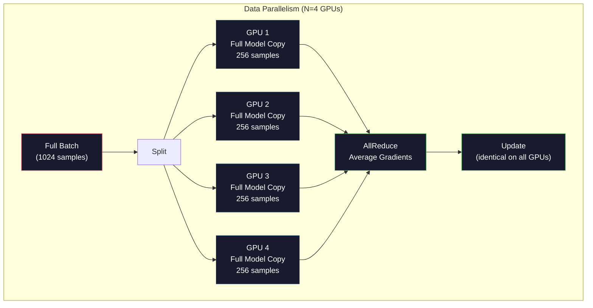
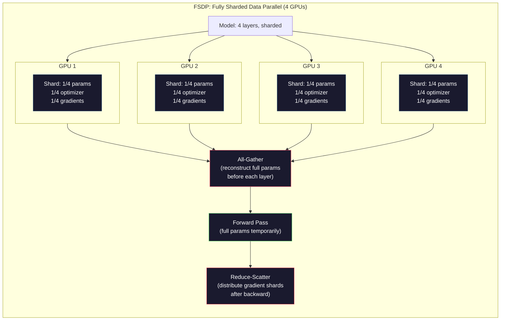
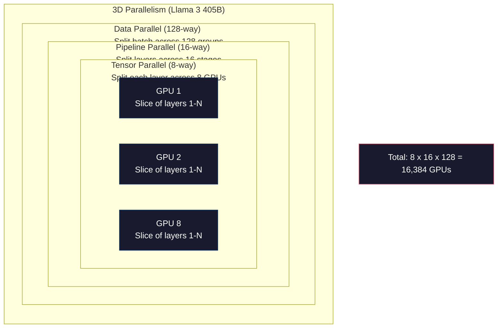

# Penskalaan: Training Terdistribusi, FSDP, DeepSpeed

> Model 124M kamu dilatih pada satu GPU. Sekarang coba 7 miliar parameter. Modelnya tidak muat di memori. Datanya membutuhkan waktu berminggu-minggu di satu mesin. Training terdistribusi bukanlah suatu pilihan dalam skala besar. Itu satu-satunya jalan ke depan.

**Type:** Build
**Language:** Python
**Prerequisites:** Fase 10, Lesson 04 (Pra-Training Mini GPT)
**Waktu:** ~120 menit

## Tujuan Pembelajaran

- Jelaskan tiga jenis paralelisme (data, tensor, pipeline) dan kapan masing-masing diperlukan berdasarkan model dan ukuran cluster
- Menerapkan training paralel data menggunakan PyTorch DDP dengan sinkronisasi gradient di beberapa GPU
- Hitung anggaran memori untuk ukuran model tertentu (weight + status optimizer + gradient + activation) untuk menentukan perangkat keras minimum
- Konfigurasikan tahapan FSDP atau DeepSpeed ZeRO ke status model shard di seluruh GPU dan sesuaikan model yang melebihi memori GPU tunggal

## Masalah

Model parameter 7B di FP16 membutuhkan 14GB hanya untuk bobotnya. Optimizer Adam menyimpan dua salinan tambahan dari setiap parameter (perkiraan momen pertama dan kedua). Itu 28GB lagi. Gradient selama backpropagation menambah 14 GB lebih banyak. kamu berada di 56GB sebelum satu activation disimpan.

NVIDIA A100 memiliki memori 80GB.

56GB dari 80GB yang dikonsumsi. Ini menyisakan 24 GB untuk activation -- nilai antara yang dihitung selama forward pass yang harus tetap aktif untuk backpropagation. Untuk urutan token 2048 dengan model dimension 4096, activation satu layer menggunakan sekitar 64MB. Dengan 32 layer, kamu memerlukan 2 GB per sample. Ukuran batch 8 memerlukan 16 GB. kamu memiliki 24GB. Ukuran batch 12 meledak.

Sekarang coba parameter 70B. Bobotnya sendiri: 140GB di FP16. Tidak muat pada satu GPU. kamu memerlukan setidaknya 2 A100 (2 x 80GB = 160GB) hanya untuk menahan weight. Tambahkan status optimizer dan gradient dan kamu memerlukan lebih banyak lagi: minimum 3+ GPU, dan secara realistis 8-16 tergantung pada strategi sharding.

Llama 3 405B dilatih pada 16.384 GPU NVIDIA H100. Training yang dijalankan diperkirakan menghabiskan biaya komputasi sebesar $100 juta. DeepSeek V3 melatih model serupa dengan biaya sekitar $5,6 juta dengan menjadi pintar dalam hal arsitektur (Campuran Pakar berarti hanya sebagian kecil parameter yang diaktifkan per token) dan efisiensi training.

Lesson ini mencakup empat strategi yang memungkinkan training skala besar: paralelisme data, paralelisme tensor, paralelisme pipeline, dan paralelisme data sharded penuh. kamu akan mensimulasikan masing-masing dengan Python murni untuk memahami mekanismenya sebelum menyentuh kerangka training terdistribusi.

## Konsep

### Mengapa Distribusi Diperlukan

Berikut adalah matematika memori untuk model nyata. Setiap angka dihitung, bukan diperkirakan.

| Model | Param | Weight (FP16) | Negara Bagian Adam | Gradient (FP16) | Total (tidak ada activation) |
|-------|--------|----------------|-------------|------------------|----------------------|
| GPT-2 Kecil | 124M | 248MB | 992MB | 248MB | 1,5 GB |
| Lama 3 8B | 8B | 16GB | 64GB | 16GB | 96GB |
| Lama 3 70B | 70B | 140 GB | 560GB | 140 GB | 840 GB |
| Lama 3 405B | 405B | 810 GB | 3.240 GB | 810GB | 4.860 GB |

Kolom "Adam States" adalah pembunuhnya. Adam menyimpan mean berjalan (m) dan varian berjalan (v) untuk setiap parameter, keduanya di FP32. Untuk model 70B, yaitu 70B x 4 byte x 2 = 560GB. Optimizer-nya sendiri membutuhkan tujuh A100.Satu H100 memiliki 80GB. Llama 3 405B memerlukan setidaknya 61 H100 untuk menampung weight, optimizer, dan gradient. Tambahkan activation dan jumlahnya akan bertambah. Meta menggunakan 16.384 GPU bukan karena mereka ingin -- karena terpaksa.

### Paralelisme Data

Strategi terdistribusi paling sederhana. Salin seluruh model ke N GPU. Bagi setiap kelompok training menjadi N bagian yang sama. Setiap GPU menjalankan penerusan maju dan mundur pada pecahan datanya. Setelah melakukan backward pass, rata-ratakan gradient di semua GPU. Setiap GPU memperbarui salinan bobotnya dengan gradient rata-rata yang sama, menjaga semua salinan tetap sinkron.

**Kelebihannya:** Penskalaan throughput linier. N GPU memproses data N kali lebih banyak per langkah. Komunikasi terbatas pada rata-rata gradient, yang tumpang tindih dengan komputasi.

**Yang buruk:** Setiap GPU menyimpan salinan lengkap model, status optimizer, dan gradient. Untuk model 70B, setiap GPU membutuhkan 840GB. Paralelisme data tidak mengurangi memori per GPU. Itu hanya mengurangi waktu training.

**Perhitungan:** Ukuran batch efektif = per_gpu_batch_size x N. Untuk N=64 GPU dengan batch per-GPU sebanyak 16, batch efektif adalah 1.024. Llama 3 menggunakan ukuran batch efektif 16 juta token per langkah.



### Paralelisme Tensor

Pisahkan layer individual di seluruh GPU. Perkalian matrix tunggal dibagi di antara GPU, masing-masing menghitung bagian hasilnya.

Pertimbangkan bentuk matrix weight (8192, 8192) di layer umpan maju. Dengan paralelisme tensor 4 arah, setiap GPU memiliki shard (8192, 2048). Setiap GPU mengalikan input dengan pecahannya, sehingga menghasilkan hasil parsial. Hasil parsial digabungkan (melalui all-reduce atau all-gather) untuk menghasilkan output penuh.

**Kelebihannya:** Mengurangi memori per GPU untuk weight model. Model 70B yang dibagi menjadi 8 GPU berarti setiap GPU memiliki weight senilai ~8,75B parameter.

**Keburukannya:** Membutuhkan komunikasi antar-GPU yang cepat di setiap layer. Pengurangan semua setelah setiap matmul menambah latensi. Ini bekerja dengan baik dengan NVLink (900 GB/dtk antar GPU pada node yang sama) tetapi buruk pada seluruh node yang terhubung oleh InfiniBand (400 Gb/dtk, sekitar 50 GB/dtk). Paralelisme tensor hampir selalu terbatas pada satu node (8 GPU).

**Penggunaan nyata:** Megatron-LM memelopori paralelisme tensor. Llama 3 405B menggunakan paralelisme tensor 8 arah dalam setiap node.

### Paralelisme Pipeline Pipa

Pisahkan model menjadi beberapa layer. GPU 1 menjalankan layer 1-8. GPU 2 menjalankan layer 9-16. GPU 3 menjalankan layer 17-24. GPU 4 menjalankan layer 25-32. Data mengalir melalui pipeline: GPU 1 menghitung lapisannya dan mengirimkan activation ke GPU 2, yang menghitung lapisannya dan mengirimkannya ke GPU 3, dan seterusnya.

**Kelebihannya:** Komunikasi minimal antar GPU -- hanya activation pada batas layer, yang kecil dibandingkan dengan gradient atau weight. Bekerja lintas node karena kebutuhan bandwidth rendah.

**Yang buruk:** Gelembung pipeline pipa. Saat GPU 4 menghitung penerusan pada mikro-batch 1, GPU 1, 2, dan 3 menganggur (mereka sudah meneruskan porsinya). Selama passing mundur, polanya terbalik. Dengan pipeline naif, pemanfaatan GPU hanya 1/N untuk N tahapan pipeline.

**GPipe dan PipeDream** memecahkan masalah gelembung dengan membagi batch menjadi batch mikro. GPU 1 dimulai pada micro-batch 2 segera setelah selesai meneruskan micro-batch 1. Hal ini tumpang tindih dengan komputasi di seluruh tahapan pipeline. Dengan M mikro-batch dan N tahapan, fraksi gelembung turun menjadi (N-1)/M. Gunakan M=16 mikro-batch dengan N=4 tahapan dan gelembungnya adalah 16/3 = 18,75% waktu idle.

### FSDP: Data Terpecah Sepenuhnya ParalelFSDP menggabungkan skalabilitas paralelisme data dengan efisiensi memori sharding. Daripada setiap GPU menyimpan salinan lengkap model, setiap GPU hanya menyimpan 1/N parameter, gradient, dan status optimizer.

Sebelum meneruskan layer ke depan, FSDP menjalankan **all-gather** untuk mengumpulkan parameter lengkap dari semua GPU ke dalam memori setiap GPU. Setelah forward pass, setiap GPU membuang parameter non-lokal. Selama proses mundur, all-gather dijalankan kembali untuk merekonstruksi parameter untuk komputasi gradient. Setelah proses backward pass, **reduce-scatter** mendistribusikan pecahan gradient sehingga setiap GPU hanya menyimpan 1/N gradient.

**Perhitungan untuk model 70B pada 8 GPU:**

| Komponen | Tanpa FSDP | Dengan FSDP |
|-----------|-------------|-----------|
| Weight (FP16) | 140 GB per GPU | 17,5 GB per GPU |
| Adam Serikat (FP32) | 560 GB per GPU | 70 GB per GPU |
| Gradient (FP16) | 140 GB per GPU | 17,5 GB per GPU |
| **Jumlah** | **840 GB per GPU** | **105 GB per GPU** |

Tanpa FSDP, kamu tidak dapat memuat model 70B pada satu GPU 80GB. Dengan FSDP pada 8 GPU, masing-masing GPU menggunakan 105GB -- tunggu, itu masih belum pas. kamu memerlukan setidaknya 16 GPU untuk mendapatkan di bawah 80 GB per GPU, atau kamu menggabungkan FSDP dengan pos pemeriksaan activation (menghitung ulang activation selama mundur alih-alih menyimpannya).

Biaya komunikasi lebih tinggi daripada paralelisme data vanilla karena pengumpulan semua sebelum setiap layer. Namun penghematan memori membuat training yang sebelumnya mustahil dapat dijalankan menjadi mungkin.



### Kecepatan Dalam ZeRO

ZeRO (Zero Redundancy Optimizer) DeepSpeed secara konseptual identik dengan FSDP tetapi dikembangkan secara independen oleh Microsoft. Ini mendefinisikan tiga phase, masing-masing sharding lebih agresif:

| Phase | Pecahan | Penghematan Memori | Komunikasi |
|-------|--------|---------------|---------------|
| ZeRO-1 | Hanya status optimizer | ~4x pengurangan | Sama seperti data paralel |
| ZeRO-2 | + Gradient | ~8x pengurangan | Sedikit lagi |
| ZeRO-3 | + Parameter | ~Pengurangan Nx (N GPU) | Semua berkumpul per layer |

ZeRO-3 setara dengan FSDP. Beda penamaannya, mekanismenya sama. PyTorch menambahkan FSDP sebagai implementasi asli setelah DeepSpeed ​​membuktikan konsepnya.

DeepSpeed ​​juga memperkenalkan ZeRO-Offload (status optimizer offload ke RAM CPU, yang lebih murah dan lebih besar) dan ZeRO-Infinity (offload ke SSD NVMe). Hal ini mempertukarkan kecepatan komputasi dengan kapasitas memori -- operasi yang diturunkan bebannya lebih lambat namun tetap mengosongkan memori GPU.

### Training Presisi Campuran

Training modern menggunakan beberapa format floating-point secara bersamaan:

- **Lulus maju**: FP16 atau BF16 (16-bit). Setengah memori FP32. Matmuls berjalan 2x lebih cepat pada inti tensor.
- **Weight utama**: FP32 (32-bit). Dipertahankan oleh optimizer untuk presisi numerik selama pembaruan weight.
- **Penskalaan loss**: Kalikan loss dengan konstanta besar sebelum meneruskan ke belakang untuk mencegah gradient FP16 turun ke nol. Bagilah dengan konstanta yang sama sebelum langkah optimizer.

BF16 (Brain Float 16) memiliki rentang eksponen yang sama dengan FP32 (8 bit eksponen) tetapi presisinya berkurang (7 bit mantissa vs 23 bit FP32). Jarang memerlukan penskalaan loss karena dapat mewakili rentang nilai yang sama. FP16 memiliki 5 bit eksponen dan 10 bit mantissa -- ini dapat mewakili nilai yang sangat halus tetapi meluap/mengalir pada besaran yang ekstrim.

TPU Google menggunakan BF16 secara asli. NVIDIA A100 dan H100 mendukung FP16 dan BF16. Industri ini sebagian besar telah beralih ke BF16 karena menghilangkan masalah penskalaan loss.

**Perbandingan memori untuk model 7B:**| Presisi | Weight | Optimizer | Gradient | Jumlah |
|-----------|---------|-----------|-----------|-------|
| FP32 dimana-mana | 28GB | 56 GB | 28GB | 112GB |
| Campuran (master BF16 + FP32) | 14 GB | 56 GB | 14 GB | 84GB |

Presisi campuran menghemat 28GB pada model ini. Status optimizer tetap berada di FP32 -- di sinilah sebagian besar memori digunakan.

### Megatron-LM dan Paralelisme 3D

Training skala besar yang nyata menggabungkan ketiga paralelisme:

- **Paralelisme data** di seluruh grup node (ukuran kumpulan skala)
- **Paralelisme tensor** dalam satu node (memisahkan layer menjadi 8 GPU)
- **Paralelisme pipeline** di seluruh node (membagi grup layer di seluruh mesin)

Llama 3 405B pada 16.384 H100:
- Paralelisme tensor 8 arah dalam setiap node (8 GPU per node)
- Paralelisme pipa 16 arah di seluruh node (16 phase pipa)
- Paralelisme data 128 arah di seluruh dimension yang tersisa (16.384/8/16 = 128)

Decomposition 3D ini (8 x 16 x 128 = 16.384) adalah cara kamu menskalakan hingga ribuan GPU. Setiap GPU melihat pecahan data yang berbeda (data paralel), menampung satu irisan dari setiap layer (tensor paralel), dan menghitung kumpulan layer yang berbeda (pipeline parallel).

DeepSeek V3 mengambil pendekatan yang berbeda. Arsitektur Mixture of Experts mereka hanya mengaktifkan 37 miliar dari 671 miliar parameter per token. Artinya setiap GPU hanya perlu menghitung (dan menyimpan activation) parameter aktif. Mereka berlatih dengan 2.048 GPU H800 -- kurang dari 1/8 jumlah GPU Meta -- seharga $5,6 juta vs perkiraan Meta sebesar $100 juta.



## Build

### Langkah 1: Simulasikan Paralelisme Data

Pisahkan batch di seluruh GPU yang disimulasikan. Setiap GPU menghitung penerusan ke depan pada pecahannya. Rata-ratakan "gradient" (kami mensimulasikannya sebagai nilai loss).

```python
import numpy as np

def simulate_data_parallelism(data, num_gpus, model_fn):
    batch_size = len(data)
    shard_size = batch_size // num_gpus
    remainder = batch_size % num_gpus

    gpu_losses = []
    gpu_gradients = []

    offset = 0
    for gpu_id in range(num_gpus):
        extra = 1 if gpu_id < remainder else 0
        shard = data[offset:offset + shard_size + extra]
        offset += shard_size + extra

        loss, grad = model_fn(shard)
        gpu_losses.append(loss)
        gpu_gradients.append(grad)

    avg_loss = np.mean(gpu_losses)
    avg_gradient = np.mean(gpu_gradients, axis=0)

    return avg_loss, avg_gradient
```

Operasi pengurangan semua (rata-rata gradient) adalah satu-satunya komunikasi dalam paralelisme data. Dalam praktiknya, ini menggunakan pustaka NCCL pada GPU NVIDIA, yang mengimplementasikan ring all-reduce: setiap GPU mengirimkan 1/N gradiennya ke tetangganya, menerima 1/N dari tetangga lainnya, dan setelah langkah N-1, setiap GPU memiliki rata-rata lengkap. Total volume komunikasi: 2 x ukuran_gradien x (N-1)/N, mendekati 2x ukuran gradient untuk N besar.

### Langkah 2: Simulasikan Paralelisme Tensor

Pisahkan matrix weight di seluruh GPU. Setiap GPU menghitung perkalian matrix parsial. Gabungkan hasilnya.

```python
def simulate_tensor_parallelism(input_data, weight_matrix, num_gpus):
    d_in, d_out = weight_matrix.shape
    assert d_out % num_gpus == 0, f"d_out {d_out} not divisible by num_gpus {num_gpus}"
    shard_size = d_out // num_gpus

    partial_results = []
    for gpu_id in range(num_gpus):
        start = gpu_id * shard_size
        end = start + shard_size
        weight_shard = weight_matrix[:, start:end]

        partial = input_data @ weight_shard
        partial_results.append(partial)

    full_output = np.concatenate(partial_results, axis=-1)

    direct_output = input_data @ weight_matrix
    error = np.abs(full_output - direct_output).max()

    return full_output, error
```

Kesalahannya harus tepat nol (atau epsilon mesin). Paralelisme tensor tepat secara matematis -- menghasilkan hasil yang sama seperti menghitung matmul penuh pada satu GPU. Pembagiannya terjadi sepanjang dimension output, sehingga setiap GPU menghasilkan potongan kolom yang berbeda, dan penggabungan merekonstruksi hasil keseluruhan.

Untuk layer linier paralel kolom (memisahkan dimension output), kamu menggabungkan. Untuk baris-paralel (membagi dimension input), kamu menjumlahkannya. Pada Transformer FFN, linier pertama (memuai) menggunakan kolom-paralel dan linier kedua (kontrak) menggunakan baris-paralel. Hal ini untuk menghindari pengurangan semua di antara kedua layer.

### Langkah 3: Simulasikan Paralelisme Pipeline Pipa

Pisahkan layer model di seluruh GPU virtual. Tunjukkan masalah gelembung di mana tahapan awal tidak digunakan sementara tahapan selanjutnya dihitung.

```python
def simulate_pipeline_parallelism(num_layers, num_stages, num_microbatches):
    layers_per_stage = num_layers // num_stages

    timeline = {}
    clock = 0

    for mb in range(num_microbatches):
        for stage in range(num_stages):
            start_time = max(
                timeline.get((stage, mb - 1, "fwd"), (0, 0))[1] if mb > 0 else 0,
                timeline.get((stage - 1, mb, "fwd"), (0, 0))[1] if stage > 0 else 0,
            )
            end_time = start_time + layers_per_stage
            timeline[(stage, mb, "fwd")] = (start_time, end_time)

    last_fwd_end = max(v[1] for v in timeline.values())

    for mb in range(num_microbatches - 1, -1, -1):
        for stage in range(num_stages - 1, -1, -1):
            deps = [last_fwd_end]
            if mb < num_microbatches - 1 and (stage, mb + 1, "bwd") in timeline:
                deps.append(timeline[(stage, mb + 1, "bwd")][1])
            if stage < num_stages - 1 and (stage + 1, mb, "bwd") in timeline:
                deps.append(timeline[(stage + 1, mb, "bwd")][1])
            start_time = max(deps)
            end_time = start_time + layers_per_stage
            timeline[(stage, mb, "bwd")] = (start_time, end_time)

    total_time = max(v[1] for v in timeline.values())
    compute_time = num_microbatches * num_stages * layers_per_stage * 2
    bubble_fraction = 1.0 - compute_time / (total_time * num_stages)

    return timeline, total_time, bubble_fraction
```

Dengan 4 phase dan 1 mikro-batch, fraksi gelembungnya adalah 75% -- tiga dari empat GPU menganggur kapan saja. Dengan 16 mikro-batch, jumlahnya turun menjadi sekitar 19%. Biaya menghilangkan gelembung adalah memori: kamu harus menyimpan activation untuk semua batch mikro dalam penerbangan secara bersamaan.

### Langkah 4: Kalkulator MemoriHitung kebutuhan memori yang tepat untuk melatih ukuran model apa pun.

```python
def memory_calculator(
    params_billions,
    precision_bytes=2,
    optimizer="adam",
    num_gpus=1,
    sharding="none",
    sequence_length=2048,
    batch_size_per_gpu=1,
    hidden_dim=None,
    num_layers=None,
):
    params = params_billions * 1e9

    weight_memory = params * precision_bytes

    if optimizer == "adam":
        optimizer_memory = params * 4 * 2
    elif optimizer == "sgd":
        optimizer_memory = params * 4
    else:
        optimizer_memory = 0

    gradient_memory = params * precision_bytes

    total_no_activation = weight_memory + optimizer_memory + gradient_memory

    if hidden_dim and num_layers:
        activation_per_layer = (
            sequence_length * batch_size_per_gpu * hidden_dim * precision_bytes * 4
        )
        activation_memory = activation_per_layer * num_layers
    else:
        activation_memory = params * precision_bytes * 0.5

    if sharding == "fsdp" or sharding == "zero3":
        weight_memory /= num_gpus
        optimizer_memory /= num_gpus
        gradient_memory /= num_gpus
    elif sharding == "zero2":
        optimizer_memory /= num_gpus
        gradient_memory /= num_gpus
    elif sharding == "zero1":
        optimizer_memory /= num_gpus

    per_gpu_total = weight_memory + optimizer_memory + gradient_memory + activation_memory

    return {
        "params_billions": params_billions,
        "weights_gb": weight_memory / 1e9,
        "optimizer_gb": optimizer_memory / 1e9,
        "gradients_gb": gradient_memory / 1e9,
        "activations_gb": activation_memory / 1e9,
        "per_gpu_total_gb": per_gpu_total / 1e9,
        "total_across_gpus_gb": per_gpu_total * num_gpus / 1e9,
        "fits_on_80gb": per_gpu_total / 1e9 <= 80,
        "num_gpus": num_gpus,
        "sharding": sharding,
    }
```

Kalkulator ini menjawab pertanyaan yang ditanyakan setiap teknisi ML: "Berapa banyak GPU yang saya perlukan?" Beri makan ukuran model dan lihat apakah cocok. Sesuaikan strategi sharding hingga total per GPU turun di bawah 80 GB.

### Langkah 5: Simulasi Presisi Campuran

Bandingkan penggunaan memori antara FP32, FP16, dan training presisi campuran.

```python
def mixed_precision_comparison(params_billions):
    params = params_billions * 1e9

    fp32_weights = params * 4
    fp32_optimizer = params * 4 * 2
    fp32_gradients = params * 4
    fp32_total = fp32_weights + fp32_optimizer + fp32_gradients

    fp16_weights = params * 2
    fp16_master = params * 4
    fp16_optimizer = params * 4 * 2
    fp16_gradients = params * 2
    fp16_total = fp16_weights + fp16_master + fp16_optimizer + fp16_gradients

    mixed_weights = params * 2
    mixed_optimizer = params * 4 * 2
    mixed_gradients = params * 2
    mixed_total = mixed_weights + mixed_optimizer + mixed_gradients

    return {
        "fp32_total_gb": fp32_total / 1e9,
        "fp16_with_master_gb": fp16_total / 1e9,
        "mixed_bf16_gb": mixed_total / 1e9,
        "savings_vs_fp32": 1 - mixed_total / fp32_total,
    }
```

Kejutan terbesar bagi kebanyakan orang: presisi campuran tidak mengurangi separuh memori. Status optimizer (m dan v Adam) tetap di FP32 terlepas dari presisinya. Untuk model 7B, training FP32 menggunakan 112 GB. Presisi campuran menggunakan 84GB. Itu adalah pengurangan 25%, bukan 50%. Optimizer mendominasi.

## Pakai

### Jalankan Semua Simulasi

```python
def run_all_demos():
    print("=" * 70)
    print("DATA PARALLELISM SIMULATION")
    print("=" * 70)

    np.random.seed(42)
    data = np.random.randn(64, 32)
    weight = np.random.randn(32, 16)

    def model_fn(batch):
        output = batch @ weight
        loss = np.mean(output ** 2)
        grad = 2 * batch.T @ (batch @ weight) / len(batch)
        return loss, grad

    for n_gpus in [1, 2, 4, 8]:
        loss, grad = simulate_data_parallelism(data, n_gpus, model_fn)
        print(f"  {n_gpus} GPUs: loss={loss:.4f}, grad_norm={np.linalg.norm(grad):.4f}")

    print()
    print("=" * 70)
    print("TENSOR PARALLELISM SIMULATION")
    print("=" * 70)

    x = np.random.randn(4, 8192)
    W = np.random.randn(8192, 8192)

    for n_gpus in [1, 2, 4, 8]:
        output, error = simulate_tensor_parallelism(x, W, n_gpus)
        print(f"  {n_gpus} GPUs: output_shape={output.shape}, max_error={error:.2e}")

    print()
    print("=" * 70)
    print("PIPELINE PARALLELISM SIMULATION")
    print("=" * 70)

    for n_mb in [1, 4, 8, 16, 32]:
        _, total_t, bubble = simulate_pipeline_parallelism(32, 4, n_mb)
        print(f"  {n_mb:2d} micro-batches: total_time={total_t:4d}, bubble={bubble:.1%}")

    print()
    print("=" * 70)
    print("MEMORY CALCULATOR")
    print("=" * 70)

    configs = [
        (7, "none", 1),
        (7, "fsdp", 8),
        (70, "none", 1),
        (70, "fsdp", 8),
        (70, "fsdp", 16),
        (405, "fsdp", 64),
        (405, "fsdp", 128),
    ]

    print(f"  {'Model':>8} {'Sharding':>8} {'GPUs':>5} {'Per-GPU':>10} {'Fits 80GB':>10}")
    print("  " + "-" * 50)
    for params, shard, gpus in configs:
        result = memory_calculator(params, num_gpus=gpus, sharding=shard)
        fits = "Yes" if result["fits_on_80gb"] else "No"
        print(f"  {params:>6}B {shard:>8} {gpus:>5} {result['per_gpu_total_gb']:>8.1f}GB {fits:>10}")

    print()
    print("=" * 70)
    print("MIXED PRECISION COMPARISON")
    print("=" * 70)

    for params_b in [7, 13, 70, 405]:
        result = mixed_precision_comparison(params_b)
        print(f"  {params_b}B: FP32={result['fp32_total_gb']:.0f}GB, "
              f"Mixed BF16={result['mixed_bf16_gb']:.0f}GB, "
              f"Savings={result['savings_vs_fp32']:.0%}")
```

## Kirim

Lesson ini menghasilkan `outputs/prompt-distributed-training-planner.md` -- sebuah prompt yang mengambil ukuran model dan perangkat keras yang tersedia, kemudian menghasilkan rencana training terdistribusi yang lengkap: strategi paralelisme, anggaran memori, overhead komunikasi, dan throughput yang diharapkan.

## Latihan

1. Ubah kalkulator memori untuk menyertakan pos pemeriksaan activation. Dengan pos pemeriksaan, hanya simpan activation di setiap layer ke-K (umumnya K=1, artinya menghitung ulang semua). Tunjukkan tradeoff komputasi memori: berapa banyak memori yang dihemat oleh checkpointing, dan seberapa lambatnya training (kira-kira 33% lebih banyak komputasi untuk checkpointing penuh)?

2. Perluas simulasi paralelisme pipeline untuk mengimplementasikan jadwal 1F1B (satu maju, satu mundur) yang digunakan oleh PipeDream. Bandingkan pecahan gelembung dengan jadwal naif untuk 4 phase dan 8 batch mikro. Jadwal 1F1B harus memiliki memori puncak yang lebih kecil karena jadwal tersebut memulai proses mundur lebih awal.

3. Menerapkan simulator akumulasi gradient. Daripada mengurangi semuanya setelah setiap mikro-batch, kumpulkan gradient secara lokal untuk langkah K, lalu kurangi semuanya. Tunjukkan bagaimana hal ini mengurangi komunikasi sebanyak K kali tetapi menghasilkan gradient akhir yang identik (dan dengan demikian training yang identik).

4. Membangun penaksir biaya. Dengan mempertimbangkan ukuran model, jumlah token target, jenis GPU (A100 seharga $2/jam, H100 seharga $3,50/jam), dan strategi paralelisme, perkirakan total biaya training dalam dolar. Validasi terhadap biaya yang diketahui: Llama 3 405B dilaporkan berharga ~$100 juta, DeepSeek V3 berharga ~$5,6 juta.

5. Tambahkan ZeRO-Offload ke kalkulator memori. Asumsikan RAM CPU sebesar 512 GB per node dan NVMe sebesar 2 TB. Tunjukkan bagaimana pelepasan status optimizer ke CPU memungkinkan model 70B dilatih pada 4 GPU, bukan 16, dengan mengorbankan langkah optimizer 30-50% lebih lambat.

## Istilah Kunci| Istilah | Apa kata orang | Apa sebenarnya arti |
|------|----------------|----------------------|
| Paralelisme data | "Salin model ke setiap GPU" | Setiap GPU memproses pecahan data yang berbeda; gradient dirata-ratakan melalui pengurangan semua setelah setiap langkah |
| Paralelisme tensor | "Pisahkan satu layer di seluruh GPU" | Partisi matrix weight sehingga setiap GPU menghitung bagian dari matmul; membutuhkan interkoneksi NVLink yang cepat |
| Paralelisme pipeline pipa | "Pisahkan layer di seluruh GPU" | Setiap GPU menjalankan kelompok layer yang berbeda; data mengalir melalui pipa dengan batch mikro untuk mengurangi gelembung |
| FSDP | "Pecahan semuanya" | Paralel Data Terpecah Sepenuhnya -- setiap GPU menampung 1/N weight, gradient, dan status optimizer; kumpulkan semua sebelum menghitung |
| Nol | "FSDP versi DeepSpeed" | Optimizer Nol Redundansi dengan 3 phase: optimizer shard (Phase 1), + gradient (Phase 2), + parameter (Phase 3) |
| Semua-kurangi | "Rata-rata di seluruh GPU" | Operasi kolektif di mana setiap GPU diakhiri dengan jumlah (atau rata-rata) semua input GPU -- biasanya diimplementasikan sebagai ring all-reduce |
| Semua berkumpul | "Kumpulkan dari semua GPU" | Operasi kolektif di mana setiap GPU diakhiri dengan penggabungan semua data GPU -- digunakan dalam FSDP untuk merekonstruksi parameter lengkap |
| Kurangi-hamburkan | "Jumlah dan distribusikan" | Operasi kolektif yang mengurangi (menjumlahkan) data dan menyebarkan potongan berbeda ke GPU berbeda -- digunakan di FSDP untuk sharding gradient |
| Presisi campuran | "Berlatih dengan setengah presisi" | Gunakan FP16/BF16 untuk maju/mundur dan FP32 untuk status optimizer -- menghemat ~25% memori, bukan 50%, karena optimizer mendominasi |
| Gelembung pipeline pipa | "Waktu menganggur dalam proses" | Sebagian kecil waktu GPU diam menunggu data dari phase sebelumnya -- dikurangi dengan menggunakan lebih banyak mikro-batch |

## Bacaan Lanjutan

- [Rajbhandari et al., 2020 -- "ZeRO: Optimization Memori Menuju Training Triliun Parameter Model"](https://arxiv.org/abs/1910.02054) -- makalah DeepSpeed ZeRO yang mendefinisikan tiga phase sharding
- [Shoeybi et al., 2020 -- "Megatron-LM: Melatih Model Bahasa Parameter Multi-Miliar Menggunakan Model Paralelisme"](https://arxiv.org/abs/1909.08053) -- Paralelisme tensor NVIDIA untuk Transformer
- [Narayanan et al., 2021 -- "Training Model Bahasa Skala Besar yang Efisien pada Cluster GPU Menggunakan Megatron-LM"](https://arxiv.org/abs/2104.04473) -- Paralelisme 3D yang menggabungkan data, tensor, dan pipeline
- [Zhao dkk., 2023 -- "PyTorch FSDP: Pengalaman dalam Penskalaan Paralel Data yang Dipecah Sepenuhnya"](https://arxiv.org/abs/2304.11277) -- Implementasi FSDP asli PyTorch
- [Laporan Teknis Llama 3](https://arxiv.org/abs/2407.21783) -- 16.384 training GPU dengan detail paralelisme 3D
- [Laporan Teknis DeepSeek-V3](https://arxiv.org/abs/2412.19437) -- bagaimana arsitektur Kementerian Pendidikan mengurangi biaya training berdasarkan urutan besarnya
