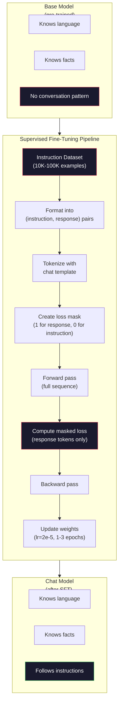

# Penyetelan Instruksi (SFT)

> Model dasar memprediksi token berikutnya. Itu saja. Itu tidak mengikuti instruksi, menjawab pertanyaan, atau menolak permintaan berbahaya. SFT adalah jembatan antara prediktor token dan asisten yang berguna. Setiap model yang pernah kamu ajak bicara -- Claude, GPT, Llama Chat -- telah melalui langkah ini.

**Type:** Build
**Language:** Python (dengan numpy)
**Prerequisites:** Fase 10, Lesson 04 (Pra-Training Mini GPT)
**Waktu:** ~90 menit

## Tujuan Pembelajaran

- Menerapkan penyempurnaan yang diawasi (SFT) yang mengubah model bahasa dasar menjadi asisten yang mengikuti instruksi
- Memformat training data menggunakan templat obrolan dengan peran sistem, pengguna, dan asisten, dan menutupi kehilangan pada token non-asisten
- Jelaskan mengapa SFT diperlukan: model dasar melanjutkan teks daripada menjawab pertanyaan
- Evaluasi kualitas SFT dengan membandingkan model dasar vs respons model yang telah disesuaikan pada set instruksi yang disediakan

## Masalah

kamu melatih sebuah model di Lesson 04. Model tersebut dapat memprediksi token berikutnya berdasarkan urutan. Beri makan "Arsitektur Transformer" dan mungkin akan dilanjutkan dengan "telah merevolusi pemrosesan bahasa alami." Itu mengesankan untuk prediktor token berikutnya.

Sekarang coba ini: beri makan "Apa ibu kota Perancis?" Model dasar tidak menjawab "Paris". Ini melanjutkan polanya. Ini mungkin menghasilkan "Apa ibu kota Jerman? Apa ibu kota Spanyol?" karena belajar dari dokumen yang berisi daftar pertanyaan. Atau mungkin menghasilkan "pertanyaan yang ditanyakan banyak orang" karena itu merupakan kelanjutan token berikutnya yang masuk akal. Model tidak memiliki konsep *menjawab*. Ia hanya tahu *lanjutan*.

Inilah kesenjangan antara GPT-3 (model dasar, dirilis Juni 2020) dan ChatGPT (disesuaikan dengan instruksi, dirilis November 2022). Arsitektur yang sama. Pra-training yang sama. Perbedaannya adalah 20.000 hingga 100.000 pasangan (instruksi, respons) yang dibuat dengan cermat yang mengajarkan model untuk mengikuti pola percakapan.

Stanford Alpaca membuktikan kamu tidak memerlukan jutaan contoh. Pada bulan Maret 2023, mereka menyempurnakan Llama 7B hanya pada 52.000 pasangan instruksi-respons yang dihasilkan oleh GPT-3.5. Total biaya: $600. Hasilnya adalah chatbot yang bisa mengikuti instruksi, menjawab pertanyaan, dan mengadakan percakapan. Tidak sebagus ChatGPT, tapi sangat mengejutkan dengan harga $600 dan beberapa jam training.

Obrolan Llama 2 Meta hanya menggunakan ~27.000 contoh berkualitas tinggi untuk phase awal SFT. Wawasan utamanya: kualitas lebih penting daripada kuantitas. 27.000 contoh yang ditulis oleh anotator terampil mengalahkan 1 juta contoh berisik yang diambil dari internet.

## Konsep

### Apa yang Sebenarnya Dilakukan SFT

Penyempurnaan yang Diawasi melanjutkan loop training yang sama dari pra-training -- meneruskan, menghitung loss, meneruskan ke belakang, memperbarui weight -- tetapi pada jenis data yang berbeda. Alih-alih teks mentah, kamu berlatih percakapan terstruktur:

```json
{
  "system": "You are a helpful assistant.",
  "user": "What is the capital of France?",
  "assistant": "The capital of France is Paris."
}
```

Model tersebut sudah mengetahui bahwa Paris adalah ibu kota Perancis. Ia mempelajari hal ini selama pra-training di Wikipedia, buku teks, dan halaman web. SFT tidak mengajarkan model fakta baru. Ini mengajarkan model *perilaku* baru: ketika kamu melihat pertanyaan, hasilkan jawabannya. Saat kamu melihat instruksi, lakukan penyelesaian. Saat kamu melihat permintaan yang merugikan, berikan penolakan.

Pikirkan seperti ini. Pra-training memberikan pengetahuan model. SFT memberikan model sopan santun.

### Format Data

Tiga format mendominasi industri ini. Masing-masing mengkodekan informasi yang sama -- siapa mengatakan apa -- dengan pembatas yang berbeda.

**Format Alpaca** (Stanford, Maret 2023):

```json
{
  "instruction": "Summarize the following article in 3 sentences.",
  "input": "The European Central Bank raised interest rates...",
  "output": "The ECB increased rates by 25 basis points..."
}
```Sederhana dan banyak digunakan. Bidang `input` bersifat opsional -- banyak instruksi yang tidak memerlukan konteks tambahan. Stanford merilis 52.000 contoh dalam format ini, dihasilkan oleh GPT-3.5 seharga $600. Ini mengawali gerakan penyetelan instruksi sumber terbuka.

**Format ShareGPT** (komunitas, 2023):

```json
{
  "conversations": [
    {"from": "system", "value": "You are a helpful assistant."},
    {"from": "human", "value": "What causes tides?"},
    {"from": "gpt", "value": "Tides are caused by the gravitational pull of the Moon..."},
    {"from": "human", "value": "How often do they occur?"},
    {"from": "gpt", "value": "Most coastal areas experience two high tides and two low tides per day..."}
  ]
}
```

Mendukung percakapan multi-turn. Bidang "dari" menggunakan "manusia" dan "gpt" berdasarkan konvensi, apa pun model sebenarnya. Vicuna dilatih tentang 70.000 percakapan ShareGPT yang diambil dari transkrip ChatGPT yang dibagikan pengguna.

**Format ChatML** (OpenAI, digunakan oleh banyak model sumber terbuka):

```
<|im_start|>system
You are a helpful assistant.<|im_end|>
<|im_start|>user
What is the capital of France?<|im_end|>
<|im_start|>assistant
The capital of France is Paris.<|im_end|>
```

Menggunakan token khusus (`<|im_start|>`, `<|im_end|>`) untuk membatasi peran. Token ini ditambahkan ke kosakata tokenizer selama penyesuaian. Qwen, Yi, dan banyak model lainnya menggunakan ChatML.

Ketiga format tersebut mencapai hal yang sama: mereka memberi tahu model "ini instruksinya, ini responsnya, pelajari pola ini."

### Mengapa Ini Berhasil

Model sudah mengetahui bahasa sejak pra-training. Ini telah melihat miliaran contoh pertanyaan yang diikuti dengan jawaban, instruksi yang diikuti dengan penyelesaian, dan percakapan antar orang. Polanya sudah dikodekan dalam weight.

SFT memusatkan kemampuan terpendam ini. Daripada model perlu mencari tahu dari konteks apakah model harus menjawab pertanyaan atau melanjutkan dokumen, SFT secara eksplisit melatih pola percakapan. Setelah beberapa ribu contoh, model belajar: saat kamu melihat penanda peran asisten, hasilkan respons yang bermanfaat.

Inilah sebabnya mengapa 27.000 contoh sudah cukup. kamu tidak mengajarkan model bahasa Inggris. kamu tidak mengajarkan fakta tentang dunia. kamu mengajarkannya satu perilaku sederhana: merespons instruksi. Pengetahuannya sudah ada.

### Loss Tersamar

Ini adalah detail teknis terpenting dalam SFT, dan sebagian besar tutorial melewatkannya.

Selama pra-training, kamu menghitung loss pada setiap token. Model tersebut belajar memprediksi setiap token berikutnya dalam urutan. Selama SFT, kamu hanya menghitung loss pada token *respons*. Token instruksi ada untuk konteksnya, tetapi model tidak dikenakan sanksi karena "memprediksinya" secara salah.

Mengapa? Karena kamu tidak ingin model belajar *menghasilkan* instruksi. kamu ingin ia belajar *menanggapi* instruksi. Jika kamu menghitung loss pada token instruksi, kamu melatih model untuk memprediksi "Apa ibu kota Perancis?" seolah-olah dialah yang mengajukan pertanyaan. Hal ini membuang sinyal gradient dan dapat membingungkan model tentang perannya.

Dalam praktiknya, kamu membuat masker loss: 1 untuk token respons, 0 untuk token instruksi. Lipat gandakan loss per token dengan topeng ini sebelum membuat rata-rata.

```
Tokens:    [SYS] You are helpful [USER] What is the capital? [ASST] Paris is the capital [EOS]
Loss mask:   0    0    0     0      0     0   0  0     0       1     1    1   1     1      1
```

Hanya token setelah `[ASST]` yang berkontribusi terhadap loss. Model melihat percakapan penuh selama forward pass (model memerlukan instruksi untuk menghasilkan respons yang tepat) namun hanya memperbarui bobotnya berdasarkan seberapa baik model memprediksi respons.

### Melatih Hyperparameter

SFT menggunakan hyperparameter yang sangat berbeda dengan pra-training. kamu tidak berlatih dari awal. kamu sedang menyesuaikan model yang sudah berfungsi.

| Parameter | Pra-Training (Llama 2 7B) | SFT (Obrolan Llama 2) |
|-----------|---------------------------|---------------------|
| Learning rate | 3e-4 (puncak) | 2e-5 |
| Zaman | 1 (data lintasan tunggal) | 2 |
| Ukuran kumpulan | token 4 juta | 64 contoh |
| Langkah pemanasan | 2.000 | 0-100 |
| Penurunan berat badan | 0,1 | 0,0-0,1 |
| Ukuran data | token 2T | 27.000 contoh |Learning rate 15x lebih rendah untuk SFT. Ini sangat penting. Learning rate yang tinggi selama penyesuaian akan menghancurkan pengetahuan yang telah dilatih sebelumnya. Model "melupakan" apa yang dipelajarinya dan menyesuaikan diri dengan dataset kecil yang telah disesuaikan. Ini adalah sebuah bencana melupakan.

Dua periode berarti model melihat setiap contoh training dua kali. Lebih dari 3 periode pada dataset kecil mengarah pada penghafalan -- model mulai mereproduksi contoh training secara verbatim, bukan menggeneralisasi.

### Bencana Lupa

Penyempurnaan dapat merusak kemampuan umum. Berlatih terlalu lama pada data yang mengikuti instruksi akan menyebabkan model kehilangan kemampuannya untuk menulis code, mengerjakan matematika, atau menghasilkan teks kreatif. Ia menjadi sangat baik dalam format spesifik training data-nya dan buruk dalam segala hal lainnya.

Tiga mitigasi:

1. **Learning rate rendah.** 1e-5 hingga 5e-5. Pembaruan yang lebih kecil berarti lebih sedikit kerusakan pada feature yang telah dilatih sebelumnya.

2. **Training singkat.** 1-3 periode. Berhentilah sebelum model mengenakan pakaian luar.

3. **Gabungkan data pra-training.** Obrolan Llama 2 menggabungkan sebagian kecil (2-5%) data mentah pra-training ke dalam dataset SFT. Ini "mengingatkan" model akan kemampuan umumnya sambil mempelajari perilaku mengikuti instruksi yang baru.

### Bilangan Nyata

Menyempurnakan model 7B pada 10.000 pasangan instruksi berkualitas tinggi memerlukan waktu sekitar 1 jam pada satu GPU NVIDIA A100 80GB. Berikut perhitungannya:

- 10.000 contoh x rata-rata 512 token = 5,12 juta token
- 2 epoch = total 10,24 juta token
- Throughput A100 untuk penyempurnaan model 7B: ~3.000 token/detik
- 10,24M / 3.000 = ~3.400 detik = ~57 menit

Untuk mini GPT kami (4 layer, 128 redup), training-nya hampir instan. Intinya adalah memahami mekanismenya, bukan skalanya.



## Build

### Langkah 1: Kumpulan Data Instruksi

Buat dataset instruksi sintetis. Dalam produksi, perusahaan seperti Scale AI dan Anthropic mempekerjakan anotator manusia untuk menulisnya. Kami akan membuatnya secara terprogram untuk mendemonstrasikan formatnya.

```python
import numpy as np

INSTRUCTION_DATA = [
    {
        "instruction": "What is the capital of France?",
        "response": "The capital of France is Paris."
    },
    {
        "instruction": "Explain gravity in one sentence.",
        "response": "Gravity is the force that attracts objects with mass toward each other."
    },
    {
        "instruction": "Write a haiku about the ocean.",
        "response": "Waves crash on the shore, salt and foam beneath the sun, endless blue expanse."
    },
    {
        "instruction": "What is 15 multiplied by 7?",
        "response": "15 multiplied by 7 is 105."
    },
    {
        "instruction": "Name three programming languages.",
        "response": "Three programming languages are Python, Rust, and TypeScript."
    },
    {
        "instruction": "Summarize photosynthesis.",
        "response": "Photosynthesis converts sunlight, water, and carbon dioxide into glucose and oxygen."
    },
    {
        "instruction": "What year did World War II end?",
        "response": "World War II ended in 1945."
    },
    {
        "instruction": "Define machine learning.",
        "response": "Machine learning is a field where algorithms learn patterns from data to make predictions."
    },
]
```

Delapan contoh sangatlah kecil. Stanford Alpaca menggunakan 52.000. Namun mekanismenya tetap sama baik kamu memiliki 8 atau 52.000: tokenization, mask, hitung loss hanya pada respons.

### Langkah 2: Tokenization dengan Templat Obrolan

Ubah pasangan instruksi-respons menjadi rangkaian token dengan penanda peran khusus. Penanda tersebut memberi tahu model di mana instruksi berakhir dan di mana respons dimulai.

```python
SPECIAL_TOKENS = {
    "INST_START": 253,
    "INST_END": 254,
    "RESP_START": 255,
}


def tokenize_instruction_pair(instruction, response, vocab_size=256):
    inst_tokens = list(instruction.encode("utf-8"))
    resp_tokens = list(response.encode("utf-8"))

    inst_tokens = [min(t, vocab_size - 4) for t in inst_tokens]
    resp_tokens = [min(t, vocab_size - 4) for t in resp_tokens]

    tokens = (
        [SPECIAL_TOKENS["INST_START"]]
        + inst_tokens
        + [SPECIAL_TOKENS["INST_END"]]
        + [SPECIAL_TOKENS["RESP_START"]]
        + resp_tokens
    )

    return tokens


def create_loss_mask(tokens):
    mask = np.zeros(len(tokens), dtype=np.float32)
    in_response = False

    for i, token in enumerate(tokens):
        if token == SPECIAL_TOKENS["RESP_START"]:
            in_response = True
            continue
        if in_response:
            mask[i] = 1.0

    return mask
```

Masker loss semuanya nol untuk token instruksi dan semuanya untuk token respons. Token `RESP_START` sendiri mendapat mask 0 karena merupakan pembatas, bukan bagian dari konten respons.

### Langkah 3: Loss Lintas Entropi Terselubung

Entropi silang standar, tetapi dikalikan dengan topeng loss. Hanya token respons yang berkontribusi terhadap gradient.

```python
def masked_cross_entropy_loss(logits, targets, loss_mask):
    batch, seq_len, vocab_size = logits.shape
    logits_flat = logits.reshape(-1, vocab_size)
    targets_flat = targets.reshape(-1)
    mask_flat = loss_mask.reshape(-1)

    max_logits = logits_flat.max(axis=-1, keepdims=True)
    log_softmax = logits_flat - max_logits - np.log(
        np.exp(logits_flat - max_logits).sum(axis=-1, keepdims=True)
    )

    per_token_loss = -log_softmax[np.arange(len(targets_flat)), targets_flat]

    masked_loss = per_token_loss * mask_flat
    num_response_tokens = mask_flat.sum()
    if num_response_tokens == 0:
        return 0.0
    loss = masked_loss.sum() / num_response_tokens

    return loss
```

Penyebutnya adalah `num_response_tokens`, bukan `seq_len`. Jika kamu membaginya dengan total panjang urutan, instruksi yang lebih panjang akan melemahkan sinyal gradient. Membagi berdasarkan jumlah token respons memastikan weight yang sama per token respons, berapa pun panjang instruksinya.

### Langkah 4: Lingkaran Training SFT

Gunakan kembali MiniGPT dari Lesson 04. Loop training terlihat hampir sama dengan pra-training, tetapi dengan format instruksi dan loss yang terselubung.

```python
import sys
import os
sys.path.insert(0, os.path.join(os.path.dirname(__file__), "..", "..", "04-pre-training-mini-gpt", "code"))
from main import MiniGPT, LayerNorm, FeedForward, MultiHeadAttention, TransformerBlock, Embedding


def sft_train(model, dataset, num_epochs=2, lr=2e-5, seq_len=64):
    formatted_data = []
    for example in dataset:
        tokens = tokenize_instruction_pair(example["instruction"], example["response"])
        mask = create_loss_mask(tokens)
        formatted_data.append((tokens, mask))

    print(f"SFT Training: {len(formatted_data)} examples, {num_epochs} epochs, lr={lr}")
    print(f"Total tokens: {sum(len(t) for t, _ in formatted_data):,}")
    print()

    losses = []

    for epoch in range(num_epochs):
        epoch_loss = 0.0
        num_batches = 0

        indices = np.random.permutation(len(formatted_data))

        for idx in indices:
            tokens, mask = formatted_data[idx]

            if len(tokens) < 3:
                continue
            if len(tokens) > seq_len:
                tokens = tokens[:seq_len]
                mask = mask[:seq_len]

            input_ids = np.array(tokens[:-1]).reshape(1, -1)
            target_ids = np.array(tokens[1:]).reshape(1, -1)
            loss_mask = np.array(mask[1:]).reshape(1, -1)

            logits = model.forward(input_ids)
            loss = masked_cross_entropy_loss(logits, target_ids, loss_mask)

            batch_size, s_len, v_size = logits.shape
            probs = np.exp(logits - logits.max(axis=-1, keepdims=True))
            probs = probs / probs.sum(axis=-1, keepdims=True)
            dlogits = probs.copy()
            dlogits[np.arange(batch_size)[:, None], np.arange(s_len), target_ids] -= 1.0

            mask_expanded = loss_mask[:, :, np.newaxis]
            num_resp = loss_mask.sum()
            if num_resp > 0:
                dlogits = dlogits * mask_expanded / num_resp

            for block in model.blocks:
                block.ffn.W1 -= lr * np.random.randn(*block.ffn.W1.shape) * 0.01
                block.ffn.W2 -= lr * np.random.randn(*block.ffn.W2.shape) * 0.01
                block.ffn.b1 -= lr * np.random.randn(*block.ffn.b1.shape) * 0.01
                block.ffn.b2 -= lr * np.random.randn(*block.ffn.b2.shape) * 0.01

            epoch_loss += loss
            num_batches += 1
            losses.append(loss)

        avg_loss = epoch_loss / max(num_batches, 1)
        print(f"Epoch {epoch + 1}/{num_epochs} | Avg Loss: {avg_loss:.4f}")

    return model, losses
```

Learning rate-nya adalah 2e-5, cocok dengan Obrolan Llama 2. Bandingkan ini dengan 3e-4 yang digunakan dalam pra-training -- 15x lebih kecil. Gradiennya ditutupi: token instruksi menghasilkan gradient nol. Hanya token respons yang mendorong weight.

### Langkah 5: Bandingkan Model Dasar vs Model SFTInti dari SFT adalah perubahan perilaku. Mari kita ukur dengan memeriksa bagaimana model merespons input berformat instruksi versus kelanjutan teks mentah.

```python
def generate_response(model, prompt_tokens, max_new_tokens=50, temperature=0.8):
    tokens = list(prompt_tokens)
    seq_len = model.embedding.pos_embed.shape[0]

    for _ in range(max_new_tokens):
        context = np.array(tokens[-seq_len:]).reshape(1, -1)
        logits = model.forward(context)
        next_logits = logits[0, -1, :]

        next_logits = next_logits / max(temperature, 1e-8)
        probs = np.exp(next_logits - next_logits.max())
        probs = probs / probs.sum()
        probs = np.clip(probs, 1e-10, 1.0)
        probs = probs / probs.sum()

        next_token = np.random.choice(len(probs), p=probs)
        tokens.append(int(next_token))

    return tokens


def evaluate_instruction_following(model, instructions):
    print("Evaluating instruction following:")
    print("-" * 50)

    for instruction in instructions:
        tokens = (
            [SPECIAL_TOKENS["INST_START"]]
            + [min(t, 252) for t in list(instruction.encode("utf-8"))]
            + [SPECIAL_TOKENS["INST_END"]]
            + [SPECIAL_TOKENS["RESP_START"]]
        )

        output = generate_response(model, tokens, max_new_tokens=30, temperature=0.6)
        response_start = len(tokens)
        response_tokens = output[response_start:]
        response_bytes = bytes([t for t in response_tokens if t < 128])
        response_text = response_bytes.decode("utf-8", errors="replace")

        print(f"  Q: {instruction}")
        print(f"  A: {response_text[:80]}")
        print()
```

Pada model kecil dengan 8 contoh, tanggapannya tidak akan berarti. Itu diharapkan. Yang penting adalah *struktur*: model belajar menghasilkan output setelah penanda respons alih-alih terus menghasilkan lebih banyak instruksi.

### Langkah 6: Mengukur Kelupaan yang Menyebabkan Bencana

Bandingkan kemampuan prediksi token berikutnya model sebelum dan sesudah SFT. Jika SFT merusak kemampuan umum, loss pada teks mentah akan meningkat.

```python
def measure_forgetting(model, test_text, seq_len=64):
    tokens = np.array(list(test_text.encode("utf-8")[:512]))

    total_loss = 0.0
    num_windows = 0

    for start in range(0, len(tokens) - seq_len - 1, seq_len):
        input_ids = tokens[start:start + seq_len].reshape(1, -1)
        target_ids = tokens[start + 1:start + seq_len + 1].reshape(1, -1)

        logits = model.forward(input_ids)

        batch, s_len, vocab_size = logits.shape
        logits_flat = logits.reshape(-1, vocab_size)
        targets_flat = target_ids.reshape(-1)

        max_logits = logits_flat.max(axis=-1, keepdims=True)
        log_softmax = logits_flat - max_logits - np.log(
            np.exp(logits_flat - max_logits).sum(axis=-1, keepdims=True)
        )

        loss = -log_softmax[np.arange(len(targets_flat)), targets_flat].mean()
        total_loss += loss
        num_windows += 1

    return total_loss / max(num_windows, 1)
```

Dalam penyesuaian nyata, kamu akan melacak metrik ini selama training. Jika kehilangan teks mentah meningkat lebih dari 10-15%, SFT kamu terlalu agresif. Turunkan learning rate atau kurangi jumlah zaman.

## Pakai

### Demo Pipeline SFT Lengkap

```python
if __name__ == "__main__":
    np.random.seed(42)

    test_text = """The transformer architecture processes sequences through self-attention.
Each layer applies multi-head attention followed by a feedforward network.
Residual connections and layer normalization stabilize deep networks.
The model learns to predict the next token given all previous tokens."""

    print("=" * 70)
    print("INSTRUCTION TUNING (SFT) DEMO")
    print("=" * 70)
    print()

    model = MiniGPT(
        vocab_size=256, embed_dim=128, num_heads=4,
        num_layers=4, max_seq_len=128, ff_dim=512
    )
    print(f"Model: {model.count_parameters():,} parameters")
    print(f"Config: 4 layers, 4 heads, 128 dims (mini GPT from Lesson 04)")
    print()

    print("PRE-SFT: Measuring base model loss on raw text")
    base_loss = measure_forgetting(model, test_text)
    print(f"  Base model loss: {base_loss:.4f}")
    print()

    print("=" * 70)
    print("SFT TRAINING")
    print("=" * 70)

    model, losses = sft_train(
        model, INSTRUCTION_DATA, num_epochs=3, lr=2e-5, seq_len=128
    )

    print()
    print("POST-SFT: Measuring fine-tuned model loss on raw text")
    sft_loss = measure_forgetting(model, test_text)
    print(f"  SFT model loss: {sft_loss:.4f}")
    print(f"  Change: {((sft_loss - base_loss) / base_loss * 100):+.1f}%")
    if abs(sft_loss - base_loss) / base_loss < 0.15:
        print("  Minimal forgetting (< 15% change)")
    else:
        print("  Significant forgetting detected")
    print()

    print("=" * 70)
    print("INSTRUCTION FOLLOWING EVALUATION")
    print("=" * 70)
    print()

    test_instructions = [
        "What is the capital of France?",
        "Name a programming language.",
        "Define gravity.",
    ]
    evaluate_instruction_following(model, test_instructions)

    print("=" * 70)
    print("DATA FORMAT EXAMPLES")
    print("=" * 70)
    print()

    for i, example in enumerate(INSTRUCTION_DATA[:3]):
        tokens = tokenize_instruction_pair(example["instruction"], example["response"])
        mask = create_loss_mask(tokens)
        resp_count = int(mask.sum())
        total_count = len(tokens)
        print(f"  Example {i + 1}: {total_count} tokens, {resp_count} response tokens ({resp_count/total_count:.0%} of sequence)")
        print(f"    Instruction: {example['instruction']}")
        print(f"    Response: {example['response']}")
        print()

    print("=" * 70)
    print("TRAINING LOSS CURVE")
    print("=" * 70)
    print()

    if losses:
        window = max(1, len(losses) // 5)
        for i in range(0, len(losses), window):
            chunk = losses[i:i + window]
            avg = sum(chunk) / len(chunk)
            print(f"  Steps {i:3d}-{i + len(chunk) - 1:3d}: avg loss = {avg:.4f}")
```

## Kirim

Lesson ini menghasilkan `outputs/prompt-sft-data-curator.md` -- prompt yang membantu kamu merancang dan menyusun dataset instruksi untuk SFT. Mengingat kemampuan target (pembuatan code, matematika, percakapan), ini menghasilkan rencana pengumpulan data dengan spesifikasi format, kriteria kualitas, dan persyaratan keragaman.

## Latihan

1. Tambahkan dukungan cepat sistem. Ubah `tokenize_instruction_pair` untuk menerima pesan sistem dan menambahkannya sebelum instruksi. Buat 5 contoh dengan system prompt yang berbeda ("kamu adalah seorang penyair", "kamu adalah seorang tutor matematika") dan verifikasi bahwa model melihat system prompt yang berbeda selama training.

2. Menerapkan pencampuran data. Buat fungsi yang mengambil himpunan data SFT dan korpus teks mentah, lalu menghasilkan batch training dengan 5% contohnya adalah teks mentah (tanpa masking) dan 95% adalah pasangan instruksi (dimasker). Jalankan 3 periode dan bandingkan metrik lupa dengan training SFT murni.

3. Membangun pencetak skor kualitas data. Untuk setiap pasangan instruksi-respons, hitung: (a) panjang respons dalam token, (b) rasio instruksi-respons, (c) keragaman kosakata (token unik / total token). Filter contoh dengan panjang respons <10 token atau keragaman <0,3. Tunjukkan bagaimana pemfilteran mempengaruhi loss akhir.

4. Melaksanakan training percakapan multi-giliran. Perluas tokenization untuk menangani percakapan 3 putaran (asisten-pengguna-asisten-pengguna-asisten-pengguna). Topeng loss harus menutupi ketiga putaran asisten. Verifikasikan masker sudah benar dengan mencetak perataan token-mask sebagai salah satu contohnya.

5. Bandingkan learning rate. Latih model yang sama tiga kali dengan lr=1e-4, lr=2e-5, dan lr=1e-6. Gambarkan kurva kerugiannya. Lari 1e-4 harus menunjukkan penurunan awal yang cepat tetapi loss akhir yang lebih tinggi (overfitting). Lari 1e-6 seharusnya hampir tidak bergerak. Lari 2e-5 seharusnya menjadi titik terbaik.

## Istilah Kunci| Istilah | Apa kata orang | Apa sebenarnya arti |
|------|----------------|----------------------|
| SFT | "Menyempurnakan percakapan" | Penyempurnaan yang Diawasi: training berkelanjutan pada pasangan (instruksi, respons) dengan loss hanya dihitung pada token respons |
| Penyetelan instruksi | "Mengajarkan model untuk mengikuti instruksi" | Training pasangan instruksi-respons eksplisit sehingga model dasar mempelajari pola percakapan, bukan pengetahuan baru |
| Penyembunyian loss | "Mengabaikan prompt" | Menyetel loss ke nol untuk token instruksi sehingga gradient hanya mengalir dari prediksi token respons |
| ObrolanML | "Bahasa Markup Obrolan" | Format token menggunakan pembatas `<\|im_start\|>` dan `<\|im_end\|>` untuk menandai peran pembicara dalam data percakapan |
| Format alpaka | "Format Stanford" | Format JSON dengan kolom instruksi/input/output, digunakan untuk 52 ribu contoh yang dihasilkan GPT-3.5 dengan biaya $600 |
| Lupa bencana | "Modelnya semakin bodoh" | Penyempurnaan menghancurkan kemampuan yang telah dilatih sebelumnya karena pembaruan gradient menimpa pengetahuan umum dengan pola khusus tugas |
| Pengikatan weight | "Sematan bersama" | Menggunakan matrix yang sama untuk embedding token input dan kepala prediksi output, menyimpan parameter dan meningkatkan koherensi |
| Templat obrolan | "Bagaimana kamu memformat prompt" | Urutan token spesifik (penanda peran, pembatas) yang menyusun percakapan untuk model |

## Bacaan Lanjutan

- [Ouyang et al., 2022 -- "Melatih model bahasa untuk mengikuti instruksi dengan umpan balik manusia" (InstructGPT)](https://arxiv.org/abs/2203.02155) -- makalah yang memperkenalkan penyetelan instruksi + RLHF di OpenAI
- [Taori dkk., 2023 -- "Stanford Alpaca: Model LLaMA yang Mengikuti Instruksi"](https://github.com/tatsu-lab/stanford_alpaca) -- 52 ribu contoh instruksi seharga $600, membuktikan SFT berfungsi pada dataset kecil
- [Touvron et al., 2023 -- "Llama 2: Open Foundation dan Model Obrolan yang Diselaraskan"](https://arxiv.org/abs/2307.09288) -- Pipeline SFT + RLHF Meta dengan 27 ribu contoh berkualitas tinggi
- [Chiang et al., 2023 -- "Vicuna: Chatbot Sumber Terbuka yang Mengesankan GPT-4"](https://lmsys.org/blog/2023-03-30-vicuna/) -- training tentang 70 ribu percakapan ShareGPT
- [Zhou dkk., 2023 -- "LIMA: Lebih Sedikit Lebih Baik untuk Penyelarasan"](https://arxiv.org/abs/2305.11206) -- membuktikan bahwa 1.000 contoh yang dikurasi dengan cermat dapat menandingi SFT pada dataset yang jauh lebih besar
