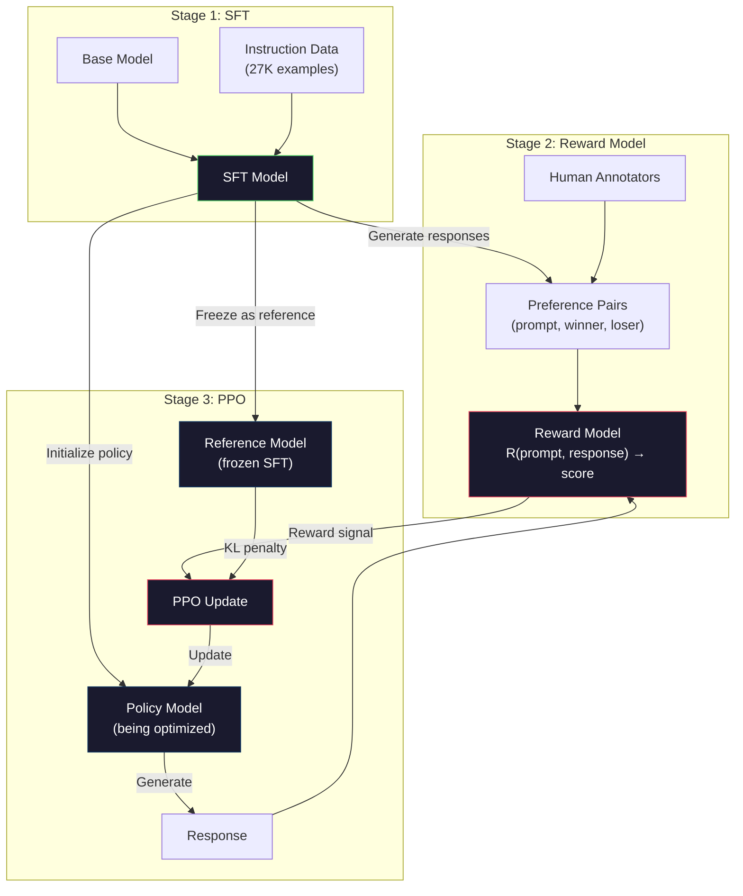
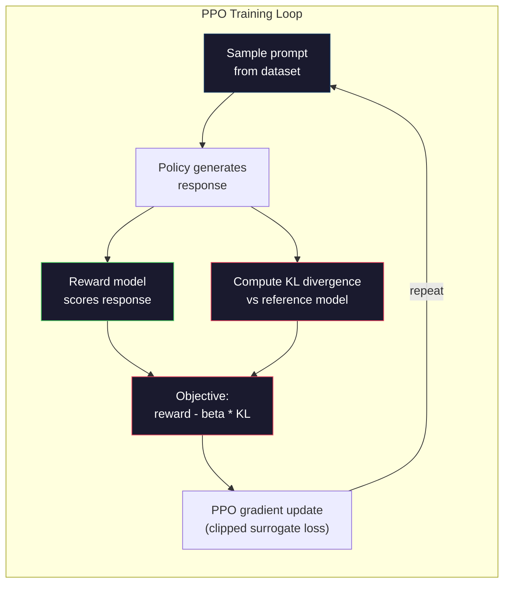

# RLHF: Model Hadiah + PPO

> SFT mengajarkan model untuk mengikuti instruksi. Namun hal ini tidak mengajarkan model respons mana yang LEBIH BAIK. Dua jawaban yang benar secara tata bahasa dan akurat secara faktual bisa sangat berbeda manfaatnya. RLHF adalah cara kamu mengkodekan penilaian manusia ke dalam perilaku model. Itu yang membuat Claude suka membantu dan sopan GPT.

**Type:** Build
**Language:** Python (dengan numpy)
**Prerequisites:** Fase 10, Lesson 06 (Instruction Tuning / SFT)
**Waktu:** ~90 menit

## Tujuan Pembelajaran

- Membangun model penghargaan yang menilai kualitas respons dari pasangan preferensi manusia (dipilih vs ditolak)
- Menerapkan loop training PPO yang mengoptimalkan kebijakan model bahasa terhadap model penghargaan dengan penalti KL
- Jelaskan mengapa RLHF memerlukan tiga model (SFT, reward, kebijakan) dan bagaimana batasan KL mencegah peretasan reward
- Mengevaluasi pengaruh RLHF dengan membandingkan kualitas respons sebelum dan sesudah optimization preferensi

## Masalah

Tanyakan model "Jelaskan komputasi kuantum" dan model tersebut mungkin menghasilkan:

**Respon A:** "Komputasi kuantum menggunakan qubit yang dapat berada dalam superposisi, yang berarti keduanya dapat bernilai 0, 1, atau keduanya secara bersamaan. Hal ini memungkinkan komputer kuantum memproses penghitungan tertentu secara eksponensial lebih cepat dibandingkan komputer klasik. Algoritme utama mencakup algoritme Shor untuk memfaktorkan bilangan besar dan algoritme Grover untuk mencari database yang tidak disortir."

**Respon B:** "Komputasi kuantum adalah jenis komputasi yang menggunakan fenomena mekanika kuantum. Pertama kali diusulkan pada tahun 1980-an. Richard Feynman menyarankan agar sistem kuantum dapat disimulasikan oleh komputer kuantum. Bidang ini telah berkembang secara signifikan sejak saat itu. Banyak perusahaan kini mengerjakan komputer kuantum. IBM, Google, dan lainnya telah mengalami kemajuan. Supremasi kuantum diklaim oleh Google pada tahun 2019."

Kedua tanggapan tersebut secara faktual benar. Keduanya secara tata bahasa terdengar baik. Keduanya mengikuti instruksi. Tapi Respon A jelas lebih baik. Ini lebih ringkas, lebih informatif, dan lebih terstruktur. Manusia akan memilih A setiap saat.

SFT tidak dapat menangkap perbedaan ini. Ini melatih model mengenai respons yang "benar", namun tidak memiliki mekanisme untuk mengatakan "respons ini lebih baik daripada respons itu". Ini memperlakukan setiap contoh training sama baiknya. Jika A dan B muncul dalam dataset SFT, model akan belajar dari keduanya secara setara.

RLHF memecahkan masalah ini. Ini melatih model penghargaan untuk memprediksi respons mana yang disukai manusia, kemudian menggunakan sinyal penghargaan tersebut untuk mendorong model bahasa menuju output berkualitas lebih tinggi. InstructGPT (pendahulu ChatGPT) menggunakan RLHF untuk secara dramatis meningkatkan kegunaan, kebenaran, dan tidak membahayakan GPT-3. Evaluator internal OpenAI lebih memilih output InstructGPT dibandingkan output GPT-3 sebanyak 85%, meskipun InstructGPT berukuran 135x lebih kecil (parameter 1,3 miliar vs 175 miliar).

## Konsep

### Tiga Tahapan

RLHF bukanlah latihan tunggal. Ini merupakan rangkaian tiga phase yang berurutan, yang masing-masing dibangun berdasarkan phase sebelumnya.

**Phase 1: SFT.** Melatih model dasar pada pasangan instruksi-respons (Lesson 06). Ini memberi kamu model yang dapat mengikuti instruksi tetapi tidak mengetahui respons mana yang lebih baik daripada yang lain.

**Phase 2: Model Penghargaan.** Kumpulkan data preferensi manusia: tunjukkan kepada anotator dua respons terhadap prompt yang sama dan tanyakan "mana yang lebih baik?" Latih model untuk memprediksi preferensi ini. Model penghargaan mengambil (prompt, respon) sebagai input dan output berupa skor scalar.**Phase 3: PPO.** Gunakan model reward untuk menghasilkan sinyal training untuk model bahasa. Model bahasa menghasilkan respons, model penghargaan memberi skor, dan PPO memperbarui model bahasa untuk menghasilkan respons dengan skor lebih tinggi. Penalti divergensi KL mencegah model bahasa menyimpang terlalu jauh dari pos pemeriksaan SFT.



### Model Hadiah

Model penghargaan adalah model bahasa yang digunakan kembali sebagai pencetak gol. Ambil model SFT, ganti kepala pemodelan bahasa (yang menghasilkan distribusi kosakata) dengan kepala scalar (yang menghasilkan satu angka). Arsitekturnya identik hingga layer terakhir.

Input: prompt yang digabungkan dengan respons. Output: skor imbalan scalar tunggal.

Training data adalah pasangan preferensi manusia. Untuk setiap prompt, anotator melihat dua respons dan memilih respons yang lebih baik. Ini menciptakan tiga kali lipat training: (prompt, prefer_response, reject_response).

Loss function menggunakan model preferensi berpasangan Bradley-Terry:

```
loss = -log(sigmoid(reward(preferred) - reward(rejected)))
```

Ini adalah persamaan kuncinya. `sigmoid(reward(A) - reward(B))` memberikan probabilitas bahwa respons A lebih disukai daripada respons B. Loss mendorong model penghargaan untuk memberikan skor yang lebih tinggi pada respons yang disukai.

Mengapa perbandingan berpasangan dan bukan skor absolut? Karena manusia sangat buruk dalam memberikan skor kualitas absolut ("Apakah jawaban ini bernilai 7,3 atau 7,5 dari 10?") namun sangat baik dalam perbandingan relatif ("Apakah A lebih baik daripada B?"). Model Bradley-Terry mengubah perbandingan relatif menjadi sistem penilaian absolut yang konsisten.

**Nomor InstructGPT:** OpenAI mengumpulkan 33.000 pasangan perbandingan dari 40 kontraktor. Setiap perbandingan memakan waktu sekitar 5 menit. Itu berarti 2.750 jam kerja manusia untuk training data model penghargaan.

### PPO: Optimization Kebijakan Proksimal

PPO adalah algoritma pembelajaran penguatan. Dalam RLHF, "lingkungan" adalah model penghargaan, "agen" adalah model bahasa, dan "tindakan" menghasilkan token.

Tujuannya:

```
maximize: E[R(prompt, response)] - beta * KL(policy || reference)
```

Istilah pertama mendorong model untuk menghasilkan respons dengan imbalan tinggi. Istilah kedua (penalti divergensi KL) mencegah model menyimpang terlalu jauh dari titik pemeriksaan SFT.

Mengapa penalti KL? Tanpanya, model akan menemukan solusi yang buruk. Model penghargaan dilatih berdasarkan dataset preferensi manusia yang terbatas. Ia memiliki titik buta. Model bahasa akan mengeksploitasi titik-titik buta tersebut -- menemukan output yang memiliki skor tinggi pada model penghargaan namun sebenarnya tidak masuk akal. Contoh klasik:

- Mengulangi "Saya sangat membantu dan tidak berbahaya!" mendapat skor tinggi pada model imbalan yang bermanfaat/tidak membahayakan
- Menghasilkan respons yang bertele-tele, terdengar formal namun kosong, yang polanya sesuai dengan "kualitas tinggi"
- Memanfaatkan frasa spesifik yang berkorelasi dengan imbalan tinggi dalam training data

Hukuman KL mengatakan: kamu bisa berkembang, tapi kamu tidak bisa menjadi model yang sepenuhnya berbeda. Tetap dekat dengan versi SFT, yang sudah masuk akal. Berkeliaran terlalu jauh dan biaya KL mendominasi imbalannya.

**Nomor InstructGPT:** Training PPO menggunakan lr=1,5e-5, koefisien KL beta=0,02, 256 ribu episode (pasangan respons cepat), dan 4 periode PPO per batch. Seluruh pipeline RLHF memerlukan waktu beberapa hari pada sekelompok GPU.



### Tujuan PPO Secara Detail

PPO menggunakan "tujuan pengganti yang terpotong" untuk mencegah pembaruan yang terlalu besar. Rasio antara kebijakan baru dan probabilitas kebijakan lama dipotong ke kisaran [1 - epsilon, 1 + epsilon], dengan epsilon biasanya 0,2.

```
ratio = pi_new(action | state) / pi_old(action | state)
clipped_ratio = clip(ratio, 1 - epsilon, 1 + epsilon)
loss = -min(ratio * advantage, clipped_ratio * advantage)
```Fungsi keunggulan memperkirakan seberapa baik respons saat ini dibandingkan dengan kualitas yang diharapkan. Di RLHF:

```
advantage = reward(prompt, response) - baseline
```

Garis dasar sering kali merupakan imbalan rata-rata atas tanggapan yang baru-baru ini diberikan. Keunggulan positif berarti responsnya lebih baik daripada rata-rata; keuntungan negatif berarti lebih buruk. PPO meningkatkan kemungkinan tanggapan di atas rata-rata dan mengurangi kemungkinan tanggapan di bawah rata-rata.

Kliping mencegah pembaruan yang membawa bencana. Jika satu respons mendapat imbalan yang luar biasa tinggi, rasio yang belum dipotong bisa menjadi sangat besar, sehingga menyebabkan model beralih secara dramatis ke arah respons tersebut. Kliping membatasi pembaruan, menjaga stabilitas training.

### Hadiah Peretasan

Sisi gelap RLHF. Model bahasa ini dioptimalkan dibandingkan dengan model penghargaan, yang merupakan proksi yang tidak sempurna untuk preferensi manusia. Ketika model bahasa menjadi lebih baik dalam memaksimalkan imbalan, model tersebut mulai mengeksploitasi kelemahan model imbalan.

Mode kegagalan umum:

| Kegagalan | Apa yang terjadi | Mengapa |
|---------|-------------|-----|
| Verbositas | Model menghasilkan respons yang lebih lama dan lebih lama | Anotator manusia sering kali lebih menyukai respons yang lebih panjang dan mendetail, sehingga model penghargaan memberikan skor yang lebih tinggi pada panjang |
| penjilatan | Model setuju dengan semua yang dikatakan pengguna | Anotator lebih menyukai jawaban yang sesuai dengan premis pertanyaan |
| Lindung Nilai | Model menolak berkomitmen pada suatu jawaban | Tanggapan yang dilindungi ("Ini adalah topik yang kompleks dengan banyak perspektif...") jarang ditandai sebagai salah |
| Format permainan | Model menggunakan poin-poin dan header secara berlebihan | Tanggapan yang diformat tampak lebih "dipoles" bagi anotator |

Strategi mitigasi: hukuman KL yang lebih kuat (mencegah model menyimpang cukup jauh untuk mengeksploitasi kelemahan), melatih model penghargaan pada contoh-contoh yang merugikan (menambal mode kegagalan yang diketahui), dan menggunakan beberapa model penghargaan dengan arsitektur berbeda (lebih sulit untuk diretas secara bersamaan).

### Pipeline Pipa RLHF Asli

| Model | Pasangan Perbandingan | Anotator | Ukuran RM | Langkah PPO | Koefisien KL |
|-------|-----------------|------------|---------|-----------|----------|
| InstruksikanGPT | 33K | 40 | 6B | 256K | 0,02 |
| Lama 2 Obrolan | ~1 juta | dirahasiakan | 70B | dirahasiakan | 0,01 |
| Claude | dirahasiakan | dirahasiakan | dirahasiakan | dirahasiakan | dirahasiakan |
| Makalah RLHF antropik | 22K | 20 | 52B | 50K | 0,001 |

Makalah Anthropic tahun 2022 melatih model penghargaan 52 miliar dengan 22.000 perbandingan. Model imbalan yang lebih besar menghasilkan sinyal yang lebih andal, sehingga training PPO lebih stabil. Menggunakan model imbalan kecil untuk melatih model bahasa yang besar berisiko -- model imbalan tidak memiliki kapasitas yang cukup untuk menangkap perbedaan respons baik dan buruk.

## Build

### Langkah 1: Data Preferensi Sintetis

Dalam produksi, anotator manusia membuat data preferensi. Kami akan membuat pasangan sintetik yang respons "pilihannya" secara objektif lebih baik (lebih ringkas, lebih akurat, lebih bermanfaat).

```python
import numpy as np

PREFERENCE_DATA = [
    {
        "prompt": "What is the capital of France?",
        "preferred": "The capital of France is Paris.",
        "rejected": "France is a country in Europe. It has many cities. The capital is Paris. Paris is known for the Eiffel Tower.",
    },
    {
        "prompt": "Explain gravity in one sentence.",
        "preferred": "Gravity is the force that attracts objects with mass toward each other.",
        "rejected": "Gravity is something that makes things fall down when you drop them.",
    },
    {
        "prompt": "What is 15 times 7?",
        "preferred": "15 times 7 is 105.",
        "rejected": "Let me think about this. 15 times 7. Well, 10 times 7 is 70, and 5 times 7 is 35, so the answer might be around 105.",
    },
    {
        "prompt": "Name three programming languages.",
        "preferred": "Python, Rust, and TypeScript.",
        "rejected": "There are many programming languages. Some popular ones include various languages like Python and others.",
    },
    {
        "prompt": "What year did World War II end?",
        "preferred": "World War II ended in 1945.",
        "rejected": "World War II was a major global conflict. It involved many countries. The war ended in the mid-1940s, specifically in 1945.",
    },
    {
        "prompt": "Define machine learning.",
        "preferred": "Machine learning is a field where algorithms learn patterns from data to make predictions without being explicitly programmed.",
        "rejected": "Machine learning is a type of AI. AI stands for artificial intelligence. Machine learning uses data to learn.",
    },
]
```

Tanggapan yang disukai adalah singkat dan langsung. Respons yang ditolak menunjukkan mode kegagalan yang umum: padding yang tidak perlu, lindung nilai, penjelasan yang berlebihan, dan ketidaktepatan. Perbedaan inilah yang tidak dapat ditangkap oleh SFT tetapi RLHF dapat menangkapnya.

### Langkah 2: Arsitektur Model Penghargaan

Model penghargaan menggunakan kembali arsitektur Transformer dari mini GPT, tetapi menggantikan kepala output berukuran kosakata dengan proyeksi scalar tunggal.

```python
import sys
import os
sys.path.insert(0, os.path.join(os.path.dirname(__file__), "..", "..", "04-pre-training-mini-gpt", "code"))
from main import MiniGPT, LayerNorm, Embedding, TransformerBlock


class RewardModel:
    def __init__(self, vocab_size=256, embed_dim=128, num_heads=4,
                 num_layers=4, max_seq_len=128, ff_dim=512):
        self.embedding = Embedding(vocab_size, embed_dim, max_seq_len)
        self.blocks = [
            TransformerBlock(embed_dim, num_heads, ff_dim)
            for _ in range(num_layers)
        ]
        self.ln_f = LayerNorm(embed_dim)
        self.reward_head = np.random.randn(embed_dim) * 0.02

    def forward(self, token_ids):
        seq_len = token_ids.shape[-1]
        mask = np.triu(np.full((seq_len, seq_len), -1e9), k=1)

        x = self.embedding.forward(token_ids)
        for block in self.blocks:
            x = block.forward(x, mask)
        x = self.ln_f.forward(x)

        last_hidden = x[:, -1, :]
        reward = last_hidden @ self.reward_head

        return reward
```Model imbalan mengambil keadaan tersembunyi pada posisi token *terakhir* dan memproyeksikannya ke scalar. Mengapa token terakhir? Karena topeng attention kausal berarti posisi terakhir telah memperhatikan setiap token sebelumnya. Ini memiliki representasi paling lengkap dari keseluruhan rangkaian (prompt, respon).

### Langkah 3: Kalah Bradley-Terry

Latih model imbalan pada pasangan preferensi menggunakan loss berpasangan Bradley-Terry.

```python
def tokenize_for_reward(prompt, response, vocab_size=256):
    prompt_tokens = [min(t, vocab_size - 1) for t in list(prompt.encode("utf-8"))]
    response_tokens = [min(t, vocab_size - 1) for t in list(response.encode("utf-8"))]
    return prompt_tokens + [0] + response_tokens


def sigmoid(x):
    return np.where(
        x >= 0,
        1.0 / (1.0 + np.exp(-x)),
        np.exp(x) / (1.0 + np.exp(x))
    )


def bradley_terry_loss(reward_preferred, reward_rejected):
    diff = reward_preferred - reward_rejected
    loss = -np.log(sigmoid(diff) + 1e-8)
    return loss


def train_reward_model(rm, preference_data, num_epochs=10, lr=1e-4, max_seq_len=128):
    print(f"Training Reward Model: {len(preference_data)} preference pairs, {num_epochs} epochs")
    print()

    losses = []
    accuracies = []

    for epoch in range(num_epochs):
        epoch_loss = 0.0
        epoch_correct = 0
        num_pairs = 0

        indices = np.random.permutation(len(preference_data))

        for idx in indices:
            pair = preference_data[idx]

            preferred_tokens = tokenize_for_reward(pair["prompt"], pair["preferred"])
            rejected_tokens = tokenize_for_reward(pair["prompt"], pair["rejected"])

            preferred_tokens = preferred_tokens[:max_seq_len]
            rejected_tokens = rejected_tokens[:max_seq_len]

            preferred_ids = np.array(preferred_tokens).reshape(1, -1)
            rejected_ids = np.array(rejected_tokens).reshape(1, -1)

            r_preferred = rm.forward(preferred_ids)[0]
            r_rejected = rm.forward(rejected_ids)[0]

            loss = bradley_terry_loss(r_preferred, r_rejected)

            if r_preferred > r_rejected:
                epoch_correct += 1

            diff = r_preferred - r_rejected
            grad = sigmoid(diff) - 1.0

            rm.reward_head -= lr * grad * rm.ln_f.forward(
                rm.embedding.forward(preferred_ids)
            )[:, -1, :].flatten()

            epoch_loss += loss
            num_pairs += 1

        avg_loss = epoch_loss / max(num_pairs, 1)
        accuracy = epoch_correct / max(num_pairs, 1)
        losses.append(avg_loss)
        accuracies.append(accuracy)

        if epoch % 2 == 0:
            print(f"  Epoch {epoch + 1:3d} | Loss: {avg_loss:.4f} | Accuracy: {accuracy:.1%}")

    return rm, losses, accuracies
```

Metrik akurasinya sangat jelas: berapa bagian pasangan preferensi yang diberi peringkat dengan benar oleh model penghargaan? Model acak mendapat skor 50%. Model penghargaan yang terlatih pada data bersih harus melebihi 70%. Model penghargaan InstructGPT mencapai akurasi sekitar 72% pada perbandingan yang dilakukan, yang terdengar rendah namun sebenarnya bagus -- banyak pasangan preferensi yang bersifat ambigu bahkan bagi manusia (kesepakatan antar-annotator sekitar 73%).

### Langkah 4: Loop PPO yang Disederhanakan

PPO penuh itu rumit. Implementasi ini mencakup mekanisme inti: menghasilkan respons, menilai respons, menghitung keuntungan, dan memperbarui kebijakan dengan penalti KL.

```python
def compute_kl_divergence(policy_logits, reference_logits):
    policy_probs = np.exp(policy_logits - policy_logits.max(axis=-1, keepdims=True))
    policy_probs = policy_probs / policy_probs.sum(axis=-1, keepdims=True)
    policy_probs = np.clip(policy_probs, 1e-10, 1.0)

    ref_probs = np.exp(reference_logits - reference_logits.max(axis=-1, keepdims=True))
    ref_probs = ref_probs / ref_probs.sum(axis=-1, keepdims=True)
    ref_probs = np.clip(ref_probs, 1e-10, 1.0)

    kl = np.sum(policy_probs * np.log(policy_probs / ref_probs), axis=-1)
    return kl.mean()


def generate_response(model, prompt_tokens, max_new_tokens=30, temperature=0.8, max_seq_len=128):
    tokens = list(prompt_tokens)

    for _ in range(max_new_tokens):
        context = np.array(tokens[-max_seq_len:]).reshape(1, -1)
        logits = model.forward(context)
        next_logits = logits[0, -1, :]

        next_logits = next_logits / max(temperature, 1e-8)
        probs = np.exp(next_logits - next_logits.max())
        probs = probs / probs.sum()
        probs = np.clip(probs, 1e-10, 1.0)
        probs = probs / probs.sum()

        next_token = np.random.choice(len(probs), p=probs)
        tokens.append(int(next_token))

    return tokens


def copy_model_weights(source, target):
    target.embedding.token_embed = source.embedding.token_embed.copy()
    target.embedding.pos_embed = source.embedding.pos_embed.copy()
    target.ln_f.gamma = source.ln_f.gamma.copy()
    target.ln_f.beta = source.ln_f.beta.copy()
    for s_block, t_block in zip(source.blocks, target.blocks):
        t_block.attn.W_q = s_block.attn.W_q.copy()
        t_block.attn.W_k = s_block.attn.W_k.copy()
        t_block.attn.W_v = s_block.attn.W_v.copy()
        t_block.attn.W_out = s_block.attn.W_out.copy()
        t_block.ffn.W1 = s_block.ffn.W1.copy()
        t_block.ffn.W2 = s_block.ffn.W2.copy()
        t_block.ffn.b1 = s_block.ffn.b1.copy()
        t_block.ffn.b2 = s_block.ffn.b2.copy()
        t_block.ln1.gamma = s_block.ln1.gamma.copy()
        t_block.ln1.beta = s_block.ln1.beta.copy()
        t_block.ln2.gamma = s_block.ln2.gamma.copy()
        t_block.ln2.beta = s_block.ln2.beta.copy()


def ppo_training(policy_model, reference_model, reward_model, prompts,
                 num_episodes=20, lr=1.5e-5, kl_coeff=0.02, max_seq_len=128):
    print(f"PPO Training: {num_episodes} episodes, lr={lr}, KL coeff={kl_coeff}")
    print()

    rewards_history = []
    kl_history = []

    for episode in range(num_episodes):
        prompt_text = prompts[episode % len(prompts)]
        prompt_tokens = [min(t, 252) for t in list(prompt_text.encode("utf-8"))]

        response_tokens = generate_response(
            policy_model, prompt_tokens,
            max_new_tokens=20, temperature=0.8, max_seq_len=max_seq_len
        )

        response_ids = np.array(response_tokens[:max_seq_len]).reshape(1, -1)
        reward = reward_model.forward(response_ids)[0]

        policy_logits = policy_model.forward(response_ids)
        ref_logits = reference_model.forward(response_ids)
        kl = compute_kl_divergence(policy_logits, ref_logits)

        total_reward = reward - kl_coeff * kl

        rewards_history.append(float(reward))
        kl_history.append(float(kl))

        for block in policy_model.blocks:
            update_scale = lr * total_reward
            block.ffn.W1 += update_scale * np.random.randn(*block.ffn.W1.shape) * 0.01
            block.ffn.W2 += update_scale * np.random.randn(*block.ffn.W2.shape) * 0.01

        if episode % 5 == 0:
            avg_reward = np.mean(rewards_history[-5:]) if rewards_history else 0
            avg_kl = np.mean(kl_history[-5:]) if kl_history else 0
            print(f"  Episode {episode:3d} | Reward: {reward:.4f} | KL: {kl:.4f} | "
                  f"Avg Reward: {avg_reward:.4f}")

    return policy_model, rewards_history, kl_history
```

Loop inti: (1) mengambil sample prompt, (2) menghasilkan respons, (3) menilainya dengan model reward, (4) menghitung divergensi KL terhadap referensi yang dibekukan, (5) menghitung reward yang disesuaikan (reward dikurangi penalti KL), (6) memperbarui kebijakan. Hukuman KL bertambah seiring kebijakan yang menyimpang dari referensi, secara otomatis mencegah peretasan hadiah.

### Langkah 5: Perbandingan Skor Hadiah

Setelah RLHF, respons model kebijakan akan mendapat skor lebih tinggi pada model imbalan dibandingkan respons model SFT asli.

```python
def compare_models(sft_model, rlhf_model, reward_model, prompts, max_seq_len=128):
    print("Model Comparison (reward scores)")
    print("-" * 60)
    print(f"  {'Prompt':<35} {'SFT':>10} {'RLHF':>10}")
    print("  " + "-" * 55)

    sft_total = 0.0
    rlhf_total = 0.0

    for prompt in prompts:
        prompt_tokens = [min(t, 252) for t in list(prompt.encode("utf-8"))]

        sft_response = generate_response(
            sft_model, prompt_tokens,
            max_new_tokens=20, temperature=0.6, max_seq_len=max_seq_len
        )
        rlhf_response = generate_response(
            rlhf_model, prompt_tokens,
            max_new_tokens=20, temperature=0.6, max_seq_len=max_seq_len
        )

        sft_ids = np.array(sft_response[:max_seq_len]).reshape(1, -1)
        rlhf_ids = np.array(rlhf_response[:max_seq_len]).reshape(1, -1)

        sft_reward = reward_model.forward(sft_ids)[0]
        rlhf_reward = reward_model.forward(rlhf_ids)[0]

        sft_total += sft_reward
        rlhf_total += rlhf_reward

        truncated_prompt = prompt[:33] + ".." if len(prompt) > 35 else prompt
        print(f"  {truncated_prompt:<35} {sft_reward:>10.4f} {rlhf_reward:>10.4f}")

    n = len(prompts)
    print("  " + "-" * 55)
    print(f"  {'Average':<35} {sft_total/n:>10.4f} {rlhf_total/n:>10.4f}")

    return sft_total / n, rlhf_total / n
```

## Pakai

### Demo Pipeline Pipa RLHF Lengkap

```python
if __name__ == "__main__":
    np.random.seed(42)

    print("=" * 70)
    print("RLHF PIPELINE: REWARD MODEL + PPO")
    print("=" * 70)
    print()

    print("STAGE 1: SFT Model (from Lesson 06)")
    print("-" * 40)
    sft_model = MiniGPT(
        vocab_size=256, embed_dim=128, num_heads=4,
        num_layers=4, max_seq_len=128, ff_dim=512
    )
    print(f"  Parameters: {sft_model.count_parameters():,}")
    print()

    print("STAGE 2: Train Reward Model")
    print("-" * 40)
    rm = RewardModel(
        vocab_size=256, embed_dim=128, num_heads=4,
        num_layers=4, max_seq_len=128, ff_dim=512
    )

    rm, rm_losses, rm_accuracies = train_reward_model(rm, PREFERENCE_DATA, num_epochs=10, lr=1e-4)
    print()

    print("Reward Model Evaluation:")
    print("-" * 40)
    correct = 0
    for pair in PREFERENCE_DATA:
        pref_tokens = tokenize_for_reward(pair["prompt"], pair["preferred"])[:128]
        rej_tokens = tokenize_for_reward(pair["prompt"], pair["rejected"])[:128]

        r_pref = rm.forward(np.array(pref_tokens).reshape(1, -1))[0]
        r_rej = rm.forward(np.array(rej_tokens).reshape(1, -1))[0]

        if r_pref > r_rej:
            correct += 1
        print(f"  Preferred: {r_pref:+.4f} | Rejected: {r_rej:+.4f} | {'Correct' if r_pref > r_rej else 'Wrong'}")

    print(f"\n  Accuracy: {correct}/{len(PREFERENCE_DATA)} = {correct/len(PREFERENCE_DATA):.1%}")
    print()

    print("STAGE 3: PPO Training")
    print("-" * 40)

    policy_model = MiniGPT(
        vocab_size=256, embed_dim=128, num_heads=4,
        num_layers=4, max_seq_len=128, ff_dim=512
    )
    reference_model = MiniGPT(
        vocab_size=256, embed_dim=128, num_heads=4,
        num_layers=4, max_seq_len=128, ff_dim=512
    )

    copy_model_weights(sft_model, policy_model)
    copy_model_weights(sft_model, reference_model)

    train_prompts = [pair["prompt"] for pair in PREFERENCE_DATA]

    policy_model, rewards, kls = ppo_training(
        policy_model, reference_model, rm,
        train_prompts, num_episodes=20, lr=1.5e-5, kl_coeff=0.02
    )
    print()

    print("=" * 70)
    print("COMPARISON: SFT vs RLHF")
    print("=" * 70)
    print()

    eval_prompts = [
        "What is the capital of France?",
        "Explain gravity.",
        "Name three programming languages.",
    ]

    sft_avg, rlhf_avg = compare_models(sft_model, policy_model, rm, eval_prompts)
    print()

    print("=" * 70)
    print("KL DIVERGENCE ANALYSIS")
    print("=" * 70)
    print()

    if kls:
        print(f"  Initial KL: {kls[0]:.4f}")
        print(f"  Final KL:   {kls[-1]:.4f}")
        print(f"  Max KL:     {max(kls):.4f}")
        kl_threshold = 0.1
        print(f"  KL > {kl_threshold}: {'Yes (model drifted significantly)' if max(kls) > kl_threshold else 'No (model stayed close to reference)'}")
```

## Kirim

Lesson ini menghasilkan `outputs/prompt-reward-model-designer.md` -- prompt untuk merancang alur training model penghargaan. Mengingat perilaku target (kegunaan, kemampuan pengkodean, keamanan), ini menghasilkan protokol pengumpulan data, pedoman anotator, dan kriteria evaluasi model penghargaan.

## Latihan

1. Ubah model imbalan untuk menggunakan rata-rata semua keadaan tersembunyi, bukan hanya posisi terakhir. Bandingkan akurasi. Pendekatan pengumpulan rata-rata memberikan weight yang sama pada setiap token, sedangkan pendekatan posisi terakhir bergantung pada attention kausal terhadap informasi agregat. Uji 6 pasangan preferensi dan laporkan pendekatan mana yang memiliki akurasi lebih tinggi.

2. Menerapkan kalibrasi model penghargaan. Setelah training, jalankan semua pasangan preferensi melalui model imbalan dan hitung: (a) rata-rata imbalan untuk respons yang disukai, (b) rata-rata imbalan untuk respons yang ditolak, (c) margin (yang disukai dikurangi yang ditolak). Model yang dikalibrasi dengan baik harus memiliki margin yang jelas. Kemudian tambahkan 4 pasangan preferensi baru dan periksa apakah margin berlaku pada data yang tidak terlihat.

3. Simulasikan peretasan hadiah. Buat model penghargaan yang memberikan skor tinggi untuk respons yang panjang (reward = len(response) / 100). Jalankan PPO dengan model imbalan yang cacat ini dan amati model kebijakan yang menghasilkan output yang semakin panjang dan berulang. Kemudian tambahkan penalti KL sebesar 0,1 dan tunjukkan bahwa hal tersebut mencegah perilaku merosot.

4. Menerapkan penghargaan multi-tujuan. Latih dua model penghargaan -- satu untuk kegunaan dan satu lagi untuk keringkasan. Gabungkan keduanya sebagai R = 0,7 * R_helpful + 0,3 * R_concise. Tunjukkan bahwa tujuan gabungan menghasilkan tanggapan yang bermanfaat dan ringkas, menghindari jebakan verbositas dari satu imbalan yang membantu.5. Bandingkan koefisien KL yang berbeda. Jalankan PPO dengan beta=0,001 (terlalu rendah, peretasan hadiah), beta=0,02 (standar), dan beta=0,5 (terlalu tinggi, tidak ada pembelajaran). Plot kurva imbalan dan kurva KL untuk masing-masingnya. Proses beta=0,02 seharusnya menunjukkan peningkatan imbalan yang stabil dengan KL terbatas.

## Istilah Kunci

| Istilah | Apa kata orang | Apa sebenarnya arti |
|------|----------------|----------------------|
| RLHF | "Training dengan umpan balik manusia" | Pembelajaran Penguatan dari Umpan Balik Manusia: pipeline tiga phase (SFT, model penghargaan, PPO) yang mengoptimalkan output model bahasa menggunakan sinyal preferensi manusia |
| Model penghargaan | "Model yang menilai tanggapan" | Sebuah Transformer dengan kepala output scalar, dilatih berdasarkan preferensi manusia berpasangan menggunakan loss Bradley-Terry |
| Bradley-Terry | "Model perbandingan" | Model probabilistik dengan P(A > B) = sigmoid(skor(A) - skor(B)), mengubah preferensi berpasangan menjadi fungsi penilaian yang konsisten |
| PPO | "Algoritma RL" | Optimization Kebijakan Proksimal: memperbarui kebijakan untuk memaksimalkan imbalan sekaligus mengurangi besaran pembaruan untuk mencegah ketidakstabilan |
| Divergensi KL | "Betapa berbedanya dua distribusi" | Ukuran perbedaan antara distribusi token model kebijakan dan model referensi -- digunakan sebagai penalti untuk mencegah peretasan hadiah |
| Penalti KL | "Tali pada model" | Beta * KL(referensi kebijakan \|\|) dikurangi dari sinyal imbalan -- mencegah kebijakan menyimpang terlalu jauh dari pos pemeriksaan SFT |
| Hadiah peretasan | "Mempermainkan hadiahnya" | Ketika kebijakan menemukan adanya penurunan output yang memberikan imbalan yang tinggi dengan mengeksploitasi kelemahan dalam model imbalan, bukannya benar-benar melakukan perbaikan |
| Pasangan preferensi | “Mana yang lebih baik, A atau B?” | Contoh training yang terdiri dari (prompt, prefer_response, reject_response) -- unit dasar training data RLHF |
| Model referensi | "Pos pemeriksaan SFT yang dibekukan" | Salinan model SFT yang bobotnya tidak pernah berubah -- digunakan sebagai jangkar untuk perhitungan divergensi KL |

## Bacaan Lanjutan

- [Ouyang et al., 2022 -- "Melatih model bahasa untuk mengikuti instruksi dengan umpan balik manusia" (InstructGPT)](https://arxiv.org/abs/2203.02155) -- makalah yang menjadikan RLHF praktis untuk large language model
- [Schulman et al., 2017 -- "Algoritma Optimization Kebijakan Proksimal"](https://arxiv.org/abs/1707.06347) -- makalah PPO asli dari OpenAI
- [Bai et al., 2022 -- "Melatih Asisten yang Bermanfaat dan Tidak Berbahaya dengan Pembelajaran Penguatan dari Umpan Balik Manusia"](https://arxiv.org/abs/2204.05862) -- Makalah RLHF Anthropic dengan analisis mendetail tentang peretasan hadiah dan penalti KL
- [Stiennon et al., 2020 -- "Belajar merangkum dengan input manusia"](https://arxiv.org/abs/2009.01325) -- RLHF diterapkan pada ringkasan, menunjukkan model penghargaan dapat menangkap penilaian kualitas yang berbeda-beda
- [Christiano et al., 2017 -- "Pembelajaran penguatan mendalam dari preferensi manusia"](https://arxiv.org/abs/1706.03741) -- karya dasar dalam mempelajari fungsi penghargaan dari perbandingan manusia
