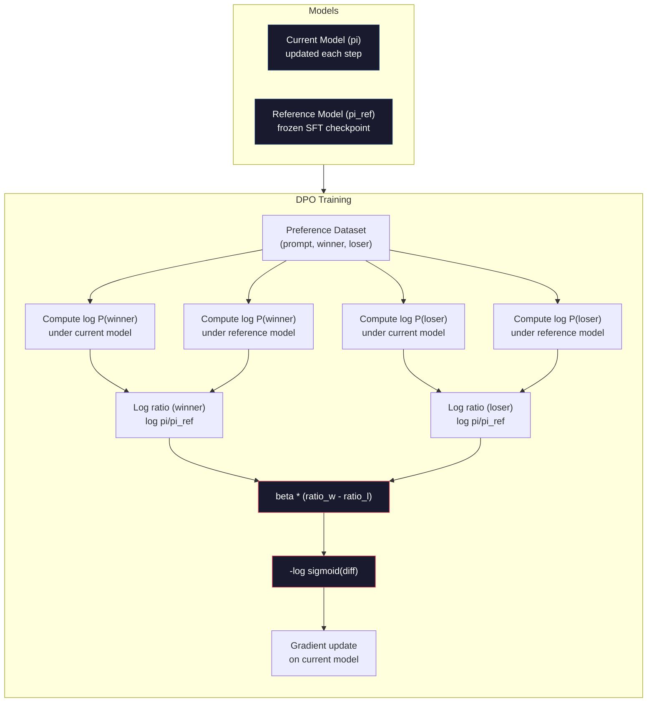

# DPO: Optimization Preferensi Langsung

> RLHF berfungsi. Hal ini juga memerlukan training tiga model (SFT, model penghargaan, kebijakan), pengelolaan ketidakstabilan PPO, dan penyesuaian penalti KL. DPO bertanya: bagaimana jika kamu bisa melewatkan semua itu? DPO secara langsung mengoptimalkan model bahasa pada pasangan preferensi. Tidak ada model penghargaan. Tidak ada PPO. Satu putaran training. Hasil yang sama.

**Type:** Build
**Language:** Python (dengan numpy)
**Prerequisites:** Fase 10, Lesson 07 (RLHF)
**Waktu:** ~90 menit

## Tujuan Pembelajaran

- Menerapkan training DPO yang secara langsung mengoptimalkan model bahasa pada pasangan preferensi tanpa model penghargaan terpisah
- Turunkan loss function DPO dan jelaskan bagaimana fungsi tersebut secara implisit mewakili model imbalan melalui probabilitas log kebijakan
- Bandingkan DPO vs RLHF dalam hal stabilitas training, biaya komputasi, dan jumlah model yang diperlukan
- Sesuaikan parameter beta untuk mengontrol seberapa jauh kebijakan yang dilatih menyimpang dari model referensi

## Masalah

kamu membangun pipeline pipa RLHF di Lesson 07. Tiga phase. Tiga model. Model SFT, model reward, dan model kebijakan dioptimalkan dengan PPO. Model penghargaan saja memerlukan ribuan pasangan preferensi manusia dan putaran training terpisah. PPO memerlukan penyesuaian yang cermat terhadap koefisien KL, learning rate, rasio klip, dan jumlah zaman.

Dalam praktiknya, training PPO terkenal tidak stabil. Perubahan hyperparameter kecil menyebabkan training berbeda. Model penghargaan tidak mewakili preferensi manusia, dan kebijakan ini selalu mencari cara untuk mengeksploitasi kelemahannya. Hukuman KL membantu tetapi memerlukan penyesuaiannya sendiri -- terlalu rendah dan kamu mendapat imbalan peretasan, terlalu tinggi dan model hampir tidak belajar.

Kompleksitas inilah yang menyebabkan sebagian besar model sumber terbuka kesulitan menggunakan RLHF selama bertahun-tahun setelah InstructGPT diterbitkan. Pipa tiga phase ini rapuh. Setiap phase memiliki mode kegagalannya sendiri, dan kesalahan bertambah.

Pada Mei 2023, Rafael Rafailov, Archit Sharma, dan rekannya di Stanford menerbitkan "Optimization Preferensi Langsung: Model Bahasa kamu Secara Rahasia adalah Model Hadiah". Wawasan utamanya: kamu tidak memerlukan model penghargaan terpisah. Fungsi imbalan yang optimal ditentukan secara matematis oleh probabilitas token model bahasa itu sendiri. kamu dapat melewati model reward sepenuhnya dan mengoptimalkan model bahasa langsung pada pasangan preferensi.

DPO mengurangi RLHF menjadi satu langkah pembelajaran yang diawasi. Satu model. Satu loss function. Satu putaran training. Tidak ada pembelajaran penguatan. Zephyr-7B, salah satu model pertama yang menggunakan DPO dalam skala besar, mencocokkan atau mengalahkan model yang dilatih dengan RLHF penuh pada beberapa benchmark. Meta menggunakan DPO sebagai bagian dari jalur penyelarasan Llama 3. Anthropic telah mengutip metode gaya DPO dalam penelitian penyelarasan mereka.

## Konsep

### Wawasan Utama

RLHF mengoptimalkan tujuan ini:

```
maximize: E[R(x, y)] - beta * KL(pi || pi_ref)
```

dimana R adalah model imbalan, pi adalah kebijakan, pi_ref adalah model referensi, dan beta adalah koefisien KL.

Makalah DPO menunjukkan bahwa tujuan ini memiliki solusi optimal bentuk tertutup. Untuk setiap fungsi imbalan R, kebijakan optimalnya adalah:

```
pi*(y | x) = pi_ref(y | x) * exp(R(x, y) / beta) / Z(x)
```

dimana Z(x) adalah konstanta normalisasi. Menata ulang:

```
R(x, y) = beta * log(pi*(y | x) / pi_ref(y | x)) + beta * log Z(x)
```

Inilah terobosannya. Imbalannya dinyatakan sepenuhnya dalam bentuk probabilitas model kebijakan dan probabilitas model referensi. kamu tidak perlu melatih model penghargaan terpisah. Imbalannya *implisit* dalam rasio probabilitas.

Mengganti ini ke dalam model preferensi Bradley-Terry:

```
P(y_w > y_l | x) = sigmoid(R(x, y_w) - R(x, y_l))
                  = sigmoid(beta * (log pi(y_w|x)/pi_ref(y_w|x) - log pi(y_l|x)/pi_ref(y_l|x)))
```Syarat Z(x) dibatalkan karena kedua respon mengkondisikan pada prompt x yang sama. Yang tersisa hanyalah fungsi dari probabilitas log model kebijakan dan probabilitas log model referensi pada respons yang dipilih dan ditolak.

### Loss DPO

```
L_DPO = -log(sigmoid(beta * (log pi(y_w|x)/pi_ref(y_w|x) - log pi(y_l|x)/pi_ref(y_l|x))))
```

Mari kita bongkar setiap bagiannya:

- **y_w** = jawaban pilihan (yang menang).
- **y_l** = respon ditolak (kalah).
- **x** = prompt
- **pi** = model saat ini (sedang dilatih)
- **pi_ref** = model referensi (pos pemeriksaan SFT beku)
- **beta** = parameter suhu yang mengontrol penyimpangan dari referensi (biasanya 0,1 hingga 0,5)

Rasio `log pi(y|x) / pi_ref(y|x)` adalah rasio log-probabilitas. Ketika rasio ini positif, model saat ini memberikan probabilitas yang lebih tinggi terhadap respons y dibandingkan model referensi. Jika negatif, model saat ini memberikan probabilitas yang lebih rendah.

Hilangnya DPO mendorong model untuk meningkatkan rasio log-probabilitas untuk respons yang disukai dan menurunkannya untuk respons yang ditolak. Parameter beta mengontrol seberapa agresif model dapat menyimpang dari referensi -- beta kecil berarti penyimpangan yang besar diperbolehkan, beta besar menjaga model tetap dekat dengan referensi.



### Mengapa DPO Lebih Sederhana

| Aspek | RLHF (PPO) | DPO |
|--------|-----------|-----|
| Model untuk dilatih | 3 (SFT + imbalan + kebijakan) | 1 (hanya kebijakan) |
| Loop training | 3 (SFT, training RM, PPO) | 2 (SFT, DPO) |
| Hyperparameter | lr, koefisien KL, rasio klip, RM lr, zaman x3 | lr, beta, zaman |
| Model penghargaan | Wajib (training terpisah) | Tersirat dalam probabilitas model |
| Algoritma RL | PPO (kompleks, tidak stabil) | Pembelajaran yang diawasi (stabil) |
| Memori GPU | 3-4 model di memori selama PPO | 2 model (saat ini + referensi) |
| Stabilitas training | Sensitif terhadap hyperparameter | Kuat, mirip dengan SFT |

DPO memerlukan dua model dalam memori selama training -- model saat ini dan referensi yang dibekukan. RLHF membutuhkan tiga atau empat: kebijakan, referensi, model penghargaan, dan opsional garis dasar fungsi nilai. Untuk model 70B, setiap salinan membutuhkan 140GB di FP16. Penghematan memori dari penghapusan model penghargaan sangat besar.

### Saat DPO Mengalahkan RLHF

**Dataset kecil.** Dengan 5.000-20.000 pasangan preferensi, DPO sering kali cocok atau melebihi RLHF. Model penghargaan di RLHF memerlukan data yang cukup untuk digeneralisasikan -- dengan data yang terbatas, model tersebut terlalu cocok dan menghasilkan sinyal imbalan yang tidak dapat diandalkan. DPO mengatasi masalah ini dengan tidak memerlukan model penghargaan sama sekali.

**Komputasi terbatas.** DPO memerlukan sekitar sepertiga komputasi RLHF penuh (satu loop training, bukan tiga). Untuk tim tanpa cluster GPU yang besar, ini adalah pilihan praktis.

**Iterasi cepat.** Ingin mencoba 10 set data preferensi berbeda untuk melihat mana yang menghasilkan model terbaik? DPO memungkinkan kamu menjalankan setiap eksperimen dalam hitungan jam. RLHF memerlukan training ulang model penghargaan untuk setiap dataset.

### Saat RLHF Mengalahkan DPO

**Training skala besar.** Pada skala GPT-4 atau Claude, model penghargaan terpisah RLHF dapat menangkap sinyal preferensi yang lebih bernuansa. Model penghargaan bertindak sebagai loss function yang dipelajari yang beradaptasi dengan kriteria kualitas yang kompleks.

**Sinyal imbalan yang kompleks.** Jika "lebih baik" melibatkan berbagai dimension (kebergunaan, tidak menyakiti, kejujuran), model imbalan dapat mempelajari trade-off multi-tujuan ini. DPO memperlakukan setiap pasangan preferensi sebagai sinyal biner -- yang satu lebih baik, yang satu lebih buruk -- tanpa memodelkan alasannya.**Penyelarasan berulang.** Pipeline pipa RLHF dapat menghasilkan respons baru dengan kebijakan saat ini, meminta petugas memberikan penilaian, dan melatih ulang model penghargaan dalam loop online. DPO bekerja pada dataset tetap dari pasangan preferensi. AI Konstitusional (pendekatan Anthropic) menggunakan properti berulang RLHF ini secara ekstensif.

### Selain DPO: KTO, ORPO, SimPO

DPO menginspirasi serangkaian metode penyelarasan yang disederhanakan.

**KTO (Optimization Kahneman-Tversky, 2024):** kamu bahkan tidak memerlukan pasangan. KTO bekerja dengan umpan balik yang tidak berpasangan -- cukup beri label setiap tanggapan sebagai "baik" atau "buruk" tanpa membandingkannya dengan alternatif lain. Hal ini sangat menyederhanakan pengumpulan data. Daripada menunjukkan dua tanggapan kepada anotator dan menanyakan "mana yang lebih baik?", kamu menunjukkan satu tanggapan dan bertanya "apakah ini bagus?" Loss function menerapkan keengganan terhadap loss dari teori prospek: tanggapan yang buruk akan mendapat hukuman lebih banyak daripada tanggapan yang baik akan diberi imbalan.

**ORPO (Odds Ratio Preference Optimization, 2024):** Menggabungkan SFT dan penyelarasan dalam satu langkah training. Daripada melakukan SFT terlebih dahulu lalu DPO, ORPO memodifikasi loss SFT untuk menyertakan sinyal preferensi. Loss tersebut memiliki dua istilah: loss prediksi token berikutnya standar pada respons pilihan, ditambah istilah rasio odds yang meningkatkan kesenjangan antara probabilitas respons pilihan dan penolakan. Satu putaran training, bukan dua.

**SimPO (Simple Preference Optimization, 2024):** Menghilangkan model referensi sepenuhnya. Daripada menghitung rasio log-probabilitas terhadap referensi yang dibekukan, SimPO menggunakan rata-rata log-probabilitas dari respons (dinormalisasi berdasarkan panjangnya) sebagai imbalan implisit. Ini menghemat memori (tidak diperlukan model referensi) dan menyederhanakan training. Normalisasi panjang mencegah model memilih respons yang lebih pendek.

| Metode | Tahun | Model dalam Memori | Butuh Pasangan? | Butuh Referensi? | Loop Training |
|--------|------|-----------------|-------------|-----------------|----------------|
| RLHF | 2022 | 3-4 | Ya (untuk RM) | Ya | 3 |
| DPO | 2023 | 2 | Ya | Ya | 2 |
| KTO | 2024 | 2 | Tidak (tidak berpasangan) | Ya | 2 |
| ORPO | 2024 | 1 | Ya | Tidak | 1 |
| SimPO | 2024 | 1 | Ya | Tidak | 1 |

Trennya jelas: setiap metode menghilangkan satu kerumitan lagi. RLHF membutuhkan model penghargaan dan PPO. DPO menghilangkan keduanya. KTO menghilangkan data berpasangan. ORPO menghilangkan phase SFT yang terpisah. SimPO menghilangkan model referensi. Pajak penyelarasan -- biaya komputasi dan kompleksitas untuk beralih dari model dasar ke model yang selaras -- terus menurun.

### Penerapan DPO Nyata

**Zephyr-7B (HuggingFace, Oktober 2023):** Basis Mistral 7B, SFT di UltraChat (200 ribu contoh), lalu DPO di UltraFeedback (60 ribu pasangan preferensi). Mendapat skor 6,47 di MT-Bench -- model 7B tertinggi pada saat itu. Sebagai perbandingan, Llama 2 Chat 70B mendapat skor 6,86, yang berarti Zephyr berada dalam distance 6% dari model yang ukurannya 10x lipat hanya dengan menggunakan penyelarasan DPO.

**Llama 3 (Meta, April 2024):** Menggunakan DPO setelah phase awal RLHF. Kombinasi ini menunjukkan bahwa DPO dan RLHF dapat saling melengkapi -- RLHF untuk penyelarasan yang luas, DPO untuk penyempurnaan yang ditargetkan.

**Neural Magic / nm-chat (2024):** DPO yang diterapkan pada beberapa model sumber terbuka, secara konsisten menunjukkan peningkatan 5-15% pada tolok ukur penyelarasan dibandingkan garis dasar khusus SFT.

## Build

### Langkah 1: Kumpulan Data Preferensi

Format yang sama seperti RLHF -- (prompt, disukai, ditolak) tiga kali lipat. DPO menggunakan data ini secara langsung tanpa model imbalan perantara.

```python
import numpy as np
import sys
import os
sys.path.insert(0, os.path.join(os.path.dirname(__file__), "..", "..", "04-pre-training-mini-gpt", "code"))
from main import MiniGPT, LayerNorm, Embedding, TransformerBlock

PREFERENCE_DATA = [
    {
        "prompt": "What is the capital of France?",
        "preferred": "The capital of France is Paris.",
        "rejected": "France is a country in Europe. It has many cities. The capital is Paris. Paris is known for the Eiffel Tower.",
    },
    {
        "prompt": "Explain gravity in one sentence.",
        "preferred": "Gravity is the force that attracts objects with mass toward each other.",
        "rejected": "Gravity is something that makes things fall down when you drop them.",
    },
    {
        "prompt": "What is 15 times 7?",
        "preferred": "15 times 7 is 105.",
        "rejected": "Let me think about this. 15 times 7. Well, 10 times 7 is 70, and 5 times 7 is 35, so the answer might be around 105.",
    },
    {
        "prompt": "Name three programming languages.",
        "preferred": "Python, Rust, and TypeScript.",
        "rejected": "There are many programming languages. Some popular ones include various languages like Python and others.",
    },
    {
        "prompt": "What year did World War II end?",
        "preferred": "World War II ended in 1945.",
        "rejected": "World War II was a major global conflict. It involved many countries. The war ended in the mid-1940s, specifically in 1945.",
    },
    {
        "prompt": "Define machine learning.",
        "preferred": "Machine learning is a field where algorithms learn patterns from data to make predictions without being explicitly programmed.",
        "rejected": "Machine learning is a type of AI. AI stands for artificial intelligence. Machine learning uses data to learn.",
    },
]
```

### Langkah 2: Urutan Log-ProbabilitasHilangnya DPO memerlukan penghitungan total probabilitas log dari respons yang diberikan prompt. Ini berarti menjalankan model secara penuh (prompt + respon) dan menjumlahkan probabilitas log dari setiap token respons.

```python
def tokenize_sequence(text, vocab_size=256):
    return [min(t, vocab_size - 1) for t in list(text.encode("utf-8"))]


def compute_sequence_log_prob(model, prompt_tokens, response_tokens, max_seq_len=128):
    full_sequence = prompt_tokens + response_tokens
    if len(full_sequence) > max_seq_len:
        full_sequence = full_sequence[:max_seq_len]

    if len(full_sequence) < 2:
        return 0.0

    input_ids = np.array(full_sequence[:-1]).reshape(1, -1)
    target_ids = np.array(full_sequence[1:])

    logits = model.forward(input_ids)
    logits = logits[0]

    max_logits = logits.max(axis=-1, keepdims=True)
    log_probs = logits - max_logits - np.log(
        np.exp(logits - max_logits).sum(axis=-1, keepdims=True)
    )

    prompt_len = len(prompt_tokens)
    response_start = max(0, prompt_len - 1)
    response_end = len(target_ids)

    if response_start >= response_end:
        return 0.0

    response_log_probs = log_probs[response_start:response_end, :]
    response_targets = target_ids[response_start:response_end]

    total_log_prob = 0.0
    for i, target in enumerate(response_targets):
        total_log_prob += response_log_probs[i, target]

    return total_log_prob
```

Fungsi ini adalah pekerja keras DPO. Untuk setiap pasangan preferensi, ini berjalan empat kali: model pada respons yang disukai, model pada respons yang ditolak, referensi pada respons yang disukai, referensi pada respons yang ditolak. Itu berarti 4 forward pass per contoh training versus pembuatan RLHF + penilaian hadiah + estimasi nilai + pembaruan PPO. Lebih sederhana, lebih cepat, lebih stabil.

### Langkah 3: Loss DPO

Inti dari makalah dalam code. Satu fungsi. Satu loss. Tidak ada model penghargaan.

```python
def sigmoid(x):
    return np.where(
        x >= 0,
        1.0 / (1.0 + np.exp(-x)),
        np.exp(x) / (1.0 + np.exp(x))
    )


def dpo_loss(policy_logprob_preferred, policy_logprob_rejected,
             ref_logprob_preferred, ref_logprob_rejected, beta=0.1):
    preferred_ratio = policy_logprob_preferred - ref_logprob_preferred
    rejected_ratio = policy_logprob_rejected - ref_logprob_rejected

    logit = beta * (preferred_ratio - rejected_ratio)

    loss = -np.log(sigmoid(logit) + 1e-8)

    preferred_reward = beta * preferred_ratio
    rejected_reward = beta * rejected_ratio

    return loss, {
        "preferred_ratio": float(preferred_ratio),
        "rejected_ratio": float(rejected_ratio),
        "logit": float(logit),
        "implicit_preferred_reward": float(preferred_reward),
        "implicit_rejected_reward": float(rejected_reward),
        "reward_margin": float(preferred_reward - rejected_reward),
    }
```

`preferred_ratio` dan `rejected_ratio` adalah rasio log-probabilitas dari turunan DPO. Ketika model saat ini memberikan probabilitas yang lebih tinggi pada respons yang disukai (relatif terhadap referensi) dan probabilitas yang lebih rendah pada respons yang ditolak, maka logitnya positif dan kerugiannya rendah. Sinyal training mendorong model ke arah ini.

`implicit_preferred_reward` dan `implicit_rejected_reward` adalah imbalan yang secara implisit diberikan oleh loss DPO. kamu dapat mengekstraknya untuk memverifikasi bahwa training berhasil -- selisih antara imbalan yang dipilih dan ditolak akan meningkat seiring dengan training.

### Langkah 4: Putaran Training DPO

Lingkaran training standar yang diawasi. Tidak ada PPO. Tidak ada model penghargaan. Teruskan saja dan pembaruan gradient.

```python
def copy_model_weights(source, target):
    target.embedding.token_embed = source.embedding.token_embed.copy()
    target.embedding.pos_embed = source.embedding.pos_embed.copy()
    target.ln_f.gamma = source.ln_f.gamma.copy()
    target.ln_f.beta = source.ln_f.beta.copy()
    for s_block, t_block in zip(source.blocks, target.blocks):
        t_block.attn.W_q = s_block.attn.W_q.copy()
        t_block.attn.W_k = s_block.attn.W_k.copy()
        t_block.attn.W_v = s_block.attn.W_v.copy()
        t_block.attn.W_out = s_block.attn.W_out.copy()
        t_block.ffn.W1 = s_block.ffn.W1.copy()
        t_block.ffn.W2 = s_block.ffn.W2.copy()
        t_block.ffn.b1 = s_block.ffn.b1.copy()
        t_block.ffn.b2 = s_block.ffn.b2.copy()
        t_block.ln1.gamma = s_block.ln1.gamma.copy()
        t_block.ln1.beta = s_block.ln1.beta.copy()
        t_block.ln2.gamma = s_block.ln2.gamma.copy()
        t_block.ln2.beta = s_block.ln2.beta.copy()


def dpo_train(policy_model, reference_model, preference_data,
              num_epochs=5, lr=5e-6, beta=0.1, max_seq_len=128):
    print(f"DPO Training: {len(preference_data)} pairs, {num_epochs} epochs, "
          f"lr={lr}, beta={beta}")
    print()

    losses = []
    margins = []

    for epoch in range(num_epochs):
        epoch_loss = 0.0
        epoch_margin = 0.0
        num_examples = 0

        indices = np.random.permutation(len(preference_data))

        for idx in indices:
            pair = preference_data[idx]

            prompt_tokens = tokenize_sequence(pair["prompt"])
            preferred_tokens = tokenize_sequence(pair["preferred"])
            rejected_tokens = tokenize_sequence(pair["rejected"])

            pi_logprob_w = compute_sequence_log_prob(
                policy_model, prompt_tokens, preferred_tokens, max_seq_len
            )
            pi_logprob_l = compute_sequence_log_prob(
                policy_model, prompt_tokens, rejected_tokens, max_seq_len
            )
            ref_logprob_w = compute_sequence_log_prob(
                reference_model, prompt_tokens, preferred_tokens, max_seq_len
            )
            ref_logprob_l = compute_sequence_log_prob(
                reference_model, prompt_tokens, rejected_tokens, max_seq_len
            )

            loss, metrics = dpo_loss(
                pi_logprob_w, pi_logprob_l,
                ref_logprob_w, ref_logprob_l, beta
            )

            update_direction = 1.0 if metrics["logit"] < 0 else -0.1
            for block in policy_model.blocks:
                block.ffn.W1 += lr * update_direction * np.random.randn(*block.ffn.W1.shape) * 0.01
                block.ffn.W2 += lr * update_direction * np.random.randn(*block.ffn.W2.shape) * 0.01

            epoch_loss += loss
            epoch_margin += metrics["reward_margin"]
            num_examples += 1
            losses.append(float(loss))
            margins.append(metrics["reward_margin"])

        avg_loss = epoch_loss / max(num_examples, 1)
        avg_margin = epoch_margin / max(num_examples, 1)

        print(f"  Epoch {epoch + 1}/{num_epochs} | Loss: {avg_loss:.4f} | "
              f"Avg Margin: {avg_margin:.4f}")

    return policy_model, losses, margins
```

Loop training sangat sederhana dibandingkan dengan RLHF. Untuk setiap pasangan preferensi: hitung empat probabilitas log (dua model, dua respons), masukkan ke dalam loss DPO, hitung gradient, perbarui kebijakan. Tidak ada langkah generasi. Tidak ada inference model penghargaan. Tidak ada estimasi keuntungan. Tidak ada kliping.

### Langkah 5: Bandingkan DPO vs RLHF

Ukur margin imbalan implisit dan pergeseran probabilitas log untuk membandingkan DPO dengan model RLHF dari Lesson 07.

```python
def evaluate_preference_accuracy(model, reference_model, preference_data, beta=0.1, max_seq_len=128):
    correct = 0
    total = 0

    for pair in preference_data:
        prompt_tokens = tokenize_sequence(pair["prompt"])
        preferred_tokens = tokenize_sequence(pair["preferred"])
        rejected_tokens = tokenize_sequence(pair["rejected"])

        pi_w = compute_sequence_log_prob(model, prompt_tokens, preferred_tokens, max_seq_len)
        pi_l = compute_sequence_log_prob(model, prompt_tokens, rejected_tokens, max_seq_len)
        ref_w = compute_sequence_log_prob(reference_model, prompt_tokens, preferred_tokens, max_seq_len)
        ref_l = compute_sequence_log_prob(reference_model, prompt_tokens, rejected_tokens, max_seq_len)

        preferred_reward = beta * (pi_w - ref_w)
        rejected_reward = beta * (pi_l - ref_l)

        if preferred_reward > rejected_reward:
            correct += 1
        total += 1

    return correct / max(total, 1)


def analyze_implicit_rewards(model, reference_model, preference_data, beta=0.1, max_seq_len=128):
    print("Implicit Reward Analysis:")
    print("-" * 65)
    print(f"  {'Prompt':<30} {'Pref Reward':>12} {'Rej Reward':>12} {'Margin':>10}")
    print("  " + "-" * 60)

    for pair in preference_data:
        prompt_tokens = tokenize_sequence(pair["prompt"])
        preferred_tokens = tokenize_sequence(pair["preferred"])
        rejected_tokens = tokenize_sequence(pair["rejected"])

        pi_w = compute_sequence_log_prob(model, prompt_tokens, preferred_tokens, max_seq_len)
        pi_l = compute_sequence_log_prob(model, prompt_tokens, rejected_tokens, max_seq_len)
        ref_w = compute_sequence_log_prob(reference_model, prompt_tokens, preferred_tokens, max_seq_len)
        ref_l = compute_sequence_log_prob(reference_model, prompt_tokens, rejected_tokens, max_seq_len)

        pref_reward = beta * (pi_w - ref_w)
        rej_reward = beta * (pi_l - ref_l)
        margin = pref_reward - rej_reward

        truncated = pair["prompt"][:28] + ".." if len(pair["prompt"]) > 30 else pair["prompt"]
        print(f"  {truncated:<30} {pref_reward:>12.4f} {rej_reward:>12.4f} {margin:>10.4f}")

    print()
```

### Langkah 6: Analisis Sensitivitas Beta

Parameter beta adalah DPO yang setara dengan koefisien KL di RLHF. Ini mengontrol seberapa besar model dapat menyimpang dari referensi. Eksperimen ini menunjukkan efeknya.

```python
def beta_sensitivity_analysis(sft_model, preference_data, betas, max_seq_len=128):
    print("Beta Sensitivity Analysis")
    print("-" * 60)
    print(f"  {'Beta':>8} {'Final Loss':>12} {'Final Margin':>14} {'Accuracy':>10}")
    print("  " + "-" * 55)

    results = []

    for beta in betas:
        policy = MiniGPT(
            vocab_size=256, embed_dim=128, num_heads=4,
            num_layers=4, max_seq_len=max_seq_len, ff_dim=512
        )
        reference = MiniGPT(
            vocab_size=256, embed_dim=128, num_heads=4,
            num_layers=4, max_seq_len=max_seq_len, ff_dim=512
        )
        copy_model_weights(sft_model, policy)
        copy_model_weights(sft_model, reference)

        policy, losses, margins_list = dpo_train(
            policy, reference, preference_data,
            num_epochs=3, lr=5e-6, beta=beta, max_seq_len=max_seq_len
        )

        accuracy = evaluate_preference_accuracy(
            policy, reference, preference_data, beta, max_seq_len
        )

        final_loss = losses[-1] if losses else 0
        final_margin = margins_list[-1] if margins_list else 0

        print(f"  {beta:>8.3f} {final_loss:>12.4f} {final_margin:>14.4f} {accuracy:>10.1%}")
        results.append({
            "beta": beta,
            "final_loss": final_loss,
            "final_margin": final_margin,
            "accuracy": accuracy,
        })

        print()

    return results
```

Beta kecil (0,01) memungkinkan model menyimpang secara bebas dari referensi -- pembelajaran cepat namun berisiko menghasilkan solusi yang buruk. Beta besar (1.0) menjaga model tetap dekat dengan referensi -- pembelajaran yang stabil namun lambat. Sweet spot untuk sebagian besar aplikasi adalah 0,1 hingga 0,3.

## Pakai

### Demo Pipeline DPO Lengkap

```python
if __name__ == "__main__":
    np.random.seed(42)

    print("=" * 70)
    print("DPO: DIRECT PREFERENCE OPTIMIZATION")
    print("=" * 70)
    print()

    print("STEP 1: Initialize SFT Model (from Lesson 06)")
    print("-" * 50)
    sft_model = MiniGPT(
        vocab_size=256, embed_dim=128, num_heads=4,
        num_layers=4, max_seq_len=128, ff_dim=512
    )
    print(f"  Parameters: {sft_model.count_parameters():,}")
    print()

    print("STEP 2: DPO Training")
    print("-" * 50)

    policy_model = MiniGPT(
        vocab_size=256, embed_dim=128, num_heads=4,
        num_layers=4, max_seq_len=128, ff_dim=512
    )
    reference_model = MiniGPT(
        vocab_size=256, embed_dim=128, num_heads=4,
        num_layers=4, max_seq_len=128, ff_dim=512
    )
    copy_model_weights(sft_model, policy_model)
    copy_model_weights(sft_model, reference_model)

    policy_model, losses, margins = dpo_train(
        policy_model, reference_model, PREFERENCE_DATA,
        num_epochs=5, lr=5e-6, beta=0.1
    )
    print()

    print("=" * 70)
    print("STEP 3: Evaluate")
    print("=" * 70)
    print()

    pre_accuracy = evaluate_preference_accuracy(
        sft_model, reference_model, PREFERENCE_DATA, beta=0.1
    )
    post_accuracy = evaluate_preference_accuracy(
        policy_model, reference_model, PREFERENCE_DATA, beta=0.1
    )

    print(f"  Preference accuracy (pre-DPO):  {pre_accuracy:.1%}")
    print(f"  Preference accuracy (post-DPO): {post_accuracy:.1%}")
    print()

    analyze_implicit_rewards(policy_model, reference_model, PREFERENCE_DATA, beta=0.1)

    print("=" * 70)
    print("STEP 4: Training Dynamics")
    print("=" * 70)
    print()

    if losses:
        print("  Loss curve:")
        window = max(1, len(losses) // 5)
        for i in range(0, len(losses), window):
            chunk = losses[i:i + window]
            avg = sum(chunk) / len(chunk)
            print(f"    Steps {i:3d}-{i + len(chunk) - 1:3d}: loss = {avg:.4f}")
        print()

    if margins:
        print("  Reward margin curve:")
        window = max(1, len(margins) // 5)
        for i in range(0, len(margins), window):
            chunk = margins[i:i + window]
            avg = sum(chunk) / len(chunk)
            print(f"    Steps {i:3d}-{i + len(chunk) - 1:3d}: margin = {avg:.4f}")
        print()

    print("=" * 70)
    print("STEP 5: Beta Sensitivity")
    print("=" * 70)
    print()

    beta_results = beta_sensitivity_analysis(
        sft_model, PREFERENCE_DATA, betas=[0.01, 0.1, 0.3, 1.0]
    )

    print("=" * 70)
    print("DPO vs RLHF COMPARISON")
    print("=" * 70)
    print()
    print("  DPO advantages:")
    print("    - 1 training loop (vs 3 for RLHF)")
    print("    - 2 models in memory (vs 3-4 for RLHF)")
    print("    - Supervised learning (vs RL, more stable)")
    print("    - No reward model to train or maintain")
    print()
    print("  RLHF advantages:")
    print("    - Separate reward model captures complex preferences")
    print("    - Online learning: generate, rate, retrain")
    print("    - Better for multi-objective alignment")
    print("    - Proven at largest scales (GPT-4, Claude)")
    print()
    print("  Practical guidance:")
    print("    - Start with DPO. It's simpler and often sufficient.")
    print("    - Switch to RLHF if DPO plateaus on your eval metrics.")
    print("    - Many production systems use both: RLHF first, DPO to refine.")
```

## Kirim

Lesson ini menghasilkan `outputs/prompt-alignment-method-selector.md` -- prompt yang membantu kamu memilih metode penyelarasan yang tepat (SFT, RLHF, DPO, KTO, ORPO, SimPO) untuk kasus penggunaan kamu. Mengingat ketersediaan data, anggaran komputasi, dan sasaran penyelarasan kamu, ini merekomendasikan metode dan rencana training.

## Latihan

1. Menerapkan KTO (Optimization Kahneman-Tversky). KTO tidak memerlukan pasangan -- cukup beri label pada setiap tanggapan sebagai "baik" atau "buruk". Loss untuk respon yang baik adalah `-log(sigmoid(beta * log_ratio))` dan untuk respon yang buruk adalah `-log(1 - sigmoid(beta * log_ratio))` dengan pengganda keengganan loss (biasanya 1,5x) pada kehilangan respon yang buruk. Latih data yang sama (perlakukan lebih disukai sebagai "baik" dan ditolak sebagai "buruk" secara independen) dan bandingkan akurasi dengan DPO.2. Menerapkan DPO yang dinormalisasi panjangnya. Daripada menggunakan probabilitas log mentah, bagilah dengan jumlah token respons: `normalized_logprob = total_logprob / num_tokens`. Hal ini mencegah model untuk memilih respons yang lebih pendek (yang memiliki total log-prob lebih tinggi). Bandingkan margin imbalan implisit dengan dan tanpa normalisasi.

3. Build loss gabungan gaya ORPO. Tambahkan loss prediksi token berikutnya standar pada respons pilihan terhadap loss DPO: `L = L_sft(preferred) + alpha * L_dpo`. Coba nilai alpha 0,1, 0,5, dan 1,0. Loss gabungan harus menghasilkan model yang mengikuti instruksi (dari istilah SFT) dan lebih memilih respons yang lebih baik (dari istilah DPO), sehingga menghilangkan kebutuhan akan tahapan SFT terpisah.

4. Menerapkan DPO berulang. Jalankan DPO selama 3 periode, lalu buat respons baru dari model yang dilatih, pasangkan dengan respons pilihan awal sebagai pasangan preferensi baru, dan jalankan DPO lagi. Dua putaran proses "bermain mandiri" ini. Bandingkan akurasi preferensi setelah putaran 1 dan putaran 2 untuk melihat apakah penyempurnaan berulang membantu.

5. Bandingkan DPO dengan model referensi yang berbeda. Daripada menggunakan checkpoint SFT sebagai referensi, cobalah: (a) model dasar (pra-SFT), (b) checkpoint dari epoch 1 DPO, (c) rata-rata pergerakan eksponensial dari model kebijakan. Laporkan referensi mana yang menghasilkan akurasi preferensi tertinggi dan kurva training paling stabil.

## Istilah Kunci

| Istilah | Apa kata orang | Apa sebenarnya arti |
|------|----------------|----------------------|
| DPO | "RLHF tanpa RL" | Optimization Preferensi Langsung: algoritme pembelajaran terawasi yang mengoptimalkan model bahasa secara langsung pada pasangan preferensi, melewati model penghargaan dan PPO |
| Hadiah implisit | "Hadiahnya ada pada modelnya" | Fungsi imbalan ditentukan oleh rasio log-probabilitas antara model kebijakan dan referensi -- tidak diperlukan model imbalan terpisah |
| Beta (DPO) | "Suhu" | Mengontrol seberapa jauh kebijakan dapat menyimpang dari model referensi -- beta kecil memungkinkan penyimpangan yang besar, beta besar menjaga model tetap dekat |
| Rasio log-probabilitas | "Seberapa banyak model yang berubah" | log pi(y\|x) - log pi_ref(y\|x) -- positif berarti model saat ini memberikan probabilitas lebih tinggi daripada referensi |
| Model referensi | "Pos pemeriksaan yang dibekukan" | Salinan model SFT yang bobotnya tidak pernah berubah -- berfungsi sebagai jangkar untuk menghitung rasio probabilitas |
| KTO | "DPO tanpa berpasangan" | Optimization Kahneman-Tversky: bekerja dengan label "baik" atau "buruk" yang tidak berpasangan alih-alih memerlukan pasangan preferensi |
| ORPO | "Penyelarasan satu langkah" | Optimization Preferensi Rasio Odds: menggabungkan SFT dan penyelarasan ke dalam satu loop training dengan menambahkan istilah preferensi ke loss SFT |
| SimPO | "Tidak diperlukan referensi" | Optimization Preferensi Sederhana: menghilangkan model referensi dengan menggunakan probabilitas log rata-rata yang dinormalisasi panjang sebagai imbalan implisit |
| Pajak penyelarasan | "Biaya membuat model aman" | Komputasi, data, dan kompleksitas tambahan yang diperlukan untuk beralih dari model dasar ke model yang selaras -- DPO mengurangi hal ini secara signifikan |

## Bacaan Lanjutan- [Rafailov et al., 2023 -- "Optimization Preferensi Langsung: Model Bahasa kamu Secara Rahasia adalah Model Hadiah"](https://arxiv.org/abs/2305.18290) -- makalah DPO yang menyederhanakan penyelarasan dari RLHF ke pembelajaran yang diawasi
- [Tunstall et al., 2023 -- "Zephyr: Direct Distillation of LM Alignment"](https://arxiv.org/abs/2310.16944) -- Zephyr-7B, menampilkan DPO di UltraFeedback cocok dengan RLHF di benchmark
- [Ethayarajh dkk., 2024 -- "KTO: Penyelarasan Model sebagai Optimization Teori Prospek"](https://arxiv.org/abs/2402.01306) -- menghilangkan kebutuhan akan preferensi berpasangan
- [Hong et al., 2024 -- "ORPO: Optimization Preferensi Monolitik tanpa Model Referensi"](https://arxiv.org/abs/2403.07691) -- menggabungkan SFT dan penyelarasan dalam satu langkah
- [Meng et al., 2024 -- "SimPO: Optimization Preferensi Sederhana dengan Hadiah Bebas Referensi"](https://arxiv.org/abs/2405.14734) -- menghilangkan model referensi sepenuhnya
- [Laporan Teknis Llama 3](https://arxiv.org/abs/2407.21783) -- Alignment pipeline Meta menggabungkan RLHF dan DPO
