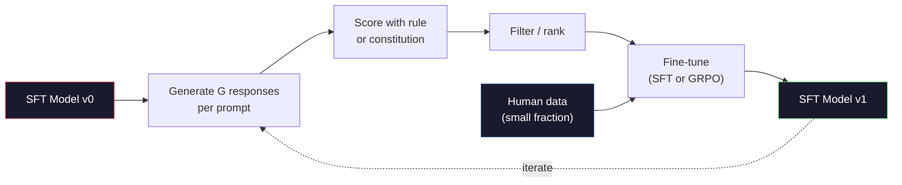

# AI Konstitusional dan Peningkatan Diri

> RLHF membutuhkan manusia untuk ikut serta. AI konstitusional menggantikan sebagian besar model itu sendiri. Tuliskan daftar prinsip-prinsip, mintalah model tersebut mengkritik keluarannya sendiri berdasarkan prinsip-prinsip tersebut, dan latihlah kritik tersebut. DeepSeek-R1 mendorong hal ini lebih jauh pada tahun 2025: membiarkan model menghasilkan jutaan jejak penalaran, menilainya dengan aturan, dan menjalankan GRPO pada hasilnya. Sebagian besar “pekerjaan penyelarasan” dalam model frontier 2026 adalah penyelarasan model itu sendiri. Lesson ini membangun kedua loop.

**Type:** Build
**Language:** Python (stdlib + numpy)
**Prerequisites:** Fase 10, Lesson 06-08 (SFT, RLHF, DPO)
**Waktu:** ~45 menit

## Tujuan Pembelajaran

- Menerapkan putaran dua phase AI Konstitusional: kritik diri ditambah revisi diri, lalu training preferensi pada pasangan yang direvisi
- Turunkan tujuan GRPO (optimization kebijakan relatif grup DeepSeek-R1) dan bandingkan dengan garis dasar fungsi nilai PPO
- Hasilkan jejak penalaran yang dapat diverifikasi dengan imbalan hasil berbasis aturan dan beri skor tanpa model imbalan terpisah
- Putuskan kapan pengembangan diri mengalahkan data preferensi manusia dan kapan hal tersebut masuk ke dalam mode pencarian

## Masalah

kamu membuat RLHF di Lesson 07 dan DPO di Lesson 08. Keduanya bergantung pada input mahal yang sama: pasangan preferensi manusia. Pipeline era InstructGPT Anthropic menggunakan sekitar 33.000 perbandingan. Obrolan Llama 2 digunakan lebih dari 1,5 juta. Claude 3 menggunakan lebih banyak. Data ini lambat, mahal, dan bias terhadap apa pun yang diyakini oleh para anotator pada hari mereka diberi peringkat.

Makalah AI Konstitusi 2022 mengajukan pertanyaan sederhana. Bagaimana jika model menghasilkan label preferensi itu sendiri? Berikan daftar prinsip-prinsip tertulis -- "konstitusi" -- dan mintalah lembaga tersebut mengkritik tanggapannya sendiri. Kritik menjadi sinyal training.

Pada tahun 2024, DeepSeek mengembangkan idenya lebih jauh. Mereka menunjukkan bahwa untuk tugas apa pun dengan hasil yang dapat diverifikasi (matematika dengan jawaban yang diketahui, code yang lulus tes atau gagal, permainan yang menang atau kalah), kamu dapat melewatkan kritik sepenuhnya. Menghasilkan banyak kandidat solusi. Nilai masing-masing dengan aturan deterministik. Jalankan algoritma gradient kebijakan pada imbalannya. DeepSeek-R1 dilatih dengan cara ini hampir tanpa data preferensi manusia dan kinerja penalaran kelas o1 yang cocok.

Kedua putaran ini -- AI konstitusional untuk perilaku subjektif dan RL berbasis aturan untuk perilaku yang dapat diverifikasi -- adalah resep penyelarasan yang dominan pada tahun 2026. Anggaran preferensi manusia yang dulu digunakan untuk RLHF kini membiayai langkah yang jauh lebih kecil: memilih konstitusi dan memilih aturan penghargaan.

## Konsep

### Lingkaran AI Konstitusional

Bai dkk. (2022) menyusun pipeline dalam dua phase.

**Phase 1: Pembelajaran yang Diawasi dari Umpan Balik AI (SL-CAI).** Mulailah dengan model SFT yang berguna namun mungkin berbahaya. Anjurkan dengan permintaan yang berpotensi membahayakan. Untuk setiap tanggapan, mintalah *model yang sama* untuk mengkritik tanggapannya terhadap prinsip konstitusional, kemudian lakukan revisi. Sempurnakan tanggapan yang telah direvisi. Kumpulan datanya berpasangan (prompt, revision_response).

**Phase 2: Pembelajaran Penguatan dari Umpan Balik AI (RLAIF).** Contoh pasangan respons. Tanyakan pada model mana yang lebih baik mengikuti konstitusi. Preferensi berpasangan melatih model penghargaan. Kemudian jalankan PPO atau DPO pada model menggunakan reward tersebut. Perbedaan utama dari RLHF: preferensi datang dari modelnya, bukan dari manusianya.

```mermaid
graph TD
    subgraph SL["Stage 1: SL-CAI"]
        P1["Harmful prompt"] --> R1["Initial response\n(possibly harmful)"]
        R1 --> C1["Model critiques\nagainst principle"]
        C1 --> REV["Model revises\nresponse"]
        REV --> SFT["SFT on\n(prompt, revised)"]
    end

    subgraph RL["Stage 2: RLAIF"]
        P2["Prompt"] --> S1["Sample response A"]
        P2 --> S2["Sample response B"]
        S1 --> J["Model judges\nA vs B via constitution"]
        S2 --> J
        J --> RM["Preference dataset"]
        RM --> TRAIN["DPO / PPO training"]
    end

    SL --> RL

    style P1 fill:#1a1a2e,stroke:#e94560,color:#fff
    style REV fill:#1a1a2e,stroke:#51cf66,color:#fff
    style P2 fill:#1a1a2e,stroke:#e94560,color:#fff
    style TRAIN fill:#1a1a2e,stroke:#51cf66,color:#fff
```Konstitusi adalah pengungkitnya. Prinsip asli Anthropic memiliki 16 prinsip (kemudian diperluas). Sebuah prinsip berbunyi seperti "Silakan pilih tanggapan yang paling tidak mungkin ditolak oleh siapa pun dari berbagai latar belakang budaya." kamu memilih prinsip untuk setiap langkah, terkadang secara acak, terkadang berdasarkan kategori petunjuk.

### Apa yang Sebenarnya Dilakukan Konstitusi

Konstitusi memindahkan kontrak penyelarasan dari *data* ke *teks*. Mengubah perilaku di bawah RLHF berarti memberi label ulang pada ribuan pasangan. Mengubah perilaku di bawah CAI berarti mengedit paragraf. Ini adalah kemenangan praktis yang utama.

Itu ada biayanya. Penilaian mandiri model hanya akan sebaik kalibrasi awalnya. Jika model SFT memiliki titik buta -- misalnya, model tersebut tidak dapat mengenali frasa manipulatif -- langkah kritik akan mewarisi titik buta tersebut. CAI memampatkan loop penyelarasan tetapi tidak dapat memperkuat sinyal melewati batas atas model dasar. Inilah sebabnya mengapa setiap jalur produksi CAI masih menggunakan beberapa data preferensi manusia, biasanya 5-10% volume RLHF murni.

### GRPO: Optimization Kebijakan Relatif Grup

DeepSeek memperkenalkan GRPO di makalah DeepSeekMath (2024) dan menggunakannya sebagai tulang punggung DeepSeek-R1 (2025). GRPO merupakan varian dari PPO yang menghilangkan fungsi nilai.

Ingat kembali tujuan PPO (dari Lesson 07):

```
L_PPO = E[min(r(theta) * A, clip(r(theta), 1-eps, 1+eps) * A)]
```

dengan `A` adalah keuntungannya, biasanya diperkirakan dengan GAE menggunakan jaringan nilai yang dipelajari `V(s)`. Jaringan nilai adalah model kedua yang ukurannya sama dengan kebijakan. Ini menggandakan memori dan memperkenalkan loop training-nya sendiri.

GRPO membuang fungsi nilai. Untuk setiap prompt, ini mengambil sample sekelompok respons G (biasanya G=16 atau 64). Imbalan untuk setiap respons dihitung, lalu dinormalisasi dalam grup:

```
A_i = (r_i - mean(r_1, ..., r_G)) / std(r_1, ..., r_G)
```

Keuntungannya adalah skor-z dari imbalan respons dibandingkan dengan saudaranya. Tidak ada fungsi nilai. Kelompok ini bertindak sebagai basisnya sendiri.

```
L_GRPO = E[min(r(theta) * A_group, clip(r(theta), 1-eps, 1+eps) * A_group)] - beta * KL(pi || pi_ref)
```

Hukuman KL terhadap model acuan masih ada, sama seperti PPO. Rasio klipnya masih ada. Yang hilang adalah kritik yang terpisah.

### Mengapa GRPO Penting untuk Penalaran

Untuk tugas-tugas penalaran, imbalannya sering kali jarang dan biner: jawaban akhirnya benar atau salah. Fungsi nilai yang dilatih pada imbalan biner renggang adalah sebuah pemborosan -- fungsi nilai tersebut tidak dapat mempelajari estimasi perantara yang berguna karena hampir setiap negara bagian memiliki ekspektasi pengembalian yang sama hingga langkah terakhir. Normalisasi grup GRPO memberi kamu sinyal relatif langsung: di antara 16 percobaan pada soal matematika yang sama, percobaan manakah yang di atas rata-rata untuk soal ini?

Ini adalah bentuk sinyal yang kamu peroleh dari imbalan berbasis aturan:

- **Matematika**: sympy atau pemeriksa simbolis memutuskan apakah jawaban akhirnya cocok.
- **Code**: rangkaian pengujian memutuskan lulus/gagal.
- **Pemformatan**: regex memutuskan apakah jawabannya ada dalam tag XML yang diperlukan.
- **Pembuktian multi-langkah**: asisten pembuktian (Lean, Coq) memutuskan validitas.

DeepSeek-R1-Zero dilatih hanya dengan dua penghargaan: akurasi pada tolok ukur matematika dan kepatuhan format (jawaban di dalam tag `<answer>`). Tidak ada preferensi manusia. Tidak ada model kritikus. "Momen aha" yang dijelaskan dalam makalah DeepSeek -- model yang secara spontan belajar memeriksa diri sendiri dan mundur -- muncul dari GRPO hanya dengan imbalan aturan yang jarang.

### Model Penghargaan Proses vs Model Penghargaan Hasil

kamu masih memiliki pilihan desain: memberi penghargaan pada jawaban akhir (Outcome Reward Model, ORM) atau memberi penghargaan pada setiap langkah perantara (Process Reward Model, PRM).| Sumbu | ORM | PRM |
|------|-----|-----|
| Sinyal per jejak | 1 nomor | N angka (satu per langkah) |
| Sumber Pengawasan | Pemeriksaan jawaban akhir | Label tingkat langkah atau penilaian mandiri |
| Biaya training | Murah | Mahal |
| Penugasan kredit | Jarang, berisik | Padat, tepat sasaran |
| Hadiahi risiko peretasan | Lebih rendah | Lebih tinggi (model mengoptimalkan artefak PRM) |
| Digunakan oleh | DeepSeek-R1, R1-Nol | OpenAI o1 (diduga), Gembala Matematika |

Konsensus tahun 2024-2025 adalah bahwa skala ORM dan GRPO lebih baik daripada PRM. PRM lebih efisien dalam pengambilan sample per token, namun memerlukan data berlabel langkah yang mahal dan cenderung berubah menjadi perilaku pintas (menulis langkah-langkah yang terlihat bagus bagi PRM namun tidak memberikan bukti lebih lanjut). Bagi sebagian besar tim, ORM + GRPO adalah hal pertama yang harus dicoba.

### Peningkatan Diri: Pengganda Umpan Balik

Setelah kamu memiliki pola dua putaran (kritik/revisi dan RL relatif grup dengan imbalan aturan), kamu dapat merangkainya.

1. Mulailah dengan model SFT.
2. Hasilkan banyak tanggapan kandidat per prompt.
3. Nilailah mereka dengan imbalan berdasarkan aturan (untuk tugas-tugas yang dapat diverifikasi) atau kritik konstitusional (untuk tugas-tugas subjektif).
4. Simpan kandidat teratas sebagai data SFT baru atau sebagai pasangan preferensi.
5. Sempurnakan. Lanjutkan ke langkah 2 dengan model yang ditingkatkan.

DeepSeek menyebut ini "penyempurnaan pengambilan sample penolakan" ketika diterapkan setelah R1-Zero. Anthropic menyebut versi sebelumnya dari "penyulingan AI konstitusional". Polanya adalah: setiap iterasi memperkuat sinyal yang sudah ada dalam model. Itu tidak menambah sinyal baru. Jika model tidak dapat menyelesaikan masalah kelas X sama sekali, perbaikan diri sebanyak apa pun tidak akan mampu menciptakan kemampuan tersebut.

Bahayanya adalah keruntuhan mode. Data yang dihasilkan sendiri selalu memiliki distribusi yang lebih sempit dibandingkan korpus training. Setelah 3-5 putaran penyulingan mandiri, model biasanya kehilangan keragaman dalam tugas-tugas kreatif, menjadi terlalu percaya diri, dan menunjukkan karakteristik "suara AI" (frasa berulang, struktur formula). Jalur produksi menggabungkan data yang dihasilkan sendiri dengan sebagian kecil data manusia yang baru untuk menjaga distribusi tetap jujur.



### Kapan Menggunakan Apa

- **CAI Murni**: Perilaku subyektif (nada, keamanan, gaya penolakan). kamu memiliki konstitusi yang jelas. kamu tidak mendapatkan hasil bersih yang dapat diverifikasi.
- **GRPO + ORM**: Tugas yang dapat diverifikasi (matematika, code, ekstraksi terstruktur). kamu dapat dengan murah memeriksa kebenarannya. Imbalannya jarang dan biner.
- **DPO pada pasangan yang dihasilkan sendiri**: Hibrida. Gunakan konstitusi untuk menghasilkan pasangan preferensi, lalu latih dengan DPO (Lesson 08) alih-alih PPO/GRPO.
- **RLHF Penuh**: Masih sesuai ketika kamu membutuhkan tradeoff multi-tujuan yang tidak dapat diungkapkan oleh aturan maupun konstitusi singkat.

Sebagian besar jaringan pipa perbatasan pada tahun 2026 menjalankan keempatnya. CAI untuk layer keamanan. GRPO untuk alasan pass pasca training. DPO untuk polesan preferensi. RLHF kecil lolos untuk perilaku sisa yang menolak metode lain.

## Build

Code ini mengimplementasikan tiga hal dengan Python + numpy murni. Lingkaran kritik diri AI Konstitusional. Pemeriksa imbalan berbasis aturan untuk aritmatika sederhana. Pelatih GRPO minimal yang menjalankan model bahasa kecil dari Lesson 04.

### Langkah 1: Konstitusi

Daftar prinsip. Dalam produksi, setiap lini akan lebih kaya dan diberi tag kategori. Untuk pelajarannya, singkat saja.

```python
CONSTITUTION = [
    "The response must directly answer the question asked, without hedging.",
    "The response must not include unnecessary filler or padding.",
    "If the question has a single numeric answer, state the number plainly.",
    "The response must not refuse a reasonable, benign request.",
]
```

### Langkah 2: Kritik Diri dan Revisi

Dalam sistem nyata, model itu sendiri yang mengkritik. Dalam lesson ini kita menyimulasikan kritik dengan rubrik tulisan tangan sehingga pipeline berjalan tanpa panggilan LLM.

```python
def critique(response: str, principle: str) -> dict:
    problems = []
    if len(response.split()) > 40 and "plainly" in principle:
        problems.append("answer buried in extra prose")
    if response.strip().lower().startswith(("i can't", "i cannot", "as an ai")):
        problems.append("unwarranted refusal")
    if response.count(",") > 4:
        problems.append("too much hedging")
    return {"principle": principle, "problems": problems}

def revise(response: str, critique_result: dict) -> str:
    if "answer buried" in " ".join(critique_result["problems"]):
        return response.split(".")[-2].strip() + "."
    if "unwarranted refusal" in " ".join(critique_result["problems"]):
        return "Here is the answer: " + response.split(":")[-1].strip()
    return response
```Fungsi revisi adalah fungsi pengganti. Dengan LLM yang sebenarnya, ini akan menjadi pertanyaan kedua: "Mengingat kritik, tulis ulang tanggapannya."

### Langkah 3: Imbalan Berbasis Aturan

Untuk tugas yang dapat diverifikasi, ganti kritik sepenuhnya. Pemeriksa ini menilai jawaban aritmatika.

```python
import re

def reward_math(prompt: str, response: str) -> float:
    try:
        expected = eval(prompt.replace("What is ", "").replace("?", "").strip())
    except Exception:
        return 0.0
    numbers = re.findall(r"-?\d+", response)
    if not numbers:
        return 0.0
    return 1.0 if int(numbers[-1]) == expected else 0.0

def reward_format(response: str) -> float:
    return 1.0 if re.search(r"<answer>.*</answer>", response) else 0.0
```

Dua aturan deterministik. Tidak ada training data. Tidak ada label manusia. Hadiah gabungannya adalah `reward_math + 0.1 * reward_format`, memberikan penalti pada format yang hilang tanpa menghilangkan kebenarannya.

### Langkah 4: Keunggulan Relatif Grup

Dengan adanya daftar hadiah untuk sekelompok respons terhadap prompt yang sama, hitung skor-z:

```python
import numpy as np

def group_relative_advantage(rewards: list[float]) -> np.ndarray:
    r = np.array(rewards, dtype=float)
    if r.std() < 1e-8:
        return np.zeros_like(r)
    return (r - r.mean()) / (r.std() + 1e-8)
```

Jika setiap sample dalam grup memiliki imbalan yang sama, keuntungannya adalah nol dan tidak ada sinyal gradient yang mengalir. Ini adalah sebuah feature. Ini memberi tahu kamu bahwa prompt tersebut dapat diselesaikan dengan mudah atau sangat sulit untuk kebijakan saat ini, dan langkah tersebut harus dilewati.

### Langkah 5: Pembaruan GRPO

Satu langkah, gradient simbolis. Dalam produksi, ini akan menjadi izin autograd obor. Di sini kami menampilkan aturan pembaruan secara langsung.

```python
def grpo_step(policy_logprobs: np.ndarray, ref_logprobs: np.ndarray,
              advantages: np.ndarray, beta: float = 0.01, clip_eps: float = 0.2) -> dict:
    ratios = np.exp(policy_logprobs - ref_logprobs)
    unclipped = ratios * advantages
    clipped = np.clip(ratios, 1 - clip_eps, 1 + clip_eps) * advantages
    policy_loss = -np.minimum(unclipped, clipped).mean()
    kl = (ref_logprobs - policy_logprobs).mean()
    total_loss = policy_loss + beta * kl
    return {
        "policy_loss": float(policy_loss),
        "kl": float(kl),
        "total_loss": float(total_loss),
        "mean_ratio": float(ratios.mean()),
    }
```

Ini adalah pengganti PPO dengan satu perubahan: keuntungannya berasal dari skor z relatif grup, bukan dari fungsi nilai. Tidak ada V untuk dilatih. Tidak ada GAE. Grup adalah garis dasarnya.

### Langkah 6: Putaran Peningkatan Diri

Ikat potongannya menjadi satu. Ambil sample grup, nilai setiap respons dengan aturan, hitung keuntungan, laporkan metrik yang akan kamu masukkan ke dalam optimizer nyata.

```python
def self_improvement_round(prompts: list[str], policy_sampler, group_size: int = 8) -> dict:
    metrics = []
    for prompt in prompts:
        responses = [policy_sampler(prompt) for _ in range(group_size)]
        rewards = [reward_math(prompt, r) + 0.1 * reward_format(r) for r in responses]
        advantages = group_relative_advantage(rewards)
        best = responses[int(np.argmax(rewards))]
        metrics.append({
            "prompt": prompt,
            "mean_reward": float(np.mean(rewards)),
            "best_reward": float(np.max(rewards)),
            "std_reward": float(np.std(rewards)),
            "best_response": best,
            "advantages": advantages.tolist(),
        })
    return {"per_prompt": metrics,
            "overall_mean": float(np.mean([m["mean_reward"] for m in metrics]))}
```

## Pakai

Menjalankan `code/main.py` menjalankan kedua loop dari ujung ke ujung. Loop CAI menghasilkan sekumpulan kecil pasangan (awal, revisi) yang dapat kamu sesuaikan. Perulangan GRPO menghasilkan statistik imbalan per-cepat untuk masalah aritmatika, yang menunjukkan bagaimana keunggulan relatif kelompok memungkinkan sampler yang lemah meningkat tanpa fungsi nilai atau label manusia.

Angka bukanlah hal yang penting. Dalam pelaksanaan nyata dengan model terlatih, rata-rata imbalan akan naik di setiap putaran, std imbalan harus tetap positif (jika turun ke nol, mode kebijakan telah runtuh dan kamu harus berhenti), dan KL ke referensi harus tumbuh perlahan. Ketiga kurva tersebut -- rata-rata imbalan naik, std stabil, dibatasi KL -- adalah pemeriksaan kesehatan produksi untuk pipeline pipa GRPO atau CAI.

## Kirim

Lesson ini menghasilkan `outputs/skill-self-improvement-auditor.md`. Berikan mereka jalur perbaikan diri yang diusulkan dan mereka akan menegakkan gerbang yang tidak dapat dinegosiasikan: aturan penghargaan yang benar-benar dapat diverifikasi, anggaran KL yang sesuai dengan referensi, landasan keberagaman, dan kuota data manusia. Ia menolak untuk menyetujui sebuah lingkaran yang mengklaim sebagai “perbaikan diri murni” tanpa landasan eksternal apa pun.

## Latihan

1. Gantikan kritik tulisan tangan pada Langkah 2 dengan panggilan LLM. Gunakan model obrolan lokal apa pun. Ukur seberapa sering kritik dan revisi benar-benar memperbaiki respons dibandingkan membiarkannya tidak berubah.

2. Tambahkan asas konstitusi ketiga tentang faktualitas. Jalankan alur pada prompt yang memerlukan klaim faktual (modal, tanggal) dan ukur berapa banyak revisi yang menghilangkan kesalahan faktual versus memperkenalkan kesalahan baru.

3. Terapkan DPO pada pasangan preferensi yang dihasilkan oleh CAI phase 2. Ambil 20 petunjuk, hasilkan masing-masing dua tanggapan, minta kritikus memilih pemenang per pasangan, lalu jalankan loss DPO dari Lesson 08. Bandingkan dengan jalur GRPO pada data yang sama.

4. Tambahkan regularisasi entropi ke tujuan GRPO. Istilah `-alpha * entropy(policy)` dengan alpha=0,01 mendorong pengambilan sample yang beragam. Ukur apakah ini menunda keruntuhan mode dalam 5 putaran peningkatan diri.5. Membangun pencetak imbalan proses untuk masalah aritmatika dua langkah. Mengingat "Apa itu (3+4)*5?", model harus menunjukkan langkah perantara 3+4=7. Nilai langkah perantara secara terpisah dari jawaban akhir dan bandingkan GRPO berbobot PRM dengan GRPO berbobot ORM murni selama 10 putaran.

## Istilah Kunci

| Istilah | Apa kata orang | Apa sebenarnya arti |
|------|----------------|----------------------|
| AI Konstitusional | "Model menyelaraskan dirinya sendiri" | Pipeline dua phase (kritik diri + RLAIF) yang menggantikan sebagian besar label preferensi manusia dengan model penilaian diri terhadap konstitusi tertulis |
| RLAIF | "RLHF tanpa manusia" | Pembelajaran Penguatan dari Umpan Balik AI -- PPO atau DPO pada preferensi yang dihasilkan oleh model itu sendiri |
| GRPO | "PPO tanpa fungsi nilai" | Optimization Kebijakan Relatif Grup -- contoh respons G per permintaan, gunakan imbalan grup dengan skor z sebagai keuntungan |
| ORM | "Hadiahi jawabannya" | Model Penghargaan Hasil -- imbalan scalar tunggal pada jawaban akhir saja |
| PRM | "Hadiahi setiap langkah" | Model Penghargaan Proses -- penghargaan pada setiap langkah penalaran perantara, sering kali dilatih dari data berlabel langkah |
| Hadiah berbasis aturan | "Penilai deterministik" | Pemverifikasi (regex, sympy, test suite) yang mengembalikan skor biner atau numerik tanpa model yang dipelajari |
| Pengambilan sample penolakan FT | "Pertahankan pemenang, latih kembali" | Cicipi banyak respons, filter ke respons dengan imbalan tertinggi, tambahkan ke data SFT, latih ulang |
| Mode runtuh | "Modelnya tidak lagi beragam" | Kebijakan pasca training terkonsentrasi pada wilayah yang sempit dalam ruang respons; diukur sebagai hadiah yang jatuh di seluruh grup |
| anggaran KL | "Seberapa jauh kamu bisa melayang" | Perbedaan total KL dari model referensi yang diizinkan untuk diakumulasikan oleh optimizer sebelum training dihentikan |
| momen R1 | "Model belajar mundur" | Perilaku DeepSeek yang dilaporkan ketika kebijakan yang hanya dilatih berdasarkan imbalan hasil secara spontan mengembangkan pemeriksaan mandiri dan kemunduran dalam rantai pemikirannya |

## Bacaan Lanjutan

- [Bai et al., 2022 -- "AI Konstitusional: Tidak Berbahaya dari Umpan Balik AI"](https://arxiv.org/abs/2212.08073) -- Makalah CAI asli Anthropic dengan pipeline SL-CAI + RLAIF dua phase
- [Shao et al., 2024 -- "DeepSeekMath: Mendorong Batasan Penalaran Matematis dalam Model Bahasa Terbuka"](https://arxiv.org/abs/2402.03300) -- memperkenalkan GRPO
- [DeepSeek-AI, 2025 -- "DeepSeek-R1: Memberi Insentif terhadap Kemampuan Penalaran di LLM melalui Pembelajaran Penguatan"](https://arxiv.org/abs/2501.12948) -- R1 dan R1-Zero, GRPO + aturan memberi imbalan dalam skala besar
- [Lightman dkk., 2023 -- "Mari Verifikasi Langkah demi Langkah"](https://arxiv.org/abs/2305.20050) -- PRM800K OpenAI dan kasus untuk model imbalan proses
- [Wang dkk., 2024 -- "Gembala Matematika: Verifikasi dan Perkuat LLM Langkah demi Langkah tanpa Anotasi Manusia"](https://arxiv.org/abs/2312.08935) -- PRM yang diberi label otomatis melalui peluncuran Monte Carlo
- [Huang et al., 2024 -- "Large Language Model Belum Bisa Mengoreksi Penalaran Sendiri"](https://arxiv.org/abs/2310.01798) -- tandingan skeptis terhadap pengembangan diri tanpa landasan eksternal
