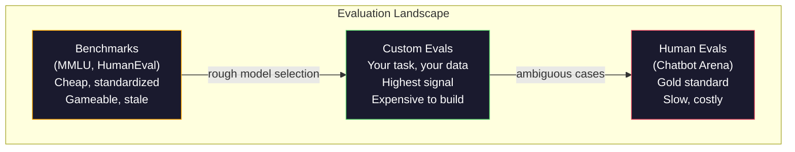
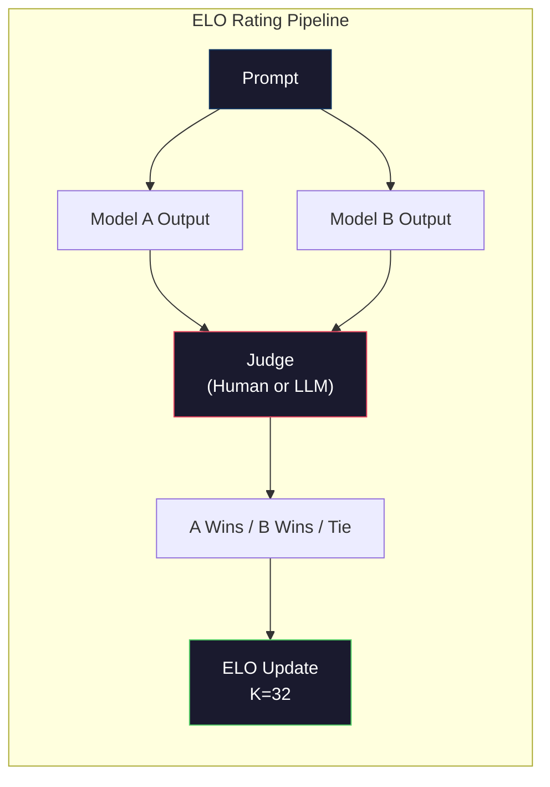

# Evaluasi: Tolok Ukur, Evaluasi, LM Harness

> Hukum Goodhart: ketika suatu ukuran menjadi target, maka ukuran tersebut tidak lagi menjadi ukuran yang baik. Setiap tolok ukur permainan lab perbatasan. Skor MMLU naik sementara model masih tidak dapat menghitung jumlah R di "strawberry". Satu-satunya evaluasi yang penting adalah evaluasi ANDA -- pada tugas ANDA, dengan data ANDA.

**Type:** Build
**Language:** Python
**Prerequisites:** Fase 10, Lesson 01-05 (LLM dari Awal)
**Waktu:** ~90 menit

## Tujuan Pembelajaran

- Membangun pemanfaatan evaluasi khusus yang menjalankan tolok ukur pilihan ganda dan terbuka terhadap model bahasa
- Jelaskan mengapa tolok ukur standar (MMLU, HumanEval) jenuh dan gagal membedakan model frontier
- Menerapkan evaluasi khusus tugas dengan metrik yang tepat: pencocokan tepat, F1, BLEU, dan penilaian LLM sebagai juri
- Rancang rangkaian evaluasi khusus yang menargetkan kasus penggunaan spesifik kamu daripada hanya mengandalkan papan peringkat publik

## Masalah

MMLU diterbitkan pada tahun 2020 dengan 15.908 pertanyaan dalam 57 mata lesson. Dalam waktu tiga tahun, model-model frontier memenuhinya. GPT-4 mendapat skor 86,4%. Claude 3 Opus mencetak 86,8%. Llama 3 405B mencetak 88,6%. Papan peringkat dikompresi menjadi rentang 3 poin di mana perbedaannya hanyalah gangguan statistik, bukan kesenjangan kemampuan yang sebenarnya.

Sementara itu, model yang sama gagal dalam tugas-tugas yang ditangani anak berusia 10 tahun tanpa berpikir panjang. Claude 3.5 Soneta, dengan skor 88,7% di MMLU, awalnya tidak dapat menghitung huruf dalam "strawberry" -- tugas yang tidak memerlukan pengetahuan dunia dan penalaran nol, hanya iterasi tingkat karakter. HumanEval menguji pembuatan code dengan 164 masalah. Model mendapat skor 90%+ sambil tetap menghasilkan code yang mogok pada kasus-kasus edge yang dapat ditangkap oleh pengembang junior mana pun.

Kesenjangan antara kinerja benchmark dan keandalan dunia nyata adalah masalah utama evaluasi LLM. Tolok ukur memberi tahu kamu bagaimana kinerja suatu model pada tolok ukur. Mereka hampir tidak memberi tahu kamu apa pun tentang bagaimana model tersebut akan bekerja pada tugas spesifik kamu, dengan data spesifik kamu, dalam mode kegagalan spesifik kamu. Jika kamu membuat bot dukungan pelanggan, MMLU tidak relevan. Jika kamu membuat asisten code, HumanEval hanya mencakup pembuatan tingkat fungsi -- ia tidak menjelaskan apa pun tentang proses debug, pemfaktoran ulang, atau penjelasan code di seluruh file.

kamu memerlukan evaluasi khusus. Bukan karena tolok ukur tidak berguna -- tolok ukur berguna untuk pemilihan model secara kasar -- namun karena evaluasi akhir harus sama persis dengan kondisi penerapan kamu.

## Konsep

### Pemandangan Evaluasi

Ada tiga kategori evaluasi, masing-masing dengan biaya dan kualitas sinyal berbeda.

**Tolok ukur** adalah rangkaian pengujian terstandar. MMLU, HumanEval, bangku SWE, MATEMATIKA, ARC, HellaSwag. kamu menjalankan model berdasarkan tolok ukur dan mendapatkan skor. Keuntungannya: setiap orang menggunakan pengujian yang sama, sehingga kamu dapat membandingkan model. Kerugiannya: model dan training data semakin mencemari tolok ukur ini. Lab melatih data yang mencakup pertanyaan tolok ukur. Skor meningkat. Kemampuan mungkin tidak.

**Eval kustom** adalah rangkaian pengujian yang kamu buat untuk kasus penggunaan spesifik kamu. kamu menentukan input, output yang diharapkan, dan fungsi penilaian. Peringkasan dokumen hukum dievaluasi berdasarkan dokumen hukum. Generator SQL akan dievaluasi pada skema database kamu. Pembuatannya mahal, tetapi ini adalah satu-satunya evaluasi yang memprediksi kinerja produksi.**Evaluasi manusia** menggunakan anotator berbayar untuk menilai output model berdasarkan kriteria seperti kegunaan, kebenaran, kelancaran, dan keamanan. Standar emas untuk tugas terbuka di mana penilaian otomatis gagal. Chatbot Arena telah mengumpulkan lebih dari 2 juta suara preferensi manusia di 100+ model. Sisi negatifnya: biaya ($0,10-$2,00 per penilaian) dan kecepatan (jam hingga hari).



### Mengapa Tolok Ukur Rusak

Ada tiga mekanisme yang menyebabkan skor benchmark tidak lagi mencerminkan kemampuan sebenarnya.

**Kontaminasi data.** Korpora training mengikis internet. Pertanyaan benchmark langsung di internet. Model melihat jawabannya selama training. Hal ini bukanlah sebuah kecurangan dalam pengertian tradisional -- laboratorium tidak dengan sengaja menyertakan data benchmark. Namun pengikisan skala web membuatnya hampir mustahil untuk dikecualikan.

**Mengajar sambil menguji.** Lab mengoptimalkan campuran training untuk kinerja tolok ukur. Jika 5% dari campuran training adalah pilihan ganda gaya MMLU, model akan mempelajari format dan distribusi jawaban. MMLU adalah pilihan ganda 4 arah. Model mempelajari bahwa distribusi jawaban kira-kira seragam di seluruh A/B/C/D, sehingga membantu bahkan ketika model tidak mengetahui jawabannya.

**Saturasi.** Ketika setiap model frontier mendapat skor 85-90% pada suatu tolok ukur, tolok ukur tersebut berhenti melakukan diskriminasi. 10-15% pertanyaan sisanya mungkin bersifat ambigu, diberi label yang salah, atau memerlukan pengetahuan domain yang tidak jelas. Meningkat dari 87% menjadi 89% pada MMLU mungkin berarti model tersebut mengingat dua pertanyaan yang tidak jelas, bukan berarti model tersebut menjadi lebih pintar.

### Perplexity: Pemeriksaan Kesehatan Cepat

Perplexity mengukur seberapa terkejutnya suatu model dengan serangkaian token. Secara formal, ini adalah kemungkinan log negatif rata-rata yang dieksponen:

```
PPL = exp(-1/N * sum(log P(token_i | context)))
```

Perplexity 10 berarti model tersebut, rata-rata, sama tidak pastinya dengan memilih secara seragam di antara 10 opsi pada setiap posisi token. Lebih rendah lebih baik. GPT-2 mendapat perplexity ~30 di WikiText-103. GPT-3 mendapat ~20. Llama 3 8B mendapat ~7.

Perplexity berguna untuk membandingkan model pada set pengujian yang sama, namun memiliki titik buta. Sebuah model dapat memiliki tingkat perplexity yang rendah karena pandai memprediksi pola-pola umum, namun buruk dalam memprediksi pola-pola yang jarang namun penting. Ia juga tidak mengatakan apa pun tentang mengikuti instruksi, penalaran, atau keakuratan faktual. Gunakan ini sebagai pemeriksaan kewarasan, bukan keputusan akhir.

### LLM-sebagai-Hakim

Gunakan model yang kuat untuk mengevaluasi output model yang lebih lemah. Idenya sederhana: mintalah GPT-4o atau Claude Sonnet untuk menilai respons pada skala 1-5 untuk kebenaran, kegunaan, dan keamanan. Biayanya sekitar $0,01 per penilaian dengan GPT-4o-mini dan ternyata berkorelasi sangat baik dengan penilaian manusia -- sekitar 80% setuju pada sebagian besar tugas.

Prompt pemberian skor lebih penting daripada model. Prompt yang tidak jelas ("Beri nilai respons ini") menghasilkan skor yang berisik. Prompt terstruktur dengan rubrik ("Skor 5 jika jawabannya benar secara faktual dan mengutip sumber, 4 jika benar tetapi tidak bersumber, 3 jika benar sebagian...") menghasilkan skor yang konsisten dan dapat direproduksi.

Mode kegagalan: model juri menunjukkan bias posisi (lebih memilih respons pertama dalam perbandingan berpasangan), bias verbositas (lebih memilih respons yang lebih lama), dan preferensi mandiri (GPT-4 menilai output GPT-4 lebih tinggi daripada output Claude yang setara). Mitigasi: mengacak urutan, menormalkan panjangnya, menggunakan juri yang berbeda dari model yang sedang dievaluasi.

### Peringkat ELO dari Perbandingan BerpasanganPendekatan Chatbot Arena. Tampilkan dua tanggapan terhadap prompt yang sama dari model yang berbeda. Manusia (atau juri LLM) memilih yang lebih baik. Dari ribuan perbandingan ini, hitung peringkat ELO untuk setiap model -- sistem yang sama yang digunakan dalam catur.

Keunggulan ELO: pemeringkatan relatif lebih dapat diandalkan dibandingkan penilaian absolut, menangani hubungan dengan baik, dan menyatu dengan perbandingan yang lebih sedikit dibandingkan menilai setiap output secara independen. Pada awal tahun 2026, peringkat Chatbot Arena menunjukkan GPT-4o, Claude 3.5 Sonnet, dan Gemini 1.5 Pro dalam distance 20 poin ELO satu sama lain di posisi teratas.



### Kerangka Evaluasi

**lm-evaluation-harness** (EleutherAI): framework evaluasi sumber terbuka standar. Mendukung 200+ tolok ukur. Jalankan model Hugging Face apa pun melawan MMLU, HellaSwag, ARC, dll. dengan satu prompt. Digunakan oleh Papan Peringkat LLM Terbuka.

**RAGAS**: kerangka evaluasi khusus untuk pipeline RAG. Mengukur kesetiaan (apakah jawaban sesuai dengan konteks yang diambil?), relevansi (apakah konteks yang diambil relevan dengan pertanyaan?), dan kebenaran jawaban.

**promptfoo**: evaluasi berbasis konfigurasi untuk rekayasa cepat. Tentukan kasus pengujian di YAML, jalankan pada beberapa model, dapatkan laporan lulus/gagal. Berguna untuk prompt pengujian regresi -- pastikan perubahan cepat tidak merusak kasus pengujian yang ada.

### Membangun Evaluasi Kustom

Satu-satunya evaluasi yang penting untuk produksi. Prosesnya:

1. **Tentukan tugasnya.** Apa sebenarnya yang harus dilakukan model? Tepatnya. "Jawab pertanyaan" terlalu kabur. "Dengan adanya email keluhan pelanggan, mengekstrak nama produk, kategori masalah, dan sentimen" adalah tugas yang dapat kamu evaluasi.

2. **Buat kasus uji.** Minimum 50 untuk evaluasi prototipe, 200+ untuk produksi. Setiap kasus uji adalah pasangan (input, ekspektasi_output). Sertakan kasus tepi: input kosong, input permusuhan, input ambigu, input dalam bahasa lain.

3. **Tentukan penilaian.** Pencocokan tepat untuk output terstruktur. BLEU/ROUGE untuk kesamaan teks. LLM-sebagai juri untuk kualitas terbuka. F1 untuk tugas ekstraksi. Gabungkan beberapa metrik dengan weight.

4. **Otomatiskan.** Setiap eval dijalankan dengan satu prompt. Tidak ada langkah manual. Simpan hasil dalam format yang memungkinkan perbandingan dari waktu ke waktu.

5. **Lacak seiring berjalannya waktu.** Skor eval tidak ada artinya jika berdiri sendiri. kamu membutuhkan garis tren. Apakah skornya meningkat setelah perubahan cepat terakhir? Apakah mengalami kemunduran setelah berpindah model? Versi eval kamu bersama dengan prompt kamu.

| Tipe Evaluasi | Biaya per penilaian | Perjanjian dengan manusia | Terbaik untuk |
|-----------|------------------|----------------------|----------|
| Pencocokan tepat | ~$0 | 100% (bila berlaku) | Output terstruktur, klasifikasi |
| BLEU/MERAH | ~$0 | ~60% | Terjemahan, ringkasan |
| LLM-sebagai-hakim | ~$0,01 | ~80% | Generasi terbuka |
| Evaluasi manusia | $0,10-$2,00 | T/A (adalah kebenaran dasar) | Tugas yang ambigu dan berisiko tinggi |

## Build

### Langkah 1: Kerangka Evaluasi Minimal

Tentukan abstraksi inti. Kasus eval memiliki input, output yang diharapkan, dan dikte metadata opsional. Pencetak gol mengambil prediksi dan referensi dan mengembalikan skor antara 0 dan 1.

```python
import json
from collections import Counter

class EvalCase:
    def __init__(self, input_text, expected, metadata=None):
        self.input_text = input_text
        self.expected = expected
        self.metadata = metadata or {}

class EvalSuite:
    def __init__(self, name, cases, scorers):
        self.name = name
        self.cases = cases
        self.scorers = scorers

    def run(self, model_fn):
        results = []
        for case in self.cases:
            prediction = model_fn(case.input_text)
            scores = {}
            for scorer_name, scorer_fn in self.scorers.items():
                scores[scorer_name] = scorer_fn(prediction, case.expected)
            results.append({
                "input": case.input_text,
                "expected": case.expected,
                "prediction": prediction,
                "scores": scores,
            })
        return results
```

### Langkah 2: Fungsi Penilaian

Buat pencocokan tepat, token F1, dan simulasi pencetak gol LLM sebagai juri.

```python
def exact_match(prediction, expected):
    return 1.0 if prediction.strip().lower() == expected.strip().lower() else 0.0

def token_f1(prediction, expected):
    pred_tokens = set(prediction.lower().split())
    exp_tokens = set(expected.lower().split())
    if not pred_tokens or not exp_tokens:
        return 0.0
    common = pred_tokens & exp_tokens
    precision = len(common) / len(pred_tokens)
    recall = len(common) / len(exp_tokens)
    if precision + recall == 0:
        return 0.0
    return 2 * (precision * recall) / (precision + recall)

def llm_judge_simulated(prediction, expected):
    pred_words = set(prediction.lower().split())
    exp_words = set(expected.lower().split())
    if not exp_words:
        return 0.0
    overlap = len(pred_words & exp_words) / len(exp_words)
    length_penalty = min(1.0, len(prediction) / max(len(expected), 1))
    return round(overlap * 0.7 + length_penalty * 0.3, 3)
```

### Langkah 3: Sistem Penilaian ELO

Terapkan perbandingan berpasangan dengan pembaruan ELO. Inilah sistem yang digunakan Chatbot Arena untuk menentukan peringkat model.

```python
class ELOTracker:
    def __init__(self, k=32, initial_rating=1500):
        self.ratings = {}
        self.k = k
        self.initial_rating = initial_rating
        self.history = []

    def _ensure_player(self, name):
        if name not in self.ratings:
            self.ratings[name] = self.initial_rating

    def expected_score(self, rating_a, rating_b):
        return 1 / (1 + 10 ** ((rating_b - rating_a) / 400))

    def record_match(self, player_a, player_b, outcome):
        self._ensure_player(player_a)
        self._ensure_player(player_b)

        ea = self.expected_score(self.ratings[player_a], self.ratings[player_b])
        eb = 1 - ea

        if outcome == "a":
            sa, sb = 1.0, 0.0
        elif outcome == "b":
            sa, sb = 0.0, 1.0
        else:
            sa, sb = 0.5, 0.5

        self.ratings[player_a] += self.k * (sa - ea)
        self.ratings[player_b] += self.k * (sb - eb)

        self.history.append({
            "a": player_a, "b": player_b,
            "outcome": outcome,
            "rating_a": round(self.ratings[player_a], 1),
            "rating_b": round(self.ratings[player_b], 1),
        })

    def leaderboard(self):
        return sorted(self.ratings.items(), key=lambda x: -x[1])
```

### Langkah 4: Perhitungan KebingunganHitung perplexity menggunakan probabilitas token. Dalam praktiknya, kamu akan mendapatkannya dari log model. Di sini kami melakukan simulasi dengan distribusi probabilitas.

```python
import numpy as np

def perplexity(log_probs):
    if not log_probs:
        return float("inf")
    avg_neg_log_prob = -np.mean(log_probs)
    return float(np.exp(avg_neg_log_prob))

def token_log_probs_simulated(text, model_quality=0.8):
    np.random.seed(hash(text) % 2**31)
    tokens = text.split()
    log_probs = []
    for i, token in enumerate(tokens):
        base_prob = model_quality
        if len(token) > 8:
            base_prob *= 0.6
        if i == 0:
            base_prob *= 0.7
        prob = np.clip(base_prob + np.random.normal(0, 0.1), 0.01, 0.99)
        log_probs.append(float(np.log(prob)))
    return log_probs
```

### Langkah 5: Hasil Agregat

Hitung statistik ringkasan seluruh proses evaluasi: rata-rata, median, tingkat kelulusan pada ambang batas, dan pengelompokan per metrik.

```python
def summarize_results(results, threshold=0.8):
    all_scores = {}
    for r in results:
        for metric, score in r["scores"].items():
            all_scores.setdefault(metric, []).append(score)

    summary = {}
    for metric, scores in all_scores.items():
        arr = np.array(scores)
        summary[metric] = {
            "mean": round(float(np.mean(arr)), 3),
            "median": round(float(np.median(arr)), 3),
            "std": round(float(np.std(arr)), 3),
            "min": round(float(np.min(arr)), 3),
            "max": round(float(np.max(arr)), 3),
            "pass_rate": round(float(np.mean(arr >= threshold)), 3),
            "n": len(scores),
        }
    return summary

def print_summary(summary, suite_name="Eval"):
    print(f"\n{'=' * 60}")
    print(f"  {suite_name} Summary")
    print(f"{'=' * 60}")
    for metric, stats in summary.items():
        print(f"\n  {metric}:")
        print(f"    Mean:      {stats['mean']:.3f}")
        print(f"    Median:    {stats['median']:.3f}")
        print(f"    Std:       {stats['std']:.3f}")
        print(f"    Range:     [{stats['min']:.3f}, {stats['max']:.3f}]")
        print(f"    Pass rate: {stats['pass_rate']:.1%} (threshold >= 0.8)")
        print(f"    N:         {stats['n']}")
```

### Langkah 6: Jalankan Alur Penuh

Hubungkan semuanya menjadi satu. Tentukan tugas, buat kasus pengujian, simulasikan dua model, jalankan eval, hitung ELO dari perbandingan berpasangan, dan cetak papan peringkat.

```python
def demo_model_good(prompt):
    responses = {
        "What is the capital of France?": "Paris",
        "What is 2 + 2?": "4",
        "Who wrote Hamlet?": "William Shakespeare",
        "What language is PyTorch written in?": "Python and C++",
        "What is the boiling point of water?": "100 degrees Celsius",
    }
    return responses.get(prompt, "I don't know")

def demo_model_bad(prompt):
    responses = {
        "What is the capital of France?": "Paris is the capital city of France",
        "What is 2 + 2?": "The answer is four",
        "Who wrote Hamlet?": "Shakespeare",
        "What language is PyTorch written in?": "Python",
        "What is the boiling point of water?": "212 Fahrenheit",
    }
    return responses.get(prompt, "Unknown")

cases = [
    EvalCase("What is the capital of France?", "Paris"),
    EvalCase("What is 2 + 2?", "4"),
    EvalCase("Who wrote Hamlet?", "William Shakespeare"),
    EvalCase("What language is PyTorch written in?", "Python and C++"),
    EvalCase("What is the boiling point of water?", "100 degrees Celsius"),
]

suite = EvalSuite(
    name="General Knowledge",
    cases=cases,
    scorers={
        "exact_match": exact_match,
        "token_f1": token_f1,
        "llm_judge": llm_judge_simulated,
    },
)

results_good = suite.run(demo_model_good)
results_bad = suite.run(demo_model_bad)

print_summary(summarize_results(results_good), "Model A (concise)")
print_summary(summarize_results(results_bad), "Model B (verbose)")
```

Model yang "baik" memberikan jawaban yang tepat. Model yang "buruk" memberikan parafrase yang panjang lebar. Pencocokan tepat akan menghukum model verbose dengan berat. Token F1 dan LLM sebagai juri lebih pemaaf. Hal ini menggambarkan mengapa pilihan metrik penting: model yang sama terlihat bagus atau jelek bergantung pada cara kamu menilainya.

### Langkah 7: Turnamen ELO

Jalankan perbandingan berpasangan antar model dalam beberapa putaran.

```python
elo = ELOTracker(k=32)

for case in cases:
    pred_a = demo_model_good(case.input_text)
    pred_b = demo_model_bad(case.input_text)

    score_a = token_f1(pred_a, case.expected)
    score_b = token_f1(pred_b, case.expected)

    if score_a > score_b:
        outcome = "a"
    elif score_b > score_a:
        outcome = "b"
    else:
        outcome = "tie"

    elo.record_match("model_a_concise", "model_b_verbose", outcome)

print("\nELO Leaderboard:")
for name, rating in elo.leaderboard():
    print(f"  {name}: {rating:.0f}")
```

### Langkah 8: Perbandingan Perplexity

Bandingkan perplexity antar "model" dengan tingkat kualitas yang berbeda.

```python
test_text = "The quick brown fox jumps over the lazy dog in the garden"

for quality, label in [(0.9, "Strong model"), (0.7, "Medium model"), (0.4, "Weak model")]:
    log_probs = token_log_probs_simulated(test_text, model_quality=quality)
    ppl = perplexity(log_probs)
    print(f"  {label} (quality={quality}): perplexity = {ppl:.2f}")
```

## Pakai

### lm-evaluasi-harness (EleutherAI)

Alat standar untuk menjalankan benchmark pada model apa pun.

```python
# pip install lm-eval
# Command line:
# lm_eval --model hf --model_args pretrained=meta-llama/Llama-3.1-8B --tasks mmlu --batch_size 8

# Python API:
# import lm_eval
# results = lm_eval.simple_evaluate(
#     model="hf",
#     model_args="pretrained=meta-llama/Llama-3.1-8B",
#     tasks=["mmlu", "hellaswag", "arc_easy"],
#     batch_size=8,
# )
# print(results["results"])
```

### promptfoo

Evaluasi berbasis konfigurasi untuk rekayasa cepat. Tentukan pengujian di YAML dan jalankan pada beberapa penyedia.

```yaml
# promptfoo.yaml
providers:
  - openai:gpt-4o-mini
  - anthropic:claude-3-haiku

prompts:
  - "Answer in one word: {{question}}"

tests:
  - vars:
      question: "What is the capital of France?"
    assert:
      - type: contains
        value: "Paris"
  - vars:
      question: "What is 2 + 2?"
    assert:
      - type: equals
        value: "4"
```

### RAGAS untuk evaluasi RAG

```python
# pip install ragas
# from ragas import evaluate
# from ragas.metrics import faithfulness, answer_relevancy, context_precision
#
# result = evaluate(
#     dataset,
#     metrics=[faithfulness, answer_relevancy, context_precision],
# )
# print(result)
```

RAGAS mengukur apa yang terlewatkan oleh evaluasi umum: apakah jawaban model didasarkan pada konteks yang diambil, bukan hanya apakah jawabannya "benar" secara abstrak.

## Kirim

Lesson ini menghasilkan `outputs/prompt-eval-designer.md` -- prompt yang dapat digunakan kembali yang merancang rangkaian evaluasi khusus untuk tugas apa pun. Berikan deskripsi tugas dan itu akan menghasilkan kasus uji, fungsi penilaian, dan rekomendasi ambang batas lulus/gagal.

Ini juga menghasilkan `outputs/skill-evaluation.md` -- kerangka keputusan untuk memilih strategi evaluasi yang tepat berdasarkan jenis tugas, anggaran, dan persyaratan latensi kamu.

## Latihan

1. Tambahkan pencetak skor "konsistensi" yang menjalankan input yang sama melalui model sebanyak 5 kali dan mengukur seberapa sering keluarannya cocok. Jawaban yang tidak konsisten pada input deterministik menunjukkan prompt yang rapuh atau pengaturan suhu tinggi.

2. Perluas pelacak ELO untuk mendukung beberapa fungsi juri (pencocokan tepat, F1, LLM sebagai juri) dan beri weight. Bandingkan bagaimana papan peringkat berubah saat kamu sangat mempertimbangkan pencocokan tepat versus F1.

3. Build rangkaian evaluasi untuk tugas tertentu: klasifikasi email ke dalam 5 kategori. Buat 100 kasus uji dengan beragam contoh termasuk kasus tepi (email yang dapat masuk dalam beberapa kategori, email kosong, email dalam bahasa lain). Ukur kinerja "model" yang berbeda (berbasis aturan, pencocokan kata kunci, simulasi LLM).

4. Menerapkan deteksi kontaminasi: dengan serangkaian pertanyaan eval dan korpus training, periksa berapa persentase pertanyaan eval (atau parafrase yang mirip) yang muncul dalam training data. Beginilah cara peneliti mengaudit validitas benchmark.

5. Buat alat "model diff". Berdasarkan hasil evaluasi dari dua versi model, soroti kasus uji spesifik mana yang mengalami peningkatan, mana yang mengalami kemunduran, dan mana yang tetap sama. Ini setara dengan perbedaan code -- penting untuk memahami apakah suatu perubahan membantu atau merugikan.

## Istilah Kunci| Istilah | Apa kata orang | Apa sebenarnya arti |
|------|----------------|----------------------|
| MMLU | "Patokan" | Pemahaman Bahasa Multitugas yang Masif -- 15.908 pertanyaan pilihan ganda dalam 57 mata lesson, jenuh di atas 88% pada tahun 2025 |
| Evaluasi Manusia | "Code evaluasi" | 164 Masalah penyelesaian fungsi Python dari OpenAI, hanya menguji pembuatan fungsi terisolasi |
| Bangku SWE | "Eval pengkodean nyata" | 2,294 masalah GitHub dari 12 repo Python, mengukur perbaikan bug menyeluruh termasuk pembuatan pengujian |
| Perplexity | "Betapa bingungnya modelnya" | exp(-avg(log P(token_i diberikan konteks))) -- lebih rendah berarti model memberikan probabilitas lebih tinggi ke token sebenarnya |
| Peringkat ELO | "Peringkat catur untuk model" | Peringkat keterampilan relatif dihitung dari catatan menang/kalah berpasangan, yang digunakan oleh Chatbot Arena untuk menentukan peringkat 100+ model |
| LLM-sebagai-hakim | "Menggunakan AI untuk menilai AI" | Model yang kuat menilai output model yang lebih lemah berdasarkan rubrik, ~80% kesepakatan dengan juri manusia pada ~$0,01/penilaian |
| Kontaminasi data | "Model melihat ujian" | Training data mencakup pertanyaan benchmark, menggelembungkan skor tanpa meningkatkan kemampuan nyata |
| Paket evaluasi | "Banyak tes" | Kumpulan versi tiga kali lipat (input, ekspektasi_output, pencetak gol) yang mengukur kemampuan tertentu |
| Tingkat kelulusan | "Berapa persentase yang benar" | Sebagian kecil kasus eval yang mendapat skor di atas ambang batas -- lebih dapat ditindaklanjuti dibandingkan skor rata-rata karena mengukur keandalan |
| Arena Bot Obrolan | "Situs web pemeringkatan model" | Platform LMSYS dengan 2 juta+ suara preferensi manusia, menghasilkan papan peringkat LLM paling tepercaya melalui peringkat ELO |

## Bacaan Lanjutan

- [Hendrycks et al., 2021 -- "Mengukur Pemahaman Bahasa Multitask Secara Masif"](https://arxiv.org/abs/2009.03300) -- makalah MMLU, masih menjadi tolok ukur LLM yang paling banyak dikutip meskipun sudah jenuh
- [Chen et al., 2021 -- "Evaluating Large Language Models Trained on Code"](https://arxiv.org/abs/2107.03374) -- makalah HumanEval dari OpenAI, menetapkan metodologi evaluasi pembuatan code
- [Zheng et al., 2023 -- "Judging LLM-as-a-Judge"](https://arxiv.org/abs/2306.05685) -- analisis sistematis penggunaan LLM untuk mengevaluasi LLM, termasuk temuan bias posisi dan bias verbositas
- [LMSYS Chatbot Arena](https://chat.lmsys.org/) -- platform perbandingan model crowdsourced dengan lebih dari 2 juta suara, peringkat LLM dunia nyata yang paling tepercaya
