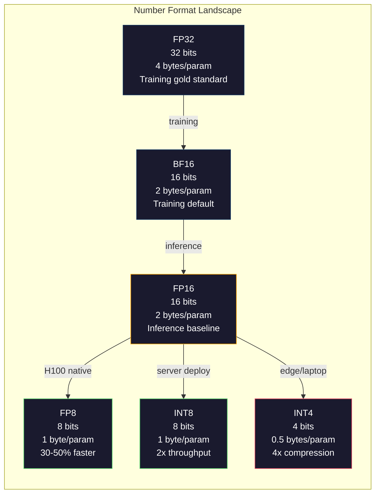
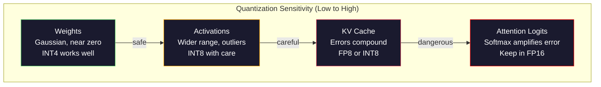
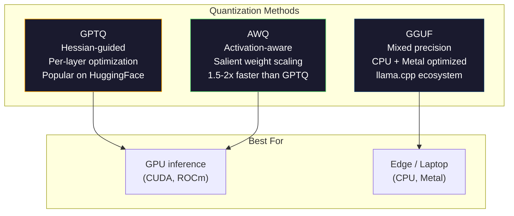

# Kuantisasi: Membuat Model Sesuai

> Model 70B di FP16 membutuhkan 140GB. Dua A100 hanya untuk weight. Kuantisasi ke FP8: satu GPU 80GB. INT4: MacBook.

**Type:** Build
**Language:** Python (dengan numpy)
**Prerequisites:** Fase 10, Lesson 01-10 (LLM dari Awal)
**Waktu:** ~120 menit

## Tujuan Pembelajaran

- Menerapkan kuantisasi simetris dan asimetris dari FP16 ke INT8 dan INT4, termasuk penskalaan per-tensor dan per-pipeline
- Hitung penghematan memori dari kuantisasi dan tentukan presisi mana yang sesuai dengan VRAM GPU tertentu
- Jelaskan perbedaan antara kuantisasi pasca training (PTQ) dan training sadar kuantisasi (QAT)
- Terapkan GPTQ atau AWQ untuk mengkuantisasi model nyata dan mengukur tradeoff akurasi-memori pada benchmark

## Masalah

Llama 3 70B memiliki 70 miliar parameter. Setiap parameter adalah angka floating point 16-bit. Itu berarti 140 miliar byte. 140GB. Sebuah A100 tunggal memiliki VRAM 80GB. kamu bahkan tidak dapat memuat weight, apalagi menjalankan inference, pada satu GPU. kamu memerlukan dua A100 dengan harga masing-masing $2/jam hanya untuk melayani satu model.

Namun 16 bit per parameter adalah pemborosan. Sebagian besar weight dalam cluster neural network mendekati nol. Rentang dinamis penuh FP16 (dari 0,000000059 hingga 65.504) hampir seluruhnya tidak digunakan. Jika kamu mengukur distribusi weight sebenarnya di Llama 3 70B, 95% di antaranya berada di antara -0,1 dan +0,1. kamu membakar 16 bit untuk mewakili nilai yang dapat ditampung dalam 4.

Kuantisasi menggantikan angka berpresisi tinggi dengan angka berpresisi lebih rendah. FP16 ke FP8 memotong memori menjadi dua. FP16 hingga INT4 memotongnya menjadi seperempat. Model 140GB itu menjadi 35GB. Ini cocok pada satu GPU konsumen. Dorong ke kuantisasi 2-bit (agresif, lossy, tetapi dapat digunakan untuk beberapa tugas) dan model yang sama berjalan pada laptop 16GB.

Biayanya adalah akurasi. Setiap bit yang kamu hapus menghancurkan informasi. Pertanyaannya adalah seberapa besar akurasi kamu hilang dan di mana. Model INT4 yang terkuantisasi dengan baik mempertahankan 95-99% kualitas aslinya pada sebagian besar tolok ukur. Kuantisasi yang naif terhadap INT4 dapat menghancurkan model sepenuhnya. Perbedaannya adalah teknik.

Kuantisasi komunitas Llama 3 hingga INT4 dengan GPTQ menunjukkan sekitar 1-2 poin perplexity yang hilang di WikiText. Mistral merilis pos pemeriksaan FP8 Mixtral 8x22B tanpa kehilangan kualitas terukur di MMLU. Format GGUF mendukung llama.cpp, menjalankan model 70B di MacBook dengan chip seri M. Kuantisasi bukanlah peretasan. Ini adalah jalur penerapan standar untuk setiap model yang lebih besar dari 7B.

## Konsep

### Format Angka: Fungsi Setiap Bit

Setiap bilangan floating-point memiliki tiga bagian: tanda, eksponen, dan mantissa (disebut juga signifikansi). Tandanya sedikit. Eksponen menentukan rentang (seberapa besar atau kecil suatu bilangan). Mantissa menentukan presisi (berapa banyak tempat desimal yang kamu dapatkan).

```
FP32:  [1 sign] [8 exponent] [23 mantissa]  = 32 bits
FP16:  [1 sign] [5 exponent] [10 mantissa]  = 16 bits
BF16:  [1 sign] [8 exponent] [7  mantissa]  = 16 bits
FP8:   [1 sign] [4 exponent] [3  mantissa]  = 8  bits (E4M3)
FP8:   [1 sign] [5 exponent] [2  mantissa]  = 8  bits (E5M2)
INT8:  [1 sign] [7 value]                   = 8  bits (uniform steps)
INT4:  [1 sign] [3 value]                   = 4  bits (16 levels total)
```

**FP32** presisi penuh. 23 bit mantissa memberi kamu presisi sekitar 7 digit desimal. Kisaran: kira-kira 1,2 x 10^-38 hingga 3,4 x 10^38. Latihan biasanya dilakukan secara eksklusif di FP32. Itu masih berlaku untuk akumulasi (menjalankan jumlah selama perkalian matrix).

**FP16** membagi dua bitnya. 10 bit mantissa menghasilkan sekitar 3,3 angka desimal. Eksponen menyusut menjadi 5 bit, mengurangi rentang secara dramatis (nilai maksimal ~65.504). Ini bagus untuk weight (yang clusternya mendekati nol) tetapi berbahaya untuk activation dan gradient yang dapat melonjak selama training. Training FP16 memerlukan penskalaan loss untuk mencegah underflow.**BF16** (Brain Float 16) mempertahankan eksponen 8-bit dari FP32 tetapi mengecilkan mantissa menjadi 7 bit. Kisaran yang sama dengan FP32, kurang presisi dibandingkan FP16. Google merancangnya khusus untuk pembelajaran mendalam. Intuisi: jangkauan lebih penting daripada presisi untuk neural network. Gradient 10^-20 yang mengalir ke nol di FP16 bertahan di BF16. Weight 0,07342 yang dibulatkan menjadi 0,0734 di BF16 sudah cukup mendekati. Setiap latihan modern menggunakan campuran BF16 atau BF16/FP32.

**FP8** hadir dalam dua rasa. E4M3 (4 eksponen, 3 mantissa) digunakan untuk weight dan activation selama inference. E5M2 (5 eksponen, 2 mantissa) digunakan untuk gradient selama training di mana jangkauan lebih penting daripada presisi. Inference FP8 pada GPU H100 mencapai kecepatan 30-50% dibandingkan FP16 dengan penurunan kualitas yang dapat diabaikan.

**INT8** adalah format bilangan bulat. Tidak ada eksponen, tidak ada mantissa. Hanya 256 nilai dengan distance yang sama dari -128 hingga 127. kamu memerlukan faktor skala untuk memetakan weight floating-point ke dalam rentang ini. Keuntungannya: aritmatika bilangan bulat lebih cepat dan hemat daya dibandingkan floating-point. Perkalian matrix INT8 pada A100 berjalan pada 624 TOPS versus 312 TFLOPS untuk FP16.

**INT4** mendorong lebih jauh. Hanya 16 nilai yang mungkin. Faktor skala melakukan pekerjaan berat. Kualitas sepenuhnya bergantung pada cara kamu memilih timbangan dan weight yang kamu ukur. Metode INT4 yang canggih (GPTQ, AWQ) mempertahankan 95%+ kualitas model asli.



### Cara Kerja Kuantisasi

Operasi intinya sederhana. Ambil tensor nilai floating-point, temukan faktor skala, kalikan, bulatkan ke bilangan bulat terdekat, dan simpan bilangan bulat ditambah faktor skala.

**Kuantisasi:**
```
scale = max(abs(tensor)) / max_int_value
quantized = round(tensor / scale)
```

**Dekuantisasi:**
```
reconstructed = quantized * scale
```

Untuk INT8 dengan rentang simetris (-127 hingga 127):
```
scale = max(abs(tensor)) / 127
quantized = clamp(round(tensor / scale), -128, 127)
```

Kesalahannya adalah kesalahan pembulatan. Setiap nilai dapat dikurangi paling banyak `scale / 2`. Kesalahan total pada suatu layer bergantung pada berapa banyak weight yang kamu miliki dan seberapa sensitif model terhadap gangguan pada weight tersebut.

**Kuantisasi per-tensor vs per-pipeline.** Per-tensor menggunakan satu faktor skala untuk seluruh matrix weight. Sederhana namun lossy: jika satu kolom memiliki nilai besar dan kolom lainnya memiliki nilai kecil, nilai kecil akan kehilangan sebagian besar presisinya. Per pipeline menggunakan satu faktor skala per pipeline output (per baris atau kolom matrix weight). Lebih banyak overhead (kamu menyimpan faktor skala N, bukan 1) tetapi kualitasnya jauh lebih baik. Setiap metode kuantisasi produksi menggunakan granularitas per pipeline atau yang lebih halus.

**Kuantisasi asimetris** menambahkan offset titik nol: `quantized = round(tensor / scale) + zero_point`. Ini menangani distribusi yang tidak terpusat pada nol. Activation ReLU, misalnya, selalu non-negatif. Kuantisasi simetris membuang setengah rentang bilangan bulat pada nilai negatif yang tidak pernah muncul. Kuantisasi asimetris memetakan rentang aktual [min, maks] ke rentang bilangan bulat penuh.

### Hirarki Sensitivitas

Tidak semua hal dalam model mentoleransi kuantisasi secara setara. Ada hierarki yang jelas.

**Weight (paling kuat).** Weight model berubah secara perlahan selama training dan mengikuti distribusi Gaussian yang berpusat mendekati nol. Mereka mengukur dengan baik. Weight INT8 dengan skala per pipeline menghasilkan hasil yang hampir tanpa loss. INT4 memerlukan metode yang lebih canggih tetapi berhasil.**Activation (sensitivitas sedang).** Activation adalah nilai perantara yang mengalir melalui jaringan selama inference. Mereka memiliki rentang dinamis yang lebih luas daripada weight dan mengandung outlier. Satu attention head mungkin menghasilkan nilai activation 100x lebih besar dari rata-rata. Pencilan ini sangat penting untuk kualitas model. Mengukurnya secara naif menghancurkan informasi. Solusi: pertahankan pipeline outlier dalam presisi yang lebih tinggi (LLM.int8()), gunakan skala activation per token atau per pipeline.

**Cache KV (sensitivitas tinggi).** Cache nilai kunci menyimpan status attention untuk semua token sebelumnya. Dalam konteks yang panjang, cache KV mendominasi memori. Untuk model 70B dalam konteks 32K, cache KV saja adalah 40 GB di FP16. Mengkuantisasi cache KV ke FP8 atau INT8 menghemat memori yang sangat besar tetapi kesalahan apa pun akan terjadi di semua perhitungan attention di masa mendatang. Dampak kualitas berskala dengan panjang urutan.

**Logit attention (paling sensitif).** Softmax dalam attention sangat sensitif terhadap perubahan kecil pada masukannya. Kesalahan kuantisasi sebesar 0,01 dalam logit pra-softmax dapat menggeser distribusi attention secara berarti. Kebanyakan skema kuantisasi menjaga penghitungan attention dalam presisi yang lebih tinggi (FP16 atau BF16) bahkan ketika semuanya dikuantisasi.



### PTQ vs QAT

**Kuantisasi Pasca Training (PTQ)** mengkuantisasi model yang sudah dilatih. Tidak ada training ulang. kamu mengambil weight FP16, menghitung faktor skala, membulatkan, dan menerapkan. Cepat (menit hingga berjam-jam) dan murah. Bekerja dengan baik untuk INT8 dan FP8. Untuk INT4, PTQ yang naif sering kali gagal total karena kesalahan pembulatan menumpuk. Metode PTQ tingkat lanjut (GPTQ, AWQ) menggunakan data kalibrasi untuk meminimalkan kesalahan kuantisasi.

**Training Sadar Kuantisasi (QAT)** memasukkan operasi kuantisasi palsu ke dalam forward pass selama training. Model belajar menempatkan bobotnya di tempat yang kesalahan pembulatannya kecil. Gradient mengalir melalui kuantisasi palsu menggunakan straight-through estimator (STE): anggaplah operasi pembulatan memiliki gradient 1. QAT menghasilkan model INT4 dan INT2 yang lebih baik daripada PTQ tetapi memerlukan training penuh. Google menggunakan QAT untuk penyajian Gemini yang efisien. Meta menggunakan QAT untuk beberapa target penerapan Llama.

| Aspek | PTQ | QAT |
|--------|-----|-----|
| Biaya | Menit ke jam | Latihan penuh dijalankan |
| Kualitas di INT8 | Luar biasa (loss <0,1%) | Luar biasa |
| Kualitas di INT4 | Baik dengan GPTQ/AWQ (loss 1-3%) | Lebih baik (<1% loss) |
| Kualitas di INT2 | Buruk | Dapat digunakan untuk beberapa tugas |
| Data kalibrasi | 128-1024 contoh | Dataset training lengkap |
| Kapan menggunakan | Penerapan, iterasi | Kualitas maksimum pada bit-width rendah |

### GPTQ, AWQ, GGUF

**GPTQ (Kuantisasi GPT)** adalah metode PTQ sekali pakai. Ini mengkuantisasi weight satu layer pada satu waktu, menggunakan dataset kalibrasi kecil (umumnya 128 contoh) untuk mengukur Hessian (informasi urutan kedua tentang seberapa sensitif output terhadap setiap weight). Weight yang menurut Hessian penting diukur dengan lebih hati-hati. GPTQ adalah metode pertama yang membuat kuantisasi INT4 praktis untuk LLM. TheBloke on Hugging Face mempopulerkan GPTQ dengan merilis ratusan model versi terkuantisasi.**AWQ (Activation-Aware Weight Quantization)** mengamati bahwa sebagian kecil weight (sekitar 1%) sangatlah penting karena dikalikan dengan nilai activation yang besar. AWQ mengidentifikasi weight yang menonjol ini menggunakan data kalibrasi dan menaikkan skalanya sebelum kuantisasi (lalu menurunkan skala activation terkait). Hal ini menjaga weight penting dalam kisaran di mana kuantisasi INT4 akurat. AWQ biasanya menyamai atau sedikit mengungguli kualitas GPTQ sekaligus 1,5-2x lebih cepat untuk diterapkan.

**GGUF (GPT-Generated Unified Format)** adalah format file yang digunakan oleh llama.cpp dan ekosistemnya. Ini mendukung kuantisasi campuran: layer yang berbeda mendapatkan lebar bit yang berbeda. Layer pertama dan terakhir (embedding dan kepala output) biasanya dijaga dengan presisi lebih tinggi. Layer tengah mendapatkan INT4 atau INT3. File GGUF bersifat mandiri: weight, tokenizer, metadata, semuanya dalam satu file. Format ini dirancang untuk inference CPU dan Apple Silicon, di mana memuat seluruh model ke dalam memori dan menjalankan perkalian matrix pada CPU atau GPU Metal adalah jalur standarnya. Q4_K_M adalah varian kuantisasi GGUF paling populer, yang menyeimbangkan kualitas dan ukuran.



### Pengukuran Kualitas

Bagaimana kamu tahu jika model terkuantisasi kamu masih bagus?

**Perplexity.** Metrik yang paling umum. Lebih rendah lebih baik. Perplexity komputasi pada dataset yang disimpan (WikiText-2 adalah standarnya) untuk model asli dan model terkuantisasi. Delta memberi tahu kamu berapa banyak informasi yang dihancurkan oleh kuantisasi. Aturan praktisnya: delta <0,5 sangat baik, 0,5-1,0 baik, 1,0-2,0 dapat diterima untuk sebagian besar tugas, > 2,0 berarti ada yang tidak beres.

**Tolok ukur khusus tugas.** Jalankan model terkuantisasi di MMLU, HumanEval, GSM8K, atau rangkaian eval khusus kamu. Bandingkan dengan aslinya. Kuantisasi mempengaruhi kemampuan yang berbeda secara tidak merata. Tugas matematika dan code lebih sensitif terhadap hilangnya presisi dibandingkan pengetahuan umum.

**Perbandingan output.** Hasilkan respons dari kedua model pada prompt yang sama dan bandingkan. LLM-sebagai-hakim (Lesson 10) bekerja dengan baik di sini. Hitung tingkat kemenangan: berapa fraksi prompt yang cocok atau mengalahkan model terkuantisasi dengan model aslinya?

**Latensi dan throughput.** Ada kuantisasi untuk membuat model lebih cepat dan lebih murah. Ukur token per detik, waktu hingga token pertama, dan penggunaan memori. Model terkuantisasi yang lebih lambat dari model aslinya lebih buruk daripada tidak berguna.

| Model | Format | Ukuran | Perplexity (WikiText-2) | MMLU | Token/dtk (A100) |
|-------|--------|------|------------------------|------|-------------------|
| Lama 3 70B | FP16 | 140GB | 3.12 | 79,5% | 38 |
| Lama 3 70B | FP8 | 70GB | 3.14 | 79,3% | 55 |
| Lama 3 70B | GPTQ INT4 | 35GB | 4.32 | 77,8% | 72 |
| Lama 3 70B | AWQ INT4 | 35GB | 4.18 | 78,1% | 75 |
| Lama 3 70B | GGUF Q4_K_M | 40GB | 4.25 | 77,9% | 28 (CPU) |

Polanya: FP8 hampir gratis. INT4 berharga 1-2 poin MMLU tetapi menggandakan throughput dan seperempat memori. Pengorbanannya sepadan untuk hampir setiap penerapan.

### Bilangan Nyata

FP16 hingga FP8 pada H100: kecepatan inference 30-50%, kehilangan kualitas <0,1%. Ini adalah kuantisasi yang mudah. Setiap penerapan H100 harus menggunakannya.

FP16 hingga INT8 (LLM.int8()): pengurangan memori 2x, kehilangan kualitas <0,5%. Pendekatan presisi campuran mempertahankan feature-feature outlier di FP16 sambil mengkuantisasi semuanya ke INT8.

FP16 hingga INT4 (GPTQ/AWQ): pengurangan memori 4x, kehilangan kualitas 1-3% tergantung pada model dan metode. Mengaktifkan model 70B pada satu GPU 48 GB.FP16 hingga INT4 (GGUF Q4_K_M): pengurangan memori 3,5x, penurunan kualitas 1-2%. Dioptimalkan untuk inference CPU. Model 70B di Q4_K_M berukuran sekitar 40 GB dan berjalan pada 10-15 token/detik pada M3 Max dengan 64 GB.

FP16 hingga INT2: pengurangan memori 8x, penurunan kualitas 5-15%. Hanya layak untuk tugas-tugas sempit tertentu di mana kamu dapat mentolerir degradasi. Perbatasan penelitian, belum siap produksi untuk penggunaan umum.

## Build

### Langkah 1: Representasi Format Angka

Build representasi tingkat bit dari setiap format untuk melihat secara pasti fungsi tanda, eksponen, dan mantissa.

```python
import numpy as np


def float_to_fp32_bits(value):
    bits = np.float32(value).view(np.uint32)
    sign = (bits >> 31) & 1
    exponent = (bits >> 23) & 0xFF
    mantissa = bits & 0x7FFFFF
    return {"sign": int(sign), "exponent": int(exponent), "mantissa": int(mantissa),
            "exponent_bits": format(int(exponent), '08b'),
            "mantissa_bits": format(int(mantissa), '023b'),
            "value": float(value),
            "actual_exponent": int(exponent) - 127}


def float_to_fp16_bits(value):
    fp16 = np.float16(value)
    bits = fp16.view(np.uint16)
    sign = (bits >> 15) & 1
    exponent = (bits >> 10) & 0x1F
    mantissa = bits & 0x3FF
    return {"sign": int(sign), "exponent": int(exponent), "mantissa": int(mantissa),
            "exponent_bits": format(int(exponent), '05b'),
            "mantissa_bits": format(int(mantissa), '010b'),
            "value": float(fp16),
            "actual_exponent": int(exponent) - 15}


def float_to_bf16_bits(value):
    fp32_bits = np.float32(value).view(np.uint32)
    bf16_bits = (fp32_bits >> 16).astype(np.uint16)
    sign = (bf16_bits >> 15) & 1
    exponent = (bf16_bits >> 7) & 0xFF
    mantissa = bf16_bits & 0x7F
    reconstructed = np.uint32(bf16_bits.astype(np.uint32) << 16).view(np.float32)
    return {"sign": int(sign), "exponent": int(exponent), "mantissa": int(mantissa),
            "exponent_bits": format(int(exponent), '08b'),
            "mantissa_bits": format(int(mantissa), '07b'),
            "value": float(reconstructed),
            "actual_exponent": int(exponent) - 127}


def simulate_fp8_e4m3(value):
    sign = 1 if value < 0 else 0
    abs_val = abs(value)
    max_val = 448.0
    abs_val = min(abs_val, max_val)
    if abs_val == 0:
        return {"sign": sign, "exponent": 0, "mantissa": 0, "value": 0.0,
                "exponent_bits": "0000", "mantissa_bits": "000"}
    exp = int(np.floor(np.log2(abs_val)))
    exp = max(-6, min(8, exp))
    mantissa_val = abs_val / (2.0 ** exp) - 1.0
    mantissa_quant = round(mantissa_val * 8) / 8
    mantissa_quant = max(0, min(0.875, mantissa_quant))
    reconstructed = (1.0 + mantissa_quant) * (2.0 ** exp)
    if sign:
        reconstructed = -reconstructed
    mantissa_int = int(round(mantissa_quant * 8))
    return {"sign": sign, "exponent": exp + 7, "mantissa": mantissa_int,
            "exponent_bits": format(exp + 7, '04b'),
            "mantissa_bits": format(mantissa_int, '03b'),
            "value": float(reconstructed),
            "actual_exponent": exp}


def display_format_comparison(value):
    fp32 = float_to_fp32_bits(value)
    fp16 = float_to_fp16_bits(value)
    bf16 = float_to_bf16_bits(value)
    fp8 = simulate_fp8_e4m3(value)

    print(f"\n  Value: {value}")
    print(f"  {'Format':<8} {'Stored Value':>14} {'Error':>12} {'Sign':>5} {'Exp Bits':>10} {'Man Bits':>25}")
    print(f"  {'-'*76}")
    print(f"  {'FP32':<8} {fp32['value']:>14.6f} {abs(fp32['value'] - value):>12.8f} {fp32['sign']:>5} {fp32['exponent_bits']:>10} {fp32['mantissa_bits']:>25}")
    print(f"  {'FP16':<8} {fp16['value']:>14.6f} {abs(fp16['value'] - value):>12.8f} {fp16['sign']:>5} {fp16['exponent_bits']:>10} {fp16['mantissa_bits']:>25}")
    print(f"  {'BF16':<8} {bf16['value']:>14.6f} {abs(bf16['value'] - value):>12.8f} {bf16['sign']:>5} {bf16['exponent_bits']:>10} {bf16['mantissa_bits']:>25}")
    print(f"  {'FP8e4m3':<8} {fp8['value']:>14.6f} {abs(fp8['value'] - value):>12.8f} {fp8['sign']:>5} {fp8['exponent_bits']:>10} {fp8['mantissa_bits']:>25}")
```

### Langkah 2: Kuantisasi Simetris (Per-Tensor dan Per-Pipeline)

Operasi kuantisasi mendasar. Per-tensor menggunakan satu skala untuk keseluruhan matrix. Per pipeline menggunakan satu skala per baris atau kolom.

```python
def quantize_symmetric(tensor, num_bits=8):
    qmin = -(2 ** (num_bits - 1))
    qmax = 2 ** (num_bits - 1) - 1
    abs_max = np.max(np.abs(tensor))
    if abs_max == 0:
        return np.zeros_like(tensor, dtype=np.int32), 1.0
    scale = abs_max / qmax
    quantized = np.clip(np.round(tensor / scale), qmin, qmax).astype(np.int32)
    return quantized, float(scale)


def dequantize_symmetric(quantized, scale):
    return quantized.astype(np.float64) * scale


def quantize_per_channel(tensor, num_bits=8, axis=0):
    qmin = -(2 ** (num_bits - 1))
    qmax = 2 ** (num_bits - 1) - 1

    if axis == 0:
        abs_max = np.max(np.abs(tensor), axis=1, keepdims=True)
    else:
        abs_max = np.max(np.abs(tensor), axis=0, keepdims=True)

    abs_max = np.where(abs_max == 0, 1.0, abs_max)
    scales = abs_max / qmax
    quantized = np.clip(np.round(tensor / scales), qmin, qmax).astype(np.int32)
    return quantized, scales.squeeze()


def dequantize_per_channel(quantized, scales, axis=0):
    if axis == 0:
        return quantized.astype(np.float64) * scales.reshape(-1, 1)
    else:
        return quantized.astype(np.float64) * scales.reshape(1, -1)


def quantize_asymmetric(tensor, num_bits=8):
    qmin = 0
    qmax = 2 ** num_bits - 1
    t_min = np.min(tensor)
    t_max = np.max(tensor)
    if t_max == t_min:
        return np.zeros_like(tensor, dtype=np.int32), 1.0, 0
    scale = (t_max - t_min) / (qmax - qmin)
    zero_point = int(np.round(qmin - t_min / scale))
    zero_point = max(qmin, min(qmax, zero_point))
    quantized = np.clip(np.round(tensor / scale + zero_point), qmin, qmax).astype(np.int32)
    return quantized, float(scale), int(zero_point)


def dequantize_asymmetric(quantized, scale, zero_point):
    return (quantized.astype(np.float64) - zero_point) * scale
```

### Langkah 3: Pengukuran Kualitas

Ukur seberapa banyak informasi yang dihancurkan oleh kuantisasi. Kesalahan kuadrat rata-rata, rasio signal-to-noise, dan kesamaan kosinus antara tensor asli dan yang direkonstruksi.

```python
def quantization_error(original, reconstructed):
    diff = original - reconstructed
    mse = float(np.mean(diff ** 2))
    rmse = float(np.sqrt(mse))
    max_error = float(np.max(np.abs(diff)))
    signal_power = float(np.mean(original ** 2))
    snr_db = 10 * np.log10(signal_power / max(mse, 1e-20))

    orig_flat = original.flatten()
    recon_flat = reconstructed.flatten()
    norm_orig = np.linalg.norm(orig_flat)
    norm_recon = np.linalg.norm(recon_flat)
    if norm_orig == 0 or norm_recon == 0:
        cosine_sim = 0.0
    else:
        cosine_sim = float(np.dot(orig_flat, recon_flat) / (norm_orig * norm_recon))

    return {"mse": mse, "rmse": rmse, "max_error": max_error,
            "snr_db": float(snr_db), "cosine_similarity": cosine_sim}


def compare_quantization_methods(tensor, num_bits=8):
    q_pt, s_pt = quantize_symmetric(tensor, num_bits)
    recon_pt = dequantize_symmetric(q_pt, s_pt)
    err_pt = quantization_error(tensor, recon_pt)

    q_pc, s_pc = quantize_per_channel(tensor, num_bits, axis=0)
    recon_pc = dequantize_per_channel(q_pc, s_pc, axis=0)
    err_pc = quantization_error(tensor, recon_pc)

    q_asym, s_asym, zp = quantize_asymmetric(tensor, num_bits)
    recon_asym = dequantize_asymmetric(q_asym, s_asym, zp)
    err_asym = quantization_error(tensor, recon_asym)

    print(f"\n  Quantization Comparison ({num_bits}-bit, tensor shape {tensor.shape}):")
    print(f"  {'Method':<20} {'MSE':>12} {'SNR (dB)':>10} {'Cosine Sim':>12} {'Max Error':>12}")
    print(f"  {'-'*68}")
    print(f"  {'Per-tensor sym':<20} {err_pt['mse']:>12.8f} {err_pt['snr_db']:>10.2f} {err_pt['cosine_similarity']:>12.8f} {err_pt['max_error']:>12.8f}")
    print(f"  {'Per-channel sym':<20} {err_pc['mse']:>12.8f} {err_pc['snr_db']:>10.2f} {err_pc['cosine_similarity']:>12.8f} {err_pc['max_error']:>12.8f}")
    print(f"  {'Asymmetric':<20} {err_asym['mse']:>12.8f} {err_asym['snr_db']:>10.2f} {err_asym['cosine_similarity']:>12.8f} {err_asym['max_error']:>12.8f}")

    return {"per_tensor": err_pt, "per_channel": err_pc, "asymmetric": err_asym}
```

### Langkah 4: Sapuan Lebar Bit

Hitung tensor yang sama pada lebar bit yang berbeda (2, 3, 4, 8, 16) dan ukur kualitas di setiap level. Ini menunjukkan dengan tepat di mana letak jurang kualitasnya.

```python
def bit_width_sweep(tensor):
    print(f"\n  Bit-Width Sweep (tensor shape {tensor.shape}):")
    print(f"  {'Bits':>6} {'Levels':>8} {'MSE':>14} {'SNR (dB)':>10} {'Cosine Sim':>12} {'Compression':>12}")
    print(f"  {'-'*64}")

    results = []
    for bits in [2, 3, 4, 8, 16]:
        q, s = quantize_per_channel(tensor, bits, axis=0)
        recon = dequantize_per_channel(q, s, axis=0)
        err = quantization_error(tensor, recon)
        levels = 2 ** bits
        compression = 32.0 / bits

        print(f"  {bits:>6} {levels:>8} {err['mse']:>14.8f} {err['snr_db']:>10.2f} {err['cosine_similarity']:>12.8f} {compression:>11.1f}x")
        results.append({"bits": bits, "levels": levels, "error": err, "compression": compression})

    return results
```

### Langkah 5: Eksperimen Sensitivitas

Simulasikan kuantisasi berbagai bagian Transformer dan ukur komponen mana yang paling sensitif. Ini menunjukkan hierarki sensitivitas: weight < activation < cache KV < attention.

```python
def simulate_transformer_layer(input_data, weights, kv_scale=1.0):
    hidden = input_data @ weights["qkv"]
    seq_len = hidden.shape[1]
    d_model = weights["qkv"].shape[1] // 3
    q, k, v = hidden[:, :, :d_model], hidden[:, :, d_model:2*d_model], hidden[:, :, 2*d_model:]

    attn_scores = (q @ k.transpose(0, 2, 1)) / np.sqrt(d_model) * kv_scale
    attn_max = np.max(attn_scores, axis=-1, keepdims=True)
    attn_exp = np.exp(attn_scores - attn_max)
    attn_weights = attn_exp / np.sum(attn_exp, axis=-1, keepdims=True)

    attn_output = attn_weights @ v
    output = attn_output @ weights["out"]
    return output, {"q": q, "k": k, "v": v, "attn_scores": attn_scores,
                    "attn_weights": attn_weights, "attn_output": attn_output}


def sensitivity_experiment(batch_size=2, seq_len=16, d_model=64, num_bits=8):
    np.random.seed(42)
    input_data = np.random.randn(batch_size, seq_len, d_model) * 0.1

    weights = {
        "qkv": np.random.randn(d_model, 3 * d_model) * (2.0 / d_model) ** 0.5,
        "out": np.random.randn(d_model, d_model) * (2.0 / d_model) ** 0.5,
    }

    baseline_output, baseline_internals = simulate_transformer_layer(input_data, weights)

    experiments = {}

    q_qkv, s_qkv = quantize_per_channel(weights["qkv"], num_bits, axis=0)
    q_out, s_out = quantize_per_channel(weights["out"], num_bits, axis=0)
    quantized_weights = {
        "qkv": dequantize_per_channel(q_qkv, s_qkv, axis=0),
        "out": dequantize_per_channel(q_out, s_out, axis=0),
    }
    weight_quant_output, _ = simulate_transformer_layer(input_data, quantized_weights)
    experiments["Weights only"] = quantization_error(baseline_output, weight_quant_output)

    _, fresh_internals = simulate_transformer_layer(input_data, weights)
    q_act, s_act = quantize_per_channel(
        fresh_internals["attn_output"].reshape(-1, d_model), num_bits, axis=0
    )
    quant_attn_out = dequantize_per_channel(q_act, s_act, axis=0).reshape(batch_size, seq_len, d_model)
    act_quant_output = quant_attn_out @ weights["out"]
    experiments["Activations only"] = quantization_error(baseline_output, act_quant_output)

    q_k, s_k = quantize_per_channel(fresh_internals["k"].reshape(-1, d_model), num_bits, axis=0)
    q_v, s_v = quantize_per_channel(fresh_internals["v"].reshape(-1, d_model), num_bits, axis=0)
    quant_k = dequantize_per_channel(q_k, s_k, axis=0).reshape(batch_size, seq_len, d_model)
    quant_v = dequantize_per_channel(q_v, s_v, axis=0).reshape(batch_size, seq_len, d_model)
    attn_scores_kv = (fresh_internals["q"] @ quant_k.transpose(0, 2, 1)) / np.sqrt(d_model)
    attn_max_kv = np.max(attn_scores_kv, axis=-1, keepdims=True)
    attn_exp_kv = np.exp(attn_scores_kv - attn_max_kv)
    attn_weights_kv = attn_exp_kv / np.sum(attn_exp_kv, axis=-1, keepdims=True)
    kv_quant_output = (attn_weights_kv @ quant_v) @ weights["out"]
    experiments["KV cache only"] = quantization_error(baseline_output, kv_quant_output)

    noise_scale = np.std(fresh_internals["attn_scores"]) * 0.05
    noisy_scores = fresh_internals["attn_scores"] + np.random.randn(*fresh_internals["attn_scores"].shape) * noise_scale
    noisy_max = np.max(noisy_scores, axis=-1, keepdims=True)
    noisy_exp = np.exp(noisy_scores - noisy_max)
    noisy_weights = noisy_exp / np.sum(noisy_exp, axis=-1, keepdims=True)
    attn_quant_output = (noisy_weights @ fresh_internals["v"]) @ weights["out"]
    experiments["Attention logits (5% noise)"] = quantization_error(baseline_output, attn_quant_output)

    print(f"\n  Sensitivity Experiment ({num_bits}-bit quantization):")
    print(f"  {'Component':<30} {'MSE':>14} {'SNR (dB)':>10} {'Cosine Sim':>12}")
    print(f"  {'-'*68}")
    for name, err in sorted(experiments.items(), key=lambda x: x[1]["mse"]):
        print(f"  {name:<30} {err['mse']:>14.8f} {err['snr_db']:>10.2f} {err['cosine_similarity']:>12.8f}")

    return experiments
```

### Langkah 6: Simulasi GPTQ

GPTQ mengkuantisasi satu kolom dalam satu waktu, menggunakan Hessian untuk memutuskan bagaimana mendistribusikan kesalahan pembulatan. Ini adalah versi sederhana yang menangkap gagasan inti: gunakan data kalibrasi untuk mengukur tingkat kepentingan weight, lalu mengkuantifikasi weight yang paling tidak penting dengan lebih agresif.

```python
def simulated_gptq(weight_matrix, calibration_inputs, num_bits=4):
    n_in, n_out = weight_matrix.shape
    qmin = -(2 ** (num_bits - 1))
    qmax = 2 ** (num_bits - 1) - 1

    H = np.zeros((n_in, n_in))
    for x in calibration_inputs:
        x = x.reshape(-1, 1) if x.ndim == 1 else x
        for row in range(x.shape[0]):
            xi = x[row].reshape(-1, 1)
            H += xi @ xi.T
    H /= len(calibration_inputs)
    H += np.eye(n_in) * 1e-4

    weight_importance = np.diag(H)

    quantized = np.zeros_like(weight_matrix, dtype=np.int32)
    scales = np.zeros(n_out)
    errors = np.zeros(n_out)

    W = weight_matrix.copy()

    for col in range(n_out):
        w_col = W[:, col]
        abs_max = np.max(np.abs(w_col))
        if abs_max == 0:
            scales[col] = 1.0
            continue
        scale = abs_max / qmax
        scales[col] = scale

        q_col = np.clip(np.round(w_col / scale), qmin, qmax).astype(np.int32)
        quantized[:, col] = q_col

        quant_error = w_col - q_col * scale
        errors[col] = np.sqrt(np.mean(quant_error ** 2))

        if col < n_out - 1:
            importance_weights = weight_importance / (np.max(weight_importance) + 1e-10)
            for next_col in range(col + 1, min(col + 4, n_out)):
                compensation = quant_error * importance_weights * 0.1
                W[:, next_col] += compensation

    return quantized, scales, {"column_errors": errors,
                               "mean_error": float(np.mean(errors)),
                               "max_error": float(np.max(errors))}


def dequantize_gptq(quantized, scales):
    result = np.zeros_like(quantized, dtype=np.float64)
    for col in range(quantized.shape[1]):
        result[:, col] = quantized[:, col] * scales[col]
    return result
```

### Langkah 7: Simulasi AWQ

AWQ mengidentifikasi weight yang menonjol (yang dikalikan dengan activation besar) dan melindunginya dengan penskalaan sebelum kuantisasi.

```python
def simulated_awq(weight_matrix, calibration_inputs, num_bits=4, salient_fraction=0.01):
    n_in, n_out = weight_matrix.shape
    qmin = -(2 ** (num_bits - 1))
    qmax = 2 ** (num_bits - 1) - 1

    activation_magnitudes = np.zeros(n_in)
    for x in calibration_inputs:
        if x.ndim == 1:
            activation_magnitudes += np.abs(x)
        else:
            activation_magnitudes += np.mean(np.abs(x), axis=0)
    activation_magnitudes /= len(calibration_inputs)

    n_salient = max(1, int(n_in * salient_fraction))
    salient_indices = np.argsort(activation_magnitudes)[-n_salient:]

    scale_factors = np.ones(n_in)
    for idx in salient_indices:
        col_max = np.max(np.abs(weight_matrix[idx, :]))
        if col_max > 0:
            scale_factors[idx] = min(4.0, 1.0 / (col_max + 1e-8) * np.mean(np.abs(weight_matrix)))

    scaled_weights = weight_matrix * scale_factors.reshape(-1, 1)

    quantized, scales = quantize_per_channel(scaled_weights, num_bits, axis=0)
    dequantized = dequantize_per_channel(quantized, scales, axis=0)

    result = dequantized / scale_factors.reshape(-1, 1)

    err = quantization_error(weight_matrix, result)

    return result, {"salient_indices": salient_indices,
                    "scale_factors": scale_factors[salient_indices],
                    "error": err,
                    "n_salient": n_salient}
```

### Langkah 8: Pipeline Penuh

Hubungkan semuanya menjadi satu. Bandingkan kuantisasi naif, per pipeline, GPTQ, dan AWQ pada matrix weight yang sama.

```python
def full_quantization_comparison(d_in=256, d_out=512, num_bits=4, n_calibration=32):
    np.random.seed(42)

    weight = np.random.randn(d_in, d_out) * 0.02
    outlier_rows = np.random.choice(d_in, size=5, replace=False)
    weight[outlier_rows] *= 10

    calibration = [np.random.randn(8, d_in) * 0.1 for _ in range(n_calibration)]

    q_naive, s_naive = quantize_symmetric(weight, num_bits)
    recon_naive = dequantize_symmetric(q_naive, s_naive)
    err_naive = quantization_error(weight, recon_naive)

    q_pc, s_pc = quantize_per_channel(weight, num_bits, axis=0)
    recon_pc = dequantize_per_channel(q_pc, s_pc, axis=0)
    err_pc = quantization_error(weight, recon_pc)

    q_gptq, s_gptq, gptq_info = simulated_gptq(weight, calibration, num_bits)
    recon_gptq = dequantize_gptq(q_gptq, s_gptq)
    err_gptq = quantization_error(weight, recon_gptq)

    recon_awq, awq_info = simulated_awq(weight, calibration, num_bits)
    err_awq = awq_info["error"]

    print(f"\n  Full Quantization Comparison ({num_bits}-bit, {d_in}x{d_out} matrix)")
    print(f"  Matrix has {len(outlier_rows)} outlier rows (10x scale)")
    print()
    print(f"  {'Method':<20} {'MSE':>14} {'SNR (dB)':>10} {'Cosine Sim':>12}")
    print(f"  {'-'*58}")
    print(f"  {'Naive per-tensor':<20} {err_naive['mse']:>14.8f} {err_naive['snr_db']:>10.2f} {err_naive['cosine_similarity']:>12.8f}")
    print(f"  {'Per-channel':<20} {err_pc['mse']:>14.8f} {err_pc['snr_db']:>10.2f} {err_pc['cosine_similarity']:>12.8f}")
    print(f"  {'Simulated GPTQ':<20} {err_gptq['mse']:>14.8f} {err_gptq['snr_db']:>10.2f} {err_gptq['cosine_similarity']:>12.8f}")
    print(f"  {'Simulated AWQ':<20} {err_awq['mse']:>14.8f} {err_awq['snr_db']:>10.2f} {err_awq['cosine_similarity']:>12.8f}")

    test_input = np.random.randn(4, d_in) * 0.1
    baseline = test_input @ weight
    output_naive = test_input @ recon_naive
    output_pc = test_input @ recon_pc
    output_gptq = test_input @ recon_gptq
    output_awq = test_input @ recon_awq

    print(f"\n  End-to-End Output Error (matmul with test input):")
    print(f"  {'Method':<20} {'Output MSE':>14} {'Output Cosine':>14}")
    print(f"  {'-'*50}")
    for name, output in [("Naive", output_naive), ("Per-channel", output_pc),
                          ("GPTQ", output_gptq), ("AWQ", output_awq)]:
        out_err = quantization_error(baseline, output)
        print(f"  {name:<20} {out_err['mse']:>14.8f} {out_err['cosine_similarity']:>14.8f}")

    return {"naive": err_naive, "per_channel": err_pc, "gptq": err_gptq, "awq": err_awq}


def memory_calculator(num_params_billions, bits_per_param):
    bytes_per_param = bits_per_param / 8
    total_bytes = num_params_billions * 1e9 * bytes_per_param
    total_gb = total_bytes / (1024 ** 3)
    return total_gb


def print_memory_table():
    print("\n  Memory Requirements by Model and Precision:")
    print(f"  {'Model':<15} {'FP32':>8} {'FP16':>8} {'FP8':>8} {'INT8':>8} {'INT4':>8} {'INT2':>8}")
    print(f"  {'-'*64}")
    for name, params in [("7B", 7), ("13B", 13), ("34B", 34), ("70B", 70), ("405B", 405)]:
        fp32 = memory_calculator(params, 32)
        fp16 = memory_calculator(params, 16)
        fp8 = memory_calculator(params, 8)
        int8 = memory_calculator(params, 8)
        int4 = memory_calculator(params, 4)
        int2 = memory_calculator(params, 2)
        print(f"  {name:<15} {fp32:>7.1f}G {fp16:>7.1f}G {fp8:>7.1f}G {int8:>7.1f}G {int4:>7.1f}G {int2:>7.1f}G")


if __name__ == "__main__":
    np.random.seed(42)

    print("=" * 70)
    print("QUANTIZATION: MAKING MODELS FIT")
    print("=" * 70)

    print("\nSTEP 1: Number Format Comparison")
    print("-" * 50)
    for val in [0.1, 3.14159, -0.00073, 42.5, 0.0000012]:
        display_format_comparison(val)

    print("\n\nSTEP 2: Memory Requirements")
    print("-" * 50)
    print_memory_table()

    print("\n\nSTEP 3: Quantization Methods Comparison")
    print("-" * 50)
    weight_matrix = np.random.randn(128, 256) * 0.02
    weight_matrix[0] *= 15
    weight_matrix[42] *= 8
    compare_quantization_methods(weight_matrix, num_bits=8)
    compare_quantization_methods(weight_matrix, num_bits=4)

    print("\n\nSTEP 4: Bit-Width Sweep")
    print("-" * 50)
    sweep_tensor = np.random.randn(64, 128) * 0.05
    bit_width_sweep(sweep_tensor)

    print("\n\nSTEP 5: Sensitivity Experiment")
    print("-" * 50)
    print("\n  INT8:")
    sensitivity_experiment(num_bits=8)
    print("\n  INT4:")
    sensitivity_experiment(num_bits=4)

    print("\n\nSTEP 6: GPTQ vs AWQ vs Naive (INT4)")
    print("-" * 50)
    full_quantization_comparison(d_in=256, d_out=512, num_bits=4)

    print("\n\nSTEP 7: Distribution Analysis")
    print("-" * 50)
    np.random.seed(0)
    simulated_weights = np.random.randn(1000) * 0.02
    abs_vals = np.abs(simulated_weights)
    pct_in_range = np.mean(abs_vals < 0.1) * 100
    print(f"\n  Simulated weight distribution (1000 params, std=0.02):")
    print(f"  Weights in [-0.1, 0.1]: {pct_in_range:.1f}%")
    print(f"  Weights in [-0.05, 0.05]: {np.mean(abs_vals < 0.05) * 100:.1f}%")
    print(f"  Weights in [-0.01, 0.01]: {np.mean(abs_vals < 0.01) * 100:.1f}%")
    print(f"  Max absolute value: {np.max(abs_vals):.6f}")
    print(f"  Mean absolute value: {np.mean(abs_vals):.6f}")

    histogram = np.histogram(simulated_weights, bins=20)
    print(f"\n  Weight histogram:")
    max_count = max(histogram[0])
    for i in range(len(histogram[0])):
        bar_len = int(histogram[0][i] / max_count * 40)
        lo = histogram[1][i]
        hi = histogram[1][i + 1]
        print(f"  [{lo:>7.4f}, {hi:>7.4f}] {'#' * bar_len} ({histogram[0][i]})")

    print("\n\n" + "=" * 70)
    print("DONE")
    print("=" * 70)
```

## Pakai

### Mengkuantisasi dengan AutoGPTQ

```python
# pip install auto-gptq transformers
# from auto_gptq import AutoGPTQForCausalLM, BaseQuantizeConfig
# from transformers import AutoTokenizer
#
# model_id = "meta-llama/Llama-3.1-8B"
# quantize_config = BaseQuantizeConfig(
#     bits=4,
#     group_size=128,
#     desc_act=False,
# )
#
# tokenizer = AutoTokenizer.from_pretrained(model_id)
# model = AutoGPTQForCausalLM.from_pretrained(model_id, quantize_config)
#
# calibration = [tokenizer(t, return_tensors="pt") for t in calibration_texts[:128]]
# model.quantize(calibration)
# model.save_quantized("llama-8b-gptq-int4")
```

### Mengkuantisasi dengan AutoAWQ

```python
# pip install autoawq
# from awq import AutoAWQForCausalLM
# from transformers import AutoTokenizer
#
# model_id = "meta-llama/Llama-3.1-8B"
# model = AutoAWQForCausalLM.from_pretrained(model_id)
# tokenizer = AutoTokenizer.from_pretrained(model_id)
#
# model.quantize(tokenizer, quant_config={"zero_point": True, "q_group_size": 128, "w_bit": 4})
# model.save_quantized("llama-8b-awq-int4")
```

### Mengonversi ke GGUF

```bash
# pip install llama-cpp-python
# python convert_hf_to_gguf.py meta-llama/Llama-3.1-8B --outtype q4_k_m --outfile llama-8b-q4km.gguf
# llama-server -m llama-8b-q4km.gguf -c 4096 -ngl 99
```

### Melayani dengan vLLM

```python
# pip install vllm
# vllm serve model-awq --quantization awq --dtype half --max-model-len 8192
```

vLLM secara asli mendukung model AWQ dan GPTQ. Ini menangani dekuantisasi selama perkalian matrix dan menggunakan attention halaman untuk cache KV. Untuk FP8 di H100, tambahkan `--dtype float8_e4m3fn`.

## Kirim

Lesson ini menghasilkan `outputs/skill-quantization.md`, kerangka keputusan untuk memilih strategi kuantisasi yang tepat. Mengingat ukuran model, perangkat keras target, dan persyaratan kualitas, ini memberi tahu kamu format, metode, dan langkah validasi mana yang harus digunakan. Ini mencakup penghitungan anggaran memori, rekomendasi presisi per komponen, dan resep penerapan untuk vLLM, llama.cpp, dan TensorRT-LLM.

## Latihan

1. Menerapkan kuantisasi kelompok. Daripada menggunakan satu skala per pipeline, gunakan satu skala per kelompok yang terdiri dari 128 weight dalam satu pipeline. Inilah yang sebenarnya digunakan oleh GPTQ dan AWQ. Bandingkan ukuran grup 32, 64, 128, dan 256 pada matrix weight yang sama. Kelompok yang lebih kecil memberikan kualitas yang lebih baik tetapi overhead penyimpanan yang lebih besar untuk faktor skala.2. Buatlah alat pengukur presisi campuran. Mengkuantisasi layer pertama dan terakhir dari jaringan multi-layer di INT8 sambil mengkuantisasi layer tengah di INT4. Bandingkan kualitas output ujung ke ujung dengan INT4 seragam dan INT8 seragam. Ukur penghematan memori dibandingkan dengan all-INT8.

3. Menerapkan straight-through estimator (STE) untuk training sadar kuantisasi. Masukkan operasi kuantisasi/dekuantisasi palsu ke dalam forward pass jaringan dua lapis sederhana yang dilatih pada tugas regresi. Bandingkan loss akhir antara model yang dilatih secara normal (kemudian PTQ ke INT4) dengan model yang dilatih dengan QAT dari awal.

4. Build quantizer yang peka terhadap outlier yang terinspirasi oleh LLM.int8(). Deteksi pipeline yang besaran aktivasinya melebihi 6x rata-rata. Pertahankan pipeline tersebut di FP16 dan kuantisasi semuanya ke INT8. Ukur kualitas end-to-end pada layer Transformer dari Langkah 5 dengan ambang batas outlier yang bervariasi (3x, 6x, 10x).

5. Menerapkan dashboard kualitas kuantisasi. Dengan adanya matrix weight, hitung dan tampilkan: histogram distribusi weight, distribusi kesalahan kuantisasi, faktor skala per pipeline, pipeline dengan kuantisasi terburuk (reconstruction error tertinggi), dan kesamaan kosinus antara output asli dan terkuantisasi pada 100 input acak. Identifikasi pipeline mana yang harus dijaga dengan presisi lebih tinggi.

## Istilah Kunci

| Istilah | Apa kata orang | Apa sebenarnya arti |
|------|----------------|----------------------|
| FP16 | "Setengah presisi" | Float 16-bit dengan 5 bit eksponen dan 10 bit mantissa, nilai maksimal 65.504, format inference standar |
| BF16 | "Otak mengapung" | Float 16-bit dengan 8 bit eksponen (rentang yang sama dengan FP32) dan 7 bit mantissa, dirancang oleh Google untuk training |
| FP8 | "Pelayang delapan bit" | Dua varian: E4M3 (inference, lebih presisi) dan E5M2 (training, lebih banyak jangkauan), asli pada H100 |
| INT8 | "Bilangan bulat delapan bit" | 256 nilai dengan distance seragam dari -128 hingga 127, memerlukan faktor skala untuk dipetakan dari float |
| INT4 | "Bilangan bulat empat bit" | Total 16 level, membutuhkan metode canggih (GPTQ, AWQ) untuk menjaga kualitas |
| Kuantisasi per pipeline | "Satu skala per baris" | Menggunakan faktor skala terpisah untuk setiap pipeline output, bukan satu untuk keseluruhan tensor, secara dramatis mengurangi kesalahan |
| GPTQ | "Metode Hessian" | Kuantisasi pasca training menggunakan informasi orde kedua untuk meminimalkan kesalahan output, satu lapis pada satu waktu |
| AWQ | "Sadar activation" | Menskalakan weight yang menonjol (yang dikalikan dengan activation besar) sebelum kuantisasi untuk melindunginya |
| GGUF | "Format llama.cpp" | File model mandiri dengan layer presisi campuran, dioptimalkan untuk CPU dan inference Apple Silicon |
| PTQ | "Kuantisasi setelah training" | Mengonversi weight model terlatih ke presisi lebih rendah tanpa training ulang, dengan cepat namun terbatas pada kompresi ekstrem |
| QAT | "Kuantisasi selama training" | Masukkan kuantisasi palsu ke dalam forward pass sehingga model belajar untuk mentolerir pembulatan, lebih baik di INT4/INT2 |
| Data kalibrasi | "128 contoh" | Dataset kecil dijalankan melalui model untuk menghitung statistik activation untuk menetapkan faktor skala |
| Faktor skala | "Pengganda" | Mengonversi antara rentang floating-point dan rentang integer: `float_val = int_val * scale` |
| Delta perplexity | "Betapa buruknya" | Perbedaan perplexity antara model asli dan model terkuantisasi, < 0,5 sangat baik, > 2,0 merupakan masalah |

## Bacaan Lanjutan- [Frantar dkk., 2022 -- "GPTQ: Kuantisasi Pasca-Training yang Akurat untuk Transformer Terlatih Generatif"](https://arxiv.org/abs/2210.17323) -- makalah yang membuat kuantisasi INT4 praktis untuk LLM menggunakan pembulatan weight berpemandu Hessian
- [Lin dkk., 2023 -- "AWQ: Kuantisasi Weight Sadar Activation untuk Kompresi dan Akselerasi LLM"](https://arxiv.org/abs/2306.00978) -- melindungi weight yang menonjol dengan melakukan penskalaan sebelum kuantisasi, mencocokkan, atau mengalahkan GPTQ
- [Dettmers et al., 2022 -- "LLM.int8(): Perkalian Matrix 8-bit untuk Transformers dalam Skala"](https://arxiv.org/abs/2208.07339) -- INT8 presisi campuran yang mempertahankan feature outlier di FP16, memungkinkan inference INT8 tanpa kehilangan kualitas
- [Xiao et al., 2023 -- "SmoothQuant: Kuantisasi Pasca-Training yang Akurat dan Efisien untuk Large Language Model"](https://arxiv.org/abs/2211.10438) -- memigrasikan kesulitan kuantisasi dari activation ke weight untuk penerapan W8A8
- [Micikevicius et al., 2022 -- "Format FP8 untuk Pembelajaran Mendalam"](https://arxiv.org/abs/2209.05433) -- makalah NVIDIA/ARM/Intel yang mendefinisikan format E4M3 dan E5M2 yang kini asli di H100
