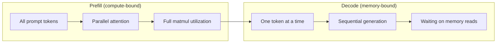
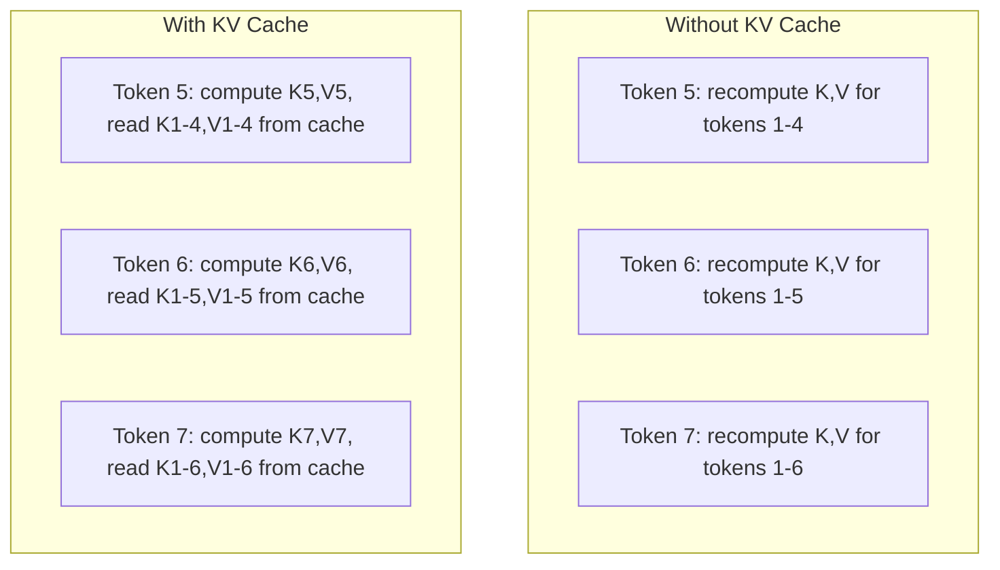
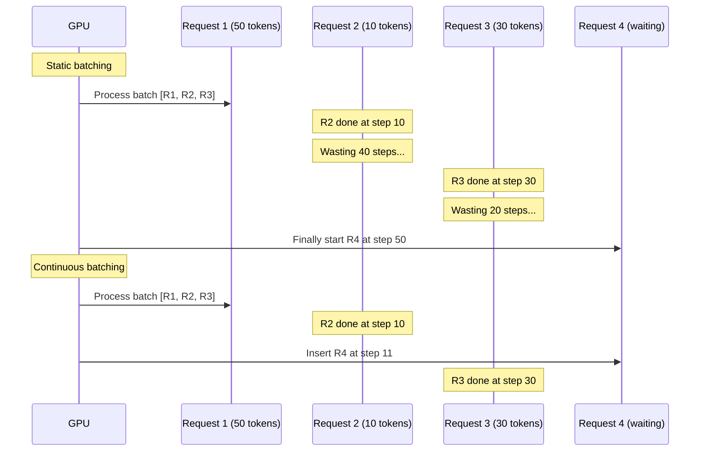
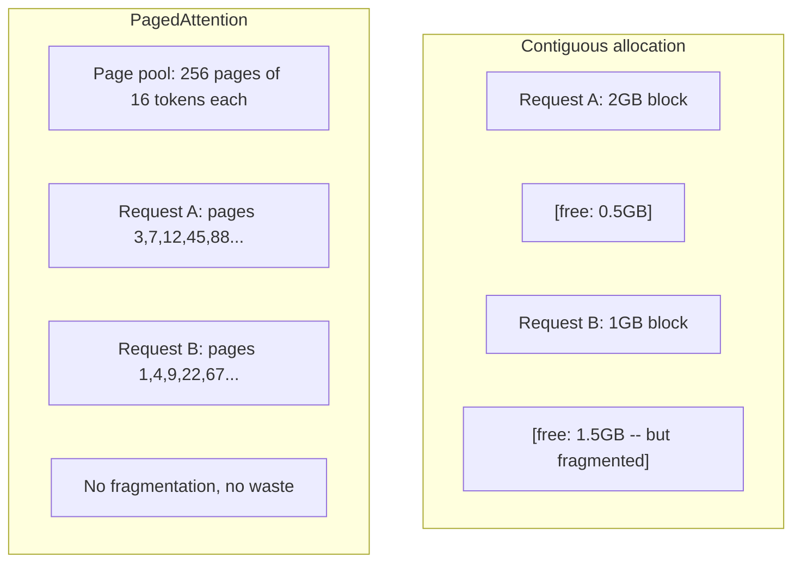
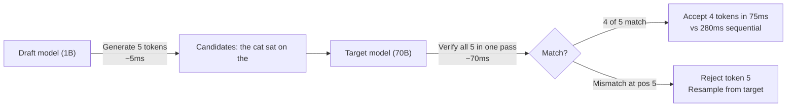

# Optimization Inference

> Dua fase menentukan inference LLM. Pra-pengisian memproses permintaan kamu secara paralel -- terikat dengan komputasi. Dekode menghasilkan token satu per satu -- terikat memori. Setiap optimization menargetkan satu atau keduanya.

**Type:** Build
**Language:** Python
**Prerequisites:** Fase 10, Lesson 01-08 (Arsitektur Transformer, attention)
**Waktu:** ~120 menit

## Tujuan Pembelajaran

- Menerapkan KV-cache untuk menghilangkan komputasi berlebihan selama pembuatan token autoregresif
- Jelaskan fase pra-pengisian vs dekode inference LLM dan mengapa masing-masing fase memiliki hambatan yang berbeda (terikat komputasi vs terikat memori)
- Menerapkan konsep batching berkelanjutan dan PagedAttention untuk memaksimalkan pemanfaatan GPU dalam permintaan bersamaan
- Bandingkan teknik optimization inference (KV-cache, decoding spekulatif, attention flash) dan throughput/latensinya

## Masalah

kamu menerapkan Llama 3 70B pada GPU 4xA100. Satu pengguna mendapat ~50 token per detik. Terasa cepat. Kemudian 100 pengguna mencapai titik akhir secara bersamaan. Throughput turun menjadi 3 token/detik/pengguna. Tagihan GPU kamu sebesar $25.000/bulan memberikan respons lebih lambat dibandingkan tipe manusia.

Modelnya sendiri tidak berubah antara 1 pengguna hingga 100 pengguna. Weight yang sama, arsitektur yang sama, matematika yang sama. Yang berubah adalah cara kamu menjadwalkan pekerjaan. Inference naif menghabiskan 90%+ komputasi GPU yang tersedia. Pengguna yang menunggu token 47 membiarkan seluruh slot batch tetap terbuka sementara bus memori GPU tidak digunakan di antara matmul. Sementara itu, permintaan 2.000 token pengguna baru dapat mengisi waktu mati tersebut dengan komputasi yang berguna.

Ini bukan masalah skala. Ini adalah masalah penjadwalan. Teknik dalam lesson ini -- KV caching, continuous batching, PagedAttention, decoding spekulatif, prefix caching -- adalah hal yang membedakan tagihan inference $25k/bulan dari tagihan $5k/bulan yang melayani lalu lintas yang sama.

vLLM yang melayani Llama 3 70B pada 4xA100-80GB mencapai ~50 token/detik/pengguna pada konkurensi rendah, dan mempertahankan 15-25 TPS/pengguna pada 100 permintaan bersamaan melalui batching berkelanjutan dan PagedAttention. Tanpa optimalisasi ini, perangkat keras yang sama melayani 5 TPS/pengguna pada konkurensi tersebut. GPU yang sama, model yang sama, throughput 4x.

## Konsep

### Pra-Isi vs Dekode

Setiap permintaan inference LLM memiliki dua fase berbeda.

**Isi awal** memproses seluruh prompt input. Semua token diketahui, sehingga attention dapat dihitung secara paralel di seluruh rangkaian. Ini adalah perkalian matrix yang besar -- inti GPU tetap sibuk. Hambatannya adalah menghitung: berapa banyak FLOPS yang dapat dihasilkan oleh perangkat keras kamu per detik. A100 menghasilkan 312 TFLOPS (BF16). Pengisian awal untuk prompt 4.096 token pada model 70B membutuhkan waktu ~400 md pada satu A100.

**Decode** menghasilkan token output satu per satu. Setiap token baru menangani semua token sebelumnya, tetapi hanya satu token yang dihasilkan per penerusan. Matrix weight memiliki ukuran yang sama seperti saat pengisian awal, namun kamu mengalikannya dengan satu vector, bukan matrix. Inti GPU selesai dalam mikrodetik, lalu menunggu kumpulan weight berikutnya datang dari memori. Hambatannya adalah bandwidth memori: seberapa cepat kamu dapat mengalirkan weight model dari HBM ke unit komputasi. A100 memiliki bandwidth 2 TB/dtk. Model 70B di FP16 berukuran 140 GB. Membaca model lengkap sekali membutuhkan waktu 70 md -- itulah dasar kamu untuk satu langkah dekode.



**rasio ops:byte** (juga disebut intensitas aritmatika) menangkap trade-off ini. Ini mengukur berapa banyak operasi yang kamu lakukan per byte yang dimuat dari memori.

```
ops:byte ratio = FLOPs per token / bytes read from memory
```Selama pengisian awal dengan kumpulan 4.096 token, kamu melakukan ~4.096 operasi akumulasi perkalian per weight yang dimuat. Rasionya tinggi -- kamu terikat pada komputasi. Selama dekode dengan ukuran batch 1, kamu melakukan ~1 operasi per weight yang dimuat. Rasionya rendah -- ingatan kamu terbatas.

Wawasan mendasar: *dekode terikat pada memori karena kamu membaca keseluruhan model untuk menghasilkan satu token*. Setiap optimization di bawah ini mengurangi apa yang kamu baca, meningkatkan kumpulan token yang diproses per pembacaan, atau menghindari pembacaan seluruhnya.

### Tembolok KV

Selama attention, setiap kueri token memperhatikan vector kunci dan nilai setiap token sebelumnya. Tanpa caching, menghasilkan token N memerlukan penghitungan ulang proyeksi kunci dan nilai untuk semua N-1 token sebelumnya. Token 1 diproyeksikan ketika membuat token 2, lalu lagi untuk token 3, lalu lagi untuk token 4. Dengan token 1.000, kamu telah memproyeksikan token 1 sebanyak 999 kali.

Cache KV menyimpan proyeksi kunci dan nilai dari semua token sebelumnya. Saat membuat token N, kamu hanya menghitung kunci dan nilai untuk token N, lalu menggabungkannya dengan K/V yang di-cache dari token 1 hingga N-1.



**Rumus memori untuk cache KV:**

```
KV cache size = 2 * num_layers * num_kv_heads * head_dim * seq_len * bytes_per_param
```

Untuk Llama 3 70B (80 layer, 8 kepala KV dengan GQA, head_dim=128, BF16):

```
per token: 2 * 80 * 8 * 128 * 2 bytes = 327,680 bytes = 320 KB
at 4,096 tokens: 320 KB * 4,096 = 1.28 GB
at 128K tokens: 320 KB * 131,072 = 40 GB
```

Percakapan konteks 128K untuk Llama 3 70B menghabiskan 40 GB cache KV -- setengah memori A100. Dengan 100 pengguna bersamaan dengan masing-masing token 4K, cache KV saja memerlukan 128 GB. Inilah sebabnya mengapa manajemen cache KV merupakan tantangan utama dalam optimization inference.

### Pengelompokan Berkelanjutan

Pengelompokan statis menunggu hingga kumpulan N permintaan tiba, memprosesnya bersama-sama, dan menunggu hingga *semua* selesai sebelum menerima permintaan baru. Jika satu permintaan memerlukan 500 token dan permintaan lainnya membutuhkan 10 token, permintaan singkat tersebut akan menganggur selama 490 langkah dekode setelah selesai.

Pengelompokan berkelanjutan (juga disebut pengelompokan tingkat iterasi) memasukkan permintaan baru ke dalam kumpulan segera setelah permintaan selesai. Batch tersebut dievaluasi ulang pada setiap langkah decode. Permintaan yang selesai setelah 10 token segera digantikan dengan permintaan menunggu.



Peningkatan throughput bergantung pada seberapa besar variasi panjang output. Dengan panjang yang seragam, pengelompokan berkelanjutan cocok dengan pengelompokan statis. Dengan panjang yang bervariasi (kasus umum), pengelompokan berkelanjutan dapat menghasilkan throughput 2-5x lebih tinggi karena slot GPU tidak pernah kosong.

### Halaman Attention

Cache KV untuk setiap permintaan adalah blok memori yang berdekatan. Saat permintaan datang dan pergi, fragmen memori -- persis seperti fragmentasi RAM di sistem operasi. Permintaan token 4K memerlukan 1,28 GB yang bersebelahan. Meskipun kamu memiliki total 2 GB gratis, kamu mungkin tidak memiliki 1,28 GB *berdekatan*. kamu membuang-buang memori atau menolak permintaan tersebut.

PagedAttention (dari vLLM) menerapkan memori virtual bergaya OS ke cache KV. Alih-alih mengalokasikan satu blok yang berdekatan per permintaan, ia mengalokasikan "halaman" berukuran tetap (biasanya masing-masing 16 token). Halaman bisa berada di mana saja di memori GPU fisik. Tabel halaman memetakan posisi urutan logis setiap permintaan ke lokasi halaman fisik.



PagedAttention juga mengaktifkan **copy-on-write** untuk awalan bersama. Jika 50 permintaan berbagi prompt sistem yang sama, halaman cache KV untuk prompt sistem tersebut disimpan satu kali dan direferensikan oleh seluruh 50 permintaan. Hanya ketika permintaan berbeda (pesan pengguna berbeda) barulah permintaan tersebut mendapatkan halamannya sendiri. Ini memotong penggunaan memori secara drastis untuk aplikasi dengan system prompt bersama.vLLM melaporkan pemborosan memori hampir nol (~4% vs ~60-80% dalam alokasi naif) melalui PagedAttention.

### Penguraian Code Spekulatif

Dekode lambat karena berurutan -- kamu menghasilkan satu token, mengumpankannya kembali, menghasilkan token berikutnya. Namun bagaimana jika kamu bisa menebak 5 token berikutnya dengan murah, lalu memverifikasi semuanya sekaligus?

Penguraian code spekulatif menggunakan **model draf** yang kecil dan cepat untuk menghasilkan K kandidat token. **model target** yang besar kemudian memproses semua kandidat K dalam satu forward pass (yang terlihat seperti prefill -- paralel, terikat komputasi, efisien). Jika model target setuju dengan prediksi draf model, kamu menerima semua K token dalam satu target forward pass. Jika tidak sesuai pada posisi j, kamu menerima token 1 hingga j-1 dan membuang sisanya.



Kecepatannya bergantung pada **tingkat penerimaan** -- seberapa sering prediksi rancangan model sesuai dengan target. Untuk penyusunan Llama 3 8B untuk Llama 3 70B, tingkat penerimaan 70-85% adalah tipikal bahasa alami. Ini berarti kecepatan dekode 2-3x.

Tiga pendekatan untuk decoding spekulatif:

| Metode | Sumber draf | Tingkat penerimaan | Atas |
|--------|-------------|-----------------|----------|
| Draf-target (Leviathan dkk.) | Pisahkan model kecil | 70-85% | Memori model draf |
| ELANG (Li dkk.) | Ringan tepat sasaran | 75-90% | ~1% parameter tambahan |
| Pencarian N-gram | Tabel token n-gram | 40-60% | Dapat Diabaikan |

**EAGLE** melatih kepala autoregresif kecil di atas status tersembunyi model target. Ini memprediksi embedding token berikutnya menggunakan feature layer kedua hingga terakhir model target. Karena beroperasi pada representasi model target sendiri (bukan model terpisah), maka mencapai tingkat penerimaan yang lebih tinggi dengan memori ekstra minimal. EAGLE-2 menambahkan pohon draf dinamis yang menyesuaikan jumlah kandidat berdasarkan konteks.

**Decoding spekulatif N-gram** menyimpan tabel kelanjutan n-gram dari konteks saat ini atau korpus bawaan. Jika draf cocok dengan apa yang muncul sebelumnya dalam percakapan yang sama (pola berulang, code, output terstruktur), draf tersebut akan diaktifkan tanpa overhead jaringan neural. Tingkat penerimaan rata-rata lebih rendah tetapi biaya per spekulasi pada dasarnya gratis.

Penguraian code spekulatif *tepat secara matematis* -- distribusi output identik dengan distribusi model target. Ini bukan perkiraan. Langkah verifikasi memastikan bahwa setiap token yang diterima memiliki probabilitas yang sama persis dengan yang ditetapkan oleh model target.

### Awalan Caching

Banyak permintaan memiliki awalan yang sama. System prompt chatbot. Blok konteks RAG. Kumpulan contoh beberapa contoh. Tanpa cache awalan, setiap permintaan menghitung ulang cache KV untuk token bersama ini dari awal.

Caching awalan menyimpan cache KV untuk awalan umum dan menggunakannya kembali di seluruh permintaan. Ketika permintaan baru datang dengan awalan yang diketahui, sistem akan menyalin (atau mereferensikan) entri KV yang di-cache dan hanya menghitung KV untuk akhiran unik.

Untuk system prompt 2.000 token yang dibagikan ke semua permintaan, cache awalan menghilangkan ~400 md pra-pengisian per permintaan. Dengan 100 permintaan/detik, hal ini menghemat 40 detik komputasi GPU per detik -- lebih dari nilai kerja satu GPU.RadixAttention SGLang mengimplementasikan cache awalan dengan pohon radix (trie) yang mengindeks awalan berdasarkan konten tokennya. Setiap permintaan yang cocok dengan awalan yang disimpan akan mendapatkan cache KV-nya secara gratis. Pohon ini mengaktifkan pencocokan awalan sebagian -- jika kamu berbagi 1.500 dari 2.000 token awalan dengan entri cache, kamu menggunakan kembali 1.500 tersebut dan menghitung ulang hanya 500.

### Mesin Inference

Tiga mesin mendominasi penyajian produksi LLM:

| Mesin | Inovasi utama | Terbaik untuk |
|--------|---------------|----------|
| vLLM | PagedPerhatian, pengelompokan berkelanjutan | Penyajian tujuan umum, kompatibilitas tertinggi |
| SGLang | RadixAttention (cache awalan), pembuatan terstruktur | Chatbot multi-putaran, decoding terbatas |
| TensorRT-LLM | Fusi kernel NVIDIA, kuantisasi FP8 | Throughput GPU tunggal maksimum pada perangkat keras NVIDIA |

**vLLM** adalah titik awal default. Ini mendukung berbagai model, berjalan pada vendor GPU mana pun (NVIDIA, AMD, Intel), dan mencapai throughput yang kuat melalui PagedAttention + batching berkelanjutan. API yang kompatibel dengan OpenAI berarti kamu dapat menggunakannya sebagai pengganti panggilan API OpenAI apa pun.

**SGLang** dibangun di atas fondasi yang sama dengan vLLM tetapi menambahkan RadixAttention untuk cache awalan dan bahasa khusus domain untuk program LLM terstruktur. Jika weight kerja kamu melibatkan percakapan multi-putaran, penggunaan alat, atau decoding terbatas (output JSON, pembuatan dengan panduan regex), SGLang sering kali mengungguli vLLM sebanyak 2-5x melalui penggunaan kembali prefiks.

**TensorRT-LLM** mengkompilasi model ke dalam kernel GPU NVIDIA yang dioptimalkan. Ini menggabungkan operasi (attention + linier + activation dalam satu kernel), menggunakan FP8 pada GPU H100, dan terintegrasi dengan Server Inference NVIDIA Triton untuk penerapan produksi. Ini mencapai throughput GPU tunggal tertinggi pada perangkat keras NVIDIA tetapi memerlukan lebih banyak pengaturan dan hanya berfungsi pada GPU NVIDIA.

Nomor dunia nyata untuk Llama 3 70B (4xA100-80GB, BF16):

| Metrik | vLLM | SGLang | TensorRT-LLM |
|--------|------|--------|---------------|
| Throughput (1 pengguna) | ~50TPS | ~55TPS | ~65TPS |
| Throughput (100 pengguna) | ~2.500 jumlah TPS | ~3.200 jumlah TPS | ~3.000 jumlah TPS |
| Saatnya untuk token pertama | ~400 md | ~300ms (tekan awalan) | ~350 md |
| Konteks maksimal | 128K | 128K | 128K |

### Ops: Kerangka Byte

kamu tidak dapat mengoptimalkan apa yang tidak kamu ukur. Rasio ops:byte memberi tahu kamu apakah kamu terikat komputasi atau terikat memori, yang menentukan optimization mana yang penting.

```
Compute roof: peak FLOPS of the GPU
Memory roof:  peak bandwidth * ops:byte ratio
```

Ketika ops:byte rendah (decode, batch kecil), kamu mencapai batas bandwidth memori. Menambahkan lebih banyak komputasi (clock lebih tinggi, lebih banyak core) tidak membantu. kamu perlu mengurangi pembacaan memori (kuantisasi, kompresi cache KV) atau meningkatkan ukuran batch untuk mengamortisasi pembacaan pada pekerjaan yang lebih bermanfaat.

Ketika ops:byte tinggi (pengisian awal, batch besar), kamu mencapai puncak komputasi. Optimalisasi bandwidth memori tidak membantu. kamu memerlukan GPU yang lebih cepat, fusi kernel, atau presisi yang lebih rendah untuk mendapatkan lebih banyak FLOPS.

| Skenario | operasi:byte | Terikat | Optimalkan dengan |
|----------|----------|-------|---------------|
| Isi awal, batch=1 | ~4.096 | Hitung | Fusi kernel, FP8 |
| Dekode, kumpulan=1 | ~1 | Memori | Kuantisasi, kompresi KV |
| Dekode, kumpulan=32 | ~32 | Memori | Batch lebih besar, batching berkelanjutan |
| Dekode, kumpulan=256 | ~256 | Transisi | Keduanya penting |
| Dekode, kumpulan=1024 | ~1.024 | Hitung | Fusi kernel, paralelisme tensor |Titik persilangan pada A100 adalah sekitar ops:byte = 156 (312 TFLOPS / 2 TB/s). Di bawah 156, kamu terikat memori. Di atas 156, kamu terikat dengan komputasi. Pengelompokan berkelanjutan mendorong dekode menuju persilangan ini dengan mengemas lebih banyak token per iterasi.

## Build

### Langkah 1: Cache KV dari Awal

Kami membangun cache KV multi-head yang menyimpan proyeksi kunci dan nilai per layer, per head, dan menunjukkan pola pertumbuhan memori.

```python
import numpy as np

class KVCache:
    def __init__(self, num_layers, num_heads, head_dim, max_seq_len, dtype=np.float16):
        self.num_layers = num_layers
        self.num_heads = num_heads
        self.head_dim = head_dim
        self.max_seq_len = max_seq_len
        self.dtype = dtype

        self.k_cache = np.zeros(
            (num_layers, num_heads, max_seq_len, head_dim), dtype=dtype
        )
        self.v_cache = np.zeros(
            (num_layers, num_heads, max_seq_len, head_dim), dtype=dtype
        )
        self.seq_len = 0

    def update(self, layer_idx, new_keys, new_values):
        num_new = new_keys.shape[1]
        end = self.seq_len + num_new
        self.k_cache[layer_idx, :, self.seq_len:end, :] = new_keys
        self.v_cache[layer_idx, :, self.seq_len:end, :] = new_values
        return (
            self.k_cache[layer_idx, :, :end, :],
            self.v_cache[layer_idx, :, :end, :]
        )

    def advance(self, num_tokens):
        self.seq_len += num_tokens

    def memory_bytes(self):
        return self.k_cache.nbytes + self.v_cache.nbytes

    def used_bytes(self):
        per_token = 2 * self.num_layers * self.num_heads * self.head_dim * np.dtype(self.dtype).itemsize
        return per_token * self.seq_len
```

### Langkah 2: Attention dengan KV Cache

Attention multi-head yang disederhanakan yang menggunakan cache KV untuk langkah-langkah dekode.

```python
def scaled_dot_product_attention(query, keys, values):
    head_dim = query.shape[-1]
    scores = np.matmul(query, keys.transpose(0, 1, 3, 2)) / np.sqrt(head_dim)
    seq_len_q = scores.shape[-2]
    seq_len_k = scores.shape[-1]
    if seq_len_q > 1:
        mask = np.triu(np.ones((seq_len_q, seq_len_k), dtype=np.float32), k=seq_len_k - seq_len_q + 1)
        scores = scores + mask * (-1e9)
    max_scores = np.max(scores, axis=-1, keepdims=True)
    exp_scores = np.exp(scores - max_scores)
    attn_weights = exp_scores / np.sum(exp_scores, axis=-1, keepdims=True)
    return np.matmul(attn_weights, values)


class MultiHeadAttention:
    def __init__(self, d_model, num_heads):
        self.num_heads = num_heads
        self.head_dim = d_model // num_heads
        scale = np.sqrt(2.0 / d_model)
        self.W_q = np.random.randn(d_model, d_model).astype(np.float32) * scale
        self.W_k = np.random.randn(d_model, d_model).astype(np.float32) * scale
        self.W_v = np.random.randn(d_model, d_model).astype(np.float32) * scale
        self.W_o = np.random.randn(d_model, d_model).astype(np.float32) * scale

    def forward(self, x, kv_cache=None, layer_idx=0):
        batch, seq_len, d_model = x.shape
        Q = np.matmul(x, self.W_q).reshape(batch, seq_len, self.num_heads, self.head_dim).transpose(0, 2, 1, 3)
        K = np.matmul(x, self.W_k).reshape(batch, seq_len, self.num_heads, self.head_dim).transpose(0, 2, 1, 3)
        V = np.matmul(x, self.W_v).reshape(batch, seq_len, self.num_heads, self.head_dim).transpose(0, 2, 1, 3)

        if kv_cache is not None:
            K_full, V_full = kv_cache.update(layer_idx, K[0], V[0])
            K = K_full[np.newaxis, :, :, :]
            V = V_full[np.newaxis, :, :, :]
            if seq_len == 1:
                kv_cache.advance(1)

        attn_out = scaled_dot_product_attention(Q, K, V)
        attn_out = attn_out.transpose(0, 2, 1, 3).reshape(batch, -1, d_model)
        return np.matmul(attn_out, self.W_o)
```

### Langkah 3: Simulator Batching Berkelanjutan

Ini mensimulasikan perbedaan penjadwalan antara pengelompokan statis dan berkelanjutan.

```python
import heapq

class Request:
    def __init__(self, request_id, prompt_tokens, output_tokens, arrival_step):
        self.request_id = request_id
        self.prompt_tokens = prompt_tokens
        self.output_tokens = output_tokens
        self.arrival_step = arrival_step
        self.tokens_generated = 0
        self.start_step = None
        self.end_step = None

    def is_done(self):
        return self.tokens_generated >= self.output_tokens


def simulate_static_batching(requests, batch_size):
    step = 0
    completed = []
    queue = list(requests)
    queue.sort(key=lambda r: r.arrival_step)

    while queue:
        batch = []
        while queue and len(batch) < batch_size:
            r = queue.pop(0)
            r.start_step = max(step, r.arrival_step)
            batch.append(r)

        if batch:
            step = max(step, max(r.start_step for r in batch))
            max_output = max(r.output_tokens for r in batch)
            for r in batch:
                r.tokens_generated = r.output_tokens
                r.end_step = step + max_output
            step += max_output
            completed.extend(batch)

    return completed


def simulate_continuous_batching(requests, batch_size):
    step = 0
    completed = []
    queue = sorted(requests, key=lambda r: r.arrival_step)
    queue_idx = 0
    active = []
    waiting = []

    while queue_idx < len(queue) or active or waiting:
        while queue_idx < len(queue) and queue[queue_idx].arrival_step <= step:
            waiting.append(queue[queue_idx])
            queue_idx += 1

        while waiting and len(active) < batch_size:
            r = waiting.pop(0)
            r.start_step = step
            active.append(r)

        if not active:
            if waiting:
                step += 1
                continue
            elif queue_idx < len(queue):
                step = queue[queue_idx].arrival_step
                continue
            else:
                break

        for r in active:
            r.tokens_generated += 1

        done = [r for r in active if r.is_done()]
        for r in done:
            r.end_step = step + 1
            completed.append(r)
        active = [r for r in active if not r.is_done()]

        step += 1

    return completed


def batching_stats(completed):
    latencies = [r.end_step - r.arrival_step for r in completed]
    total_time = max(r.end_step for r in completed) - min(r.arrival_step for r in completed)
    total_tokens = sum(r.output_tokens for r in completed)
    return {
        "avg_latency": np.mean(latencies),
        "p50_latency": np.median(latencies),
        "p99_latency": np.percentile(latencies, 99),
        "total_time": total_time,
        "throughput": total_tokens / total_time if total_time > 0 else 0,
    }
```

### Langkah 4: Awalan Cache

Cache awalan berbasis trie yang menyimpan entri KV untuk awalan bersama.

```python
class TrieNode:
    def __init__(self):
        self.children = {}
        self.kv_data = None
        self.hit_count = 0


class PrefixCache:
    def __init__(self, max_entries=1000):
        self.root = TrieNode()
        self.max_entries = max_entries
        self.total_entries = 0
        self.hits = 0
        self.misses = 0

    def _walk(self, token_ids):
        node = self.root
        depth = 0
        for tid in token_ids:
            if tid not in node.children:
                break
            node = node.children[tid]
            depth += 1
        return node, depth

    def lookup(self, token_ids):
        node, depth = self._walk(token_ids)
        if depth > 0:
            self.hits += 1
            current = self.root
            for tid in token_ids[:depth]:
                current = current.children[tid]
                current.hit_count += 1
            kv_entries = []
            current = self.root
            for tid in token_ids[:depth]:
                current = current.children[tid]
                if current.kv_data is not None:
                    kv_entries.append(current.kv_data)
            return depth, kv_entries
        self.misses += 1
        return 0, []

    def insert(self, token_ids, kv_per_token):
        node = self.root
        for i, tid in enumerate(token_ids):
            if tid not in node.children:
                if self.total_entries >= self.max_entries:
                    return i
                node.children[tid] = TrieNode()
                self.total_entries += 1
            node = node.children[tid]
            if i < len(kv_per_token):
                node.kv_data = kv_per_token[i]
        return len(token_ids)

    def hit_rate(self):
        total = self.hits + self.misses
        return self.hits / total if total > 0 else 0.0
```

### Langkah 5: Simulator Dekode Spekulatif

Kami mensimulasikan decoding spekulatif target draf dengan tingkat penerimaan yang dapat dikonfigurasi.

```python
class DraftModel:
    def __init__(self, vocab_size, acceptance_rate=0.8):
        self.vocab_size = vocab_size
        self.acceptance_rate = acceptance_rate

    def generate(self, context, num_tokens):
        tokens = np.random.randint(0, self.vocab_size, size=num_tokens)
        return tokens

    def get_probs(self, context, token):
        probs = np.random.dirichlet(np.ones(self.vocab_size))
        return probs


class TargetModel:
    def __init__(self, vocab_size):
        self.vocab_size = vocab_size

    def get_probs(self, context, tokens=None):
        if tokens is not None:
            return [np.random.dirichlet(np.ones(self.vocab_size)) for _ in tokens]
        return np.random.dirichlet(np.ones(self.vocab_size))


def speculative_decode(draft_model, target_model, context, num_speculative=5,
                       draft_cost=1.0, target_cost=10.0, verify_cost=12.0):
    total_tokens = 0
    total_cost = 0.0
    accepted_counts = []
    context = list(context)

    max_tokens = 100

    while total_tokens < max_tokens:
        draft_tokens = draft_model.generate(context, num_speculative)
        total_cost += draft_cost * num_speculative

        target_probs = target_model.get_probs(context, draft_tokens)
        total_cost += verify_cost

        accepted = 0
        for i, token in enumerate(draft_tokens):
            draft_p = draft_model.get_probs(context + list(draft_tokens[:i]), token)
            target_p = target_probs[i]

            r = np.random.random()
            acceptance_prob = min(1.0, target_p[token] / (draft_p[token] + 1e-10))

            if r < draft_model.acceptance_rate:
                accepted += 1
                context.append(token)
                total_tokens += 1
            else:
                new_token = np.random.choice(draft_model.vocab_size, p=target_p)
                context.append(new_token)
                total_tokens += 1
                break

        accepted_counts.append(accepted)

        if accepted == num_speculative:
            bonus_probs = target_model.get_probs(context)
            bonus_token = np.random.choice(draft_model.vocab_size, p=bonus_probs)
            context.append(bonus_token)
            total_tokens += 1

    sequential_cost = total_tokens * target_cost
    return {
        "total_tokens": total_tokens,
        "speculative_cost": total_cost,
        "sequential_cost": sequential_cost,
        "speedup": sequential_cost / total_cost if total_cost > 0 else 1.0,
        "avg_accepted": np.mean(accepted_counts),
        "acceptance_rate": np.mean(accepted_counts) / num_speculative,
    }


def compare_speculation_strategies(vocab_size=1000, num_trials=20):
    results = {}

    for name, acceptance_rate, spec_tokens in [
        ("Draft-target (8B->70B)", 0.78, 5),
        ("EAGLE", 0.85, 6),
        ("N-gram", 0.50, 4),
        ("No speculation", 0.0, 0),
    ]:
        if spec_tokens == 0:
            results[name] = {
                "speedup": 1.0,
                "acceptance_rate": 0.0,
                "avg_accepted": 0.0,
            }
            continue

        trial_results = []
        for _ in range(num_trials):
            draft = DraftModel(vocab_size, acceptance_rate=acceptance_rate)
            target = TargetModel(vocab_size)
            context = list(np.random.randint(0, vocab_size, size=10))
            result = speculative_decode(draft, target, context, num_speculative=spec_tokens)
            trial_results.append(result)

        results[name] = {
            "speedup": np.mean([r["speedup"] for r in trial_results]),
            "acceptance_rate": np.mean([r["acceptance_rate"] for r in trial_results]),
            "avg_accepted": np.mean([r["avg_accepted"] for r in trial_results]),
        }

    return results
```

### Langkah 6: Profiler Memori Cache KV

Hitung kebutuhan memori cache KV untuk konfigurasi model nyata.

```python
MODEL_CONFIGS = {
    "Llama-3-8B": {
        "num_layers": 32, "num_kv_heads": 8, "head_dim": 128,
        "model_params_b": 8, "gqa": True,
    },
    "Llama-3-70B": {
        "num_layers": 80, "num_kv_heads": 8, "head_dim": 128,
        "model_params_b": 70, "gqa": True,
    },
    "Llama-3-405B": {
        "num_layers": 126, "num_kv_heads": 8, "head_dim": 128,
        "model_params_b": 405, "gqa": True,
    },
    "Mistral-7B": {
        "num_layers": 32, "num_kv_heads": 8, "head_dim": 128,
        "model_params_b": 7, "gqa": True,
    },
    "GPT-4-est": {
        "num_layers": 120, "num_kv_heads": 96, "head_dim": 128,
        "model_params_b": 1800, "gqa": False,
    },
}


def kv_cache_memory(config, seq_len, dtype_bytes=2):
    per_token = 2 * config["num_layers"] * config["num_kv_heads"] * config["head_dim"] * dtype_bytes
    total = per_token * seq_len
    return {
        "per_token_bytes": per_token,
        "per_token_kb": per_token / 1024,
        "total_bytes": total,
        "total_mb": total / (1024 ** 2),
        "total_gb": total / (1024 ** 3),
    }


def memory_budget(config, gpu_memory_gb, model_dtype_bytes=2, kv_dtype_bytes=2):
    model_memory_gb = config["model_params_b"] * 1e9 * model_dtype_bytes / (1024 ** 3)
    overhead_gb = gpu_memory_gb * 0.1
    available_for_kv = gpu_memory_gb - model_memory_gb - overhead_gb

    if available_for_kv <= 0:
        return {"error": "Model does not fit in GPU memory", "model_memory_gb": model_memory_gb}

    per_token = 2 * config["num_layers"] * config["num_kv_heads"] * config["head_dim"] * kv_dtype_bytes
    max_tokens = int(available_for_kv * (1024 ** 3) / per_token)

    return {
        "gpu_memory_gb": gpu_memory_gb,
        "model_memory_gb": round(model_memory_gb, 1),
        "overhead_gb": round(overhead_gb, 1),
        "available_for_kv_gb": round(available_for_kv, 1),
        "max_total_tokens": max_tokens,
        "max_users_at_2k": max_tokens // 2048,
        "max_users_at_4k": max_tokens // 4096,
        "max_users_at_32k": max_tokens // 32768,
    }
```

## Pakai

Dengan vLLM:

```python
from vllm import LLM, SamplingParams

llm = LLM(
    model="meta-llama/Llama-3-70B-Instruct",
    tensor_parallel_size=4,
    enable_prefix_caching=True,
    max_model_len=8192,
    gpu_memory_utilization=0.9,
)

params = SamplingParams(temperature=0.7, max_tokens=256)
outputs = llm.generate(["Explain inference optimization in one paragraph."], params)
```

Dengan SGLang untuk caching awalan + output terstruktur:

```python
import sglang as sgl

@sgl.function
def classify(s, text):
    s += sgl.system("You are a classifier. Output JSON only.")
    s += sgl.user(f"Classify this text: {text}")
    s += sgl.assistant(sgl.gen("result", regex=r'\{"label": "(positive|negative|neutral)"\}'))

runtime = sgl.Runtime(model_path="meta-llama/Llama-3-70B-Instruct", tp_size=4)
sgl.set_default_backend(runtime)

results = classify.run_batch([
    {"text": "This product is amazing!"},
    {"text": "Terrible experience."},
    {"text": "It was okay I guess."},
])
```

Dengan TensorRT-LLM:

```python
import tensorrt_llm
from tensorrt_llm.runtime import ModelRunner

runner = ModelRunner.from_dir("./llama-70b-trt-engine/", rank=0)

outputs = runner.generate(
    batch_input_ids=[tokenizer.encode("Explain KV caching.")],
    max_new_tokens=256,
    temperature=0.7,
)
```

## Kirim

Lesson ini menghasilkan:
- `outputs/skill-inference-optimization.md` -- keterampilan untuk mendiagnosis dan mengoptimalkan penyajian inference LLM

## Latihan

1. Ubah profiler cache KV untuk membandingkan kuantisasi cache FP16 vs FP8 vs INT4 KV. Untuk Llama 3 70B dalam konteks 4K, hitung maksimum pengguna bersamaan untuk masing-masing 4xA100-80GB. Kuantisasi KV ke INT4 kira-kira harus 4x kapasitas pengguna.

2. Perluas simulator batching berkelanjutan untuk melacak pemanfaatan GPU (sebagian slot batch terisi per langkah). Pemanfaatan plot dari waktu ke waktu untuk pengelompokan statis dan berkelanjutan dengan 50 permintaan yang panjang keluarannya mengikuti distribusi Pareto (bentuk=1,5, skala=20). Pengelompokan berkelanjutan harus mempertahankan pemanfaatan >80%.

3. Menerapkan versi cache KV attention kueri yang dikelompokkan (GQA) dengan `num_kv_heads < num_query_heads`. Llama 3 70B menggunakan 64 kepala kueri tetapi hanya 8 kepala KV. Hitung penghematan memori vs attention multi-head penuh (pengurangan 8x ukuran cache KV).

4. Membangun cache awalan yang menggunakan penggusuran LRU. Setel max_entries ke 500 dan hasilkan 1.000 permintaan dengan 60% berbagi salah satu dari 5 awalan umum. Ukur tingkat hit dan bandingkan dengan cache tanpa batas. Dengan penggusuran yang baik, hit rate akan tetap di atas 55%.

5. Memperluas simulator decoding spekulatif untuk menerapkan spekulasi berbasis pohon (gaya EAGLE-2). Alih-alih menggunakan satu rantai token K draft, buatlah satu pohon kandidat (misalnya, 2 cabang pada masing-masing 3 level = 8 kandidat daun). Bandingkan total token yang diterima per putaran verifikasi vs spekulasi linier.

## Istilah Kunci| Istilah | Apa kata orang | Apa sebenarnya arti |
|------|----------------|----------------------|
| Isi awal | "Memproses prompt" | Menghitung attention pada semua token input secara paralel -- terikat komputasi karena perkalian matrix penuh membuat inti GPU sibuk |
| Dekode | "Menghasilkan token" | Memproduksi satu token per penerusan, membaca weight model lengkap setiap kali -- terikat memori karena komputasi selesai sebelum weight berikutnya tiba |
| Cache KV | "Menyimpan status attention" | Menyimpan proyeksi kunci dan nilai untuk semua token sebelumnya sehingga tidak dihitung ulang pada setiap langkah dekode -- memperdagangkan memori untuk komputasi |
| Pengelompokan berkelanjutan | "Pengelompokan dinamis" | Memasukkan permintaan baru ke dalam batch yang sedang berjalan segera setelah permintaan selesai, dievaluasi pada setiap iterasi dekode daripada menunggu seluruh batch |
| PagedPerhatian | "Memori virtual untuk cache KV" | Mengalokasikan cache KV pada halaman berukuran tetap alih-alih blok yang berdekatan, menghilangkan fragmentasi memori dan mengaktifkan copy-on-write untuk awalan bersama |
| Penguraian code spekulatif | "Draf dan verifikasi" | Menggunakan model draf cepat untuk mengusulkan beberapa token, lalu memverifikasi semuanya dalam satu model target forward pass -- tepat secara matematis, percepatan 2-3x |
| ELANG | "Penguraian code spekulatif diri" | Varian decoding spekulatif yang melatih kepala ringan pada status tersembunyi model target, mencapai tingkat penerimaan yang lebih tinggi dibandingkan model draf terpisah |
| Cache awalan | "Menggunakan kembali sistem prompt KV" | Menyimpan entri cache KV yang dihitung untuk prefiks umum (system prompt, contoh beberapa contoh) dan menggunakannya kembali di seluruh permintaan untuk melewati pra-pengisian yang berlebihan |
| Ops: rasio byte | "Intensitas aritmatika" | Rasio operasi komputasi terhadap byte memori yang dibaca -- menentukan apakah weight kerja terikat pada komputasi (rasio tinggi) atau terikat memori (rasio rendah) |
| Saatnya untuk token pertama | "TTFT" | Latensi dari menerima permintaan hingga menghasilkan token output pertama -- didominasi oleh waktu pengisian awal untuk permintaan yang panjang |

## Bacaan Lanjutan

- Kwon dkk., "Manajemen Memori yang Efisien untuk Penyajian Large Language Model dengan PagedAttention" (2023) -- makalah vLLM yang memperkenalkan manajemen cache KV berhalaman, yang kini menjadi standar industri untuk penyajian inference
- Leviathan et al., "Fast Inference from Transformers via Speculative Decoding" (2023) -- makalah dasar yang membuktikan bahwa spekulasi verifikasi draf menghasilkan distribusi model target yang tepat sekaligus mencapai percepatan 2-3x
- Li dkk., "EAGLE: Speculative Sampling Requires Rethinking Feature Uncertainty" (2024) -- mencapai tingkat penerimaan yang lebih tinggi dengan melatih feature-feature model target sendiri daripada menggunakan rancangan model terpisah
- Zheng et al., "SGLang: Eksekusi Efisien dari Program Model Bahasa Terstruktur" (2024) -- memperkenalkan RadixAttention untuk cache awalan dan model pemrograman untuk program LLM multi-panggilan
- Williams et al., "Roofline: An Insightful Visual Performance Model for Multicore Architectures" (2009) -- makalah garis atap asli yang meresmikan framework ops:byte untuk mempertimbangkan hambatan komputasi vs memori
