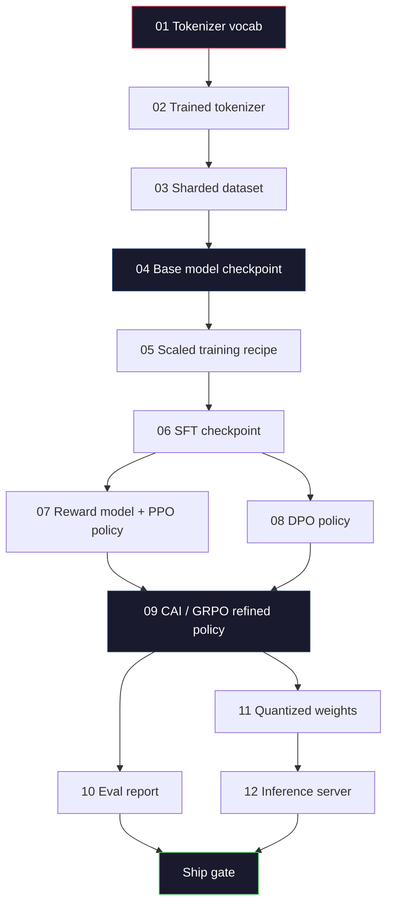
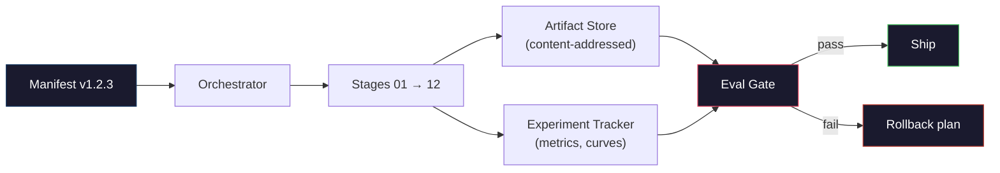

# Membangun Pipeline LLM Lengkap

> Segala sesuatu mulai dari Lesson 01 hingga 12 adalah satu phase dari satu pipeline. Lesson ini adalah perancah yang mengubah tahapan tersebut menjadi satu proses end-to-end: tokenization, pra-training, penskalaan, SFT, penyelarasan, evaluasi, kuantisasi, sajikan. kamu tidak akan melatih model 70B di laptop. kamu akan menghasilkan layer orkestrasi, manifes, gerbang eval, dan rencana rollback yang digunakan tim perbatasan tahun 2026 untuk memutuskan apa yang akan dikirimkan. Ini adalah batu penjuru.

**Type:** Build
**Language:** Python (stdlib)
**Prerequisites:** Semua lesson Fase 10 01-12
**Waktu:** ~120 menit

## Tujuan Pembelajaran

- Menyusun sebelas lesson sebelumnya (tokenizer, data, pra-training, penskalaan, SFT, RLHF, DPO, CAI, eval, kuantisasi, inference) ke dalam satu spesifikasi pipeline yang dapat direproduksi
- Tentukan kontrak artefak antar phase: apa yang dikonsumsi setiap phase, apa yang dihasilkan, dan bagaimana phase berikutnya memverifikasi input
- Build orkestrator yang melacak eksperimen, hash artefak, dan gerbang mengirimkan keputusan pada ambang batas eval
- Rancang rencana pengembalian: artefak mana yang murah untuk dijalankan kembali, mana yang mahal, dan berapa biaya pos pemeriksaan yang rusak

## Masalah

Lesson sebelumnya masing-masing berhasil. Tokenizer dilatih. GPT kecil yang telah dilatih sebelumnya. Dataset SFT telah dirakit. Model penghargaan dilatih. DPO dijalankan. Evaluasi diukur. Anak timbangan terkuantisasi diekspor. Server inference berputar. Masing-masing adalah buku catatan. Masing-masing mempunyai konvensinya sendiri, jalur keluarannya sendiri, benihnya sendiri.

Latihan di garis depan bukanlah sebuah buku catatan. Llama 3 405B membutuhkan waktu 30 juta jam H100 selama kurang lebih 54 hari. DeepSeek-V3 menggunakan sekitar 2,8 juta jam H800. Selama waktu tersebut, satu pos pemeriksaan yang rusak, satu kontaminasi data, satu regresi evaluasi dapat menghabiskan waktu seminggu bagi tim dan anggaran GPU selama sebulan. Cara tim bertahan dalam hal ini adalah melalui kebersihan jalur pipa: setiap tahapan memiliki input deterministik, output deterministik, manifes, hash, dan gerbang.

Ini adalah batu penjuru. kamu tidak akan menjalankan pipeline secara end-to-end di laptop. kamu akan menulis orkestrator yang mengkoordinasikan tahapan, manifes yang menjelaskan proses, verifikator yang mengirimkan keputusan, dan rencana pemutaran ulang yang memungkinkan pihak ketiga menjalankan kembali pekerjaan kamu dari satu file. Kodenya kecil; disiplinnya besar.

Skala pola dari parameter 100M hingga 1T tidak berubah. Empat komponen yang sama -- manifes, orkestrator, gerbang eval, penyimpanan artefak -- menjalankan Llama 3 dan juga menjalankan hobi GPT kamu. Perbedaannya terletak pada ukuran angka-angka di dalam konfigurasi setiap tahapan, bukan bentuk alurnya.

## Konsep

### Dua Belas Tahapan

Setiap lesson Phase 10 adalah sebuah tahapan. Berikut adalah grafik ketergantungan selengkapnya.



Tahapan 07 dan 08 dapat berjalan secara paralel. Yang lainnya adalah ketergantungan yang sulit. Perubahan pada phase 02 (tokenizer) membuat setiap artefak hilir menjadi tidak valid. Perubahan pada phase 10 (eval) hanya membatalkan keputusan kapal.

### Manifes

Manifes adalah file tunggal yang menjelaskan proses yang dijalankan dengan cukup lengkap sehingga dapat diputar ulang. Tidak ada yang dihasilkan oleh pipeline yang bergantung pada status yang tidak ada dalam manifes. Bidangnya membosankan dan wajib.

```
pipeline_version: 1.2.3
seed: 42
git_commit: a1b2c3d4
stages:
  01_tokenizer:
    recipe: bpe_32k
    input_hash: sha256:...
    output_hash: sha256:...
    wall_clock_sec: 3600
    cost_usd: 12
```

Hash output phase N adalah hash input phase N+1. Setiap penyimpangan maka pipa akan terhenti. Inilah cara kamu mengetahui kerusakan data sejak dini. Ini juga merupakan cara rekan satu tim di benua berbeda memverifikasi bahwa tayangan ulang mereka menghasilkan artefak yang sama seperti milik kamu.Dalam praktiknya, tim menggunakan skema YAML kecil ditambah pemeriksa manifes yang berbeda dengan proses sukses sebelumnya. Delta apa pun di luar bidang yang diharapkan (biaya, jam dinding) adalah tanda bahaya.

### Pengetikan Artefak

Output setiap phase adalah artefak yang diketik. Bukan gumpalan direktori, bukan acar, tapi tipe bernama dengan skema yang dikenal.

| Phase | Jenis Artefak | Bidang Kunci |
|-------|--------------|-----------|
| 01-02 | Tokenizer | vocab.json, merges.txt, config.json, hash |
| 03 | Dataset | pecahan[], jumlah baris, jumlah token, statistik pengurangan |
| 04-05 | Pos pemeriksaan | weight.safetensors, config.json, status optimizer, jumlah langkah |
| 06 | Model SFT | pos pemeriksaan + resep SFT + campuran data |
| 07 | Model Hadiah | Pos pemeriksaan RM + hash data preferensi |
| 08-09 | Kebijakan | pos pemeriksaan + hash referensi + beta + anggaran KL dikonsumsi |
| 10 | Laporan Evaluasi | skor benchmark + perbedaan regresi + hash data evaluasi |
| 11 | Model Terkuantisasi | weight terkuantisasi + data kalibrasi + delta akurasi vs FP16 |
| 12 | Spesifikasi Server | titik akhir + hash model + konfigurasi + kait observasi |

Pengetikan ini mencegah mode kegagalan yang paling umum: menggunakan output phase 08 sebagai input phase 06, mengirimkan model yang dilatih DPO melalui jalur SFT. Artefak yang diketik dan tanda tangan tahapan yang diketik membuat kesalahan ini menjadi kegagalan pada waktu kompilasi, bukan kegagalan hari kelima.

### Gerbang Evaluasi

Pengiriman bukanlah "training selesai". Pengiriman adalah "training selesai dan gerbang evaluasi berlalu." Gerbang ditentukan sebelum proses dimulai.

```
gates:
  mmlu:      >= baseline + 0.5   # no regression
  humaneval: >= baseline + 1.0
  truthfulqa: >= baseline         # no drop
  safety_refusal_rate: <= 0.05
  kl_from_reference: <= 25.0
  cost_total_usd: <= 50000
```

Setiap gerbang adalah ambang batas numerik. Tidak ada gerbang yang "terlihat bagus". Tidak ada tanda subjektif. Jika setiap gerbang dilewati, artefak tersebut ditandai dapat dikirim. Jika ada gerbang yang gagal, proses akan ditunda sambil menunggu override eksplisit oleh reviewer bernama, yang akan dicatat dalam manifes.

Dua gerbang menampung sebagian besar bencana. Gerbang *regresi* (model baru harus setidaknya sama bagusnya dengan model sebelumnya pada tolok ukur inti) mendeteksi bug training. Gerbang *anggaran KL* (kebijakan yang selaras tidak boleh menyimpang lebih jauh dari X dari referensinya) menyebabkan penyelarasan terlalu matang. Setiap jalur produksi memiliki keduanya.

### Sang Orkestrator

Sepotong kecil code yang membaca manifes, mengirimkan tahapan, melacak artefak, dan menghentikan pelanggaran kontrak apa pun. Ini bukan Aliran Udara. Ini bukan Kubeflow. Untuk kebersihan pipeline pipa, kamu menginginkan sesuatu yang membosankan yang kamu tulis.

Pekerjaan orkestrator itu sempit:

1. Selesaikan DAG dari manifes.
2. Untuk setiap tahapan, periksa apakah output yang diharapkan sudah ada pada hash yang benar (lewati jika demikian).
3. Jalankan panggung, tangkap stdout/stderr, ukur jam dinding dan biaya.
4. Verifikasi hash output terhadap hash input yang diharapkan pada phase hilir.
5. Jika gagal, tuliskan sebagian manifes dengan tahapan kegagalan yang tepat dan keluar bukan nol.

Itu adalah 200 baris Python. Ini akan terlihat seperti file `code/main.py` dalam lesson ini. Di bawah tenda, pipeline sebenarnya menggunakan `torchrun` atau `ray` untuk mengeksekusi tahapan individual pada cluster, namun orkestratornya sendiri berjalan pada satu kotak.

### Pelacakan Eksperimen dan Penyimpanan Artefak

Dua sistem eksternal menjangkarkan pipa.

**Pelacak eksperimen (wandb, neptunus, mlflow).** Mencatat kurva loss, metrik evaluasi, telemetri sistem per tahapan. Pelacak adalah tempat yang kamu tuju saat kamu perlu membandingkan proses A dengan proses B tiga minggu kemudian. Tim hampir selalu menggunakan pelacak yang dihosting untuk ini -- menulis sendiri kehilangan waktu yang seharusnya digunakan untuk training.**Penyimpanan artefak (S3, R2, GCS).** Penyimpanan objek yang tidak dapat diubah untuk pos pemeriksaan, dataset, tokenizer, laporan evaluasi. Artefak ditangani dengan hash, bukan dengan nama file. Nama file seperti `latest.pt` adalah senjata ringan; `ckpt-7b-step-20000-sha256:abc123.safetensors` adalah kontrak.

Orkestra menulis kepada keduanya. Pelacak ini untuk manusia yang melihat grafik. Penyimpanan artefak adalah phase selanjutnya untuk mencari input.

### Biaya

Frontier run memiliki nomor dolar yang terlampir. Disiplin anggaran terjadi di dua tempat.

**Perkiraan pra-jalan.** Dari manifes, hitung FLOP yang diharapkan (untuk pra-training: 6 x param x token), jam GPU yang diharapkan (FLOP/throughput puncak/pemanfaatan), dan biaya dolar pada tarif sewa saat ini. Jika perkiraan melebihi gerbang anggaran, pipeline pipa akan menolak untuk dimulai.

**Pelacakan yang sedang berjalan.** Jam dinding dan biaya phase demi phase dicatat ke manifes. Setelah setiap phase, sisa anggaran diperiksa. Jika suatu tahapan terlewati, gerbang tahapan berikutnya dievaluasi dengan sisa anggaran baru. kamu tidak mengetahui bahwa kamu kehabisan uang ketika VC menelepon.

Biaya yang dilaporkan Llama 3 adalah $61 juta. DeepSeek-V3 melaporkan $5,6 juta untuk pelaksanaan pra-training utama. Rasionya sebagian besar adalah efisiensi perangkat keras ditambah gabungan pakar -- namun biaya spesifiknya terlihat karena kedua tim melacaknya per phase, bukan per proses.

### Reproduksibilitas vs determinisme

Ini tidak sama. *Dapat direproduksi* berarti manifes yang sama ditambah code yang sama ditambah infrastruktur yang sama menghasilkan pos pemeriksaan dengan metrik hilir yang setara. *Deterministik* berarti output yang sedikit identik.

Training LLM modern dapat direproduksi tetapi tidak deterministik. Urutan pengurangan training terdistribusi, non-determinisme kernel GPU (cuBLAS, flash-attn), dan pembulatan presisi campuran digabungkan untuk menghasilkan float yang berbeda pada level 1e-5 antar proses. Ini bagus untuk metrik akhir, yang tidak bergerak. Ini berakibat fatal jika kamu mencoba melakukan debug dengan perbedaan tingkat bit. Solusinya adalah dengan mencatat hash input, hash output, dan metrik judul setiap phase -- jika cocok, proses akan "direproduksi" meskipun bobotnya tidak sedikit identik.



### Rencana Kembalikan

Sebelum proses dimulai, tuliskan apa yang terjadi jika setiap phase gagal. Tiga kategori.

- **Murah untuk dijalankan kembali** (jam): tokenizer, eval, kuantisasi, server inference. Jalankan kembali.
- **Sedang** (hari): SFT, DPO, CAI. Pertahankan model dasar; jalankan kembali hanya tahapan penyelarasan.
- **Mahal** (berminggu-minggu dan jutaan dolar): pra-training. Rencana rollback di sini bukanlah "dijalankan kembali". Hal ini adalah “menggunakan pos pemeriksaan terakhir yang baik dan menjalankan kembali phase-phase hilir yang lebih murah dengan data yang telah direvisi.”

Karena dependensi tahapan diketik dan di-hash, orkestrator dapat menghitung set rollback secara otomatis: membatalkan validasi tahapan yang gagal ditambah setiap turunannya. Kegagalan pada phase 06 (SFT) membatalkan 06, 07, 08, 09, 10, 11, 12. Kegagalan pada phase 11 (kuantisasi) hanya membatalkan 11 dan 12. Memberi nama ini di awal akan menghindari improvisasi saat tim kelelahan pada jam 4 pagi.

### Resep Produksi Diamati pada tahun 2026

Sebagian besar tim perbatasan berkumpul pada kerangka yang sama.- Tokenizer: 128k BPE dengan byte fallback. Dilatih dalam porsi kecil multibahasa yang seimbang.
- Pra-training: 10-20T token, sebagian besar web plus code plus sintetis. Optimizer Muon atau AdamW. FSDP2 atau DeepSpeed ​​ZeRO-3. Pos pemeriksaan gradient. Weight BF16, master FP32.
- SFT: pasangan instruksi 500k-2M, campuran manusia dan sintetis, dengan pengurangan ketat terhadap set eval.
- Penyelarasan: DPO atau CAI + GRPO. RLHF hanya jika sinyal preferensi terlalu multidimensi untuk DPO.
- Eval: MMLU-Pro, MATH, HumanEval+, GPQA, SWE-Bench Verified, LiveBench, plus set pribadi yang tidak pernah dilihat publik.
- Kuantisasi: GPTQ atau AWQ 4-bit untuk penyajian, 8-bit untuk evaluasi keamanan yang mengutamakan delta akurasi.
- Penyajian: vLLM, TensorRT-LLM, atau in-house. Pengelompokan terus menerus. Penguraian code spekulatif. Pengusiran cache KV.

Jumlahnya berubah setiap enam bulan. Kerangkanya tidak.

## Build

Code lesson adalah orkestrator dan pemeriksa manifes, bukan dua belas skrip training. Setiap tahapan disimulasikan dengan placeholder yang menghasilkan artefak output dengan bentuk dan hash yang benar. Menjalankan orkestrator secara end-to-end membuktikan bahwa pipeline pipa berfungsi sebelum kamu menghabiskan uang GPU di tahapan sebenarnya.

Lihat `code/main.py` untuk penerapan selengkapnya. Bagian-bagian penting:

- `Manifest` dataclass: versi pipa, seed, git commit, tahapan, gerbang.
- `Stage` dataclass: nama, jenis, input (hash), output (hash), jam dinding, biaya.
- `Orchestrator.run()`: menyelesaikan DAG, mengirimkan tahapan, memverifikasi hash, memperbarui manifes.
- `EvalGate.check()`: membaca ambang batas, membandingkan dengan laporan evaluasi terbaru, mengembalikan lulus/gagal.
- `ArtifactStore` (rintisan dalam memori): masukkan/dapatkan dengan hash, simulasikan S3.
- `CostTracker`: per phase dan kumulatif, berhenti ketika batas terlampaui.

Pipeline di `main.py` menjalankan dua belas tahapan placeholder, menghasilkan manifes, dan menggunakan gerbang eval yang gagal untuk menunjukkan seperti apa proses yang ditahan. Tukar setiap placeholder dengan skrip training sebenarnya dari lesson terkait dan kamu akan mendapatkan kerangka yang digunakan pipeline frontier nyata.

## Pakai

Alur kerja kanonik memiliki tiga prompt.

```
python code/main.py plan    # validate manifest, compute cost estimate, print DAG
python code/main.py run     # execute stages, writing to manifest.out.yaml
python code/main.py gate    # read manifest.out.yaml, apply eval gates, ship-or-hold
```

Jalankan `plan` terlebih dahulu setiap saat. Sebagian besar bug pipeline pipa muncul pada waktu rencana -- ambang batas gerbang yang hilang, hash yang basi, pembengkakan anggaran. Menjalankan `plan` gratis. Menjalankan `run` itu mahal. Menghemat uang dengan menangkap serangga dengan harga murah.

Output dari `gate` adalah `SHIP` atau `HOLD: <reason>`. Lari yang ditahan bukanlah sebuah kegagalan; itu adalah titik keputusan. Peninjau yang bernama akan melakukan override (dan override tersebut dicatat), atau mereka menyetujui rollback.

## Kirim

Lesson ini menghasilkan `outputs/skill-llm-pipeline-reviewer.md`. Berikan manifes alur pipa yang diusulkan dan ia akan memeriksa semua kontrak: pengetikan phase, rantai hash, gerbang, rencana rollback, perkiraan biaya. Ia menolak untuk menyetujui manifes dengan gerbang evaluasi yang hilang, anggaran KL yang tidak terbatas, atau proses yang menggabungkan data evaluasi dan training.

## Latihan

1. Perluas orkestrator untuk mendukung eksekusi paralel phase 07 dan 08. Gunakan modul stdlib `concurrent.futures`. Konfirmasikan bahwa manifes akhir mencatat output kedua phase dan hash input phase 09 adalah kombinasi deterministik dari keduanya.2. Tambahkan gerbang "pemeriksaan kontaminasi". Mengingat hash set data eval dan pecahan set training data, hitung tumpang tindihnya (pencocokan string persis atau pencocokan 13 gram). Gerbang gagal jika tumpang tindih melebihi 0,1%. Beri dia set training yang terkontaminasi dan pastikan gerbangnya dapat berlari.

3. Menerapkan penduga biaya dari prinsip pertama. Untuk phase 04 (pra-training), perkirakan FLOP sebagai 6 x param x token, asumsikan 40% MFU (pemanfaatan model FLOP) pada H100 pada 989 TFLOP BF16, pada $2,50/GPU-jam. Laporkan perkiraan model 7B yang dilatih pada token 2T. Bandingkan dengan nomor Llama 2 yang diterbitkan.

4. Buat rollback sebagian. Simulasikan kegagalan pada phase 09 (CAI), lalu jalankan kembali phase 09 hingga 12 sambil membiarkan 01-08 di-cache. Orkestra harus mendeteksi artefak yang di-cache dengan hash dan melewatinya. Ukur penghematan jam dinding versus pengoperasian ulang penuh.

5. Tambahkan kemampuan observasi. Memancarkan rentang OpenTelemetry untuk setiap phase, dengan atribut untuk parameter, token yang terlihat, loss, dan biaya. Pipa bentang ke kolektor lokal. Intinya bukanlah dashboard; intinya kesehatan setiap tahapan dapat dilacak dari satu ID jejak.

## Istilah Kunci

| Istilah | Apa kata orang | Apa sebenarnya arti |
|------|----------------|----------------------|
| Manifes | "File resep" | YAML atau JSON yang menjelaskan versi pipeline, seed, konfigurasi per phase, dan ambang batas gerbang — cukup untuk memutar ulang proses |
| Bertujuan pada konten | "Dengan hash bukan nama" | Artefak disimpan oleh SHA-256 isinya, sehingga kamu tidak akan pernah bingung membedakan versi A dengan versi B |
| Gerbang evaluasi | "Kriteria kapal" | Ambang batas numerik pada metrik tolok ukur dan skor keamanan yang harus dilewati sebelum artefak ditandai dapat dikirim |
| anggaran KL | "Seberapa jauh keselarasan menyimpang" | Batasan KL kumulatif (kebijakan || referensi) di seluruh tahapan penyelarasan, diberlakukan sebagai gerbang |
| MFU | "Berapa banyak GPU yang kamu gunakan" | Pemanfaatan Model FLOPs - FLOP yang dicapai dibagi dengan puncak teoritis. 40% tipikal pada skala 70B, 55% pada skala 7B |
| Rencana pengembalian | "Apa yang kami lakukan jika rusak" | Serangkaian tindakan yang telah ditulis sebelumnya per phase jika terjadi kegagalan: jalankan kembali, mundur, latih kembali dengan input yang direvisi |
| Orkestrator | "Konduktor" | Proses yang membaca manifes, mengirimkan tahapan, memverifikasi hash, menghentikan pelanggaran kontrak apa pun |
| Toko artefak | "Versi S3 untuk weight" | Penyimpanan objek beralamat konten yang tidak dapat diubah — satu-satunya sumber kebenaran untuk pos pemeriksaan, dataset, laporan evaluasi |
| Dapat direproduksi | "Metrik yang sama pada pemutaran ulang" | Weight tingkat bit berbeda tetapi metrik hilir setara — target realistis untuk training LLM terdistribusi |
| Gerbang biaya | "kamu tidak dapat melebihi X" | Perkiraan biaya pra-jalan ditambah pelacak yang sedang berjalan — pipeline pipa menolak untuk memulai jika perkiraan melebihi anggaran |

## Bacaan Lanjutan- [Dubey et al., 2024 -- "The Llama 3 Herd of Models"](https://arxiv.org/abs/2407.21783) -- deskripsi publik paling detail tentang frontier pipeline termasuk data, training, penyelarasan, eval
- [DeepSeek-AI, 2024 -- "Laporan Teknis DeepSeek-V3"](https://arxiv.org/abs/2412.19437) -- jalur pipa yang mengutamakan efisiensi dengan biaya sekitar 1/10 dari biaya training kelas Llama 3
- [Kaplan dkk., 2020 -- "Hukum Penskalaan untuk Model Bahasa Neural"](https://arxiv.org/abs/2001.08361) -- hubungan penskalaan params komputasi-data-asli
- [Hoffmann dkk., 2022 -- "Training Large Language Model Optimal Komputasi (Chinchilla)"](https://arxiv.org/abs/2203.15556) -- koreksi pada Kaplan yang mengkalibrasi ulang anggaran data modern
- [dokumentasi PyTorch FSDP2](https://pytorch.org/docs/stable/fsdp.html) -- primitif training terdistribusi yang menggantikan FSDP1 di PyTorch 2.4+
- [Laporan LLM Weight & Bias](https://wandb.ai/site/llms) -- manifes nyata dan output pelacak eksperimen untuk proses LLM sumber terbuka, berguna sebagai templat yang dapat dijiplak
