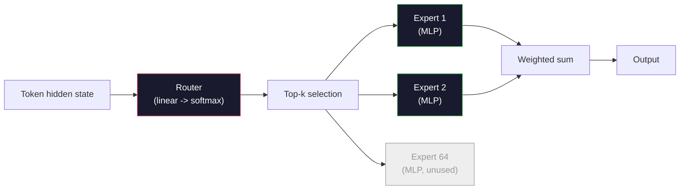

# Model Terbuka: Panduan Arsitektur

> kamu membuat GPT-2 Small dari awal di Lesson 04. Model Frontier Open pada tahun 2026 adalah keluarga yang sama dengan lima atau enam perubahan nyata. RMSNorm, bukan LayerNorm. SwiGLU bukan GELU. RoPE alih-alih posisi yang dipelajari. GQA atau MLA, bukan MHA penuh. Campuran Pakar dalam skala besar. Matematika yang sudah kamu ketahui mencakup 95% darinya. Lesson ini membaca Llama 3, DeepSeek-V3, Mixtral, Qwen, dan Gemma secara berdampingan dan menyebutkan garis persis di mana setiap arsitektur berbeda.

**Type:** Learn
**Language:** Python (stdlib)
**Prerequisites:** Fase 10, Lesson 04, 05, 12 (Pra-training, Penskalaan, Inference)
**Waktu:** ~45 menit

## Tujuan Pembelajaran

- Baca config.json Llama 3, Mistral, Mixtral, Gemma 2, Qwen 2.5, dan DeepSeek-V3 dan jelaskan setiap bidang
- Sebutkan perubahan arsitektur spesifik yang dibuat setiap model versus GPT-2 Small dan jelaskan berdasarkan prinsip pertama
- Hitung jumlah parameter, ukuran cache KV, dan memori activation untuk model terbuka apa pun hanya dari konfigurasinya
- Pilih model terbuka yang tepat untuk target penerapan dengan mempertimbangkan batasan latensi, memori, dan kemampuan

## Masalah

Pada Lesson 04 kamu menulis 350 baris numpy dan memiliki model berbentuk GPT-2. Llama 3 405B memiliki laporan teknis setebal 200 halaman. Naluri kamu adalah bahwa ini adalah binatang yang berbeda. Sebenarnya tidak. 200 halaman tersebut menjelaskan objek yang sama dengan lima atau enam modifikasi yang bermotivasi baik, ditambah seribu detail implementasi tentang penskalaan. Kerangka -- embedding, blok Transformer, attention, MLP, norm, kepala -- tidak berubah.

Lesson ini berbeda. Untuk setiap rangkaian model terbuka utama, kami mencantumkan dengan tepat apa yang berubah dari GPT-2, alasannya, dan berapa biayanya. Setelah selesai, kamu dapat membaca kartu model baru dan menerjemahkannya secara mental kembali ke garis dasar GPT-2.

Imbalan praktisnya adalah ketika Meta merilis Llama 5 atau DeepSeek merilis V4, kamu tidak memerlukan model mental baru. kamu akan melihat konfigurasinya, melihat kenop mana yang bergerak, dan mengetahui implikasi hilirnya. Arsitektur tahun 2026 adalah kotak peralatan yang terbatas. Setiap model baru memilih subset yang berbeda.

## Konsep

### Inti Invarian

Semua model terbuka autoregresif berbagi:

- Matrix embedding token (vocab_size x Hidden_dim).
- Tumpukan blok dekoder N: norm, attention diri, sisa, norm, MLP, sisa.
- Norm akhir dan head linier yang diproyeksikan ke vocab_size (seringkali terikat dengan weight dengan embeddings).
- Topeng kausal, kehilangan entropi silang token berikutnya.

Itulah bentuknya. Sisanya adalah tombol-tombol.

### Enam Kenop Yang Sebenarnya Bergerak

Di setiap model frontier open 2024-2026, enam pilihan desain yang sama selalu dipilih:

1. **Normalisasi.** LayerNorm -> RMSNorm.
2. **Pengkodean posisi.** Absolut yang dipelajari -> RoPE (plus varian: YaRN, NTK).
3. **Activation.** GELU -> SwiGLU (atau GeGLU).
4. **Berbagi attention head.** MHA -> GQA -> MQA -> MLA.
5. **MLP Padat vs MLP jarang.** Padat -> Campuran Pakar.
6. **Penempatan pra-norm.** Masa inap pra-norm. Pasca-norm telah hilang.

Segala sesuatu yang lain (learning rate schedule, campuran data, ukuran batch, panjang konteks) ada dalam konfigurasi training, bukan arsitektur. Enam tombol.

### Tombol 1: RMSNorm

LayerNorm mengurangi mean, membagi dengan std, skala, dan shift. RMSNorm hanya menyimpan skala:

```
RMSNorm(x) = x / sqrt(mean(x^2) + eps) * gamma
```

Tidak ada pengurangan berarti. Tidak ada bias. Satu matmul lebih sedikit per token. Zhang dan Sennrich (2019) berpendapat bahwa ini cocok dengan LayerNorm pada terjemahan mesin dan 10% lebih cepat. Setiap model terbuka modern menjalankannya.Biaya: tidak ada. Manfaat: kemenangan throughput kecil, code lebih sederhana.

### Kenop 2: Tali

Embedding posisi yang dipelajari adalah tabel pencarian 1024 slot di GPT-2. Konteks 1025 berada di luar jangkauan tabel. Model tidak dapat melakukan ekstrapolasi melebihi durasi training-nya.

Rotary Position Embedding (RoPE, Su et al. 2021) memasukkan posisi dengan memutar setiap vector Q dan K secara berpasangan sebelum perkalian titik attention. Sudut rotasi adalah fungsi deterministik dari posisi, jadi tidak ada yang dipelajari dan tidak ada yang kehabisan. Dengan trik penskalaan (interpolasi sadar NTK, YaRN), model yang dilatih pada konteks 8k dapat diperluas hingga 128k pada inference dengan sedikit kehilangan akurasi.

```
q_rotated = rotate(q, angle(pos))
k_rotated = rotate(k, angle(pos))
score = q_rotated . k_rotated
```

Setiap Llama, Mistral, Qwen, DeepSeek, dan Gemma menggunakan RoPE. Gemma 2 menggunakan hibrida (RoPE pada sebagian besar layer, attention jendela geser lokal pada layer lainnya).

### Tombol 3: SwiGLU

MLP GPT-2 adalah `x -> gelu(xW1 + b1) -> (...)W2 + b2`. SwiGLU (Shazeer 2020) menggantikan activation dengan produk yang terjaga keamanannya:

```
SwiGLU(x) = (xW1) * sigmoid(xW1) * xV
```

Dua proyeksi secara paralel, bukan satu, dilindungi oleh activation Swish. Secara empiris lebih kuat pada perplexity per parameter. Llama 2 mengadopsinya, semua orang mengikutinya. Ukuran tersembunyi MLP biasanya diatur sehingga jumlah parameter total cocok dengan MLP padat asli: jika GPT-2 menggunakan `ff_dim = 4 * hidden`, SwiGLU menggunakan `ff_dim = (2/3) * 4 * hidden = 8/3 * hidden`.

### Tombol 4: Berbagi Kepala Attention

GPT-2 menggunakan **Multi-Head Attention (MHA)**: setiap kepala memiliki proyeksi Q, K, V sendiri.

**Attention Multi-Kueri (MQA, Shazeer 2019)** berbagi satu K dan satu V di semua kepala. Memotong cache KV sebanyak num_heads, yang merupakan pengurangan 12x hingga 32x pada model biasa. Akurasi sedikit turun pada tolok ukur yang sulit.

**Attention Kueri yang Dikelompokkan (GQA, Ainslie dkk. 2023)** adalah jalan tengahnya: G grup kepala Q berbagi satu K dan satu V. Llama 3 8B menggunakan GQA dengan 32 kepala Q dan 8 kepala KV (G=8), sehingga cache KV menyusut 4x dibandingkan MHA penuh.

**Attention Laten Multi-Kepala (MLA, DeepSeek 2024)** memampatkan K dan V menjadi laten peringkat rendah bersama, memproyeksikannya kembali ke atas per kepala. Lebih lanjut mengurangi cache KV sambil mempertahankan ekspresi per kepala. DeepSeek-V2 dan V3 mengandalkan ini untuk kinerja konteks panjangnya.

| Skema | Kepala KV | Tembolok KV | Akurasi |
|--------|----------|----------|----------|
| MHA | nomor_kepala | penuh | terbaik |
| GQA | jumlah_grup (G < jumlah_kepala) | num_heads / pengurangan G | dekat-MHA |
| MQA | 1 | pengurangan jumlah_kepala | pukulan kecil |
| MLA | dekompresi laten per kepala | lebih kecil dari MQA | dekat-MHA |

Untuk model apa pun dengan parameter di atas ~13B, GQA atau MLA wajib diterapkan. MHA penuh dalam skala besar adalah bencana cache KV.

### Tombol 5: Campuran Para Ahli

MLP padat mengaktifkan semua parameternya untuk setiap token. MLP MoE memiliki K ahli per blok dan router yang memilih k ahli teratas per token (biasanya top-2). Hanya weight para ahli yang melihat peluang maju untuk token itu.

```
router_logits = xW_r
indices, weights = top_k(router_logits, k=2)
output = sum_i weights[i] * expert[indices[i]](x)
```

Daya tariknya: kamu dapat memiliki 64 pakar dengan ukuran masing-masing 7B (jadi jumlah total param sangat besar) sambil hanya menjalankan 2 pakar per token (sehingga komputasi per token cocok dengan model 7B yang padat). Mixtral 8x7B memiliki total 47B parameter tetapi hanya mengaktifkan 13B per token. DeepSeek-V3 memiliki total 671 miliar parameter tetapi hanya mengaktifkan 37 miliar per token.



Kelebihan: komputasi yang sama, lebih banyak parameter, kapasitas lebih baik. Kontra: memori ahli masih harus berada di suatu tempat (jadi penyajian memerlukan lebih banyak VRAM daripada yang setara), sulit untuk menyeimbangkan weight router, dan menyempurnakan router selama penyelarasan adalah bidang penelitiannya sendiri.

### Tombol 6: Masa inap sebelum normalTrafo asli menerapkan norm layer setelah setiap sublayer. Setiap model terbuka sejak GPT-2 menempatkannya *sebelum* setiap sublayer. Pra-norm lebih mudah untuk dilatih secara mendalam. Tidak ada yang perlu diperdebatkan.

### Perbedaan Model per Model

Berikut adalah tabel yang membuat semua ini menjadi nyata.

| Model | Tahun | Jumlah Param | Param Aktif | Norm | Activation | Posisi | Attention | Kementerian Lingkungan Hidup | Konteks |
|-------|------|-------------|--------------|------|-----------|----------|-----------|-----|---------|
| GPT-2 Kecil | 2019 | 124M | 124M | Norm Layer | GELU | Dipelajari | MHA (12 kepala) | tidak | 1k |
| Lama 3 8B | 2024 | 8B | 8B | RMSNorm | SwiGLU | Tali | GQA (32/8) | tidak | 128k |
| Lama 3 70B | 2024 | 70B | 70B | RMSNorm | SwiGLU | Tali | GQA (64/8) | tidak | 128k |
| Lama 3 405B | 2024 | 405B | 405B | RMSNorm | SwiGLU | Tali | GQA (128/16) | tidak | 128k |
| Mistral 7B | 2023 | 7.2B | 7.2B | RMSNorm | SwiGLU | Tali | GQA | tidak | 32k |
| Campuran 8x7B | 2023 | 47B | 13B | RMSNorm | SwiGLU | Tali | GQA | ya (8 ahli, 2 teratas) | 32k |
| Permata 2 9B | 2024 | 9B | 9B | RMSNorm (pra+posting) | GeGLU | Tali + geser | GQA | tidak | 8k |
| Qwen 2.5 72B | 2024 | 72B | 72B | RMSNorm | SwiGLU | Tali (Benang) | GQA (64/8) | tidak | 128k |
| DeepSeek V2 236B | 2024 | 236B | 21B | RMSNorm | SwiGLU | Tali | MLA | ya (160 ahli, 6 teratas) | 128k |
| Pencarian Dalam V3 | 2024 | 671B | 37B | RMSNorm | SwiGLU | Tali | MLA | ya (256 pakar, peringkat 8 teratas) | 128k |

Pindai kolomnya. RMSNorm bersifat universal. SwiGLU atau sepupunya GeGLU bersifat universal. Tali PE bersifat universal. GQA bersifat universal di atas 7B kecuali jika digantikan oleh MLA. MoE adalah pembeda di ujung atas.

### Membaca config.json

Konfigurasi Llama 3 8B:

```
{
  "hidden_size": 4096,
  "intermediate_size": 14336,
  "num_hidden_layers": 32,
  "num_attention_heads": 32,
  "num_key_value_heads": 8,
  "max_position_embeddings": 131072,
  "rope_theta": 500000.0,
  "rms_norm_eps": 1e-5,
  "vocab_size": 128256
}
```

Setiap bidang berhubungan dengan sesuatu yang telah kamu terapkan.

- `hidden_size`: embed dimension.
- `intermediate_size`: Ukuran tersembunyi MLP (3,5x tersembunyi -- matematika SwiGLU).
- `num_hidden_layers`: kedalaman tumpukan.
- `num_attention_heads`: Kepala Q.
- `num_key_value_heads`: Kepala KV (GQA).
- `max_position_embeddings`: durasi konteks training.
- `rope_theta`: Frekuensi dasar Tali. Meta menskalakannya dari default 10k menjadi 500k untuk ekstrapolasi konteks panjang.
- `rms_norm_eps`: stabilitas numerik.
- `vocab_size`: token.

Dari sini saja kamu menghitung parameter total, cache KV, dan memori activation puncak. Lihat `code/main.py` untuk mengetahui rumus pastinya.

### Anggaran memori activation

Activation mendominasi memori training di atas beberapa miliar parameter. Aturan praktis untuk pra-training (dengan titik pemeriksaan gradient):

```
activation_mem ~ batch_size * seq_len * hidden_size * num_layers * bytes_per_element
```

Untuk Llama 3 8B pada batch 1, seq 8192, BF16, 32 layer, tersembunyi 4096: kira-kira 8 GB hanya untuk activation dengan checkpointing, 40 GB tanpa. Inilah sebabnya mengapa flash-attention dan ring-attention penting -- keduanya menulis ulang perhitungan attention sehingga activation sesuai.

### Anggaran KV Cache

Untuk inference pada konteks maksimal:

```
kv_cache = 2 * num_layers * num_kv_heads * head_dim * max_seq_len * bytes_per_element
```

Llama 3 8B pada konteks 128k, BF16, head_dim = tersembunyi / num_heads = 128:
`2 * 32 * 8 * 128 * 131072 * 2 = 17.2 GB` per urutan.

Weight 8B adalah 16 GB di BF16. Cache KV untuk satu urutan 128k lebih besar daripada bobotnya. Ini adalah tekanan memori yang mendorong penelitian kuantisasi cache GQA, MLA, dan KV.

### Saat Setiap Model Menang- **GPU 80GB tunggal, tanpa MoE**: Llama 3 8B, Mistral 7B, Gemma 2 9B. Mudah disajikan, perkakas lebar.
- **Node tunggal (8x80GB), kapasitas besar**: Llama 3 70B, Qwen 2.5 72B. Kemampuan terbuka padat tertinggi.
- **Kemampuan terbuka terbesar, menerima kompleksitas MoE**: DeepSeek V3, Mixtral 8x22B. Kemampuan terbaik per FLOP aktif.
- **Kebutuhan konteks panjang**: Llama 3 (128k dengan penskalaan RoPE), DeepSeek (keunggulan MLA).
- **Penyajian latensi rendah**: Gemma 2 9B (jendela geser memotong komputasi konteks panjang).

## Build

Code pelajarannya adalah kalkulator. Dengan config.json apa pun, ia mencetak jumlah parameter berdasarkan komponen, cache KV pada konteks maksimal, rasio SwiGLU MLP, dan keputusan singkat tentang arsitektur (padat/GQA/MLA/MoE).

```python
config = {
    "hidden_size": 4096, "intermediate_size": 14336,
    "num_hidden_layers": 32, "num_attention_heads": 32,
    "num_key_value_heads": 8, "vocab_size": 128256,
    "max_position_embeddings": 131072,
}
```

Skrip menelusuri arsitektur bidang demi bidang, menghitung jumlah parameter untuk embedding, attention (dengan pengurangan GQA), MLP (dengan perluasan SwiGLU), norm layer, dan head. Ia kemudian menghitung cache KV pada panjang konteks yang dinyatakan dan mencetak ringkasan.

Lihat `code/main.py` untuk penerapannya.

## Pakai

Jalankan kalkulator pada konfigurasi Llama 3 8B, Mistral 7B, Mixtral 8x7B, dan DeepSeek V3 yang disertakan dalam skrip. Bandingkan rincian parameter. Perhatikan bahwa model MoE memiliki jumlah parameter total yang jauh lebih kecil daripada model padat, namun jumlah parameter aktif seringkali lebih kecil. Perhatikan bahwa cache KV DeepSeek V3 lebih kecil daripada Llama 3 405B meskipun memiliki lebih banyak parameter total -- itulah cara kerja MLA.

Kemudian masukkan konfigurasi untuk model apa pun yang kamu miliki secara lokal, baca ringkasannya, dan putuskan apakah itu cocok dengan GPU kamu.

## Kirim

Lesson ini menghasilkan `outputs/skill-open-model-picker.md`. Mengingat target penerapan (tipe GPU, VRAM, panjang konteks, anggaran latensi) dan profil tugas (obrolan, code, penalaran, konteks panjang), model ini merekomendasikan model terbuka, skema kuantisasi dari Lesson 11, dan tumpukan inference dari Lesson 12, dengan alasan eksplisit tentang enam tombol arsitektur.

## Latihan

1. Baca konfigurasi Qwen 2.5 72B dari HuggingFace. Hitung parameter total dari awal. Bandingkan dengan nilai yang dilaporkan HF dan identifikasi dari mana delta berasal (pembulatan head dim, faktor pembagian KV, dll.).

2. DeepSeek V3 menggunakan 256 expert dengan routing top-8. Hitung rasio pakar yang diaktifkan dengan total pakar dan bandingkan dengan 2 teratas Mixtral 8x7B sebesar 8. Apa arti peralihan dari jarang (25%) ke lebih padat jarang (3%) mengenai kapasitas per FLOP?

3. Hitung cache KV untuk Llama 3 405B pada konteks 128k di FP8 dan BF16. Di FP8 jumlahnya setengah dari angka BF16. Berapa banyak urutan paralel yang dapat kamu layani pada satu node 8xH100 (masing-masing 80 GB = total 640 GB, dikurangi memori berat)?

4. Gemma 2 mengganti layer attention penuh dan jendela geser. Tulis perhitungan untuk cache KV ketika separuh layer menggunakan jendela geser token 4096, bukan konteks penuh. Berapa banyak memori yang dihemat pada konteks total 8k?

5. Temukan model frontier open terbaru yang dirilis setelah lesson ini ditulis. Identifikasi yang mana dari enam kenop yang dipilihnya dan apakah ia memperkenalkan kenop ketujuh. Kurikulum akan terasa ketinggalan zaman saat arsitektur baru dikirimkan -- tujuannya adalah memperbarui tabel kamu tanpa membangun kembali model mental kamu.

## Istilah Kunci| Istilah | Apa kata orang | Apa sebenarnya arti |
|------|----------------|----------------------|
| RMSNorm | "LayerNorm tanpa maksud" | Normalisasikan berdasarkan akar rata-rata kuadrat saja, dengan skala yang dipelajari — lebih murah dan sebanding dengan LayerNorm |
| Tali | "Posisi putar" | Putar setiap vector Q dan K dalam pasangan 2D dengan sudut yang bergantung pada posisi — mengekstrapolasi melebihi panjang latihan dengan trik penskalaan |
| SwiGLU | "Activation MLP baru" | Unit linier berpagar dengan Swish: `(xW1) * sigmoid(xW1) * xV` — standar di setiap model terbuka 2024+ |
| GQA | "Attention jalan tengah" | Attention Kueri yang Dikelompokkan: Grup G dari kepala Q berbagi satu kepala K dan satu kepala V — mengecilkan cache KV tanpa mencapai akurasi MQA |
| MLA | "Attention DeepSeek" | Attention Laten Multi-Kepala: kompres K/V menjadi laten peringkat rendah bersama, dekompresi per kepala — cache KV terkecil untuk model besar |
| Kementerian Lingkungan Hidup | "Pakar yang jarang" | Campuran Pakar: N MLP per blok, router memilih k teratas per token — total param yang sangat besar, param aktif yang kecil |
| Perutean k teratas | "Pilih k pakar per token" | Router menghitung skor per pakar dan mengaktifkan k tertinggi — k tipikal adalah 2 (Mixtral) hingga 8 (DeepSeek) |
| BENANG | "Tali Peregangan" | Ekstensi RoPE lainnya — menginterpolasi sudut putar untuk memperluas konteks dari 8k menjadi 128k+ pada waktu inference |
| Attention jendela geser | "Jangan mengurus semuanya" | Setiap token hanya menangani token W terakhir — membatasi biaya attention sebesar O(W) per token, digunakan di Gemma 2 dan Mistral |
| Param aktif | "Apa yang berjalan per token" | Untuk model MoE, jumlah parameter yang melihat forward pass per token (jauh lebih kecil dari total parameter) — mengatur FLOP per token |

## Bacaan Lanjutan

- [Dubey et al., 2024 -- "The Llama 3 Herd of Models"](https://arxiv.org/abs/2407.21783) -- referensi arsitektur dan training untuk keluarga Llama 3 yang padat
- [DeepSeek-AI, 2024 -- "Laporan Teknis DeepSeek-V3"](https://arxiv.org/abs/2412.19437) -- MLA plus penyeimbangan weight bebas loss tambahan ditambah 671B MoE
- [Jiang et al., 2024 -- "Mixtral of Experts"](https://arxiv.org/abs/2401.04088) -- makalah model terbuka MoE kanonik
- [Su et al., 2021 -- "RoFormer: Transformer yang Ditingkatkan dengan Embedding Posisi Putar"](https://arxiv.org/abs/2104.09864) -- makalah RoPE
- [Shazeer, 2020 -- "Varian GLU Meningkatkan Transformer"](https://arxiv.org/abs/2002.05202) -- SwiGLU, GeGLU, dan teman-teman
- [Ainslie et al., 2023 -- "GQA: Training Model Transformer Multi-Query Umum"](https://arxiv.org/abs/2305.13245) -- makalah GQA
- [Tim Gemma 2, 2024 -- "Gemma 2: Meningkatkan Model Bahasa Terbuka pada Ukuran Praktis"](https://arxiv.org/abs/2408.00118) -- attention penuh+sliding hybrid, sebelum+pasca-norm
- [Tim Qwen, 2024 -- "Laporan Teknis Qwen 2.5"](https://arxiv.org/abs/2412.15115) -- ekstensi konteks YaRN dan resep training konteks panjang
