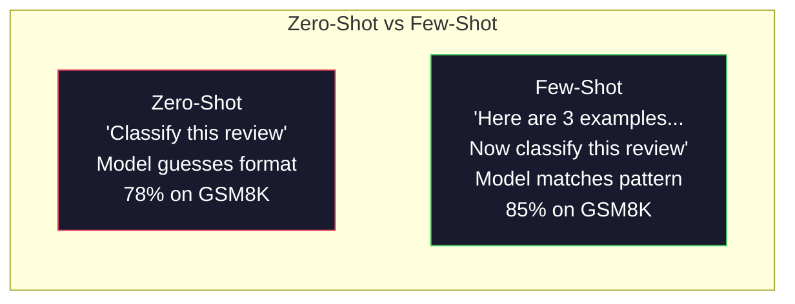
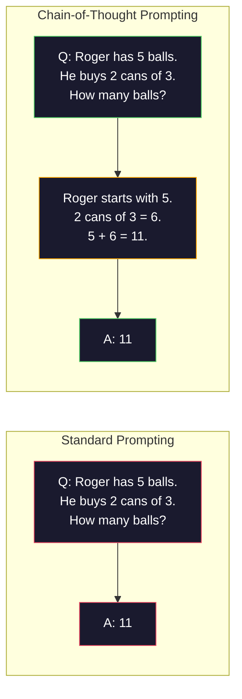
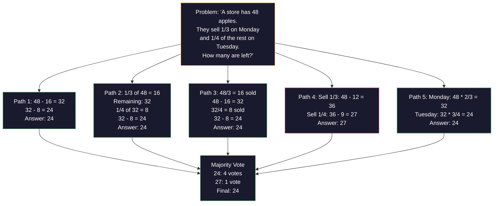
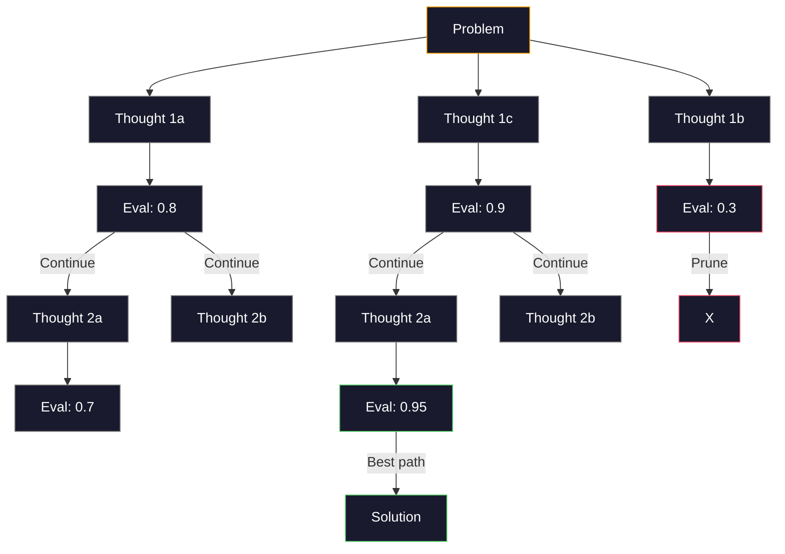

# Sedikit Tembakan, Rantai Pemikiran, Pohon Pemikiran

> Memberi tahu model apa yang harus dilakukan adalah sebuah dorongan. Menunjukkan cara berpikir adalah rekayasa. Kesenjangan antara akurasi 78% dan 91% pada model yang sama, tugas yang sama, data yang sama bukanlah model yang lebih baik. Ini adalah strategi penalaran yang lebih baik.

**Type:** Build
**Language:** Python
**Prerequisites:** Lesson 11.01 (Rekayasa Cepat)
**Waktu:** ~45 menit

## Tujuan Pembelajaran

- Menerapkan beberapa langkah dengan memilih dan memformat contoh demonstrasi yang memaksimalkan akurasi tugas
- Menerapkan penalaran rantai pemikiran (CoT) untuk meningkatkan akurasi pada soal multi-langkah seperti soal kata matematika
- Membangun pohon pemikiran yang mengeksplorasi berbagai jalur penalaran dan memilih yang terbaik
- Ukur peningkatan akurasi dari zero-shot vs some-shot vs CoT pada benchmark standar

## Masalah

kamu membuat aplikasi bimbingan belajar matematika. Prompt kamu berbunyi: "Selesaikan masalah kata ini." GPT-5 menyelesaikan 94% waktunya dengan benar di GSM8K, standar tolok ukur matematika sekolah dasar. kamu pikir kamu sudah mencapai puncaknya. kamu tidak melakukannya — rantai pemikiran masih menambah 3-4 poin.

Tambahkan lima kata -- "Mari kita berpikir langkah demi langkah" -- dan akurasinya melonjak hingga 91%. Tambahkan beberapa contoh yang berhasil dan mencapai 95%. Model yang sama. Suhu yang sama. Biaya API yang sama. Satu-satunya perbedaan adalah kamu memberikan kertas gores pada modelnya.

Ini bukan peretasan. Begitulah cara kerja penalaran. Manusia tidak memecahkan masalah yang bertingkat-tingkat dalam satu lompatan mental. Transformer juga tidak. Saat kamu memaksa model untuk menghasilkan token perantara, token tersebut menjadi bagian dari konteks token berikutnya. Setiap langkah penalaran memberi input pada langkah berikutnya. Model ini benar-benar menghitung jalan menuju jawabannya.

Namun "berpikir selangkah demi selangkah" adalah permulaan, bukan akhir. Bagaimana jika kamu mengambil sample lima jalur penalaran dan meraih suara mayoritas? Bagaimana jika kamu membiarkan model mengeksplorasi serangkaian kemungkinan, mengevaluasi dan memangkas cabang? Bagaimana jika kamu menyisipkan penalaran dengan penggunaan alat? Ini bukanlah hipotesis. Itu adalah teknik yang dipublikasikan dengan peningkatan terukur, dan kamu akan membangun semuanya dalam lesson ini.

## Konsep

### Zero-Shot vs Few-Shot: Saat Contoh Mengalahkan Instruksi

Prompt zero-shot memberi model tugas dan tidak ada yang lain. Bisikan singkat memberikan contoh terlebih dahulu.

Wei dkk. (2022) mengukur hal ini pada 8 tolok ukur. Untuk tugas sederhana seperti klasifikasi sentimen, zero-shot dan some-shot dilakukan dalam distance 2% satu sama lain. Untuk tugas-tugas kompleks seperti aritmatika multi-langkah dan penalaran simbolik, beberapa tembakan meningkatkan akurasi sebesar 10-25%.

Intuisi: contoh adalah instruksi terkompresi. Alih-alih menjelaskan format output, kamu menunjukkannya. Alih-alih menjelaskan proses penalaran, kamu mendemonstrasikannya. Pencocokan pola model pada contoh lebih andal daripada menafsirkan instruksi abstrak.



**Ketika beberapa kesempatan menang:** tugas yang sensitif terhadap format, klasifikasi, ekstraksi terstruktur, jargon khusus domain, tugas apa pun yang modelnya harus cocok dengan pola tertentu.

**Ketika zero-shot menang:** pertanyaan faktual sederhana, tugas kreatif di mana contoh membatasi kreativitas, tugas di mana menemukan contoh yang baik lebih sulit daripada menulis instruksi yang baik.

### Contoh Pilihan: Ketukan Serupa Acak

Tidak semua contoh sama. Memilih contoh yang serupa dengan input target mengungguli pemilihan acak sebesar 5-15% pada tugas klasifikasi (Liu et al., 2022). Tiga prinsip:1. **Kesamaan semantik**: pilih contoh yang paling dekat dengan input dalam ruang embedding
2. **Keberagaman label**: mencakup semua kategori output dalam contoh kamu
3. **Pencocokan kesulitan**: mencocokkan tingkat kompleksitas masalah target

Jumlah contoh optimal untuk sebagian besar tugas adalah 3-5. Di bawah 3, model tidak memiliki cukup sinyal untuk mengekstrak polanya. Di atas 5, kamu mencapai hasil yang semakin berkurang dan membuang token jendela konteks. Untuk klasifikasi dengan banyak label, gunakan satu contoh per label.

### Rantai Pemikiran: Memberikan Kertas Goresan Model

Dorongan Chain-of-Thought (CoT) diperkenalkan oleh Wei et al. (2022) di Google Otak. Idenya sederhana: alih-alih hanya menanyakan jawabannya kepada model, mintalah model untuk menunjukkan langkah-langkah alasannya terlebih dahulu.



Mengapa ini bekerja secara mekanis? Setiap token yang dihasilkan Transformer menjadi konteks untuk token berikutnya. Tanpa CoT, model harus memampatkan semua alasan ke dalam keadaan tersembunyi dari satu forward pass. Dengan CoT, model ini mengeksternalisasi komputasi perantara sebagai token. Setiap token penalaran memperluas kedalaman komputasi efektif.

**Tolok ukur GSM8K (matematika sekolah dasar, 8,5 ribu soal):**

| Model | Tembakan Nol | CoT Tembakan Nol | CoT Sedikit Tembakan |
|-------|-----------|---------------|--------------|
| GPT-4o | 78% | 91% | 95% |
| GPT-5 | 94% | 97% | 98% |
| o4-mini (penalaran) | 97% | — | — |
| Claude Opus 4.7 | 93% | 97% | 98% |
| Gemini 3 Pro | 92% | 96% | 98% |
| Lama 4 70B | 80% | 89% | 94% |
| DeepSeek-V3.1 | 89% | 94% | 96% |

**Catatan tentang model penalaran.** Model seperti o-series OpenAI (o3, o4-mini) dan DeepSeek-R1 menjalankan rantai pemikiran secara internal sebelum mengeluarkan jawabannya. Menambahkan "Mari kita berpikir selangkah demi selangkah" ke dalam model penalaran adalah hal yang mubazir dan terkadang kontraproduktif — mereka sudah melakukannya.

Dua rasa CoT:

**CoT Zero-shot**: tambahkan "Mari berpikir langkah demi langkah" ke prompt. Tidak diperlukan contoh. Kojima dkk. (2022) menunjukkan kalimat tunggal ini meningkatkan akurasi dalam tugas aritmatika, akal sehat, dan penalaran simbolik.

**CoT beberapa kali**: berikan contoh yang mencakup langkah-langkah penalaran. Lebih efektif daripada CoT zero-shot karena model melihat format penalaran yang kamu harapkan.

**Ketika CoT menyakitkan**: ingatan faktual sederhana ("Apa ibu kota Prancis?"), klasifikasi satu langkah, tugas yang mengutamakan kecepatan daripada akurasi. CoT menambahkan 50-200 token overhead penalaran per kueri. Untuk tugas dengan throughput tinggi dan kompleksitas rendah, hal tersebut merupakan biaya yang terbuang.

### Konsistensi Diri: Sample Banyak, Pilih Sekali

Wang dkk. (2023) memperkenalkan konsistensi diri. Wawasan: satu jalur CoT mungkin mengandung kesalahan penalaran. Namun jika kamu mengambil sample N jalur penalaran independen (menggunakan suhu > 0) dan mengambil suara mayoritas pada jawaban akhir, kesalahan akan hilang.



Konsistensi mandiri meningkatkan akurasi GSM8K dari 56,5% (CoT tunggal) menjadi 74,4% dengan N=40 pada eksperimen PaLM 540B asli. Pada GPT-5, peningkatannya kecil (97% hingga 98%) karena akurasi dasar sudah jenuh. Teknik ini paling efektif pada model dengan akurasi CoT dasar 60-85% -- titik terbaik di mana kesalahan jalur tunggal sering terjadi tetapi tidak sistematis. Untuk model penalaran (o-series, R1) konsistensi diri dimasukkan ke dalam pengambilan sample internal bawaan.

Keuntungannya: N sample berarti Nx biaya dan latensi API. Dalam praktiknya, N=5 memperoleh sebagian besar manfaat. N=3 adalah jumlah minimum untuk pemungutan suara yang bermakna. N > 10 mempunyai hasil yang semakin berkurang untuk sebagian besar tugas.

### Pohon Pemikiran: Eksplorasi BercabangYao dkk. (2023) memperkenalkan Tree-of-Thought (ToT). Jika CoT mengikuti satu jalur penalaran linier, ToT mengeksplorasi banyak cabang dan mengevaluasi mana yang paling menjanjikan sebelum melanjutkan.



ToT memiliki tiga komponen:

1. **Pembuatan pemikiran**: menghasilkan banyak kandidat untuk langkah selanjutnya
2. **Evaluasi negara bagian**: menilai setiap kandidat (dapat menggunakan LLM itu sendiri sebagai evaluator)
3. **Algoritma pencarian**: BFS atau DFS melalui pohon, memangkas cabang dengan skor rendah

Pada tugas Game of 24 (menggabungkan 4 angka menggunakan aritmatika menjadi 24), GPT-4 dengan prompt standar menyelesaikan 7,3% masalah. Dengan CoT, 4.0% (CoT sebenarnya merugikan di sini karena ruang pencariannya luas). Dengan ToT, 74%.

ToT itu mahal. Setiap node di pohon memerlukan panggilan LLM. Sebuah pohon dengan faktor percabangan 3 dan kedalaman 3 memerlukan hingga 39 panggilan LLM. Gunakan hanya untuk masalah yang ruang pencariannya besar namun dapat dievaluasi -- perencanaan, pemecahan teka-teki, pemecahan masalah secara kreatif dengan batasan.

### Bereaksi: Berpikir + Melakukan

Yao dkk. (2022) menggabungkan jejak penalaran dengan tindakan. Model tersebut bergantian antara berpikir (menghasilkan penalaran) dan bertindak (memanggil alat, mencari, menghitung).

```mermaid
graph LR
    Q["Question:\nWhat is the\npopulation of the\ncountry where\nthe Eiffel Tower\nis located?"]
    T1["Thought: I need to\nfind which country\nhas the Eiffel Tower"]
    A1["Action: search\n'Eiffel Tower location'"]
    O1["Observation:\nParis, France"]
    T2["Thought: Now I need\nFrance's population"]
    A2["Action: search\n'France population 2024'"]
    O2["Observation:\n68.4 million"]
    T3["Thought: I have\nthe answer"]
    F["Answer:\n68.4 million"]

    Q --> T1 --> A1 --> O1 --> T2 --> A2 --> O2 --> T3 --> F

    style Q fill:#1a1a2e,stroke:#ffa500,color:#fff
    style T1 fill:#1a1a2e,stroke:#51cf66,color:#fff
    style A1 fill:#1a1a2e,stroke:#e94560,color:#fff
    style O1 fill:#1a1a2e,stroke:#808080,color:#fff
    style T2 fill:#1a1a2e,stroke:#51cf66,color:#fff
    style A2 fill:#1a1a2e,stroke:#e94560,color:#fff
    style O2 fill:#1a1a2e,stroke:#808080,color:#fff
    style T3 fill:#1a1a2e,stroke:#51cf66,color:#fff
    style F fill:#1a1a2e,stroke:#51cf66,color:#fff
```



ReAct mengungguli CoT murni pada tugas-tugas yang membutuhkan banyak pengetahuan karena dapat mendasarkan alasannya pada data nyata. Di HotpotQA (menjawab pertanyaan multi-hop), ReAct dengan GPT-4 mencapai 35,1% pencocokan tepat vs 29,4% untuk CoT saja. Kekuatan sebenarnya adalah kesalahan penalaran diperbaiki melalui observasi -- model dapat memperbarui rencananya di tengah eksekusi.

ReAct adalah dasar dari agen AI modern. Setiap framework agen (LangChain, CrewAI, AutoGen) mengimplementasikan beberapa varian dari loop Pemikiran-Aksi-Pengamatan. kamu akan membangun agen penuh di Fase 14. Lesson ini mencakup pola bisikan.

### Prompt Terstruktur: Tag XML, Pembatas, Header

Saat petunjuknya menjadi rumit, struktur mencegah model membingungkan bagian-bagiannya. Tiga pendekatan:

**Tag XML** (berfungsi paling baik dengan Claude, solid di mana saja):
```
<context>
You are reviewing a pull request.
The codebase uses TypeScript and React.
</context>

<task>
Review the following diff for bugs, security issues, and style violations.
</task>

<diff>
{diff_content}
</diff>

<output_format>
List each issue with: file, line, severity (critical/warning/info), description.
</output_format>
```

**Header penurunan harga** (universal):
```
## Role
Senior security engineer at a fintech company.

## Task
Analyze this API endpoint for vulnerabilities.

## Input
{api_code}

## Rules
- Focus on OWASP Top 10
- Rate each finding: critical, high, medium, low
- Include remediation steps
```

**Pembatas** (minimal namun efektif):
```
---INPUT---
{user_text}
---END INPUT---

---INSTRUCTIONS---
Summarize the above in 3 bullet points.
---END INSTRUCTIONS---
```

### Rangkaian Cepat: Decomposition Berurutan

Beberapa tugas terlalu rumit untuk dilakukan dalam satu prompt. Rangkaian prompt memecahnya menjadi beberapa langkah, dimana output dari satu prompt menjadi input untuk prompt berikutnya.


Chaining mengalahkan single-prompt karena tiga alasan:

1. **Setiap langkah lebih sederhana**: model menangani satu tugas terfokus alih-alih mengatur semuanya
2. **Output perantara dapat diperiksa**: kamu dapat memvalidasi dan mengoreksi antar langkah
3. **Langkah yang berbeda dapat menggunakan model yang berbeda**: gunakan model yang murah untuk ekstraksi, model yang mahal untuk penalaran

### Perbandingan Kinerja| Teknik | Terbaik Untuk | Akurasi GSM8K (GPT-5) | Panggilan API | Token Overhead | Kompleksitas |
|-----------|----------|------------------------|-----------|----------------|------------|
| Tembakan Nol | Tugas sederhana | 94% | 1 | Tidak ada | Sepele |
| Sedikit Tembakan | Pencocokan format | 96% | 1 | 200-500 token | Rendah |
| CoT Tembakan Nol | Peningkatan penalaran cepat | 97% | 1 | 50-200 token | Sepele |
| CoT Sedikit Tembakan | Akurasi panggilan tunggal maksimum | 98% | 1 | 300-600 token | Rendah |
| Konsistensi Diri (N=5) | Penalaran berisiko tinggi | 98,5% | 5 | biaya token 5x | Sedang |
| Model penalaran (o4-mini) | Penggantian CoT drop-in | 97% | 1 | tersembunyi (2-10x internal) | Sepele |
| Pohon Pemikiran | Masalah pencarian/perencanaan | T/A (74% pada Game 24) | 10-40+ | Biaya token 10-40x | Tinggi |
| Bereaksi | Penalaran berbasis pengetahuan | T/A (35,1% di HotpotQA) | 3-10+ | Variabel | Tinggi |
| Rantai Cepat | Tugas multi-langkah yang kompleks | 96% (pipeline pipa) | 2-5 | Biaya token 2-5x | Sedang |

Teknik yang tepat bergantung pada tiga faktor: persyaratan akurasi, anggaran latensi, dan toleransi biaya. Untuk sebagian besar sistem produksi, CoT beberapa kali dengan fallback konsistensi mandiri 3 sample mencakup 90% kasus penggunaan.

## Build

Kami akan membangun pemecah masalah matematika yang menggabungkan beberapa langkah, penalaran rantai pemikiran, dan pemungutan suara konsistensi diri ke dalam satu pipeline. Kemudian kami akan menambahkan pohon pemikiran untuk masalah-masalah sulit.

Implementasi selengkapnya ada di `code/advanced_prompting.py`. Berikut adalah komponen utamanya.

### Langkah 1: Penyimpanan Contoh Sedikit Pemotretan

Komponen pertama mengelola beberapa contoh contoh dan memilih contoh yang paling relevan untuk masalah tertentu.

```python
GSM8K_EXAMPLES = [
    {
        "question": "Janet's ducks lay 16 eggs per day. She eats three for breakfast every morning and bakes muffins for her friends every day with four. She sells every egg at the farmers' market for $2. How much does she make every day at the farmers' market?",
        "reasoning": "Janet's ducks lay 16 eggs per day. She eats 3 and bakes 4, using 3 + 4 = 7 eggs. So she has 16 - 7 = 9 eggs left. She sells each for $2, so she makes 9 * 2 = $18 per day.",
        "answer": "18"
    },
    ...
]
```

Setiap contoh memiliki tiga bagian: pertanyaan, rantai penalaran, dan jawaban akhir. Rantai penalaran inilah yang mengubah contoh beberapa contoh biasa menjadi contoh beberapa contoh CoT.

### Langkah 2: Pembuat Prompt Rantai Pemikiran

Pembuat prompt menyusun pesan sistem, beberapa contoh dengan rantai penalaran, dan pertanyaan target menjadi satu prompt.

```python
def build_cot_prompt(question, examples, num_examples=3):
    system = (
        "You are a math problem solver. "
        "For each problem, show your step-by-step reasoning, "
        "then give the final numerical answer on the last line "
        "in the format: 'The answer is [number]'."
    )

    example_text = ""
    for ex in examples[:num_examples]:
        example_text += f"Q: {ex['question']}\n"
        example_text += f"A: {ex['reasoning']} The answer is {ex['answer']}.\n\n"

    user = f"{example_text}Q: {question}\nA:"
    return system, user
```

Batasan format ("Jawabannya adalah [angka]") sangat penting. Tanpanya, konsistensi diri tidak dapat mengekstraksi dan membandingkan jawaban antar sample.

### Langkah 3: Pemungutan Suara Konsistensi Diri

Contoh N jalur penalaran dan ambil jawaban mayoritas.

```python
def self_consistency_solve(question, examples, client, model, n_samples=5):
    system, user = build_cot_prompt(question, examples)

    answers = []
    reasonings = []
    for _ in range(n_samples):
        response = client.chat.completions.create(
            model=model,
            messages=[
                {"role": "system", "content": system},
                {"role": "user", "content": user}
            ],
            temperature=0.7
        )
        text = response.choices[0].message.content
        reasonings.append(text)
        answer = extract_answer(text)
        if answer is not None:
            answers.append(answer)

    vote_counts = Counter(answers)
    best_answer = vote_counts.most_common(1)[0][0] if vote_counts else None
    confidence = vote_counts[best_answer] / len(answers) if best_answer else 0

    return best_answer, confidence, reasonings, vote_counts
```

Suhu 0,7 itu penting. Pada suhu 0,0, semua N sample akan identik, sehingga tujuannya tidak tercapai. kamu memerlukan keacakan yang cukup untuk jalur penalaran yang beragam, tetapi tidak terlalu banyak sehingga model tersebut menghasilkan omong kosong.

### Langkah 4: Pemecah Pohon Pemikiran

Untuk permasalahan di mana penalaran linier gagal, ToT mengeksplorasi berbagai pendekatan dan mengevaluasi arah mana yang paling menjanjikan.

```python
def tree_of_thought_solve(question, client, model, breadth=3, depth=3):
    thoughts = generate_initial_thoughts(question, client, model, breadth)
    scored = [(t, evaluate_thought(t, question, client, model)) for t in thoughts]
    scored.sort(key=lambda x: x[1], reverse=True)

    for current_depth in range(1, depth):
        next_thoughts = []
        for thought, score in scored[:2]:
            extensions = extend_thought(thought, question, client, model, breadth)
            for ext in extensions:
                ext_score = evaluate_thought(ext, question, client, model)
                next_thoughts.append((ext, ext_score))
        scored = sorted(next_thoughts, key=lambda x: x[1], reverse=True)

    best_thought = scored[0][0] if scored else ""
    return extract_answer(best_thought), best_thought
```

Evaluator itu sendiri merupakan panggilan LLM. kamu bertanya kepada model: "Pada skala 0,0 hingga 1,0, seberapa menjanjikankah jalur penalaran ini untuk memecahkan masalah?" Inilah inti dari ToT -- model mengevaluasi solusi parsialnya sendiri.

### Langkah 5: Pipeline Penuh

Pipeline ini menggabungkan semua teknik dengan strategi eskalasi.

```python
def solve_with_escalation(question, examples, client, model):
    system, user = build_cot_prompt(question, examples)
    single_response = call_llm(client, model, system, user, temperature=0.0)
    single_answer = extract_answer(single_response)

    sc_answer, confidence, _, _ = self_consistency_solve(
        question, examples, client, model, n_samples=5
    )

    if confidence >= 0.8:
        return sc_answer, "self_consistency", confidence

    tot_answer, _ = tree_of_thought_solve(question, client, model)
    return tot_answer, "tree_of_thought", None
```

Logika eskalasinya: coba yang murah (single CoT) dulu. Jika keyakinan konsistensi diri di bawah 0,8 (kurang dari 4 dari 5 sample setuju), tingkatkan ke ToT. Hal ini menyeimbangkan biaya dan akurasi -- sebagian besar masalah diselesaikan dengan biaya murah, masalah sulit membutuhkan lebih banyak komputasi.

## Pakai

### Dengan LangChain

LangChain menyediakan dukungan bawaan untuk templat cepat dan penguraian output yang menyederhanakan pola beberapa pengambilan gambar dan CoT:

```python
from langchain_core.prompts import FewShotPromptTemplate, PromptTemplate
from langchain_openai import ChatOpenAI

example_prompt = PromptTemplate(
    input_variables=["question", "reasoning", "answer"],
    template="Q: {question}\nA: {reasoning} The answer is {answer}."
)

few_shot_prompt = FewShotPromptTemplate(
    examples=examples,
    example_prompt=example_prompt,
    suffix="Q: {input}\nA: Let's think step by step.",
    input_variables=["input"]
)

llm = ChatOpenAI(model="gpt-4o", temperature=0.7)
chain = few_shot_prompt | llm
result = chain.invoke({"input": "If a train travels 120 km in 2 hours..."})
```LangChain juga memiliki kelas `ExampleSelector` untuk pemilihan kesamaan semantik:

```python
from langchain_core.example_selectors import SemanticSimilarityExampleSelector
from langchain_openai import OpenAIEmbeddings

selector = SemanticSimilarityExampleSelector.from_examples(
    examples,
    OpenAIEmbeddings(),
    k=3
)
```

### Dengan DSPy

DSPy memperlakukan strategi pendorong sebagai modul yang dapat dioptimalkan. Daripada membuat prompt CoT, kamu menentukan tanda tangan dan membiarkan DSPy mengoptimalkan prompt tersebut:

```python
import dspy

dspy.configure(lm=dspy.LM("openai/gpt-4o", temperature=0.7))

class MathSolver(dspy.Module):
    def __init__(self):
        self.solve = dspy.ChainOfThought("question -> answer")

    def forward(self, question):
        return self.solve(question=question)

solver = MathSolver()
result = solver(question="Janet's ducks lay 16 eggs per day...")
```

`ChainOfThought` DSPy secara otomatis menambahkan jejak alasan. `dspy.majority` mengimplementasikan konsistensi diri:

```python
result = dspy.majority(
    [solver(question=q) for _ in range(5)],
    field="answer"
)
```

### Perbandingan: Dari Awal vs Framework

| Feature | Dari Awal (lesson ini) | Rantai Lang | DSPy |
|---------|--------------------------|-----------|------|
| Kontrol atas format cepat | Penuh | Berbasis template | Otomatis |
| Konsistensi diri | Pemungutan suara manual | Panduan | Terintegrasi (`dspy.majority`) |
| Contoh pemilihan | Logika khusus | `ExampleSelector` | `dspy.BootstrapFewShot` |
| Pohon Pemikiran | Pencarian pohon khusus | Rantai komunitas | Bukan bawaan |
| Optimization yang cepat | Iterasi manual | Panduan | Kompilasi otomatis |
| Terbaik untuk | Pembelajaran, pipeline pipa khusus | Alur kerja standar | Penelitian, optimization |

## Kirim

Lesson ini menghasilkan dua artefak.

**1. Reasoning Chain Prompt** (`outputs/prompt-reasoning-chain.md`): template prompt siap produksi untuk beberapa pengambilan gambar CoT dengan konsistensi mandiri. Masukkan contoh dan domain masalah kamu.

**2. Keterampilan Pemilihan Pola CoT** (`outputs/skill-cot-patterns.md`): kerangka keputusan untuk memilih teknik penalaran yang tepat berdasarkan jenis tugas, persyaratan akurasi, dan kendala biaya.

## Latihan

1. **Ukur jaraknya**: Ambil 10 soal GSM8K. Selesaikan masing-masing dengan CoT zero-shot, beberapa-shot, zero-shot, dan beberapa-shot CoT. Catat akurasi untuk masing-masing. Teknik manakah yang memberikan peningkatan terbesar pada model kamu?

2. **Eksperimen pemilihan contoh**: Untuk 10 soal yang sama, bandingkan pemilihan contoh acak dengan contoh serupa yang dipilih sendiri. Ukur perbedaan akurasi. Pada titik manakah contoh kualitas lebih penting daripada kuantitas contoh?

3. **Kurva biaya konsistensi mandiri**: Jalankan konsistensi mandiri dengan N=1, 3, 5, 7, 10 pada 20 soal GSM8K. Akurasi plot vs biaya (total token). Di manakah titik lengkung model kamu?

4. **Membangun loop ReAct**: Perluas pipeline dengan alat kalkulator. Saat model menghasilkan ekspresi matematika, jalankan dengan `eval()` Python (dalam kotak pasir) dan masukkan hasilnya kembali. Ukur apakah penalaran berbasis alat mengungguli CoT murni.

5. **ToT untuk tugas kreatif**: Sesuaikan pemecah Pohon Pemikiran untuk tugas menulis kreatif: "Tulis cerita 6 kata yang lucu dan sedih." Gunakan LLM sebagai evaluator. Apakah eksplorasi percabangan menghasilkan output kreatif yang lebih baik dibandingkan generasi single-shot?

## Istilah Kunci| Istilah | Apa kata orang | Apa sebenarnya arti |
|------|----------------|----------------------|
| Prompt beberapa tembakan | "Berikan beberapa contoh" | Menyertakan demonstrasi input-output dalam prompt untuk mengaitkan format dan perilaku output model |
| Rantai Pemikiran | "Buatlah berpikir selangkah demi selangkah" | Memunculkan token penalaran perantara yang memperluas komputasi efektif model sebelum menghasilkan jawaban akhir |
| Konsistensi Diri | "Jalankan beberapa kali" | Mengambil sample N jalur penalaran yang beragam pada suhu > 0 dan memilih jawaban akhir yang paling umum berdasarkan suara terbanyak |
| Pohon Pemikiran | "Biarkan ia mengeksplorasi opsi" | Pencarian terstruktur pada cabang-cabang penalaran dimana setiap solusi parsial dievaluasi dan hanya jalur menjanjikan yang diperluas |
| Bereaksi | "Berpikir + penggunaan alat" | Menyisipkan jejak penalaran dengan tindakan eksternal (pencarian, komputasi, panggilan API) dalam loop Pemikiran-Tindakan-Pengamatan |
| Rangkaian cepat | "Bagikan menjadi beberapa langkah" | Menguraikan tugas kompleks menjadi prompt berurutan di mana setiap output memberi input berikutnya |
| CoT tembakan nol | "Tambahkan saja 'berpikir langkah demi langkah'" | Menambahkan frase pemicu penalaran ke prompt tanpa contoh apa pun, mengandalkan kemampuan penalaran laten model |

## Bacaan Lanjutan

- [Dorongan Rantai Pemikiran Menimbulkan Penalaran dalam Large Language Model](https://arxiv.org/abs/2201.11903) -- Wei dkk. 2022. Makalah CoT asli dari Google Brain. Baca bagian 2-3 untuk hasil inti.
- [Konsistensi Diri Meningkatkan Penalaran Rantai Pemikiran dalam Model Bahasa](https://arxiv.org/abs/2203.11171) -- Wang dkk. 2023. Makalah Konsistensi Diri. Tabel 1 memiliki semua nomor yang kamu butuhkan.
- [Pohon Pemikiran: Pemecahan Masalah yang Disengaja dengan Large Language Model](https://arxiv.org/abs/2305.10601) -- Yao dkk. 2023. Makalah ToT. Hasil Game of 24 di bagian 4 menjadi sorotan.
- [ReAct: Mensinergikan Penalaran dan Tindakan dalam Model Bahasa](https://arxiv.org/abs/2210.03629) -- Yao dkk. 2022. Landasan agen AI modern. Bagian 3 menjelaskan putaran Pemikiran-Tindakan-Pengamatan.
- [Large Language Model adalah Zero-Shot Reasoner](https://arxiv.org/abs/2205.11916) -- Kojima dkk. 2022. Makalah “Mari kita berpikir selangkah demi selangkah”. Sangat efektif meskipun sederhana.
- [DSPy: Mengompilasi Panggilan Model Bahasa Deklaratif ke dalam Pipeline yang Berkembang Sendiri](https://arxiv.org/abs/2310.03714) -- Khattab dkk. 2023. Memperlakukan prompt sebagai masalah kompilasi. Baca jika kamu ingin beralih dari rekayasa cepat manual.
- [OpenAI — Panduan model penalaran](https://platform.openai.com/docs/guides/reasoning) -- panduan vendor tentang kapan rangkaian pemikiran menjadi mode "penalaran" internal dengan harga per token versus trik tingkat cepat.
- [Lightman dkk., "Mari Verifikasi Langkah demi Langkah" (2023)](https://arxiv.org/abs/2305.20050) -- model imbalan proses (PRM) yang menilai setiap langkah dalam sebuah rantai; sinyal pengawasan penalaran yang menghasilkan imbalan yang hanya menghasilkan hasil.
- [Snell et al., "Scaling LLM Test-Time Compute Optimally" (2024)](https://arxiv.org/abs/2408.03314) -- studi sistematis tentang panjang CoT, pengambilan sample konsistensi diri, dan MCTS; dimana "berpikir selangkah demi selangkah" digunakan ketika akurasi lebih penting daripada latensi.
