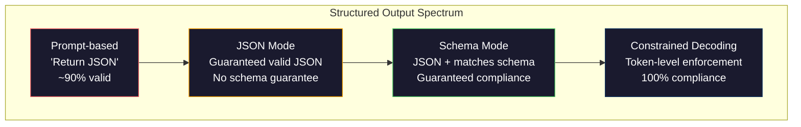
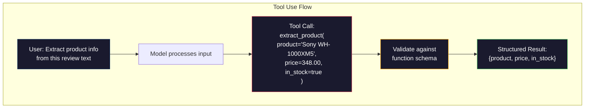

# Output Terstruktur: JSON, Validasi Skema, Decoding Terbatas

> LLM kamu mengembalikan sebuah string. Aplikasi kamu memerlukan JSON. Kesenjangan ini telah menghancurkan lebih banyak sistem produksi dibandingkan model halusinasi apa pun. Output terstruktur adalah jembatan antara bahasa alami dan data yang diketik. Lakukan dengan benar dan LLM kamu menjadi API yang andal. Lakukan kesalahan dan kamu menguraikan teks bebas dengan regex pada jam 3 pagi.

**Type:** Build
**Language:** Python
**Prerequisites:** Fase 10, Lesson 01-05 (LLM dari Awal)
**Waktu:** ~90 menit
**Terkait:** Fase 5 · 20 (Output Terstruktur & Decoding Terbatas) mencakup teori tingkat dekoder (pemroses logit FSM/CFG, Outlines, XGrammar). Lesson ini berfokus pada permukaan SDK produksi (OpenAI `response_format`, penggunaan alat Antropik, Instruktur) — baca Fase 5 · 20 terlebih dahulu jika kamu ingin memahami apa yang terjadi di bawah API.

## Tujuan Pembelajaran

- Menerapkan mode JSON dan output dengan skema terbatas menggunakan parameter OpenAI dan Anthropic API
- Build layer validasi Pydantic yang menolak output LLM yang salah format dan percobaan ulang dengan umpan balik kesalahan
- Jelaskan bagaimana decoding terbatas memaksa JSON valid pada tingkat token tanpa pasca-pemrosesan
- Rancang prompt ekstraksi yang kuat yang secara andal mengubah teks tidak terstruktur menjadi struktur data yang diketik

## Masalah

kamu bertanya kepada LLM: "Ekstrak nama produk, harga, dan ketersediaan dari teks ini." Ini merespons:

```
The product is the Sony WH-1000XM5 headphones, which cost $348.00 and are currently in stock.
```

Itu adalah jawaban yang sangat tepat. Itu juga sama sekali tidak berguna untuk aplikasi kamu. Sistem inventaris kamu membutuhkan `{"product": "Sony WH-1000XM5", "price": 348.00, "in_stock": true}`. kamu memerlukan objek JSON dengan kunci spesifik, tipe spesifik, dan batasan nilai spesifik. kamu tidak membutuhkan sebuah kalimat.

Solusi naif: tambahkan "Respon dalam JSON" ke prompt kamu. Ini berhasil 90% dari waktu. 10% model lainnya membungkus JSON dalam pagar code penurunan harga, atau menambahkan pembukaan seperti "Ini JSON-nya:", atau menghasilkan JSON yang tidak valid secara sintaksis karena menutup tanda kurung lebih awal. Pengurai JSON kamu mogok. Pipeline pipa kamu rusak. kamu menambahkan coba/kecuali dan coba lagi. Percobaan ulang terkadang menghasilkan data yang berbeda. Sekarang kamu memiliki masalah konsistensi selain masalah penguraian.

Ini bukan masalah rekayasa yang cepat. Ini adalah masalah penguraian code. Model ini menghasilkan token dari kiri ke kanan. Di setiap posisi, ia mengambil token berikutnya yang paling mungkin dari kosakata 100 ribu+ opsi. Sebagian besar opsi tersebut akan menghasilkan JSON yang tidak valid pada posisi tertentu. Jika model baru saja mengeluarkan `{"price":`, token berikutnya harus berupa angka, tanda kutip (untuk string), `null`, `true`, `false`, atau tanda negatif. Hal lain menghasilkan JSON yang tidak valid. Tanpa batasan, model tersebut mungkin memilih kata bahasa Inggris yang masuk akal namun secara sintaksis salah.

## Konsep

### Spektrum Output Terstruktur

Ada empat tingkat pengendalian output terstruktur, masing-masing lebih dapat diandalkan dibandingkan yang terakhir.



**Berbasis prompt** ("Respon dengan JSON yang valid"): tidak ada penegakan hukum. Model biasanya mematuhi namun terkadang tidak. Keandalan: ~90%. Mode kegagalan: pagar penurunan harga, teks pembukaan, output terpotong, struktur salah.

**Mode JSON**: API menjamin outputnya adalah JSON yang valid. `response_format: { type: "json_object" }` OpenAI memungkinkan hal ini. Outputnya akan diurai tanpa kesalahan. Namun skema tersebut mungkin tidak sesuai dengan skema yang kamu harapkan -- kunci tambahan, jenis yang salah, bidang yang hilang.**Mode skema**: API mengambil Skema JSON dan menjamin outputnya cocok. Pada tahun 2026, setiap penyedia besar mendukung hal ini secara asli: `response_format: { type: "json_schema", json_schema: {...} }` OpenAI (juga sebagai `tool_choice="required"`), penggunaan alat Anthropic dengan `input_schema`, dan `response_schema` Gemini + `response_mime_type: "application/json"`. Outputnya memiliki kunci, tipe, dan batasan persis seperti yang kamu tentukan.

**Penguraian code yang dibatasi**: pada setiap posisi token selama pembuatan, dekoder menutupi semua token yang akan menghasilkan output yang tidak valid. Jika skema memerlukan angka dan model akan mengeluarkan huruf, token tersebut disetel ke probabilitas nol. Model hanya dapat menghasilkan token yang menghasilkan output yang valid. Inilah yang diterapkan oleh mode output terstruktur OpenAI dan pustaka seperti Garis Besar dan Panduan.

### Skema JSON: Bahasa Kontrak

Skema JSON adalah cara kamu memberi tahu model (atau layer validasi) bentuk output yang harus dimiliki. Setiap sistem output terstruktur utama menggunakannya.

```json
{
  "type": "object",
  "properties": {
    "product": { "type": "string" },
    "price": { "type": "number", "minimum": 0 },
    "in_stock": { "type": "boolean" },
    "categories": {
      "type": "array",
      "items": { "type": "string" }
    }
  },
  "required": ["product", "price", "in_stock"]
}
```

Skema ini mengatakan: output harus berupa objek dengan string `product`, angka non-negatif `price`, boolean `in_stock`, dan array string opsional `categories`. Output apa pun yang tidak cocok akan ditolak.

Skema menangani kasus-kasus sulit: objek bersarang, array dengan item yang diketik, enum (membatasi string ke nilai tertentu), pencocokan pola (regex pada string), dan kombinator (oneOf, anyOf, allOf untuk output polimorfik).

### Pola Pydantic

Di Python, kamu tidak menulis Skema JSON dengan tangan. kamu mendefinisikan model Pydantic dan itu menghasilkan skema untuk kamu.

```python
from pydantic import BaseModel

class Product(BaseModel):
    product: str
    price: float
    in_stock: bool
    categories: list[str] = []
```

Ini menghasilkan Skema JSON yang sama seperti di atas. Pustaka Instruktur (dan SDK OpenAI) menerima model Pydantic secara langsung: meneruskan kelas model, mendapatkan kembali instance yang divalidasi. Jika output LLM tidak cocok, Instruktur akan mencoba lagi secara otomatis.

### Pemanggilan Fungsi / Penggunaan Alat

Antarmuka alternatif untuk masalah yang sama. Daripada meminta model untuk memproduksi JSON secara langsung, kamu mendefinisikan "alat" (fungsi) dengan parameter yang diketik. Model mengeluarkan pemanggilan fungsi dengan argumen terstruktur. OpenAI menyebutnya sebagai "panggilan fungsi". Anthropic menyebutnya "penggunaan alat". Hasilnya sama: data terstruktur.



Penggunaan alat lebih disukai ketika model perlu memilih fungsi mana yang akan dipanggil, bukan hanya mengisi parameter. Jika kamu memiliki 10 skema ekstraksi berbeda dan model harus memilih skema yang tepat berdasarkan input, penggunaan alat memberi kamu pilihan skema dan output terstruktur.

### Mode Kegagalan Umum

Bahkan dengan penerapan skema, output terstruktur bisa gagal secara halus.

**Nilai halusinasi**: output cocok dengan skema tetapi berisi data penemuan. Model menghasilkan `{"price": 299.99}` ketika teksnya menyatakan $348. Validasi skema tidak dapat menangkap ini -- tipenya benar, nilainya salah.

**Enum perplexity**: kamu membatasi bidang ke `["in_stock", "out_of_stock", "preorder"]`. Model mengeluarkan `"available"` -- benar secara semantik, tetapi tidak dalam set yang diizinkan. Penguraian code terbatas yang baik mencegah hal ini. Pendekatan berbasis cepat tidak bisa melakukan hal tersebut.

**Kedalaman objek bertumpuk**: skema bertumpuk dalam (tingkat 4+) menghasilkan lebih banyak kesalahan. Setiap tingkat sarang adalah tempat lain di mana model dapat kehilangan jejak strukturnya.**Panjang array**: model mungkin menghasilkan terlalu banyak atau terlalu sedikit item dalam array. Skema mendukung `minItems` dan `maxItems` tetapi tidak semua penyedia menerapkannya pada tingkat decoding.

**Penghilangan kolom opsional**: model menghilangkan kolom yang secara teknis opsional namun penting secara semantik untuk kasus penggunaan kamu. Tetapkan sesuai kebutuhan dalam skema meskipun data terkadang hilang -- paksa model untuk menghasilkan `null` secara eksplisit.

## Build

### Langkah 1: Validator Skema JSON

Build validator dari awal yang memeriksa apakah objek Python cocok dengan Skema JSON. Inilah yang berjalan di sisi output untuk memverifikasi kepatuhan.

```python
import json

def validate_schema(data, schema):
    errors = []
    _validate(data, schema, "", errors)
    return errors

def _validate(data, schema, path, errors):
    schema_type = schema.get("type")

    if schema_type == "object":
        if not isinstance(data, dict):
            errors.append(f"{path}: expected object, got {type(data).__name__}")
            return
        for key in schema.get("required", []):
            if key not in data:
                errors.append(f"{path}.{key}: required field missing")
        properties = schema.get("properties", {})
        for key, value in data.items():
            if key in properties:
                _validate(value, properties[key], f"{path}.{key}", errors)

    elif schema_type == "array":
        if not isinstance(data, list):
            errors.append(f"{path}: expected array, got {type(data).__name__}")
            return
        min_items = schema.get("minItems", 0)
        max_items = schema.get("maxItems", float("inf"))
        if len(data) < min_items:
            errors.append(f"{path}: array has {len(data)} items, minimum is {min_items}")
        if len(data) > max_items:
            errors.append(f"{path}: array has {len(data)} items, maximum is {max_items}")
        items_schema = schema.get("items", {})
        for i, item in enumerate(data):
            _validate(item, items_schema, f"{path}[{i}]", errors)

    elif schema_type == "string":
        if not isinstance(data, str):
            errors.append(f"{path}: expected string, got {type(data).__name__}")
            return
        enum_values = schema.get("enum")
        if enum_values and data not in enum_values:
            errors.append(f"{path}: '{data}' not in allowed values {enum_values}")

    elif schema_type == "number":
        if not isinstance(data, (int, float)):
            errors.append(f"{path}: expected number, got {type(data).__name__}")
            return
        minimum = schema.get("minimum")
        maximum = schema.get("maximum")
        if minimum is not None and data < minimum:
            errors.append(f"{path}: {data} is less than minimum {minimum}")
        if maximum is not None and data > maximum:
            errors.append(f"{path}: {data} is greater than maximum {maximum}")

    elif schema_type == "boolean":
        if not isinstance(data, bool):
            errors.append(f"{path}: expected boolean, got {type(data).__name__}")

    elif schema_type == "integer":
        if not isinstance(data, int) or isinstance(data, bool):
            errors.append(f"{path}: expected integer, got {type(data).__name__}")
```

### Langkah 2: Model Gaya Pydantic ke Skema

Build konverter kelas-ke-skema minimal. Tentukan kelas Python dan buat Skema JSON-nya secara otomatis.

```python
class SchemaField:
    def __init__(self, field_type, required=True, default=None, enum=None, minimum=None, maximum=None):
        self.field_type = field_type
        self.required = required
        self.default = default
        self.enum = enum
        self.minimum = minimum
        self.maximum = maximum

def python_type_to_schema(field):
    type_map = {
        str: "string",
        int: "integer",
        float: "number",
        bool: "boolean",
    }

    schema = {}

    if field.field_type in type_map:
        schema["type"] = type_map[field.field_type]
    elif field.field_type == list:
        schema["type"] = "array"
        schema["items"] = {"type": "string"}
    elif isinstance(field.field_type, dict):
        schema = field.field_type

    if field.enum:
        schema["enum"] = field.enum
    if field.minimum is not None:
        schema["minimum"] = field.minimum
    if field.maximum is not None:
        schema["maximum"] = field.maximum

    return schema

def model_to_schema(name, fields):
    properties = {}
    required = []

    for field_name, field in fields.items():
        properties[field_name] = python_type_to_schema(field)
        if field.required:
            required.append(field_name)

    return {
        "type": "object",
        "properties": properties,
        "required": required,
    }
```

### Langkah 3: Filter Token Terbatas

Simulasikan decoding terbatas. Dengan adanya sebagian string JSON dan skema, tentukan kategori token mana yang valid pada posisi saat ini.

```python
def next_valid_tokens(partial_json, schema):
    stripped = partial_json.strip()

    if not stripped:
        return ["{"]

    try:
        json.loads(stripped)
        return ["<EOS>"]
    except json.JSONDecodeError:
        pass

    last_char = stripped[-1] if stripped else ""

    if last_char == "{":
        return ['"', "}"]
    elif last_char == '"':
        if stripped.endswith('":'):
            return ['"', "0-9", "true", "false", "null", "[", "{"]
        return ["a-z", '"']
    elif last_char == ":":
        return [" ", '"', "0-9", "true", "false", "null", "[", "{"]
    elif last_char == ",":
        return [" ", '"', "{", "["]
    elif last_char in "0123456789":
        return ["0-9", ".", ",", "}", "]"]
    elif last_char == "}":
        return [",", "}", "]", "<EOS>"]
    elif last_char == "]":
        return [",", "}", "<EOS>"]
    elif last_char == "[":
        return ['"', "0-9", "true", "false", "null", "{", "[", "]"]
    else:
        return ["any"]

def demonstrate_constrained_decoding():
    partial_states = [
        '',
        '{',
        '{"product"',
        '{"product":',
        '{"product": "Sony"',
        '{"product": "Sony",',
        '{"product": "Sony", "price":',
        '{"product": "Sony", "price": 348',
        '{"product": "Sony", "price": 348}',
    ]

    print(f"{'Partial JSON':<45} {'Valid Next Tokens'}")
    print("-" * 80)
    for state in partial_states:
        valid = next_valid_tokens(state, {})
        display = state if state else "(empty)"
        print(f"{display:<45} {valid}")
```

### Langkah 4: Pipa Ekstraksi

Gabungkan semuanya ke dalam jalur ekstraksi: tentukan skema, simulasikan output terstruktur yang menghasilkan LLM, validasi output, dan tangani percobaan ulang.

```python
def simulate_llm_extraction(text, schema, attempt=0):
    if "headphones" in text.lower() or "sony" in text.lower():
        if attempt == 0:
            return '{"product": "Sony WH-1000XM5", "price": 348.00, "in_stock": true, "categories": ["audio", "headphones"]}'
        return '{"product": "Sony WH-1000XM5", "price": 348.00, "in_stock": true}'

    if "laptop" in text.lower():
        return '{"product": "MacBook Pro 16", "price": 2499.00, "in_stock": false, "categories": ["computers"]}'

    return '{"product": "Unknown", "price": 0, "in_stock": false}'

def extract_with_retry(text, schema, max_retries=3):
    for attempt in range(max_retries):
        raw = simulate_llm_extraction(text, schema, attempt)

        try:
            data = json.loads(raw)
        except json.JSONDecodeError as e:
            print(f"  Attempt {attempt + 1}: JSON parse error -- {e}")
            continue

        errors = validate_schema(data, schema)
        if not errors:
            return data

        print(f"  Attempt {attempt + 1}: Schema validation errors -- {errors}")

    return None

product_schema = {
    "type": "object",
    "properties": {
        "product": {"type": "string"},
        "price": {"type": "number", "minimum": 0},
        "in_stock": {"type": "boolean"},
        "categories": {"type": "array", "items": {"type": "string"}},
    },
    "required": ["product", "price", "in_stock"],
}
```

### Langkah 5: Jalankan Alur Penuh

```python
def run_demo():
    print("=" * 60)
    print("  Structured Output Pipeline Demo")
    print("=" * 60)

    print("\n--- Schema Definition ---")
    product_fields = {
        "product": SchemaField(str),
        "price": SchemaField(float, minimum=0),
        "in_stock": SchemaField(bool),
        "categories": SchemaField(list, required=False),
    }
    generated_schema = model_to_schema("Product", product_fields)
    print(json.dumps(generated_schema, indent=2))

    print("\n--- Schema Validation ---")
    test_cases = [
        ({"product": "Test", "price": 10.0, "in_stock": True}, "Valid object"),
        ({"product": "Test", "price": -5.0, "in_stock": True}, "Negative price"),
        ({"product": "Test", "in_stock": True}, "Missing price"),
        ({"product": "Test", "price": "ten", "in_stock": True}, "String as price"),
        ("not an object", "String instead of object"),
    ]

    for data, label in test_cases:
        errors = validate_schema(data, product_schema)
        status = "PASS" if not errors else f"FAIL: {errors}"
        print(f"  {label}: {status}")

    print("\n--- Constrained Decoding Simulation ---")
    demonstrate_constrained_decoding()

    print("\n--- Extraction Pipeline ---")
    texts = [
        "The Sony WH-1000XM5 headphones are priced at $348 and currently available.",
        "The new MacBook Pro 16-inch laptop costs $2499 but is sold out.",
        "This is a random sentence with no product info.",
    ]

    for text in texts:
        print(f"\n  Input: {text[:60]}...")
        result = extract_with_retry(text, product_schema)
        if result:
            print(f"  Output: {json.dumps(result)}")
        else:
            print(f"  Output: FAILED after retries")
```

## Pakai

### Output Terstruktur OpenAI

```python
# from openai import OpenAI
# from pydantic import BaseModel
#
# client = OpenAI()
#
# class Product(BaseModel):
#     product: str
#     price: float
#     in_stock: bool
#
# response = client.beta.chat.completions.parse(
#     model="gpt-5-mini",
#     messages=[
#         {"role": "system", "content": "Extract product information."},
#         {"role": "user", "content": "Sony WH-1000XM5, $348, in stock"},
#     ],
#     response_format=Product,
# )
#
# product = response.choices[0].message.parsed
# print(product.product, product.price, product.in_stock)
```

Mode output terstruktur OpenAI menggunakan decoding terbatas secara internal. Setiap token yang dihasilkan model dijamin menghasilkan output yang cocok dengan skema Pydantic. Tidak perlu mencoba lagi. Tidak diperlukan validasi. Batasan tersebut dimasukkan ke dalam proses decoding.

### Penggunaan Alat Antropik

```python
# import anthropic
#
# client = anthropic.Anthropic()
#
# response = client.messages.create(
#     model="claude-opus-4-7",
#     max_tokens=1024,
#     tools=[{
#         "name": "extract_product",
#         "description": "Extract product information from text",
#         "input_schema": {
#             "type": "object",
#             "properties": {
#                 "product": {"type": "string"},
#                 "price": {"type": "number"},
#                 "in_stock": {"type": "boolean"},
#             },
#             "required": ["product", "price", "in_stock"],
#         },
#     }],
#     messages=[{"role": "user", "content": "Extract: Sony WH-1000XM5, $348, in stock"}],
# )
```

Anthropic mencapai output terstruktur melalui penggunaan alat. Model mengeluarkan panggilan alat dengan argumen terstruktur yang cocok dengan input_schema. Hasilnya sama, permukaan API berbeda.

### Perpustakaan Instruktur

```python
# pip install instructor
# import instructor
# from openai import OpenAI
# from pydantic import BaseModel
#
# client = instructor.from_openai(OpenAI())
#
# class Product(BaseModel):
#     product: str
#     price: float
#     in_stock: bool
#
# product = client.chat.completions.create(
#     model="gpt-5-mini",
#     response_model=Product,
#     messages=[{"role": "user", "content": "Sony WH-1000XM5, $348, in stock"}],
# )
```

Instruktur menggabungkan klien LLM mana pun dan menambahkan percobaan ulang otomatis dengan validasi. Jika upaya pertama gagal validasi, kesalahan akan dikirim kembali ke model sebagai konteks dan memintanya untuk memperbaiki hasilnya. Ini berfungsi dengan penyedia mana pun, bukan hanya OpenAI.

## Kirim

Lesson ini menghasilkan `outputs/prompt-structured-extractor.md` -- template prompt yang dapat digunakan kembali yang mengekstrak data terstruktur dari teks apa pun yang diberi definisi skema. Berikan Skema JSON dan teks tidak terstruktur, dan ia akan mengembalikan JSON yang divalidasi.

Hal ini juga menghasilkan `outputs/skill-structured-outputs.md` -- kerangka keputusan untuk memilih strategi output terstruktur yang tepat berdasarkan penyedia kamu, persyaratan keandalan, dan kompleksitas skema.

## Latihan

1. Perluas validator skema untuk mendukung `oneOf` (data harus sama persis dengan salah satu dari beberapa skema). Ini menangani output polimorfik -- misalnya, bidang yang dapat berupa objek `Product` atau `Service` dengan bentuk berbeda.

2. Buat alat "perbedaan skema" yang membandingkan dua skema dan mengidentifikasi perubahan yang dapat mengganggu (bidang wajib yang dihapus, jenis yang diubah) versus perubahan yang tidak dapat mengganggu (menambahkan bidang opsional, batasan yang lebih longgar). Ini penting untuk membuat versi skema ekstraksi kamu dalam produksi.

3. Menerapkan simulator decoding terbatas yang lebih realistis. Dengan adanya Skema JSON dan kosakata 100 token (huruf, angka, tanda baca, kata kunci), telusuri pembuatannya selangkah demi selangkah, dengan menutupi token yang tidak valid di setiap posisi. Ukur berapa persentase kosakata yang valid pada setiap langkah.4. Build rangkaian evaluasi ekstraksi. Buat 50 deskripsi produk dengan output JSON berlabel tangan. Jalankan alur ekstraksi kamu pada semua 50 dan ukur pencocokan tepat, akurasi tingkat lapangan, dan kepatuhan jenis. Identifikasi bidang mana yang paling sulit diekstraksi dengan benar.

5. Tambahkan "skor kepercayaan" ke jalur ekstraksi kamu. Untuk setiap kolom yang diekstraksi, perkirakan seberapa yakin model tersebut (berdasarkan probabilitas token, atau dengan menjalankan ekstraksi 3 kali dan mengukur konsistensi). Tandai kolom dengan tingkat keyakinan rendah untuk ditinjau oleh manusia.

## Istilah Kunci

| Istilah | Apa kata orang | Apa sebenarnya arti |
|------|----------------|----------------------|
| Modus JSON | "Mengembalikan JSON" | Tanda API yang menjamin output JSON yang valid secara sintaksis, namun tidak menerapkan skema tertentu |
| Output terstruktur | "Mengetik JSON" | Output yang cocok dengan Skema JSON tertentu dengan kunci, tipe, dan batasan yang benar |
| Penguraian code terbatas | "Generasi Terpimpin" | Di setiap posisi token, tutupi token yang akan menghasilkan output tidak valid -- menjamin kepatuhan skema 100% |
| Skema JSON | "Templat JSON" | Bahasa deklaratif untuk mendeskripsikan struktur, tipe, dan batasan data JSON (digunakan oleh OpenAPI, JSON Forms, dll.) |
| Pydantik | "Kelas data Python+" | Pustaka Python yang mendefinisikan model data dengan validasi tipe, digunakan oleh FastAPI dan Instruktur untuk menghasilkan Skema JSON |
| Pemanggilan fungsi | "Penggunaan alat" | LLM mengeluarkan pemanggilan fungsi terstruktur (nama + argumen yang diketik) alih-alih teks bebas -- OpenAI dan Anthropic keduanya mendukung |
| Instruktur | "Pydantic untuk LLM" | Pustaka Python yang menggabungkan klien LLM untuk mengembalikan instance Pydantic yang divalidasi, dengan percobaan ulang otomatis jika validasi gagal |
| Penyembunyian token | "Menyaring kosakata" | Menetapkan probabilitas token tertentu ke nol selama pembuatan sehingga model tidak dapat menghasilkannya |
| Kepatuhan skema | "Cocok dengan bentuknya" | Outputnya memiliki semua bidang yang wajib diisi, tipe yang benar, nilai dalam batasan, dan tidak ada bidang tambahan yang tidak diizinkan |
| Coba lagi putaran | "Coba lagi sampai berhasil" | Kirim kesalahan validasi kembali ke model dan minta model untuk memperbaiki output -- Instruktur melakukan ini secara otomatis, hingga maks |

## Bacaan Lanjutan- [Panduan Output Terstruktur OpenAI](https://platform.openai.com/docs/guides/structured-outputs) -- dokumentasi resmi untuk decoding terbatas berbasis Skema JSON di OpenAI API
- [Willard & Louf, 2023 -- "Generasi Terpandu yang Efisien untuk Large Language Model"](https://arxiv.org/abs/2307.09702) -- makalah Garis Besar, menjelaskan cara mengkompilasi Skema JSON ke dalam mesin negara terbatas untuk batasan tingkat token
- [Dokumentasi instruktur](https://python.useinstructor.com/) -- perpustakaan standar untuk mendapatkan output terstruktur dari LLM mana pun dengan validasi dan percobaan ulang Pydantic
- [Panduan Penggunaan Alat Antropik](https://docs.anthropic.com/en/docs/tool-use) -- bagaimana Claude mengimplementasikan output terstruktur melalui penggunaan alat dengan Skema JSON input_schema
- [Spesifikasi Skema JSON](https://json-schema.org/) -- spesifikasi lengkap untuk bahasa skema yang digunakan oleh setiap sistem output terstruktur utama
- [Perpustakaan Outlines](https://github.com/outlines-dev/outlines) -- pembuatan sumber terbuka yang dibatasi menggunakan regex dan Skema JSON yang dikompilasi ke mesin negara terbatas
- [Dong et al., "XGrammar: Mesin Generasi Terstruktur yang Fleksibel dan Efisien untuk Large Language Model" (MLSys 2025)](https://arxiv.org/abs/2411.15100) -- mesin tata bahasa tercanggih saat ini; kompilasi pushdown-automaton yang menutupi token pada ~100 ns / token.
- [Beurer-Kellner dkk., "Prompting Is Programming: A Query Language for Large Language Models" (LMQL)](https://arxiv.org/abs/2212.06094) -- makalah LMQL membingkai decoding terbatas sebagai bahasa kueri dengan batasan jenis dan nilai.
- [Microsoft Guidance (framework docs)](https://github.com/guidance-ai/guidance) -- pembuatan terbatas berdasarkan templat; pelengkap vendor-agnostik untuk Outlines dan XGrammar.
